# 死磕PancakeSwap V3（一）：PancakeSwap V3概述

> 本文是「死磕PancakeSwap V3」系列的第一篇，介绍PancakeSwap的发展历程、V3的核心创新以及与Uniswap V3的差异。

## 系列导航

| 序号 | 标题 | 核心内容 |
|------|------|----------|
| **01** | **PancakeSwap V3概述** | 发展历程、集中流动性、V3特色 |
| 02 | Tick机制与价格数学 | Tick设计、价格转换算法 |
| 03 | 架构与合约设计 | Factory、Pool合约结构 |
| 04 | 交换机制深度解析 | swap函数、价格发现 |
| 05 | 流动性管理与头寸 | Position、mint/burn |
| 06 | 费用系统与预言机 | 费用分配、TWAP |
| 07 | V3与Uniswap V3对比 | 差异点、优化、适用场景 |
| 08 | 多链部署与特性适配 | BNB Chain、Ethereum、跨链策略 |
| 09 | 集成开发指南 | SDK使用、交易构建、最佳实践 |
| 10 | MEV与套利策略 | JIT、三明治攻击、防范策略 |

---

## 1. PancakeSwap的发展历程

### 1.1 从V1到V3的演进

PancakeSwap的发展历程代表了BNB Chain生态中DEX技术的快速演进：

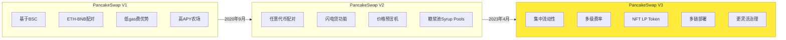

### 1.2 PancakeSwap V3发布背景

PancakeSwap V3于2023年4月在BNB Chain上发布，具有以下重要意义：

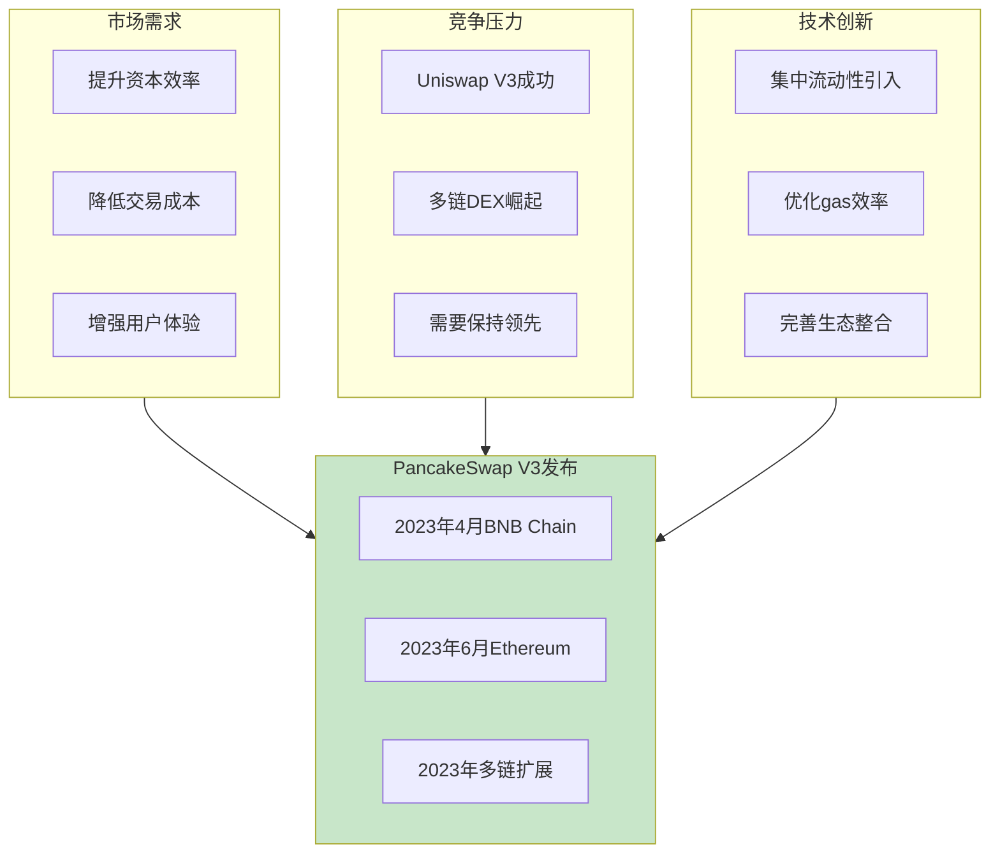

### 1.3 关键时间节点

| 时间 | 事件 | 意义 |
|------|------|------|
| 2020.09 | PancakeSwap V1上线 | BSC首个AMM DEX |
| 2021.03 | PancakeSwap V2发布 | 引入任意代币对 |
| 2023.04 | V3在BNB Chain上线 | 集中流动性革命 |
| 2023.06 | V3扩展到Ethereum | 多链战略开始 |
| 2023.09 | V3扩展到Aptos | 非EVM链探索 |
| 2024.01 | V3优化升级 | Gas效率提升 |

---

## 2. 集中流动性：V3的核心创新

### 2.1 传统AMM的局限性

在理解集中流动性之前，先回顾传统AMM（V1/V2）的问题：

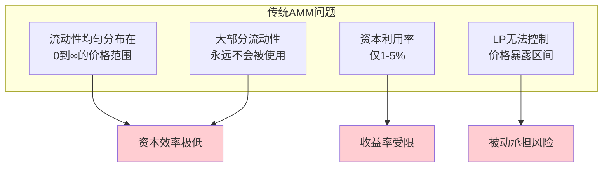

**资本利用率问题示例**：

假设CAKE/BNB交易对，当前价格为20 BNB/CAKE：
- 在传统AMM中，流动性分布在价格区间 [0, ∞]
- 但90%的交易发生在 [18, 22] 价格区间
- 这意味着**大约10%的流动性在处理90%的交易量**

### 2.2 集中流动性原理

集中流动性允许流动性提供者（LP）将资金集中在**自定义的价格区间**内：

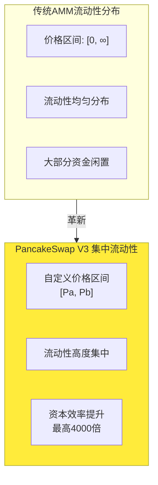

### 2.3 集中流动性的数学基础

**集中流动性公式**（在价格区间 [Pa, Pb] 内）：

```
(x + L/√Pb) × (y + L×√Pa) = L²
```

其中：
- `L`: 流动性常数（Liquidity）
- `Pa`: 价格区间下界
- `Pb`: 价格区间上界
- `x`, `y`: 代币的虚拟储备量

### 2.4 三种价格位置的资产状态

```mermaid
stateDiagram-v2
    [*] --> BelowRange: P < Pa
    [*] --> InRange: Pa ≤ P ≤ Pb
    [*] --> AboveRange: P > Pb

    BelowRange --> OnlyToken0: 100% token0
    InRange --> MixedHolding: token0 + token1
    AboveRange --> OnlyToken1: 100% token1

    state BelowRange as "价格在区间下方"
    state InRange as "价格在区间内"
    state AboveRange as "价格在区间上方"
    state OnlyToken0 as "只持有Token0"
    state MixedHolding as "混合持有"
    state OnlyToken1 as "只持有Token1"

    note right of InRange
        流动性活跃
        可赚取交易费用
    end note

    note right of BelowRange
        流动性未激活
        等待价格上涨
    end note

    note right of AboveRange
        流动性未激活
        等待价格下跌
    end note
```

---

## 3. PancakeSwap V3的特色优势

### 3.1 多链部署战略

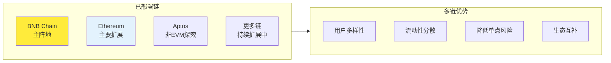

### 3.2 更灵活的费率结构

PancakeSwap V3在Uniswap V3基础上提供了更丰富的费率选择：

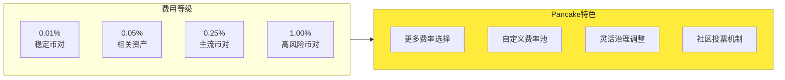

| 费率 | PancakeSwap | Uniswap | 差异 |
|------|-------------|---------|------|
| 0.01% | ✅ | ✅ | 相同 |
| 0.05% | ✅ | ✅ | 相同 |
| 0.25% | ✅ | - | Pancake独有 |
| 0.30% | ✅ | ✅ | Pancake 0.25% |
| 1.00% | ✅ | ✅ | 相同 |

### 3.3 与PancakeSwap生态的深度集成

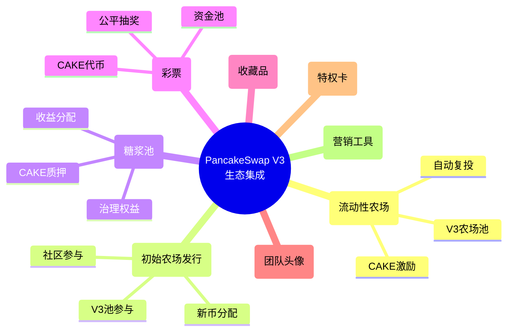

### 3.4 CAKE治理代币

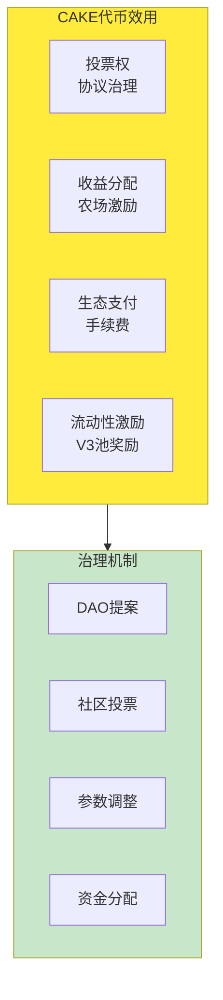

---

## 4. PancakeSwap V3 vs Uniswap V3

### 4.1 核心差异对比

| 方面 | PancakeSwap V3 | Uniswap V3 |
|------|----------------|------------|
| **部署链** | BNB Chain、Ethereum、Aptos等 | Ethereum、Arbitrum、Optimism等 |
| **费率层级** | 0.01%、0.05%、0.25%、1.00% | 0.01%、0.05%、0.30%、1.00% |
| **治理代币** | CAKE | UNI |
| **费用分配** | 灵活的协议费率 | 固定协议费率 |
| **Gas成本** | BNB Chain上极低 | Ethereum上较高 |
| **生态整合** | 农场、IFO、Lottery等深度整合 | 相对独立 |
| **社区驱动** | 强调社区参与 | 团队主导 |

### 4.2 选择指南

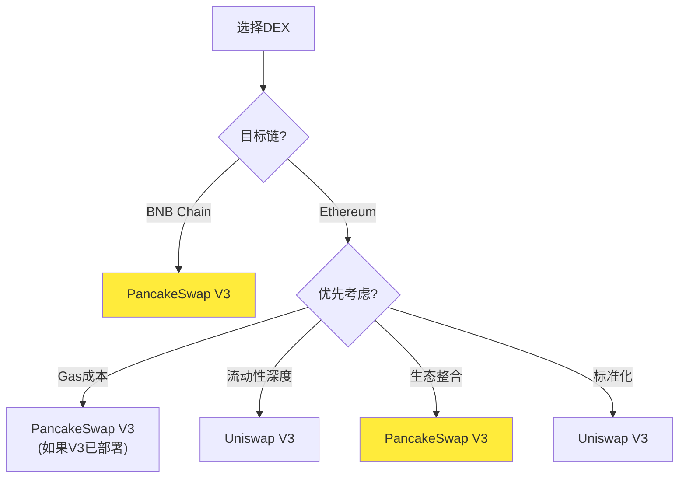

**选择PancakeSwap V3的场景**：
- 交易在BNB Chain上进行
- 需要极低的gas成本
- 想要参与PancakeSwap生态（农场、IFO等）
- 重视社区治理参与
- 使用CAKE作为主要资产

**选择Uniswap V3的场景**：
- 交易在Ethereum主网上进行
- 需要最大的流动性深度
- 重视协议的标准化程度
- 机构级应用需求

---

## 5. PancakeSwap V3的技术特色

### 5.1 Gas优化

PancakeSwap V3在BNB Chain上天然享有gas优势：

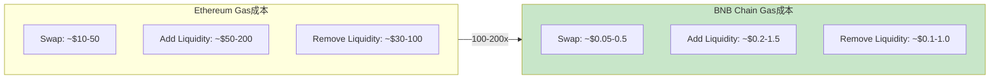

### 5.2 代码优化

PancakeSwap V3在Uniswap V3基础上进行了代码优化：

```solidity
// PancakeSwap V3的优化示例
contract PancakeV3Pool is IERC721, IUniswapV3PoolState {
    // 1. 更优化的存储布局
    struct Slot0 {
        uint160 sqrtPriceX96;
        int24 tick;
        uint16 observationIndex;
        uint16 observationCardinality;
        uint16 observationCardinalityNext;
        uint8 feeProtocol;
        bool unlocked;
    }

    // 2. 改进的gas优化
    modifier lock() {
        require(unlocked, "LOCKED");
        unlocked = false;
        _;
        unlocked = true;
    }
}
```

### 5.3 向后兼容性

PancakeSwap V3保持了与V2的兼容性：


---

## 6. PancakeSwap V3的实际应用

### 6.1 使用场景

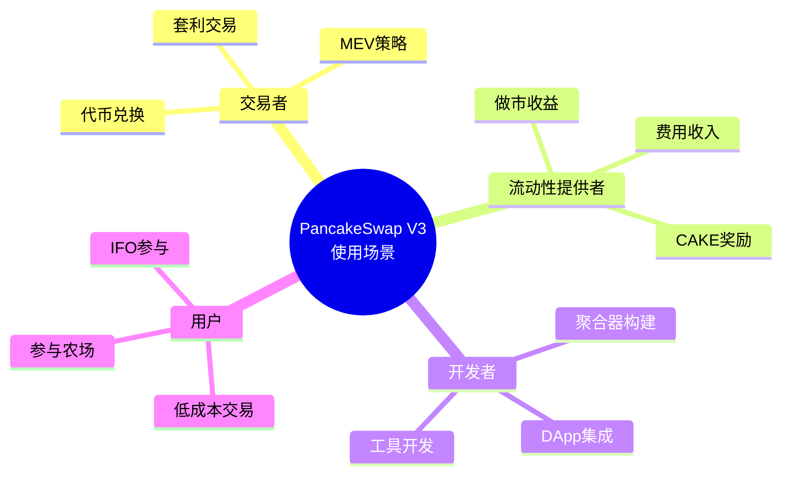

### 6.2 成功案例

1. **稳定币交易**：USDT/USDC池提供极低费率（0.01%）
2. **主流币对**：CAKE/BNB、ETH/BNB等提供深度流动性
3. **新币发行**：通过IFO与V3池结合，提高流动性效率
4. **跨链套利**：利用多链部署进行跨链套利

---

## 7. 本章小结

### 7.1 PancakeSwap V3核心特点

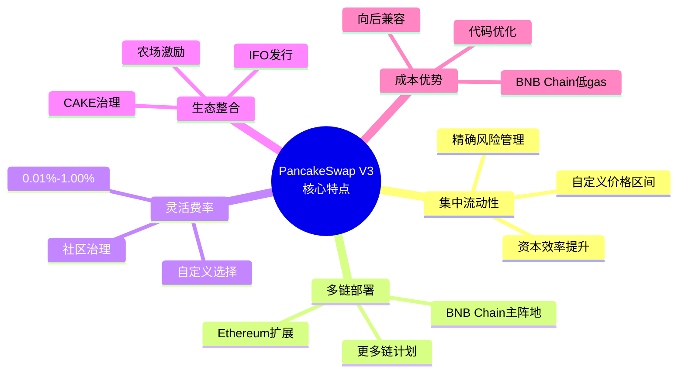

### 7.2 关键概念回顾

| 概念 | 定义 | 重要性 |
|------|------|--------|
| 集中流动性 | LP在自定义价格区间提供流动性 | V3的核心创新 |
| 多链部署 | 同时在多个区块链上运行 | Pancake的战略优势 |
| 灵活费率 | 支持多种费率等级选择 | 适应不同需求 |
| CAKE治理 | 通过CAKE代币参与协议治理 | 社区驱动特色 |
| 生态整合 | 与农场、IFO等深度集成 | 提供完整DeFi体验 |

---

## 下一篇预告

在下一篇文章中，我们将深入探讨**Tick机制与价格数学**，包括：
- Tick的数学定义与设计原理
- 价格与Tick的双向转换算法
- Q64.96定点数格式详解
- PancakeSwap V3中的TickMath库实现

---

## 参考资料

- [PancakeSwap V3 官方文档](https://docs.pancakeswap.finance/)
- [PancakeSwap V3 Core 源码](https://github.com/pancakeswap/pancake-v3-core)
- [PancakeSwap V3 白皮书](https://docs.pancakeswap.finance/developers/smart-contracts/v3-contracts)
- [PancakeSwap V3 vs Uniswap V3 对比](https://docs.pancakeswap.finance/products/pancakeswap-exchange/v3)
