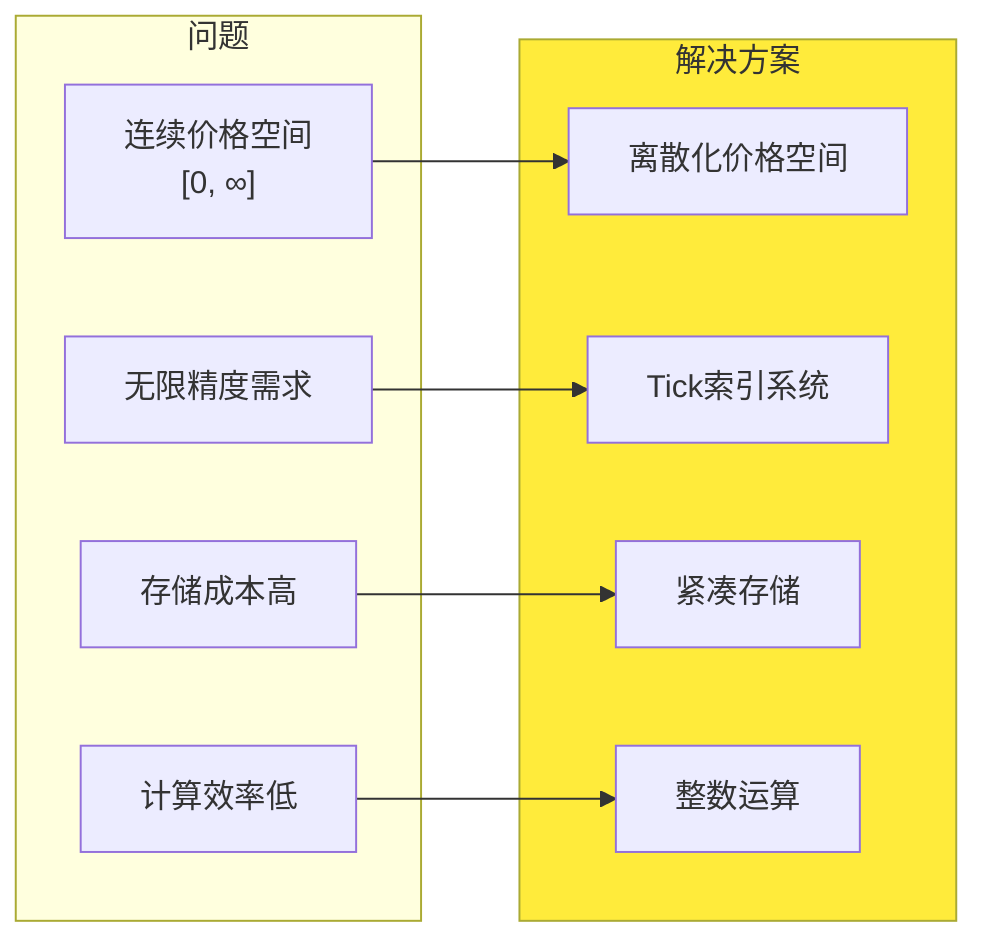
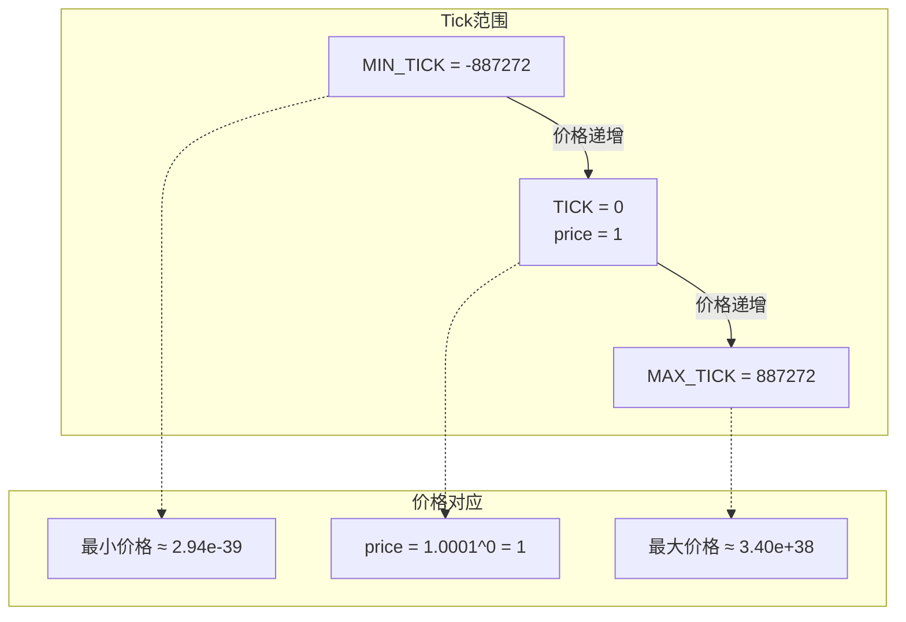
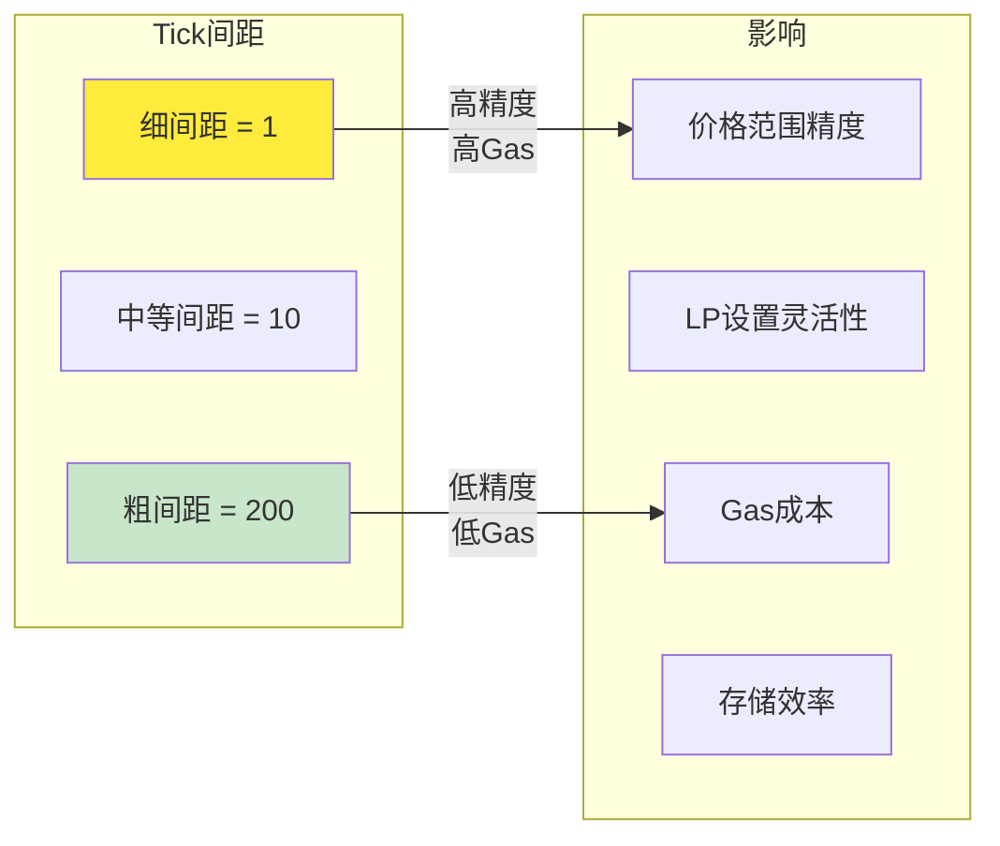
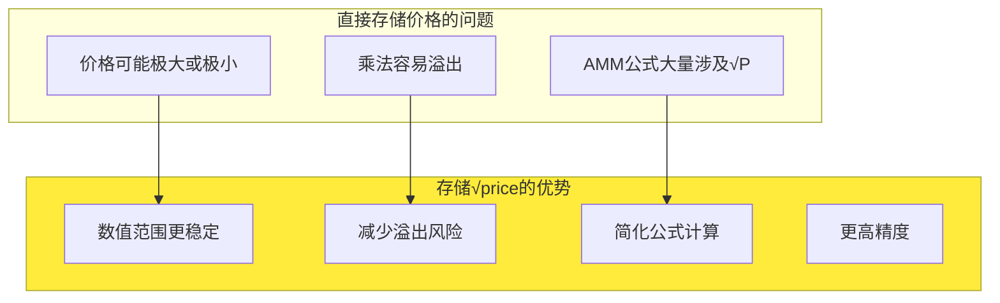
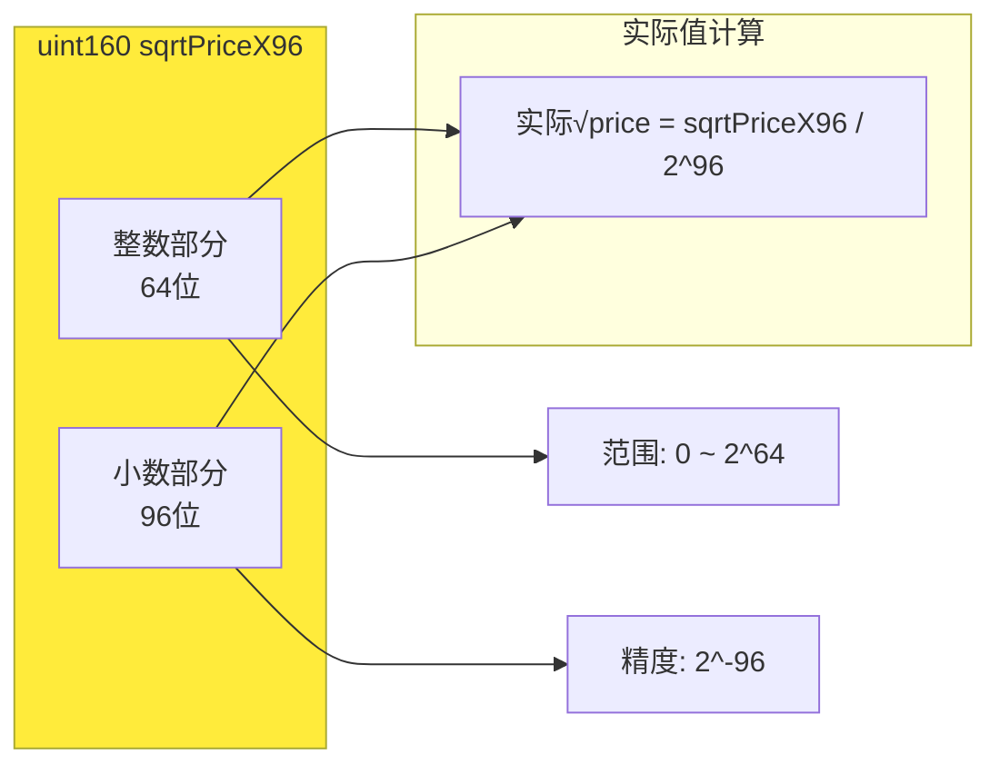
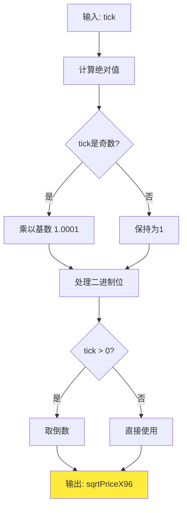
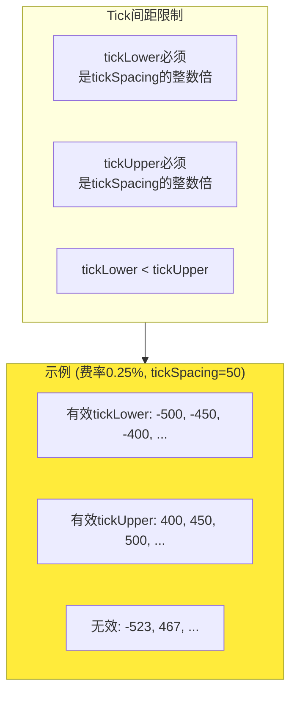
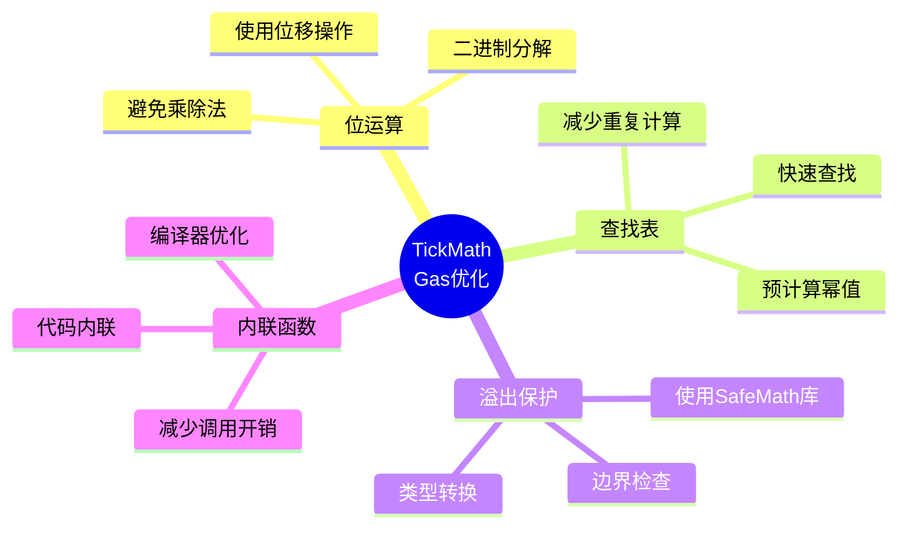
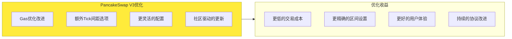
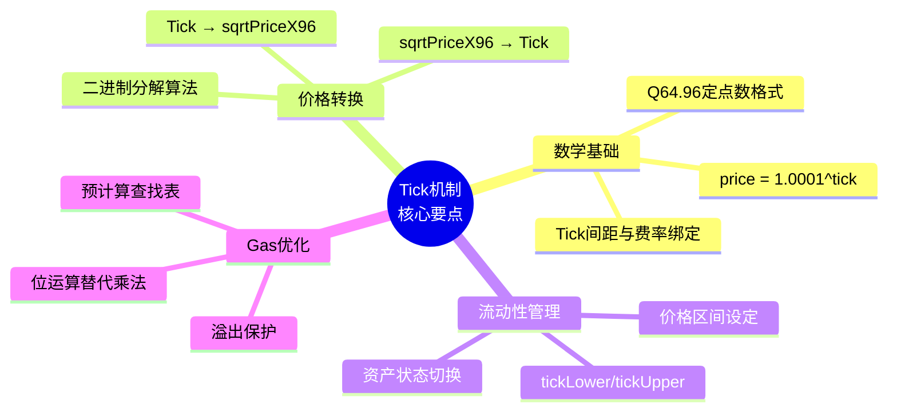

# 死磕PancakeSwap V3（二）：Tick机制与价格数学

> 本文是「死磕PancakeSwap V3」系列的第二篇，深入探讨Tick机制的设计原理和价格数学的核心算法。

## 系列导航

| 序号 | 标题 | 核心内容 |
|------|------|----------|
| 01 | PancakeSwap V3概述 | 发展历程、集中流动性、V3特色 |
| **02** | **Tick机制与价格数学** | **Tick设计、价格转换算法** |
| 03 | 架构与合约设计 | Factory、Pool合约结构 |
| 04 | 交换机制深度解析 | swap函数、价格发现 |
| 05 | 流动性管理与头寸 | Position、mint/burn |
| 06 | 费用系统与预言机 | 费用分配、TWAP |
| 07 | V3与Uniswap V3对比 | 差异点、优化、适用场景 |
| 08 | 多链部署与特性适配 | BNB Chain、Ethereum、跨链策略 |
| 09 | 集成开发指南 | SDK使用、交易构建、最佳实践 |
| 10 | MEV与套利策略 | JIT、三明治攻击、防范策略 |

---

## 1. Tick机制概述

### 1.1 为什么需要Tick？

在传统AMM中，价格是连续的实数。但在区块链上，我们需要：
- **高效存储**：连续价格需要无限存储
- **快速计算**：整数运算远快于浮点运算
- **精确定位**：方便LP设定价格区间边界



### 1.2 Tick的数学定义

**核心公式**：
```
price = 1.0001^tick
```

这意味着：
- 每个Tick代表**0.01%**的价格变化
- 相邻Tick的价格比为 **1.0001**（即100.01%）



### 1.3 Tick间距（Tick Spacing）

PancakeSwap V3支持不同的Tick间距，与费率等级绑定：

| 费率 | Tick间距 | 最小价格变化 | PancakeSwap特点 |
|------|----------|--------------|-----------------|
| 0.01% | 1 | 0.01% | 适用于稳定币对 |
| 0.05% | 10 | 0.10% | 适用于相关资产 |
| 0.25% | 50 | 0.50% | PancakeSwap独有 |
| 1.00% | 200 | 2.00% | 适用于高风险资产 |

**Tick间距的意义**：



---

## 2. 价格的平方根表示

### 2.1 为什么使用√price？

PancakeSwap V3不直接存储价格，而是存储**价格的平方根**（sqrtPrice）：



### 2.2 Q64.96定点数格式

PancakeSwap V3使用**Q64.96定点数**格式存储√price：



**格式优势**：
- **精度**：2^-96 ≈ 1.26×10^-29，足以满足金融计算需求
- **范围**：uint160可存储所有可能的√price值
- **效率**：避免浮点运算，使用整数运算

---

## 3. 价格与Tick的双向转换

### 3.1 从Tick到价格

```solidity
// PancakeSwap V3 - TickMath库
function getSqrtRatioAtTick(int24 tick) internal pure returns (uint160) {
    require(tick >= MIN_TICK, "T");
    require(tick <= MAX_TICK, "T");

    uint256 absTick = tick < 0 ? uint256(-int256(tick)) : uint256(int256(tick));

    uint256 ratio = absTick & 0x1 != 0 ? 0xfffcb933bd6fad37aa2d162d1a594001 : 0x100000000000000000000000000000000;
    if (absTick & 0x2 != 0) ratio = (ratio * 0xfff97272373d413259a46990580e213a) >> 128;
    if (absTick & 0x4 != 0) ratio = (ratio * 0xfff2e50f5f656932ef12357cf3c7fdcc) >> 128;
    // ... 更多二进制分解

    if (tick > 0) ratio = type(uint256).max / ratio;

    return uint160((ratio >> 32) + (ratio % (1 << 32) == 0 ? 0 : 1));
}
```

**算法核心**：



### 3.2 从价格到Tick

```solidity
function getTickAtSqrtRatio(uint160 sqrtPriceX96) internal pure returns (int24 tick) {
    require(sqrtPriceX96 >= MIN_SQRT_RATIO, "R");
    require(sqrtPriceX96 < MAX_SQRT_RATIO, "R");

    uint256 ratio = sqrtPriceX96 << 32;

    uint256 r = ratio;
    uint256 msb = 0;

    assembly {
        let f := shl(7, gt(r, 0xFFFFFFFFFFFFFFFFFFFFFFFFFFFFFFFF))
        msb := or(msb, f)
        r := shr(f, r)
        // ... 位运算计算最高有效位
    }

    // 精确计算tick
    tick = int24(log2(ratio) / log2(1.0001));

    // 调整边界
    if (tick < 0 && getSqrtRatioAtTick(tick) > sqrtPriceX96) {
        tick--;
    }
}
```

### 3.3 实际示例

**示例1：计算Tick=0对应的价格**

```solidity
tick = 0
price = 1.0001^0 = 1
sqrtPrice = sqrt(1) = 1
sqrtPriceX96 = 1 * 2^96 ≈ 79228162514264337593543950336
```

**示例2：计算Tick=88000对应的价格**

```solidity
tick = 88000
price = 1.0001^88000 ≈ 5975.88
sqrtPrice = sqrt(5975.88) ≈ 77.30
sqrtPriceX96 = 77.30 * 2^96 ≈ 6125124126885564738730673942912
```

---

## 4. Tick在流动性管理中的应用

### 4.1 LP的价格区间设定

流动性提供者通过设定tickLower和tickUpper来定义价格区间：

```solidity
struct Position {
    uint128 liquidity;      // 流动性数量
    int24 tickLower;        // 下界Tick
    int24 tickUpper;        // 上界Tick
    // ... 其他字段
}
```

**区间限制**：



### 4.2 价格区间与资产状态

```mermaid
stateDiagram-v2
    [*] --> BelowRange: 当前tick < tickLower
    [*] --> InRange: tickLower ≤ tick ≤ tickUpper
    [*] --> AboveRange: tick > tickUpper

    BelowRange --> OnlyToken0: 只持有Token0
    InRange --> MixedHolding: 持有Token0 + Token1
    AboveRange --> OnlyToken1: 只持有Token1

    state BelowRange as "价格在区间下方"
    state InRange as "价格在区间内<br/>流动性活跃"
    state AboveRange as "价格在区间上方"
    state OnlyToken0 as "只持有Token0"
    state MixedHolding as "混合持有"
    state OnlyToken1 as "只持有Token1"

    note right of InRange
        可赚取交易费用
        资产会自动再平衡
    end note
```

---

## 5. PancakeSwap V3的TickMath库

### 5.1 核心常量定义

```solidity
library TickMath {
    // 最小Tick值
    int24 internal constant MIN_TICK = -887272;
    // 最大Tick值
    int24 internal constant MAX_TICK = 887272;

    // 最小sqrtPriceX96值
    uint160 internal constant MIN_SQRT_RATIO = 4295128739;
    // 最大sqrtPriceX96值
    uint160 internal constant MAX_SQRT_RATIO = 1461446703485210103287273052203988822378723970341;

    // 基数的平方根 = sqrt(1.0001)
    uint160 internal constant SQRT_RATIO_1_0001 = 7923311209327299069;
}
```

### 5.2 Gas优化技巧

PancakeSwap V3在TickMath中使用了多种Gas优化：



**优化示例**：

```solidity
// 不优化：使用乘法
uint256 result = ratio * 0xfffcb933bd6fad37aa2d162d1a594001;

// 优化：使用位运算
if (absTick & 0x1 != 0) {
    ratio = (ratio * 0xfffcb933bd6fad37aa2d162d1a594001) >> 128;
}
```

---

## 6. 实际应用示例

### 6.1 计算LP所需的代币数量

假设要在CAKE/BNB池添加流动性：
- 当前价格：20 BNB/CAKE (tick ≈ 72200)
- 区间：[18, 22] BNB/CAKE
- 流动性：L = 1000

```solidity
// 1. 将价格转换为tick
int24 tickLower = getSqrtRatioAtTick(sqrt(18) * 2^96);
int24 tickUpper = getSqrtRatioAtTick(sqrt(22) * 2^96);

// 2. 计算所需的代币数量
uint256 amountCake = L * (1/sqrt(18) - 1/sqrt(22));
uint256 amountBNB = L * (sqrt(22) - sqrt(18));

// 3. 结果
// amountCake ≈ 2.15 CAKE
// amountBNB ≈ 0.11 BNB
```

### 6.2 计算滑点

```solidity
// 当前价格
uint160 currentSqrtPriceX96 = getSqrtRatioAtTick(72200);

// 目标价格
int24 targetTick = 72300;
uint160 targetSqrtPriceX96 = getSqrtRatioAtTick(targetTick);

// 计算滑点
uint256 priceChange = (targetSqrtPriceX96 - currentSqrtPriceX96) * 10000 / currentSqrtPriceX96;

// 结果：约1%的价格变化
```

---

## 7. PancakeSwap V3 vs Uniswap V3的Tick机制

### 7.1 基本架构相同

| 特性 | PancakeSwap V3 | Uniswap V3 |
|------|----------------|------------|
| Tick公式 | price = 1.0001^tick | price = 1.0001^tick |
| sqrtPriceX96格式 | Q64.96 | Q64.96 |
| Tick范围 | [-887272, 887272] | [-887272, 887272] |
| TickMath库 | 基本相同 | 标准实现 |

### 7.2 PancakeSwap的优化



---

## 8. 本章小结

### 8.1 Tick机制核心要点



### 8.2 关键概念速查

| 概念 | 值/公式 | 说明 |
|------|---------|------|
| Tick范围 | [-887272, 887272] | 支持的价格范围 |
| 价格公式 | price = 1.0001^tick | Tick到价格的转换 |
| sqrtPriceX96格式 | Q64.96 | 64位整数 + 96位小数 |
| Tick间距 | 1/10/50/200 | 与费率等级绑定 |
| 精度 | 2^-96 | 足够金融计算 |

---

## 下一篇预告

在下一篇文章中，我们将深入探讨**架构与合约设计**，包括：
- PancakeSwap V3的整体架构
- Factory、Pool合约设计
- 核心库合约详解
- 合约间的交互流程

---

## 参考资料

- [PancakeSwap V3 Core 源码](https://github.com/pancakeswap/pancake-v3-core)
- [PancakeSwap V3 TickMath 实现](https://github.com/pancakeswap/pancake-v3-core/blob/main/contracts/libraries/TickMath.sol)
- [Uniswap V3 白皮书](https://uniswap.org/whitepaper-v3.pdf)
