# 死磕PancakeSwap V3（三）：架构与合约设计

> 本文是「死磕PancakeSwap V3」系列的第三篇，深入剖析V3的合约架构和核心数据结构设计。

## 系列导航

| 序号 | 标题 | 核心内容 |
|------|------|----------|
| 01 | PancakeSwap V3概述 | 发展历程、集中流动性、V3特色 |
| 02 | Tick机制与价格数学 | Tick设计、价格转换算法 |
| **03** | **架构与合约设计** | **Factory、Pool合约结构** |
| 04 | 交换机制深度解析 | swap函数、价格发现 |
| 05 | 流动性管理与头寸 | Position、mint/burn |
| 06 | 费用系统与预言机 | 费用分配、TWAP |
| 07 | V3与Uniswap V3对比 | 差异点、优化、适用场景 |
| 08 | 多链部署与特性适配 | BNB Chain、Ethereum、跨链策略 |
| 09 | 集成开发指南 | SDK使用、交易构建、最佳实践 |
| 10 | MEV与套利策略 | JIT、三明治攻击、防范策略 |

---

## 1. 整体架构概览

### 1.1 合约层次结构

PancakeSwap V3采用了模块化的架构设计，基于Uniswap V3架构进行了优化：

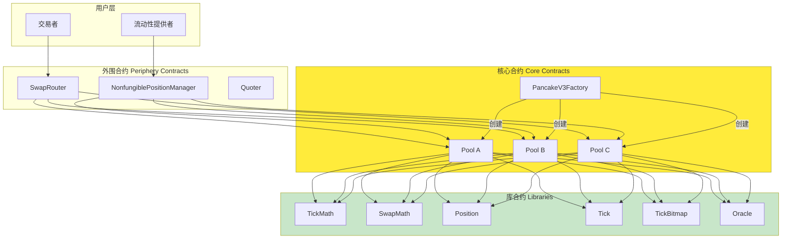

### 1.2 核心设计原则

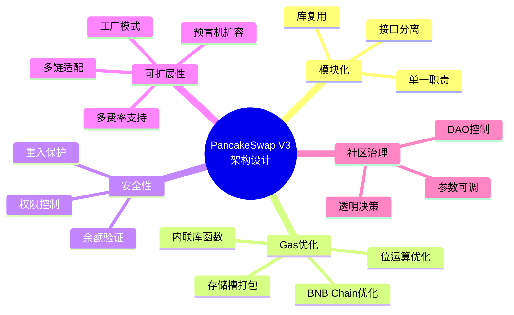

---

## 2. Factory合约：单例工厂模式

### 2.1 工厂合约的职责

Factory合约是整个协议的入口点，负责池子的创建和参数管理：

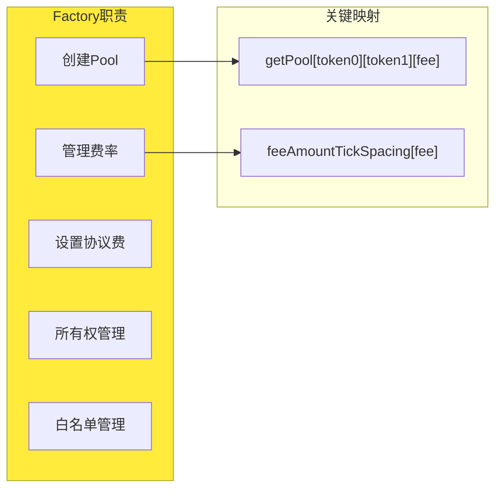

### 2.2 核心数据结构

```solidity
contract PancakeV3Factory is IPancakeV3Factory, PancakeV3PoolDeployer, NoDelegateCall {
    address public override owner;

    // 三层嵌套映射：确保每个代币对+费率只有一个池子
    mapping(address => mapping(address => mapping(uint24 => address))) public override getPool;

    // 费率与Tick间距的绑定关系
    mapping(uint24 => int24) public override feeAmountTickSpacing;

    constructor() {
        owner = msg.sender;
        emit OwnerChanged(address(0), msg.sender);

        // PancakeSwap V3 预设费率等级
        feeAmountTickSpacing[100] = 1;     // 0.01% fee (stable pairs)
        feeAmountTickSpacing[500] = 10;    // 0.05% fee
        feeAmountTickSpacing[2500] = 50;   // 0.25% fee (PancakeSwap特色)
        feeAmountTickSpacing[10000] = 200;  // 1.00% fee
    }
}
```

### 2.3 PancakeSwap的费率特色

PancakeSwap V3提供了比Uniswap V3更丰富的费率选择：

| 费率 | 费用值(bps) | Tick间距 | 适用场景 |
|------|-------------|----------|----------|
| 0.01% | 100 | 1 | 稳定币对（USDT/USDC） |
| 0.05% | 500 | 10 | 相关资产（WBTC/renBTC） |
| 0.25% | 2500 | 50 | 主流币对（CAKE/BNB）|
| 1.00% | 10000 | 200 | 高风险/长尾资产 |

**0.25%费率的优势**：

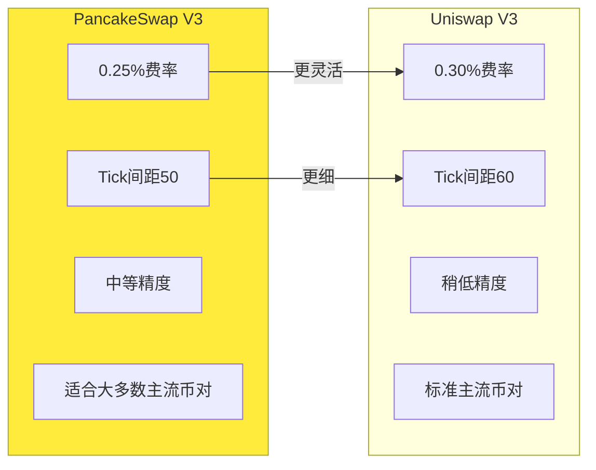

### 2.4 创建池子流程

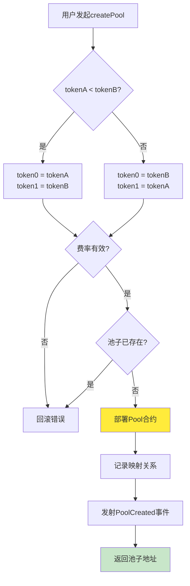

---

## 3. Pool合约：核心交易池

### 3.1 Pool合约的核心职责

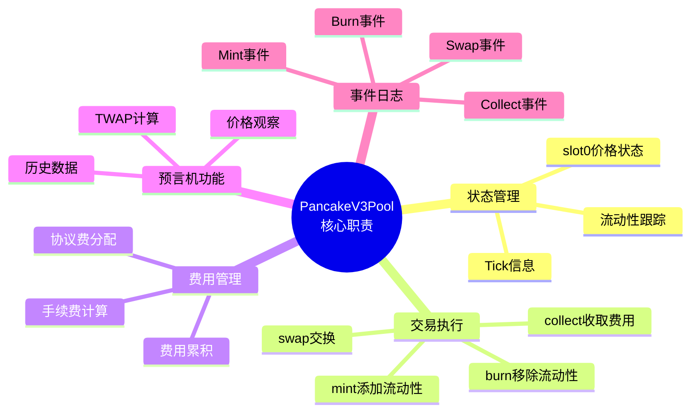

### 3.2 核心数据结构

```solidity
contract PancakeV3Pool is IPancakeV3Pool, NoDelegateCall {
    // 核心状态槽0：打包存储最常访问的数据
    struct Slot0 {
        uint160 sqrtPriceX96;     // 当前价格的平方根
        int24 tick;               // 当前tick
        uint16 observationIndex;  // 最新观察索引
        uint16 observationCardinality;  // 观察数
        uint16 observationCardinalityNext;  // 下一个观察数
        uint8 feeProtocol;       // 协议费率
        bool unlocked;           // 重入锁
    }

    Slot0 public override slot0;

    // 当前总流动性
    uint128 public override liquidity;

    // Tick信息映射
    mapping(int24 => Tick.Info) public override ticks;

    // 流动性头寸映射
    mapping(bytes32 => Position.Info) public override positions;

    // 预言机观察数据
    Observation[65535] public override observations;
}
```

### 3.3 Slot0结构优化

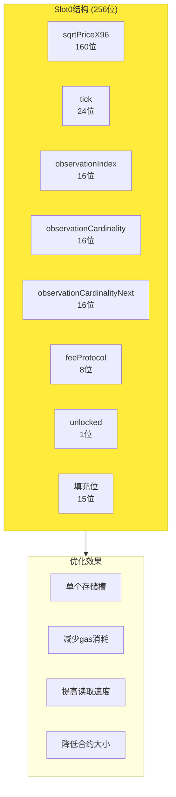

### 3.4 Tick数据结构

```solidity
library Tick {
    struct Info {
        uint128 liquidityGross;           // 该tick的总流动性（添加+移除）
        int128 liquidityNet;              // 该tick的净流动性（添加-移除）
        uint256 feeGrowthOutside0X128;    // tick外部token0费用增长
        uint256 feeGrowthOutside1X128;    // tick外部token1费用增长
        int56 tickCumulativeOutside;      // tick外部累计tick值
        uint160 secondsPerLiquidityOutsideX128;  // tick外部流动性时间
        uint32 secondsOutside;            // tick外部时间
        bool initialized;                 // 是否已初始化
    }
}
```

### 3.5 Position数据结构

```solidity
library Position {
    struct Info {
        uint128 liquidity;              // 该头寸的流动性
        uint256 feeGrowthInside0LastX128;  // 最后记录的费用增长(token0)
        uint256 feeGrowthInside1LastX128;  // 最后记录的费用增长(token1)
        uint128 tokensOwed0;            // 待领取的token0数量
        uint128 tokensOwed1;            // 待领取的token1数量
    }
}
```

---

## 4. 核心库合约

### 4.1 TickMath库

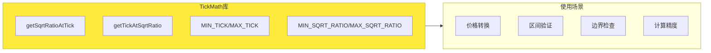

### 4.2 SwapMath库

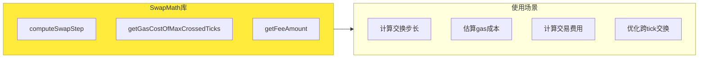

### 4.3 TickBitmap库

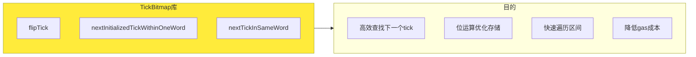

**TickBitmap原理**：

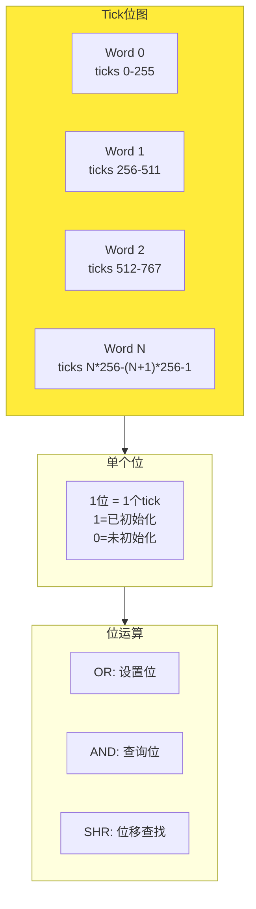

---

## 5. 外围合约设计

### 5.1 NonfungiblePositionManager

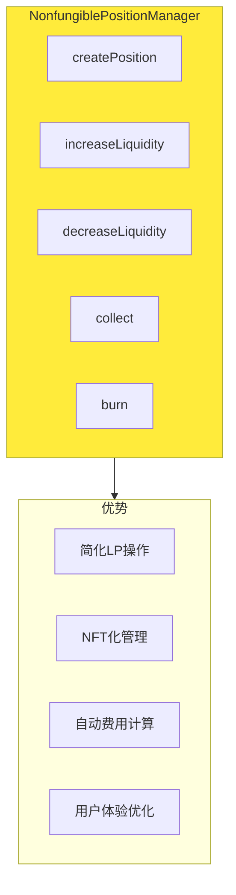

### 5.2 SwapRouter

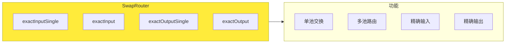

---

## 6. PancakeSwap V3的架构优化

### 6.1 Gas优化策略

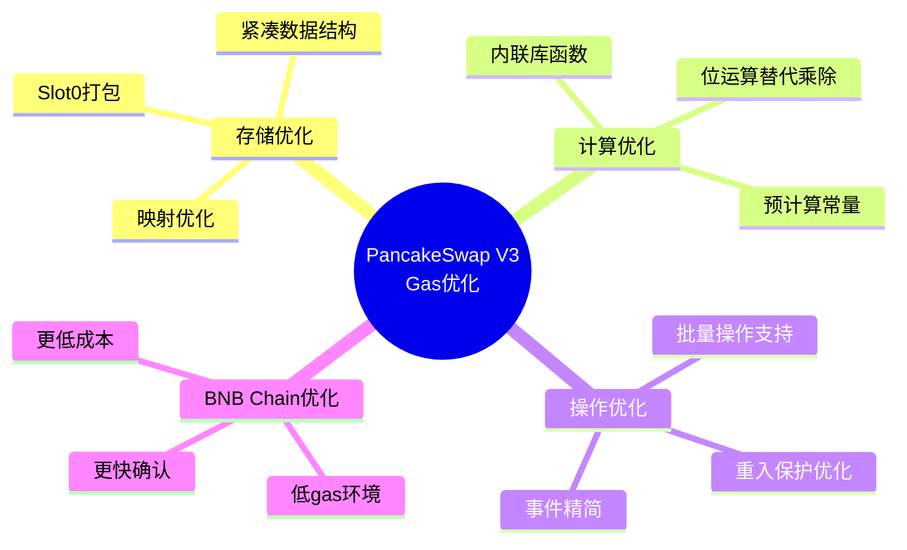

### 6.2 多链适配

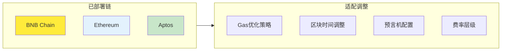

---

## 7. 合约交互流程

### 7.1 创建池子流程

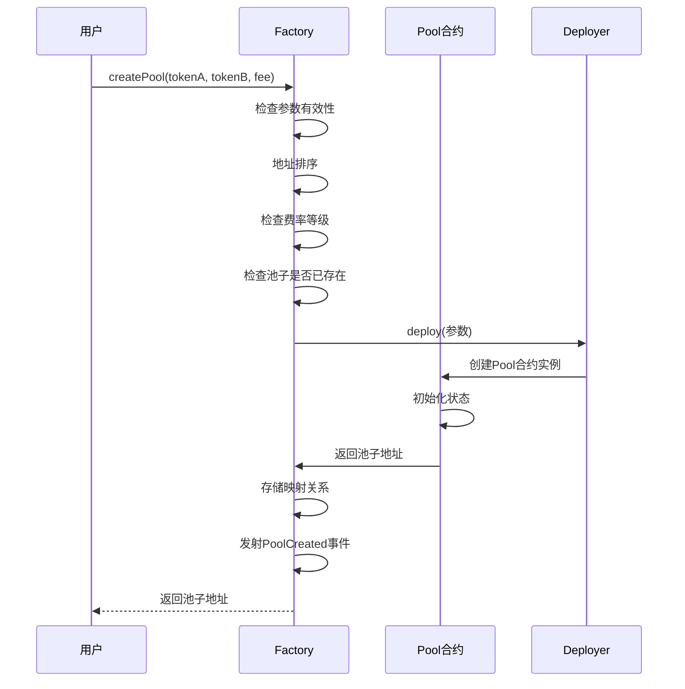

### 7.2 添加流动性流程

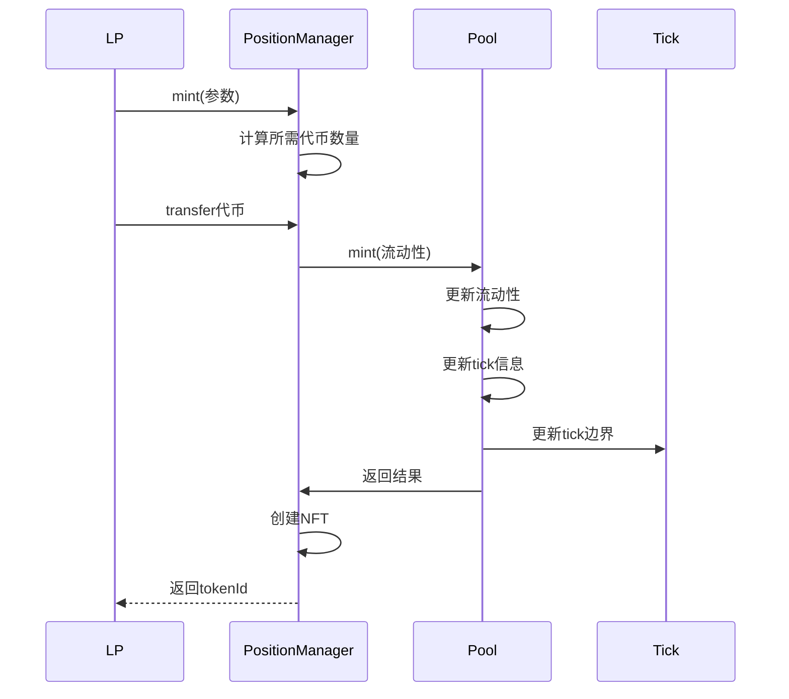

### 7.3 交易流程

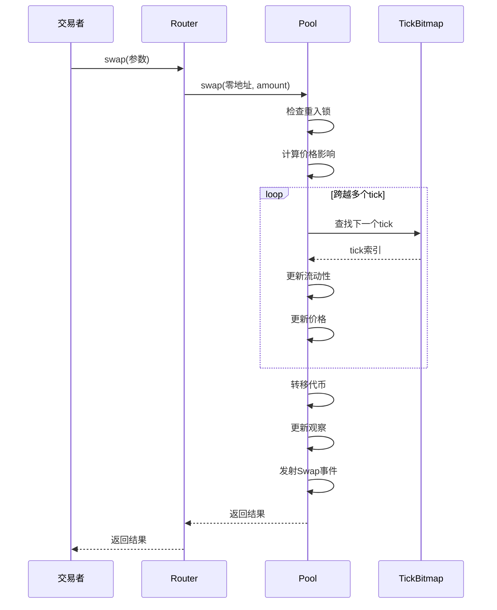

---

## 8. 本章小结

### 8.1 架构核心要点

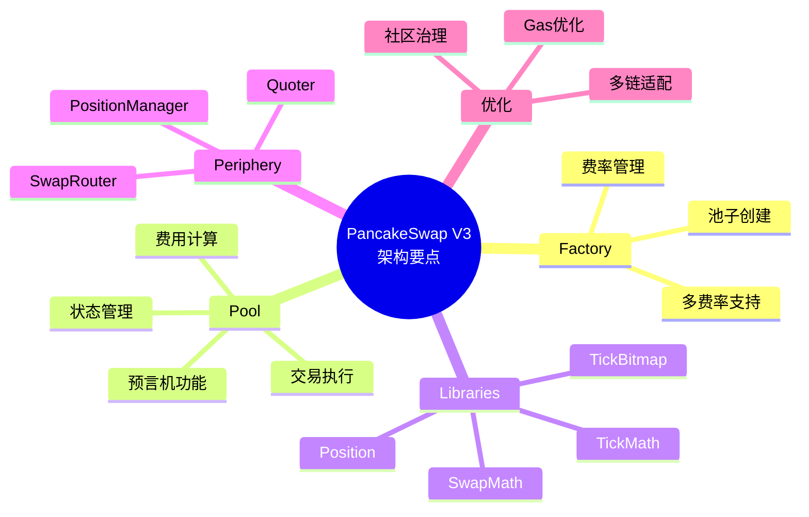

### 8.2 关键数据结构速查

| 结构 | 位置 | 用途 |
|------|------|------|
| Slot0 | Pool | 核心状态（价格、tick等）|
| Position.Info | Pool | 流动性头寸信息 |
| Tick.Info | Pool | Tick级别数据 |
| Observation | Pool | 预言机观察数据 |

---

## 下一篇预告

在下一篇文章中，我们将深入探讨**V3与Uniswap V3对比**，包括：
- 架构差异对比
- 代码优化分析
- Gas效率对比
- 适用场景选择

---

## 参考资料

- [PancakeSwap V3 Core 源码](https://github.com/pancakeswap/pancake-v3-core)
- [PancakeSwap V3 Periphery 源码](https://github.com/pancakeswap/pancake-v3-periphery)
- [PancakeSwap V3 架构文档](https://docs.pancakeswap.finance/developers/smart-contracts/v3-contracts)
