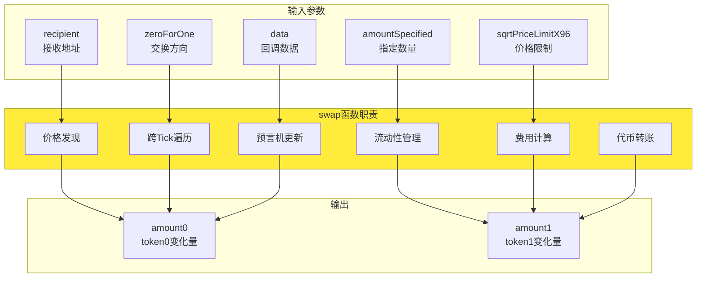
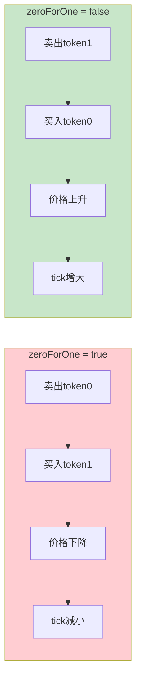
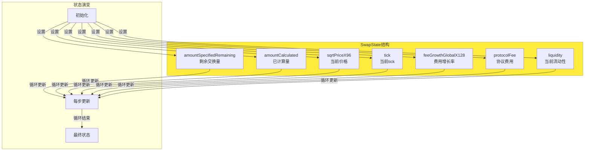
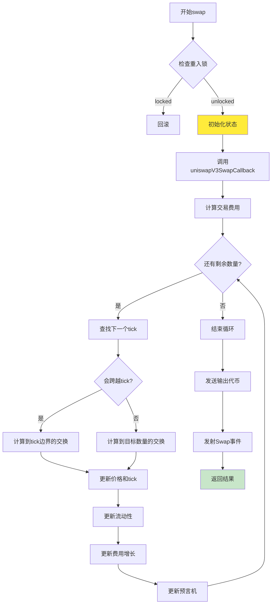
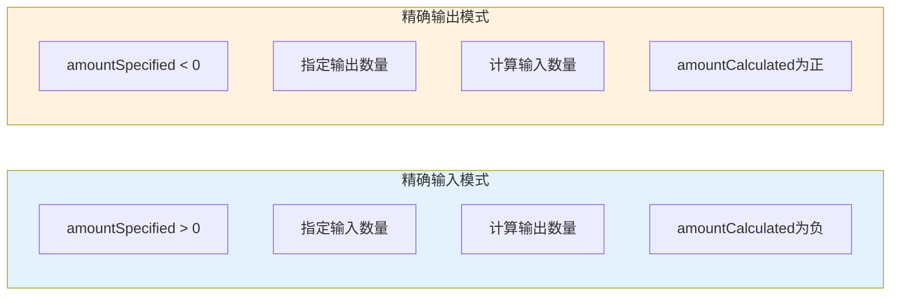
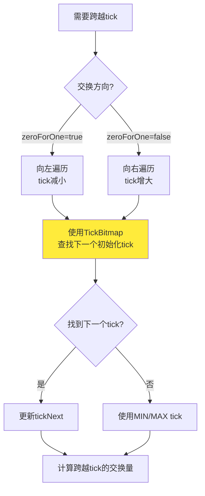
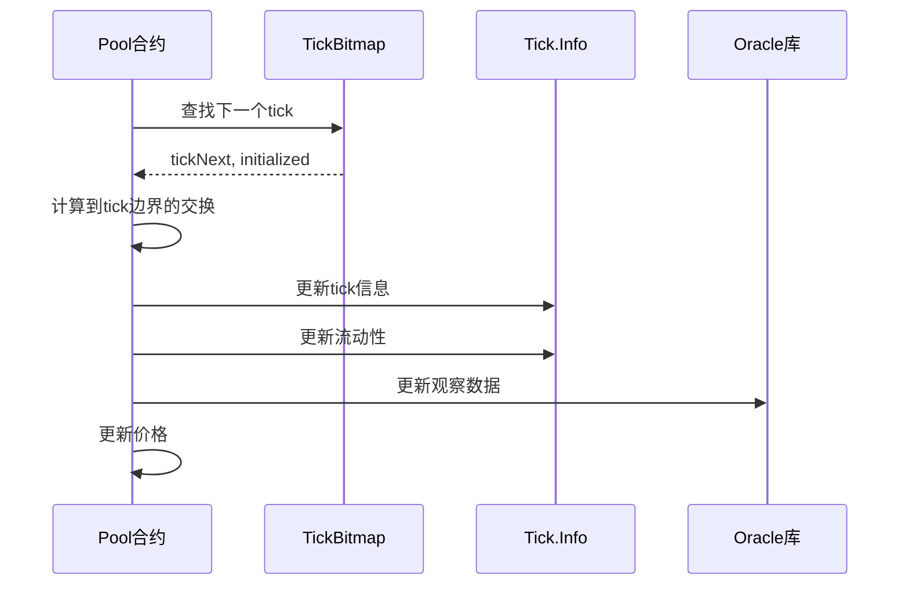
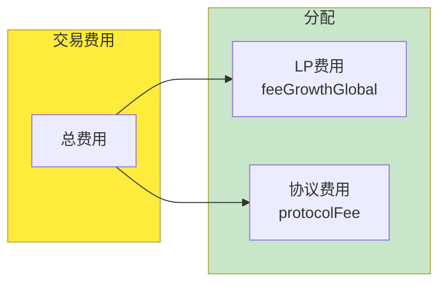
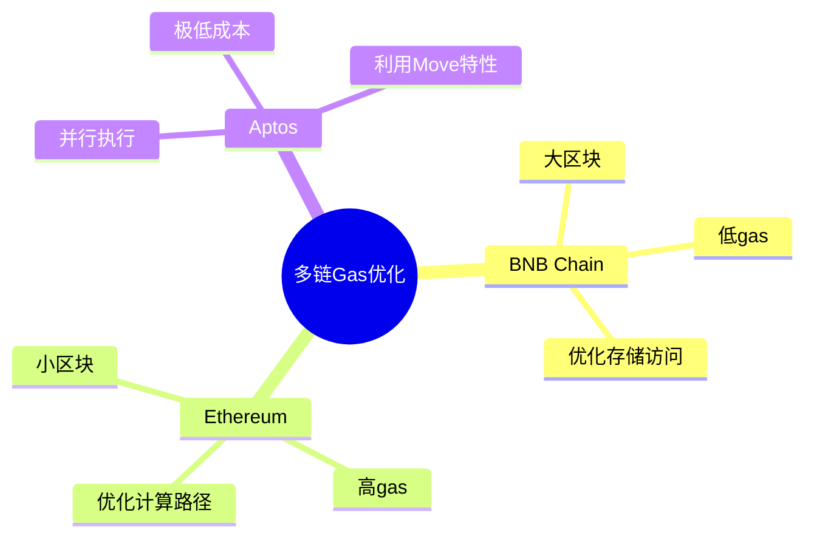
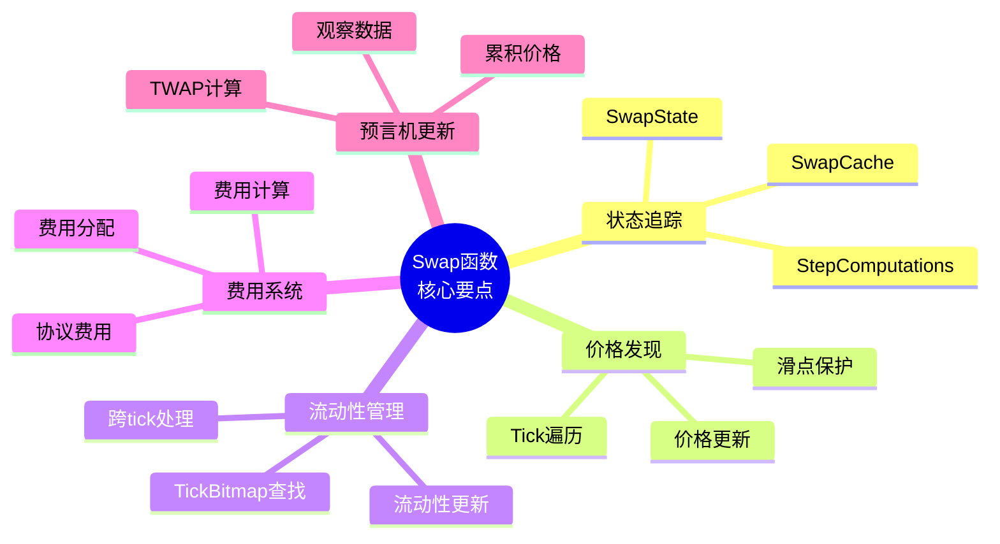

# 死磕PancakeSwap V3（四）：交换机制深度解析

> 本文是「死磕PancakeSwap V3」系列的第四篇，深入剖析V3的核心交换函数swap()的完整执行流程。

## 系列导航

| 序号 | 标题 | 核心内容 |
|------|------|----------|
| 01 | PancakeSwap V3概述 | 发展历程、集中流动性、V3特色 |
| 02 | Tick机制与价格数学 | Tick设计、价格转换算法 |
| 03 | 架构与合约设计 | Factory、Pool合约结构 |
| **04** | **交换机制深度解析** | **swap函数、价格发现** |
| 05 | 流动性管理与头寸 | Position、mint/burn |
| 06 | 费用系统与预言机 | 费用分配、TWAP |
| 07 | V3与Uniswap V3对比 | 差异点、优化、适用场景 |
| 08 | 多链部署与特性适配 | BNB Chain、Ethereum、跨链策略 |
| 09 | 集成开发指南 | SDK使用、交易构建、最佳实践 |
| 10 | MEV与套利策略 | JIT、三明治攻击、防范策略 |

---

## 1. 交换函数概览

### 1.1 swap函数的核心职责

swap函数是PancakeSwap V3中最复杂也最核心的函数，负责处理所有代币交换逻辑：



### 1.2 函数签名详解

```solidity
function swap(
    address recipient,          // 输出代币接收地址
    bool zeroForOne,           // true: token0→token1, false: token1→token0
    int256 amountSpecified,    // 正数=精确输入, 负数=精确输出
    uint160 sqrtPriceLimitX96, // 价格滑点保护限制
    bytes calldata data        // 回调函数的附加数据
) external override noDelegateCheck returns (
    int256 amount0,            // token0的净变化量
    int256 amount1             // token1的净变化量
);
```

**参数含义详解**：

| 参数 | 类型 | 说明 |
|------|------|------|
| recipient | address | 接收输出代币的地址 |
| zeroForOne | bool | 交换方向标志 |
| amountSpecified | int256 | 正数=exactInput，负数=exactOutput |
| sqrtPriceLimitX96 | uint160 | 最大允许的价格变动 |
| data | bytes | 传递给回调函数的数据 |

### 1.3 交换方向与价格关系



---

## 2. 核心数据结构

### 2.1 SwapState：交换状态追踪

SwapState结构体在整个交换循环中追踪状态变化：

```solidity
struct SwapState {
    // 剩余待交换的数量
    int256 amountSpecifiedRemaining;

    // 已计算的对应数量
    int256 amountCalculated;

    // 当前价格
    uint160 sqrtPriceX96;

    // 当前tick
    int24 tick;

    // 输入代币的全局费用增长率
    uint256 feeGrowthGlobalX128;

    // 协议费用累积
    uint128 protocolFee;

    // 当前有效流动性
    uint128 liquidity;
}
```



### 2.2 SwapCache：交换缓存

SwapCache存储交换过程中不变或很少变化的数据：

```solidity
struct SwapCache {
    // 交换开始时的流动性
    uint128 liquidityStart;

    // 区块时间戳
    uint32 blockTimestamp;

    // 交易前一刻的价格
    uint160 sqrtPriceX96;

    // 交易前一刻的tick
    int24 tick;

    // 交易开始时的观察索引
    uint16 observationIndex;

    // 交易前的累计价格（预言机）
    int56 tickCumulative;

    // 交易前的秒/流动性累积
    uint160 secondsPerLiquidityCumulativeX128;
}
```

### 2.3 StepComputations：单步计算

```solidity
struct StepComputations {
    // 下一个tick
    int24 tickNext;

    // 下一个tick的sqrtPrice
    uint160 sqrtPriceNextX96;

    // 本步的起始sqrtPrice
    uint160 sqrtPriceStartX96;

    // 本步的流动性
    uint128 liquidity;

    // 本步的费用
    uint256 feeAmount;

    // 跨越tick后的tick边界
    int24 tickNext;
}
```

---

## 3. 交换流程详解

### 3.1 完整流程图



### 3.2 精确输入 vs 精确输出



**代码逻辑**：

```solidity
// 判断交换类型
bool exactInput = amountSpecified > 0;

// 精确输入：指定输入，计算输出
if (exactInput) {
    state.amountSpecifiedRemaining = amountSpecified;
    state.amountCalculated = type(int256).min;
}
// 精确输出：指定输出，计算输入
else {
    state.amountSpecifiedRemaining = -amountSpecified;
    state.amountCalculated = type(int256).max;
}
```

---

## 4. 跨Tick遍历算法

### 4.1 Tick查找策略



### 4.2 TickBitmap查找算法

```solidity
// 使用TickBitmap高效查找下一个tick
(int24 tickNext, bool initialized) =
    TickBitmap.nextInitializedTickWithinOneWord(
        state.tick,
        tickSpacing,
        zeroForOne
    );
```

**查找效率**：

```mermaid
graph LR
    subgraph LinearSearch["线性查找"]
        L1[复杂度: O{n}]
        L2[遍历每个tick]
        L3[Gas成本高]
    end

    subgraph BitmapSearch["位图查找"]
        B1[复杂度: O{1}]
        B2[位运算快速定位]
        B3[Gas成本低]
    end

    style BitmapSearch fill:#c8e6c9
    style LinearSearch fill:#ffcdd2
```

### 4.3 跨越Tick的处理



---

## 5. 价格发现机制

### 5.1 价格更新算法

```solidity
// 根据交换量更新价格
step.sqrtPriceNextX96 = SwapMath.getNextSqrtPriceFromInput(
    state.sqrtPriceX96,
    state.liquidity,
    state.amountSpecifiedRemaining,
    zeroForOne
);
```

**数学原理**：

```
假设：
- 当前价格：P_cur
- 交换量：Δx (输入token0)
- 流动性：L
- 新价格：P_new

如果 zeroForOne = true (卖出token0)：
Δy = L × (√P_cur - √P_new)
P_new = (L / (L + Δx))² × P_cur

如果 zeroForOne = false (卖出token1)：
Δx = L × (1/√P_cur - 1/√P_new)
P_new = (L / (L - Δy))² × P_cur
```

### 5.2 滑点保护

```solidity
// 检查价格是否超出限制
if (zeroForOne) {
    require(
        state.sqrtPriceX96 >= sqrtPriceLimitX96,
        "price limit"
    );
} else {
    require(
        state.sqrtPriceX96 <= sqrtPriceLimitX96,
        "price limit"
    );
}
```

**滑点计算示例**：

```javascript
// 计算最大允许滑点
const slippageTolerance = 0.005; // 0.5%
const minOutput = expectedOutput * (1 - slippageTolerance);

// 设置sqrtPriceLimitX96
const sqrtPriceLimitX96 = Math.sqrt(
    currentPrice * (1 - slippageTolerance)
) * (2 ** 96);
```

---

## 6. 费用计算与分配

### 6.1 费用计算

```solidity
// 计算本步的费用
step.feeAmount = FullMath.mulDiv(
    step.amountIn,           // 输入数量
    fee,                      // 费率（如500 = 0.05%）
    1e6                       // 基数
);
```

**费率对应关系**：

| 费率 | fee值 | 百分比 |
|------|-------|--------|
| 0.01% | 100 | 100/1,000,000 |
| 0.05% | 500 | 500/1,000,000 |
| 0.25% | 2500 | 2,500/1,000,000 |
| 1.00% | 10000 | 10,000/1,000,000 |

### 6.2 费用分配

```solidity
// 更新全局费用增长率
if (state.liquidity > 0) {
    state.feeGrowthGlobalX128 += FullMath.mulDiv(
        step.feeAmount,           // 本步产生的费用
        FixedPoint128.Q128,       // 2^128 归一化因子
        state.liquidity           // 当前活跃流动性
    );
}
```

**分配逻辑**：



---

## 7. PancakeSwap V3的优化

### 7.1 Gas优化策略

| 优化项 | PancakeSwap V3 | Uniswap V3 |
|--------|----------------|------------|
| **Tick查找** | 优化的位运算 | 标准位运算 |
| **费用计算** | 减少乘除法 | 标准计算 |
| **状态更新** | 紧凑存储 | 标准存储 |
| **循环优化** | 减少分支 | 标准逻辑 |

### 7.2 多链适配优化



---

## 8. 实际应用示例

### 8.1 简单Swap示例

```javascript
// 使用PancakeSwap V3 SDK
import { PancakeV3Router } from '@pancakeswap/sdk';

const router = new PancakeV3Router(routerAddress, provider);

// 精确输入：指定输入，接受输出
const tx = await router.exactInputSingle({
    tokenIn: CAKE_ADDRESS,
    tokenOut: WBNB_ADDRESS,
    fee: 2500,  // 0.25%
    recipient: userAddress,
    amountIn: ethers.utils.parseEther('100'),
    amountOutMinimum: ethers.utils.parseEther('4.9'),  // 滑点保护
    sqrtPriceLimitX96: 0
});

await tx.wait();
```

### 8.2 多跳Swap示例

```javascript
// 多跳路径：CAKE -> WBNB -> USDT
const tx = await router.exactInput({
    path: [
        {
            tokenIn: CAKE_ADDRESS,
            tokenOut: WBNB_ADDRESS,
            fee: 2500
        },
        {
            tokenIn: WBNB_ADDRESS,
            tokenOut: USDT_ADDRESS,
            fee: 500
        }
    ],
    recipient: userAddress,
    amountIn: ethers.utils.parseEther('100'),
    amountOutMinimum: ethers.utils.parseUnits('995', 6),
    sqrtPriceLimitX96: 0
});
```

---

## 9. 本章小结

### 9.1 Swap函数核心要点



### 9.2 关键函数速查

| 函数 | 功能 | 位置 |
|------|------|------|
| swap() | 核心交换函数 | PancakeV3Pool |
| uniswapV3SwapCallback() | 回调函数 | 调用者实现 |
| getNextSqrtPriceFromInput() | 计算新价格 | SwapMath |
| nextInitializedTickWithinOneWord() | 查找下一个tick | TickBitmap |

---

## 下一篇预告

在下一篇文章中，我们将深入探讨**流动性管理与头寸**，包括：
- Position数据结构详解
- Mint/Burn操作流程
- 费用计算与收取
- NFT头寸管理

---

## 参考资料

- [PancakeSwap V3 Core 源码](https://github.com/pancakeswap/pancake-v3-core)
- [PancakeSwap V3 SwapRouter](https://github.com/pancakeswap/pancake-v3-periphery)
- [PancakeSwap V3 交易文档](https://docs.pancakeswap.finance/products/pancakeswap-exchange/v3)
