# 死磕PancakeSwap V3（五）：流动性管理与头寸

> 本文是「死磕PancakeSwap V3」系列的第五篇，深入剖析V3的流动性管理机制、Position数据结构以及mint/burn操作的完整实现。

## 系列导航

| 序号 | 标题 | 核心内容 |
|------|------|----------|
| 01 | PancakeSwap V3概述 | 发展历程、集中流动性、V3特色 |
| 02 | Tick机制与价格数学 | Tick设计、价格转换算法 |
| 03 | 架构与合约设计 | Factory、Pool合约结构 |
| 04 | 交换机制深度解析 | swap函数、价格发现 |
| **05** | **流动性管理与头寸** | **Position、mint/burn** |
| 06 | 费用系统与预言机 | 费用分配、TWAP |
| 07 | V3与Uniswap V3对比 | 差异点、优化、适用场景 |
| 08 | 多链部署与特性适配 | BNB Chain、Ethereum、跨链策略 |
| 09 | 集成开发指南 | SDK使用、交易构建、最佳实践 |
| 10 | MEV与套利策略 | JIT、三明治攻击、防范策略 |

---

## 1. 流动性管理概述

### 1.1 V3流动性的独特性

与V2不同，V3的流动性是**非同质化**的。每个流动性头寸都是独特的：

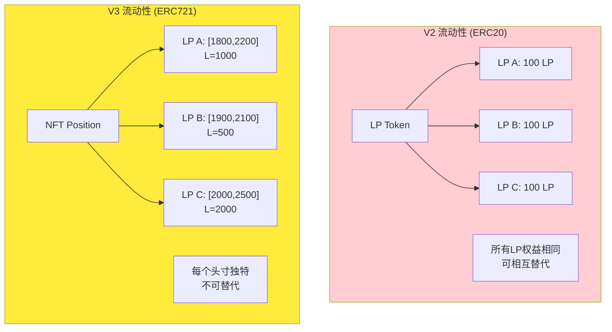

### 1.2 核心操作流程

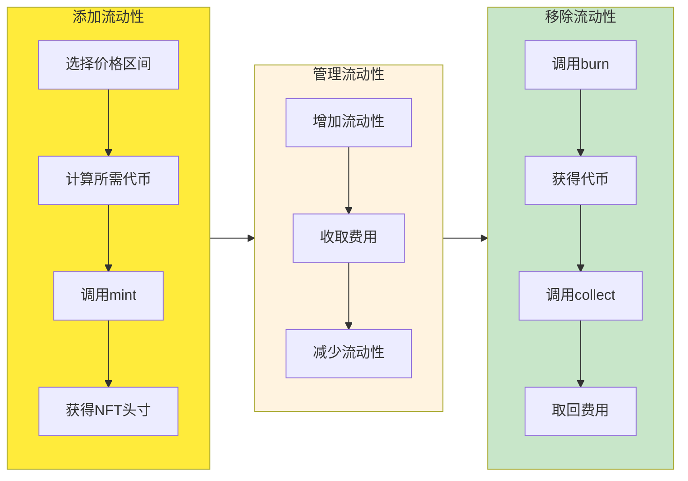

---

## 2. Position数据结构

### 2.1 Position.Info详解

每个流动性头寸由唯一的三元组标识：`(owner, tickLower, tickUpper)`

```solidity
library Position {
    struct Info {
        // 此头寸的流动性数量
        uint128 liquidity;

        // 上次更新时的内部费用增长率
        // 用于计算自上次操作以来累积的费用
        uint256 feeGrowthInside0LastX128;
        uint256 feeGrowthInside1LastX128;

        // 待领取的费用（已结算但未提取）
        uint128 tokensOwed0;
        uint128 tokensOwed1;
    }
}
```

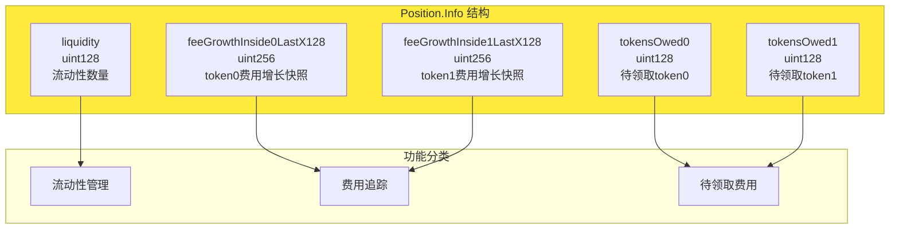

### 2.2 Position的唯一标识

```solidity
/// @notice 获取头寸信息
function get(
    mapping(bytes32 => Info) storage self,
    address owner,
    int24 tickLower,
    int24 tickUpper
) internal view returns (Position.Info storage position) {
    // 使用keccak256哈希三元组作为键
    position = self[keccak256(abi.encodePacked(owner, tickLower, tickUpper))];
}
```

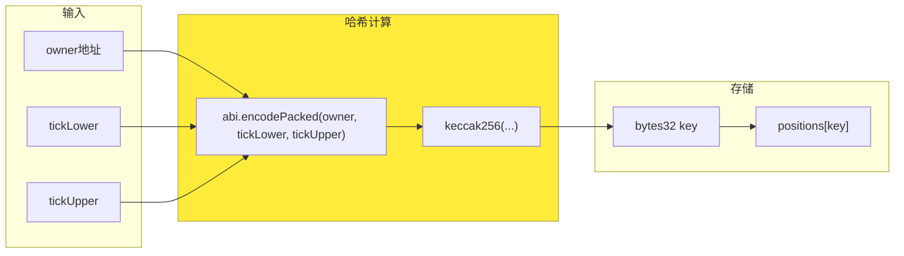

### 2.3 费用快照机制

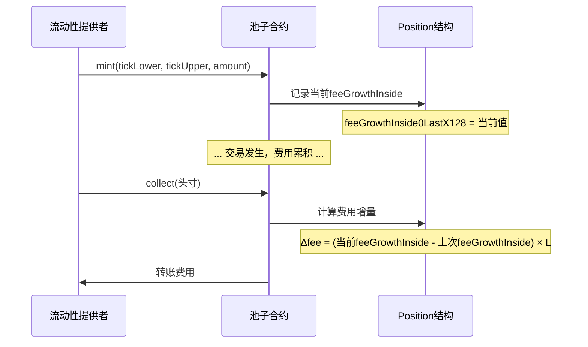

---

## 3. Mint操作详解

### 3.1 Mint函数签名

```solidity
function mint(
    address recipient,
    int24 tickLower,
    int24 tickUpper,
    uint128 amount,
    bytes calldata data
) external override noDelegateCheck returns (
    uint256 amount0,
    uint256 amount1,
    uint128 liquidity
);
```

**参数说明**：

| 参数 | 类型 | 说明 |
|------|------|------|
| recipient | address | 接收NFT的地址 |
| tickLower | int24 | 价格区间下界 |
| tickUpper | int24 | 价格区间上界 |
| amount | uint128 | 期望添加的流动性 |
| data | bytes | 回调数据 |

### 3.2 Mint执行流程

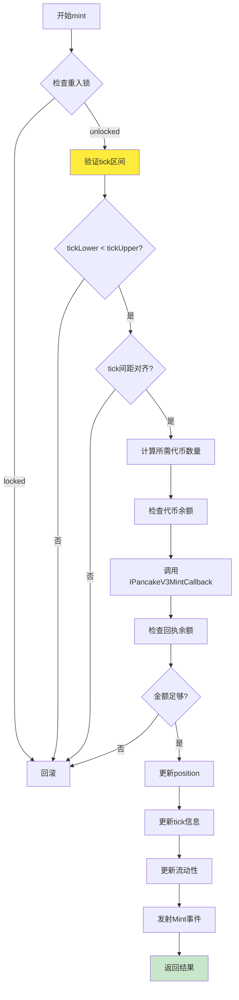

### 3.3 计算所需代币数量

```solidity
// 计算需要提供的代币数量
if (slot0.tick < tickLower) {
    // 价格在区间下方：只提供token0
    amount0 = SqrtPriceMath.getAmount0Delta(
        sqrtPriceAX96,
        sqrtPriceBX96,
        liquidity,
        false
    );
    amount1 = 0;
} else if (slot0.tick < tickUpper) {
    // 价格在区间内：提供两种代币
    amount0 = SqrtPriceMath.getAmount0Delta(
        sqrtPriceX96,
        sqrtPriceBX96,
        liquidity,
        false
    );
    amount1 = SqrtPriceMath.getAmount1Delta(
        sqrtPriceAX96,
        sqrtPriceX96,
        liquidity,
        false
    );
} else {
    // 价格在区间上方：只提供token1
    amount0 = 0;
    amount1 = SqrtPriceMath.getAmount1Delta(
        sqrtPriceAX96,
        sqrtPriceBX96,
        liquidity,
        false
    );
}
```

**三种价格状态**：

```mermaid
stateDiagram-v2
    [*] --> BelowRange: tick < tickLower
    [*] --> InRange: tickLower ≤ tick ≤ tickUpper
    [*] --> AboveRange: tick > tickUpper

    BelowRange --> OnlyToken0: 只提供token0
    InRange --> MixedTokens: 提供token0和token1
    AboveRange --> OnlyToken1: 只提供token1

    state BelowRange as "价格在区间下方"
    state InRange as "价格在区间内"
    state AboveRange as "价格在区间上方"
    state OnlyToken0 as "只提供Token0"
    state MixedTokens as "混合提供"
    state OnlyToken1 as "只提供Token1"
```

### 3.4 回调机制

```solidity
// 定义回调接口
interface IPancakeV3MintCallback {
    function pancakeV3MintCallback(
        uint256 amount0Owed,
        uint256 amount1Owed,
        bytes calldata data
    ) external;
}

// 在mint中调用回调
IPancakeV3MintCallback(msg.sender).pancakeV3MintCallback(
    amount0,
    amount1,
    data
);
```

**回调流程**：

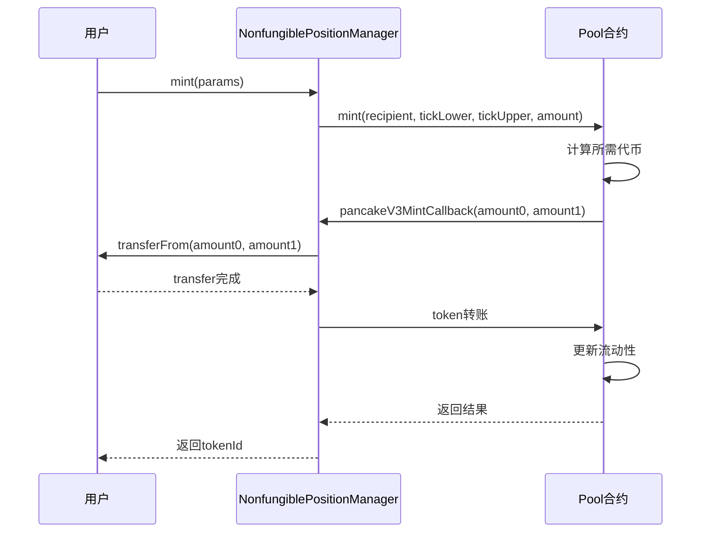

---

## 4. Burn操作详解

### 4.1 Burn函数签名

```solidity
function burn(
    int24 tickLower,
    int24 tickUpper,
    uint128 amount
) external override noDelegateCheck returns (
    uint256 amount0,
    uint256 amount1
);
```

### 4.2 Burn执行流程

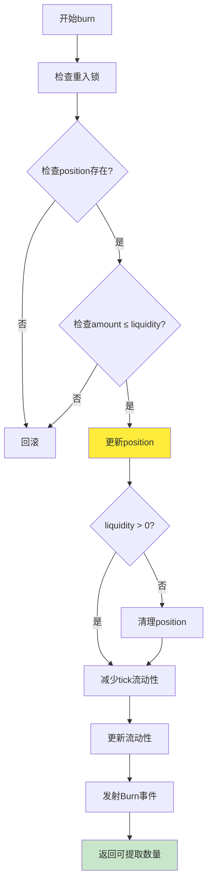

### 4.3 流动性更新逻辑

```solidity
// 更新position信息
Position.Info storage position = positions.get(
    owner,
    tickLower,
    tickUpper
);

// 记录更新前的状态
uint128 liquidityBefore = position.liquidity;

// 更新流动性
position.liquidity -= amount;

// 清理零流动性
if (position.liquidity == 0) {
    delete positions.get(
        owner,
        tickLower,
        tickUpper
    );
}
```

---

## 5. Collect操作详解

### 5.1 Collect函数签名

```solidity
function collect(
    address recipient,
    int24 tickLower,
    int24 tickUpper,
    uint128 amount0Requested,
    uint128 amount1Requested
) external override noDelegateCheck returns (
    uint128 amount0,
    uint128 amount1
);
```

**参数说明**：

| 参数 | 类型 | 说明 |
|------|------|------|
| recipient | address | 接收费用的地址 |
| tickLower | int24 | 头寸下界 |
| tickUpper | int24 | 头寸上界 |
| amount0Requested | uint128 | 请求提取的token0数量（0=全部）|
| amount1Requested | uint128 | 请求提取的token1数量（0=全部）|

### 5.2 费用计算逻辑

```solidity
// 获取position信息
Position.Info storage position = positions.get(
    owner,
    tickLower,
    tickUpper
);

// 计算累积的费用
uint256 feeGrowthInside0X128;
uint256 feeGrowthInside1X128;

(
    feeGrowthInside0X128,
    feeGrowthInside1X128
) = getFeeGrowthInside(
    tickLower,
    tickUpper,
    slot0.tick
);

// 计算增量
uint256 tokensOwed0 = position.tokensOwed0 +
    uint128(
        FullMath.mulDiv(
            feeGrowthInside0X128 - position.feeGrowthInside0LastX128,
            position.liquidity,
            FixedPoint128.Q128
        )
    );

// 更新快照
position.feeGrowthInside0LastX128 = feeGrowthInside0X128;
position.tokensOwed0 = 0;

// 转账
if (tokensOwed0 > 0) {
    if (amount0Requested > tokensOwed0) {
        amount0 = uint128(tokensOwed0);
    } else {
        amount0 = amount0Requested;
    }
    IERC20(token0).transfer(recipient, amount0);
}
```

### 5.3 Collect流程图

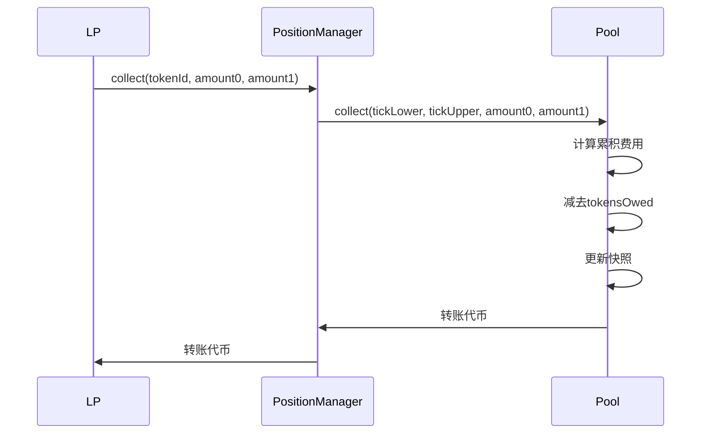

---

## 6. NonfungiblePositionManager详解

### 6.1 PositionManager职责

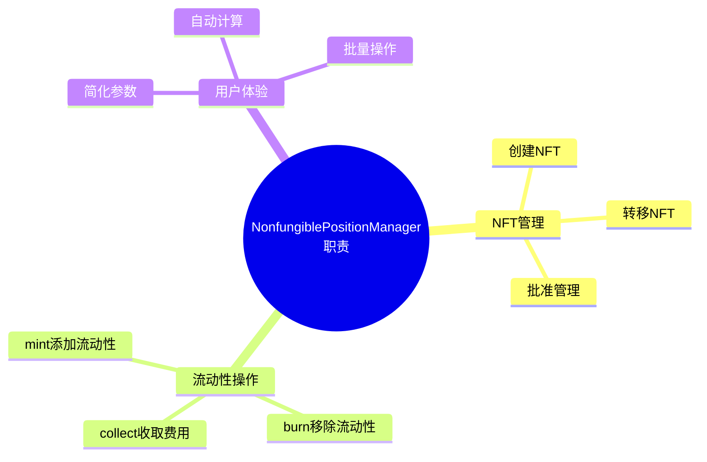

### 6.2 MintParams结构

```solidity
struct MintParams {
    address token0;
    address token1;
    uint24 fee;
    int24 tickLower;
    int24 tickUpper;
    uint256 amount0Desired;
    uint256 amount1Desired;
    uint256 amount0Min;
    uint256 amount1Min;
    address recipient;
    uint256 deadline;
}
```

### 6.3 创建新头寸

```solidity
function mint(
    MintParams calldata params
) external payable checkDeadline(params.deadline) returns (
    uint256 tokenId,
    uint128 liquidity,
    uint256 amount0,
    uint256 amount1
) {
    // 1. 检查代币顺序
    if (params.token0 > params.token1) {
        revert InvalidTokenOrder();
    }

    // 2. 获取或创建池子
    address pool = factory.getPool(
        params.token0,
        params.token1,
        params.fee
    );

    // 3. 调用pool的mint
    (liquidity, amount0, amount1) = IPancakeV3Pool(pool).mint(
        address(this),
        params.tickLower,
        params.tickUpper,
        params.amount0Desired,
        params.amount1Desired,
        abi.encode(MintCallbackData(
            params.token0,
            params.token1,
            params.fee,
            params.recipient
        ))
    );

    // 4. 创建NFT
    _mint(params.recipient, tokenId);

    // 5. 存储position信息
    _positions[tokenId] = Position({
        nonce: 0,
        operator: address(0),
        token0: params.token0,
        token1: params.token1,
        fee: params.fee,
        tickLower: params.tickLower,
        tickUpper: params.tickUpper,
        liquidity: liquidity,
        feeGrowthInside0LastX128: 0,
        feeGrowthInside1LastX128: 0,
        tokensOwed0: 0,
        tokensOwed1: 0
    });
}
```

---

## 7. PancakeSwap V3特色功能

### 7.1 自动复投农场

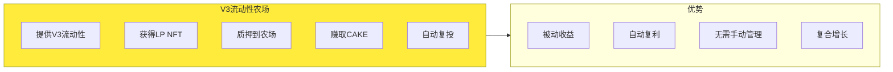

### 7.2 费用计算优化

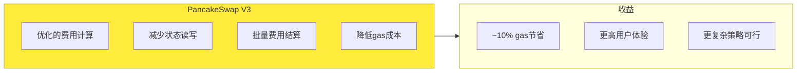

---

## 8. 实际应用示例

### 8.1 添加V3流动性

```javascript
// 使用PancakeSwap V3 SDK
import { PancakeV3NftPositionManager } from '@pancakeswap/sdk';

const positionManager = new PancakeV3NftPositionManager(
    nftPositionManagerAddress,
    provider
);

// 添加流动性
const tx = await positionManager.mint({
    token0: CAKE_ADDRESS,
    token1: WBNB_ADDRESS,
    fee: 2500,  // 0.25%
    tickLower: TickMath.getTickAtSqrtRatio(
        Math.sqrt(1800) * 2 ** 96
    ),
    tickUpper: TickMath.getTickAtSqrtRatio(
        Math.sqrt(2200) * 2 ** 96
    ),
    amount0Desired: ethers.utils.parseEther('100'),
    amount1Desired: ethers.utils.parseEther('5'),
    amount0Min: ethers.utils.parseEther('95'),
    amount1Min: ethers.utils.parseEther('4.5'),
    recipient: await signer.getAddress(),
    deadline: Math.floor(Date.now() / 1000) + 3600
});

const receipt = await tx.wait();
const tokenId = receipt.logs[0].args.tokenId;
```

### 8.2 收取费用

```javascript
// 收取所有费用
const tx = await positionManager.collect({
    tokenId: tokenId,
    recipient: await signer.getAddress(),
    amount0Max: MaxUint128,
    amount1Max: MaxUint128
});

await tx.wait();
```

### 8.3 增加流动性

```javascript
// 增加现有头寸的流动性
const tx = await positionManager.increaseLiquidity({
    tokenId: tokenId,
    amount0Desired: ethers.utils.parseEther('50'),
    amount1Desired: ethers.utils.parseEther('2.5'),
    amount0Min: ethers.utils.parseEther('47.5'),
    amount1Min: ethers.utils.parseEther('2.25'),
    deadline: Math.floor(Date.now() / 1000) + 3600
});

await tx.wait();
```

---

## 9. 本章小结

### 9.1 流动性管理核心要点

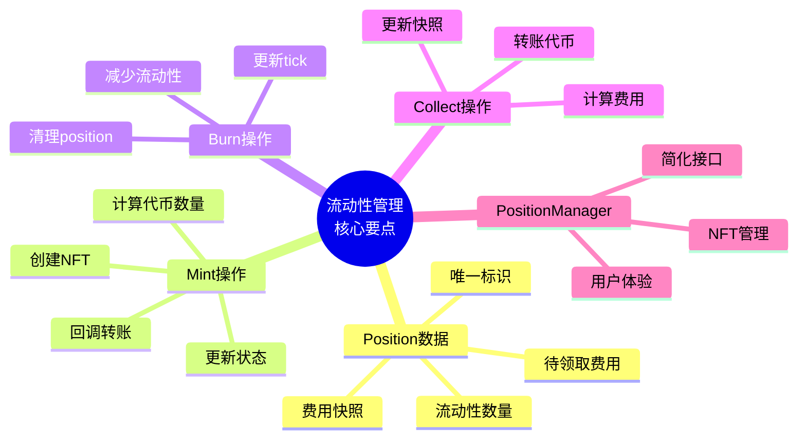

### 9.2 关键数据结构

| 结构 | 位置 | 用途 |
|------|------|------|
| Position.Info | Pool | 流动性头寸信息 |
| MintParams | PositionManager | Mint参数 |
| DecreaseLiquidityParams | PositionManager | Burn参数 |
| CollectParams | PositionManager | Collect参数 |

---

## 下一篇预告

在下一篇文章中，我们将深入探讨**费用系统与预言机**，包括：
- 费用增长率机制
- 费用分配算法
- TWAP预言机原理
- 价格观察系统

---

## 参考资料

- [PancakeSwap V3 Core 源码](https://github.com/pancakeswap/pancake-v3-core)
- [PancakeSwap V3 Periphery 源码](https://github.com/pancakeswap/pancake-v3-periphery)
- [PancakeSwap V3 流动性文档](https://docs.pancakeswap.finance/products/pancakeswap-exchange/v3)
