# 死磕PancakeSwap V3（六）：费用系统与预言机

> 本文是「死磕PancakeSwap V3」系列的第六篇，深入剖析V3的费用分配机制和TWAP预言机系统的完整实现。

## 系列导航

| 序号 | 标题 | 核心内容 |
|------|------|----------|
| 01 | PancakeSwap V3概述 | 发展历程、集中流动性、V3特色 |
| 02 | Tick机制与价格数学 | Tick设计、价格转换算法 |
| 03 | 架构与合约设计 | Factory、Pool合约结构 |
| 04 | 交换机制深度解析 | swap函数、价格发现 |
| 05 | 流动性管理与头寸 | Position、mint/burn |
| **06** | **费用系统与预言机** | **费用分配、TWAP** |
| 07 | V3与Uniswap V3对比 | 差异点、优化、适用场景 |
| 08 | 多链部署与特性适配 | BNB Chain、Ethereum、跨链策略 |
| 09 | 集成开发指南 | SDK使用、交易构建、最佳实践 |
| 10 | MEV与套利策略 | JIT、三明治攻击、防范策略 |

---

## 1. 费用系统概述

### 1.1 V3费用架构

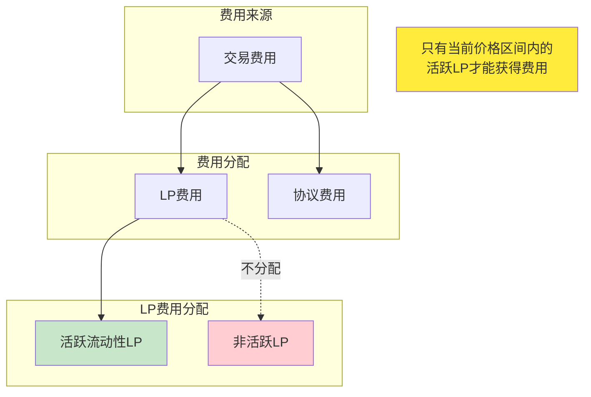

### 1.2 费率等级

PancakeSwap V3支持多个费率等级，每个等级绑定特定的tick间距：

| 费率 | 百万分比 | Tick间距 | 适用场景 |
|------|---------|----------|----------|
| 0.01% | 100 | 1 | 稳定币对（USDT/USDC）|
| 0.05% | 500 | 10 | 相关资产（WBTC/renBTC）|
| 0.25% | 2500 | 50 | 主流币对（CAKE/BNB）- PancakeSwap特色 |
| 1.00% | 10000 | 200 | 高风险币对 |

### 1.3 费用计算的核心挑战

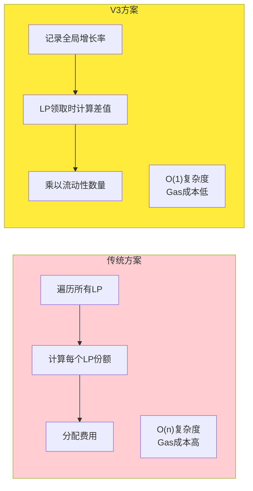

---

## 2. 费用增长率机制

### 2.1 全局费用增长率

池子维护两个全局费用增长累积器：

```solidity
// 每单位流动性累积的token0费用
uint256 public override feeGrowthGlobal0X128;

// 每单位流动性累积的token1费用
uint256 public override feeGrowthGlobal1X128;
```

**数学定义**：
```
feeGrowthGlobalX128 = Σ(fee_i / L_i) × 2^128

其中：
- fee_i: 第i笔交易产生的费用
- L_i: 第i笔交易时的活跃流动性
```

### 2.2 更新机制

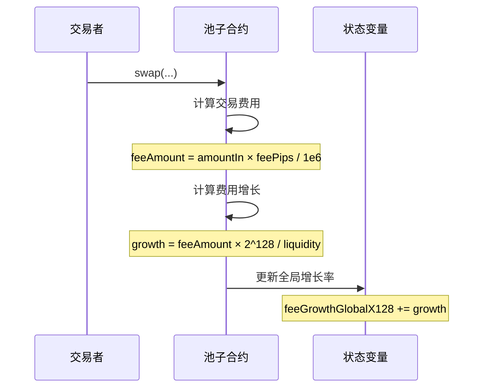

### 2.3 代码实现

```solidity
// 在swap循环中更新费用增长率
if (state.liquidity > 0) {
    state.feeGrowthGlobalX128 += FullMath.mulDiv(
        step.feeAmount,           // 本步产生的费用
        FixedPoint128.Q128,       // 2^128 归一化因子
        state.liquidity           // 当前活跃流动性
    );
}
```

**为什么乘以2^128？**

- 提高精度，避免小数运算
- Q128定点数格式：整数部分在高位，小数部分在低位
- 费用增长率是每单位流动性的累积费用，通常数值很小

---

## 3. 区间费用计算

### 3.1 "Outside"概念

每个tick维护"outside"费用增长率，表示tick另一侧累积的费用：

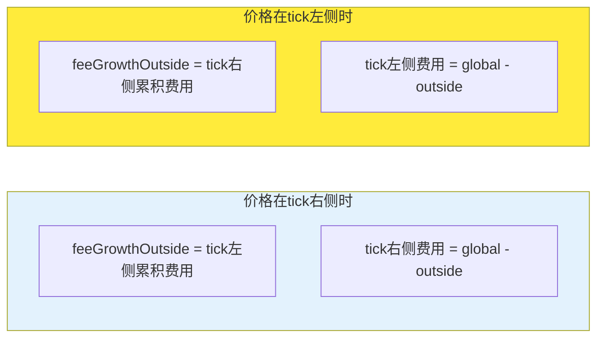

### 3.2 inside费用计算

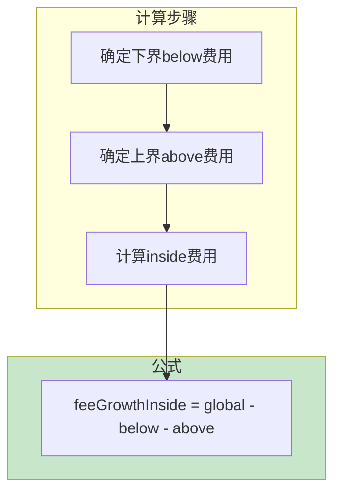

### 3.3 完整实现

```solidity
function getFeeGrowthInside(
    mapping(int24 => Tick.Info) storage self,
    int24 tickLower,
    int24 tickUpper,
    int24 tickCurrent,
    uint256 feeGrowthGlobal0X128,
    uint256 feeGrowthGlobal1X128
) internal view returns (
    uint256 feeGrowthInside0X128,
    uint256 feeGrowthInside1X128
) {
    Tick.Info storage lower = self[tickLower];
    Tick.Info storage upper = self[tickUpper];

    // 计算下界feeGrowthBelow
    uint256 feeGrowthBelow0X128;
    uint256 feeGrowthBelow1X128;
    if (tickCurrent < tickLower) {
        feeGrowthBelow0X128 = feeGrowthGlobal0X128 - lower.feeGrowthOutside0X128;
        feeGrowthBelow1X128 = feeGrowthGlobal1X128 - lower.feeGrowthOutside1X128;
    } else {
        feeGrowthBelow0X128 = lower.feeGrowthOutside0X128;
        feeGrowthBelow1X128 = lower.feeGrowthOutside1X128;
    }

    // 计算上界feeGrowthAbove
    uint256 feeGrowthAbove0X128;
    uint256 feeGrowthAbove1X128;
    if (tickCurrent < tickUpper) {
        feeGrowthAbove0X128 = upper.feeGrowthOutside0X128;
        feeGrowthAbove1X128 = upper.feeGrowthOutside1X128;
    } else {
        feeGrowthAbove0X128 = feeGrowthGlobal0X128 - upper.feeGrowthOutside0X128;
        feeGrowthAbove1X128 = feeGrowthGlobal1X128 - upper.feeGrowthOutside1X128;
    }

    // 计算区间内费用增长
    feeGrowthInside0X128 = feeGrowthGlobal0X128 - feeGrowthBelow0X128 - feeGrowthAbove0X128;
    feeGrowthInside1X128 = feeGrowthGlobal1X128 - feeGrowthBelow1X128 - feeGrowthAbove1X128;
}
```

### 3.4 费用分配示例

**场景**：
- LP在[tickLower=1900, tickUpper=2100]提供流动性L=1000
- 当前tick=1950（在区间内）
- 交易产生token0费用100

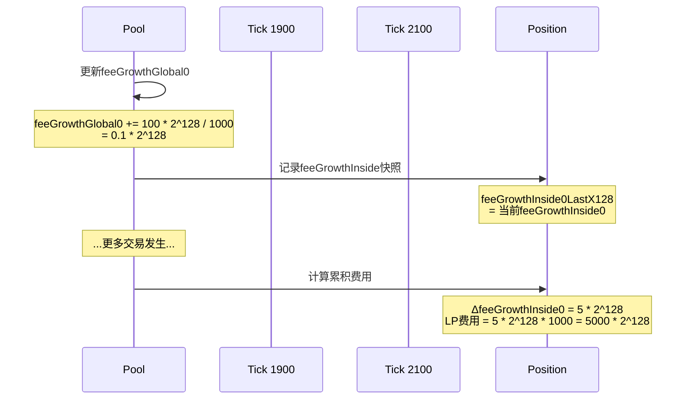

---

## 4. 协议费用

### 4.1 协议费率设置

```solidity
struct FeeProtocol {
    uint16 feeProtocol0;
    uint16 feeProtocol1;
}
```

**费率说明**：
- feeProtocol0: token0协议费率（单位：1/100000）
- feeProtocol1: token1协议费率（单位：1/100000）
- 例如：feeProtocol0 = 1000，表示1%的协议费

### 4.2 协议费用计算

```solidity
// 在swap中计算协议费用
if (feeProtocol > 0) {
    uint256 protocolFee = FullMath.mulDiv(
        step.feeAmount,
        feeProtocol,
        1e6
    );
    state.protocolFee += uint128(protocolFee);
    step.feeAmount -= protocolFee;
}
```

**费用分配**：

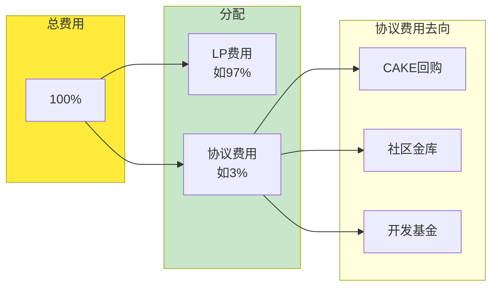

### 4.3 PancakeSwap的协议费特色

| 特性 | PancakeSwap V3 | Uniswap V3 |
|------|----------------|------------|
| **费率设置** | 社区治理投票决定 | 协议团队决定 |
| **灵活性** | 高（可调整）| 中等 |
| **用途** | CAKE回购、社区治理 | 团队运营 |
| **透明度** | 完全透明 | 相对透明 |

---

## 5. TWAP预言机

### 5.1 预言机概述

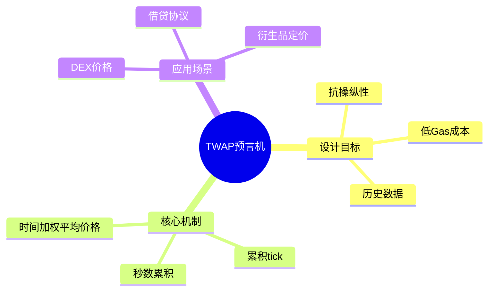

### 5.2 Observation数据结构

```solidity
struct Observation {
    uint32 blockTimestamp;
    int56 tickCumulative;            // tick × elapsedSeconds
    uint160 secondsPerLiquidityCumulativeX128;
    bool initialized;
}
```

**字段说明**：
- blockTimestamp: 记录时间戳
- tickCumulative: 累积的tick值（用于计算TWAP）
- secondsPerLiquidityCumulativeX128: 时间/流动性累积
- initialized: 是否已初始化

### 5.3 观察数组

```solidity
// 固定大小的观察数组
uint256 public override observationCardinality;
uint256 public override observationCardinalityNext;
uint16 public override observationIndex;
Observation[65535] public override observations;
```

**设计原理**：
- 固定大小数组，避免动态分配
- 循环使用（observationIndex指向最新观察）
- 可配置的观察数量

---

## 6. TWAP计算原理

### 6.1 基本概念

```
TWAP = (tickCumulative_end - tickCumulative_start) / (timestamp_end - timestamp_start)

其中：
- tickCumulative = Σ(tick_i × deltaSeconds_i)
- deltaSeconds_i: 第i个时间间隔的秒数
```

### 6.2 观察更新机制

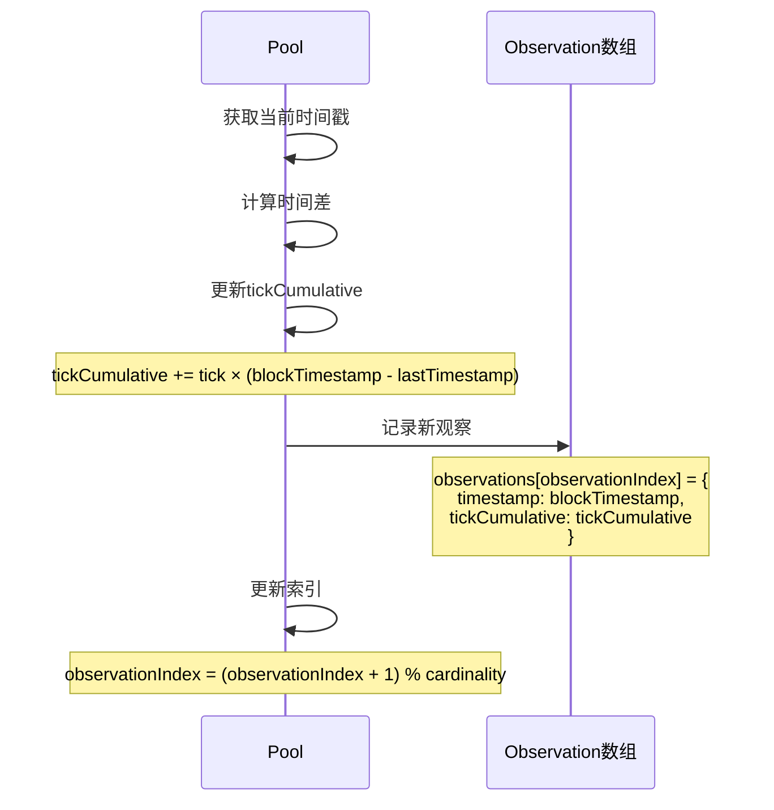

### 6.3 更新代码实现

```solidity
function _updateObservation(
    uint32 blockTimestamp
) private {
    Observation memory last = observations[observationIndex];

    if (blockTimestamp == last.blockTimestamp) {
        // 同一个区块内不更新
        return;
    }

    uint56 timeDelta = blockTimestamp - last.blockTimestamp;
    uint16 cardinality = observationCardinality;

    // 更新累积值
    int56 tickCumulative = last.tickCumulative +
        int56(uint56(tick)) * int56(timeDelta);

    uint160 secondsPerLiquidityCumulativeX128 =
        last.secondsPerLiquidityCumulativeX128 +
        uint160((uint256(timeDelta) << 128) / (liquidity > 0 ? liquidity : 1));

    // 写入新观察
    observations[observationIndex] = Observation({
        blockTimestamp: blockTimestamp,
        tickCumulative: tickCumulative,
        secondsPerLiquidityCumulativeX128: secondsPerLiquidityCumulativeX128,
        initialized: true
    });

    // 更新索引
    observationIndex = (observationIndex + 1) & (cardinality - 1);
}
```

---

## 7. 查询TWAP价格

### 7.1 observe函数

```solidity
function observe(
    uint32[] calldata secondsAgos
) external view override returns (
    int56[] memory tickCumulatives,
    uint160[] memory secondsPerLiquidityCumulativeX128s
);
```

**参数**：
- secondsAgos: 询问的历史时间点数组，如[0, 3600]表示当前和1小时前

**返回**：
- tickCumulatives: 对应时间点的累积tick值
- secondsPerLiquidityCumulativeX128s: 对应时间点的流动性加权时间

### 7.2 TWAP计算示例

```javascript
// 查询最近1小时的TWAP
const pool = new ethers.Contract(
    poolAddress,
    poolAbi,
    provider
);

const observations = await pool.observe([0, 3600]);
const [currentTickCumulative, oldTickCumulative] = observations.tickCumulatives;

// 计算TWAP
const twapTick = (currentTickCumulative - oldTickCumulative) / 3600;
const twapPrice = 1.0001 ** twapTick;
```

### 7.3 使用场景

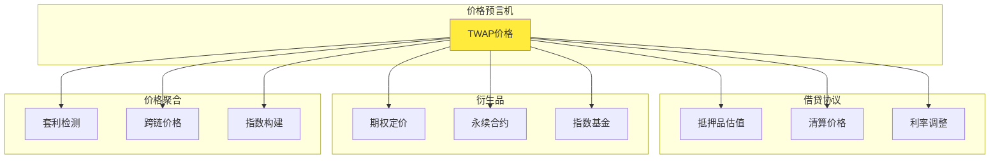

---

## 8. PancakeSwap V3的预言机优化

### 8.1 多链适配

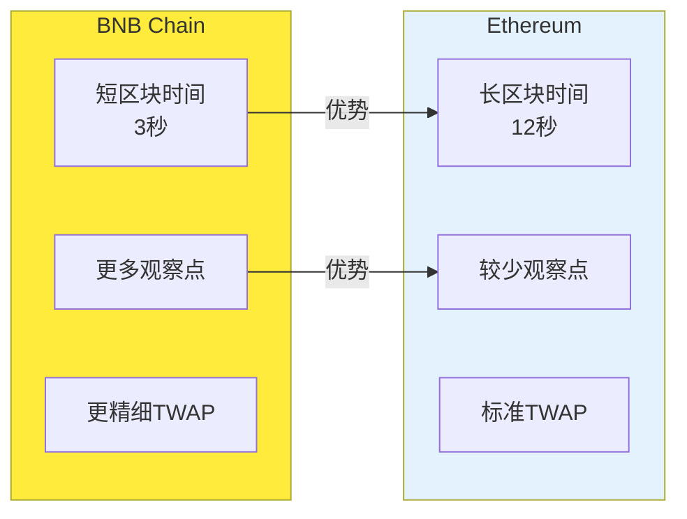

### 8.2 Gas优化

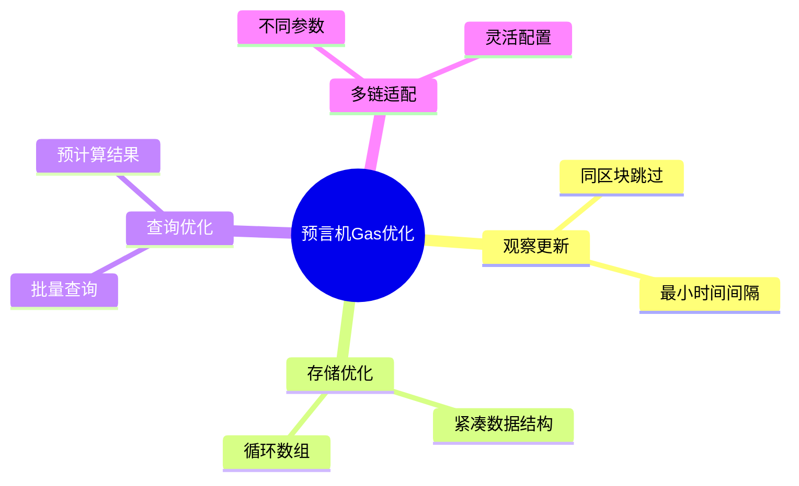

---

## 9. 实际应用示例

### 9.1 查询TWAP价格

```javascript
import { Pool } from '@pancakeswap/sdk';

const pool = new Pool(
    CAKE,
    WBNB,
    2500,  // 0.25% fee
    sqrtPriceX96,
    liquidity,
    tick
);

// 查询最近1小时TWAP
const poolContract = new ethers.Contract(
    poolAddress,
    poolAbi,
    provider
);

const observations = await poolContract.observe([0, 3600]);
const tickCumulatives = observations[0];

// 计算TWAP tick
const twapTick = (tickCumulatives[0].sub(tickCumulatives[1])).div(3600);
const twapPrice = Math.pow(1.0001, twapTick);
```

### 9.2 查询LP费用

```javascript
// 查询position可领取的费用
const poolContract = new ethers.Contract(
    poolAddress,
    poolAbi,
    provider
);

const position = await positionManager.positions(tokenId);

// 获取当前费用增长
const feeGrowthInside = await poolContract.feeGrowthInside(
    position.tickLower,
    position.tickUpper
);

// 计算累积费用
const tokensOwed0 = feeGrowthInside[0].sub(position.feeGrowthInside0LastX128)
    .mul(position.liquidity)
    .div(BigNumber.from(2).pow(128));

const tokensOwed1 = feeGrowthInside[1].sub(position.feeGrowthInside1LastX128)
    .mul(position.liquidity)
    .div(BigNumber.from(2).pow(128));

console.log(`Token0 owed: ${ethers.utils.formatEther(tokensOwed0)}`);
console.log(`Token1 owed: ${ethers.utils.formatEther(tokensOwed1)}`);
```

---

## 10. 本章小结

### 10.1 费用系统核心要点

```mermaid
mindmap
  root((费用系统<br/>核心要点))
    全局费用增长率
      feeGrowthGlobalX128
      每单位流动性累积
      O(1)复杂度
    区间费用计算
      Outside概念
      Inside费用
      Tick更新
    协议费用
      可配置费率
      社区治理
      CAKE回购
    费用领取
      Position快照
      增量计算
      按需提取
```

### 10.2 预言机核心要点

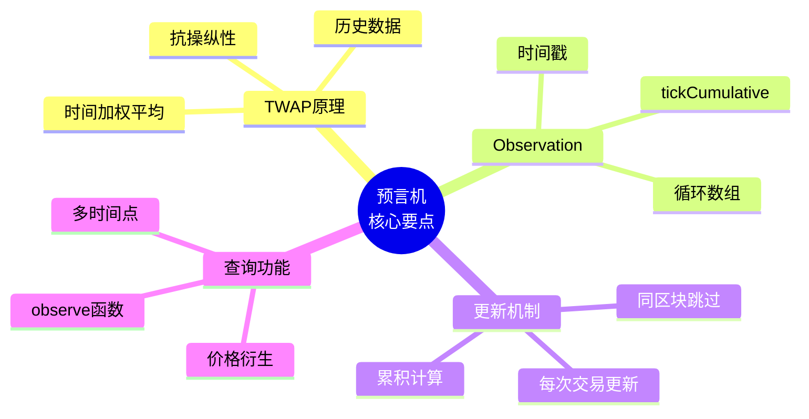

---

## 下一篇预告

在下一篇文章中，我们将深入探讨**V3与Uniswap V3对比**，包括：
- 技术架构差异
- Gas效率对比
- 生态整合对比
- 适用场景选择

---

## 参考资料

- [PancakeSwap V3 Core 源码](https://github.com/pancakeswap/pancake-v3-core)
- [PancakeSwap V3 预言机文档](https://docs.pancakeswap.finance/developers/smart-contracts/v3-contracts/oracle)
- [Uniswap V3 白皮书 -预言机部分](https://uniswap.org/whitepaper-v3.pdf)
