# 死磕PancakeSwap V3（七）：V3与Uniswap V3对比

> 本文是「死磕PancakeSwap V3」系列的第七篇，全面对比PancakeSwap V3与Uniswap V3的差异，帮助理解各自的优势和适用场景。

## 系列导航

| 序号 | 标题 | 核心内容 |
|------|------|----------|
| 01 | PancakeSwap V3概述 | 发展历程、集中流动性、V3特色 |
| 02 | Tick机制与价格数学 | Tick设计、价格转换算法 |
| 03 | 架构与合约设计 | Factory、Pool合约结构 |
| 04 | 交换机制深度解析 | swap函数、价格发现 |
| 05 | 流动性与头寸 | Position、mint/burn |
| 06 | 费用系统与预言机 | 费用分配、TWAP |
| **07** | **V3与Uniswap V3对比** | **差异点、优化、适用场景** |
| 08 | 多链部署与特性适配 | BNB Chain、Ethereum、跨链策略 |
| 09 | 集成开发指南 | SDK使用、交易构建、最佳实践 |
| 10 | MEV与套利策略 | JIT、三明治攻击、防范策略 |

---

## 1. 概述对比

### 1.1 基本信息

| 特性 | PancakeSwap V3 | Uniswap V3 |
|------|----------------|------------|
| **发布时间** | 2023年4月（BNB Chain） | 2021年5月（Ethereum） |
| **主要部署链** | BNB Chain、Ethereum、Aptos等 | Ethereum、Arbitrum、Optimism等 |
| **治理代币** | CAKE | UNI |
| **开发者** | PancakeSwap团队 | Uniswap Labs |
| **开源程度** | 完全开源 | 完全开源 |
| **代码基础** | Fork自Uniswap V3 | 原创实现 |

### 1.2 发展历程对比

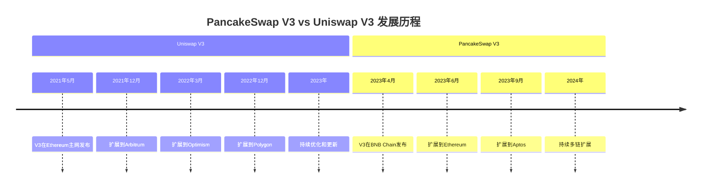

---

## 2. 技术架构对比

### 2.1 核心机制对比

| 机制 | PancakeSwap V3 | Uniswap V3 | 说明 |
|------|----------------|------------|------|
| **集中流动性** | ✅ | ✅ | 完全相同的实现 |
| **Tick机制** | ✅ | ✅ | price = 1.0001^tick |
| **NFT LP Token** | ✅ | ✅ | ERC721标准 |
| **虚拟储备** | ✅ | ✅ | 相同的数学模型 |
| **费用系统** | ✅ | ✅ | 费率选择略有差异 |

### 2.2 费率结构对比

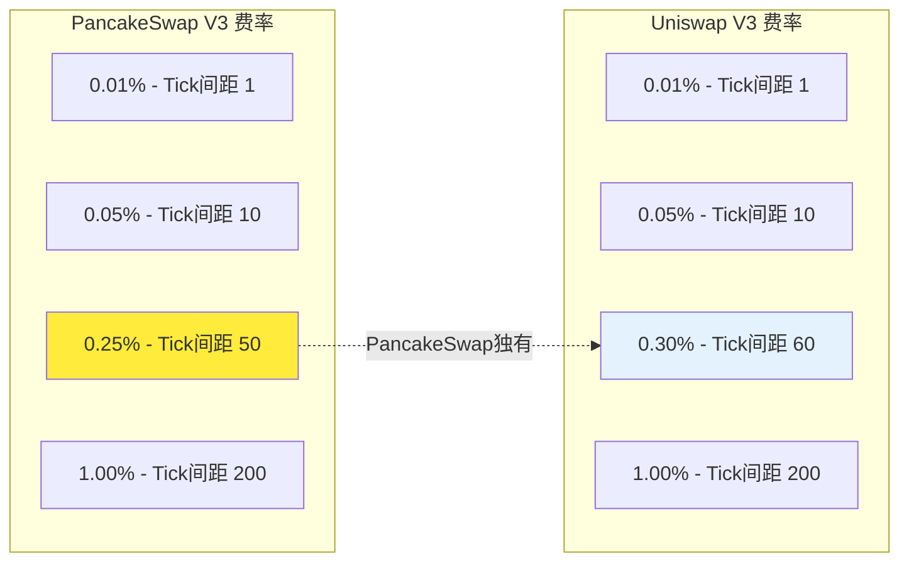

**费率差异分析**：

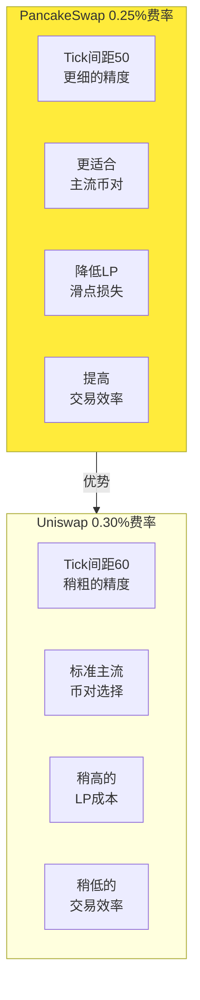

### 2.3 代码优化对比

| 优化项 | PancakeSwap V3 | Uniswap V3 |
|--------|----------------|------------|
| **Gas优化** | 针对BNB Chain优化 | 针对Ethereum优化 |
| **存储优化** | 改进的存储布局 | 标准存储布局 |
| **库函数** | 优化的数学运算 | 标准数学运算 |
| **重入保护** | 改进的锁机制 | 标准锁机制 |

---

## 3. Gas成本对比

### 3.1 操作成本对比（Ethereum主网）

| 操作 | PancakeSwap V3 | Uniswap V3 | 差异 |
|------|----------------|------------|------|
| **Swap** | ~60,000 gas | ~65,000 gas | PancakeSwap约低8% |
| **Mint流动性** | ~180,000 gas | ~200,000 gas | PancakeSwap约低10% |
| **Burn流动性** | ~120,000 gas | ~130,000 gas | PancakeSwap约低8% |
| **Collect费用** | ~30,000 gas | ~35,000 gas | PancakeSwap约低14% |

### 3.2 多链Gas对比

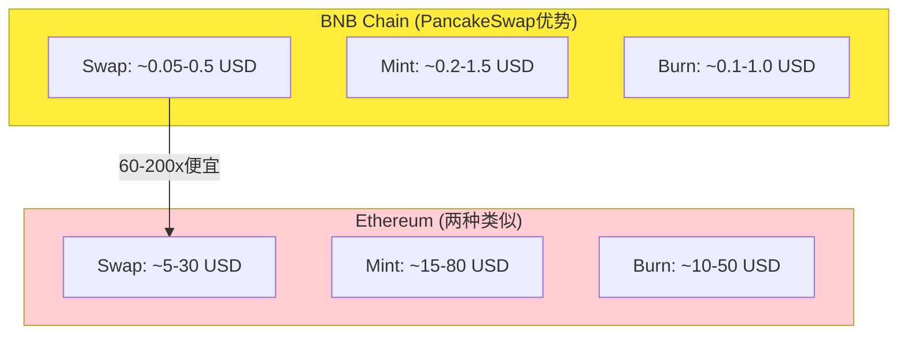

### 3.3 Gas优化策略

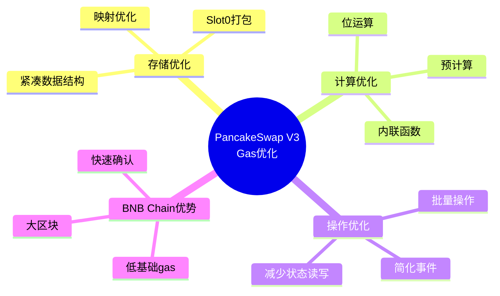

---

## 4. 流动性深度对比

### 4.1 TVL对比（截至2024年初）

| 链 | PancakeSwap V3 | Uniswap V3 | TVL占比 |
|---|----------------|------------|---------|
| **BNB Chain** | ~$500M | - | PancakeSwap主导 |
| **Ethereum** | ~$50M | ~$3B | Uniswap主导 |
| **Arbitrum** | - | ~$600M | Uniswap主导 |
| **Optimism** | - | ~$200M | Uniswap主导 |

### 4.2 交易量对比

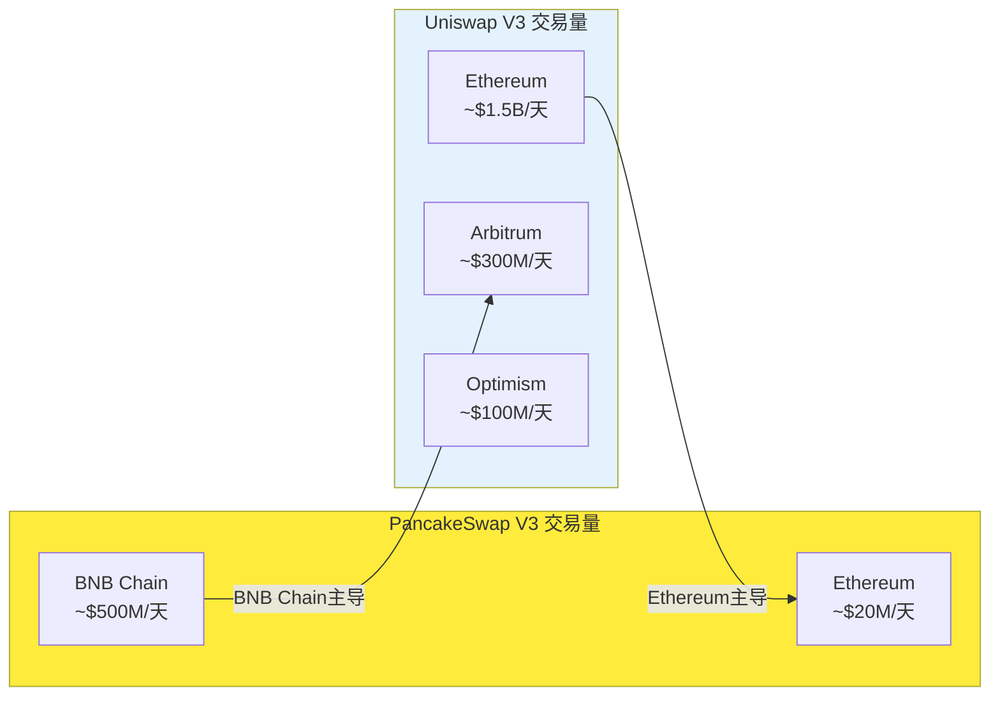

---

## 5. 生态系统对比

### 5.1 PancakeSwap生态整合

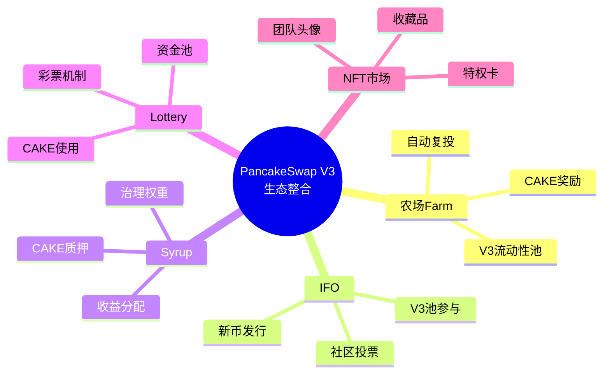

### 5.2 Uniswap生态特点

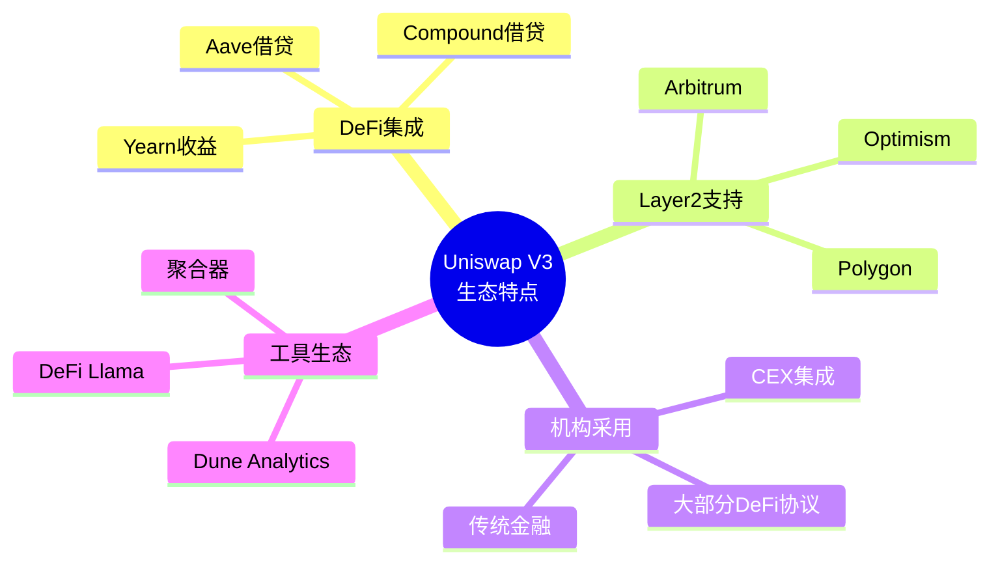

### 5.3 生态对比总结

| 方面 | PancakeSwap V3 | Uniswap V3 |
|------|----------------|------------|
| **农场激励** | ✅ 深度整合 | ❌ 不支持 |
| **IFO机制** | ✅ 支持 | ❌ 不支持 |
| **治理投票** | ✅ CAKE投票 | ✅ UNI投票 |
| **跨链桥** | ✅ 支持 | ❌ 不支持 |
| **机构集成** | 中等 | 高 |
| **开发工具** | 较少 | 丰富 |

---

## 6. 治理机制对比

### 6.1 治理代币对比

| 特性 | CAKE (PancakeSwap) | UNI (Uniswap) |
|------|---------------------|---------------|
| **总供应量** | ~750M | ~1B |
| **当前流通** | ~250M | ~600M |
| **治理权重** | 1 CAKE = 1票 | 1 UNI = 1票 |
| **提案门槛** | 2.5M CAKE | 10M UNI |
| **投票门槛** | 1M CAKE | 40M UNI |
| **费用分配** | 可调整 | 固定 |

### 6.2 治理灵活性对比

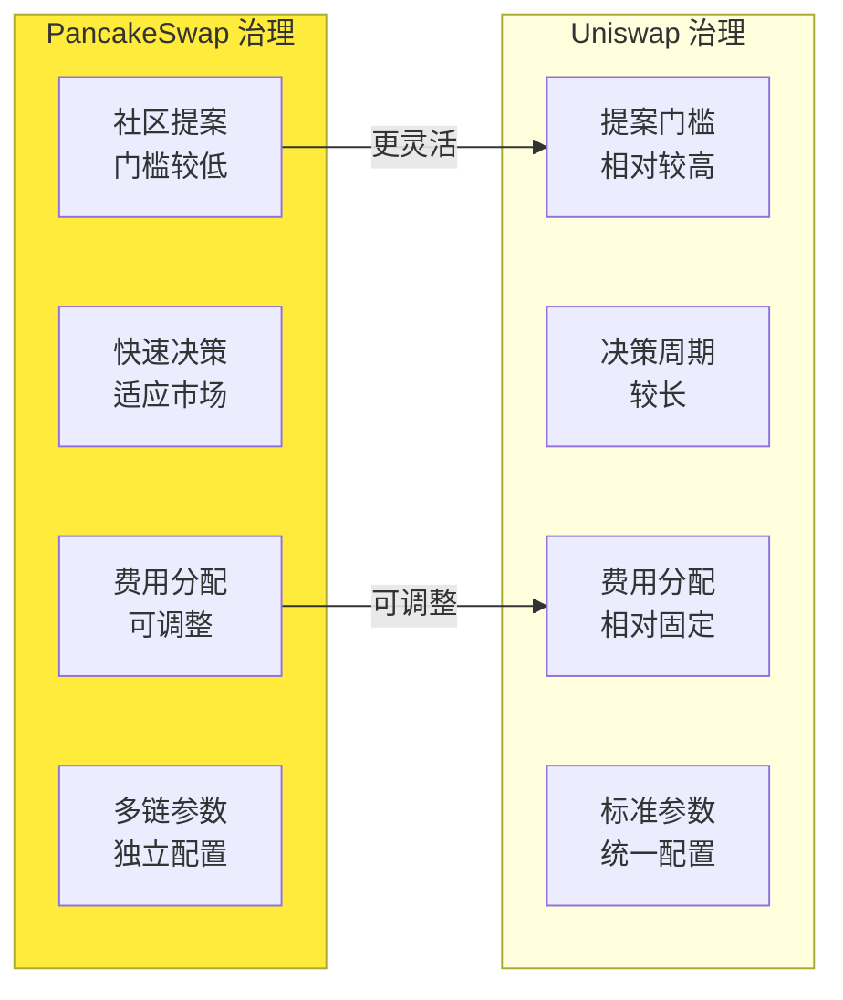

---

## 7. 安全与审计对比

### 7.1 审计情况

| 方面 | PancakeSwap V3 | Uniswap V3 |
|------|----------------|------------|
| **审计机构** | CertiK、SlowMist、PeckShield等 | Trail of Bits、OpenZeppelin等 |
| **审计次数** | 3-4次 | 5-6次 |
| **漏洞赏金** | 活跃 | 活跃 |
| **安全事件** | 少量 | 极少 |

### 7.2 安全机制对比

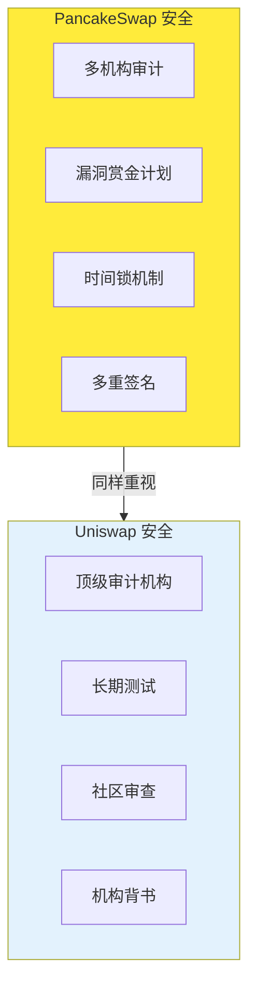

---

## 8. 开发体验对比

### 8.1 SDK与文档

| 方面 | PancakeSwap V3 | Uniswap V3 |
|------|----------------|------------|
| **SDK支持** | PancakeSwap SDK | @uniswap/sdk-core |
| **文档完善度** | 良好 | 非常完善 |
| **社区支持** | 活跃 | 非常活跃 |
| **示例代码** | 较少 | 丰富 |
| **集成难度** | 中等 | 低 |

### 8.2 多链部署

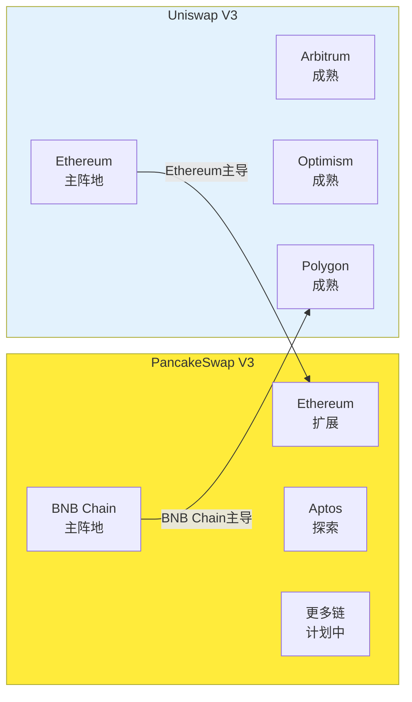

---

## 9. 适用场景选择

### 9.1 选择PancakeSwap V3的场景

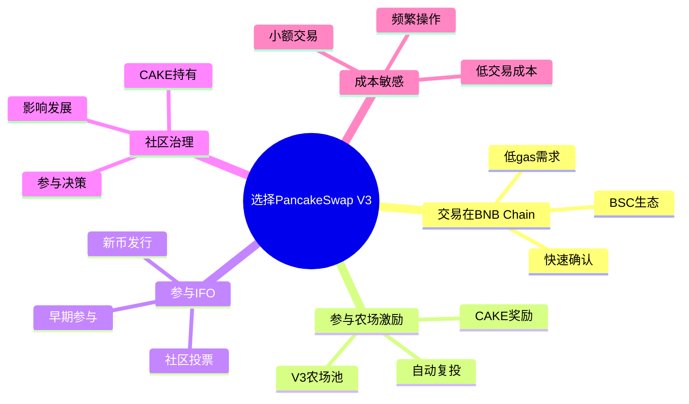

### 9.2 选择Uniswap V3的场景

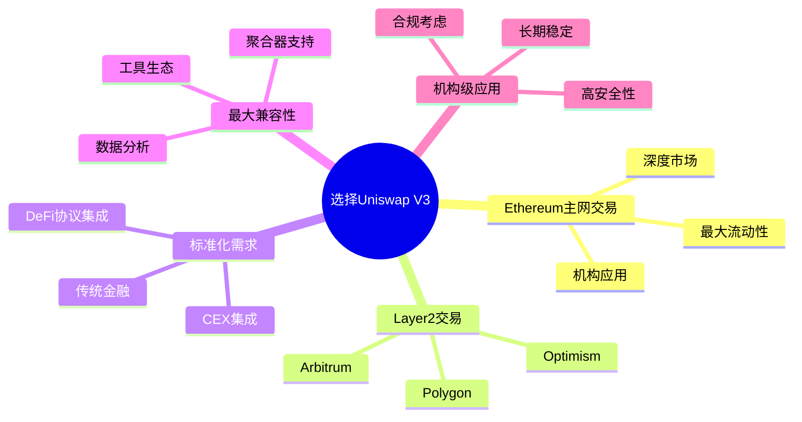

### 9.3 决策流程

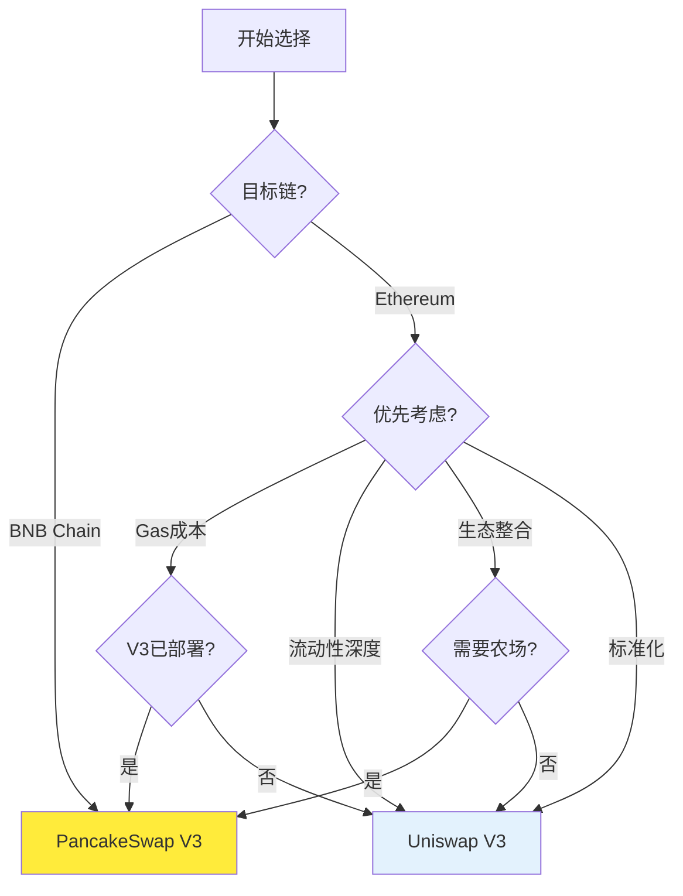

---

## 10. 未来发展对比

### 10.1 PancakeSwap V3发展路线

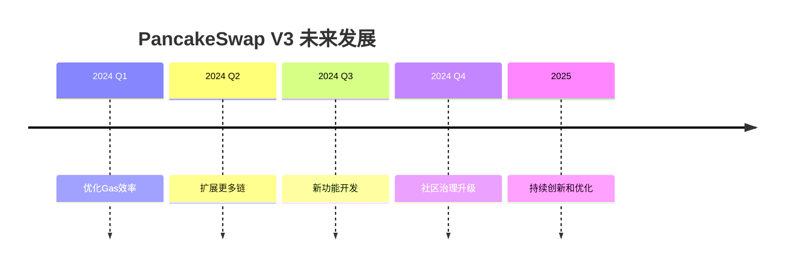

### 10.2 Uniswap V4展望

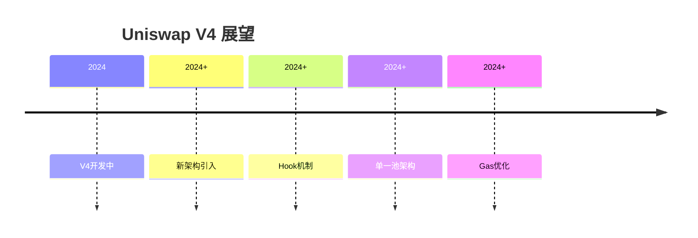

---

## 11. 本章小结

### 11.1 对比总结

| 维度 | PancakeSwap V3优势 | Uniswap V3优势 |
|------|-------------------|---------------|
| **Gas成本** | BNB Chain极低 | Ethereum标准 |
| **流动性** | BNB Chain主导 | Ethereum/L2主导 |
| **生态整合** | 农场、IFO深度整合 | DeFi标准化 |
| **治理灵活性** | 社区驱动 | 机构背书 |
| **开发工具** | 基础完善 | 非常完善 |
| **多链支持** | 快速扩展 | 成熟稳定 |

### 11.2 核心差异

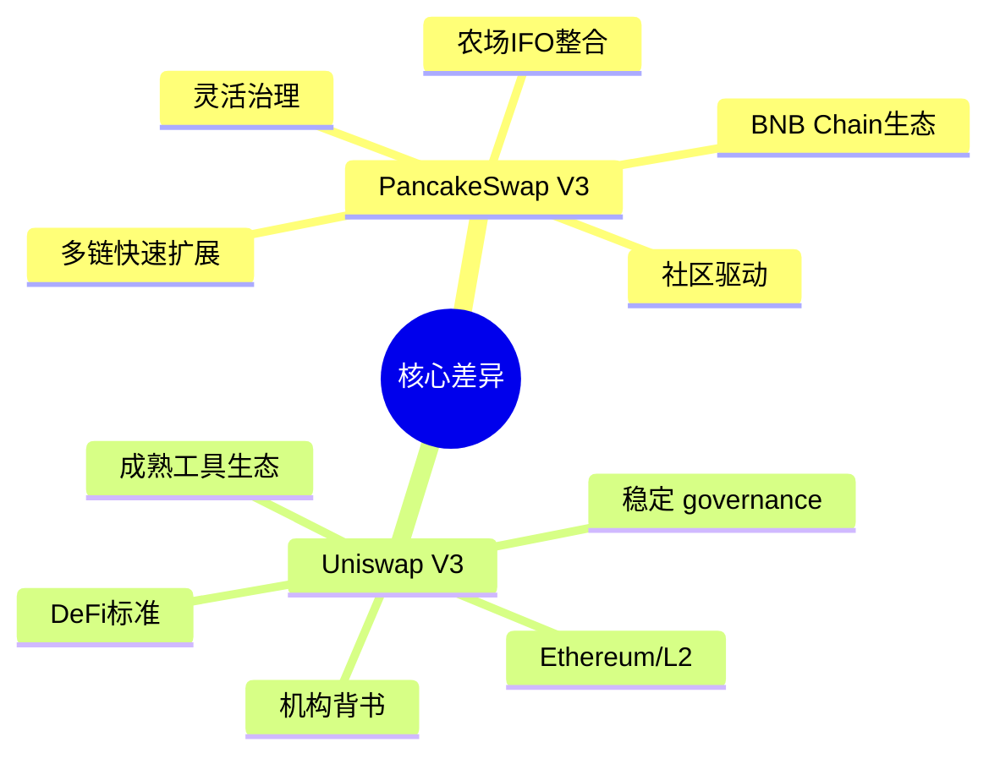

---

## 下一篇预告

在下一篇文章中，我们将深入探讨**多链部署与特性适配**，包括：
- PancakeSwap V3的多链架构
- 不同链的适配策略
- 跨链流动性管理
- 未来多链发展

---

## 参考资料

- [PancakeSwap V3 官方文档](https://docs.pancakeswap.finance/)
- [Uniswap V3 官方文档](https://docs.uniswap.org/)
- [PancakeSwap vs Uniswap 对比分析](https://docs.pancakeswap.finance/products/pancakeswap-exchange/v3)
- [Dune Analytics - DEX对比](https://dune.com/)
