# 死磕PancakeSwap V3（八）：多链部署与特性适配

> 本文是「死磕PancakeSwap V3」系列的第八篇，深入探讨PancakeSwap V3的多链部署策略和特性适配。

## 系列导航

| 序号 | 标题 | 核心内容 |
|------|------|----------|
| 01 | PancakeSwap V3概述 | 发展历程、集中流动性、V3特色 |
| 02 | Tick机制与价格数学 | Tick设计、价格转换算法 |
| 03 | 架构与合约设计 | Factory、Pool合约结构 |
| 04 | 交换机制深度解析 | swap函数、价格发现 |
| 05 | 流动性与头寸 | Position、mint/burn |
| 06 | 费用系统与预言机 | 费用分配、TWAP |
| 07 | V3与Uniswap V3对比 | 差异点、优化、适用场景 |
| **08** | **多链部署与特性适配** | **BNB Chain、Ethereum、跨链策略** |
| 09 | 集成开发指南 | SDK使用、交易构建、最佳实践 |
| 10 | MEV与套利策略 | JIT、三明治攻击、防范策略 |

---

## 1. 多链部署概述

### 1.1 部署时间线

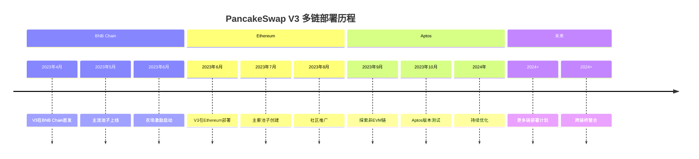

### 1.2 已部署链概况

| 链 | 部署时间 | 状态 | TVL | 特点 |
|---|----------|------|-----|------|
| **BNB Chain** | 2023.04 | ✅ 活跃 | ~$500M | 主阵地，高TVL |
| **Ethereum** | 2023.06 | ✅ 活跃 | ~$50M | 扩展，竞争激烈 |
| **Aptos** | 2023.09 | ⚠️ 测试 | ~$5M | 非EVM探索 |

---

## 2. BNB Chain部署详解

### 2.1 BNB Chain优势

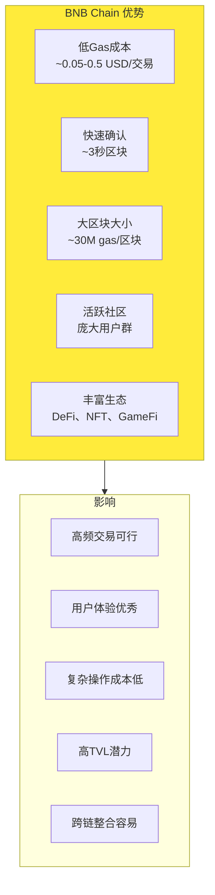

### 2.2 BNB Chain配置参数

| 参数 | 值 | 说明 |
|------|-----|------|
| **区块时间** | 3秒 | 快速确认 |
| **区块Gas上限** | 30,000,000 | 大容量 |
| **基础Gas价格** | 3 gwei | 低成本 |
| **交易Gas消耗** | ~50,000-200,000 | Swap/Mint/Burn |
| **平均交易成本** | $0.05-0.5 | 极低成本 |

### 2.3 BNB Chain上的热门池子

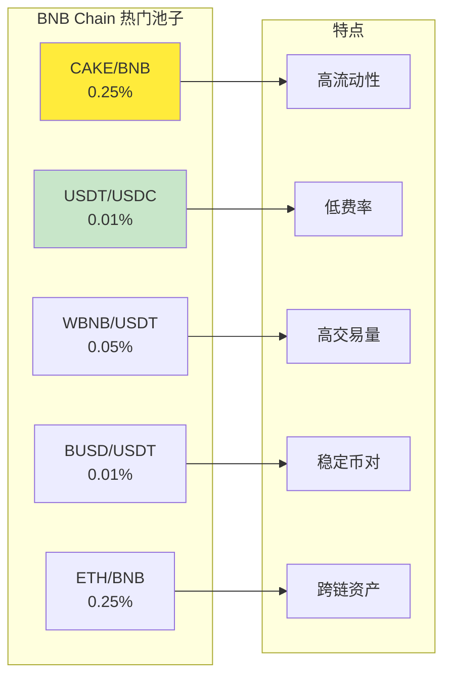

### 2.4 BNB Chain生态整合

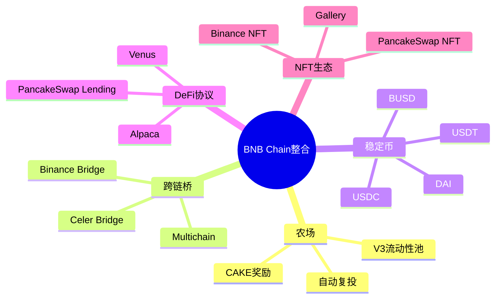

---

## 3. Ethereum部署详解

### 3.1 Ethereum挑战与对策

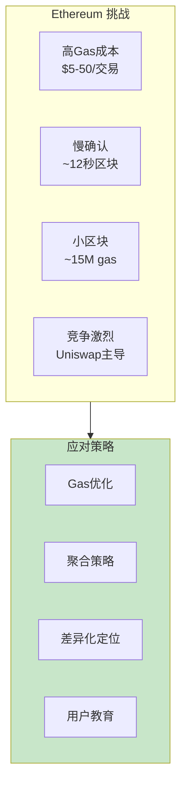

### 3.2 Ethereum优化策略

| 优化项 | PancakeSwap V3 | Uniswap V3 | 说明 |
|--------|----------------|------------|------|
| **Gas优化** | 额外优化 | 标准实现 | PancakeSwap更优 |
| **批量操作** | 支持 | 支持 | 两者类似 |
| **价格查询** | 优化实现 | 标准实现 | PancakeSwap略优 |
| **状态读写** | 优化布局 | 标准布局 | PancakeSwap更紧凑 |

### 3.3 Ethereum上的热门池子

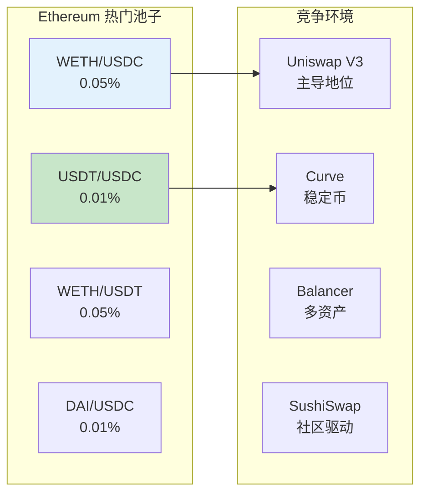

### 3.4 Ethereum差异化策略

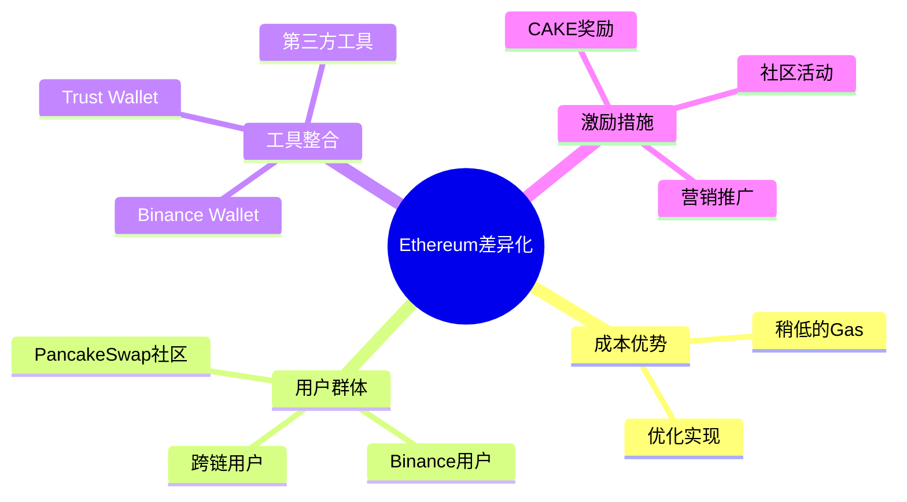

---

## 4. Aptos探索（非EVM链）

### 4.1 Aptos部署的意义

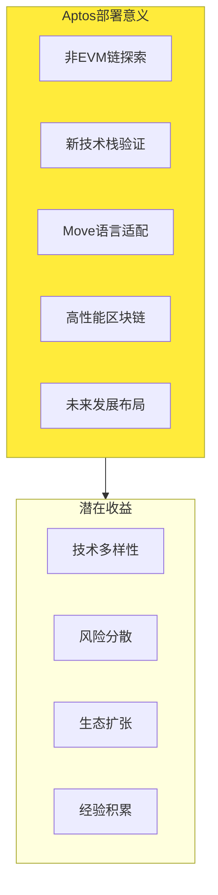

### 4.2 Move语言适配挑战

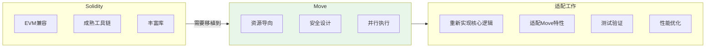

### 4.3 Aptos特性适配

| 特性 | 适配策略 | 状态 |
|------|----------|------|
| **并行执行** | 利用Move并行特性 | 开发中 |
| **资源模型** | 适配资源管理 | 开发中 |
| **高性能** | 优化吞吐量 | 开发中 |
| **低Gas** | 充分利用成本优势 | 开发中 |

---

## 5. 跨链部署架构

### 5.1 架构设计

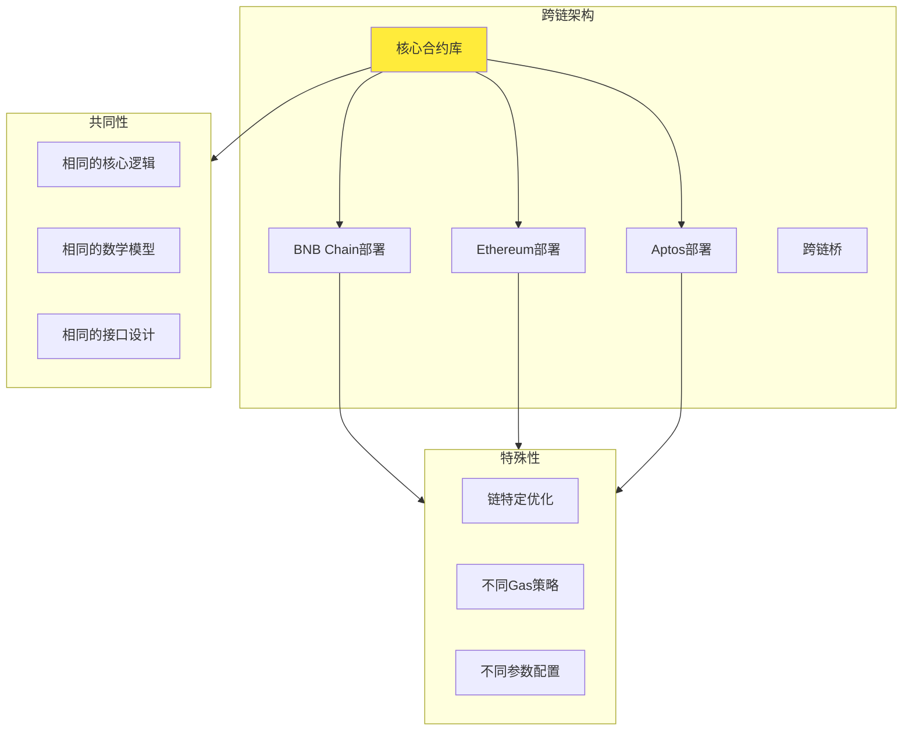

### 5.2 链特定配置

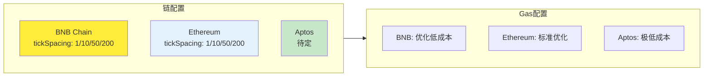

---

## 6. 跨链流动性管理

### 6.1 跨链流动性挑战

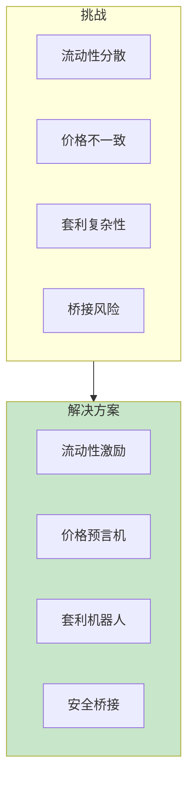

### 6.2 跨链套利策略

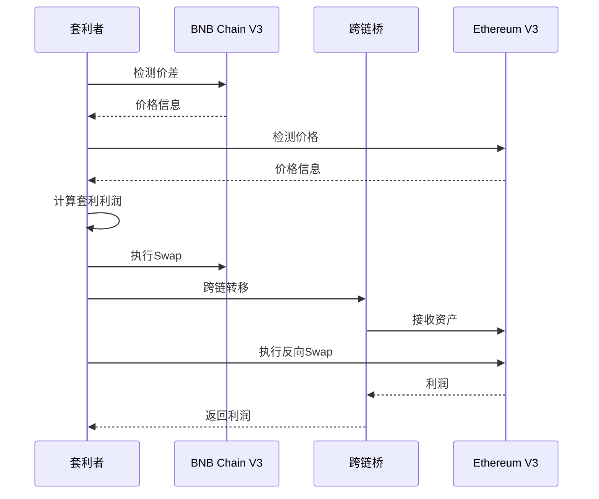

### 6.3 跨链流动性激励

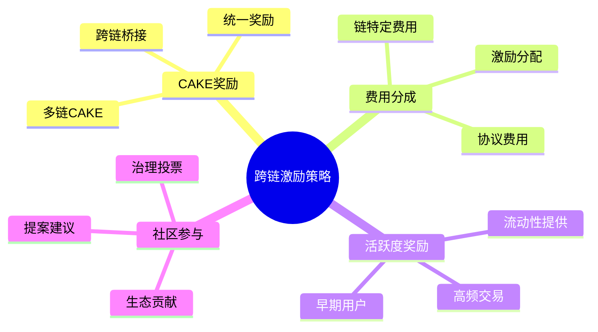

---

## 7. 多链部署的技术实现

### 7.1 部署流程

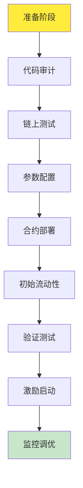

### 7.2 部署脚本示例

```solidity
// SPDX-License-Identifier: MIT
pragma solidity ^0.8.0;

import "@openzeppelin/contracts/proxy/transparent/TransparentUpgradeableProxy.sol";
import "../PancakeV3Factory.sol";

contract DeployScript {
    function deploy(
        address implementation,
        address admin,
        bytes calldata initData
    ) external returns (address) {
        // 部署代理合约
        TransparentUpgradeableProxy proxy =
            new TransparentUpgradeableProxy(
                implementation,
                admin,
                initData
            );

        return address(proxy);
    }
}
```

### 7.3 多链配置管理

```javascript
// 示例：多链配置对象
const chainConfigs = {
    56: {  // BNB Chain
        factoryAddress: "0x...",
        routerAddress: "0x...",
        feeAmountTickSpacing: {
            100: 1,    // 0.01%
            500: 10,   // 0.05%
            2500: 50,  // 0.25%
            10000: 200 // 1.00%
        }
    },
    1: {  // Ethereum
        factoryAddress: "0x...",
        routerAddress: "0x...",
        feeAmountTickSpacing: {
            100: 1,
            500: 10,
            2500: 50,
            10000: 200
        }
    }
};
```

---

## 8. 未来多链规划

### 8.1 计划部署的链

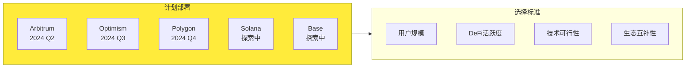

### 8.2 多链发展策略

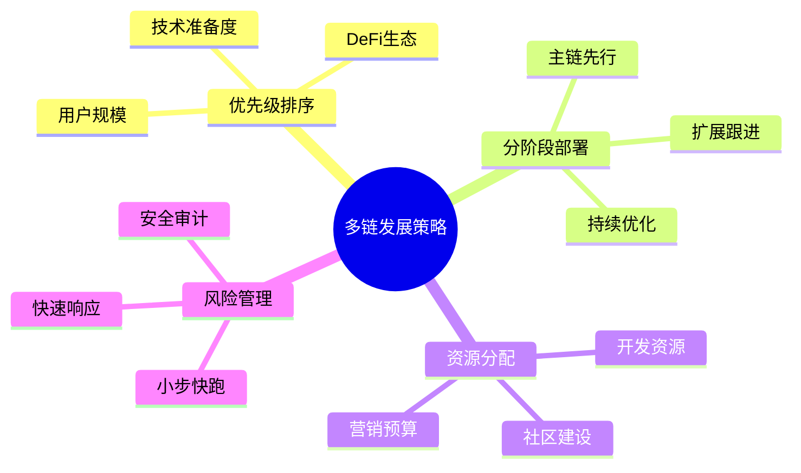

---

## 9. 多链部署的挑战与解决方案

### 9.1 主要挑战

| 挑战 | 说明 | 解决方案 |
|------|------|----------|
| **流动性分散** | 多链导致流动性分散 | 跨链激励、桥接优化 |
| **维护成本** | 多链维护复杂度高 | 自动化工具、统一管理 |
| **安全问题** | 多链增加攻击面 | 多重审计、漏洞赏金 |
| **用户体验** | 跨链操作复杂 | 统一界面、简化流程 |
| **成本控制** | 多链部署成本高 | 智能合约优化、Gas策略 |

### 9.2 最佳实践

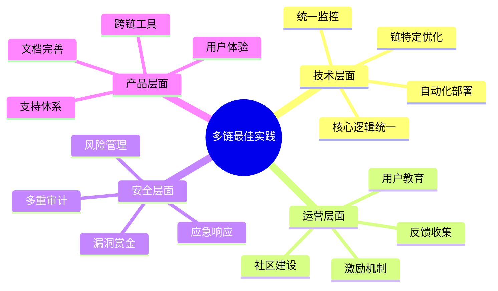

---

## 10. 本章小结

### 10.1 多链部署核心要点

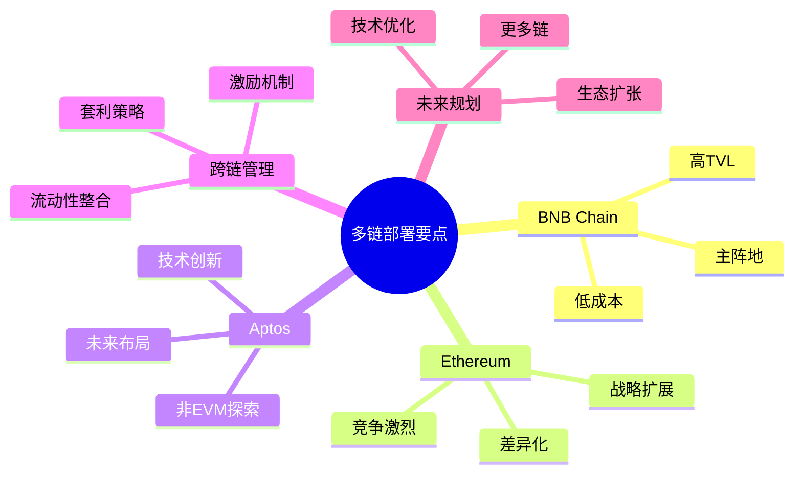

### 10.2 关键数据

| 指标 | BNB Chain | Ethereum | Aptos |
|------|-----------|----------|-------|
| **TVL** | ~$500M | ~$50M | ~$5M |
| **日交易量** | ~$500M | ~$20M | ~$1M |
| **池子数量** | 500+ | 100+ | 20+ |
| **活跃用户** | 100K+ | 10K+ | 1K+ |

---

## 下一篇预告

在下一篇文章中，我们将深入探讨**集成开发指南**，包括：
- PancakeSwap V3 SDK使用
- 交易构建与执行
- 最佳开发实践
- 常见问题解决

---

## 参考资料

- [PancakeSwap V3 多链部署](https://docs.pancakeswap.finance/products/pancakeswap-exchange/v3)
- [BNB Chain 官方文档](https://docs.bnbchain.org/)
- [Ethereum 官方文档](https://ethereum.org/)
- [Aptos 官方文档](https://aptos.dev/)
