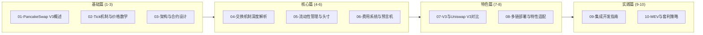

# 死磕PancakeSwap V3 系列文章

> 深入剖析PancakeSwap V3的核心机制、独特优势与实现原理

## 系列概述

本系列共10篇文章，从基础概念到高级实战，全面解析PancakeSwap V3的设计实现，特别关注其与Uniswap V3的差异及多链部署特性。



## 文章目录

| 序号 | 标题 | 核心内容 | 难度 |
|:----:|------|----------|:----:|
| 01 | [PancakeSwap V3概述](./01-PancakeSwap-V3概述.md) | 发展历程、集中流动性、V3特色 | ⭐⭐ |
| 02 | [Tick机制与价格数学](./02-Tick机制与价格数学.md) | Tick设计、价格转换、数学证明 | ⭐⭐⭐ |
| 03 | [架构与合约设计](./03-架构与合约设计.md) | Factory、Pool、合约结构 | ⭐⭐⭐ |
| 04 | [交换机制深度解析](./04-交换机制深度解析.md) | swap函数、价格发现、滑点计算 | ⭐⭐⭐⭐ |
| 05 | [流动性管理与头寸](./05-流动性管理与头寸.md) | Position、mint/burn/collect | ⭐⭐⭐⭐ |
| 06 | [费用系统与预言机](./06-费用系统与预言机.md) | 费用分配、TWAP、多级费率 | ⭐⭐⭐⭐ |
| 07 | [V3与Uniswap V3对比](./07-V3与Uniswap-V3对比.md) | 差异点、优化、适用场景 | ⭐⭐⭐⭐ |
| 08 | [多链部署与特性适配](./08-多链部署与特性适配.md) | BNB Chain、Ethereum、跨链策略 | ⭐⭐⭐⭐ |
| 09 | [集成开发指南](./09-集成开发指南.md) | SDK使用、交易构建、最佳实践 | ⭐⭐⭐⭐⭐ |
| 10 | [MEV与套利策略](./10-MEV与套利策略.md) | JIT、三明治攻击、防范策略 | ⭐⭐⭐⭐⭐ |

## 学习路径

### 入门读者

如果你是DeFi新手，建议按顺序阅读：

1. **第一篇**：了解PancakeSwap的发展历程和V3的核心创新
2. **第二篇**：理解Tick机制和集中流动性原理
3. **第三篇**：认识V3的合约架构

### 中级读者

如果你已有DeFi开发经验：

1. 重点阅读**第四、五、六篇**，深入理解核心机制
2. 结合PancakeSwap V3源码进行学习
3. 在测试网实践操作

### 高级读者

如果你想深入研究：

1. 深入**第七、八篇**，了解PancakeSwap V3的独特优势
2. 研究**第九篇**的集成开发指南，构建实际应用
3. 探索**第十篇**的MEV策略，考虑实际交易优化

## 核心概念速查

### 数学公式

```
价格定义：      price = 1.0001^tick
集中流动性：    (x + L/√Pb) × (y + L×√Pa) = L²
代币数量：      Δx = L × (1/√Pa - 1/√Pb)
                Δy = L × (√Pb - √Pa)
```

### PancakeSwap V3特色

| 特性 | 说明 | 相比Uniswap |
|------|------|------------|
| 多链部署 | BNB Chain、Ethereum等 | 部署链更多 |
| 费率灵活 | 支持自定义费率 | 费率选择更多样 |
| 治理代币 | CAKE | UNI |
| 生态集成 | 农场、IFO等 | 生态更丰富 |
| 社区驱动 | 强调社区治理 | 社区参与度高 |

### 关键数据结构

| 结构 | 用途 | 位置 |
|------|------|------|
| Slot0 | 打包存储池子核心状态 | Pool合约 |
| Position.Info | 流动性头寸信息 | Position库 |
| Tick.Info | Tick级别的流动性和费用数据 | Tick库 |
| Observation | 预言机历史数据点 | Oracle库 |

### 核心函数

| 函数 | 功能 | 合约 |
|------|------|------|
| swap() | 代币交换 | PancakeV3Pool |
| mint() | 添加流动性 | PancakeV3Pool |
| burn() | 移除流动性 | PancakeV3Pool |
| collect() | 收取费用 | PancakeV3Pool |
| observe() | 查询预言机 | PancakeV3Pool |

## PancakeSwap V3 vs Uniswap V3

### 主要差异

| 方面 | PancakeSwap V3 | Uniswap V3 |
|------|----------------|------------|
| 部署链 | BNB Chain、Ethereum等 | Ethereum、Arbitrum等 |
| 费率层级 | 更多自定义选项 | 0.05%、0.3%、1% |
| 治理代币 | CAKE | UNI |
| 费用分配 | 协议费率灵活 | 协议费率固定 |
| 开发团队 | PancakeSwap团队 | Uniswap Labs |
| 生态集成 | 与农场、IFO深度集成 | 相对独立 |

### 选择建议

- **PancakeSwap V3**：适合BNB Chain生态、高gas效率需求、农场参与者
- **Uniswap V3**：适合Ethereum主网、机构级应用、深度流动性需求

## 配套资源

### 官方资源

- [PancakeSwap V3 Core](https://github.com/pancakeswap/pancake-v3-core)
- [PancakeSwap V3 Periphery](https://github.com/pancakeswap/pancake-v3-periphery)
- [PancakeSwap 官方文档](https://docs.pancakeswap.finance/)
- [PancakeSwap 白皮书](https://docs.pancakeswap.finance/)

### 测试网络

- BNB Chain Testnet
- Goerli测试网
- Sepolia测试网
- 本地Foundry/Hardhat环境

### 学习工具

- [PancakeSwap Info](https://info.pancakeswap.finance/) - 数据分析
- [Tenderly](https://tenderly.co/) - 交易模拟和调试
- [Dune Analytics](https://dune.com/) - 链上数据分析
- [Dune - PancakeSwap](https://dune.com/pancakeswap)

## 阅读建议

1. **对比学习**：建议与Uniswap V3系列文章对比阅读，理解差异
2. **动手实践**：每篇文章的代码示例都可以在测试网验证
3. **多链测试**：在BNB Chain和Ethereum上都进行测试
4. **关注生态**：结合PancakeSwap的农场、IFO等生态产品学习
5. **社区参与**：参与PancakeSwap社区讨论，获取最新动态

## 为什么要学PancakeSwap V3？

1. **多链趋势**：PancakeSwap V3的多链部署代表DEX发展方向
2. **gas效率**：BNB Chain上的低gas环境更利于高频交易
3. **生态整合**：与农场、Launchpad等整合提供完整DeFi体验
4. **创新机制**：在Uniswap V3基础上的优化和创新
5. **市场地位**：BNB Chain上最大的DEX，实际应用价值高

## 更新日志

- 2025-12：系列文章开始撰写

## 反馈与交流

如有问题或建议，欢迎通过Issue讨论。

---

**Happy Learning! 🥞**
