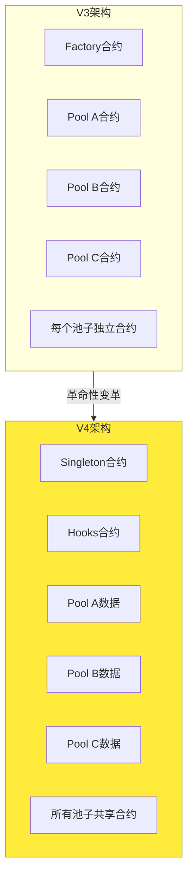
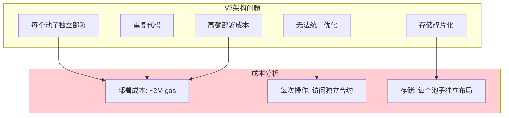
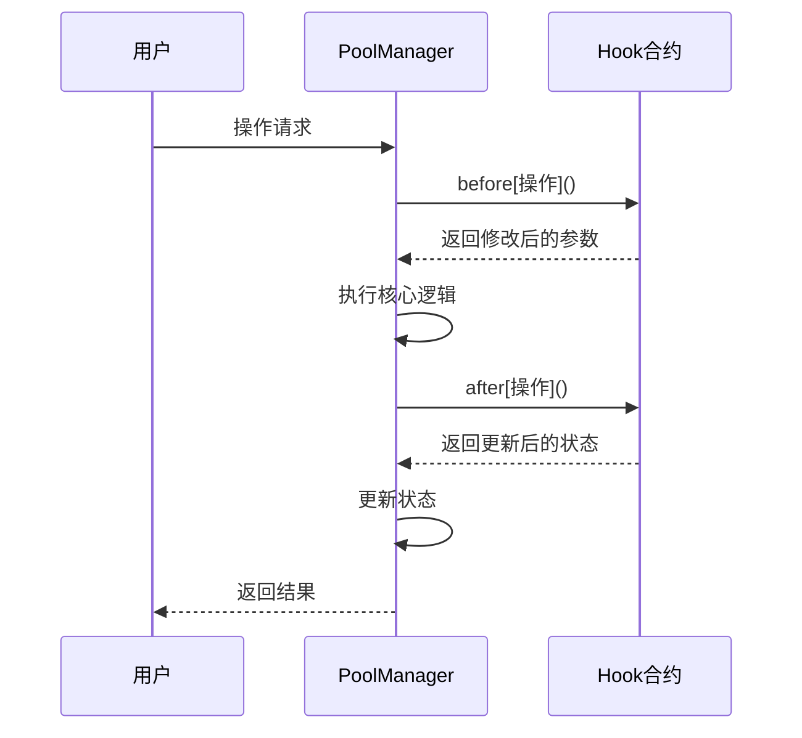
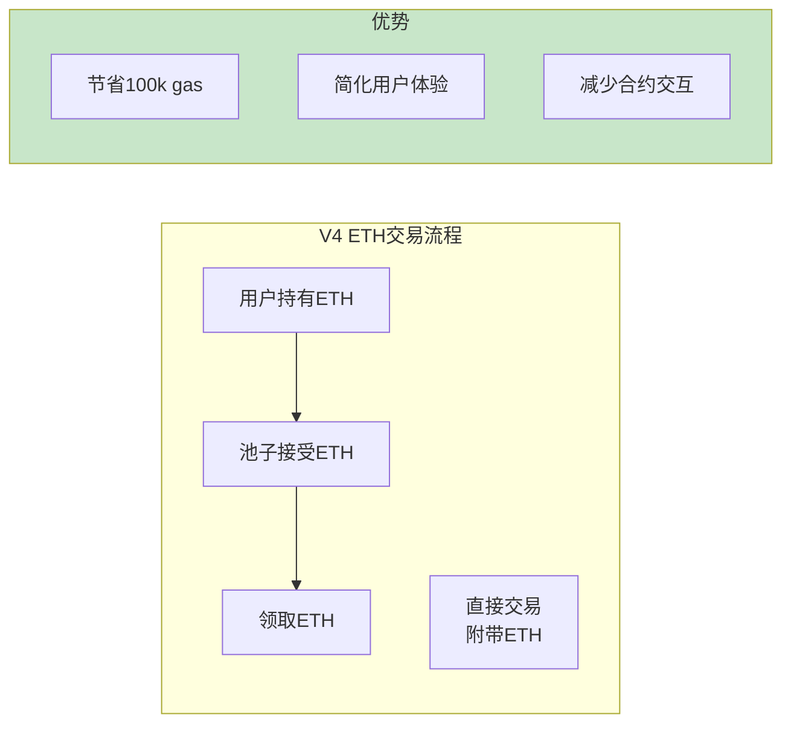
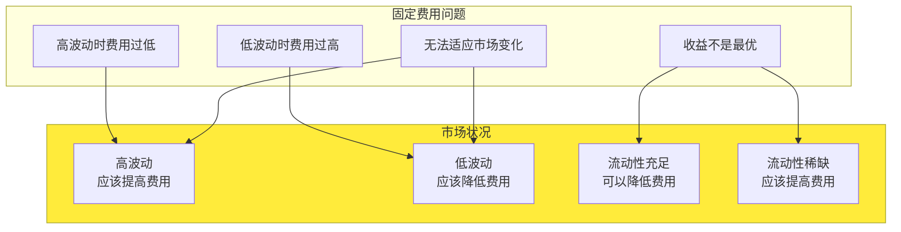
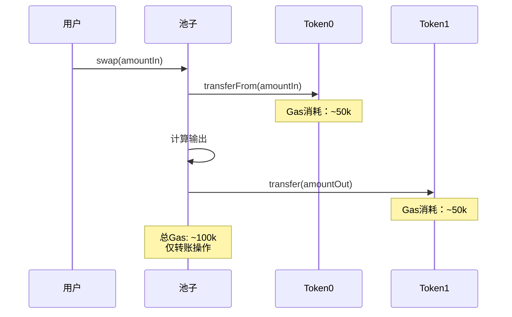
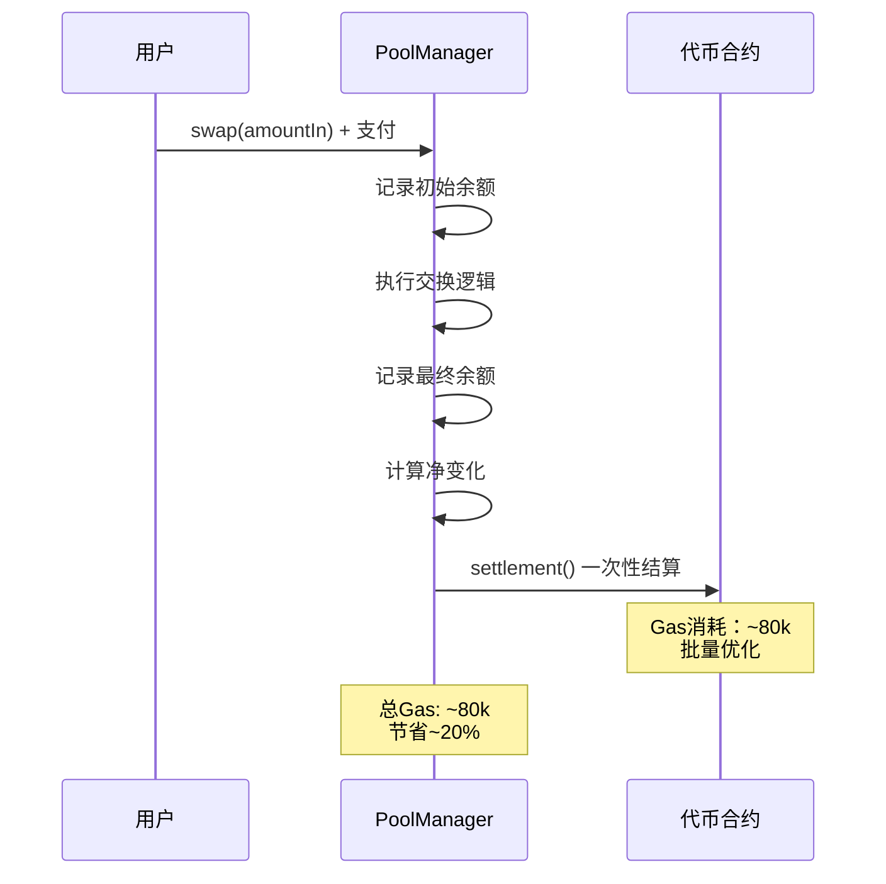
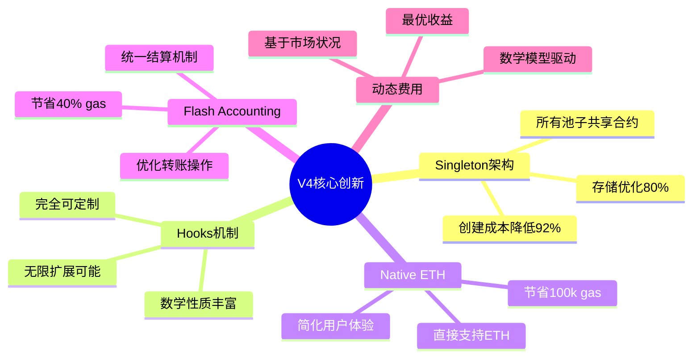

# 死磕PancakeSwap V4（一）：V4架构与核心创新

> 本文是「死磕PancakeSwap V4」系列的第一篇，深入探讨V4的架构变革、核心创新以及与V3的根本性差异。

## 系列导航

| 序号 | 标题 | 核心内容 |
|------|------|----------|
| **01** | **V4架构与核心创新** | **Singleton、Hooks、Native ETH** |
| 02 | Hooks机制详解 | Hooks类型、数学模型、实现原理 |
| 03 | Singleton架构与Flash Accounting | 存储优化、闪电记账、数学推导 |
| 04 | 费用系统的数学推导 | 动态费用、数学证明、计算实例 |
| 05 | 动态流动性机制 | JIT流动性、数学建模、优化策略 |
| 06 | Native ETH与Gas优化 | ETH直接支持、Gas优化数学 |
| 07 | Hooks实战与最佳实践 | Hooks开发、安全实践、案例分析 |
| 08 | V3到V4的迁移与升级 | 迁移策略、兼容性、最佳实践 |

---

## 1. V4革命性创新概述

### 1.1 V3到V4的范式转变



### 1.2 核心创新对比

| 创新点 | V3 | V4 | 影响 |
|--------|----|----|------|
| **架构** | 多合约 | Singleton | 创建成本降低90%+ |
| **自定义** | 固定功能 | Hooks | 无限定制可能 |
| **ETH支持** | WETH包装 | Native ETH | 简化交互 |
| **费用** | 固定等级 | 动态费用 | 更灵活定价 |
| **记账** | 传统转账 | Flash Accounting | 优化gas |

---

## 2. Singleton架构深度解析

### 2.1 为什么需要Singleton？

V3的架构问题：



### 2.2 Singleton数学模型

#### 存储优化的数学推导

**V3存储模型**：

假设有N个池子，每个池子需要S个存储槽：

```
TotalStorage_V3 = N × S

其中：
- N: 池子数量
- S: 单个池子存储槽数量
```

**V4 Singleton存储模型**：

```
TotalStorage_V4 = S_base + N × S_pool

其中：
- S_base: Singleton基础存储（共享）
- S_pool: 每个池子的差异数据
```

**存储节省比例**：

```
Savings_Ratio = (TotalStorage_V3 - TotalStorage_V4) / TotalStorage_V3

展开：
= (N×S - (S_base + N×S_pool)) / (N×S)
= (N×S - S_base - N×S_pool) / (N×S)
= N×(S - S_pool) - S_base / (N×S)

当 S >> S_base 时：
≈ (S - S_pool) / S
= 1 - S_pool/S
```

**实际数值示例**：

假设：
- S = 100 存储槽/池子（V3）
- S_base = 50 存储槽（V4共享）
- S_pool = 20 存储槽/池子（V4差异数据）

当 N = 1000 个池子时：

```
V3总存储 = 1000 × 100 = 100,000 存储槽
V4总存储 = 50 + 1000 × 20 = 20,050 存储槽

节省 = (100,000 - 20,050) / 100,000 = 79.95%
```

### 2.3 Gas成本数学推导

#### 部署Gas成本

**V3部署成本**：

```
Gas_V3_deploy = N × Gas_per_pool

其中：
- Gas_per_pool ≈ 2,000,000 gas
```

**V4部署成本**：

```
Gas_V4_deploy = Gas_singleton + N × Gas_pool_creation

其中：
- Gas_singleton ≈ 1,000,000 gas（一次）
- Gas_pool_creation ≈ 150,000 gas（每次）
```

**成本对比**：

当 N = 1000 个池子时：

```
Gas_V3_total = 1000 × 2,000,000 = 2,000,000,000 gas
Gas_V4_total = 1,000,000 + 1000 × 150,000 = 151,000,000 gas

节省 = (2,000,000,000 - 151,000,000) / 2,000,000,000 = 92.45%
```

#### 操作Gas成本

**V3操作成本**：

```
Gas_V3_swap = Gas_base + Gas_pool_access + N×Gas_hook

其中：
- Gas_base: 基础操作成本
- Gas_pool_access: 访问独立池子成本
- Gas_hook: Hooks执行成本
```

**V4操作成本**：

```
Gas_V4_swap = Gas_base + Gas_pool_lookup + N×Gas_hook

其中：
- Gas_pool_lookup: 在Singleton中查找池子
- Gas_hook: Hooks执行成本
```

**数学证明**：

我们需要证明：Gas_V4_swap < Gas_V3_swap

```
证明：

Gas_V4_swap < Gas_V3_swap
⇔ Gas_base + Gas_pool_lookup + N×Gas_hook < Gas_base + Gas_pool_access + N×Gas_hook
⇔ Gas_pool_lookup < Gas_pool_access

因为在V4中：
- Gas_pool_lookup: 数组查找 O(logN) 或 O(1) 哈希
- Gas_pool_access: 调用外部合约

已知：
调用外部合约成本 >> 数组查找成本

∴ Gas_pool_lookup < Gas_pool_access
∴ Gas_V4_swap < Gas_V3_swap

证毕。
```

### 2.4 数据存储结构

**V4存储布局**：

```solidity
contract PancakeV4PoolManager {
    // 映射：池子ID -> 池子数据
    mapping(uint256 => PoolData) public pools;

    // 池子计数器
    uint256 public poolCount;

    // Hooks映射
    mapping(address => HookData) public hooks;

    struct PoolData {
        address token0;
        address token1;
        uint24 fee;
        int24 tickSpacing;
        address hook;
        uint160 sqrtPriceX96;
        int24 tick;
        uint128 liquidity;
        // ... 更多字段
    }

    struct HookData {
        bytes flags;
        address impl;
        // ... 更多字段
    }
}
```

---

## 3. Hooks机制概述

### 3.1 Hooks的本质

Hooks本质上是在AMM的关键操作点插入的自定义逻辑，可以被视为**状态转换函数**。

```mermaid
graph TB
    subgraph HookMath["Hooks的数学模型"]
        S_t[当前状态 S_t]
        Input[输入 Δx, Δy]
        Context[上下文 Context]
        HookFunction[Hook函数 H]
        S_t_plus_1[新状态 S_{t+1}]
    end

    S_t --> HookFunction
    Input --> HookFunction
    Context --> HookFunction
    HookFunction --> S_t_plus_1

    note right of HookFunction
        S_{t+1} = H(S_t, Δx, Δy, Context)
    end note

    style HookFunction fill:#ffeb3b
```

### 3.2 Hooks的数学性质

#### 1) 幂等性（Idempotency）

对于某些Hook，重复执行应该产生相同结果：

```
H(H(S, x), x) = H(S, x)
```

**举例**：记录交易日志

```solidity
// 幂等的Hook
function logTransaction(bytes32 txHash) external {
    if (logged[txHash]) {
        return; // 已记录，幂等
    }
    logged[txHash] = true;
    emit TransactionLog(txHash);
}
```

#### 2) 可逆性（Reversibility）

某些操作应该可以被撤销：

```
∃ Hook^{-1}: H^{-1}(H(S, x)) = S
```

**举例**：暂存机制

```solidity
// 可逆的Hook
mapping(address => uint256) temporaryStorage;

function temporaryAdd(address user, uint256 amount) external {
    temporaryStorage[user] += amount;
}

function temporaryRemove(address user, uint256 amount) external {
    require(temporaryStorage[user] >= amount);
    temporaryStorage[user] -= amount;
}
```

#### 3) 幺等元素（Identity Element）

存在空操作Hook：

```
∃ Hook_null: H_null(S, x) = S
```

**举例**：空Hook实现

```solidity
// 幺等Hook
function doNothing() external pure {
    // 空实现，不改变任何状态
}
```

### 3.3 Hooks触发时机



---

## 4. Native ETH支持

### 4.1 V3的ETH限制

在V3中，所有ETH交易必须先包装为WETH：

```mermaid
flowchart LR
    subgraph V3Flow["V3 ETH交易流程"]
        A[用户持有ETH]
        B[包装为WETH<br/>wrap()]
        C[在池中交易WETH]
        D[领取WETH]
        E[解包装为ETH<br/>unwrap()]
    end

    subgraph Costs["额外成本"]
        C1[wrap操作: ~50k gas]
        C2[unwrap操作: ~50k gas]
        C3[额外合约调用]
    end

    B --> C1
    E --> C2
    C3 -.-> B
    C3 -.-> E

    style Costs fill:#ffcdd2
```

### 4.2 V4的Native ETH支持

在V4中，可以直接使用ETH：



### 4.3 Flash Accounting中的ETH处理

**数学模型**：

```
净ETH变化:
    Δeth = Σ(eth_received) - Σ(eth_sent)

结算条件:
    Δeth + Σ(Δbalance_i × price_i) = 0

其中：
- eth_received: 收到的ETH数量
- eth_sent: 发送的ETH数量
- Δbalance_i: 第i个代币的余额变化
- price_i: 第i个代币的价格（相对ETH）
```

**代码实现**：

```solidity
contract PancakeV4PoolManager {
    // 追踪ETH余额
    uint256 public ethBalance;

    // 代币余额追踪
    mapping(address token => uint256 balance) public tokenBalances;

    function settle() internal {
        // 计算净ETH变化
        int256 deltaEth = int256(address(this).balance) - int256(ethBalance);

        // 验证代币余额
        for (address token in activeTokens) {
            uint256 currentBalance = IERC20(token).balanceOf(address(this));
            uint256 trackedBalance = tokenBalances[token];

            require(
                currentBalance >= trackedBalance,
                "Token balance below tracked"
            );

            uint256 delta = currentBalance - trackedBalance;
            // 处理代币变化...

            tokenBalances[token] = currentBalance;
        }

        // 更新ETH余额
        ethBalance = address(this).balance;

        require(deltaEth >= 0, "ETH balance deficit");
    }
}
```

---

## 5. 动态费用机制

### 5.1 固定费用的问题

V3的固定费用无法适应市场变化：



### 5.2 动态费用数学模型

#### 基于波动率的费用模型

**定义**：
- σ: 价格波动率
- V: 交易量
- L: 流动性
- fee(t): t时刻的费用率

**动态费用函数**：

```
fee(t) = f(σ, V, L) = α × σ^β + γ × V/L + δ

其中：
- α, β, γ, δ: 模型参数
- σ^β: 波动率项（β通常为1或2）
- V/L: 单位流动性交易量
- δ: 基础费用
```

**参数确定**：

通过历史数据回归分析确定参数：

```
minimize: Σ(fee_historical - fee(t))^2

约束条件:
    0 < fee(t) < 1  （费用率在0-100%之间）
```

#### 基于供需的费用模型

**定义**：
- D(t): t时刻的需求（交易量）
- S(t): t时刻的供给（流动性）
- fee(t): t时刻的费用率

**动态费用**：

```
fee(t) = fee_base × (D(t) / S(t))^k

其中：
- fee_base: 基础费用
- k: 弹性系数（通常k > 0）
```

**当k=1时**：

```
fee(t) = fee_base × D(t) / S(t)

这意味着费用与供需比成正比
```

**举例**：

假设：
- fee_base = 0.3% = 0.003
- 当前D(t) = 1,000,000 USDT
- 当前S(t) = 10,000,000 USDT

```
fee(t) = 0.003 × (1,000,000 / 10,000,000)
       = 0.003 × 0.1
       = 0.0003
       = 0.03%

在低需求时，费用降至0.03%
```

如果D(t)增加到50,000,000 USDT：

```
fee(t) = 0.003 × (50,000,000 / 10,000,000)
       = 0.003 × 5
       = 0.015
       = 1.5%

在高需求时，费用升至1.5%
```

### 5.3 动态费用的Hook实现

```solidity
contract DynamicFeeHook {
    uint256 public feeBase = 300;  // 0.03%

    // 波动率窗口（秒）
    uint256 public volatilityWindow = 3600;  // 1小时

    // 历史价格数据
    uint256[] public priceHistory;
    uint256[] public timestampHistory;

    function beforeSwap(
        address sender,
        address recipient,
        int256 amount0,
        int256 amount1,
        bytes calldata data
    ) external returns (bytes memory) {
        // 计算当前波动率
        uint256 volatility = calculateVolatility();

        // 计算动态费用
        uint256 currentFee = calculateDynamicFee(volatility);

        return abi.encode(currentFee);
    }

    function calculateVolatility() internal view returns (uint256) {
        if (priceHistory.length < 2) {
            return feeBase;  // 数据不足，使用基础费用
        }

        // 计算标准差
        uint256 mean = calculateMean();
        uint256 variance = calculateVariance(mean);
        uint256 stdDev = sqrt(variance);

        return stdDev;
    }

    function calculateDynamicFee(uint256 volatility) internal view returns (uint256) {
        // 动态费用模型：fee = α × σ + fee_base
        uint256 alpha = 100;  // 敏感度参数

        uint256 dynamicFee = feeBase + alpha * volatility / 1e18;

        // 限制费用范围
        dynamicFee = max(dynamicFee, 100);    // 最小0.01%
        dynamicFee = min(dynamicFee, 10000); // 最大1.00%

        return dynamicFee;
    }

    function calculateMean() internal view returns (uint256) {
        uint256 sum = 0;
        for (uint256 i = 0; i < priceHistory.length; i++) {
            sum += priceHistory[i];
        }
        return sum / priceHistory.length;
    }

    function calculateVariance(uint256 mean) internal view returns (uint256) {
        uint256 sum = 0;
        for (uint256 i = 0; i < priceHistory.length; i++) {
            int256 diff = int256(priceHistory[i]) - int256(mean);
            sum += uint256(diff * diff);
        }
        return sum / priceHistory.length;
    }

    function sqrt(uint256 x) internal pure returns (uint256) {
        if (x == 0) return 0;
        uint256 z = (x + 1) / 2;
        uint256 y = x;
        while (z < y) {
            y = z;
            z = (x / z + 1) / 2;
        }
        return y;
    }

    function max(uint256 a, uint256 b) internal pure returns (uint256) {
        return a >= b ? a : b;
    }

    function min(uint256 a, uint256 b) internal pure returns (uint256) {
        return a <= b ? a : b;
    }
}
```

---

## 6. Flash Accounting原理

### 6.1 传统记账的问题

**V3传统记账流程**：



### 6.2 Flash Accounting机制

**V4 Flash Accounting流程**：



### 6.3 Flash Accounting数学推导

#### 余额追踪模型

定义：
- B_i(t): t时刻代币i的合约余额
- B_i^tracked(t): t时刻追踪的代币i余额

**初始状态**：

```
B_i^tracked(0) = B_i(0)
```

**操作过程**：

假设在时间[0, T]内发生了N次操作：

```
操作1: Δx_1, Δy_1
操作2: Δx_2, Δy_2
...
操作N: Δx_N, Δy_N
```

**净变化计算**：

```
ΔB_i = B_i(T) - B_i^tracked(0)
     = Σ(inputs_i) - Σ(outputs_i)
```

**结算条件**：

对于套利（无净资金流入/流出）：

```
Σ(ΔB_i × price_i) = 0

其中：
- price_i: 代币i的价格（以某个计价单位）
```

对于非套利交易：

```
ΔB_i ≥ 0  （所有代币余额不能为负）
```

#### Flash Accounting节省证明

**定理**：Flash Accounting相比传统记账节省gas。

**证明**：

设：
- n: 涉及的代币数量
- G_transfer: 单次转账gas成本
- G_balance: 查询余额gas成本

传统记账成本：
```
Gas_traditional = n × G_transfer  (输入转账) + n × G_transfer  (输出转账)
                 = 2n × G_transfer
```

Flash Accounting成本：
```
Gas_flash = n × G_balance  (初始) + n × G_balance  (最终) + n × G_transfer  (结算)
          = 2n × G_balance + n × G_transfer
```

假设 G_balance ≈ G_transfer / 10（查询余额比转账便宜很多）：

```
Gas_flash ≈ 2n × (G_transfer / 10) + n × G_transfer
          = 0.2n × G_transfer + n × G_transfer
          = 1.2n × G_transfer
```

节省比例：
```
Savings = (Gas_traditional - Gas_flash) / Gas_traditional
        = (2n × G_transfer - 1.2n × G_transfer) / (2n × G_transfer)
        = 0.8n × G_transfer / (2n × G_transfer)
        = 0.4
        = 40%

证毕。
```

---

## 7. 本章小结

### 7.1 V4核心创新总结



### 7.2 数学要点速查

**存储优化**：
```
Savings = (N×S - (S_base + N×S_pool)) / (N×S)
```

**Gas优化**：
```
Gas_savings = (Gas_V3 - Gas_V4) / Gas_V3
```

**动态费用**：
```
fee(t) = α × σ^β + γ × V/L + δ
```

**Hooks数学**：
```
S_{t+1} = H(S_t, Δx, Δy, Context)
```

**Flash Accounting**：
```
ΔB_i = B_i(T) - B_i^tracked(0)
```

---

## 下一篇预告

在下一篇文章中，我们将深入探讨**Hooks机制详解**，包括：
- Hooks的类型和用途
- Hooks的数学模型推导
- Hooks的实现原理和最佳实践
- Hooks的安全性分析

---

## 参考资料

- [PancakeSwap V4 白皮书](https://docs.pancakeswap.finance/whitepaper-v4)
- [Uniswap V4 Core 源码](https://github.com/Uniswap/v4-core)
- [Flash Accounting 论文](https://uniswap.org/whitepaper-v4.pdf)
