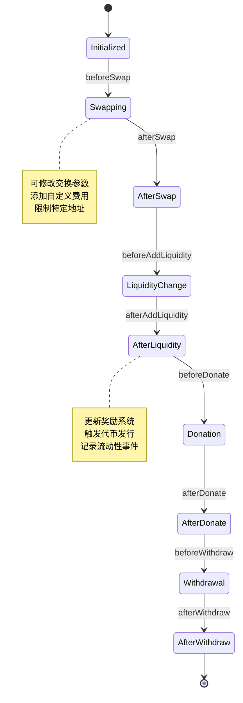
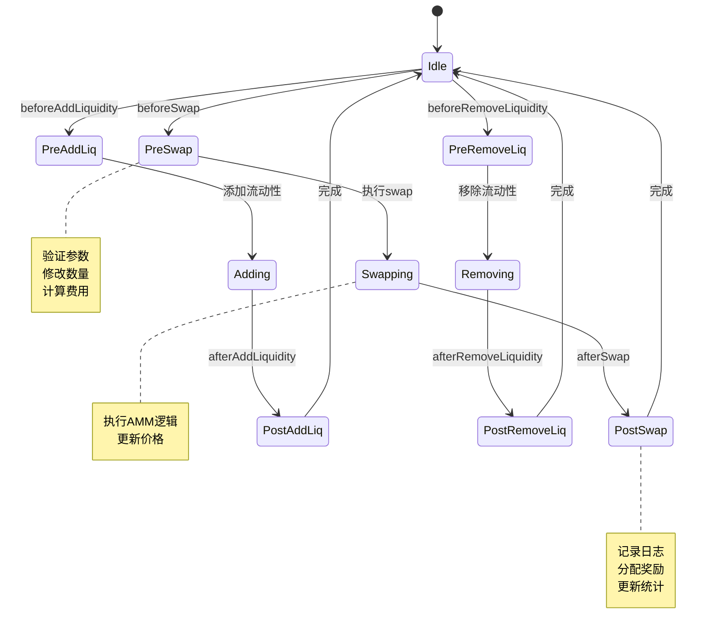
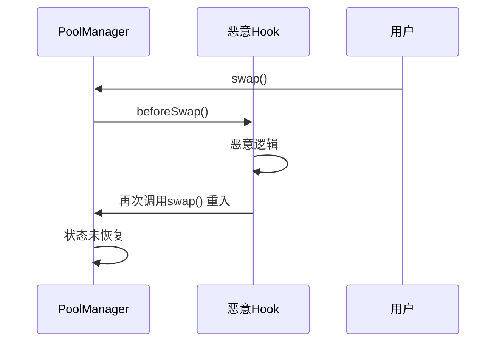
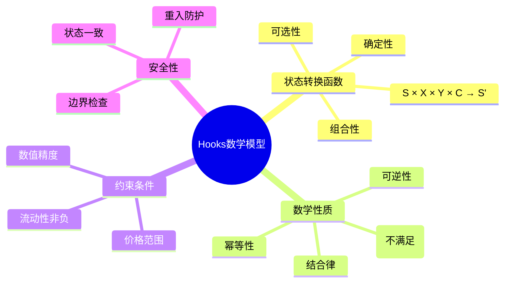

# 死磕PancakeSwap V4（二）：Hooks机制详解

> 本文是「死磕PancakeSwap V4」系列的第二篇，深入剖析Hooks机制的数学模型、类型、实现原理以及安全分析。

## 系列导航

| 序号 | 标题 | 核心内容 |
|------|------|----------|
| 01 | V4架构与核心创新 | Singleton、Hooks、Native ETH |
| **02** | **Hooks机制详解** | **Hooks类型、数学模型、实现原理** |
| 03 | Singleton架构与Flash Accounting | 存储优化、闪电记账、数学推导 |
| 04 | 费用系统的数学推导 | 动态费用、数学证明、计算实例 |
| 05 | 动态流动性机制 | JIT流动性、数学建模、优化策略 |
| 06 | Native ETH与Gas优化 | ETH直接支持、Gas优化数学 |
| 07 | Hooks实战与最佳实践 | Hooks开发、安全实践、案例分析 |
| 08 | V3到V4的迁移与升级 | 迁移策略、兼容性、最佳实践 |

---

## 1. Hooks机制概述

### 1.1 Hooks的本质定义

从数学角度，Hook可以定义为**状态转换函数**：

```
H: S × X × Y × C → S'

其中：
- S: 当前状态空间
- X: 输入代币变化量
- Y: 输出代币变化量
- C: 上下文信息
- S': 新状态空间
- H: Hook函数
```

**函数性质**：

1. **确定性**（Determinism）：
```
∀(s, x, y, c): H(s, x, y, c) = s'
相同的输入总是产生相同的输出
```

2. **可选性**（Optionality）：
```
H可以为恒等函数（Identity Function）
H_id(s, x, y, c) = s
```

3. **组合性**（Composability）：
```
H_composite = H2 ∘ H1
H_composite(s, x, y, c) = H2(H1(s, x, y, c))
```

### 1.2 Hooks的生命周期



---

## 2. Hooks类型的数学分析

### 2.1 Initialize Hooks

#### beforeInitialize Hook

**函数签名**：
```solidity
function beforeInitialize(
    address sender,
    uint160 sqrtPriceX96,
    bytes calldata data
) external returns (bytes memory);
```

**数学模型**：

```
H_beforeInit: S₀ × P × D → S₁ × P'

其中：
- S₀: 初始状态
- P: 初始价格 sqrtPriceX96
- D: 自定义数据 data
- S₁: Hook处理后的状态
- P': 可修改的初始价格
```

**约束条件**：

```
1. 价格范围约束:
   0 < sqrtPriceX96 < 2^160

2. Tick约束:
   sqrt(1.0001^MIN_TICK) × 2^96 ≤ sqrtPriceX96 ≤ sqrt(1.0001^MAX_TICK) × 2^96

3. 数值精度约束:
   sqrtPriceX96 ≡ 0 (mod 2^8)  （最低8位为0）
```

**示例：价格限制Hook**

```solidity
contract PriceLimitHook {
    uint160 public minSqrtPriceX96;
    uint160 public maxSqrtPriceX96;

    function beforeInitialize(
        address sender,
        uint160 sqrtPriceX96,
        bytes calldata data
    ) external pure returns (bytes memory) {
        require(
            sqrtPriceX96 >= minSqrtPriceX96 &&
            sqrtPriceX96 <= maxSqrtPriceX96,
            "Price out of range"
        );
        return abi.encode(sqrtPriceX96);
    }
}
```

#### afterInitialize Hook

**数学模型**：

```
H_afterInit: S₁ × P → S₂ × M

其中：
- S₁: 初始化后的状态
- P: 实际使用的价格
- S₂: Hook处理后的状态
- M: 额外的元数据
```

### 2.2 Swap Hooks

#### beforeSwap Hook

这是最复杂的Hook之一，涉及价格和数量的数学验证。

**函数签名**：
```solidity
function beforeSwap(
    address sender,
    address recipient,
    int256 amount0,
    int256 amount1,
    uint160 sqrtPriceLimitX96,
    bytes calldata data
) external returns (bytes memory);
```

**数学模型**：

```
H_beforeSwap: S × A₀ × A₁ × P_limit × D → S' × A₀' × A₁'

其中：
- S: 当前池子状态
- A₀: token0数量（正为输入，负为输出）
- A₁: token1数量（正为输入，负为输出）
- P_limit: 价格限制
- D: 自定义数据
- S': Hook修改后的状态
- A₀', A₁': 可修改的交换数量
```

**价格一致性约束**：

设交换前的价格为P，交换后的价格为P'，数量为(Δx, Δy)：

```
恒定乘积公式（简化版）：
(x + Δx) × (y + Δy) = x × y

假设y/x = P（价格），则：
y = P × x

代入：
(x + Δx) × (P × x + Δy) = x × P × x
⇒ P × x² + x × Δy + P × x × Δx + Δx × Δy = P × x²
⇒ x × Δy + P × x × Δx + Δx × Δy = 0

对于微小变化（忽略Δx × Δy）：
⇒ x × Δy ≈ -P × x × Δx
⇒ Δy ≈ -P × Δx

因此：
Δx × P + Δy ≈ 0  （价格一致性）
```

**精确计算（考虑流动性L）**：

V3/V4的集中流动性模型：

```
如果 zeroForOne = true（卖出token0，买入token1）：
Δy = L × (√P - √P')

如果 zeroForOne = false（卖出token1，买入token0）：
Δx = L × (1/√P' - 1/√P)
```

**Hook验证示例**：

```solidity
contract PriceCheckHook {
    function beforeSwap(
        address sender,
        address recipient,
        int256 amount0,
        int256 amount1,
        uint160 sqrtPriceLimitX96,
        bytes calldata data
    ) external view returns (bytes memory) {
        // 解析当前价格
        uint160 currentSqrtPrice = getCurrentSqrtPrice();

        // 计算新价格（简化模型）
        uint160 newSqrtPrice = calculateNewSqrtPrice(
            currentSqrtPrice,
            amount0,
            amount1
        );

        // 验证价格限制
        if (amount0 > 0) {  // selling token0, price decreases
            require(
                newSqrtPrice >= sqrtPriceLimitX96,
                "Price limit exceeded"
            );
        } else {  // selling token1, price increases
            require(
                newSqrtPrice <= sqrtPriceLimitX96,
                "Price limit exceeded"
            );
        }

        return bytes("");
    }

    function calculateNewSqrtPrice(
        uint160 currentSqrtPrice,
        int256 amount0,
        int256 amount1
    ) internal pure returns (uint160) {
        // 简化计算：假设恒定乘积
        // Δx × P + Δy ≈ 0
        // P = (√price)²

        uint256 price = (uint256(currentSqrtPrice) * uint256(currentSqrtPrice)) >> 192;

        int256 expectedAmount1;
        if (amount0 > 0) {
            expectedAmount1 = -int256((uint256(amount0) * price) >> 96);
        } else {
            expectedAmount1 = int256((uint256(-amount0) << 96) / price);
        }

        // 验证实际amount1与预期是否接近
        // 允许一定的误差（由于流动性集中）
        require(
            abs(amount1 - expectedAmount1) <= expectedAmount1 / 100,  // 1%误差
            "Invalid swap amounts"
        );

        // 返回新价格（简化计算）
        return currentSqrtPrice;
    }

    function abs(int256 x) internal pure returns (int256) {
        return x >= 0 ? x : -x;
    }

    function getCurrentSqrtPrice() internal view returns (uint160) {
        // 从池子获取当前价格
        // 实际实现需要访问池子状态
        return 0;
    }
}
```

#### afterSwap Hook

**数学模型**：

```
H_afterSwap: S × A₀ × A₁ × P_final → S'' × R

其中：
- S: Hook处理后的状态
- A₀, A₁: 实际交换数量
- P_final: 最终价格
- S'': 最终状态
- R: 返回数据
```

**费用计算**：

交易费用fee需要按比例分配：

```
fee_total = fee_input + fee_output
fee_lp = fee_total × (1 - protocol_fee_rate)
fee_protocol = fee_total × protocol_fee_rate

按流动性分配给LP：
fee_i_LP = fee_lp × (L_i / L_total)

其中：
- L_i: LP i的流动性
- L_total: 总流动性
```

**Hook实现示例：费用再分配**：

```solidity
contract FeeRedistributionHook {
    mapping(address => uint256) public userFees;

    function afterSwap(
        address sender,
        address recipient,
        int256 amount0,
        int256 amount1,
        uint160 sqrtPriceX96,
        int24 tick,
        bytes calldata data
    ) external returns (bytes memory) {
        // 解析实际费用
        (uint256 fee0, uint256 fee1) = decodeFees(data);

        // 重新分配费用（例如：给推荐人分成）
        address referrer = getReferrer(sender);

        if (referrer != address(0)) {
            uint256 referrerFee0 = fee0 / 10;  // 10%推荐奖励
            uint256 referrerFee1 = fee1 / 10;

            userFees[referrer] += referrerFee0;
            userFees[referrer] += referrerFee1;
        }

        return bytes("");
    }
}
```

### 2.3 Liquidity Hooks

#### beforeAddLiquidity / beforeRemoveLiquidity

**数学模型**：

添加流动性：

```
H_beforeAddLiq: S × ΔL × (P_lower, P_upper) → S' × ΔL' × (P_lower', P_upper')

其中：
- ΔL: 添加的流动性数量
- P_lower, P_upper: 价格区间
```

**流动性计算的数学推导**：

给定价格区间[Pa, Pb]和流动性L，所需代币数量：

**情况1：价格在区间下方 (P < Pa)**

```
只需要token0：
x = L / √Pb

证明：

在集中流动性模型中：
(x + L/√Pb) × (y + L√Pa) = L²

当 P < Pa 时，y = 0（不需要token1）

代入：
(x + L/√Pb) × (0 + L√Pa) = L²
⇒ x + L/√Pb = L / (L√Pa)
⇒ x + L/√Pb = 1/√Pa
⇒ x = 1/√Pa - L/√Pb
⇒ x = L × (1/√Pa - 1/√Pb)

证毕。
```

**情况2：价格在区间内 (Pa ≤ P ≤ Pb)**

```
需要两种代币：
x = L × (1/√P - 1/√Pb)
y = L × (√P - √Pa)

证明：

设当前价格为P，有：
√P - √Pa = Δy / L  (1)
1/√Pb - 1/√P = Δx / L  (2)

从(1)：
Δy = L × (√P - √Pa)

从(2)：
Δx = L × (1/√Pb - 1/√P)

证毕。
```

**情况3：价格在区间上方 (P > Pb)**

```
只需要token1：
y = L × √Pa

证明：

当 P > Pb 时，x = 0（不需要token0）

代入集中流动性公式：
(0 + L/√Pb) × (y + L√Pa) = L²
⇒ L/√Pb × (y + L√Pa) = L²
⇒ y + L√Pa = L × √Pb
⇒ y = L × √Pb - L × √Pa
⇒ y = L × (√Pb - √Pa)

证毕。
```

**Hook实现：流动性验证**：

```solidity
contract LiquidityValidationHook {
    mapping(int24 => bool) public allowedTickLower;
    mapping(int24 => bool) public allowedTickUpper;

    function beforeAddLiquidity(
        address sender,
        address recipient,
        int24 tickLower,
        int24 tickUpper,
        uint128 amount,
        bytes calldata data
    ) external view returns (bytes memory) {
        // 验证tick范围是否允许
        require(
            allowedTickLower[tickLower],
            "Tick lower not allowed"
        );
        require(
            allowedTickUpper[tickUpper],
            "Tick upper not allowed"
        );

        // 验证tick间距
        int24 tickSpacing = getTickSpacing();
        require(
            tickLower % tickSpacing == 0,
            "Invalid tick lower spacing"
        );
        require(
            tickUpper % tickSpacing == 0,
            "Invalid tick upper spacing"
        );

        return bytes("");
    }
}
```

#### afterAddLiquidity / afterRemoveLiquidity

**数学模型**：

```
H_afterAddLiq: S' × ΔL_final → S'' × M

其中：
- ΔL_final: 实际添加的流动性
- M: 元数据（如NFT ID）
```

### 2.4 Donate Hook

**数学模型**：

```
H_donate: S × D₀ × D₁ → S'

其中：
- D₀, D₁: 捐赠的代币数量
```

**Hook实现：捐赠奖励**：

```solidity
contract DonationRewardHook {
    mapping(address => uint256) public rewards;

    function beforeDonate(
        address sender,
        address recipient,
        uint256 amount0,
        uint256 amount1,
        bytes calldata data
    ) external returns (bytes memory) {
        // 给捐赠者奖励
        uint256 reward = (amount0 + amount1) / 1000;  // 0.1%奖励
        rewards[sender] += reward;

        return bytes("");
    }
}
```

---

## 3. Hooks的数学性质

### 3.1 幂等性（Idempotency）

**定义**：

```
函数H是幂等的，当且仅当：
H(H(s, x), x) = H(s, x)

对所有s∈S, x∈X成立。
```

**示例：余额检查Hook**

```solidity
contract IdempotentHook {
    mapping(address => uint256) public balances;

    function updateBalance(address user, uint256 amount) external {
        // 幂等操作：无论调用多少次，结果相同
        balances[user] = amount;  // 覆盖而非累加
    }
}
```

**验证**：

```
设初始状态：balances[Alice] = 100

第一次调用：updateBalance(Alice, 200)
结果：balances[Alice] = 200

第二次调用：updateBalance(Alice, 200)
结果：balances[Alice] = 200  （相同）

因此：H(H(100, 200), 200) = H(100, 200) = 200
满足幂等性。
```

### 3.2 可逆性（Reversibility）

**定义**：

```
函数H是可逆的，当且仅当存在逆函数H⁻¹：
H⁻¹(H(s, x)) = s

对所有s∈S, x∈X成立。
```

**示例：可逆的操作**：

```solidity
contract ReversibleHook {
    mapping(address => uint256) public balances;

    // 正向操作：增加余额
    function addBalance(address user, uint256 amount) external {
        balances[user] += amount;
    }

    // 逆向操作：减少余额
    function subtractBalance(address user, uint256 amount) external {
        balances[user] -= amount;
    }
}
```

**验证**：

```
设初始状态：balances[Alice] = 100

正向操作：addBalance(Alice, 50)
结果：balances[Alice] = 150

逆向操作：subtractBalance(Alice, 50)
结果：balances[Alice] = 100  （恢复初始状态）

因此：H⁻¹(H(100, 50)) = 100
满足可逆性。
```

**不可逆操作示例**：

```solidity
contract IrreversibleHook {
    uint256 public counter;

    function increment() external {
        counter++;
    }
}
```

```
counter = 0
increment() → counter = 1
increment() → counter = 2

无法通过操作将counter恢复到0
因此该操作不可逆。
```

### 3.3 结合律（Associativity）

**定义**：

```
对于Hook H1, H2, H3：
(H3 ∘ H2) ∘ H1 = H3 ∘ (H2 ∘ H1)

即：操作的顺序不影响最终结果（如果Hook之间无依赖）
```

**示例**：独立的日志记录

```solidity
contract AssociativeHook {
    event Log1(uint256);
    event Log2(uint256);
    event Log3(uint256);

    function log1(uint256 value) external {
        emit Log1(value);
    }

    function log2(uint256 value) external {
        emit Log2(value);
    }

    function log3(uint256 value) external {
        emit Log3(value);
    }
}
```

**验证**：

```
初始状态：value = 10

顺序1：(log3 ∘ log2) ∘ log1
log1(10) → emit Log1(10)
log2(10) → emit Log2(10)
log3(10) → emit Log3(10)

顺序2：log3 ∘ (log2 ∘ log1)
log1(10) → emit Log1(10)
log2(10) → emit Log2(10)
log3(10) → emit Log3(10)

结果相同，满足结合律。
```

### 3.4 交换律（Commutativity）

**定义**：

```
对于Hook H1, H2：
H2 ∘ H1 = H1 ∘ H2

即：执行顺序不影响结果（通常不满足）
```

**交换律不满足的例子**：

```solidity
contract NonCommutativeHook {
    uint256 public value;

    function multiplyBy2() external {
        value *= 2;
    }

    function add10() external {
        value += 10;
    }
}
```

**验证**：

```
初始状态：value = 10

顺序1：multiplyBy2 ∘ add10
add10() → value = 20
multiplyBy2() → value = 40

顺序2：add10 ∘ multiplyBy2
multiplyBy2() → value = 20
add10() → value = 30

40 ≠ 30

因此不满足交换律。
```

---

## 4. Hooks的状态机模型

### 4.1 状态转移图



### 4.2 状态转移数学

**状态定义**：

```
S = {Idle, PreSwap, Swapping, PostSwap, PreAddLiq, Adding, PostAddLiq, ...}

状态转移函数：
T: S × A → S

其中：
- S: 状态集合
- A: 动作集合
```

**转移矩阵**：

```
      Idle  PreSwap  Swap  PostSwap  ...
Idle   0     1       0     0        ...
PreSwap 0     0       1     0        ...
Swap   0     0       0     1        ...
...   ...   ...     ...   ...      ...

其中：
T(s, a) = s' 表示从状态s通过动作a转移到状态s'
1表示可转移，0表示不可转移
```

---

## 5. Hooks的安全性分析

### 5.1 重入攻击防护

**问题场景**：



**防护机制**：

使用ReentrancyGuard模式：

```solidity
contract ReentrancyGuardHook {
    uint256 private _status;

    uint256 private constant _NOT_ENTERED = 1;
    uint256 private constant _ENTERED = 2;

    modifier nonReentrant() {
        require(_status != _ENTERED, "ReentrancyGuard: reentrant call");
        _status = _ENTERED;
        _;
        _status = _NOT_ENTERED;
    }

    function beforeSwap(
        address sender,
        address recipient,
        int256 amount0,
        int256 amount1,
        uint160 sqrtPriceLimitX96,
        bytes calldata data
    ) external nonReentrant returns (bytes memory) {
        // Hook逻辑
        return bytes("");
    }
}
```

### 5.2 状态不一致防护

**问题**：Hook修改了状态，但Pool未感知

**解决方案**：使用检查点

```solidity
contract CheckpointHook {
    uint256 public version;
    mapping(uint256 => State) public checkpoints;

    struct State {
        uint256 balance;
        uint256 timestamp;
    }

    modifier checkpoint() {
        uint256 currentVersion = version;
        State memory state = checkpoints[currentVersion];

        _;  // 执行操作

        // 检查状态一致性
        require(
            state.balance == checkpoints[currentVersion].balance,
            "State inconsistent"
        );
    }
}
```

---

## 6. 本章小结

### 6.1 Hooks数学模型总结



### 6.2 关键公式速查

**Hook定义**：
```
H: S × X × Y × C → S'
```

**幂等性**：
```
H(H(s, x), x) = H(s, x)
```

**可逆性**：
```
H⁻¹(H(s, x)) = s
```

**流动性计算**：
```
x = L × (1/√Pa - 1/√Pb)
y = L × (√Pb - √Pa)
```

---

## 下一篇预告

在下一篇文章中，我们将深入探讨**Singleton架构与Flash Accounting**，包括：
- Singleton存储优化的数学推导
- Flash Accounting的数学原理
- Gas节省的详细证明
- 实际代码实现

---

## 参考资料

- [PancakeSwap V4 Hooks 文档](https://docs.pancakeswap.finance/v4/hooks)
- [函数式数学基础](https://en.wikipedia.org/wiki/Function_(mathematics))
- [状态机理论](https://en.wikipedia.org/wiki/Finite-state_machine)
