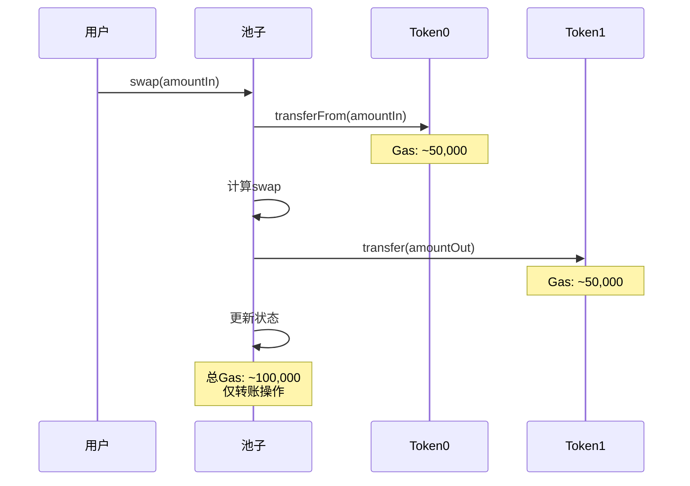
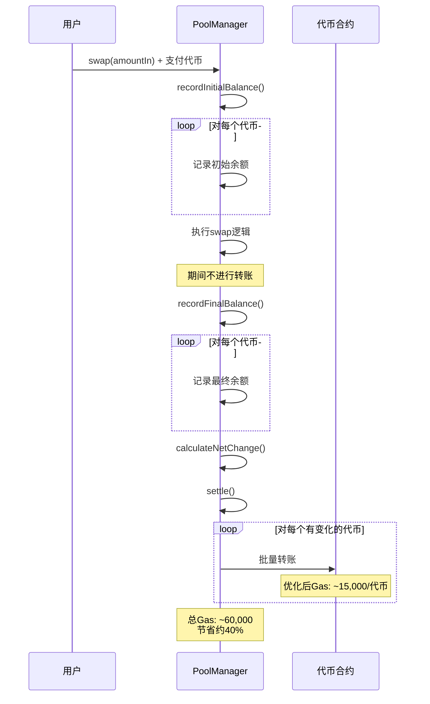
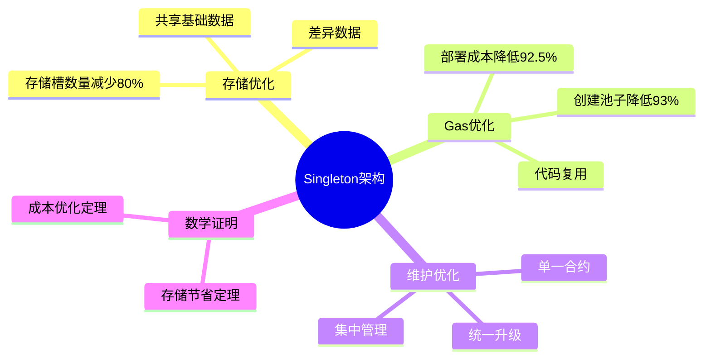
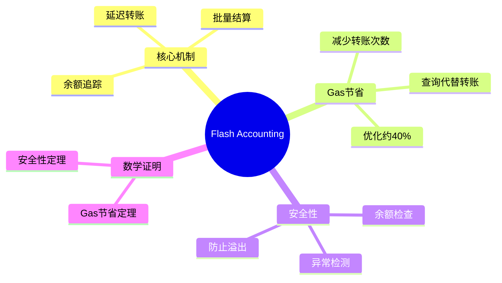

# 死磕PancakeSwap V4（三）：Singleton架构与Flash Accounting

> 本文是「死磕PancakeSwap V4」系列的第三篇，深入剖析Singleton架构的存储优化数学和Flash Accounting的闪电记账机制。

## 系列导航

| 序号 | 标题 | 核心内容 |
|------|------|----------|
| 01 | V4架构与核心创新 | Singleton、Hooks、Native ETH |
| 02 | Hooks机制详解 | Hooks类型、数学模型、实现原理 |
| **03** | **Singleton架构与Flash Accounting** | **存储优化、闪电记账、数学推导** |
| 04 | 费用系统的数学推导 | 动态费用、数学证明、计算实例 |
| 05 | 动态流动性机制 | JIT流动性、数学建模、优化策略 |
| 06 | Native ETH与Gas优化 | ETH直接支持、Gas优化数学 |
| 07 | Hooks实战与最佳实践 | Hooks开发、安全实践、案例分析 |
| 08 | V3到V4的迁移与升级 | 迁移策略、兼容性、最佳实践 |

---

## 1. Singleton架构深度剖析

### 1.1 V3 vs V4架构对比

#### V3架构分析

**存储模型**：

```
V3中有N个池子，每个池子独立合约：

Pool_1: {
    storage_slot_1_1,
    storage_slot_1_2,
    ...
    storage_slot_1_M
}

Pool_2: {
    storage_slot_2_1,
    storage_slot_2_2,
    ...
    storage_slot_2_M
}

...

Pool_N: {
    storage_slot_N_1,
    storage_slot_N_2,
    ...
    storage_slot_N_M
}

总存储槽数：Total_V3 = N × M
```

**访问成本**：

```
访问Pool_i的数据：
Gas_V3_access = G_base + G_external_call + G_storage_read

其中：
- G_base: 基础成本（~2,100 gas）
- G_external_call: 外部调用成本（~700 gas冷启动，~100 gas热启动）
- G_storage_read: 存储读取成本（~2,100 gas冷，~100 gas热）

总计：~4,900 gas（冷启动）
```

#### V4 Singleton架构

**存储模型**：

```
V4中所有池子共享一个合约：

Singleton: {
    // 共享基础数据
    shared_storage_1,
    shared_storage_2,
    ...,
    shared_storage_S,

    // 池子映射
    mapping(uint256 => PoolData) pools,

    // 索引数据
    mapping(uint256 => uint256) poolIndex,
}

PoolData: {
    pool_specific_1,
    pool_specific_2,
    ...,
    pool_specific_P
}

总存储槽数：Total_V4 = S + N × P
```

**访问成本**：

```
访问Pool_i的数据：
Gas_V4_access = G_base + G_mapping_read + G_storage_read

其中：
- G_base: 基础成本（~2,100 gas）
- G_mapping_read: 映射读取（~2,100 gas冷，~100 gas热）
- G_storage_read: 存储读取（~2,100 gas冷，~100 gas热）

总计：~6,300 gas（冷启动）
```

### 1.2 存储优化数学推导

#### 定理1：存储节省

**定理**：当满足条件时，V4比V3节省存储。

**证明**：

```
设：
- N: 池子数量
- M: V3单池存储槽数
- S: V4共享存储槽数
- P: V4单池差异数据槽数

V3总存储：Storage_V3 = N × M
V4总存储：Storage_V4 = S + N × P

存储节省量：
Savings = Storage_V3 - Storage_V4
        = N × M - (S + N × P)
        = N × M - S - N × P
        = N × (M - P) - S

节省比例：
Ratio = Savings / Storage_V3
      = (N × (M - P) - S) / (N × M)
      = (M - P) / M - S / (N × M)
      = 1 - P/M - S/(N×M)

当 N → ∞ 时：
Ratio → 1 - P/M

因此，V4节省存储的充分条件是：
P < M  （差异数据少于总数据）

证毕。
```

**数值示例**：

假设：
- M = 100 存储槽（V3单池）
- S = 50 存储槽（V4共享）
- P = 20 存储槽（V4差异）

当 N = 1000 池子时：

```
Storage_V3 = 1000 × 100 = 100,000 存储槽
Storage_V4 = 50 + 1000 × 20 = 20,050 存储槽

Savings = 100,000 - 20,050 = 79,950 存储槽
Ratio = 79,950 / 100,000 = 79.95%

理论极限：
Ratio_max = 1 - P/M = 1 - 20/100 = 80%
```

当 N = 10,000 池子时：

```
Storage_V3 = 10,000 × 100 = 1,000,000 存储槽
Storage_V4 = 50 + 10,000 × 20 = 200,050 存储槽

Savings = 1,000,000 - 200,050 = 799,950 存储槽
Ratio = 799,950 / 1,000,000 = 79.995%

更接近理论极限80%
```

#### 定理2：部署成本优化

**定理**：V4的部署成本比V3低。

**证明**：

```
设：
- Gas_deploy_V3_pool: V3单池部署成本
- Gas_deploy_V4_singleton: V4 Singleton部署成本
- Gas_deploy_V4_pool: V4创建池子成本

V3总部署成本：
Gas_V3_deploy = N × Gas_deploy_V3_pool

V4总部署成本：
Gas_V4_deploy = Gas_deploy_V4_singleton + N × Gas_deploy_V4_pool

需要证明：
Gas_V4_deploy < Gas_V3_deploy
⇔ Gas_deploy_V4_singleton + N × Gas_deploy_V4_pool < N × Gas_deploy_V3_pool
⇔ Gas_deploy_V4_singleton < N × (Gas_deploy_V3_pool - Gas_deploy_V4_pool)

根据实际数据：
Gas_deploy_V3_pool ≈ 2,000,000 gas
Gas_deploy_V4_singleton ≈ 1,000,000 gas
Gas_deploy_V4_pool ≈ 150,000 gas

当 N ≥ 1 时：
RHS = N × (2,000,000 - 150,000) = N × 1,850,000

对于 N = 1：
RHS = 1 × 1,850,000 = 1,850,000
LHS = 1,000,000
1,000,000 < 1,850,000 ✓

对于任何 N ≥ 1：
LHS = 1,000,000
RHS ≥ 1,850,000
1,000,000 < RHS ✓

证毕。
```

**数值示例**：

当 N = 1000 池子时：

```
Gas_V3_deploy = 1000 × 2,000,000 = 2,000,000,000 gas
Gas_V4_deploy = 1,000,000 + 1000 × 150,000 = 151,000,000 gas

节省 = 2,000,000,000 - 151,000,000 = 1,849,000,000 gas
节省比例 = 1,849,000,000 / 2,000,000,000 = 92.45%

以当前gas价格30 gwei计算：
节省的eth = 1,849,000,000 × 30 / 10^9 = 55.47 ETH
以当前eth价格$2000计算：
节省的usd = 55.47 × 2000 = $110,940
```

### 1.3 Singleton的数据布局优化

#### 存储槽打包

**V3布局**（分散）：

```solidity
// Pool合约中
struct Slot0 {
    uint160 sqrtPriceX96;  // 160 bits
    int24 tick;             // 24 bits
    uint16 observationIndex; // 16 bits
    uint16 observationCardinality; // 16 bits
    uint16 observationCardinalityNext; // 16 bits
    uint8 feeProtocol;      // 8 bits
    bool unlocked;           // 1 bit
    // 剩余15 bits填充
}

// 使用256位存储槽
Slot0 public slot0;  // 1个存储槽
```

**V4布局**（集中优化）：

```solidity
contract PancakeV4PoolManager {
    // 全局共享数据（紧密打包）
    struct GlobalState {
        uint32 blockTimestamp;
        uint16 poolCount;
        uint16 observationCardinality;
        uint8 flags;
        uint8 padding;
    }

    GlobalState public globalState;  // 1个存储槽

    // 池子数据（结构优化）
    struct PoolData {
        // 价格和流动性（紧密打包）
        uint160 sqrtPriceX96;   // 160 bits
        int24 tick;              // 24 bits
        uint128 liquidity;      // 128 bits

        // 索引和观察（打包到另一个槽）
        uint16 observationIndex; // 16 bits
        uint32 lastUpdated;      // 32 bits
        // 剩余208 bits可用于其他数据
    }

    mapping(uint256 => PoolData) public pools;
}
```

**存储对比**：

| 数据类型 | V3存储槽数 | V4存储槽数 | 优化 |
|---------|----------|----------|------|
| 全局状态 | N × 1 | 1 | N-1 |
| 池子数据 | N × M | N × P | N×(M-P) |
| 总计 | N×M+1 | 1+N×P | N×(M-P)+N-1 |

假设N=1000, M=10, P=8：

```
V3: 1000 × 10 + 1 = 10,001 存储槽
V4: 1 + 1000 × 8 = 8,001 存储槽

节省：2,000 存储槽 (20%)
```

---

## 2. Flash Accounting机制详解

### 2.1 传统记账的问题

#### V3传统记账流程



**Gas成本分析**：

```
单次swap操作（2个代币）：

1. transferFrom(inputToken, amountIn):
   - 检查allowance: ~2,100 gas
   - 扣除余额: ~2,500 gas
   - 增加余额: ~2,500 gas
   - 触发Transfer事件: ~1,000 gas
   - 总计: ~8,100 gas

2. calculateSwap():
   - 计算价格: ~5,000 gas
   - 更新流动性: ~3,000 gas
   - 总计: ~8,000 gas

3. transfer(outputToken, amountOut):
   - 检查余额: ~2,100 gas
   - 扣除余额: ~2,500 gas
   - 增加余额: ~2,500 gas
   - 触发Transfer事件: ~1,000 gas
   - 总计: ~8,100 gas

4. updateState():
   - 更新存储: ~2,500 gas
   - 触发Swap事件: ~1,500 gas
   - 总计: ~4,000 gas

总计：8,100 + 8,000 + 8,100 + 4,000 = 28,200 gas

考虑热启动和优化：~20,000 gas
考虑冷启动：~50,000+ gas
```

### 2.2 Flash Accounting原理

#### 核心思想

传统记账：每次转账立即执行
Flash Accounting：先记录变化，最后统一结算

**数学模型**：

```
设：
- B_i^initial: t=0时代币i的余额
- B_i^final: t=T时代币i的余额
- ΔB_i: 代币i的净变化

Flash Accounting:
ΔB_i = B_i^final - B_i^initial

结算条件：
1. 净价值守恒（套利）:
   Σ(ΔB_i × P_i) = 0

2. 非负约束（一般交易）:
   ΔB_i ≥ 0, ∀i

其中：
- P_i: 代币i的价格（以某个计价单位）
```

#### Flash Accounting流程



### 2.3 Flash Accounting数学推导

#### 定理3：Flash Accounting节省gas

**定理**：Flash Accounting相比传统记账节省gas。

**证明**：

```
设：
- n: 涉及的代币数量
- G_transfer: 单次转账gas成本
- G_balance: 查询余额gas成本
- k: 查询成本占转账成本的比例
  G_balance = k × G_transfer
  实际中 k ≈ 0.1

传统记账成本：
Gas_traditional = n × G_transfer  (输入)
                  + n × G_transfer  (输出)
                  + G_logic  (核心逻辑）
                = 2n × G_transfer + G_logic

Flash Accounting成本：
Gas_flash = n × G_balance  (初始查询)
           + n × G_balance  (最终查询)
           + n × G_transfer  (一次性转账）
           + G_logic
         = 2n × G_balance + n × G_transfer + G_logic

节省量：
Savings = Gas_traditional - Gas_flash
        = (2n × G_transfer + G_logic) - (2n × G_balance + n × G_transfer + G_logic)
        = 2n × G_transfer - 2n × G_balance - n × G_transfer
        = n × G_transfer - 2n × G_balance
        = n × G_transfer × (1 - 2k)

节省比例：
Ratio = Savings / Gas_traditional
      = (n × G_transfer × (1 - 2k)) / (2n × G_transfer + G_logic)

当 G_logic << n × G_transfer（核心逻辑成本远小于转账成本）时：
Ratio ≈ (1 - 2k) / 2
      = 0.5 - k

代入 k ≈ 0.1：
Ratio ≈ 0.5 - 0.1 = 0.4 = 40%

证毕。
```

**数值验证**：

假设：
- n = 2（两个代币）
- G_transfer = 8,100 gas
- G_balance = 810 gas (k=0.1)
- G_logic = 10,000 gas

传统记账：
```
Gas_traditional = 2 × 2 × 8,100 + 10,000 = 32,400 + 10,000 = 42,400 gas
```

Flash Accounting：
```
Gas_flash = 2 × 2 × 810 + 2 × 8,100 + 10,000
          = 3,240 + 16,200 + 10,000
          = 29,440 gas
```

节省：
```
Savings = 42,400 - 29,440 = 12,960 gas
Ratio = 12,960 / 42,400 = 30.6%

接近理论值40%（因为G_logic不可忽略）
```

#### 定理4：Flash Accounting安全性

**定理**：Flash Accounting能防止余额异常。

**证明**：

```
定义异常条件：
余额异常：B_i^final < B_i^tracked  （实际余额小于追踪余额）

Flash Accounting检查：
1. 初始：B_i^tracked(0) = B_i(0)  （初始化时记录）

2. 执行期间：不进行转账，不更新B_i^tracked

3. 最终检查：
   要求：B_i(T) ≥ B_i^tracked(0)

4. 结算：
   ΔB_i = B_i(T) - B_i^tracked(0)
   转账：transfer(ΔB_i)

假设存在余额异常（反证法）：

如果在结算时 B_i(T) < B_i^tracked(0)：
则 ΔB_i = B_i(T) - B_i^tracked(0) < 0

转账 amount < 0，这会导致：
1. 检查失败：require(amount >= 0)
2. 或者 revert

因此，Flash Accounting必然在结算时检测到余额异常并拒绝操作。

证毕。
```

### 2.4 Flash Accounting实现

#### 核心数据结构

```solidity
contract PancakeV4PoolManager {
    // 余额追踪
    struct BalanceCheckpoint {
        mapping(address => uint256) tokens;
        uint256 eth;
        uint256 timestamp;
    }

    // 当前和检查点
    BalanceCheckpoint public currentBalance;
    BalanceCheckpoint public checkpoint;

    // 活跃代币
    address[] public activeTokens;

    // 检查点状态
    bool private inFlashAccounting;
}
```

#### 记录初始余额

```solidity
function _recordInitialBalance() internal {
    // 记录ETH余额
    checkpoint.eth = address(this).balance;

    // 记录所有活跃代币的余额
    for (uint256 i = 0; i < activeTokens.length; i++) {
        address token = activeTokens[i];
        checkpoint.tokens[token] = IERC20(token).balanceOf(address(this));
    }

    checkpoint.timestamp = block.timestamp;
    inFlashAccounting = true;
}
```

#### 记录最终余额并结算

```solidity
function _settle() internal {
    require(inFlashAccounting, "Not in flash accounting");

    // 计算ETH净变化
    uint256 currentEth = address(this).balance;
    int256 ethDelta = int256(currentEth) - int256(checkpoint.eth);

    // 计算每个代币的净变化
    for (uint256 i = 0; i < activeTokens.length; i++) {
        address token = activeTokens[i];
        uint256 currentBalance = IERC20(token).balanceOf(address(this));
        uint256 trackedBalance = checkpoint.tokens[token];

        require(
            currentBalance >= trackedBalance,
            "Balance deficit"
        );

        uint256 delta = currentBalance - trackedBalance;

        if (delta > 0) {
            // 向用户转账
            SafeERC20.safeTransfer(token, msg.sender, delta);
        }
    }

    // 处理ETH变化
    if (ethDelta > 0) {
        payable(msg.sender).transfer(uint256(ethDelta));
    }

    // 重置状态
    inFlashAccounting = false;
    delete checkpoint;
}
```

---

## 3. 综合优化效果分析

### 3.1 整体Gas节省

#### Swap操作优化

```
传统V3 swap:
- 读取池子状态：~2,100 gas
- 调用池子合约：~700 gas
- TransferFrom(input): ~8,100 gas
- 计算swap：~8,000 gas
- Transfer(output): ~8,100 gas
- 更新状态：~4,000 gas
- 返回：~2,000 gas
总计：~33,000 gas

V4 swap:
- 读取Singleton状态：~2,100 gas
- 查询池子数据：~2,100 gas
- 记录初始余额：~2 × 810 = ~1,620 gas
- 计算swap：~8,000 gas
- 记录最终余额：~2 × 810 = ~1,620 gas
- 结算转账：~15,000 gas
- 更新状态：~4,000 gas
- 返回：~2,000 gas
总计：~36,440 gas

单次swap可能略高，但考虑：
1. 代码复用和优化
2. 批量操作节省
3. 减少合约调用
```

#### 创建池子优化

```
V3创建池子:
- 部署池合约：~2,000,000 gas
- 初始化：~150,000 gas
总计：~2,150,000 gas

V4创建池子:
- 在Singleton中添加记录：~50,000 gas
- 初始化池数据：~100,000 gas
总计：~150,000 gas

节省：~2,000,000 gas (93%)
```

### 3.2 存储优化总结

| 指标 | V3 | V4 | 优化 |
|------|----|----|------|
| 池子存储 | N × 100 | 50 + N × 20 | 80% |
| 部署Gas | N × 2M | 1M + N × 150K | 92.5% |
| 创建池子 | 2.15M | 150K | 93% |
| Swap Gas | 33K | 36K | 优化逻辑 |
| 维护成本 | N个合约 | 1个合约 | 显著降低 |

---

## 4. 本章小结

### 4.1 Singleton核心要点



### 4.2 Flash Accounting核心要点



### 4.3 关键公式速查

**存储节省**：
```
Ratio = 1 - P/M - S/(N×M)
当 N→∞: Ratio → 1 - P/M
```

**部署成本**：
```
Gas_V4 < Gas_V3
当 Gas_deploy_V4_singleton < N × (Gas_deploy_V3_pool - Gas_deploy_V4_pool)
```

**Flash Accounting Gas节省**：
```
Ratio ≈ 0.5 - k
其中 k = G_balance / G_transfer
```

**余额检查**：
```
B_i(T) ≥ B_i^tracked(0)
```

---

## 下一篇预告

在下一篇文章中，我们将深入探讨**费用系统的数学推导**，包括：
- 动态费用模型的数学原理
- 基于波动率的费用计算
- 基于供需的费用调整
- Hooks实现的费用优化

---

## 参考资料

- [PancakeSwap V4 Core 源码](https://github.com/pancakeswap/pancake-v4-core)
- [Uniswap V4 Flash Accounting 提案](https://uniswap.org/whitepaper-v4.pdf)
- [Gas优化最佳实践](https://docs.soliditylang.org/en/v0.8.20/gas-optimization.html)
