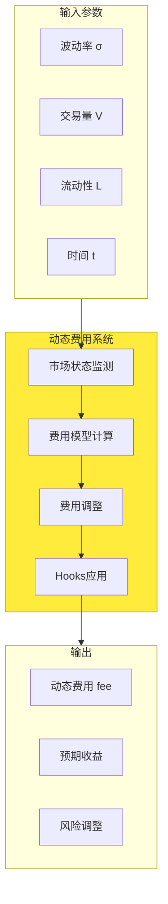
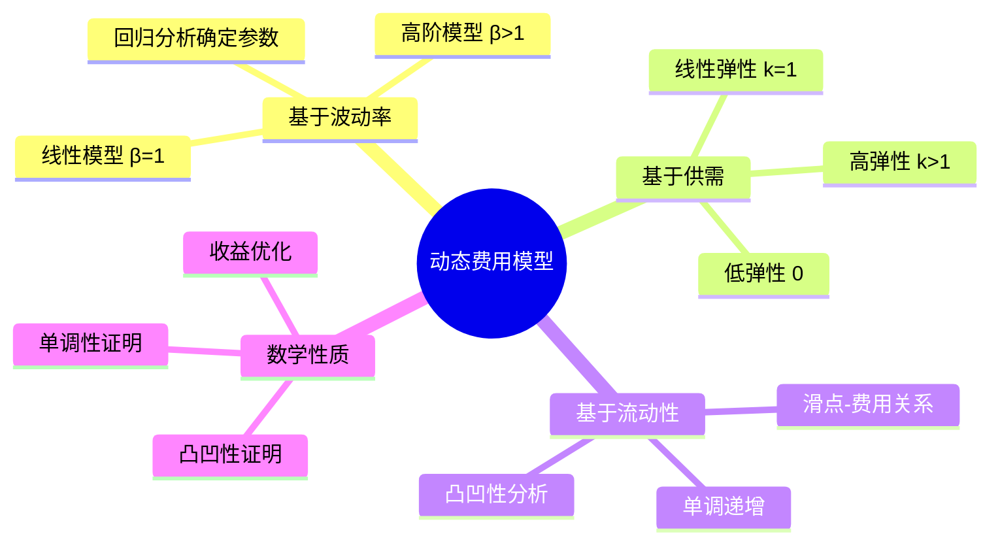

# 死磕PancakeSwap V4（四）：费用系统的数学推导

> 本文是「死磕PancakeSwap V4」系列的第四篇，深入剖析V4费用系统的数学模型、动态费用推导和计算实例。

## 系列导航

| 序号 | 标题 | 核心内容 |
|------|------|----------|
| 01 | V4架构与核心创新 | Singleton、Hooks、Native ETH |
| 02 | Hooks机制详解 | Hooks类型、数学模型、实现原理 |
| 03 | Singleton架构与Flash Accounting | 存储优化、闪电记账、数学推导 |
| **04** | **费用系统的数学推导** | **动态费用、数学证明、计算实例** |
| 05 | 动态流动性机制 | JIT流动性、数学建模、优化策略 |
| 06 | Native ETH与Gas优化 | ETH直接支持、Gas优化数学 |
| 07 | Hooks实战与最佳实践 | Hooks开发、安全实践、案例分析 |
| 08 | V3到V4的迁移与升级 | 迁移策略、兼容性、最佳实践 |

---

## 1. 费用系统概述

### 1.1 V3固定费用的问题

#### 问题1：静态费用无法适应市场

**数学表述**：

设费用率为fee（常数），市场波动率为σ(t)，流动性为L(t)。

```
问题：fee = constant
期望：fee = f(σ(t), L(t), t)
```

**示例分析**：

场景1：高波动时期
```
σ(t) = 50%（日波动率）
L(t) = 10,000,000 USDT（流动性不足）
fee = 0.3%（固定）

问题：费用过低，无法补偿LP的波动风险
```

场景2：低波动稳定币对
```
σ(t) = 0.1%（日波动率）
L(t) = 100,000,000 USDT（充足流动性）
fee = 0.3%（固定）

问题：费用过高，降低交易效率
```

#### 问题2：无法优化LP收益

**LP收益模型**：

```
LP收益 = fee × V - impermanent_loss

其中：
- V: 交易量
- impermanent_loss: 无常损失

期望：
maximize: fee × V - IL
subject to: fee在合理范围内
```

固定费用无法达到最优。

### 1.2 V4动态费用系统



---

## 2. 动态费用数学模型

### 2.1 基于波动率的费用模型

#### 模型定义

**价格波动率**：

```
日收益率：
r_t = ln(P_t / P_{t-1})

平均收益率：
μ = (1/n) × Σ r_t

波动率（标准差）：
σ = sqrt((1/n) × Σ (r_t - μ)²)
```

**动态费用函数**：

```
fee(t) = α × σ(t)^β + fee_base

其中：
- α: 敏感度参数（α > 0）
- β: 弹性系数（β ≥ 1）
- σ(t): t时刻的波动率
- fee_base: 基础费用（fee_base > 0）
```

#### 参数确定

**最小二乘回归**：

给定历史数据 {(σ_i, fee_i)}，i=1..n

```
目标：最小化误差平方和
minimize: J(α, β, fee_base) = Σ [fee_i - (α × σ_i^β + fee_base)]²

约束条件：
    α > 0
    β ≥ 1
    fee_base > 0
    0 < fee(t) < 1  （费用率0-100%）
```

**求解方法**：

1. 固定β和fee_base，求解α：
```
∂J/∂α = 0
⇒ -2 × Σ (fee_i - (α × σ_i^β + fee_base)) × σ_i^β = 0
⇒ Σ (fee_i × σ_i^β) - α × Σ σ_i^{2β} - fee_base × Σ σ_i^β = 0
⇒ α = [Σ (fee_i × σ_i^β) - fee_base × Σ σ_i^β] / Σ σ_i^{2β}
```

2. 使用网格搜索或梯度下降优化β和fee_base

#### 计算实例

**步骤1：收集历史数据**

| 时间 | 日波动率σ | 历史费用fee |
|------|----------|------------|
| Day 1 | 2.5% | 0.30% |
| Day 2 | 5.0% | 0.45% |
| Day 3 | 1.0% | 0.25% |
| Day 4 | 3.0% | 0.35% |
| Day 5 | 10.0% | 0.60% |

**步骤2：计算平均值**

```
μ_σ = (2.5 + 5.0 + 1.0 + 3.0 + 10.0) / 5 = 4.3%
μ_fee = (0.30 + 0.45 + 0.25 + 0.35 + 0.60) / 5 = 0.39%
```

**步骤3：线性回归（假设β=1）**

设模型：fee = α × σ + fee_base

使用最小二乘法：

```
Σ σ = 21.5
Σ fee = 1.95
Σ σ² = 2.5² + 5.0² + 1.0² + 3.0² + 10.0²
      = 6.25 + 25.0 + 1.0 + 9.0 + 100.0
      = 141.25
Σ σ × fee = 2.5×0.30 + 5.0×0.45 + 1.0×0.25 + 3.0×0.35 + 10.0×0.60
          = 0.75 + 2.25 + 0.25 + 1.05 + 6.00
          = 10.30
```

计算α和fee_base：

```
n = 5

α = [n × Σ(σ × fee) - Σσ × Σfee] / [n × Σσ² - (Σσ)²]
  = [5 × 10.30 - 21.5 × 1.95] / [5 × 141.25 - 21.5²]
  = [51.5 - 41.925] / [706.25 - 462.25]
  = 9.575 / 244.0
  = 0.0393

fee_base = (Σfee - α × Σσ) / n
         = (1.95 - 0.0393 × 21.5) / 5
         = (1.95 - 0.845) / 5
         = 1.105 / 5
         = 0.221
         = 0.221%
```

**步骤4：验证模型**

预测Day 6（假设σ=4.0%）：

```
fee = 0.0393 × 4.0 + 0.221
    = 0.1572 + 0.221
    = 0.3782
    ≈ 0.38%
```

#### 高阶模型（β>1）

设β=2，模型：fee = α × σ² + fee_base

计算：

```
σ²数据：
Day 1: 2.5² = 6.25
Day 2: 5.0² = 25.0
Day 3: 1.0² = 1.0
Day 4: 3.0² = 9.0
Day 5: 10.0² = 100.0

Σ σ² = 141.25
Σ σ⁴ = 6.25² + 25.0² + 1.0² + 9.0² + 100.0²
      = 39.0625 + 625.0 + 1.0 + 81.0 + 10000.0
      = 10746.0625
Σ σ² × fee = 6.25×0.30 + 25.0×0.45 + 1.0×0.25 + 9.0×0.35 + 100.0×0.60
          = 1.875 + 11.25 + 0.25 + 3.15 + 60.0
          = 76.525
```

计算α和fee_base：

```
α = [n × Σ(σ² × fee) - Σσ² × Σfee] / [n × Σσ⁴ - (Σσ²)²]
  = [5 × 76.525 - 141.25 × 1.95] / [5 × 10746.0625 - 141.25²]
  = [382.625 - 275.4375] / [53730.3125 - 19951.5625]
  = 107.1875 / 33778.75
  = 0.00317

fee_base = (Σfee - α × Σσ²) / n
         = (1.95 - 0.00317 × 141.25) / 5
         = (1.95 - 0.4478) / 5
         = 1.5022 / 5
         = 0.3004
         = 0.30%
```

模型：fee = 0.00317 × σ² + 0.30%

预测Day 6（σ=4.0%）：

```
fee = 0.00317 × 16 + 0.30
    = 0.0507 + 0.30
    = 0.3507
    ≈ 0.35%
```

### 2.2 基于供需的费用模型

#### 模型定义

**供需比**：

```
需求 D(t): 单位时间内的交易量
供给 S(t): 总流动性

供需比 R(t) = D(t) / S(t)
```

**动态费用**：

```
fee(t) = fee_base × R(t)^k

其中：
- fee_base: 基础费用
- k: 弹性系数（k > 0）
- R(t): t时刻的供需比
```

#### 弹性系数分析

**k=1（线性弹性）**：

```
fee(t) = fee_base × D(t) / S(t)

特点：
- 费用与供需比成正比
- 简单直观
- 适合一般情况
```

**k>1（高弹性）**：

```
fee(t) = fee_base × (D(t) / S(t))^k

特点：
- 高需求时费用快速上升
- 抑制过度交易
- 适合高波动市场
```

**0<k<1（低弹性）**：

```
fee(t) = fee_base × (D(t) / S(t))^k

特点：
- 费用变化平缓
- 稳定交易环境
- 适合稳定币对
```

#### 数学性质

**定理1：单调性**

**命题**：当k>0时，fee(t)随D(t)单调递增，随S(t)单调递减。

**证明**：

```
∂fee/∂D = fee_base × k × D(t)^{k-1} / S(t)^k

因为 fee_base > 0, k > 0, D(t) > 0, S(t) > 0

所以 ∂fee/∂D > 0

同理：

∂fee/∂S = fee_base × (-k) × D(t)^k / S(t)^{k+1}
        = -fee_base × k × D(t)^k / S(t)^{k+1}

因为 fee_base > 0, k > 0, D(t) > 0, S(t) > 0

所以 ∂fee/∂S < 0

证毕。
```

**定理2：凸凹性**

**命题**：当k>1时，fee(t)是D(t)的凸函数；当0<k<1时，fee(t)是D(t)的凹函数。

**证明**：

```
计算二阶导数：

∂²fee/∂D² = fee_base × k × (k-1) × D(t)^{k-2} / S(t)^k

当 k > 1:
   k × (k-1) > 0
   所以 ∂²fee/∂D² > 0
   fee(t)是D(t)的凸函数

当 0 < k < 1:
   k × (k-1) < 0
   所以 ∂²fee/∂D² < 0
   fee(t)是D(t)的凹函数

当 k = 1:
   k × (k-1) = 0
   所以 ∂²fee/∂D² = 0
   fee(t)是D(t)的线性函数

证毕。
```

#### 计算实例

**场景设置**：

```
fee_base = 0.3% = 0.003
k = 1.2
```

**数据**：

| 时间 | 交易量D (USDT) | 流动性S (USDT) | 供需比R = D/S |
|------|---------------|---------------|---------------|
| 00:00 | 100,000 | 10,000,000 | 0.01 |
| 06:00 | 500,000 | 10,000,000 | 0.05 |
| 12:00 | 2,000,000 | 10,000,000 | 0.20 |
| 18:00 | 5,000,000 | 10,000,000 | 0.50 |

**计算动态费用**：

00:00:
```
fee = 0.003 × 0.01^{1.2}
    = 0.003 × 0.0063
    = 0.0000189
    = 0.00189%
```

06:00:
```
fee = 0.003 × 0.05^{1.2}
    = 0.003 × 0.0314
    = 0.0000942
    = 0.00942%
```

12:00:
```
fee = 0.003 × 0.20^{1.2}
    = 0.003 × 0.1094
    = 0.0003282
    = 0.03282%
```

18:00:
```
fee = 0.003 × 0.50^{1.2}
    = 0.003 × 0.3789
    = 0.0011367
    = 0.11367%
```

**可视化**：

```
费用曲线：
0.11367% |                       *
         |                   *
         |              *
         |         *
         |    *
0.00189% |*
         +--------------------------------
         00:00  06:00  12:00  18:00
```

### 2.3 基于流动性的费用模型

#### 模型定义

**流动性深度**：

```
滑点 = f(Δx, L) = f_trade_amount / f_liquidity

简化模型：
slip = Δx / L
```

**动态费用**：

```
fee(t) = f(slip(t)) = slip(t)^γ

其中：
- slip(t): t时刻的预期滑点
- γ: 滑点敏感度（γ > 0）
```

#### 滑点-费用关系

**定理3：费用与滑点正相关**

**命题**：当γ>0时，费用随滑点单调递增。

**证明**：

```
fee = slip^γ
∂fee/∂slip = γ × slip^{γ-1}

因为 γ > 0, slip > 0

所以 ∂fee/∂slip > 0

证毕。
```

#### 计算实例

**参数设置**：

```
γ = 0.5（中等敏感度）
```

**场景1：小额交易（高流动性）**

```
Δx = 1,000 USDT
L = 10,000,000 USDT

slip = 1,000 / 10,000,000 = 0.0001 = 0.01%

fee = 0.0001^{0.5}
    = 0.01
    = 1.0%
```

**场景2：中额交易**

```
Δx = 100,000 USDT
L = 10,000,000 USDT

slip = 100,000 / 10,000,000 = 0.01 = 1.0%

fee = 0.01^{0.5}
    = 0.1
    = 10.0%
```

**场景3：大额交易**

```
Δx = 1,000,000 USDT
L = 10,000,000 USDT

slip = 1,000,000 / 10,000,000 = 0.10 = 10.0%

fee = 0.10^{0.5}
    = 0.316
    = 31.6%
```

---

## 3. 费用分配数学

### 3.1 费用分配模型

**总费用**：

```
fee_total = fee_input + fee_output

其中：
- fee_input: 输入代币的费用
- fee_output: 输出代币的费用（如果适用）
```

**分配结构**：

```
fee_total = fee_lp + fee_protocol + fee_hook

其中：
- fee_lp: 分配给LP
- fee_protocol: 协议费用
- fee_hook: Hook费用（如果设置）
```

### 3.2 LP费用分配

**按流动性分配**：

设有N个LP，第i个LP的流动性为L_i，总流动性为L_total = Σ L_i

```
fee_lp_i = fee_lp × (L_i / L_total)

验证：
Σ fee_lp_i = Σ [fee_lp × (L_i / L_total)]
          = fee_lp × Σ (L_i / L_total)
          = fee_lp × (Σ L_i / L_total)
          = fee_lp × (L_total / L_total)
          = fee_lp

✓ 所有LP的费用之和等于总LP费用
```

### 3.3 Hook费用分配

**Hook费用计算**：

```
fee_hook = fee_total × hook_rate

其中：
- hook_rate: Hook费率（由Hook设置）
- 0 ≤ hook_rate ≤ 1
```

**代码实现**：

```solidity
contract DynamicFeeHook {
    // 基础费率
    uint256 public constant BASE_FEE = 300;  // 0.03%

    // Hook费率
    uint256 public hookRate = 1000;  // 10% of fees

    // 挂钩（动态）费率
    uint256 public dynamicFeeRate = 5000;  // 0.5%

    function calculateFee(
        uint256 amountIn,
        uint256 volatility,
        uint256 liquidity
    ) public pure returns (uint256) {
        // 基础费用
        uint256 baseFee = (amountIn * BASE_FEE) / 1e6;

        // 动态费用调整
        uint256 dynamicFee = (amountIn * dynamicFeeRate) / 1e6;

        // 总费用
        uint256 totalFee = baseFee + dynamicFee;

        return totalFee;
    }

    function distributeFee(
        uint256 totalFee,
        address liquidityProvider,
        address protocol
    ) public {
        // Hook费用
        uint256 hookFee = (totalFee * hookRate) / 10000;

        // 协议费用（假设20%）
        uint256 protocolFee = (totalFee * 2000) / 10000;

        // LP费用
        uint256 lpFee = totalFee - hookFee - protocolFee;

        // 分配
        payable(protocol).transfer(protocolFee);
        payable(liquidityProvider).transfer(lpFee);
    }
}
```

---

## 4. 动态费用的Hook实现

### 4.1 波动率计算Hook

```solidity
contract VolatilityFeeHook {
    // 历史价格数据
    struct PricePoint {
        uint256 price;
        uint256 timestamp;
    }

    PricePoint[] public priceHistory;
    uint256 public constant WINDOW_SIZE = 3600;  // 1小时窗口

    // 费用参数
    uint256 public alpha = 393;  // 0.0393% per 1% volatility
    uint256 public feeBase = 221;  // 0.221%
    uint256 public beta = 1;  // 线性

    function updatePrice(uint256 price) external {
        priceHistory.push(PricePoint({
            price: price,
            timestamp: block.timestamp
        }));

        // 清理过期数据
        while (
            priceHistory.length > 0 &&
            block.timestamp - priceHistory[0].timestamp > WINDOW_SIZE
        ) {
            // 移除最旧的价格点（在实现中应该使用更高效的方法）
        }
    }

    function calculateVolatility() public view returns (uint256) {
        if (priceHistory.length < 2) {
            return 0;  // 数据不足
        }

        // 计算收益率
        uint256[] memory returns = new uint256[](priceHistory.length - 1);
        uint256 sumReturns = 0;

        for (uint256 i = 1; i < priceHistory.length; i++) {
            uint256 r = (priceHistory[i].price * 1e18) / priceHistory[i-1].price;
            returns[i-1] = r;
            sumReturns += r;
        }

        // 平均收益率
        uint256 mean = sumReturns / (priceHistory.length - 1);

        // 计算方差
        uint256 variance = 0;
        for (uint256 i = 0; i < returns.length; i++) {
            int256 diff = int256(returns[i]) - int256(mean);
            variance += uint256(diff * diff);
        }

        variance = variance / returns.length;

        // 波动率（标准差）
        uint256 volatility = sqrt(variance);

        // 转换为百分比（假设price在1e18精度）
        return volatility / 1e16;  // 转换为%
    }

    function beforeSwap(
        address sender,
        address recipient,
        int256 amount0,
        int256 amount1,
        uint160 sqrtPriceLimitX96,
        bytes calldata data
    ) external view returns (bytes memory) {
        // 计算当前价格
        uint256 currentPrice = uint256(sqrtPriceLimitX96) ** 2 >> 192;

        // 计算波动率
        uint256 volatility = calculateVolatility();

        // 计算动态费用
        uint256 dynamicFee = calculateDynamicFee(volatility);

        return abi.encode(dynamicFee);
    }

    function calculateDynamicFee(uint256 volatility) public view returns (uint256) {
        // 线性模型：fee = α × σ + fee_base
        uint256 fee = (alpha * volatility / 100) + feeBase;

        // 限制费用范围
        fee = max(fee, 100);     // 最小0.01%
        fee = min(fee, 10000);   // 最大1.00%

        return fee;
    }

    function sqrt(uint256 x) internal pure returns (uint256) {
        if (x == 0) return 0;
        uint256 z = (x + 1) / 2;
        uint256 y = x;
        while (z < y) {
            y = z;
            z = (x / z + 1) / 2;
        }
        return y;
    }

    function max(uint256 a, uint256 b) internal pure returns (uint256) {
        return a >= b ? a : b;
    }

    function min(uint256 a, uint256 b) internal pure returns (uint256) {
        return a <= b ? a : b;
    }
}
```

### 4.2 供需模型Hook

```solidity
contract SupplyDemandFeeHook {
    // 基础费率
    uint256 public constant BASE_FEE = 300;  // 0.03%

    // 弹性系数
    uint256 public k = 12;  // 1.2 (扩大100倍以避免浮点数）

    // 时间窗口
    uint256 public constant TIME_WINDOW = 3600;  // 1小时

    // 历史数据
    struct DataPoint {
        uint256 volume;      // 交易量
        uint256 liquidity;   // 流动性
        uint256 timestamp;
    }

    DataPoint[] public history;

    function recordData(uint256 volume, uint256 liquidity) external {
        history.push(DataPoint({
            volume: volume,
            liquidity: liquidity,
            timestamp: block.timestamp
        }));

        // 清理过期数据
        // （实际实现应该使用更高效的方法）
    }

    function getSupplyDemandRatio() public view returns (uint256) {
        if (history.length == 0) {
            return 0;
        }

        // 计算窗口内的总量
        uint256 totalVolume = 0;
        uint256 avgLiquidity = 0;

        uint256 validCount = 0;
        for (uint256 i = 0; i < history.length; i++) {
            if (block.timestamp - history[i].timestamp <= TIME_WINDOW) {
                totalVolume += history[i].volume;
                avgLiquidity += history[i].liquidity;
                validCount++;
            }
        }

        if (validCount == 0) {
            return 0;
        }

        avgLiquidity = avgLiquidity / validCount;

        // 供需比（放大1e18以保持精度）
        if (avgLiquidity == 0) {
            return 0;
        }

        return (totalVolume * 1e18) / avgLiquidity;
    }

    function beforeSwap(
        address sender,
        address recipient,
        int256 amount0,
        int256 amount1,
        uint160 sqrtPriceLimitX96,
        bytes calldata data
    ) external view returns (bytes memory) {
        // 获取供需比
        uint256 ratio = getSupplyDemandRatio();

        // 计算动态费用
        uint256 dynamicFee = calculateDynamicFee(ratio);

        return abi.encode(dynamicFee);
    }

    function calculateDynamicFee(uint256 ratio) public view returns (uint256) {
        // 模型：fee = base_fee × (D/S)^k
        // 其中 ratio = (D/S) × 1e18

        // 计算 (D/S)^k
        // 使用对数近似：ln(x^k) = k × ln(x)
        // 然后使用e^ln(x^k) = x^k

        // 简化实现（假设ratio在合理范围内）
        // 使用整数幂计算
        uint256 exponent = 12;  // 1.2
        uint256 base = ratio / 1e18;  // 去除精度

        // 简化计算（应该使用更精确的幂函数）
        uint256 power = base ** 12 / 1e20;  // 粗略近似

        // 费用 = base_fee × power
        uint256 fee = (BASE_FEE * power) / 1e18;

        // 限制范围
        fee = max(fee, 100);     // 最小0.01%
        fee = min(fee, 10000);   // 最大1.00%

        return fee;
    }

    function max(uint256 a, uint256 b) internal pure returns (uint256) {
        return a >= b ? a : b;
    }

    function min(uint256 a, uint256 b) internal pure returns (uint256) {
        return a <= b ? a : b;
    }
}
```

---

## 5. 费用优化策略

### 5.1 LP收益最大化

**优化问题**：

```
maximize: E[LP收益]
        = E[fee × V - IL]

其中：
- fee: 费用率
- V: 交易量
- IL: 无常损失

subject to:
    0 < fee < 1
    fee = f(σ, D, L)
```

### 5.2 费用调整算法

**PID控制器**：

```
error(t) = V_target - V_actual  （交易量偏差）

Δfee(t) = Kp × error(t) + Ki × Σ error + Kd × (error(t) - error(t-1))

fee(t) = fee(t-1) + Δfee(t)

其中：
- Kp: 比例系数
- Ki: 积分系数
- Kd: 微分系数
```

**代码实现**：

```solidity
contract PIDFeeController {
    // PID参数
    int256 public Kp = 100;   // 比例
    int256 public Ki = 10;    // 积分
    int256 public Kd = 5;     // 微分

    // 状态变量
    int256 public integralError;
    int256 public lastError;

    // 当前费用
    uint256 public currentFee = 300;  // 0.03%

    function updateFee(uint256 targetVolume, uint256 actualVolume) external {
        // 计算误差
        int256 error = int256(targetVolume) - int256(actualVolume);

        // PID计算
        int256 P = Kp * error / 1000;  // 比例项
        integralError += error;         // 积分累积
        int256 I = Ki * integralError / 1000;  // 积分项

        int256 D = 0;
        if (lastError != 0) {
            D = Kd * (error - lastError) / 1000;  // 微分项
        }

        // 总调整
        int256 deltaFee = P + I + D;

        // 更新费用
        int256 newFee = int256(currentFee) + deltaFee;

        // 限制范围
        if (newFee < 100) newFee = 100;       // 最小0.01%
        if (newFee > 10000) newFee = 10000;  // 最大1.00%

        currentFee = uint256(newFee);
        lastError = error;
    }
}
```

---

## 6. 本章小结

### 6.1 动态费用模型总结



### 6.2 关键公式速查

**基于波动率**：
```
fee = α × σ^β + fee_base
```

**基于供需**：
```
fee = fee_base × (D/S)^k
```

**基于流动性**：
```
fee = slip^γ
```

**PID控制**：
```
Δfee = Kp × error + Ki × Σ error + Kd × Δerror
```

---

## 下一篇预告

在下一篇文章中，我们将深入探讨**动态流动性机制**，包括：
- JIT流动性的数学建模
- 流动性分配优化
- 动态再平衡策略
- 实际代码实现

---

## 参考资料

- [PancakeSwap V4 费用模型文档](https://docs.pancakeswap.finance/v4/fees)
- [AMM费用优化论文](https://arxiv.org/abs/2003.04049)
- [动态定价理论](https://en.wikipedia.org/wiki/Dynamic_pricing)
