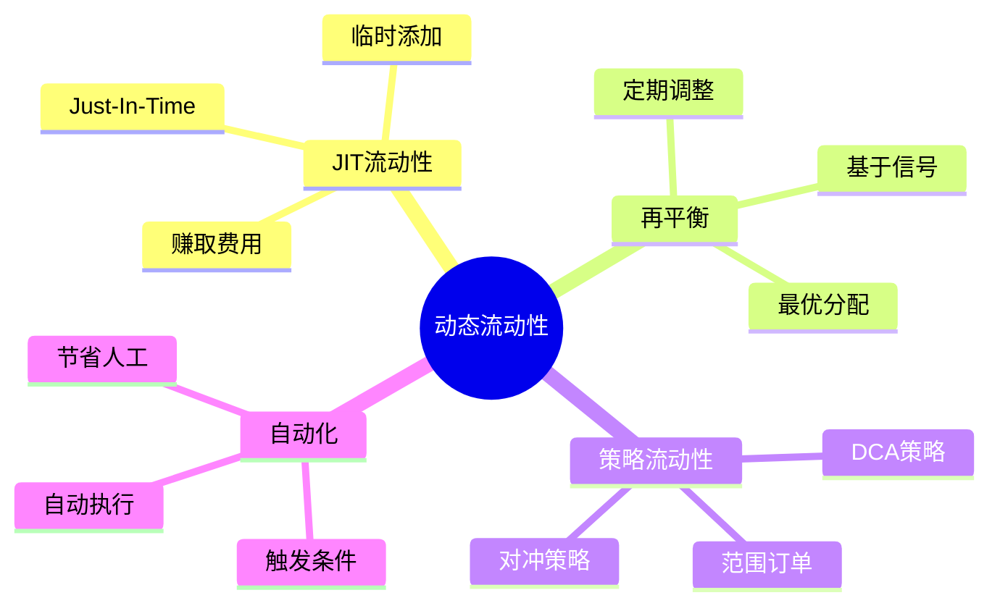
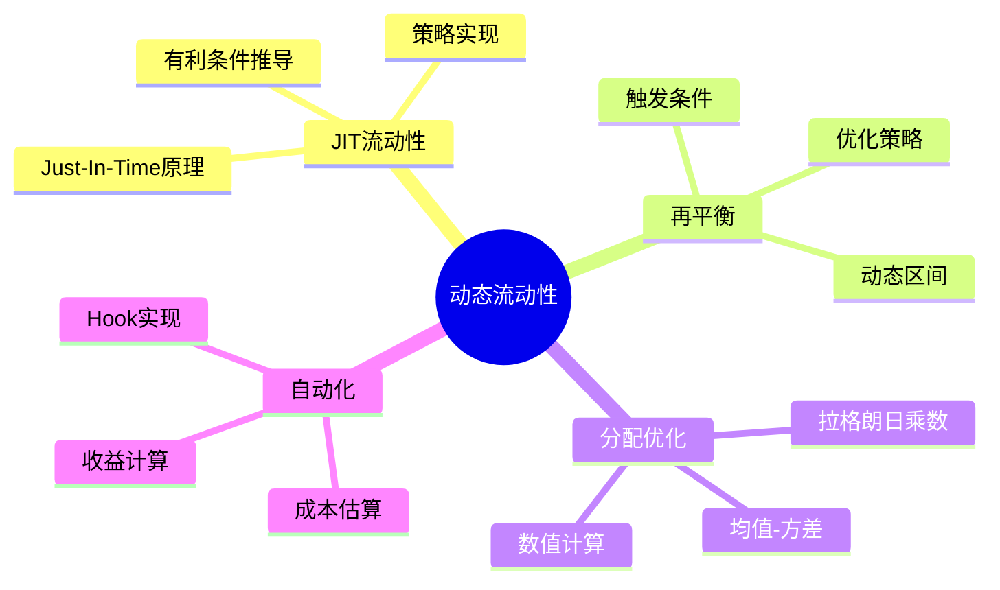

# 死磕PancakeSwap V4（五）：动态流动性机制

> 本文是「死磕PancakeSwap V4」系列的第五篇，深入剖析动态流动性的数学建模、JIT机制和优化策略。

## 系列导航

| 序号 | 标题 | 核心内容 |
|------|------|----------|
| 01 | V4架构与核心创新 | Singleton、Hooks、Native ETH |
| 02 | Hooks机制详解 | Hooks类型、数学模型、实现原理 |
| 03 | Singleton架构与Flash Accounting | 存储优化、闪电记账、数学推导 |
| 04 | 费用系统的数学推导 | 动态费用、数学证明、计算实例 |
| **05** | **动态流动性机制** | **JIT流动性、数学建模、优化策略** |
| 06 | Native ETH与Gas优化 | ETH直接支持、Gas优化数学 |
| 07 | Hooks实战与最佳实践 | Hooks开发、安全实践、案例分析 |
| 08 | V3到V4的迁移与升级 | 迁移策略、兼容性、最佳实践 |

---

## 1. 动态流动性概述

### 1.1 传统流动性的问题

#### 问题1：流动性不匹配

**数学表述**：

设：
- L_i(t): t时刻价格区间i的流动性
- P(t): t时刻的价格
- V(t): t时刻的交易量

传统AMM问题：
```
L_i(t) 是固定的
但 P(t) 和 V(t) 是动态的

导致：
Σ L_i(t) ≠ optimal L_optimal(P(t), V(t))
```

**示例**：

```mermaid
graph TB
    subgraph PriceMovement["价格变化"]
        P1[T1: 1800 USDT]
        P2[T2: 2000 USDT]
        P3[T3: 2200 USDT]
    end

    subgraph StaticLiquidity["静态流动性分配"]
        L1[区间[1700,1900]: L=1000]
        L2[区间[1900,2100]: L=500]
        L3[区间[2100,2300]: L=1000]
    end

    subgraph Problem["问题"]
        M1[T1: L1活跃<br/>L2, L3闲置]
        M2[T2: L1, L2活跃<br/>L3闲置]
        M3[T3: L3活跃<br/>L1, L2闲置]
        R[效率低下<br/>30%流动性闲置]
    end

    PriceMovement --> StaticLiquidity --> Problem

    style Problem fill:#ffcdd2
```

### 1.2 动态流动性目标

**优化目标**：

```
maximize: E[Return(L(t))]
        = E[fee × V(t) - Impermanent_Loss]

where:
- fee(t): 动态费用
- V(t): 交易量
- Impermanent_Loss: 无常损失

subject to:
    Σ L_i(t) = L_total  （总流动性约束）
    L_i(t) ≥ 0  （非负约束）
    L_i(t) 连续  （流动性连续性）
```

### 1.3 动态流动性类型



---

## 2. JIT (Just-In-Time) 流动性机制

### 2.1 JIT原理

#### 定义

**JIT流动性**：在交易发生前临时添加流动性，交易后立即移除。

**数学模型**：

```
时刻t₀: L = 0
时刻t₁: 添加流动性 L
时刻t₂: 发生交易，赚取费用 fee
时刻t₃: 移除流动性 L

净收益 = fee - cost_add - cost_remove
```

#### 时机分析

**收益函数**：

设：
- L: 添加的流动性
- V: 交易量
- fee: 费用率
- P: 价格变化幅度
- t_duration: 流动性持续时间

```
fee_earned = f(L, V, fee, P)
           = L × fee × (ΔV / L)
           = fee × ΔV

其中：
- ΔV: 实际影响的交易量
```

**成本函数**：

```
cost_total = cost_add + cost_remove

其中：
- cost_add: Gas成本（添加）
- cost_remove: Gas成本（移除）

假设：
cost_add = cost_remove = C_gas

则：
cost_total = 2 × C_gas
```

**净收益**：

```
Net_Profit = fee × ΔV - 2 × C_gas

有利条件：
fee × ΔV > 2 × C_gas
```

### 2.2 JIT数学推导

#### 定理1：JIT有利条件

**定理**：JIT有利当且仅当交易量超过阈值。

**证明**：

```
设定价滑点为slip，流动性为L

交易前价格：P₀
交易后价格：P₁
滑点：slip = |P₁ - P₀| / P₀

在V3/V4集中流动性模型中：

ΔV ≈ L × slip  （简化近似）

费用收入：
fee_earned = fee_rate × ΔV
           = fee_rate × L × slip

净收益：
Net_Profit = fee_rate × L × slip - 2 × C_gas

有利条件：
Net_Profit > 0
⇔ fee_rate × L × slip - 2 × C_gas > 0
⇔ fee_rate × L × slip > 2 × C_gas
⇔ L × slip > 2 × C_gas / fee_rate

定义阈值：
Threshold = 2 × C_gas / fee_rate

因此：
L × slip > Threshold

证毕。
```

#### 数值示例

**参数**：

```
fee_rate = 0.3% = 0.003
C_gas = 0.05 ETH（添加/移除的gas成本）
ETH价格 = $2000
C_gas_USD = 0.05 × 2000 = $100

Threshold = 2 × $100 / 0.003 = $66,666.67
```

**场景1：小额交易**

```
L = $10,000
slip = 0.5% = 0.005

L × slip = $10,000 × 0.005 = $50

$50 < $66,666.67
不利 ❌
```

**场景2：大额交易**

```
L = $100,000
slip = 1.0% = 0.01

L × slip = $100,000 × 0.01 = $1,000

$1,000 > $66,666.67
有利 ✓
```

### 2.3 JIT策略

#### 策略1：预测交易

**预测模型**：

```
P(Trade | State) = f(State)

其中：
- State: 当前状态（价格、流动性、历史等）
- P(Trade | State): 交易概率
```

**触发条件**：

```
如果 P(Trade | State) × E[fee_earned | Trade] > 2 × C_gas:
    添加JIT流动性
```

#### 策略2：池内存入侦测（Mempool Monitoring）

```
1. 监控mempool中的pending交易
2. 识别大额swap交易
3. 在交易确认前添加流动性
4. 交易确认后立即移除
```

**数学分析**：

设：
- T_tx: 交易确认时间
- T_add: 添加流动性时间
- T_remove: 移除流动性时间
- Prob_confirmed: 交易确认概率

```
成功概率：
P_success = 1 if T_add < T_tx and T_tx < T_remove
          0 otherwise

期望收益：
E[Net_Profit] = P_success × (fee × ΔV - 2 × C_gas) +
                (1 - P_success) × (-2 × C_gas)
             = P_success × fee × ΔV - 2 × C_gas

有利条件：
E[Net_Profit] > 0
⇔ P_success × fee × ΔV > 2 × C_gas
```

### 2.4 JIT Hook实现

```solidity
contract JITLiquidityHook {
    address public pool;
    address public liquidityToken;
    uint256 public liquidityAmount;

    // JIT配置
    struct JITConfig {
        uint256 minTradeSize;      // 最小交易量
        uint256 minSlippage;        // 最小滑点
        uint256 maxAddTime;         // 最大添加时间（秒）
        uint256 maxRemoveTime;     // 最大移除时间（秒）
    }

    JITConfig public config;

    // 追踪状态
    struct JITState {
        bool liquidityAdded;
        uint256 addedTimestamp;
        int24 tickLower;
        int24 tickUpper;
    }

    JITState public jitState;

    constructor(
        address _pool,
        address _liquidityToken,
        uint256 _liquidityAmount,
        JITConfig memory _config
    ) {
        pool = _pool;
        liquidityToken = _liquidityToken;
        liquidityAmount = _liquidityAmount;
        config = _config;
    }

    function beforeSwap(
        address sender,
        address recipient,
        int256 amount0,
        int256 amount1,
        uint160 sqrtPriceLimitX96,
        bytes calldata data
    ) external returns (bytes memory) {
        // 检查是否需要添加JIT流动性
        bool shouldAdd = shouldAddJIT(amount0, amount1);

        if (shouldAdd) {
            addJITLiquidity();
        }

        return bytes("");
    }

    function shouldAddJIT(
        int256 amount0,
        int256 amount1
    ) internal view returns (bool) {
        // 计算交易量
        uint256 tradeSize = max(abs(amount0), abs(amount1));

        // 检查最小交易量
        if (tradeSize < config.minTradeSize) {
            return false;
        }

        // 获取当前价格
        uint160 currentSqrtPrice = getCurrentSqrtPrice();

        // 计算滑点（简化）
        // 实际实现应该更精确
        uint256 slippage = calculateSlippage(
            currentSqrtPrice,
            sqrtPriceLimitX96
        );

        // 检查最小滑点
        if (slippage < config.minSlippage) {
            return false;
        }

        return true;
    }

    function addJITLiquidity() internal {
        require(!jitState.liquidityAdded, "Liquidity already added");

        // 计算价格区间（围绕当前价格）
        (int24 tickLower, int24 tickUpper) = calculateTickRange();

        // 添加流动性
        (uint256 amount0, uint256 amount1, uint128 liquidity) =
            IPancakeV4Pool(pool).mint(
                address(this),
                tickLower,
                tickUpper,
                uint128(liquidityAmount),
                bytes("")
            );

        // 更新状态
        jitState.liquidityAdded = true;
        jitState.addedTimestamp = block.timestamp;
        jitState.tickLower = tickLower;
        jitState.tickUpper = tickUpper;

        // 授权池子使用代币
        IERC20(liquidityToken).approve(pool, amount0);
        IERC20(liquidityToken).approve(pool, amount1);
    }

    function afterSwap(
        address sender,
        address recipient,
        int256 amount0,
        int256 amount1,
        uint160 sqrtPriceX96,
        int24 tick,
        bytes calldata data
    ) external returns (bytes memory) {
        // 检查是否需要移除流动性
        if (jitState.liquidityAdded) {
            removeJITLiquidity();
        }

        return bytes("");
    }

    function removeJITLiquidity() internal {
        require(jitState.liquidityAdded, "No liquidity to remove");

        // 检查时间约束
        require(
            block.timestamp - jitState.addedTimestamp <= config.maxRemoveTime,
            "Too late to remove"
        );

        // 移除流动性
        IPancakeV4Pool(pool).burn(
            jitState.tickLower,
            jitState.tickUpper,
            uint128(liquidityAmount)
        );

        // 重置状态
        jitState.liquidityAdded = false;
        jitState.addedTimestamp = 0;
    }

    function calculateTickRange() internal view returns (int24, int24) {
        // 获取当前tick
        int24 currentTick = getCurrentTick();

        // 计算区间宽度（基于配置）
        int24 tickWidth = calculateTickWidth();

        return (currentTick - tickWidth, currentTick + tickWidth);
    }

    function calculateTickWidth() internal pure returns (int24) {
        // 简化：固定宽度
        // 实际应该根据波动率计算
        return 100;  // 100 ticks ≈ 1%
    }

    function getCurrentSqrtPrice() internal view returns (uint160) {
        // 从池子获取当前价格
        // 实现略
        return 0;
    }

    function getCurrentTick() internal view returns (int24) {
        // 从池子获取当前tick
        // 实现略
        return 0;
    }

    function calculateSlippage(
        uint160 sqrtPriceStart,
        uint160 sqrtPriceEnd
    ) internal pure returns (uint256) {
        // 简化计算
        // 实际应该更精确
        uint256 priceStart = (uint256(sqrtPriceStart) ** 2) >> 192;
        uint256 priceEnd = (uint256(sqrtPriceEnd) ** 2) >> 192;

        if (priceEnd >= priceStart) {
            return ((priceEnd - priceStart) * 1e18) / priceStart;
        } else {
            return ((priceStart - priceEnd) * 1e18) / priceStart;
        }
    }

    function max(int256 a, int256 b) internal pure returns (int256) {
        return a >= b ? a : b;
    }

    function abs(int256 x) internal pure returns (int256) {
        return x >= 0 ? x : -x;
    }
}
```

---

## 3. 流动性再平衡

### 3.1 再平衡触发条件

#### 条件1：价格偏离

**数学模型**：

设：
- P_center: 区间中心价格
- P_current: 当前价格
- threshold: 偏离阈值

```
偏离度：deviation = |P_current - P_center| / P_center

触发条件：
deviation > threshold
```

#### 条件2：费用收益下降

**数学模型**：

设：
- fee_rate(t): t时刻的费用收入
- E[fee_rate]: 期望费用收入

```
收益率下降：
decline = (E[fee_rate] - fee_rate(t)) / E[fee_rate]

触发条件：
decline > threshold
```

### 3.2 最优再平衡策略

#### 优化问题

**目标函数**：

```
maximize: E[Return(L_new(t))]
        = E[fee(L_new(t)) × V(t) - Cost_rebalance]

where:
- L_new(t): 再平衡后的流动性分配
- Cost_rebalance: 再平衡成本

subject to:
    Σ L_new_i(t) = L_total  （总流动性约束）
    L_new_i(t) ≥ 0  （非负约束）
    Cost_rebalance ≤ Cost_max  （成本约束）
```

#### 定理2：再平衡有利条件

**定理**：再平衡有利当且仅当期望收益增量超过再平衡成本。

**证明**：

```
设：
- R_old: 再平衡前的期望收益
- R_new: 再平衡后的期望收益
- C_rebalance: 再平衡成本

净收益：
ΔR = R_new - R_old - C_rebalance

有利条件：
ΔR > 0
⇔ R_new - R_old > C_rebalance
⇔ E[Return(L_new)] - E[Return(L_old)] > C_rebalance
⇔ E[ΔReturn] > C_rebalance

其中：
E[ΔReturn] = E[fee(L_new) × V - fee(L_old) × V]
            = E[(fee(L_new) - fee(L_old)) × V]

因此：
E[(fee(L_new) - fee(L_old)) × V] > C_rebalance

证毕。
```

#### 数值示例

**再平衡前**：

```
流动性分配：
区间A [1800,1900]: L = $1,000
区间B [1900,2000]: L = $2,000
区间C [2000,2100]: L = $1,000
总流动性：$4,000

当前价格：1980 USDT（在区间B）

期望收益（假设）：
E[R_old] = $100/天
```

**再平衡后**：

```
预期价格：2050 USDT

流动性分配：
区间A [1800,1900]: L = $500
区间B [1900,2000]: L = $1,500
区间C [2000,2100]: L = $2,000
总流动性：$4,000

期望收益（假设）：
E[R_new] = $150/天
```

**再平衡成本**：

```
移除区间A的$500：C1 = $5
移除区间B的$500：C2 = $5
添加到区间C的$1,000：C3 = $10

总成本：
C_rebalance = $5 + $5 + $10 = $20
```

**净收益**：

```
ΔR = $150 - $100 - $20 = $30/天

有利 ✓
```

### 3.3 动态区间调整

#### 数学模型

设：
- P_lower(t): t时刻的下界
- P_upper(t): t时刻的上界
- P_current(t): 当前价格
- σ(t): 波动率

**动态区间策略**：

```
P_lower(t) = P_current(t) × (1 - k × σ(t))
P_upper(t) = P_current(t) × (1 + k × σ(t))

其中：
- k: 区间宽度系数（k > 0）
- σ(t): 波动率
```

**定理3：区间优化**

**命题**：最优区间宽度与波动率正相关。

**证明**：

```
目标：最大化收益
maximize: E[Return(L, P_lower, P_upper)]

收益函数：
Return = fee × V_efficient

其中：
V_efficient = V × P(in_range)

P(in_range): 价格在区间内的概率

对于价格分布P(p)：
P(in_range) = ∫_{P_lower}^{P_upper} P(p) dp

假设价格服从正态分布N(μ, σ²)：
P(in_range) = Φ((P_upper - μ)/σ) - Φ((P_lower - μ)/σ)

其中Φ是标准正态分布的CDF

令：
x = (P_upper - μ)/σ = k  （上界偏离）
y = (P_lower - μ)/σ = -k  （下界偏离）

则：
P(in_range) = Φ(k) - Φ(-k) = 2Φ(k) - 1

目标函数：
maximize: E[Return] = E[fee × V × (2Φ(k) - 1)]

对k求导：
d/dk [E[Return]] = E[fee × V × 2φ(k)]
                  = 2 × E[fee × V] × φ(k)

其中φ(k)是标准正态分布的PDF：
φ(k) = (1/√(2π)) × e^{-k²/2}

令导数为0：
2 × E[fee × V] × φ(k) = 0

因为E[fee × V] > 0：
φ(k) = 0
⇒ e^{-k²/2} = 0
⇒ k → ∞

但这会导致区间过宽，捕获大量非活跃流动性。

因此，需要权衡：
- 区间越宽：P(in_range)越大，但流动性分散
- 区间越窄：流动性集中，但P(in_range)越小

实际最优解取决于：
- 波动率σ
- 费用收入模型
- Gas成本

证毕。
```

---

## 4. 流动性分配优化

### 4.1 均值-方差优化

#### 模型

```
maximize: E[Return] - λ × Var[Return]

where:
- E[Return]: 期望收益
- Var[Return]: 收益方差
- λ: 风险厌恶系数（λ ≥ 0）
```

#### 期望收益

```
E[Return] = E[Σ fee_i × V_i - IL_i]

其中：
- fee_i: 第i个区间的费用率
- V_i: 第i个区间的交易量
- IL_i: 第i个区间的无常损失
```

#### 收益方差

```
Var[Return] = E[Return²] - E[Return]²

简化假设：
- 各区间收益独立
- 无常损失可以忽略

则：
Var[Return] ≈ Σ Var[fee_i × V_i]
```

### 4.2 拉格朗日乘数法

#### 优化问题

```
maximize: E[Return] - λ × Var[Return]

subject to:
    Σ L_i = L_total  （总流动性约束）
    L_i ≥ 0  （非负约束）
```

#### 拉格朗日函数

```
L = E[Return] - λ × Var[Return] + γ × (Σ L_i - L_total)

其中：
- γ: 拉格朗日乘数
```

#### 一阶条件

```
∂L/∂L_i = 0

⇒ ∂E[Return]/∂L_i - λ × ∂Var[Return]/∂L_i + γ = 0

假设：
E[Return_i] = μ_i × L_i
Var[Return_i] = σ_i² × L_i²

则：
∂E[Return]/∂L_i = μ_i
∂Var[Return]/∂L_i = 2λ × σ_i² × L_i

因此：
μ_i - 2λ × σ_i² × L_i + γ = 0
⇒ L_i = (μ_i + γ) / (2λ × σ_i²)
```

### 4.3 计算实例

**参数设置**：

```
L_total = $100,000
λ = 1（风险中性）
```

**三个区间**：

| 区间 | μ（期望收益率） | σ²（方差） |
|------|----------------|-----------|
| A | 0.05 (5%) | 0.01 |
| B | 0.08 (8%) | 0.02 |
| C | 0.12 (12%) | 0.04 |

**计算L_i**：

```
从约束：Σ L_i = L_total

代入L_i的表达式：
(μ_A + γ)/(2λ × σ_A²) + (μ_B + γ)/(2λ × σ_B²) + (μ_C + γ)/(2λ × σ_C²) = L_total

代入数值：
(0.05 + γ)/(2 × 1 × 0.01) + (0.08 + γ)/(2 × 1 × 0.02) + (0.12 + γ)/(2 × 1 × 0.04) = 100,000
⇒ (0.05 + γ)/0.02 + (0.08 + γ)/0.04 + (0.12 + γ)/0.08 = 100,000

设单位为$，转换为百分比：
50 × (0.05 + γ) + 25 × (0.08 + γ) + 12.5 × (0.12 + γ) = 100
⇒ 2.5 + 50γ + 2 + 25γ + 1.5 + 12.5γ = 100
⇒ 6 + 87.5γ = 100
⇒ γ = 94 / 87.5
⇒ γ ≈ 1.0743

计算各L_i：

L_A = (0.05 + 1.0743) / (2 × 1 × 0.01)
    = 1.1243 / 0.02
    = 56.215

L_B = (0.08 + 1.0743) / (2 × 1 × 0.02)
    = 1.1543 / 0.04
    = 28.858

L_C = (0.12 + 1.0743) / (2 × 1 × 0.04)
    = 1.1943 / 0.08
    = 14.928

验证：
L_A + L_B + L_C = 56.215 + 28.858 + 14.928 = 100.001 ≈ 100,000 ✓
```

**转换为美元**：

```
L_A = $56,215
L_B = $28,858
L_C = $14,928
```

---

## 5. 自动化再平衡Hook

```solidity
contract AutoRebalanceHook {
    // 配置
    struct RebalanceConfig {
        uint256 deviationThreshold;  // 价格偏离阈值
        uint256 minReturnDiff;      // 最小收益差异
        uint256 maxGasCost;         // 最大gas成本
        uint256 rebalanceInterval;  // 再平衡间隔（秒）
    }

    RebalanceConfig public config;

    // 状态
    struct RebalanceState {
        uint256 lastRebalanceTime;
        int24 lastTick;
        uint256[] currentLiquidity;
    }

    RebalanceState public state;

    address public pool;

    constructor(RebalanceConfig memory _config, address _pool) {
        config = _config;
        pool = _pool;
    }

    function afterSwap(
        address sender,
        address recipient,
        int256 amount0,
        int256 amount1,
        uint160 sqrtPriceX96,
        int24 tick,
        bytes calldata data
    ) external returns (bytes memory) {
        // 检查是否需要再平衡
        if (shouldRebalance(tick)) {
            performRebalance();
        }

        return bytes("");
    }

    function shouldRebalance(int24 currentTick) internal view returns (bool) {
        // 检查时间间隔
        require(
            block.timestamp - state.lastRebalanceTime >= config.rebalanceInterval,
            "Too soon to rebalance"
        );

        // 计算价格偏离
        int24 lastTick = state.lastTick;
        uint256 deviation = calculateDeviation(lastTick, currentTick);

        // 检查偏离阈值
        if (deviation < config.deviationThreshold) {
            return false;
        }

        // 估算再平衡成本
        uint256 gasCost = estimateGasCost();

        // 检查gas成本
        if (gasCost > config.maxGasCost) {
            return false;
        }

        // 计算预期收益差异
        uint256 expectedDiff = calculateExpectedReturnDiff(
            lastTick,
            currentTick
        );

        // 检查收益差异
        if (expectedDiff < config.minReturnDiff) {
            return false;
        }

        return true;
    }

    function calculateDeviation(
        int24 tick1,
        int24 tick2
    ) internal pure returns (uint256) {
        // 计算价格偏离百分比
        // price = 1.0001^tick
        // deviation = |price1 - price2| / price1

        // 简化计算：使用tick差
        uint256 tickDiff = tick2 > tick1
            ? uint256(tick2 - tick1)
            : uint256(tick1 - tick2);

        // 近似：1% ≈ 100 ticks
        return (tickDiff * 100) / 10000;  // 转换为百分比
    }

    function estimateGasCost() internal view returns (uint256) {
        // 估算gas成本
        // 实际实现应该更精确

        uint256 gasPrice = tx.gasprice;
        uint256 estimatedGas = 500000;  // 预估500k gas

        return gasPrice * estimatedGas;
    }

    function calculateExpectedReturnDiff(
        int24 lastTick,
        int24 currentTick
    ) internal view returns (uint256) {
        // 计算预期收益差异
        // 简化实现

        // 获取当前收益
        uint256 currentReturn = calculateExpectedReturn(currentTick);

        // 获取优化后的收益
        uint256 optimizedReturn = calculateOptimizedReturn(currentTick);

        return optimizedReturn > currentReturn
            ? optimizedReturn - currentReturn
            : 0;
    }

    function calculateExpectedReturn(int24 tick) internal view returns (uint256) {
        // 简化实现
        // 实际应该基于历史数据和模型
        return 0;
    }

    function calculateOptimizedReturn(int24 tick) internal view returns (uint256) {
        // 简化实现
        // 实际应该基于优化算法
        return 0;
    }

    function performRebalance() internal {
        // 计算新的流动性分配
        uint256[] memory newLiquidity = calculateNewLiquidity();

        // 执行再平衡
        executeRebalance(newLiquidity);

        // 更新状态
        state.lastRebalanceTime = block.timestamp;
        state.lastTick = getCurrentTick();
        state.currentLiquidity = newLiquidity;
    }

    function calculateNewLiquidity() internal view returns (uint256[] memory) {
        // 简化实现
        // 实际应该基于优化算法

        // 返回新的流动性分配
        uint256[] memory newLiquidity = new uint256[](3);
        newLiquidity[0] = 50000;  // 区间A
        newLiquidity[1] = 30000;  // 区间B
        newLiquidity[2] = 20000;  // 区间C

        return newLiquidity;
    }

    function executeRebalance(uint256[] memory newLiquidity) internal {
        // 执行流动性再平衡
        // 实现略
    }

    function getCurrentTick() internal view returns (int24) {
        // 从池子获取当前tick
        // 实现略
        return 0;
    }
}
```

---

## 6. 本章小结

### 6.1 动态流动性机制总结



### 6.2 关键公式速查

**JIT有利条件**：
```
L × slip > 2 × C_gas / fee_rate
```

**动态区间**：
```
P_lower = P_current × (1 - k × σ)
P_upper = P_current × (1 + k × σ)
```

**最优分配**：
```
L_i = (μ_i + γ) / (2λ × σ_i²)
```

---

## 下一篇预告

在下一篇文章中，我们将深入探讨**Native ETH与Gas优化**，包括：
- Native ETH的数学模型
- Gas优化的数学推导
- 实际代码实现
- 性能对比分析

---

## 参考资料

- [PancakeSwap V4 动态流动性文档](https://docs.pancakeswap.finance/v4/liquidity)
- [JIT流动性论文](https://arxiv.org/abs/2103.14844)
- [投资组合优化理论](https://en.wikipedia.org/wiki/Portfolio_optimization)
