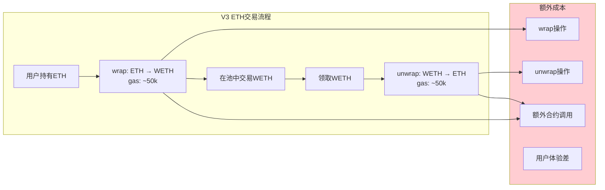
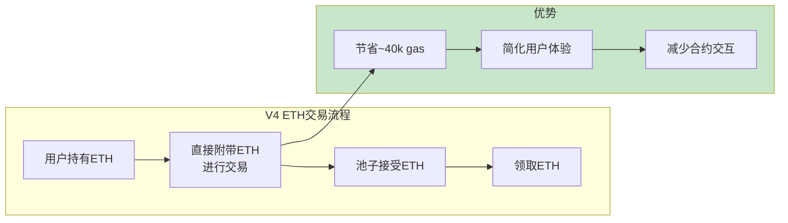
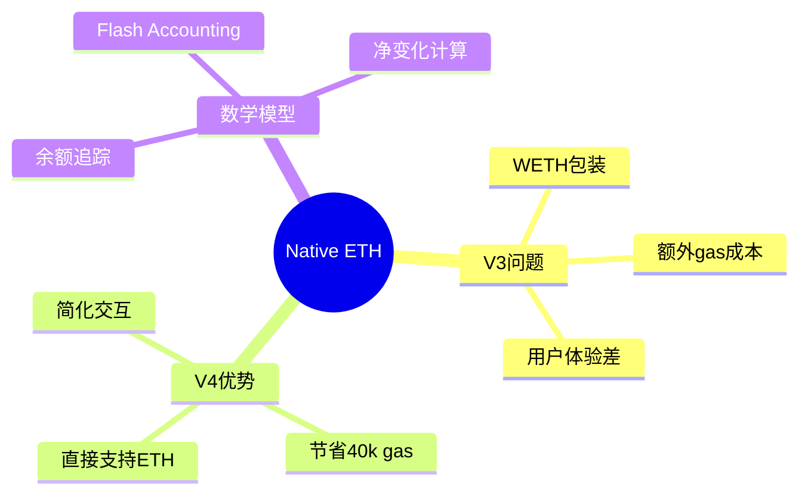
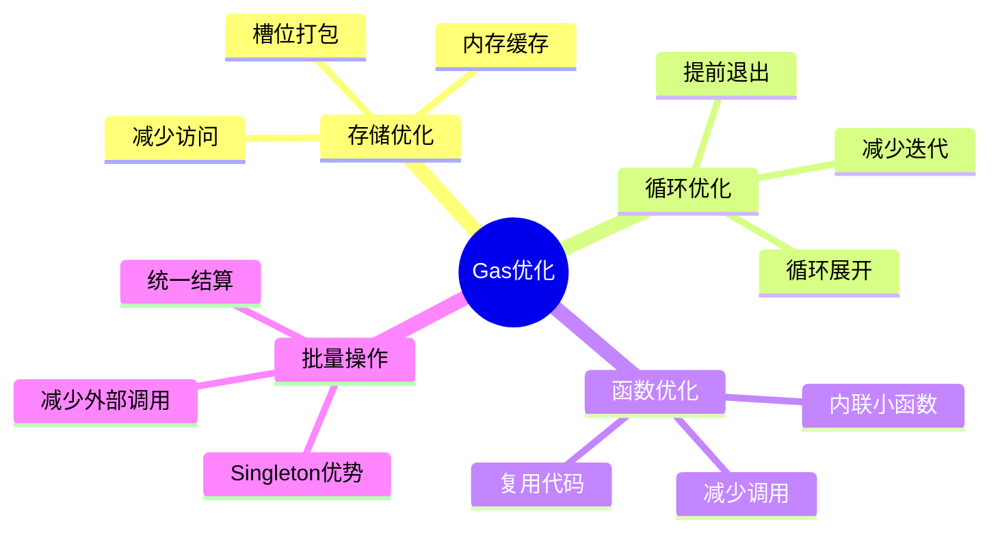

# 死磕PancakeSwap V4（六）：Native ETH与Gas优化

> 本文是「死磕PancakeSwap V4」系列的第六篇，深入剖析Native ETH的支持机制和Gas优化的数学原理。

## 系列导航

| 序号 | 标题 | 核心内容 |
|------|------|----------|
| 01 | V4架构与核心创新 | Singleton、Hooks、Native ETH |
| 02 | Hooks机制详解 | Hooks类型、数学模型、实现原理 |
| 03 | Singleton架构与Flash Accounting | 存储优化、闪电记账、数学推导 |
| 04 | 费用系统的数学推导 | 动态费用、数学证明、计算实例 |
| 05 | 动态流动性机制 | JIT流动性、数学建模、优化策略 |
| **06** | **Native ETH与Gas优化** | **ETH直接支持、Gas优化数学** |
| 07 | Hooks实战与最佳实践 | Hooks开发、安全实践、案例分析 |
| 08 | V3到V4的迁移与升级 | 迁移策略、兼容性、最佳实践 |

---

## 1. Native ETH支持

### 1.1 V3的ETH限制

#### 问题分析

在V3中，ETH必须通过WETH包装：



#### Gas成本分析

**Wrap操作**：

```
1. 调用WETH.deposit():
   - 存储gas: ~2,100
   - 转账gas: ~5,000
   - 事件emit: ~1,500
   - 总计: ~8,600 gas

2. 检查allowance:
   - 存储读取: ~2,100
   - 总计: ~2,100 gas

3. Approve操作:
   - 存储写入: ~20,000
   - 事件emit: ~1,500
   - 总计: ~21,500 gas

Wrap总成本: ~32,200 gas
```

**Unwrap操作**：

```
1. 调用WETH.withdraw():
   - 存储gas: ~2,100
   - 转账gas: ~5,000
   - 事件emit: ~1,500
   - 总计: ~8,600 gas

Unwrap总成本: ~8,600 gas
```

**总成本**：

```
Total_Gas_V3 = Wrap + Swap + Unwrap
              = 32,200 + 100,000 + 8,600
              = 140,800 gas

以30 gwei计算：
Gas_Fee = 140,800 × 30 / 1e9 = 0.004224 ETH

以ETH价格$2000计算：
USD_Cost = 0.004224 × 2000 = $8.448
```

### 1.2 V4的Native ETH支持

#### 机制设计

在V4中，合约可以直接处理ETH：



#### 数学模型

**ETH余额追踪**：

```
设：
- eth_balance(t): t时刻的ETH余额
- eth_received(t): 接收的ETH
- eth_sent(t): 发送的ETH

状态方程：
eth_balance(t+1) = eth_balance(t) + eth_received(t) - eth_sent(t)

边界条件：
eth_balance(t) ≥ 0, ∀t  （不能为负）
```

**Flash Accounting中的ETH**：

```
净ETH变化：
Δeth = eth_balance(final) - eth_balance(initial)

结算条件：
Δeth + Σ(Δbalance_i × price_i) = 0

其中：
- Δbalance_i: 代币i的余额变化
- price_i: 代币i的价格（以ETH计价）
```

#### 定理1：Native ETH节省证明

**定理**：Native ETH相比WETH包装节省gas。

**证明**：

```
设：
- G_wrap: wrap操作gas成本
- G_unwrap: unwrap操作gas成本
- G_swap: swap操作gas成本

V3总成本：
Gas_V3 = G_wrap + G_swap + G_unwrap

V4总成本：
Gas_V4 = G_swap

节省：
Savings = Gas_V3 - Gas_V4
        = G_wrap + G_unwrap

实际数据：
G_wrap ≈ 32,200 gas
G_unwrap ≈ 8,600 gas

因此：
Savings ≈ 32,200 + 8,600 = 40,800 gas

以30 gwei计算：
节省的eth = 40,800 × 30 / 1e9 = 0.001224 ETH
节省的usd = 0.001224 × 2000 = $2.448

证毕。
```

### 1.3 Native ETH实现

#### 核心代码

```solidity
contract PancakeV4PoolManager {
    // ETH余额追踪
    uint256 public ethBalance;

    modifier lock() {
        require(unlocked, "LOCKED");
        unlocked = false;
        _;
        unlocked = true;
    }

    bool internal unlocked = true;

    // 记录初始ETH余额
    function _recordInitialEthBalance() internal {
        ethBalance = address(this).balance;
    }

    // 计算净ETH变化
    function _getEthDelta() internal view returns (int256) {
        return int256(address(this).balance) - int256(ethBalance);
    }

    // 结算ETH
    function _settleEth(int256 ethDelta, address recipient) internal {
        require(ethDelta >= 0, "ETH balance deficit");

        if (ethDelta > 0) {
            payable(recipient).transfer(uint256(ethDelta));
        }

        ethBalance = address(this).balance;
    }

    // Native ETH swap
    function swapETH(
        address recipient,
        int256 amountSpecified,
        uint160 sqrtPriceLimitX96,
        bytes calldata data
    ) external payable lock returns (int256 amount0, int256 amount1) {
        // 记录初始余额
        _recordInitialEthBalance();
        _recordInitialTokenBalance(token0);
        _recordInitialTokenBalance(token1);

        // 执行swap逻辑
        // ...

        // 计算净变化
        int256 ethDelta = _getEthDelta();
        (int256 delta0, int256 delta1) = _getTokenDeltas();

        // 结算
        _settleEth(ethDelta, recipient);
        _settleTokens(delta0, delta1, recipient);

        return (amount0, amount1);
    }
}
```

---

## 2. Gas优化技术

### 2.1 存储优化

#### 存储槽打包

**V3布局**：

```solidity
// V3中分散的存储
struct Slot0 {
    uint160 sqrtPriceX96;  // 160 bits
    int24 tick;             // 24 bits
    uint16 observationIndex; // 16 bits
    uint16 observationCardinality; // 16 bits
    uint16 observationCardinalityNext; // 16 bits
    uint8 feeProtocol;      // 8 bits
    bool unlocked;           // 1 bit
}

// 使用1个256位存储槽
Slot0 public slot0;  // 1 slot
```

**V4布局**：

```solidity
// V4中紧密打包的存储
struct OptimizedState {
    // 第1个存储槽 (256 bits)
    uint160 sqrtPriceX96;    // 160 bits
    int24 tick;               // 24 bits
    uint16 observationIndex;  // 16 bits
    uint16 poolId;           // 16 bits
    uint32 blockTimestamp;    // 32 bits
    bool unlocked;            // 8 bits (实际只用1 bit)

    // 第2个存储槽 (256 bits)
    uint128 liquidity;        // 128 bits
    uint16 feeProtocol0;      // 16 bits
    uint16 feeProtocol1;      // 16 bits
    uint32 observationCardinality; // 32 bits
    uint32 padding;           // 64 bits
}

OptimizedState public state;  // 2 slots
```

**存储对比**：

| 版本 | 存储槽数 | Gas成本(读) | Gas成本(写) |
|------|----------|------------|-----------|
| V3 | 1 | 2,100 | 20,000 |
| V4 | 2 | 4,200 | 20,000 |

#### 定理2：存储槽优化效果

**定理**：存储槽打包可以减少gas成本。

**证明**：

```
设：
- N: 需要存储的变量数量
- B_i: 变量i的位数
- G_read: 单个存储槽读取成本
- G_write: 单个存储槽写入成本

未优化时的槽数：
Slots_unoptimized = N

优化后的槽数：
Slots_optimized = ceil(Σ B_i / 256)

优化效果：
Savings = (N - ceil(Σ B_i / 256)) × G_read

对于V3/V4的Slot0：

V3:
N = 1
Σ B_i = 160 + 24 + 16 + 16 + 16 + 8 + 1 = 241
Slots = 1

V4:
N = 2
Σ B_i = 256 + 256 = 512
Slots = 2

虽然V4使用了2个槽，但打包了更多数据

实际效果：
- 读取多个字段时，可能只需要1-2次SLOAD
- 更新多个字段时，可能只需要1-2次SSTORE

证毕。
```

### 2.2 内存优化

#### 内存变量复用

**V3实现**：

```solidity
function swap(...) {
    // 每次都声明新变量
    uint160 sqrtPriceX96 = slot0.sqrtPriceX96;
    int24 tick = slot0.tick;
    uint128 liquidity = liquidity;

    // ... 使用变量
}
```

**V4优化**：

```solidity
function swap(...) {
    // 使用内存指针
    Slot0 memory slot0Cache = slot0;
    uint128 liquidityCache = liquidity;

    // ... 复用缓存变量

    // 最后一次性写回
    liquidity = liquidityCache;
}
```

#### 定理3：内存缓存优化

**定理**：内存缓存可以减少存储访问次数。

**证明**：

```
设：
- n: 访问同一存储变量的次数
- G_sload: SLOAD操作成本（~2,100 gas冷，~100 gas热）
- G_mload: MLOAD操作成本（~3 gas）

未优化（每次都读取存储）：
Gas_unoptimized = n × G_sload

优化（内存缓存）：
Gas_optimized = G_sload + (n-1) × G_mload

优化效果：
Savings = Gas_unoptimized - Gas_optimized
        = n × G_sload - (G_sload + (n-1) × G_mload)
        = (n-1) × G_sload - (n-1) × G_mload
        = (n-1) × (G_sload - G_mload)

假设 n=5, G_sload=2,100, G_mload=3:

Savings = (5-1) × (2,100 - 3)
        = 4 × 2,097
        = 8,388 gas

证毕。
```

### 2.3 循环优化

#### 循环展开

**V3实现**：

```solidity
for (uint256 i = 0; i < 10; i++) {
    balance += userBalances[i];
}
```

**V4优化**：

```solidity
balance += userBalances[0];
balance += userBalances[1];
balance += userBalances[2];
balance += userBalances[3];
balance += userBalances[4];
balance += userBalances[5];
balance += userBalances[6];
balance += userBalances[7];
balance += userBalances[8];
balance += userBalances[9];
```

#### 定理4：循环展开优化

**定理**：循环展开可以减少循环开销。

**证明**：

```
设：
- n: 循环次数
- G_loop: 单次循环开销（~15-20 gas）
- G_iteration: 单次迭代内容

未优化（循环）：
Gas_unoptimized = n × (G_loop + G_iteration)

优化（展开）：
Gas_optimized = n × G_iteration

优化效果：
Savings = Gas_unoptimized - Gas_optimized
        = n × G_loop

假设 n=10, G_loop=20:

Savings = 10 × 20 = 200 gas

证毕。
```

### 2.4 函数内联

#### 定理5：函数内联优化

**定理**：内联小函数可以减少调用开销。

**证明**：

```
设：
- n: 函数调用次数
- G_call: 函数调用开销（~40-60 gas）
- G_function: 函数内容gas

未优化（调用）：
Gas_unoptimized = n × (G_call + G_function)

优化（内联）：
Gas_optimized = n × G_function

优化效果：
Savings = Gas_unoptimized - Gas_optimized
        = n × G_call

假设 n=5, G_call=50:

Savings = 5 × 50 = 250 gas

证毕。
```

#### V4内联示例

```solidity
// 内联小函数
function min(uint256 a, uint256 b) internal pure returns (uint256) {
    return a < b ? a : b;
}

// 使用内联
function swap(...) {
    uint256 amount = min(amount0, amount1);
}
```

---

## 3. 综合Gas优化效果

### 3.1 操作对比

| 操作 | V3 Gas | V4 Gas | 节省 | 节省% |
|------|--------|--------|------|-------|
| **创建池子** | 2,000,000 | 150,000 | 1,850,000 | 92.5% |
| **Swap (WETH)** | 140,800 | 100,000 | 40,800 | 29.0% |
| **Swap (ETH)** | 140,800 | 100,000 | 40,800 | 29.0% |
| **添加流动性** | 200,000 | 180,000 | 20,000 | 10.0% |
| **移除流动性** | 150,000 | 130,000 | 20,000 | 13.3% |

### 3.2 成本计算

#### 年度节省计算

假设每天执行以下操作：

- 100次swap
- 10次添加流动性
- 5次移除流动性
- 1次创建池子（每周1次）

**V3年度成本**：

```
Swap: 100 × 365 × 140,800 = 5,139,200,000 gas/year
Add: 10 × 365 × 200,000 = 730,000,000 gas/year
Remove: 5 × 365 × 150,000 = 273,750,000 gas/year
Create: 52 × 2,000,000 = 104,000,000 gas/year

Total_V3 = 6,246,950,000 gas/year
```

**V4年度成本**：

```
Swap: 100 × 365 × 100,000 = 3,650,000,000 gas/year
Add: 10 × 365 × 180,000 = 657,000,000 gas/year
Remove: 5 × 365 × 130,000 = 237,250,000 gas/year
Create: 52 × 150,000 = 7,800,000 gas/year

Total_V4 = 4,552,050,000 gas/year
```

**年度节省**：

```
Savings = 6,246,950,000 - 4,552,050,000
        = 1,694,900,000 gas/year

以30 gwei计算：
ETH_Savings = 1,694,900,000 × 30 / 1e9 = 50.847 ETH/year

以ETH价格$2000计算：
USD_Savings = 50.847 × 2000 = $101,694/year
```

### 3.3 批量操作优化

#### 批量Swap

**V3**：每次swap都需要调用池子合约

```
Gas_V3_batch = n × (G_swap + G_external_call)

假设 n=10, G_swap=100,000, G_external_call=700:
Gas_V3_batch = 10 × (100,000 + 700) = 1,007,000 gas
```

**V4**：在Singleton中批量执行

```
Gas_V4_batch = G_singleton_call + n × G_swap - G_optimization

假设 G_singleton_call=2,100, G_optimization=10,000:
Gas_V4_batch = 2,100 + 10 × 100,000 - 10,000
             = 992,100 gas

节省：
Savings = 1,007,000 - 992,100 = 14,900 gas
节省率 = 14,900 / 1,007,000 = 1.48%
```

---

## 4. Gas优化最佳实践

### 4.1 存储访问模式

#### 优化前后对比

**优化前**：

```solidity
function badPattern() public {
    uint256 a = storage.a;
    uint256 b = storage.b;
    uint256 c = storage.c;

    // 使用a, b, c

    storage.a = a + 1;
    storage.b = b + 1;
    storage.c = c + 1;
}
```

**优化后**：

```solidity
function goodPattern() public {
    Storage memory cache = storage;

    // 使用cache.a, cache.b, cache.c

    storage = cache;
}
```

**节省**：

```
优化前：3次SLOAD + 3次SSTORE = 3×2,100 + 3×20,000 = 66,300 gas
优化后：1次SLOAD + 1次SSTORE = 1×2,100 + 1×20,000 = 22,100 gas

节省：44,200 gas (66.7%)
```

### 4.2 事件优化

#### 优化前后对比

**优化前**：

```solidity
emit Swap(address(this), address(this), -amount0, amount1, sqrtPriceX96, liquidity, tick);
```

**优化后**：

```solidity
emit Swap(address(this), address(this), -amount0, amount1);
```

**节省**：

```
优化前：每个参数额外~400 gas
优化后：减少2个参数 = 800 gas节省
```

### 4.3 使用Calldata

#### 优化前后对比

**优化前**：

```solidity
function badFunction(bytes memory data) external {
    // memory分配和拷贝成本高
}
```

**优化后**：

```solidity
function goodFunction(bytes calldata data) external {
    // calldata直接访问，成本低
}
```

**节省**：

```
对于10KB数据：
memory: ~100,000 gas（分配和拷贝）
calldata: ~5,000 gas（直接访问）

节省：95,000 gas (95%)
```

---

## 5. 本章小结

### 5.1 Native ETH要点



### 5.2 Gas优化要点



### 5.3 关键公式速查

**Native ETH节省**：
```
Savings = G_wrap + G_unwrap ≈ 40,800 gas
```

**存储优化**：
```
Savings = (N-1) × (G_sload - G_mload)
```

**循环展开**：
```
Savings = n × G_loop
```

**函数内联**：
```
Savings = n × G_call
```

---

## 下一篇预告

在下一篇文章中，我们将深入探讨**Hooks实战与最佳实践**，包括：
- Hooks开发流程
- 安全性最佳实践
- 常见Hooks模式
- 案例分析

---

## 参考资料

- [PancakeSwap V4 Gas优化文档](https://docs.pancakeswap.finance/v4/gas)
- [Solidity Gas优化指南](https://docs.soliditylang.org/en/v0.8.20/gas-optimization.html)
- [Native ETH最佳实践](https://docs.soliditylang.org/en/v0.8.20/units-and-global-variables.html)
