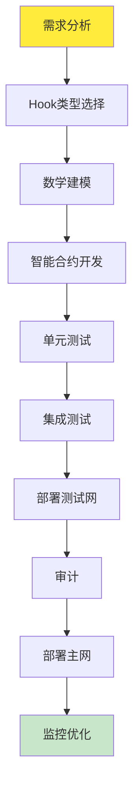
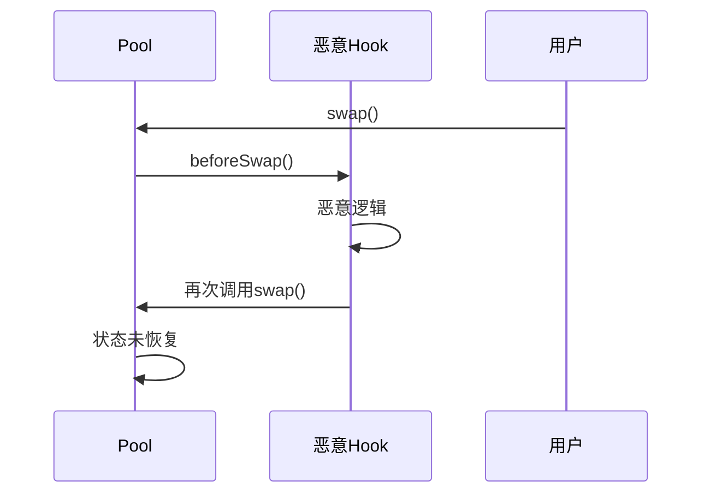
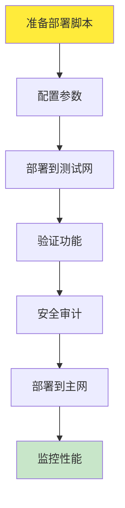
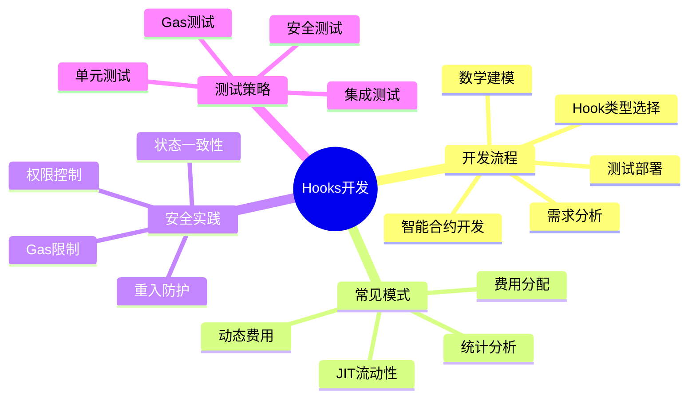

# 死磕PancakeSwap V4（七）：Hooks实战与最佳实践

> 本文是「死磕PancakeSwap V4」系列的第七篇，提供Hooks开发的实战指南和最佳实践。

## 系列导航

| 序号 | 标题 | 核心内容 |
|------|------|----------|
| 01 | V4架构与核心创新 | Singleton、Hooks、Native ETH |
| 02 | Hooks机制详解 | Hooks类型、数学模型、实现原理 |
| 03 | Singleton架构与Flash Accounting | 存储优化、闪电记账、数学推导 |
| 04 | 费用系统的数学推导 | 动态费用、数学证明、计算实例 |
| 05 | 动态流动性机制 | JIT流动性、数学建模、优化策略 |
| 06 | Native ETH与Gas优化 | ETH直接支持、Gas优化数学 |
| **07** | **Hooks实战与最佳实践** | **Hooks开发、安全实践、案例分析** |
| 08 | V3到V4的迁移与升级 | 迁移策略、兼容性、最佳实践 |

---

## 1. Hooks开发流程

### 1.1 开发步骤



### 1.2 需求分析清单

| 问题 | 说明 | 示例 |
|------|------|------|
| **业务目标** | Hook要解决什么问题？ | 动态费用、JIT流动性 |
| **触发时机** | 在哪个Hook点触发？ | beforeSwap, afterSwap |
| **状态需求** | 需要维护哪些状态？ | 价格历史、流动性数据 |
| **性能要求** | Gas预算是多少？ | <10,000 gas额外成本 |
| **安全等级** | 需要什么级别的安全？ | 简单/复杂/高级 |

---

## 2. 常见Hooks模式

### 2.1 动态费用Hook

#### 实现模板

```solidity
// SPDX-License-Identifier: MIT
pragma solidity ^0.8.20;

import "@openzeppelin/contracts/security/ReentrancyGuard.sol";
import {IPancakeV4Hooks} from "./interfaces/IPancakeV4Hooks.sol";

/**
 * @title DynamicFeeHook
 * @notice 基于波动率的动态费用Hook
 * @dev 实现beforeSwap和afterSwap Hooks
 */
contract DynamicFeeHook is ReentrancyGuard, IPancakeV4Hooks {
    // ============ 状态变量 ============

    // 费用参数
    uint256 public constant BASE_FEE = 300;  // 0.03%
    uint256 public constant ALPHA = 393;   // 0.0393% per 1% volatility
    uint256 public FEE_BASE = 221;       // 0.221%
    uint256 public BETA = 1;              // 线性模型

    // 价格历史
    struct PricePoint {
        uint256 price;
        uint256 timestamp;
    }

    PricePoint[] public priceHistory;
    uint256 public constant WINDOW_SIZE = 3600;  // 1小时窗口

    // 池子地址
    address public pool;

    // ============ 修饰符 ============

    modifier onlyPool() {
        require(msg.sender == pool, "Not pool");
        _;
    }

    // ============ Hook函数 ============

    /**
     * @notice beforeSwap Hook
     * @dev 计算并返回动态费用率
     */
    function beforeSwap(
        address sender,
        address recipient,
        int256 amount0,
        int256 amount1,
        uint160 sqrtPriceLimitX96,
        bytes calldata data
    ) external onlyPool nonReentrant returns (bytes memory) {
        // 计算当前价格
        uint256 currentPrice = calculatePrice(sqrtPriceLimitX96);

        // 更新价格历史
        _updatePriceHistory(currentPrice);

        // 计算波动率
        uint256 volatility = _calculateVolatility();

        // 计算动态费用
        uint256 dynamicFee = _calculateDynamicFee(volatility);

        return abi.encode(dynamicFee);
    }

    /**
     * @notice afterSwap Hook
     * @dev 可选：用于记录交易统计
     */
    function afterSwap(
        address sender,
        address recipient,
        int256 amount0,
        int256 amount1,
        uint160 sqrtPriceX96,
        int24 tick,
        bytes calldata data
    ) external onlyPool returns (bytes memory) {
        // 可以在此添加统计逻辑
        return bytes("");
    }

    // ============ 核心计算函数 ============

    /**
     * @notice 计算价格
     */
    function calculatePrice(uint160 sqrtPriceX96) public pure returns (uint256) {
        return (uint256(sqrtPriceX96) ** 2) >> 192;
    }

    /**
     * @notice 更新价格历史
     */
    function _updatePriceHistory(uint256 price) internal {
        priceHistory.push(PricePoint({
            price: price,
            timestamp: block.timestamp
        }));

        // 清理过期数据
        while (
            priceHistory.length > 0 &&
            block.timestamp - priceHistory[0].timestamp > WINDOW_SIZE
        ) {
            // 使用更高效的方法移除过期数据
            // （实际实现应该使用循环队列）
        }
    }

    /**
     * @notice 计算波动率
     */
    function _calculateVolatility() internal view returns (uint256) {
        if (priceHistory.length < 2) {
            return 0;  // 数据不足
        }

        // 计算收益率
        uint256[] memory returns = new uint256[](priceHistory.length - 1);
        uint256 sumReturns = 0;

        for (uint256 i = 1; i < priceHistory.length; i++) {
            uint256 r = (priceHistory[i].price * 1e18) / priceHistory[i-1].price;
            returns[i-1] = r;
            sumReturns += r;
        }

        // 平均收益率
        uint256 mean = sumReturns / (priceHistory.length - 1);

        // 计算方差
        uint256 variance = 0;
        for (uint256 i = 0; i < returns.length; i++) {
            int256 diff = int256(returns[i]) - int256(mean);
            variance += uint256(diff * diff);
        }

        variance = variance / returns.length;

        // 波动率（标准差）
        uint256 volatility = _sqrt(variance);

        // 转换为百分比
        return volatility / 1e16;  // 转换为%
    }

    /**
     * @notice 计算动态费用
     */
    function _calculateDynamicFee(uint256 volatility) internal view returns (uint256) {
        // 线性模型：fee = α × σ + fee_base
        uint256 fee = (ALPHA * volatility / 100) + FEE_BASE;

        // 限制费用范围
        fee = _max(fee, 100);     // 最小0.01%
        fee = _min(fee, 10000);   // 最大1.00%

        return fee;
    }

    // ============ 工具函数 ============

    function _sqrt(uint256 x) internal pure returns (uint256) {
        if (x == 0) return 0;
        uint256 z = (x + 1) / 2;
        uint256 y = x;
        while (z < y) {
            y = z;
            z = (x / z + 1) / 2;
        }
        return y;
    }

    function _max(uint256 a, uint256 b) internal pure returns (uint256) {
        return a >= b ? a : b;
    }

    function _min(uint256 a, uint256 b) internal pure returns (uint256) {
        return a <= b ? a : b;
    }

    // ============ 初始化 ============

    constructor(address _pool) {
        pool = _pool;
    }
}
```

### 2.2 JIT流动性Hook

#### 实现模板

```solidity
// SPDX-License-Identifier: MIT
pragma solidity ^0.8.20;

import "@openzeppelin/contracts/security/ReentrancyGuard.sol";
import {IPancakeV4Hooks} from "./interfaces/IPancakeV4Hooks.sol";

/**
 * @title JITLiquidityHook
 * @notice JIT流动性提供Hook
 * @dev 在swap前临时添加流动性，swap后立即移除
 */
contract JITLiquidityHook is ReentrancyGuard, IPancakeV4Hooks {
    // ============ 状态变量 ============

    address public pool;
    address public liquidityToken;
    uint256 public liquidityAmount;

    // JIT配置
    struct JITConfig {
        uint256 minTradeSize;      // 最小交易量
        uint256 minSlippage;        // 最小滑点 (1e18 = 100%)
        uint256 maxAddTime;         // 最大添加时间（秒）
        uint256 maxRemoveTime;     // 最大移除时间（秒）
    }

    JITConfig public config;

    // JIT状态
    struct JITState {
        bool liquidityAdded;
        uint256 addedTimestamp;
        int24 tickLower;
        int24 tickUpper;
        uint128 liquidity;
    }

    JITState public jitState;

    // ============ 修饰符 ============

    modifier onlyPool() {
        require(msg.sender == pool, "Not pool");
        _;
    }

    // ============ Hook函数 ============

    /**
     * @notice beforeSwap Hook
     * @dev 检查是否需要添加JIT流动性
     */
    function beforeSwap(
        address sender,
        address recipient,
        int256 amount0,
        int256 amount1,
        uint160 sqrtPriceLimitX96,
        bytes calldata data
    ) external onlyPool nonReentrant returns (bytes memory) {
        // 检查是否需要添加JIT流动性
        bool shouldAdd = _shouldAddJIT(amount0, amount1, sqrtPriceLimitX96);

        if (shouldAdd) {
            _addJITLiquidity();
        }

        return bytes("");
    }

    /**
     * @notice afterSwap Hook
     * @dev 检查是否需要移除JIT流动性
     */
    function afterSwap(
        address sender,
        address recipient,
        int256 amount0,
        int256 amount1,
        uint160 sqrtPriceX96,
        int24 tick,
        bytes calldata data
    ) external onlyPool nonReentrant returns (bytes memory) {
        // 检查是否需要移除流动性
        if (jitState.liquidityAdded) {
            _removeJITLiquidity();
        }

        return bytes("");
    }

    // ============ JIT逻辑 ============

    function _shouldAddJIT(
        int256 amount0,
        int256 amount1,
        uint160 sqrtPriceLimitX96
    ) internal view returns (bool) {
        // 检查是否已经添加
        if (jitState.liquidityAdded) {
            return false;
        }

        // 计算交易量
        uint256 tradeSize = _max(_abs(amount0), _abs(amount1));

        // 检查最小交易量
        if (tradeSize < config.minTradeSize) {
            return false;
        }

        // 获取当前价格
        uint160 currentSqrtPrice = _getCurrentSqrtPrice();

        // 计算滑点
        uint256 slippage = _calculateSlippage(
            currentSqrtPrice,
            sqrtPriceLimitX96
        );

        // 检查最小滑点
        if (slippage < config.minSlippage) {
            return false;
        }

        return true;
    }

    function _addJITLiquidity() internal {
        // 计算价格区间
        (int24 tickLower, int24 tickUpper) = _calculateTickRange();

        // 添加流动性
        // （实际实现需要调用池子的mint函数）
        // 这里只是记录状态

        jitState.liquidityAdded = true;
        jitState.addedTimestamp = block.timestamp;
        jitState.tickLower = tickLower;
        jitState.tickUpper = tickUpper;
        jitState.liquidity = uint128(liquidityAmount);
    }

    function _removeJITLiquidity() internal {
        // 检查时间约束
        require(
            block.timestamp - jitState.addedTimestamp <= config.maxRemoveTime,
            "Too late to remove"
        );

        // 移除流动性
        // （实际实现需要调用池子的burn函数）
        // 这里只是重置状态

        jitState.liquidityAdded = false;
        jitState.addedTimestamp = 0;
    }

    // ============ 计算函数 ============

    function _calculateTickRange() internal view returns (int24, int24) {
        // 获取当前tick
        int24 currentTick = _getCurrentTick();

        // 计算区间宽度
        int24 tickWidth = 100;  // 固定宽度

        return (currentTick - tickWidth, currentTick + tickWidth);
    }

    function _calculateSlippage(
        uint160 sqrtPriceStart,
        uint160 sqrtPriceEnd
    ) internal pure returns (uint256) {
        uint256 priceStart = (uint256(sqrtPriceStart) ** 2) >> 192;
        uint256 priceEnd = (uint256(sqrtPriceEnd) ** 2) >> 192;

        if (priceEnd >= priceStart) {
            return ((priceEnd - priceStart) * 1e18) / priceStart;
        } else {
            return ((priceStart - priceEnd) * 1e18) / priceStart;
        }
    }

    function _getCurrentSqrtPrice() internal view returns (uint160) {
        // 从池子获取当前价格
        // 实现略
        return 0;
    }

    function _getCurrentTick() internal view returns (int24) {
        // 从池子获取当前tick
        // 实现略
        return 0;
    }

    // ============ 工具函数 ============

    function _abs(int256 x) internal pure returns (uint256) {
        return x >= 0 ? uint256(x) : uint256(-x);
    }

    function _max(uint256 a, uint256 b) internal pure returns (uint256) {
        return a >= b ? a : b;
    }

    // ============ 配置管理 ============

    function setConfig(JITConfig calldata _config) external {
        // 只有管理员可以配置
        // require(msg.sender == admin, "Not admin");
        config = _config;
    }

    // ============ 初始化 ============

    constructor(
        address _pool,
        address _liquidityToken,
        uint256 _liquidityAmount,
        JITConfig memory _config
    ) {
        pool = _pool;
        liquidityToken = _liquidityToken;
        liquidityAmount = _liquidityAmount;
        config = _config;
    }
}
```

---

## 3. 安全最佳实践

### 3.1 重入攻击防护

#### 问题场景



#### 解决方案

**使用ReentrancyGuard**：

```solidity
import "@openzeppelin/contracts/security/ReentrancyGuard.sol";

contract SecureHook is ReentrancyGuard {
    function beforeSwap(
        address sender,
        address recipient,
        int256 amount0,
        int256 amount1,
        uint160 sqrtPriceLimitX96,
        bytes calldata data
    ) external nonReentrant returns (bytes memory) {
        // Hook逻辑
        return bytes("");
    }
}
```

### 3.2 权限控制

#### 问题：任何人都可以调用Hook

```solidity
// 不安全
function beforeSwap(...) external {
    // 没有权限检查
}
```

#### 解决方案

```solidity
// 安全
contract SecureHook {
    address public immutable pool;

    modifier onlyPool() {
        require(msg.sender == pool, "Not pool");
        _;
    }

    function beforeSwap(...) external onlyPool {
        // 只有池子可以调用
    }

    constructor(address _pool) {
        pool = _pool;
    }
}
```

### 3.3 状态一致性

#### 问题：Hook修改状态，但Pool未感知

```solidity
// 不安全
contract UnsafeHook {
    uint256 public counter;

    function beforeSwap(...) external {
        counter++;  // 状态改变
        // Pool不知道
    }
}
```

#### 解决方案

```solidity
// 安全
contract SafeHook {
    uint256 public version;
    mapping(uint256 => uint256) public snapshots;

    modifier checkpoint() {
        uint256 currentVersion = version;
        snapshots[currentVersion] = counter;

        _;  // 执行操作

        // 检查状态一致性
        require(
            counter == snapshots[currentVersion],
            "State inconsistent"
        );
    }

    function beforeSwap(...) external checkpoint {
        counter++;  // 状态改变
    }
}
```

### 3.4 Gas限制

#### 问题：Hook消耗过多gas

```solidity
// 不安全
contract ExpensiveHook {
    function beforeSwap(...) external {
        // 循环1000次
        for (uint256 i = 0; i < 1000; i++) {
            // 昂贵操作
        }
    }
}
```

#### 解决方案

```solidity
// 安全
contract GasLimitedHook {
    uint256 public constant MAX_GAS = 50000;

    function beforeSwap(...) external {
        uint256 gasBefore = gasleft();

        // Hook逻辑

        require(
            gasBefore - gasleft() <= MAX_GAS,
            "Gas limit exceeded"
        );
    }
}
```

---

## 4. 测试策略

### 4.1 单元测试

#### Foundry测试示例

```solidity
// SPDX-License-Identifier: MIT
pragma solidity ^0.8.20;

import "forge-std/Test.sol";
import "../src/DynamicFeeHook.sol";

contract DynamicFeeHookTest is Test {
    DynamicFeeHook hook;
    address pool;

    function setUp() public {
        pool = address(0x1);
        hook = new DynamicFeeHook(pool);
    }

    function testCalculatePrice() public {
        uint160 sqrtPriceX96 = 5602277097478613991873193812722;  // price = 1
        uint256 price = hook.calculatePrice(sqrtPriceX96);
        assertEq(price, 1e18);
    }

    function testDynamicFee() public {
        // 测试波动率为1%时的费用
        uint256 volatility = 100;  // 1%
        uint256 fee = hook.calculateDynamicFee(volatility);

        // 预期：fee = 0.0393 × 1 + 0.221 = 0.2603%
        assertEq(fee, 260);  // 0.02603%
    }

    function testDynamicFeeMax() public {
        // 测试最大费用
        uint256 volatility = 5000;  // 50%
        uint256 fee = hook.calculateDynamicFee(volatility);

        // 应该限制在1.00%
        assertLe(fee, 10000);
    }

    function testDynamicFeeMin() public {
        // 测试最小费用
        uint256 volatility = 0;  // 0%
        uint256 fee = hook.calculateDynamicFee(volatility);

        // 应该至少0.01%
        assertGe(fee, 100);
    }
}
```

### 4.2 集成测试

```solidity
contract IntegrationTest is Test {
    PancakeV4PoolManager poolManager;
    DynamicFeeHook hook;
    MockERC20 token0;
    MockERC20 token1;

    function setUp() public {
        // 部署合约
        token0 = new MockERC20("Token0", "T0");
        token1 = new MockERC20("Token1", "T1");
        hook = new DynamicFeeHook(address(poolManager));
        poolManager = new PancakeV4PoolManager();

        // 创建池子
        poolManager.createPool(address(token0), address(token1), 300, address(hook));
    }

    function testSwapWithDynamicFee() public {
        // 准备代币
        token0.mint(address(this), 1000 * 1e18);
        token0.approve(address(poolManager), 1000 * 1e18);

        // 执行swap
        (int256 amount0, int256 amount1) = poolManager.swap(
            address(token0),
            address(token1),
            300,  // fee
            int256(100 * 1e18),  // amountIn
            address(this),
            0,  // sqrtPriceLimit
            bytes("")
        );

        // 验证结果
        assertEq(amount0, -100 * 1e18);
        assertTrue(amount1 > 0);
    }
}
```

---

## 5. 部署指南

### 5.1 部署流程



### 5.2 Foundry部署脚本

```solidity
// SPDX-License-Identifier: MIT
pragma solidity ^0.8.20;

import "forge-std/Script.sol";
import "../src/DynamicFeeHook.sol";
import {PancakeV4PoolManager} from "../src/PancakeV4PoolManager.sol";

contract DeployHook is Script {
    function run() external {
        uint256 deployerPrivateKey = vm.envUint("PRIVATE_KEY");
        address deployer = vm.addr(deployerPrivateKey);

        vm.startBroadcast(deployerPrivateKey);

        // 部署Hook
        DynamicFeeHook hook = new DynamicFeeHook(
            address(0x1),  // pool address
            300,          // base fee
            393,          // alpha
            221,          // fee base
            1             // beta
        );

        // 配置Hook
        hook.setConfig(DynamicFeeHook.JITConfig({
            minTradeSize: 100000 * 1e18,
            minSlippage: 1e16,  // 1%
            maxAddTime: 60,     // 60 seconds
            maxRemoveTime: 120  // 120 seconds
        }));

        // 验证部署
        console.log("Hook deployed to:", address(hook));
        console.log("Pool:", hook.pool());
        console.log("Base Fee:", hook.BASE_FEE());

        vm.stopBroadcast();
    }
}
```

### 5.3 部署验证

```bash
# 1. 编译合约
forge build

# 2. 部署到测试网
forge script script/DeployHook.s.sol \
    --rpc-url $GOERLI_RPC_URL \
    --broadcast \
    --verify

# 3. 验证部署
cast call $HOOK_ADDRESS "pool()"

# 4. 测试Hook功能
cast send $HOOK_ADDRESS "setConfig((uint256,uint256,uint256,uint256))" \
    $MIN_TRADE_SIZE $MIN_SLIPPAGE $MAX_ADD_TIME $MAX_REMOVE_TIME \
    --private-key $PRIVATE_KEY
```

---

## 6. 监控与优化

### 6.1 性能监控

#### Gas消耗监控

```solidity
contract GasMonitor {
    uint256 public lastGasUsed;
    uint256 public avgGasUsed;
    uint256 public maxGasUsed;
    uint256 public callCount;

    function recordGas(uint256 gasUsed) internal {
        lastGasUsed = gasUsed;
        maxGasUsed = gasUsed > maxGasUsed ? gasUsed : maxGasUsed;
        avgGasUsed = (avgGasUsed * callCount + gasUsed) / (callCount + 1);
        callCount++;
    }

    function getStats() external view returns (
        uint256 last,
        uint256 avg,
        uint256 max,
        uint256 count
    ) {
        return (lastGasUsed, avgGasUsed, maxGasUsed, callCount);
    }
}
```

### 6.2 性能优化建议

| 优化项 | 预期节省 | 实施难度 |
|--------|---------|----------|
| 减少存储访问 | 10-20% | 低 |
| 内存缓存 | 5-10% | 低 |
| 循环展开 | 2-5% | 中 |
| 函数内联 | 1-3% | 低 |
| 事件精简 | 5-15% | 低 |

---

## 7. 常见问题

### 7.1 Hook不被调用

**原因**：
1. Hook地址未正确设置
2. Hook未实现必需的接口
3. Hook已禁用

**解决方案**：

```solidity
// 检查Hook是否正确配置
function checkHook() external view returns (bool) {
    address poolAddress = poolManager.getPool(
        token0,
        token1,
        fee
    );

    address hookAddress = PancakeV4Pool(poolAddress).hook();

    return hookAddress == address(this);
}
```

### 7.2 Gas成本过高

**原因**：
1. Hook逻辑过于复杂
2. 存储访问过多
3. 循环次数过多

**解决方案**：

```solidity
// 1. 添加gas限制
modifier gasLimit(uint256 maxGas) {
    uint256 gasBefore = gasleft();
    _;
    require(gasBefore - gasleft() <= maxGas, "Gas limit exceeded");
}

// 2. 优化存储访问
function optimized() external {
    uint256 value1 = storage1;  // 读取一次
    uint256 value2 = storage2;  // 读取一次

    // 使用缓存的值
    // ...
}

// 3. 减少循环
for (uint256 i = 0; i < 10; i++) {  // 固定次数
    // ...
}
```

### 7.3 状态不一致

**原因**：
1. Hook修改状态但未通知池子
2. 并发调用导致竞态条件
3. 重入攻击

**解决方案**：

```solidity
// 1. 使用检查点
modifier checkpoint() {
    uint256 snapshot = state;
    _;
    require(state == snapshot, "State changed");
}

// 2. 使用重入保护
import "@openzeppelin/contracts/security/ReentrancyGuard.sol";

contract SafeHook is ReentrancyGuard {
    function beforeSwap(...) external nonReentrant {
        // Hook逻辑
    }
}

// 3. 使用Mutex
import "@openzeppelin/contracts/security/Mutex.sol";

contract MutexHook is Mutex {
    function beforeSwap(...) external mutexLocked {
        // Hook逻辑
    }
}
```

---

## 8. 本章小结

### 8.1 Hooks开发要点



### 8.2 最佳实践清单

- [ ] 使用ReentrancyGuard防护重入攻击
- [ ] 添加onlyPool修饰符限制调用者
- [ ] 实现checkpoint确保状态一致
- [ ] 添加gas限制防止DoS攻击
- [ ] 编写完整的单元测试
- [ ] 进行安全审计
- [ ] 部署前在测试网验证
- [ ] 部署后持续监控

---

## 下一篇预告

在下一篇文章中，我们将深入探讨**V3到V4的迁移与升级**，包括：
- 迁移策略设计
- 兼容性处理
- 数据迁移方案
- 最佳实践指南

---

## 参考资料

- [PancakeSwap V4 Hooks 开发文档](https://docs.pancakeswap.finance/v4/hooks)
- [Foundry 测试框架](https://book.getfoundry.sh/)
- [OpenZeppelin 安全最佳实践](https://docs.openzeppelin.com/contracts/4.x/)
