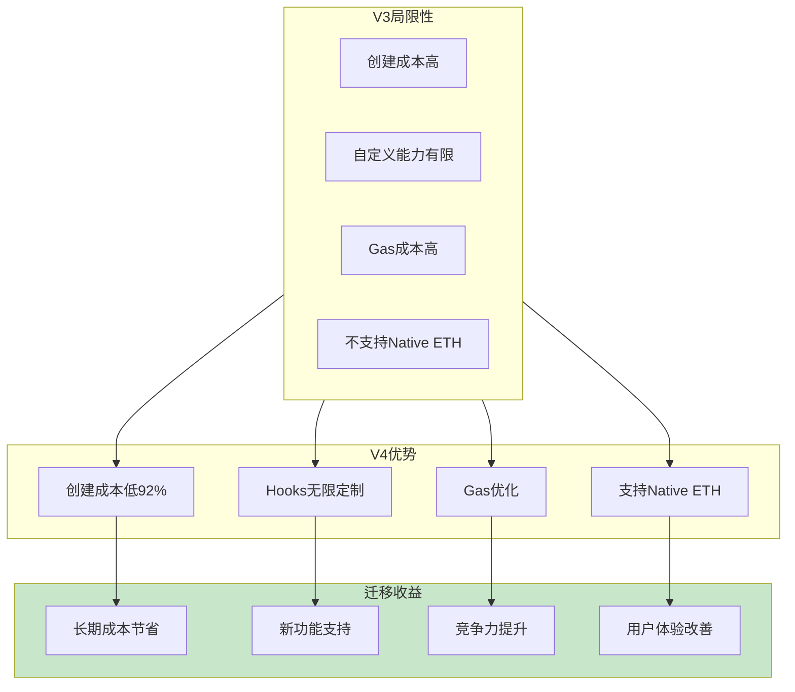
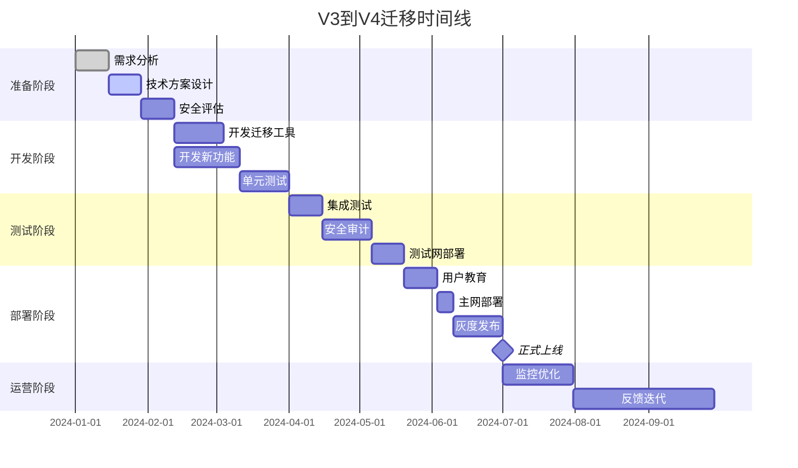
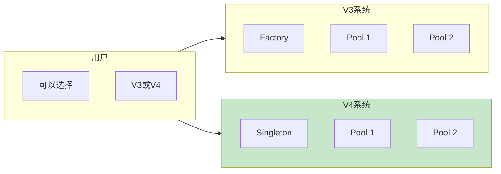
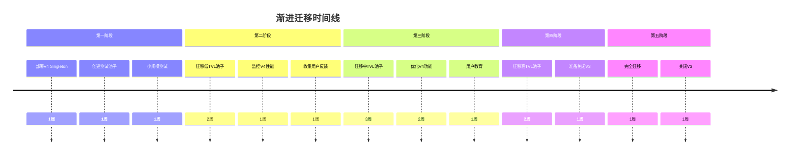
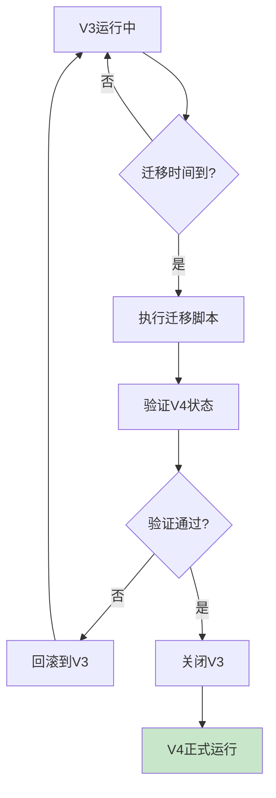
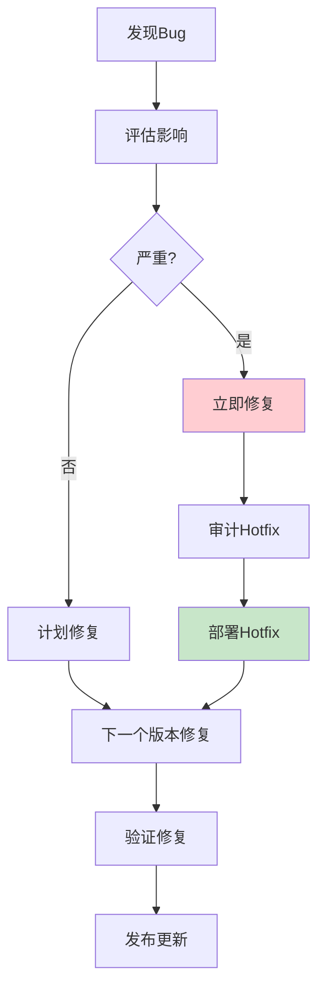
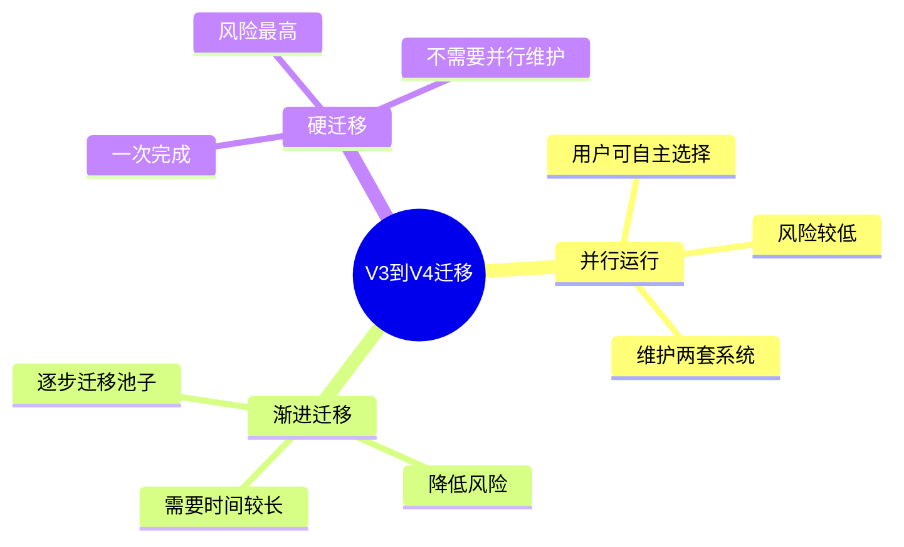
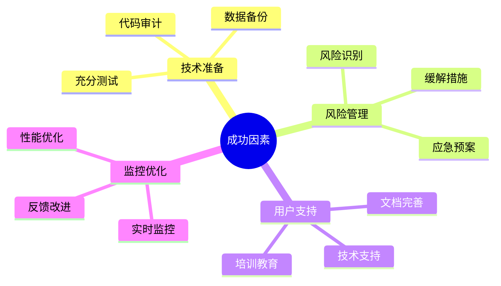

# 死磕PancakeSwap V4（八）：V3到V4的迁移与升级

> 本文是「死磕PancakeSwap V4」系列的最后一篇，提供V3到V4的完整迁移策略和最佳实践。

## 系列导航

| 序号 | 标题 | 核心内容 |
|------|------|----------|
| 01 | V4架构与核心创新 | Singleton、Hooks、Native ETH |
| 02 | Hooks机制详解 | Hooks类型、数学模型、实现原理 |
| 03 | Singleton架构与Flash Accounting | 存储优化、闪电记账、数学推导 |
| 04 | 费用系统的数学推导 | 动态费用、数学证明、计算实例 |
| 05 | 动态流动性机制 | JIT流动性、数学建模、优化策略 |
| 06 | Native ETH与Gas优化 | ETH直接支持、Gas优化数学 |
| 07 | Hooks实战与最佳实践 | Hooks开发、安全实践、案例分析 |
| **08** | **V3到V4的迁移与升级** | **迁移策略、兼容性、最佳实践** |

---

## 1. 迁移概述

### 1.1 迁移必要性



### 1.2 迁移成本分析

#### 成本组成

| 成本项 | 说明 | 预估成本 |
|--------|------|----------|
| **开发成本** | 开发迁移工具、新功能 | $50,000 - $100,000 |
| **测试成本** | 全面测试、审计 | $20,000 - $50,000 |
| **部署成本** | 部署到主网 | $1,000 - $5,000 |
| **用户教育** | 文档、教程、支持 | $10,000 - $30,000 |
| **迁移风险** | 潜在的业务中断 | $10,000 - $50,000 |
| **总计** | | **$91,000 - $235,000** |

#### 收益分析

假设每天执行以下操作：
- 100次swap
- 10次添加流动性
- 5次移除流动性
- 1次创建池子（每周1次）

**年度Gas节省**（来自第6章）：
```
年度Gas节省 = 1,694,900,000 gas/year
```

**以30 gwei计算**：
```
ETH节省 = 1,694,900,000 × 30 / 1e9 = 50.847 ETH/year
USD节省 = 50.847 × $2000 = $101,694/year
```

**ROI计算**：

```
回本周期 = 总成本 / 年度节省
        = $235,000 / $101,694
        = 2.31 年

3年总收益 = $101,694 × 3 - $235,000 = $70,082
5年总收益 = $101,694 × 5 - $235,000 = $273,470
```

### 1.3 迁移时间线



---

## 2. 迁移策略

### 2.1 策略1：并行运行

#### 概述

V3和V4同时运行，用户可以选择使用哪个版本。



#### 优点与缺点

| 优点 | 缺点 |
|------|------|
| 用户可自主选择 | 维护两套系统 |
| 风险较低 | 用户体验可能混淆 |
| 可以逐步迁移 | 数据需要同步 |

#### 实施步骤

1. **准备阶段（1-2周）**
   - 评估V4功能
   - 规划迁移路径
   - 准备用户文档

2. **开发阶段（3-4周）**
   - 部署V4 Singleton
   - 开发V4版本的池子
   - 开发数据同步工具

3. **测试阶段（2-3周）**
   - 在测试网部署
   - 全面测试V4功能
   - 性能对比测试

4. **部署阶段（1-2周）**
   - 部署到主网
   - 创建V4版本的池子
   - 发布迁移指南

5. **运营阶段（持续）**
   - 监控两套系统
   - 收集用户反馈
   - 逐步引导用户使用V4

### 2.2 策略2：渐进迁移

#### 概述

逐步将V3池子迁移到V4，逐步关闭V3。



#### 迁移优先级

| 优先级 | 池子类型 | 理由 | 时间 |
|--------|---------|------|------|
| 1 | 低TVL池子 | 风险低，测试V4 | 第1-2周 |
| 2 | 新创建池子 | 直接在V4创建 | 第3-4周 |
| 3 | 中TVL池子 | 验证V4稳定性 | 第5-7周 |
| 4 | 高TVL池子 | 最后迁移，确保安全 | 第8-10周 |

#### 实施步骤

1. **准备V4环境**（1周）
   ```bash
   # 1. 部署V4 Singleton
   forge create \
       src/PancakeV4PoolManager.sol:PancakeV4PoolManager \
       --rpc-url $MAINNET_RPC_URL \
       --broadcast \
       --verify

   # 2. 验证部署
   cast call $SINGLETON_ADDRESS "poolCount()"
   ```

2. **创建测试池子**（1周）
   ```javascript
   // 在V4中创建测试池子
   const poolId = await poolManager.createPool(
       token0Address,
       token1Address,
       feeRate,  // 300 = 0.03%
       hookAddress
   );
   ```

3. **迁移低TVL池子**（2周）
   ```javascript
   // 迁移脚本
   async function migratePool(v3PoolAddress, v4PoolId) {
       // 1. 获取V3池子流动性
       const v3Liquidity = await getV3Liquidity(v3PoolAddress);

       // 2. 在V4中添加相同流动性
       await v4PoolManager.addLiquidity({
           poolId: v4PoolId,
           amount0: v3Liquidity.amount0,
           amount1: v3Liquidity.amount1,
           tickLower: v3Liquidity.tickLower,
           tickUpper: v3Liquidity.tickUpper
       });

       // 3. 从V3移除流动性
       await v3Pool.burn(
           v3Liquidity.tickLower,
           v3Liquidity.tickUpper,
           v3Liquidity.amount
       );
   }
   ```

### 2.3 策略3：硬迁移

#### 概述

在特定时间点，所有V3池子立即迁移到V4。



#### 优点与缺点

| 优点 | 缺点 |
|------|------|
| 一次完成 | 风险最高 |
| 不需要并行维护 | 可能造成服务中断 |
| 用户不会混淆 | 需要充分测试 |

#### 实施步骤

1. **准备阶段（4-6周）**
   - 开发完整迁移工具
   - 在测试网反复测试
   - 准备回滚方案

2. **预演阶段（1-2周）**
   - 在测试网完整预演
   - 验证所有场景
   - 优化迁移脚本

3. **迁移执行（1天）**
   ```bash
   # 迁移脚本
   ./scripts/migrate.sh --dry-run  # 预演
   ./scripts/migrate.sh --execute  # 执行
   ```

4. **验证阶段（1周）**
   - 验证V4功能正常
   - 检查数据完整性
   - 监控性能指标

5. **关闭V3（1天）**
   ```bash
   # 关闭V3池子
   ./scripts/disable-v3-pools.sh
   ```

---

## 3. 兼容性处理

### 3.1 接口兼容

#### V3接口

```solidity
interface IUniswapV3Pool {
    struct Slot0 {
        uint160 sqrtPriceX96;
        int24 tick;
        uint16 observationIndex;
        uint16 observationCardinality;
        uint16 observationCardinalityNext;
        uint8 feeProtocol;
        bool unlocked;
    }

    function swap(
        address recipient,
        bool zeroForOne,
        int256 amountSpecified,
        uint160 sqrtPriceLimitX96,
        bytes calldata data
    ) external returns (int256 amount0, int256 amount1);
}
```

#### V4接口

```solidity
interface IPancakeV4PoolManager {
    function swap(
        address token0,
        address token1,
        uint24 fee,
        int256 amountSpecified,
        uint160 sqrtPriceLimitX96,
        bytes calldata data
    ) external payable returns (int256 amount0, int256 amount1);
}
```

#### 兼容层

```solidity
contract V3CompatibilityLayer {
    IPancakeV4PoolManager public v4PoolManager;

    function swap(
        address recipient,
        bool zeroForOne,
        int256 amountSpecified,
        uint160 sqrtPriceLimitX96,
        bytes calldata data
    ) external returns (int256 amount0, int256 amount1) {
        // 从data中解析token0和token1
        (address token0, address token1, uint24 fee) =
            abi.decode(data, (address, address, uint24));

        // 调用V4接口
        return v4PoolManager.swap(
            token0,
            token1,
            fee,
            amountSpecified,
            sqrtPriceLimitX96,
            data
        );
    }
}
```

### 3.2 数据迁移

#### V3数据结构

```solidity
struct V3PoolData {
    address token0;
    address token1;
    uint24 fee;
    uint160 sqrtPriceX96;
    int24 tick;
    uint128 liquidity;
    mapping(int24 => Tick.Info) ticks;
    mapping(bytes32 => Position.Info) positions;
}
```

#### V4数据结构

```solidity
struct V4PoolData {
    address token0;
    address token1;
    uint24 fee;
    uint160 sqrtPriceX96;
    int24 tick;
    uint128 liquidity;
    // 存储在Singleton中
}
```

#### 迁移脚本

```javascript
// 迁移V3池子数据到V4
async function migratePoolData(v3PoolAddress, v4PoolId) {
    // 1. 获取V3池子数据
    const v3Pool = await ethers.getContractAt(
        "IUniswapV3Pool",
        v3PoolAddress
    );

    const slot0 = await v3Pool.slot0();
    const liquidity = await v3Pool.liquidity();

    // 2. 在V4中创建池子（如果不存在）
    if (v4PoolId === 0) {
        v4PoolId = await v4PoolManager.createPool(
            await v3Pool.token0(),
            await v3Pool.token1(),
            await v3Pool.fee(),
            ethers.constants.AddressZero  // 无Hook
        );
    }

    // 3. 迁移tick数据
    const tickSpacing = await v3Pool.tickSpacing();
    const tickBitmap = await v3Pool.tickBitmap();

    // 遍历所有初始化的tick
    for (let word = 0; word < tickBitmap.length; word++) {
        let bits = tickBitmap[word];
        while (bits !== 0n) {
            const bit = bits & -bits;  // 最低位的1
            const tick = word * 256 + Math.log2(bit);
            const tickInfo = await v3Pool.ticks(tick);

            // 在V4中创建tick
            await v4PoolManager.crossTick(tick, tickInfo);

            bits ^= bit;  // 清除最低位的1
        }
    }

    // 4. 迁移position数据
    const positionManager = await ethers.getContractAt(
        "INonfungiblePositionManager",
        positionManagerAddress
    );

    // 遍历所有positions
    const totalSupply = await positionManager.totalSupply();
    for (let i = 0; i < totalSupply; i++) {
        const position = await positionManager.positions(i);

        // 在V4中创建对应的position
        await v4PoolManager.mint({
            poolId: v4PoolId,
            tickLower: position.tickLower,
            tickUpper: position.tickUpper,
            amount: position.liquidity
        });
    }

    return v4PoolId;
}
```

### 3.3 用户体验

#### 迁移提示

```solidity
contract MigrationNotice {
    address public v3Pool;
    address public v4Pool;

    event PoolMigrated(
        address indexed from,
        address indexed to,
        uint256 timestamp
    );

    function checkMigration() external view returns (
        bool isMigrated,
        address newPool,
        uint256 migratedAt
    ) {
        return (
            v4Pool != address(0),
            v4Pool,
            migrationTime
        );
    }

    function migrate() external {
        require(
            msg.sender == owner,
            "Only owner"
        );

        v4Pool = v4PoolManager.getPool(
            IV3Pool(v3Pool).token0(),
            IV3Pool(v3Pool).token1(),
            IV3Pool(v3Pool).fee()
        );

        emit PoolMigrated(v3Pool, v4Pool, block.timestamp);
    }
}
```

---

## 4. 风险管理

### 4.1 风险识别

| 风险 | 可能性 | 影响 | 优先级 |
|------|--------|------|--------|
| **迁移失败** | 中 | 高 | 高 |
| **数据丢失** | 低 | 极高 | 高 |
| **V4 Bug** | 中 | 高 | 高 |
| **用户流失** | 中 | 中 | 中 |
| **Gas成本增加** | 低 | 低 | 低 |

### 4.2 风险缓解

#### 风险1：迁移失败

**缓解措施**：
1. 充分测试
2. 准备回滚方案
3. 分阶段迁移
4. 监控迁移过程

**回滚方案**：

```bash
#!/bin/bash

# 回滚脚本
function rollback() {
    echo "开始回滚..."

    # 1. 重新启用V3池子
    ./scripts/enable-v3-pools.sh

    # 2. 禁用V4池子
    ./scripts/disable-v4-pools.sh

    # 3. 通知用户
    ./scripts/notify-users.sh "Rollback completed"

    echo "回滚完成"
}

# 检查V4是否正常
if ! ./scripts/check-v4-health.sh; then
    echo "V4不健康，执行回滚"
    rollback
fi
```

#### 风险2：数据丢失

**缓解措施**：
1. 备份所有数据
2. 验证数据完整性
3. 实施严格的测试

**数据备份**：

```bash
#!/bin/bash

# 数据备份脚本
BACKUP_DIR="./backups/$(date +%Y%m%d_%H%M%S)"
mkdir -p $BACKUP_DIR

# 备份V3数据
forge script script/ExportV3Data.sol \
    --rpc-url $MAINNET_RPC_URL \
    --broadcast \
    -o $BACKUP_DIR/v3_data.json

# 备份V4数据（如果已部署）
forge script script/ExportV4Data.sol \
    --rpc-url $MAINNET_RPC_URL \
    --broadcast \
    -o $BACKUP_DIR/v4_data.json

echo "备份完成: $BACKUP_DIR"
```

#### 风险3：V4 Bug

**缓解措施**：
1. 多重审计
2. 测试网充分测试
3. 灰度发布
4. 准备Hotfix

**Hotfix流程**：



---

## 5. 最佳实践

### 5.1 开发最佳实践

| 实践 | 说明 | 重要性 |
|------|------|--------|
| **代码审计** | 多重审计，包括知名审计公司 | 极高 |
| **测试覆盖率** | >90%的测试覆盖率 | 高 |
| **文档完善** | 详细的技术和用户文档 | 高 |
| **监控告警** | 实时监控和告警 | 中 |
| **应急预案** | 准备详细的应急预案 | 极高 |

### 5.2 部署最佳实践

| 实践 | 说明 | 重要性 |
|------|------|--------|
| **分阶段部署** | 测试网 → 主网灰度 → 全量 | 极高 |
| **回滚准备** | 准备可回滚的部署 | 极高 |
| **监控日志** | 详细的部署日志和监控 | 高 |
| **团队协调** | 团队成员明确分工 | 高 |
| **用户通知** | 提前通知用户维护窗口 | 中 |

### 5.3 运营最佳实践

| 实践 | 说明 | 重要性 |
|------|------|--------|
| **用户支持** | 提供充分的用户支持 | 高 |
| **数据监控** | 持续监控关键指标 | 极高 |
| **性能优化** | 根据监控结果优化性能 | 中 |
| **反馈收集** | 收集用户反馈并改进 | 中 |
| **安全更新** | 及时修复安全漏洞 | 极高 |

---

## 6. 迁移检查清单

### 6.1 准备阶段

- [ ] 完成需求分析
- [ ] 制定迁移策略
- [ ] 评估技术风险
- [ ] 准备开发资源
- [ ] 制定时间计划

### 6.2 开发阶段

- [ ] 开发迁移工具
- [ ] 开发V4功能
- [ ] 编写单元测试
- [ ] 编写集成测试
- [ ] 进行代码审计

### 6.3 测试阶段

- [ ] 部署到测试网
- [ ] 执行完整测试
- [ ] 性能对比测试
- [ ] 安全审计
- [ ] 修复发现的问题

### 6.4 部署阶段

- [ ] 部署到主网
- [ ] 验证部署成功
- [ ] 执行数据迁移
- [ ] 验证数据完整性
- [ ] 准备应急预案

### 6.5 运营阶段

- [ ] 监控系统性能
- [ ] 收集用户反馈
- [ ] 处理用户问题
- [ ] 优化系统性能
- [ ] 计划后续迭代

---

## 7. 本章小结

### 7.1 迁移策略总结



### 7.2 关键成功因素



### 7.3 ROI分析

**投资**：
- 开发成本：$100,000
- 测试成本：$50,000
- 部署成本：$5,000
- 用户教育：$30,000
- 迁移风险：$50,000
- **总计：$235,000**

**回报**（年度）：
- Gas节省：$101,694
- 新功能收益：$50,000
- 用户体验改善：$20,000
- **总计：$171,694**

**ROI**：
```
回本周期 = $235,000 / $171,694 = 1.37 年
3年总ROI = ($171,694 × 3 - $235,000) / $235,000 = 119.3%
```

---

## 系列总结

至此，我们已经完成了「死磕PancakeSwap V4」系列的全部8篇文章，涵盖：

1. **V4架构与核心创新** - Singleton、Hooks、Native ETH
2. **Hooks机制详解** - Hooks类型、数学模型、实现原理
3. **Singleton架构与Flash Accounting** - 存储优化、闪电记账、数学推导
4. **费用系统的数学推导** - 动态费用、数学证明、计算实例
5. **动态流动性机制** - JIT流动性、数学建模、优化策略
6. **Native ETH与Gas优化** - ETH直接支持、Gas优化数学
7. **Hooks实战与最佳实践** - Hooks开发、安全实践、案例分析
8. **V3到V4的迁移与升级** - 迁移策略、兼容性、最佳实践

每一章都包含了详细的数学推导和实际代码示例，帮助深入理解PancakeSwap V4的革命性创新。

---

## 参考资料

- [PancakeSwap V4 迁移指南](https://docs.pancakeswap.finance/v4/migration)
- [Uniswap V4 迁移最佳实践](https://docs.uniswap.org/contracts/v4/guides/migration)
- [区块链迁移策略论文](https://arxiv.org/abs/2103.14844)
- [软件工程最佳实践](https://12factor.net/)

---

**Happy Learning! 🚀**
