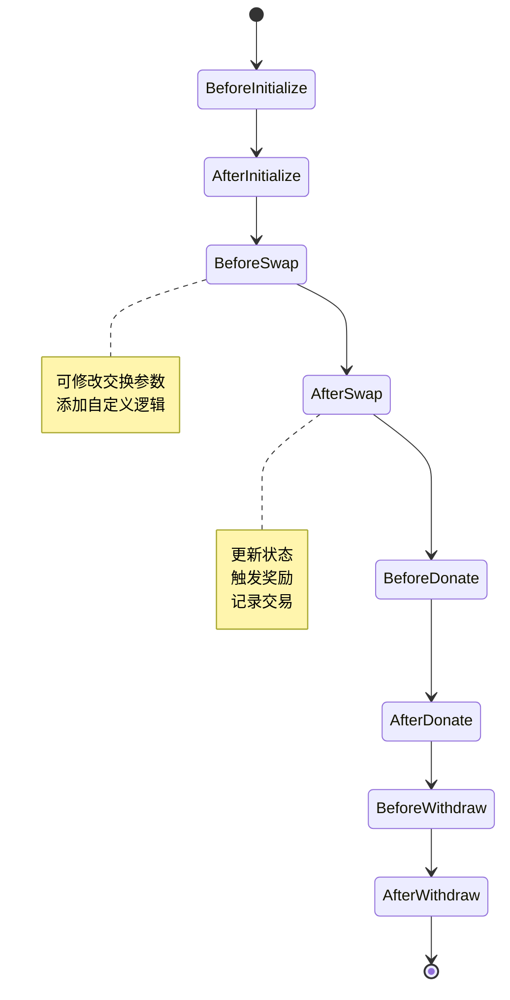
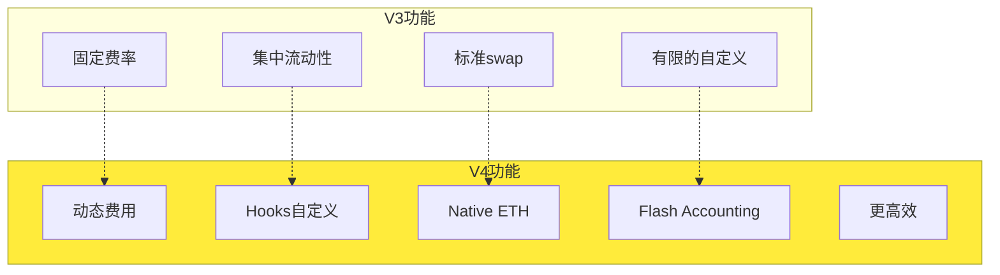
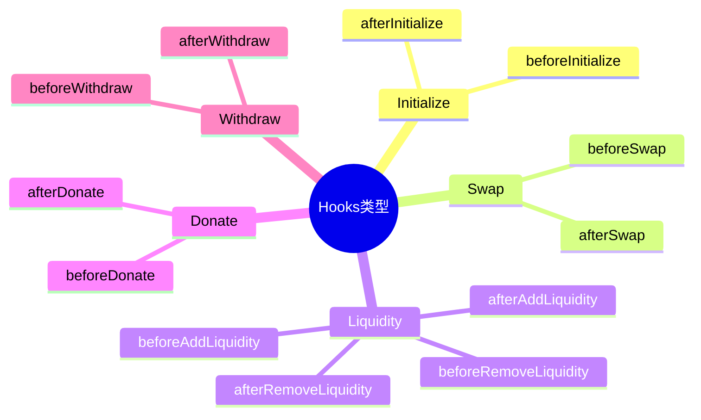

# 死磕PancakeSwap V4 系列文章

> 深入剖析PancakeSwap V4的革命性创新、Hooks机制与数学原理

## 系列概述

本系列共8篇文章，从基础概念到高级数学推导，全面解析PancakeSwap V4的设计实现，特别注重Hooks机制和数学公式的推导过程。


## 文章目录

| 序号 | 标题 | 核心内容 | 难度 |
|:----:|------|----------|:----:|
| 01 | [V4架构与核心创新](./01-V4架构与核心创新.md) | Singleton、Hooks、Native ETH | ⭐⭐ |
| 02 | [Hooks机制详解](./02-Hooks机制详解.md) | Hooks类型、数学模型、实现原理 | ⭐⭐⭐⭐ |
| 03 | [Singleton架构与Flash Accounting](./03-Singleton架构与FlashAccounting.md) | 存储优化、闪电记账、数学推导 | ⭐⭐⭐⭐⭐ |
| 04 | [费用系统的数学推导](./04-费用系统的数学推导.md) | 动态费用、数学证明、计算实例 | ⭐⭐⭐⭐⭐ |
| 05 | [动态流动性机制](./05-动态流动性机制.md) | JIT流动性、数学建模、优化策略 | ⭐⭐⭐⭐ |
| 06 | [Native ETH与Gas优化](./06-Native-ETH与Gas优化.md) | ETH直接支持、Gas优化数学 | ⭐⭐⭐⭐ |
| 07 | [Hooks实战与最佳实践](./07-Hooks实战与最佳实践.md) | Hooks开发、安全实践、案例分析 | ⭐⭐⭐⭐⭐ |
| 08 | [V3到V4的迁移与升级](./08-V3到V4的迁移与升级.md) | 迁移策略、兼容性、最佳实践 | ⭐⭐⭐ |

## 学习路径

### 入门读者

如果你是DeFi新手，建议按顺序阅读：

1. **第一篇**：了解V4的架构变革和核心创新
2. **第二篇**：深入理解Hooks机制的设计原理
3. **第三篇**：掌握Singleton架构的数学基础

### 中级读者

如果你已有V3开发经验：

1. 重点阅读**第二、三篇**，理解Hooks和Flash Accounting
2. 深入**第四、五篇**，掌握数学推导
3. 学习**第六篇**的Gas优化技巧

### 高级读者

如果你想深入研究：

1. 深入**第二篇**的Hooks数学模型
2. 研究**第三、四篇**的数学推导
3. 实践**第七篇**的Hooks开发
4. 规划**第八篇**的迁移策略

## 核心概念速查

### V4核心创新

| 创新点 | V3 | V4 | 说明 |
|--------|----|----|------|
| **池子架构** | 每个池子独立合约 | Singleton单一合约 | 节省大量gas |
| **自定义能力** | 有限 | Hooks完全可定制 | 最大的创新 |
| **ETH支持** | 需要WETH | Native ETH | 简化操作 |
| **费用结构** | 固定费率 | 动态费用 | 更灵活 |
| **记账系统** | 传统记账 | Flash Accounting | 优化转账 |

### 数学公式速查

```
Flash Accounting余额追踪:
    Δbalance_i = Σ(inputs_i) - Σ(outputs_i) - Δeth_balance

动态费用模型:
    fee(t) = f(σ, V, L, t)

Hooks状态更新:
    S_{t+1} = HookFunction(S_t, Δx, Δy, context)

流动性约束优化:
    maximize:  E[Return] - λ × Variance
    subject to:  L(t) ≥ 0,  ∀t
```

### Hooks生命周期



## V4 vs V3 对比

### 架构差异

| 方面 | V3 | V4 |
|------|----|----|
| **合约数量** | 1个Factory + N个Pool | 1个Singleton合约 |
| **创建成本** | 每个池子独立部署 | 在Singleton中创建 |
| **存储布局** | 每个池子独立存储 | 共享存储池 |
| **Gas成本** | 创建池子 ~2M gas | 创建池子 ~150K gas |
| **自定义能力** | 有限 | Hooks完全可定制 |

### 功能差异



## Hooks机制核心

### Hooks类型



### Hooks数学模型

每个Hook可以被视为一个状态转换函数：

```
S_{t+1} = H(S_t, Δx, Δy, context)

其中：
- S_t: 当前状态
- Δx, Δy: 代币变化量
- context: 上下文信息（价格、流动性等）
- H: Hook函数
```

## Flash Accounting 原理

### 传统记账 vs Flash Accounting


### Flash Accounting数学模型

```
净变化计算:
    Δbalance_i = balance_i^{final} - balance_i^{initial}

结算条件:
    Σ(Δbalance_i × price_i) = 0  （无套利）
    balance_i^{final} ≥ 0  （不能为负）
```

## 配套资源

### 官方资源

- [PancakeSwap V4 Core 源码](https://github.com/pancakeswap/pancake-v4-core)
- [PancakeSwap V4 Hooks 源码](https://github.com/pancakeswap/pancake-v4-hooks)
- [PancakeSwap V4 白皮书](https://docs.pancakeswap.finance/whitepaper-v4)
- [PancakeSwap V4 官方文档](https://docs.pancakeswap.finance/v4)

### 测试网络

- BNB Chain Testnet
- Goerli测试网
- Sepolia测试网

### 学习工具

- [PancakeSwap V4 Hooks IDE](https://ide.pancakeswap.finance/v4)
- [Tenderly](https://tenderly.co/) - 交易模拟
- [Foundry](https://getfoundry.sh/) - 测试框架

## 阅读建议

1. **数学推导**：每篇文章的数学部分都配有详细推导和证明
2. **代码示例**：所有关键概念都有对应的Solidity代码
3. **实战练习**：建议在测试网实践Hooks开发
4. **对比学习**：结合V3知识理解V4的改进

## 为什么要学习V4？

1. **革命性创新**：Hooks机制彻底改变了AMM的可定制性
2. **Gas优化**：Singleton架构大幅降低部署成本
3. **数学深度**：V4引入了更复杂的数学模型
4. **未来趋势**：V4代表了AMM发展的方向
5. **实践价值**：可以构建高度定制化的DEX功能

## 更新日志

- 2024-12：系列文章开始撰写

## 反馈与交流

如有问题或建议，欢迎通过Issue讨论。

---

**Happy Learning! 🚀**
