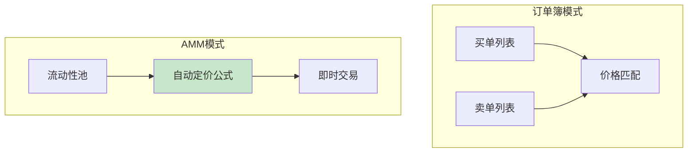
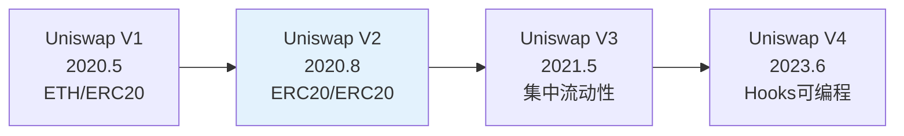
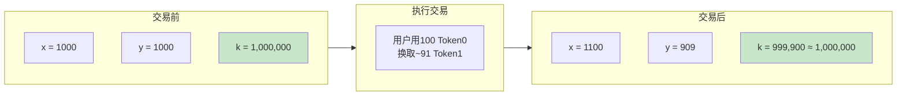
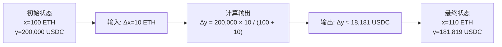
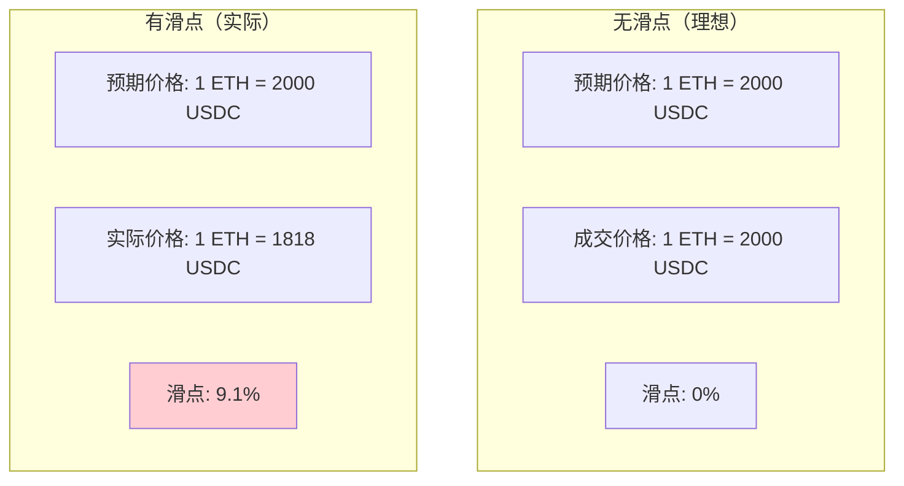
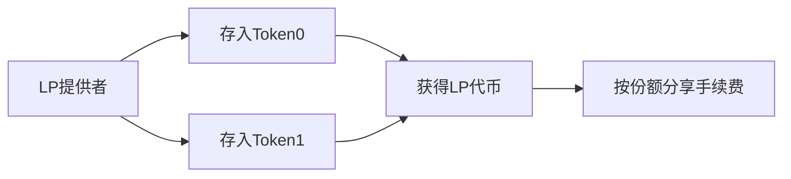
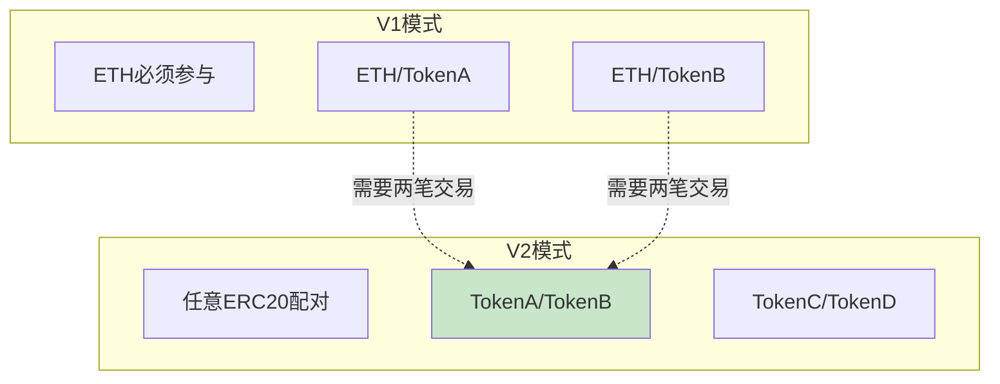
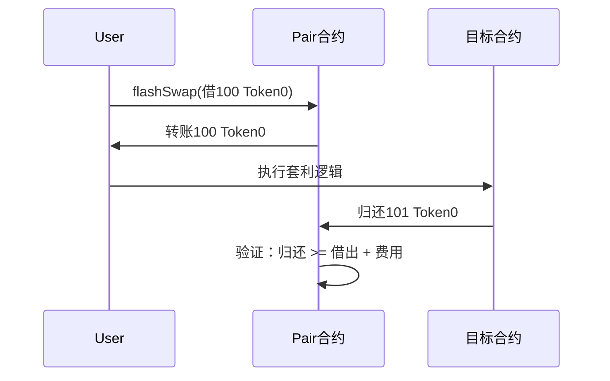
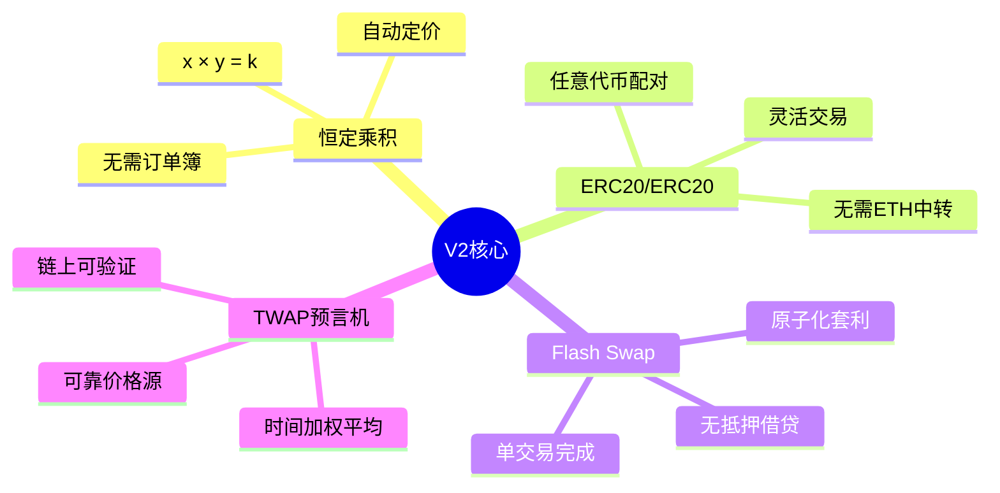

# 死磕Uniswap V2（一）：V2概述与核心原理

> 本文是「死磕Uniswap V2」系列的第一篇，深入剖析V2的核心原理——恒定乘积自动做市商(AMM)机制。

## 系列导航

| 序号 | 标题 | 核心内容 |
|:----:|------|----------|
| **01** | **V2概述与核心原理** | **恒定乘积AMM、核心公式** |
| 02 | Factory与Pair合约 | 合约结构、创建流程 |
| 03 | 流动性与LP代币 | mint/burn、份额计算 |
| 04 | 交换机制深度解析 | swap函数、滑点、Flash Swap |
| 05 | 价格预言机 | TWAP、价格计算 |
| 06 | Router与路由 | 最佳路径、多跳交易 |
| 07 | 安全实践与最佳实践 | 漏洞防护、开发建议 |

---

## 1. AMM技术演进

### 1.1 什么是AMM？

传统交易所采用**订单簿(Order Book)**模式，需要买方和卖方的价格匹配。而AMM(Automated Market Maker)通过**数学公式**自动定价，无需对手盘即可交易。



### 1.2 Uniswap发展历程



---

## 2. 恒定乘积公式

### 2.1 核心公式

Uniswap V2基于**恒定乘积**公式：

```
x × y = k
```

**变量含义：**
- `x`: Token0的储备量
- `y`: Token1的储备量
- `k`: 恒定乘积常数

**核心思想：** 交易前后，两种代币储备量的乘积保持不变。

### 2.2 公式可视化



### 2.3 价格推导

根据恒定乘积公式，代币的相对价格为：

```
P = y / x
```

即：**1个Token0的价值 = y/x个Token1**

**价格弹性：**
- 当x增加时，y减少
- 价格根据供需自动调整
- 提供的流动性越深，滑点越小

---

## 3. 交换公式详解

### 3.1 输入输出计算

假设用户用`Δx`数量的Token0换取Token1：

**输入Token0，输出Token1：**
```
Δy = y × Δx / (x + Δx)
```

**输入Token1，输出Token0：**
```
Δx = x × Δy / (y + Δy)
```

### 3.2 交换示例

**场景：** ETH/USDC池子
- 初始储备：x = 100 ETH，y = 200,000 USDC
- 用户用10 ETH换取USDC



**代码实现：**

```solidity
function getAmountOut(
    uint256 amountIn,
    uint256 reserveIn,
    uint256 reserveOut
) external pure returns (uint256 amountOut) {
    require(amountIn > 0, "Insufficient amount");
    require(reserveIn > 0 && reserveOut > 0, "Insufficient liquidity");

    uint256 amountInWithFee = amountIn * 997; // 扣除0.3%费用
    uint256 numerator = amountInWithFee * reserveOut;
    uint256 denominator = reserveIn * 1000 + amountInWithFee;

    amountOut = numerator / denominator;

    return amountOut;
}
```

---

## 4. 滑点现象

### 4.1 什么是滑点？

**滑点(Slippage)**：实际成交价格与预期价格的差异。



### 4.2 滑点计算

**滑点公式：**
```
滑点 = |预期价格 - 实际价格| / 预期价格 × 100%
```

**滑点的影响因素：**
1. **交易规模** - 交易量越大，滑点越大
2. **池子深度** - 储备越多，滑点越小
3. **储备比例** - 储备比例越均衡，滑点越小

### 4.3 滑点保护代码

```solidity
function swap(
    uint256 amount0Out,
    uint256 amount1Out,
    address to,
    bytes calldata data
) external {
    // ... 省略部分代码

    // 滑点保护
    require(amount0Out > 0 || amount1Out > 0, "Insufficient output amount");

    if (amount0Out == 0) {
        uint256 amount1In = msg.value;
        require(
            getAmountOut(amount1In, reserve1, reserve0) >= amount1Out,
            "UniswapV2: INSUFFICIENT_LIQUIDITY"
        );
    }
}
```

---

## 5. 流动性提供机制

### 5.1 LP(流动性提供者)角色

LP向池子提供两种代币，获得LP代币作为凭证：



### 5.2 LP代币计算

**LP代币数量：**
```
amountLP = min(amount0 / reserve0, amount1 / reserve1) × totalSupply
```

**计算逻辑：**
1. 分别计算两种代币的占比
2. 取较小的占比（按比例最小的为准）
3. 乘以当前LP总供应量

### 5.3 代码示例

```solidity
function mint(address to) external lock returns (uint256 liquidity) {
    (uint112 reserve0, uint112 reserve1, ) = getReserves();
    uint256 balance0 = IERC20(token0).balanceOf(address(this));
    uint256 balance1 = IERC20(token1).balanceOf(address(this));

    uint256 amount0 = balance0 - reserve0;
    uint256 amount1 = balance1 - reserve1;

    uint256 _totalSupply = totalSupply;

    if (_totalSupply == 0) {
        // 首次提供流动性
        liquidity = sqrt(amount0 * amount1) - MINIMUM_LIQUIDITY;
    } else {
        // 追加流动性
        liquidity = min(
            amount0 * _totalSupply / reserve0,
            amount1 * _totalSupply / reserve1
        );
    }

    require(liquidity > 0, "Insufficient liquidity minted");

    _mint(to, liquidity);

    emit Mint(msg.sender, to, amount0, amount1, liquidity);
}
```

---

## 6. V2核心特性

### 6.1 ERC20/ERC20交易

V2最大的创新是支持**任意两个ERC20代币**的直接交易：



### 6.2 Flash Swap

**Flash Swap**允许用户无需抵押借出代币进行套利：



**Flash Swap条件：**
1. 在同一个交易内完成
2. 归还数量 >= 借出数量 + 0.3%费用
3. 失败则整个交易回滚

### 6.3 TWAP预言机

V2内置**时间加权平均价格(TWAP)**预言机：

```solidity
// 累积价格
uint256 public price0CumulativeLast;
uint256 public price1CumulativeLast;

// 更新预言机
function _update(
    uint256 balance0,
    uint256 balance1
) private {
    uint32 timeElapsed = block.timestamp - blockTimestampLast;

    if (timeElapsed > 0) {
        uint256 price0 = (reserve1 * 1e18) / reserve0;
        uint256 price1 = (reserve0 * 1e18) / reserve1;

        price0CumulativeLast += price0 * timeElapsed;
        price1CumulativeLast += price1 * timeElapsed;
    }
}
```

---

## 7. V2 vs V1/V3对比

### 7.1 功能对比

| 特性 | V1 | V2 | V3 |
|------|----|----|-----|
| **交易对** | ETH/ERC20 | ERC20/ERC20 | ERC20/ERC20 |
| **流动性** | 均匀分布 | 均匀分布 | 可集中 |
| **费用** | 0.3% | 0.3% | 0.01%-1% |
| **LP代币** | ERC20 | ERC20 | ERC721 |
| **Flash Swap** | ❌ | ✅ | ✅ |
| **预言机** | ❌ | TWAP | TWAP |
| **创建池** | 简单 | 简单 | 复杂 |

### 7.2 适用场景

**Uniswap V2 适合：**
- 标准 ERC20 代币对
- 无需复杂价格管理的场景
- 需要简单可靠的价格预言机
- Flash Swap 套利策略

**Uniswap V3 更适合：**
- 需要资本效率的场景
- 稳定币对（窄区间）
- 需要多级费率
- 专业做市商

---

## 8. 本章小结

### 8.1 核心概念总结



### 8.2 关键公式回顾

| 公式 | 含义 |
|------|------|
| `x × y = k` | 恒定乘积 |
| `P = y/x` | 相对价格 |
| `Δy = y × Δx / (x + Δx)` | 输出计算 |
| `滑点 = \|预期-实际\|/预期` | 滑点计算 |

---

## 下一篇预告

在下一篇文章中，我们将深入探讨**Factory与Pair合约**，包括：
- Factory合约的职责与实现
- Pair合约的创建流程
- 储备量管理机制
- 事件日志设计

---

## 参考资料

- [Uniswap V2 白皮书](https://uniswap.org/whitepaper.pdf)
- [Uniswap V2 Core 源码](https://github.com/Uniswap/v2-core)
- [ERC-20 Token Standard](https://eips.ethereum.org/EIPS/eip-20)
