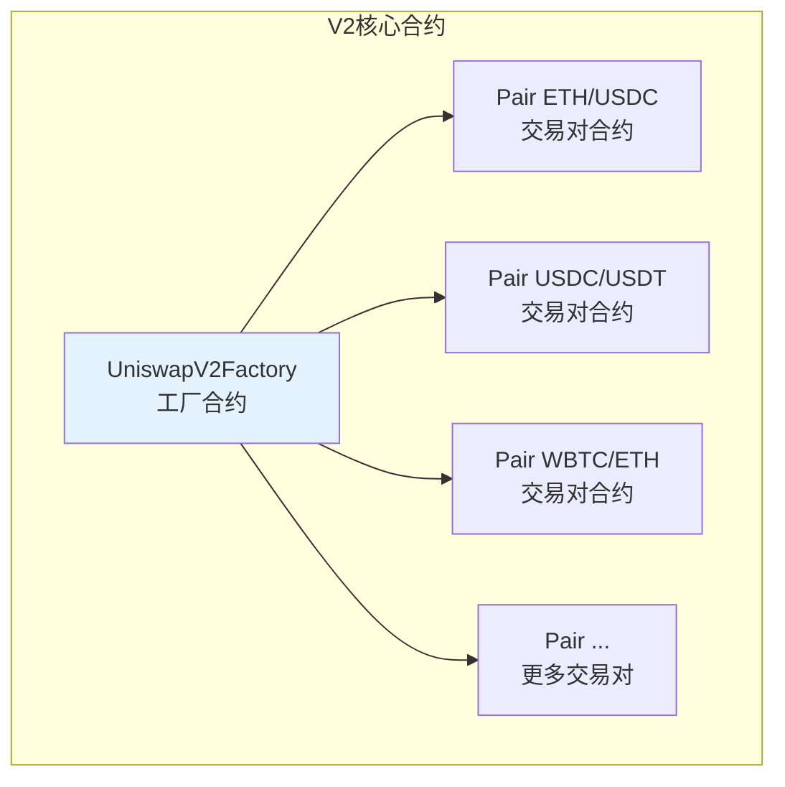
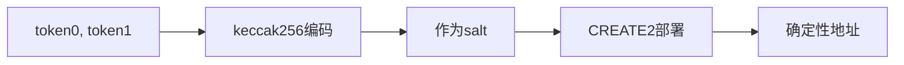
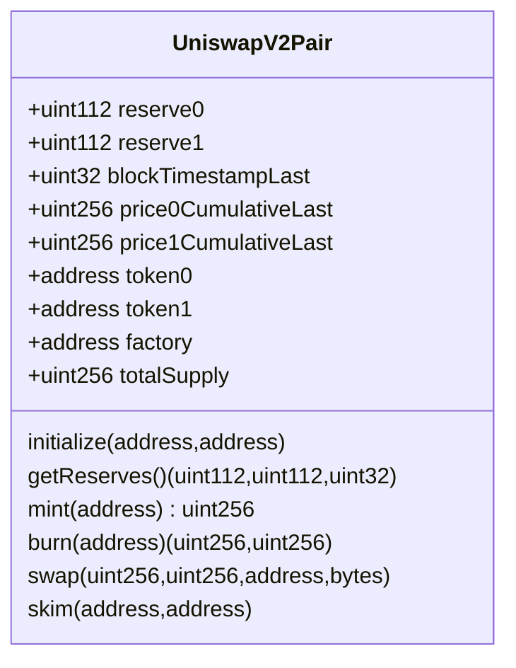
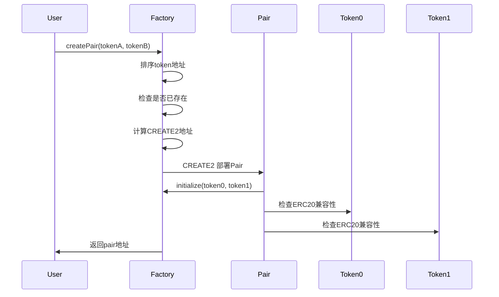
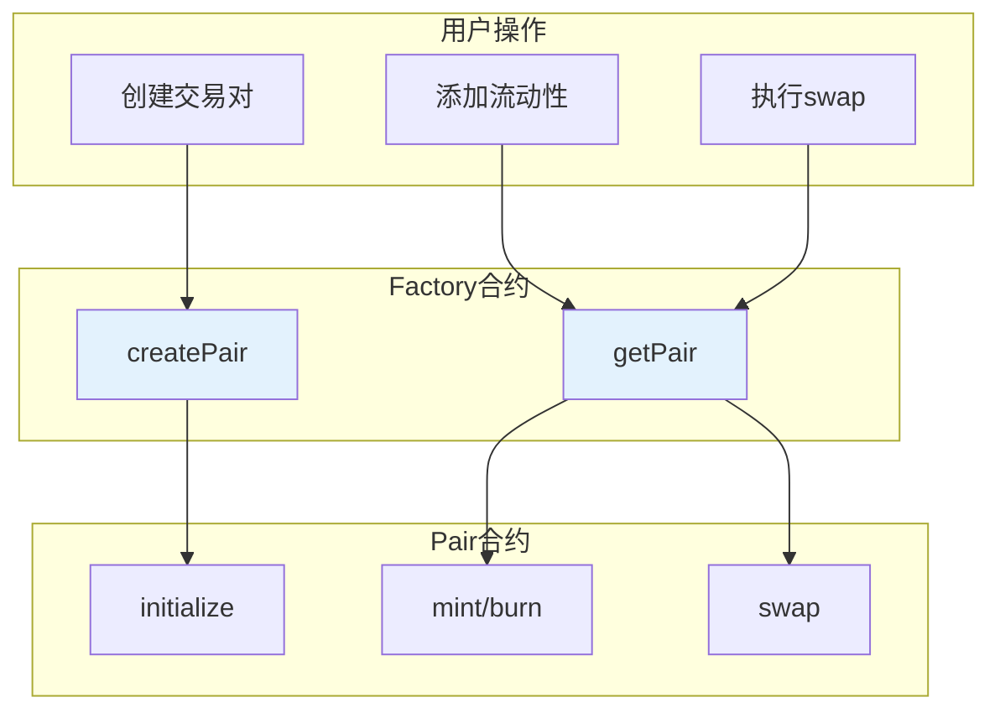
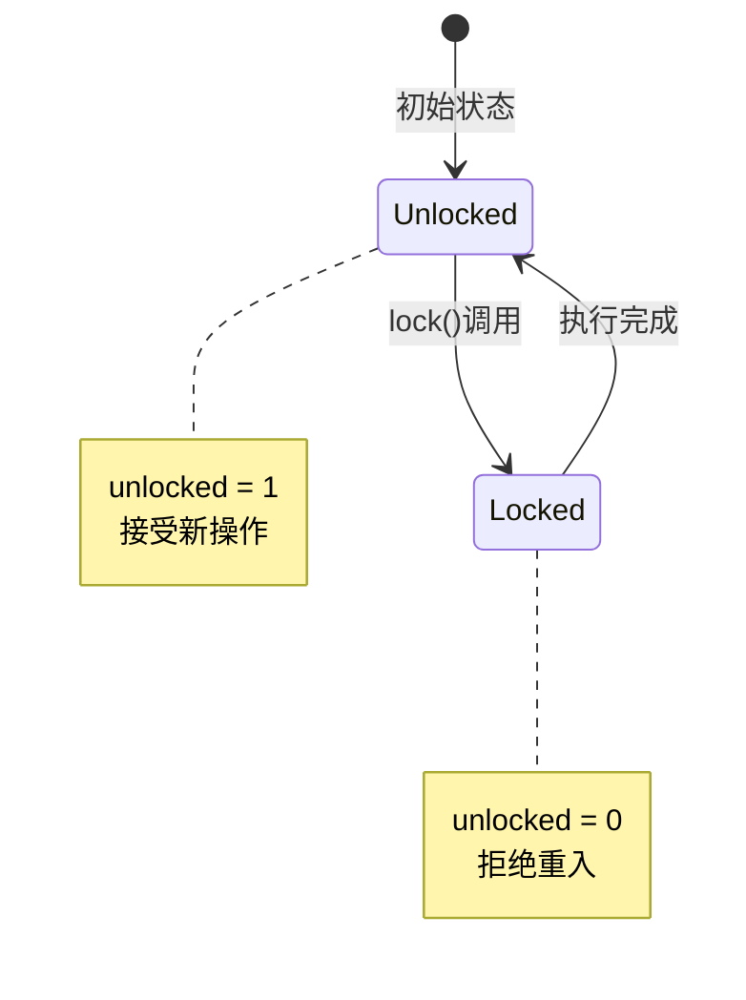
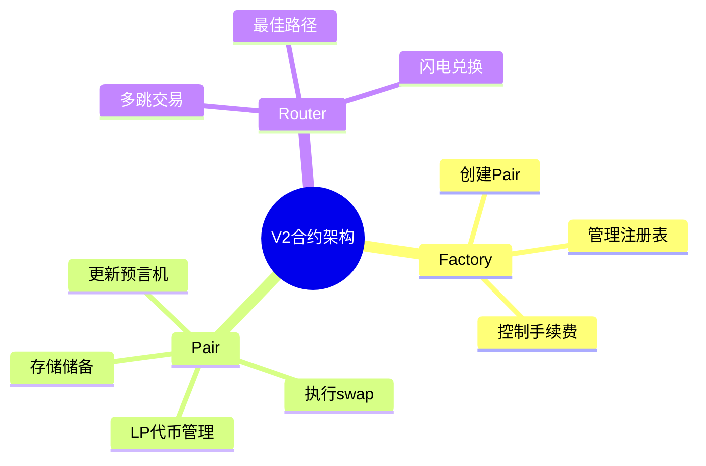

# 死磕Uniswap V2（二）：Factory与Pair合约

> 本文是「死磕Uniswap V2」系列的第二篇，深入剖析V2的Factory和Pair核心合约架构。

## 系列导航

| 序号 | 标题 | 核心内容 |
|:----:|------|----------|
| 01 | V2概述与核心原理 | 恒定乘积AMM、核心公式 |
| **02** | **Factory与Pair合约** | **合约结构、创建流程** |
| 03 | 流动性与LP代币 | mint/burn、份额计算 |
| 04 | 交换机制深度解析 | swap函数、滑点、Flash Swap |
| 05 | 价格预言机 | TWAP、价格计算 |
| 06 | Router与路由 | 最佳路径、多跳交易 |
| 07 | 安全实践与最佳实践 | 漏洞防护、开发建议 |

---

## 1. 合约架构概览

### 1.1 V2核心合约



### 1.2 合约职责划分

| 合约 | 职责 | 主要功能 |
|------|------|----------|
| **Factory** | 交易对工厂 | 创建Pair、管理注册表 |
| **Pair** | 交易对合约 | 存储储备、执行swap、LP管理 |
| **Router** | 路由合约 | 多跳交易、最佳路径 |

---

## 2. Factory合约详解

### 2.1 合约概览

Factory是**工厂合约**，负责创建和管理所有交易对(Pair)。

```solidity
contract UniswapV2Factory is IUniswapV2Factory {
    /// @notice 已创建的Pair地址映射
    mapping(address => mapping(address => address)) public getPair;

    /// @notice 所有Pair地址列表
    address[] public allPairs;

    /// @notice 创建Pair时的手续费开关
    uint256 public feeTo;  // 转开关手续费地址
    uint256 public feeToOn;  // 开关状态

    address public immutable feeToSetter;
}
```

### 2.2 核心功能

#### createPair - 创建交易对

```solidity
function createPair(
    address tokenA,
    address tokenB
) external returns (address pair) {
    // 1. 确保代币地址不同
    require(tokenA != tokenB, "UniswapV2: IDENTICAL_ADDRESSES");

    // 2. 排序token地址（确保一致性）
    (address token0, address token1) = tokenA < tokenB
        ? (tokenA, tokenB)
        : (tokenB, tokenA);

    // 3. 检查Pair是否已存在
    require(getPair[token0][token1] == address(0), "UniswapV2: PAIR_EXISTS");

    // 4. 计算Pair地址（CREATE2确定性）
    bytes32 salt = keccak256(abi.encodePacked(token0, token1));
    pair = address(uint160(uint256(keccak256(
        abi.encodePacked(
            byte(0xff),
            address(this),
            keccak256(abi.encodePacked(type(UniswapV2Pair).creationCode)),
            salt
        )))));

    // 5. 部署Pair合约
    IUniswapV2Pair(pair).initialize(token0, token1);

    // 6. 注册Pair
    getPair[token0][token1] = pair;
    getPair[token1][token0] = pair;
    allPairs.push(pair);

    emit PairCreated(token0, token1, pair, allPairs.length);
}
```

**CREATE2地址计算：**



#### setFeeTo - 设置手续费接收

```solidity
function setFeeTo(address _feeTo) external {
    require(msg.sender == feeToSetter, "UniswapV2: FORBIDDEN");
    feeTo = _feeTo;
    emit SetFeeTo(_feeTo);
}
```

#### setFeeToOn - 开启手续费开关

```solidity
function setFeeToOn(bool _feeToOn) external {
    require(msg.sender == feeToSetter, "UniswapV2: FORBIDDEN");
    feeToOn = _feeToOn;
    emit SetFeeToOn(_feeToOn);
}
```

### 2.3 事件定义

```solidity
event PairCreated(
    address indexed token0,
    address indexed token1,
    address pair,
    uint256 allPairsLength
);

event SetFeeTo(address indexed feeTo);
event SetFeeToOn(bool feeToOn);
```

---

## 3. Pair合约详解

### 3.1 合约结构

```solidity
contract UniswapV2Pair is IUniswapV2Pair, UniswapV2ERC20 {
    /// @notice 恒定乘积储备
    uint112 public reserve0;
    uint112 public reserve1;

    /// @notice 时间戳（用于TWAP）
    uint32 public blockTimestampLast;

    /// @notice 累积价格（用于TWAP）
    uint256 public price0CumulativeLast;
    uint256 public price1CumulativeLast;

    /// @notice 代币地址
    address public immutable token0;
    address public immutable token1;

    /// @notice 工厂地址
    address public immutable factory;

    /// @notice k值
    uint256 private constant MINIMUM_LIQUIDITY = 1000;
}
```

### 3.2 初始化函数

```solidity
function initialize(
    address _token0,
    address _token1
) external {
    require(msg.sender == factory, "UniswapV2: FORBIDDEN");

    // 确保未初始化
    require(token0 == address(0) && token1 == address(0), "UniswapV2: FORBIDDEN");

    token0 = _token0;
    token1 = _token1;

    emit PairInitialized(_token0, _token1);
}
```

### 3.3 储备量管理

```solidity
function _update(
    uint256 balance0,
    uint256 balance1
) private {
    // 1. 记录当前累积价格
    uint32 blockTimestamp = uint32(block.timestamp % 2**32);
    uint32 timeElapsed = blockTimestamp - blockTimestampLast;

    if (timeElapsed > 0 && reserve0 > 0 && reserve1 > 0) {
        // 更新累积价格
        price0CumulativeLast += uint256(
            FixedPoint128.encode(uint112(reserve1).x 64) / uint112(reserve0)
        ) * timeElapsed;

        price1CumulativeLast += uint256(
            FixedPoint128.encode(uint112(reserve0).x 64) / uint112(reserve1)
        ) * timeElapsed;
    }

    // 2. 更新储备量
    reserve0 = uint112(balance0);
    reserve1 = uint112(balance1);
    blockTimestampLast = blockTimestamp;

    emit Sync(reserve0, reserve1);
}
```

### 3.4 数据结构



---

## 4. Pair创建流程

### 4.1 完整流程图



### 4.2 代码流程详解

```solidity
// 用户调用示例
function createNewPair(
    address tokenA,  // USDC
    address tokenB   // USDT
) external returns (address pair) {
    // 1. 获取Factory地址
    address factory = 0x5C69bEe701ef814a2B6a3EDD4B1652CB9cc5aA6f;

    // 2. 调用createPair
    pair = IUniswapV2Factory(factory).createPair(tokenA, tokenB);
}
```

### 4.3 Pair地址计算

**CREATE2公式：**
```
address = keccak256(
    0xff +
    sender_address +
    keccak256(init_code) +
    salt
) mod 2^160
```

**V2的实现：**
- `sender`: Factory合约地址
- `init_code`: Pair合约的创建代码
- `salt`: `keccak256(abi.encodePacked(token0, token1))`

**代码验证：**

```solidity
function calculatePairAddress(
    address factory,
    address token0,
    address token1
) public pure returns (address pair) {
    // 排序
    if (token0 > token1) {
        (token0, token1) = (token1, token0);
    }

    // 计算salt
    bytes32 salt = keccak256(abi.encodePacked(token0, token1));

    // 计算地址
    bytes32 hash = keccak256(
        abi.encodePacked(
            byte(0xff),
            factory,
            keccak256(abi.encodePacked(
                type(UniswapV2Pair).creationCode
            )),
            salt
        )
    );

    return address(uint160(uint256(hash)));
}
```

---

## 5. 合约交互流程

### 5.1 Factory与Pair关系



### 5.2 查询Pair地址

```solidity
function getPairAddress(
    address factory,
    address tokenA,
    address tokenB
) external view returns (address) {
    return IUniswapV2Factory(factory).getPair(tokenA, tokenB);
}

// 或直接调用接口
function getPairAddress(
    address factory,
    address tokenA,
    address tokenB
) external pure returns (address) {
    (address token0, address token1) = tokenA < tokenB
        ? (tokenA, tokenB)
        : (tokenB, tokenA);

    bytes32 salt = keccak256(abi.encodePacked(token0, token1));
    bytes32 hash = keccak256(
        abi.encodePacked(
            byte(0xff),
            factory,
            keccak256(abi.encodePacked(
                type(UniswapV2Pair).creationCode
            )),
            salt
        )
    );

    return address(uint160(uint256(hash)));
}
```

---

## 6. 合约安全机制

### 6.1 访问控制

```solidity
// 仅Factory可调用
modifier onlyFactory() {
    require(msg.sender == factory, "UniswapV2: FORBIDDEN");
    _;
}

// 在initialize中使用
function initialize(address _token0, address _token1) external onlyFactory {
    // ...
}
```

### 6.2 状态一致性

```solidity
// 确保Pair只初始化一次
require(token0 == address(0) && token1 == address(0), "UniswapV2: FORBIDDEN");

// 使用锁机制
uint256 private unlocked = 1;

modifier lock() {
    require(unlocked == 1, "LOCKED");
    unlocked = 0;
    _;
    unlocked = 1;
}
```

### 6.3 重入保护



---

## 7. 实战示例

### 7.1 创建交易对

```solidity
// SPDX-License-Identifier: MIT
pragma solidity ^0.8.0;

import "@uniswap/v2-core/contracts/interfaces/IUniswapV2Factory.sol";

contract PairCreator {
    IUniswapV2Factory public immutable factory;

    constructor(address _factory) {
        factory = IUniswapV2Factory(_factory);
    }

    function createAndInitPair(
        address tokenA,
        address tokenB
    ) external returns (address pair) {
        // 创建Pair
        pair = factory.createPair(tokenA, tokenB);

        emit PairCreated(tokenA, tokenB, pair);
    }

    function getPairAddress(
        address tokenA,
        address tokenB
    ) external view returns (address) {
        return factory.getPair(tokenA, tokenB);
    }
}
```

### 7.2 查询所有Pair

```solidity
function getAllPairs(
    address factory
) external view returns (address[] memory) {
    uint256 length = IUniswapV2Factory(factory).allPairsLength();
    address[] memory pairs = new address[](length);

    for (uint256 i = 0; i < length; i++) {
        pairs[i] = IUniswapV2Factory(factory).allPairs(i);
    }

    return pairs;
}
```

---

## 8. 本章小结

### 8.1 合约架构总结



### 8.2 关键函数回顾

| 合约 | 函数 | 功能 |
|------|------|------|
| Factory | `createPair()` | 创建交易对 |
| Factory | `getPair()` | 查询Pair地址 |
| Factory | `setFeeTo()` | 设置手续费接收 |
| Pair | `initialize()` | 初始化交易对 |
| Pair | `getReserves()` | 获取储备量 |
| Pair | `_update()` | 更新储备和预言机 |

---

## 下一篇预告

在下一篇文章中，我们将深入探讨**流动性与LP代币**，包括：
- mint/burn函数详解
- LP份额计算机制
- 流动性提供与移除
- 手续费分配机制

---

## 参考资料

- [Uniswap V2 Core - UniswapV2Factory.sol](https://github.com/Uniswap/v2-core/blob/main/contracts/UniswapV2Factory.sol)
- [Uniswap V2 Core - UniswapV2Pair.sol](https://github.com/Uniswap/v2-core/blob/main/contracts/UniswapV2Pair.sol)
- [CREATE2 Deterministic Deployment](https://eips.ethereum.org/EIPS/eip-1014)
