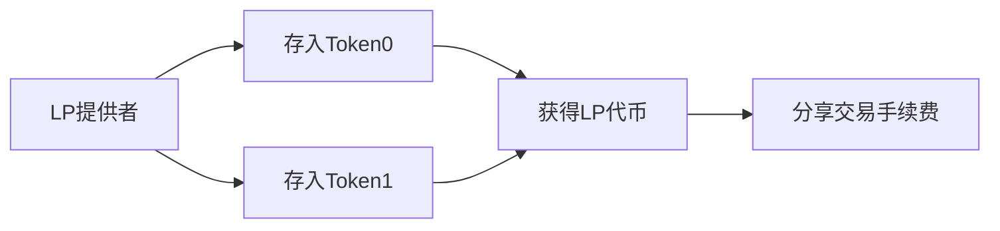
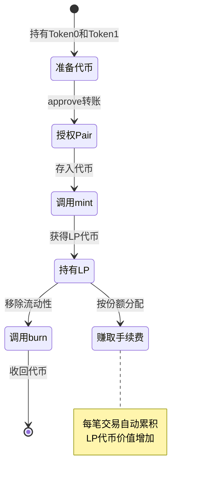
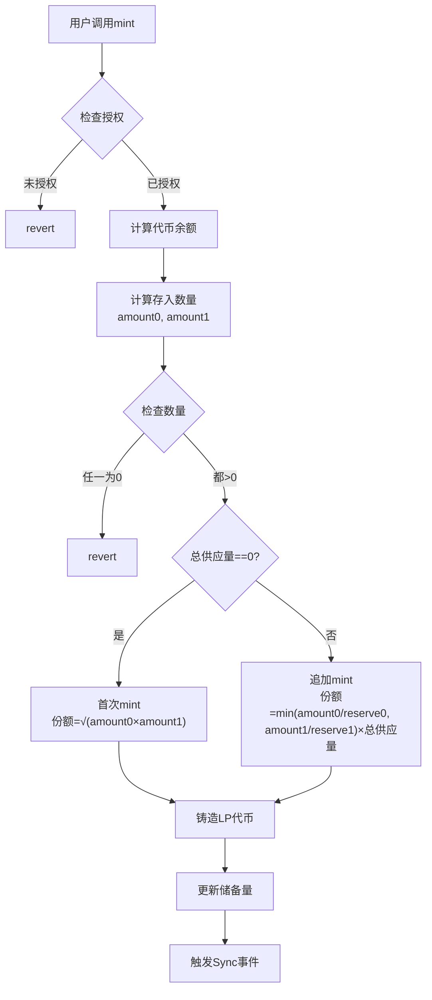
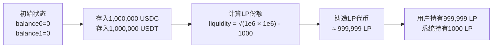
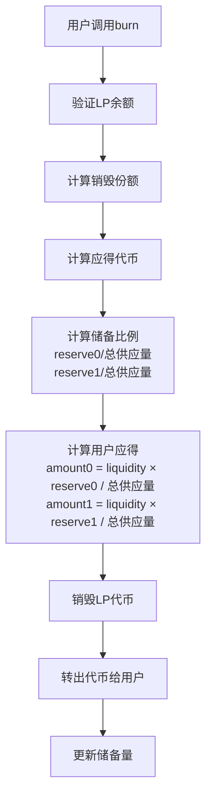
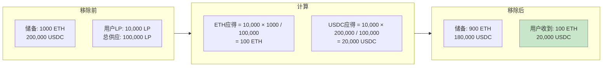
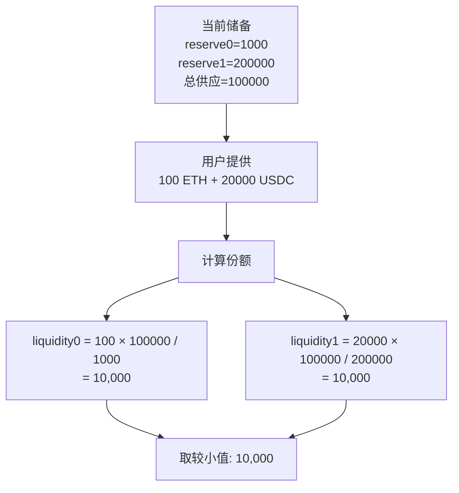
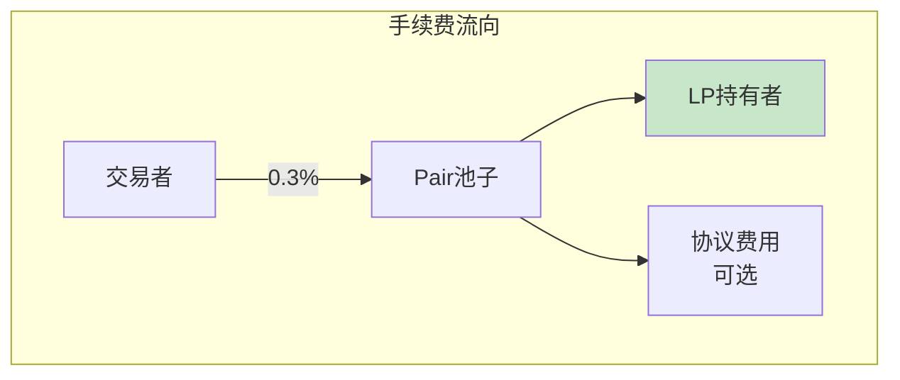
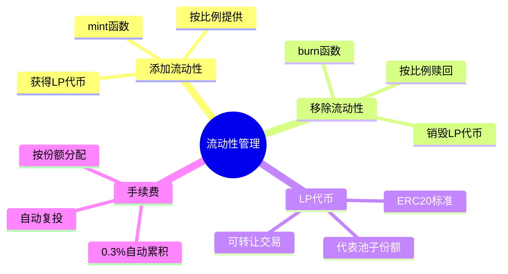

# 死磕Uniswap V2（三）：流动性与LP代币

> 本文是「死磕Uniswap V2」系列的第三篇，深入剖析V2的流动性提供机制和LP代币系统。

## 系列导航

| 序号 | 标题 | 核心内容 |
|:----:|------|----------|
| 01 | V2概述与核心原理 | 恒定乘积AMM、核心公式 |
| 02 | Factory与Pair合约 | 合约结构、创建流程 |
| **03** | **流动性与LP代币** | **mint/burn、份额计算** |
| 04 | 交换机制深度解析 | swap函数、滑点、Flash Swap |
| 05 | 价格预言机 | TWAP、价格计算 |
| 06 | Router与路由 | 最佳路径、多跳交易 |
| 07 | 安全实践与最佳实践 | 漏洞防护、开发建议 |

---

## 1. 流动性提供概述

### 1.1 什么是LP(流动性提供者)？

**LP(Liquidity Provider)**向交易对池子提供两种代币，获得LP代币作为凭证，并按份额分享交易手续费。



### 1.2 流动性提供流程



---

## 2. LP代币详解

### 2.1 UniswapV2ERC20标准

V2的LP代币基于ERC20标准实现：

```solidity
contract UniswapV2ERC20 is IUniswapV2ERC20 {
    string public constant name = "Uniswap V2";
    string public constant symbol = "UNI-V2";
    uint8 public constant decimals = 18;

    /// @notice 总供应量
    uint256 public totalSupply;

    /// @notice 余额映射
    mapping(address => uint256) public balanceOf;

    /// @notice 授权映射
    mapping(address => mapping(address => uint256)) public allowance;
}
```

### 2.2 LP代币与份额的关系

**核心公式：**
```
LP份额 = √(x0 × y0)
```

其中：
- `x0`: 初始Token0数量
- `y0`: 初始Token1数量

**追加流动性：**
```
新份额 = min(Δx/x0, Δy/y0) × 总份额
```

---

## 3. mint函数详解

### 3.1 mint流程图



### 3.2 mint函数代码

```solidity
function mint(address to) external lock returns (uint256 liquidity) {
    // 1. 获取当前储备量
    (uint112 reserve0, uint112 reserve1, ) = getReserves();

    // 2. 获取代币余额
    uint256 balance0 = IERC20(token0).balanceOf(address(this));
    uint256 balance1 = IERC20(token1).balanceOf(address(this));

    // 3. 计算存入数量
    uint256 amount0 = balance0 - reserve0;
    uint256 amount1 = balance1 - reserve1;

    // 4. 计算LP份额
    uint256 _totalSupply = totalSupply;
    if (_totalSupply == 0) {
        // 首次提供流动性
        liquidity = sqrt(amount0 * amount1) - MINIMUM_LIQUIDITY;
        _mint(address(0), MINIMUM_LIQUIDITY); // 永久锁定最小流动性
    } else {
        // 追加流动性
        liquidity = min(
            amount0 * _totalSupply / reserve0,
            amount1 * _totalSupply / reserve1
        );
    }

    require(liquidity > 0, "UniswapV2: INSUFFICIENT_LIQUIDITY_MINTED");

    // 5. 铸造LP代币给接收者
    _mint(to, liquidity);

    // 6. 更新储备量
    _update(balance0, balance1);

    emit Mint(msg.sender, to, amount0, amount1, liquidity);
}
```

### 3.3 首次mint示例

**场景：** 创建USDC/USDT池子



**代码示例：**

```solidity
// SPDX-License-Identifier: MIT
pragma solidity ^0.8.0;

import "@uniswap/v2-periphery/contracts/interfaces/IUniswapV2Router01.sol";

contract LiquidityProvider {
    IUniswapV2Router01 public immutable router;

    function provideLiquidity(
        address pair,
        uint256 amount0Desired,
        uint256 amount1Desired
    ) external {
        // 1. 授权Pair合约
        IERC20(IUniswapV2Pair(pair).token0()).approve(pair, type(uint256).max);
        IERC20(IUniswapV2Pair(pair).token1()).approve(pair, type(uint256).max);

        // 2. 转账代币到Pair
        IERC20(IUniswapV2Pair(pair).token0()).transferFrom(
            msg.sender,
            pair,
            amount0Desired
        );
        IERC20(IUniswapV2Pair(pair).token1()).transferFrom(
            msg.sender,
            pair,
            amount1Desired
        );

        // 3. 调用mint
        IUniswapV2Pair(pair).mint(msg.sender);
    }
}
```

---

## 4. burn函数详解

### 4.1 burn流程图



### 4.2 burn函数代码

```solidity
function burn(address to) external lock returns (
    uint256 amount0,
    uint256 amount1
) {
    // 1. 获取用户LP余额
    uint256 liquidity = balanceOf[address(this)];

    // 2. 获取当前储备量
    (uint112 reserve0, uint112 reserve1, ) = getReserves();
    require(
        reserve0 > 0 && reserve1 > 0,
        "UniswapV2: INSUFFICIENT_LIQUIDITY_BURNED"
    );

    // 3. 计算用户应得代币
    uint256 _totalSupply = totalSupply;

    // amount0 = 用户份额 × Token0储备 / 总份额
    amount0 = liquidity * reserve0 / _totalSupply;

    // amount1 = 用户份额 × Token1储备 / 总份额
    amount1 = liquidity * reserve1 / _totalSupply;

    // 4. 销毁LP代币
    _burn(address(this), liquidity);

    // 5. 转出代币给接收者
    if (amount0 > 0) {
        IERC20(token0).transfer(to, amount0);
    }
    if (amount1 > 0) {
        IERC20(token1).transfer(to, amount1);
    }

    // 6. 更新储备量
    (balance0, balance1, ) = getReserves();
    _update(balance0 - amount0, balance1 - amount1);

    emit Burn(msg.sender, to, amount0, amount1);
}
```

### 4.3 流动性移除示例



---

## 5. 流动性份额计算

### 5.1 首次提供流动性

```solidity
function calculateInitialLiquidity(
    uint256 amount0,
    uint256 amount1
) public pure returns (uint256 liquidity) {
    if (amount0 == 0 || amount1 == 0) {
        return 0;
    }

    // 几何平均数减去最小流动性
    uint256 sqrt = sqrt(amount0 * amount1);
    liquidity = sqrt - MINIMUM_LIQUIDITY;

    return liquidity;
}
```

**示例计算：**

| 输入 | amount0 | amount1 | 计算结果 |
|------|---------|---------|----------|
| USDC/USDT | 1,000,000 | 1,000,000 | `√(1e12) - 1000 ≈ 999,999` |
| ETH/USDC | 10 ETH | 20,000 USDC | `√(2e23) - 1000 ≈ 447,213` |

### 5.2 追加流动性

```solidity
function calculateAdditionalLiquidity(
    uint256 reserve0,
    uint256 reserve1,
    uint256 totalSupply,
    uint256 amount0,
    uint256 amount1
) public pure returns (uint256 liquidity) {
    // 按比例计算
    uint256 liquidity0 = amount0 * totalSupply / reserve0;
    uint256 liquidity1 = amount1 * totalSupply / reserve1;

    // 取较小值（按比例最小的为准）
    liquidity = min(liquidity0, liquidity1);

    return liquidity;
}
```

**示例计算：**



---

## 6. 手续费机制

### 6.1 手续费分配



### 6.2 手续费累积

```solidity
function _update(
    uint256 balance0,
    uint256 balance1
) private {
    // 手续费在swap时自动累积到储备中
    // LP代币的价值自动增长

    // 用户赎回时获得的代币会增加
    // 这包含了本金 + 累积的手续费

    emit Sync(reserve0, reserve1);
}
```

**手续费增长示例：**

```mermaid
gantt
    title LP价值增长（手续费累积）
    dateFormat  HH:mm
    axisFormat  %H:%M

    section 池子状态
    初始储备       :a1, 2023-01-01 00:00, 24h
    第一笔交易     :a1, 2023-01-01 06:00, 12h
    手续费累积     :crit, 2023-01-01 12:00, 48h
    LP价值增长     :a2, 2023-01-03 00:00, 24h
```



---

## 7. 实战示例

### 7.1 完整流动性管理合约

```solidity
// SPDX-License-Identifier: MIT
pragma solidity ^0.8.0;

import "@uniswap/v2-core/contracts/interfaces/IUniswapV2Pair.sol";
import "@uniswap/v2-periphery/contracts/interfaces/IUniswapV2Router02.sol";

contract LiquidityManager {
    IUniswapV2Router02 public immutable router;

    struct LiquidityPosition {
        address pair;
        uint256 liquidity;
        uint256 amount0;
        uint256 amount1;
    }

    mapping(address => LiquidityPosition[]) public positions;

    constructor(address _router) {
        router = IUniswapV2Router02(_router);
    }

    // 添加流动性
    function addLiquidity(
        address token0,
        address token1,
        uint256 amount0Desired,
        uint256 amount1Desired,
        uint256 amount0Min,
        uint256 amount1Min,
        address to
    ) external returns (
        uint256 amount0,
        uint256 amount1,
        uint256 liquidity
    ) {
        // 1. 授权router
        IERC20(token0).approve(address(router), type(uint256).max);
        IERC20(token1).approve(address(router), type(uint256).max);

        // 2. 转账代币
        IERC20(token0).transferFrom(msg.sender, address(this), amount0Desired);
        IERC20(token1).transferFrom(msg.sender, address(this), amount1Desired);

        // 3. 添加流动性
        (amount0, amount1, liquidity) = router.addLiquidity(
            token0,
            token1,
            amount0Desired,
            amount1Desired,
            amount0Min,
            amount1Min,
            to,
            block.timestamp
        );

        // 4. 记录头寸
        address pair = IUniswapV2Factory(router.factory()).getPair(token0, token1);
        positions[msg.sender].push(LiquidityPosition({
            pair: pair,
            liquidity: liquidity,
            amount0: amount0,
            amount1: amount1
        }));

        emit LiquidityAdded(msg.sender, pair, liquidity);
    }

    // 移除流动性
    function removeLiquidity(
        address token0,
        address token1,
        uint256 liquidity,
        uint256 amount0Min,
        uint256 amount1Min,
        address to
    ) external returns (
        uint256 amount0,
        uint256 amount1
    ) {
        // 1. 授权router
        address pair = IUniswapV2Factory(router.factory()).getPair(token0, token1);
        IUniswapV2Pair(pair).approve(address(router), liquidity);

        // 2. 移除流动性
        (amount0, amount1) = router.removeLiquidity(
            token0,
            token1,
            liquidity,
            amount0Min,
            amount1Min,
            to,
            block.timestamp
        );

        emit LiquidityRemoved(msg.sender, pair, liquidity);
    }

    event LiquidityAdded(address indexed user, address indexed pair, uint256 liquidity);
    event LiquidityRemoved(address indexed user, address indexed pair, uint256 liquidity);
}
```

### 7.2 自动复投合约

```solidity
// SPDX-License-Identifier: MIT
pragma solidity ^0.8.0;

import "@uniswap/v2-core/contracts/interfaces/IUniswapV2Pair.sol";

contract AutoCompound {
    IUniswapV2Pair public pair;
    address public owner;

    uint256 public lastCompoundTime;
    uint256 public compoundInterval = 1 days;

    constructor(address _pair) {
        pair = IUniswapV2Pair(_pair);
        owner = msg.sender;
        lastCompoundTime = block.timestamp;
    }

    function compound() external {
        require(msg.sender == owner, "Not owner");
        require(
            block.timestamp >= lastCompoundTime + compoundInterval,
            "Too early"
        );

        // 1. 获取当前LP代币余额
        uint256 liquidity = pair.balanceOf(address(this));

        // 2. 移除流动性
        pair.approve(address(pair), liquidity);
        (uint256 amount0, uint256 amount1) = pair.removeLiquidity(
            liquidity,
            0,
            0,
            address(this),
            block.timestamp
        );

        // 3. 重新添加流动性
        IERC20(pair.token0()).approve(address(pair), amount0);
        IERC20(pair.token1()).approve(address(pair), amount1);
        pair.mint{value: 0}(address(this));

        lastCompoundTime = block.timestamp;

        emit Compounded(liquidity, amount0, amount1);
    }

    event Compounded(
        uint256 liquidity,
        uint256 amount0,
        uint256 amount1
    );
}
```

---

## 8. 本章小结

### 8.1 流动性管理总结



### 8.2 关键函数回顾

| 函数 | 功能 | 公式 |
|------|------|------|
| `mint()` | 添加流动性 | `liquidity = √(amount0 × amount1)` (首次) |
| `burn()` | 移除流动性 | `amount = liquidity × reserve / totalSupply` |
| `getReserves()` | 获取储备量 | 返回reserve0, reserve1, timestamp |
| `_update()` | 更新状态 | 更新储备、预言机 |

---

## 下一篇预告

在下一篇文章中，我们将深入探讨**交换机制深度解析**，包括：
- swap函数完整实现
- 滑点计算与保护
- Flash Swap机制详解
- 交换最佳实践

---

## 参考资料

- [Uniswap V2 Core - UniswapV2Pair.sol](https://github.com/Uniswap/v2-core/blob/main/contracts/UniswapV2Pair.sol)
- [Uniswap V2 Core - UniswapV2ERC20.sol](https://github.com/Uniswap/v2-core/blob/main/contracts/UniswapV2ERC20.sol)
- [ERC-20 Token Standard](https://eips.ethereum.org/EIPS/eip-20)
