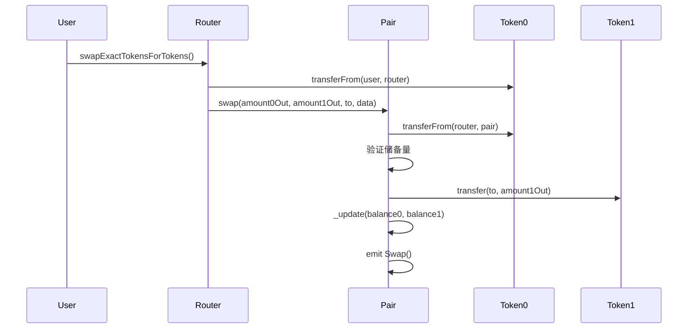
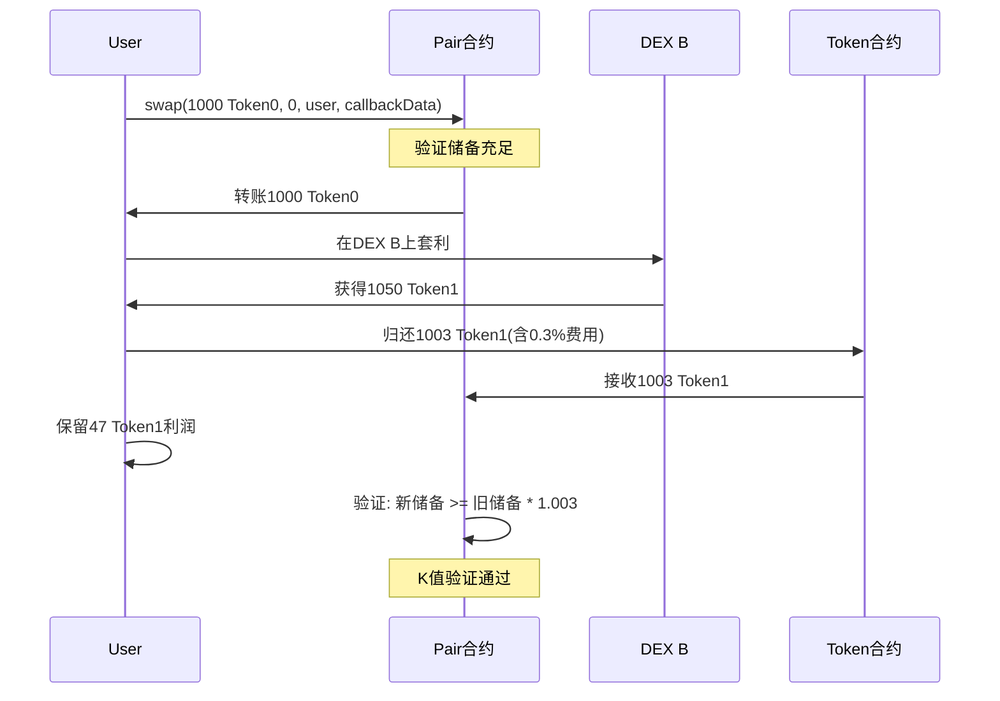
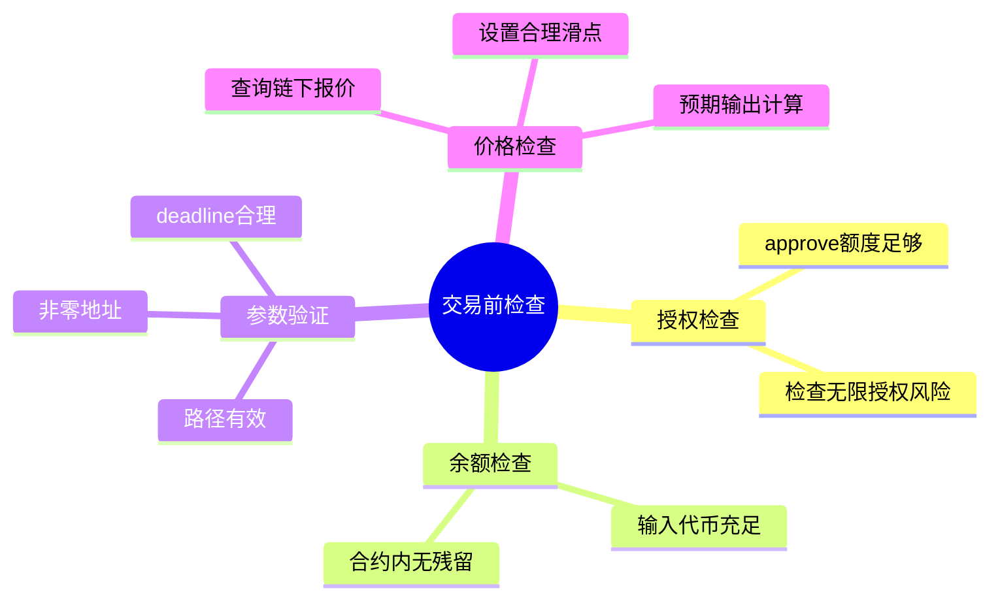
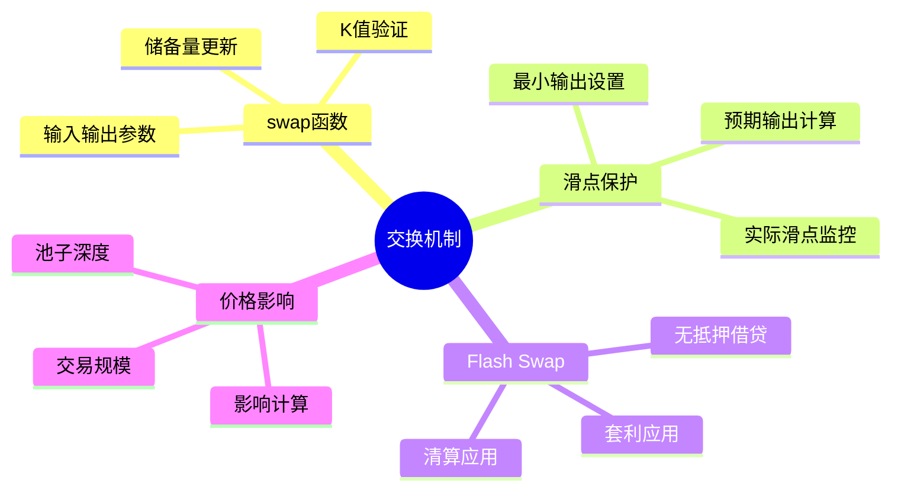

# 死磕Uniswap V2（四）：交换机制深度解析

> 本文是「死磕Uniswap V2」系列的第四篇，深入剖析V2的交换机制，包括swap函数、滑点保护和Flash Swap。

## 系列导航

| 序号 | 标题 | 核心内容 |
|:----:|------|----------|
| 01 | V2概述与核心原理 | 恒定乘积AMM、核心公式 |
| 02 | Factory与Pair合约 | 合约结构、创建流程 |
| 03 | 流动性与LP代币 | mint/burn、份额计算 |
| **04** | **交换机制深度解析** | **swap函数、滑点、Flash Swap** |
| 05 | 价格预言机 | TWAP、价格计算 |
| 06 | Router与路由 | 最佳路径、多跳交易 |
| 07 | 安全实践与最佳实践 | 漏洞防护、开发建议 |

---

## 1. 交换机制概览

### 1.1 swap基本流程



### 1.2 交换类型

```mermaid
graph TB
    subgraph SwapTypes[\"交换类型\"]
        Direct[\"直接交换<br/>TokenA ↔ TokenB\"]
        MultiHop[\"多跳交换<br/>TokenA → ETH → TokenB\"]
        Flash[\"Flash Swap<br/>无抵押借贷\"]
    end

    Direct --> D1[\"单笔交易\"]
    MultiHop --> M1[\"多笔交易\"]
    Flash --> F1[\"原子化完成\"]

    style Direct fill:#e3f2fd
    style MultiHop fill:#fff3e0
    style Flash fill:#f3e5f5
```

---

## 2. swap函数详解

### 2.1 函数签名

```solidity
function swap(
    uint256 amount0Out,
    uint256 amount1Out,
    address to,
    bytes calldata data
) external lock;
```

**参数说明：**
- `amount0Out`: 输出的Token0数量（两者之一必须为0）
- `amount1Out`: 输出的Token1数量（两者之一必须为0）
- `to`: 接收代币的地址
- `data`: Flash Swap回调数据

### 2.2 完整代码

```solidity
function swap(
    uint256 amount0Out,
    uint256 amount1Out,
    address to,
    bytes calldata data
) external lock {
    // 1. 验证输出参数
    require(
        amount0Out > 0 || amount1Out > 0,
        "UniswapV2: INSUFFICIENT_OUTPUT_AMOUNT"
    );
    require(
        amount0Out == 0 || amount1Out == 0,
        "UniswapV2: INVALID_OUTPUT_AMOUNT"
    );

    // 2. 获取当前储备量
    (uint112 reserve0, uint112 reserve1, ) = getReserves();
    require(
        reserve0 > amount0Out && reserve1 > amount1Out,
        "UniswapV2: INSUFFICIENT_LIQUIDITY"
    );

    // 3. 优化：避免堆栈过深
    {
        // 4. 先转出代币（检查-生效模式）
        address token0 = token0;
        address token1 = token1;
        require(
            to != token0 && to != token1,
            "UniswapV2: INVALID_TO"
        );

        if (amount0Out > 0) {
            IERC20(token0).transfer(to, amount0Out);
        }
        if (amount1Out > 0) {
            IERC20(token1).transfer(to, amount1Out);
        }

        // 5. 处理Flash Swap回调
        if (data.length > 0) {
            IUniswapV2Callee(to).uniswapV2Call(
                msg.sender,
                amount0Out,
                amount1Out,
                data
            );
        }
    }

    // 6. 计算实际存入数量
    uint256 balance0 = IERC20(token0).balanceOf(address(this));
    uint256 balance1 = IERC20(token1).balanceOf(address(this));

    uint256 amount0In = balance0 > reserve0 - amount0Out
        ? balance0 - (reserve0 - amount0Out)
        : 0;
    uint256 amount1In = balance1 > reserve1 - amount1Out
        ? balance1 - (reserve1 - amount1Out)
        : 0;

    require(
        amount0In > 0 || amount1In > 0,
        "UniswapV2: INSUFFICIENT_INPUT_AMOUNT"
    );

    // 7. 验证恒定乘积公式（含手续费）
    {
        uint256 balance0Adjusted = balance0 * 1000 - amount0In * 3;
        uint256 balance1Adjusted = balance1 * 1000 - amount1In * 3;
        require(
            balance0Adjusted * balance1Adjusted >= uint256(reserve0) * reserve1 * 1000000,
            "UniswapV2: K"
        );
    }

    // 8. 更新储备量
    _update(balance0, balance1);

    emit Swap(msg.sender, amount0In, amount1In, amount0Out, amount1Out, to);
}
```

### 2.3 交换流程图

```mermaid
flowchart TD
    A[\"调用swap()\"] --> B{检查参数}
    B -->|amount0Out=amount1Out=0| C[\"revert<br/>INSUFFICIENT_OUTPUT_AMOUNT\"]
    B -->|两者都>0| D[\"revert<br/>INVALID_OUTPUT_AMOUNT\"]
    B -->|参数有效| E[\"获取储备量\"]
    E --> F{检查流动性}
    F -->|储备不足| G[\"revert<br/>INSUFFICIENT_LIQUIDITY\"]
    F -->|储备充足| H[\"转出代币给to\"]
    H --> I{data.length>0?}
    I -->|是| J[\"调用回调<br/>uniswapV2Call()\"]
    I -->|否| K[\"跳过回调\"]
    J --> K
    K --> L[\"获取新余额\"]
    L --> M[\"计算实际输入\"]
    M --> N[\"验证K值\"]
    N -->|K值验证失败| O[\"revert<br/>K\"]
    N -->|K值验证通过| P[\"更新储备量\"]
    P --> Q[\"emit Swap事件\"]
```

---

## 3. 交换计算公式

### 3.1 输入输出推导

**恒定乘积公式：**
```
x × y = k
```

**推导过程：**
```
初始状态: x₀ × y₀ = k
交易后:   (x₀ + Δx) × (y₀ - Δy) = k

展开:  x₀y₀ + x₀Δy - y₀Δx - ΔxΔy = k
由于 x₀y₀ = k:
      x₀Δy - y₀Δx - ΔxΔy = 0

整理得输出公式:
Δy = y₀ × Δx / (x₀ + Δx)
```

**考虑0.3%手续费：**
```
Δy = y₀ × (Δx × 0.997) / (x₀ + Δx × 0.997)
```

### 3.2 getAmountOut函数

```solidity
function getAmountOut(
    uint256 amountIn,
    uint256 reserveIn,
    uint256 reserveOut
) external pure returns (uint256 amountOut) {
    require(amountIn > 0, "UniswapV2Library: INSUFFICIENT_INPUT_AMOUNT");
    require(
        reserveIn > 0 && reserveOut > 0,
        "UniswapV2Library: INSUFFICIENT_LIQUIDITY"
    );

    uint256 amountInWithFee = amountIn * 997;
    uint256 numerator = amountInWithFee * reserveOut;
    uint256 denominator = reserveIn * 1000 + amountInWithFee;

    amountOut = numerator / denominator;
}
```

### 3.3 getAmountIn函数

```solidity
function getAmountIn(
    uint256 amountOut,
    uint256 reserveIn,
    uint256 reserveOut
) external pure returns (uint256 amountIn) {
    require(amountOut > 0, "UniswapV2Library: INSUFFICIENT_OUTPUT_AMOUNT");
    require(
        reserveIn > 0 && reserveOut > 0,
        "UniswapV2Library: INSUFFICIENT_LIQUIDITY"
    );

    uint256 numerator = reserveIn * amountOut * 1000;
    uint256 denominator = (reserveOut - amountOut) * 997;

    amountIn = (numerator / denominator) + 1;
}
```

### 3.4 计算示例

```mermaid
flowchart LR
    subgraph Before[\"交易前状态\"]
        X0[\"x₀ = 1000 ETH\"]
        Y0[\"y₀ = 2,000,000 USDC\"]
        K0[\"k = 2×10⁹\"]
    end

    subgraph Trade[\"交易: 用10 ETH换USDC\"]
        Input[\"Δx = 10 ETH\"]
        Calc[\"Δy = 2,000,000 × 9.97 / (1000 + 9.97)\"]
        Output[\"Δy ≈ 19,743 USDC\"]
    end

    subgraph After[\"交易后状态\"]
        X1[\"x₁ = 1010 ETH\"]
        Y1[\"y₁ = 1,980,257 USDC\"]
        K1[\"k ≈ 2×10⁹\"]
    end

    Before --> Trade --> After

    style Output fill:#c8e6c9
```

---

## 4. 滑点保护

### 4.1 滑点概念

```mermaid
graph TB
    subgraph Expected[\"预期交易\"]
        E1[\"输入: 10 ETH\"]
        E2[\"预期输出: 20,000 USDC\"]
        E3[\"预期价格: 1 ETH = 2,000 USDC\"]
    end

    subgraph Actual[\"实际交易\"]
        A1[\"输入: 10 ETH\"]
        A2[\"实际输出: 19,743 USDC\"]
        A3[\"实际价格: 1 ETH = 1,974 USDC\"]
    end

    subgraph Slippage[\"滑点\"]
        S1[\"滑点 = (20000 - 19743) / 20000\"]
        S2[\"滑点 = 1.29%\"]
    end

    Expected --> Actual
    Actual --> Slippage

    style S2 fill:#ffcdd2
```

### 4.2 滑点计算

```solidity
function calculateSlippage(
    uint256 expectedAmount,
    uint256 actualAmount
) external pure returns (uint256 slippageBps) {
    require(expectedAmount > 0, "Expected amount must be > 0");
    require(actualAmount <= expectedAmount, "Actual exceeds expected");

    uint256 diff = expectedAmount - actualAmount;
    slippageBps = (diff * 10000) / expectedAmount; // 基点
}

// 使用示例: 1% = 100 bps, 0.3% = 30 bps
```

### 4.3 最小输出保护

```solidity
function swapWithSlippageProtection(
    uint256 amountIn,
    uint256 amountOutMin,
    address pair,
    address tokenIn,
    address tokenOut,
    address to
) external returns (uint256 amountOut) {
    // 1. 计算预期输出
    (uint256 reserveIn, uint256 reserveOut, ) = IUniswapV2Pair(pair).getReserves();

    uint256 amountOutExpected = getAmountOut(
        amountIn,
        reserveIn,
        reserveOut
    );

    // 2. 验证最小输出
    require(
        amountOutExpected >= amountOutMin,
        "UniswapV2Router: INSUFFICIENT_OUTPUT_AMOUNT"
    );

    // 3. 执行交易
    // ... (实际交易代码)

    return amountOut;
}
```

### 4.4 滑点容忍度设置

```mermaid
graph TB
    subgraph SlippageTolerance[\"滑点容忍度设置\"]
        Conservative[\"保守型<br/>0.1% - 0.3%\"]
        Standard[\"标准型<br/>0.5% - 1%\"]
        Aggressive[\"激进型<br/>1% - 3%\"]
    end

    Conservative --> C1[\"适用: 大额交易<br/>低风险偏好\"]
    Standard --> S1[\"适用: 常规交易<br/>平衡风险\"]
    Aggressive --> A1[\"适用: 小额交易<br/>追求成交\"]

    style Conservative fill:#c8e6c9
    style Standard fill:#fff3e0
    style Aggressive fill:#ffcdd2
```

---

## 5. Flash Swap详解

### 5.1 Flash Swap概念

**Flash Swap**允许用户在**无需提供抵押**的情况下借出池子中的代币，只要在同一笔交易中归还。



### 5.2 Flash Swap类型

```mermaid
graph TB
    subgraph FlashTypes[\"Flash Swap类型\"]
        TokenBorrow[\"借出代币\"]
        Arbitrage[\"套利\"]
        Liquidation[\"清算\"]
        CollateralSwap[\"抵押品置换\"]
    end

    TokenBorrow --> T1[\"无需抵押<br/>单交易内归还\"]
    Arbitrage --> A1[\"价格差异<br/>跨DEX套利\"]
    Liquidation --> L1[\"抵押品不足<br/>触发清算\"]
    CollateralSwap --> C1[\"更换抵押品<br/>无需先赎回\"]
```

### 5.3 Flash Swap代码示例

```solidity
// SPDX-License-Identifier: MIT
pragma solidity ^0.8.0;

import "@uniswap/v2-core/contracts/interfaces/IUniswapV2Pair.sol";
import "@uniswap/v2-core/contracts/interfaces/IUniswapV2Callee.sol";

contract FlashSwapper is IUniswapV2Callee {
    struct FlashParams {
        address pair;          // Uniswap V2 Pair地址
        address tokenBorrow;   // 要借的代币
        address tokenRepay;    // 要还的代币
        uint256 amountBorrow;  // 借的数量
        address targetDex;     // 目标DEX
        bytes targetData;      // 目标DEX调用数据
    }

    function executeFlashSwap(FlashParams calldata params) external {
        // 1. 确定借出哪个token
        uint256 amount0Out = params.tokenBorrow == IUniswapV2Pair(params.pair).token0()
            ? params.amountBorrow
            : 0;
        uint256 amount1Out = params.tokenBorrow == IUniswapV2Pair(params.pair).token1()
            ? params.amountBorrow
            : 0;

        // 2. 编码回调参数
        bytes memory data = abi.encode(params, msg.sender);

        // 3. 调用Pair的swap函数
        IUniswapV2Pair(params.pair).swap(
            amount0Out,
            amount1Out,
            address(this),
            data
        );
    }

    // Uniswap V2回调接口
    function uniswapV2Call(
        address sender,
        uint256 amount0,
        uint256 amount1,
        bytes calldata data
    ) external override {
        // 1. 验证调用者
        FlashParams memory params = abi.decode(data, (FlashParams, address));
        address pair = msg.sender;

        require(pair == params.pair, "Invalid callback");

        uint256 amountBorrowed = amount0 > 0 ? amount0 : amount1;

        // 2. 执行套利逻辑（示例：在另一个DEX交易）
        // ... 这里实现具体的套利逻辑 ...

        // 3. 计算需要归还的数量（本金 + 0.3%费用）
        uint256 amountRepay = (amountBorrowed * 1000) / 997;

        // 4. 授权Pair合约
        IERC20(params.tokenRepay).approve(pair, amountRepay);

        // 5. 确保合约有足够的代币归还
        uint256 balance = IERC20(params.tokenRepay).balanceOf(address(this));
        require(
            balance >= amountRepay,
            "Flash swap failed: insufficient repayment"
        );
    }

    // 接收代币（用于Flash Swap）
    receive() external payable {}
}
```

### 5.4 Flash Swap费用计算

```solidity
// Flash Swap费用 = 借出数量的0.3%
function calculateFlashSwapFee(
    uint256 amountBorrowed
) external pure returns (uint256 fee) {
    // 费用 = amountBorrowed * 0.003
    // 实际归还 = amountBorrowed * 1.003
    fee = (amountBorrowed * 3) / 997; // 由于精度调整
    return amountBorrowed + fee;
}

// 示例：
// 借出 1000 Token0
// 费用 = 1000 * 3 / 997 ≈ 3.009 Token0
// 总归还 = 1003.009 Token0
```

### 5.5 套利示例

```mermaid
flowchart TD
    A[\"发现价格差异<br/>Uniswap: 1 ETH = 2000 USDC<br/>SushiSwap: 1 ETH = 2010 USDC\"] --> B[\"Flash Swap借1000 ETH\"]
    B --> C[\"在Uniswap借出<br/>无需抵押\"]
    C --> D[\"在SushiSwap卖出<br/>1000 ETH → 2,010,000 USDC\"]
    D --> E[\"计算需要归还<br/>1000 × 1.003 = 1003 ETH\"]
    E --> F[\"在SushiSwap买回<br/>1003 ETH → 2,016,030 USDC\"]
    F --> G{检查利润}
    G -->|2,016,030 > 2,010,000| H[\"利润: 6,030 USDC - Gas费用\"]
    G -->|亏损| I[\"交易回滚\"]
```

---

## 6. 价格影响分析

### 6.1 价格影响公式

```
价格影响 = (交易后价格 - 交易前价格) / 交易前价格 × 100%
```

### 6.2 价格影响计算

```solidity
function calculatePriceImpact(
    uint256 amountIn,
    uint256 reserveIn,
    uint256 reserveOut
) external pure returns (uint256 priceImpactBps) {
    // 1. 初始价格
    uint256 initialPrice = (reserveOut * 1e18) / reserveIn;

    // 2. 交易后储备
    uint256 newReserveIn = reserveIn + amountIn;
    uint256 amountOut = getAmountOut(amountIn, reserveIn, reserveOut);
    uint256 newReserveOut = reserveOut - amountOut;

    // 3. 交易后价格
    uint256 finalPrice = (newReserveOut * 1e18) / newReserveIn;

    // 4. 价格影响
    uint256 priceDiff = initialPrice > finalPrice
        ? initialPrice - finalPrice
        : finalPrice - initialPrice;

    priceImpactBps = (priceDiff * 10000) / initialPrice;
}
```

### 6.3 价格影响与交易规模

```mermaid
graph LR
    subgraph PriceImpact[\"价格影响 vs 交易规模\"]
        Small[\"小额交易<br/\"< 池子0.1%<br/>价格影响 < 0.1%\"]
        Medium[\"中等交易<br/>池子0.1%-1%<br/>价格影响 0.1%-1%\"]
        Large[\"大额交易<br/>\" 池子1%<br/>价格影响 \" 1%\"]
    end

    Small --> S1[\"低滑点<br/>适合正常交易\"]
    Medium --> M1[\"中等滑点<br/>注意成本\"]
    Large --> L1[\"高滑点<br/>考虑分批\"]

    style Small fill:#c8e6c9
    style Medium fill:#fff3e0
    style Large fill:#ffcdd2
```

---

## 7. 交换最佳实践

### 7.1 Router合约封装

```solidity
// SPDX-License-Identifier: MIT
pragma solidity ^0.8.0;

import "@uniswap/v2-periphery/contracts/interfaces/IUniswapV2Router02.sol";

contract OptimizedSwapper {
    IUniswapV2Router02 public immutable router;

    constructor(address _router) {
        router = IUniswapV2Router02(_router);
    }

    // 精确输入交换
    function swapExactTokensForTokens(
        uint256 amountIn,
        uint256 amountOutMin,
        address[] calldata path,
        address to,
        uint256 deadline
    ) external returns (uint256[] memory amounts) {
        // 1. 授权Router
        IERC20(path[0]).approve(address(router), amountIn);

        // 2. 转入代币
        IERC20(path[0]).transferFrom(msg.sender, address(this), amountIn);

        // 3. 执行交换
        amounts = router.swapExactTokensForTokens(
            amountIn,
            amountOutMin,
            path,
            to,
            deadline
        );
    }

    // 精确输出交换
    function swapTokensForExactTokens(
        uint256 amountOut,
        uint256 amountInMax,
        address[] calldata path,
        address to,
        uint256 deadline
    ) external returns (uint256[] memory amounts) {
        // 授权最大数量
        IERC20(path[0]).approve(address(router), amountInMax);

        amounts = router.swapTokensForExactTokens(
            amountOut,
            amountInMax,
            path,
            to,
            deadline
        );

        // 退还未使用的代币
        uint256 amountUsed = amounts[0];
        if (amountInMax > amountUsed) {
            IERC20(path[0]).transfer(msg.sender, amountInMax - amountUsed);
        }
    }

    // 支持ETH的交换
    function swapExactETHForTokens(
        uint256 amountOutMin,
        address[] calldata path,
        address to,
        uint256 deadline
    ) external payable returns (uint256[] memory amounts) {
        require(path[0] == router.WETH(), "Invalid path");

        amounts = router.swapExactETHForTokens{value: msg.value}(
            amountOutMin,
            path,
            to,
            deadline
        );
    }

    // 接收ETH
    receive() external payable {}
}
```

### 7.2 多跳路由

```solidity
function findBestPath(
    address tokenIn,
    address tokenOut,
    uint256 amountIn,
    address[] memory pairs
) external view returns (address[] memory bestPath, uint256 bestAmount) {
    // 简化版：直接对
    bestPath = new address[](2);
    bestPath[0] = tokenIn;
    bestPath[1] = tokenOut;
    bestAmount = getAmountOutForPair(tokenIn, tokenOut, amountIn);

    // 检查通过WETH的中转路径
    address weth = router.WETH();

    if (tokenIn != weth && tokenOut != weth) {
        uint256 amountViaWeth = getAmountViaWeth(tokenIn, tokenOut, amountIn);

        if (amountViaWeth > bestAmount) {
            bestPath = new address[](3);
            bestPath[0] = tokenIn;
            bestPath[1] = weth;
            bestPath[2] = tokenOut;
            bestAmount = amountViaWeth;
        }
    }
}
```

### 7.3 交换失败处理

```solidity
function safeSwap(
    uint256 amountIn,
    uint256 amountOutMin,
    address[] calldata path,
    address to,
    uint256 deadline
) external returns (bool success, uint256 amountOut) {
    try router.swapExactTokensForTokens(
        amountIn,
        amountOutMin,
        path,
        to,
        deadline
    ) returns (uint256[] memory amounts) {
        success = true;
        amountOut = amounts[amounts.length - 1];
    catch {
        success = false;
        amountOut = 0;

        // 退还输入代币
        IERC20(path[0]).transfer(msg.sender, amountIn);
    }
}
```

---

## 8. 交换安全检查清单

### 8.1 交易前检查



### 8.2 交易后验证

```solidity
event SwapExecuted(
    address indexed user,
    address indexed tokenIn,
    address indexed tokenOut,
    uint256 amountIn,
    uint256 amountOut,
    uint256 slippage
);

function swapWithVerification(
    uint256 amountIn,
    uint256 amountOutMin,
    address[] calldata path,
    address to,
    uint256 deadline
) external returns (uint256 amountOut) {
    // 1. 记录初始余额
    uint256 initialBalance = IERC20(path[path.length - 1]).balanceOf(to);

    // 2. 执行交换
    uint256[] memory amounts = router.swapExactTokensForTokens(
        amountIn,
        amountOutMin,
        path,
        to,
        deadline
    );

    amountOut = amounts[amounts.length - 1];

    // 3. 验证最终余额
    uint256 finalBalance = IERC20(path[path.length - 1]).balanceOf(to);
    require(finalBalance >= initialBalance + amountOut, "Balance mismatch");

    // 4. 计算实际滑点
    uint256 expectedAmount = getAmountOut(
        amountIn,
        getReserve(path[0], path[1]).reserve0,
        getReserve(path[0], path[1]).reserve1
    );
    uint256 actualSlippage = expectedAmount > amountOut
        ? ((expectedAmount - amountOut) * 10000) / expectedAmount
        : 0;

    emit SwapExecuted(msg.sender, path[0], path[path.length - 1], amountIn, amountOut, actualSlippage);
}
```

---

## 9. 本章小结

### 9.1 交换机制总结



### 9.2 关键函数回顾

| 函数 | 功能 | 关键点 |
|------|------|--------|
| `swap()` | 执行交换 | K值验证、先输出后输入 |
| `getAmountOut()` | 计算输出 | 含0.3%手续费 |
| `getAmountIn()` | 计算输入 | 反向计算，需+1 |
| `uniswapV2Call()` | Flash Swap回调 | 同交易内归还 |

---

## 下一篇预告

在下一篇文章中，我们将深入探讨**价格预言机**，包括：
- TWAP原理与实现
- 价格累积机制
- 防操纵策略
- 预言机集成最佳实践

---

## 参考资料

- [Uniswap V2 Core - UniswapV2Pair.sol](https://github.com/Uniswap/v2-core/blob/main/contracts/UniswapV2Pair.sol)
- [Uniswap V2 Periphery - UniswapV2Router02.sol](https://github.com/Uniswap/v2-periphery/blob/main/contracts/UniswapV2Router02.sol)
- [Flash Swaps Explained](https://uniswap.org/docs/v2/smart-contracts/integration/flash-swaps/)
