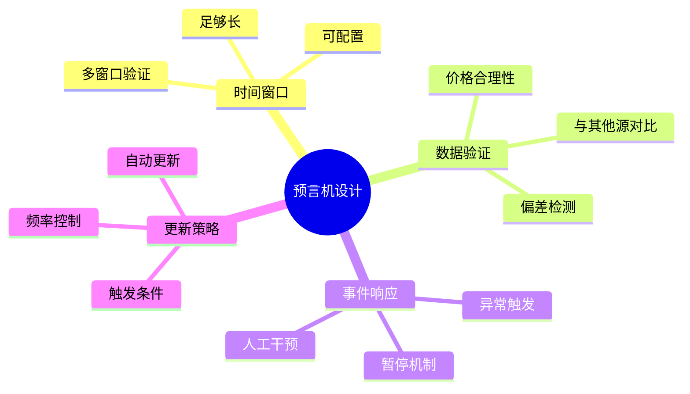
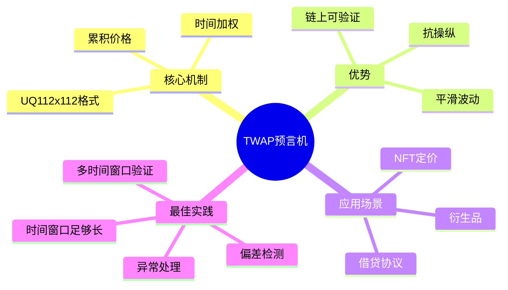

# 死磕Uniswap V2（五）：价格预言机

> 本文是「死磕Uniswap V2」系列的第五篇，深入剖析V2的TWAP预言机机制。

## 系列导航

| 序号 | 标题 | 核心内容 |
|:----:|------|----------|
| 01 | V2概述与核心原理 | 恒定乘积AMM、核心公式 |
| 02 | Factory与Pair合约 | 合约结构、创建流程 |
| 03 | 流动性与LP代币 | mint/burn、份额计算 |
| 04 | 交换机制深度解析 | swap函数、滑点、Flash Swap |
| **05** | **价格预言机** | **TWAP、价格计算** |
| 06 | Router与路由 | 最佳路径、多跳交易 |
| 07 | 安全实践与最佳实践 | 漏洞防护、开发建议 |

---

## 1. 预言机概览

### 1.1 什么是TWAP？

**TWAP (Time-Weighted Average Price)** 即时间加权平均价格，通过累积价格随时间的变化来计算平均价格。

```mermaid
graph LR
    subgraph SpotPrice[\"即时价格\"]
        S1[\"t1: 1000\"]
        S2[\"t2: 1050\"]
        S3[\"t3: 1025\"]
    end

    subgraph TWAP[\"时间加权平均\"]
        T1[\"按时间加权\"]
        T2[\"累积计算\"]
        T3[\"平滑波动\"]
    end

    subgraph Result[\"结果\"]
        R1[\"可操纵性低\"]
        R2[\"价格更可靠\"]
    end

    SpotPrice --> TWAP --> Result

    style R1 fill:#c8e6c9
    style R2 fill:#c8e6c9
```

### 1.2 为什么需要TWAP？

```mermaid
graph TB
    subgraph Problems[\"即时价格的问题\"]
        P1[\"易于操纵\"]
        P2[\"波动性大\"]
        P3[\"时效性短\"]
    end

    subgraph Solutions[\"TWAP的优势\"]
        S1[\"抗操纵\"]
        S2[\"平滑价格\"]
        S3[\"历史追溯\"]
    end

    Problems --> Solutions

    style Solutions fill:#c8e6c9
```

### 1.3 TWAP vs 其他预言机

| 预言机类型 | 优点 | 缺点 | 适用场景 |
|-----------|------|------|----------|
| **即时价格** | 实时、简单 | 易操纵、波动大 | 快速交易 |
| **TWAP** | 抗操纵、可靠 | 有延迟 | 一般价格查询 |
| **MA (移动平均)** | 平滑 | 滞后明显 | 趋势分析 |
| **EMA (指数移动)** | 反应快 | 仍可操纵 | 短期趋势 |
| **外部预言机** | 权威 | 依赖第三方 | 关键价格 |

---

## 2. 累积价格机制

### 2.1 核心变量

```solidity
contract UniswapV2Pair {
    /// @notice 上一次更新的区块时间戳
    uint32 public blockTimestampLast;

    /// @notice Token0的累积价格 (reserve1/reserve0)
    uint256 public price0CumulativeLast;

    /// @notice Token1的累积价格 (reserve0/reserve1)
    uint256 public price1CumulativeLast;
}
```

### 2.2 累积价格公式

```
price0Cumulative = Σ(price0 × timeElapsed)
                  = Σ((reserve1 / reserve0) × timeElapsed)

price1Cumulative = Σ(price1 × timeElapsed)
                  = Σ((reserve0 / reserve1) × timeElapsed)
```

其中：
- `price0`: Token0的价格（以Token1计价）
- `price1`: Token1的价格（以Token0计价）
- `timeElapsed`: 距上次更新的时间差

### 2.3 _update函数中的价格累积

```solidity
function _update(
    uint256 balance0,
    uint256 balance1
) private {
    // 1. 获取当前时间戳
    uint32 blockTimestamp = uint32(block.timestamp % 2**32);
    uint32 timeElapsed = blockTimestamp - blockTimestampLast;

    // 2. 如果有新交易且有储备，更新累积价格
    if (timeElapsed > 0 && reserve0 > 0 && reserve1 > 0) {
        // price0 = reserve1 / reserve0 (Token0以Token1计价)
        // 乘以2^112转换为UQ112x112格式
        uint256 price0 = (reserve1 * 2**112) / reserve0;
        price0CumulativeLast += price0 * timeElapsed;

        // price1 = reserve0 / reserve1 (Token1以Token0计价)
        uint256 price1 = (reserve0 * 2**112) / reserve1;
        price1CumulativeLast += price1 * timeElapsed;
    }

    // 3. 更新储备和时间戳
    reserve0 = uint112(balance0);
    reserve1 = uint112(balance1);
    blockTimestampLast = blockTimestamp;

    emit Sync(reserve0, reserve1);
}
```

### 2.4 累积价格可视化

```mermaid
gantt
    title 累积价格随时间增长
    dateFormat  HH:mm
    axisFormat  %H:%M

    section 价格累积
    初始: 1000      :a1, 00:00, 5m
    累积1: +500      :a1, 00:05, 5m
    累积2: +480      :a1, 00:10, 5m
    累积3: +520      :a1, 00:15, 5m

    section 累积结果
    price0Cumulative: crit, 00:00, 20m
```



---

## 3. TWAP计算

### 3.1 计算公式

```
TWAP = (priceCumulativeCurrent - priceCumulativePast) / timeDiff
```

**计算步骤：**
1. 记录过去时间点的累积价格
2. 获取当前累积价格
3. 计算差值
4. 除以时间差

### 3.2 预言机合约实现

```solidity
// SPDX-License-Identifier: MIT
pragma solidity ^0.8.0;

import "@uniswap/v2-core/contracts/interfaces/IUniswapV2Pair.sol";

contract UniswapV2TWAPOracle {
    struct Observation {
        uint256 timestamp;
        uint256 price0Cumulative;
        uint256 price1Cumulative;
    }

    mapping(address => Observation[]) public observations;

    uint256 public constant WINDOW_SIZE = 1 hours;

    /// @notice 记录价格观察值
    function observe(
        address pair
    ) external {
        (uint112 reserve0, uint112 reserve1, uint32 blockTimestampLast) =
            IUniswapV2Pair(pair).getReserves();

        uint256 price0Cumulative = IUniswapV2Pair(pair).price0CumulativeLast();
        uint256 price1Cumulative = IUniswapV2Pair(pair).price1CumulativeLast();

        observations[pair].push(Observation({
            timestamp: blockTimestampLast,
            price0Cumulative: price0Cumulative,
            price1Cumulative: price1Cumulative
        }));

        // 限制观察值数量
        if (observations[pair].length > 10) {
            // 移除最旧的观察值
            for (uint i = 0; i < observations[pair].length - 1; i++) {
                observations[pair][i] = observations[pair][i + 1];
            }
            observations[pair].pop();
        }
    }

    /// @notice 计算TWAP
    function consult(
        address pair,
        uint256 period
    ) external view returns (uint256 price0, uint256 price1) {
        require(
            observations[pair].length >= 2,
            "Need at least 2 observations"
        );

        Observation memory oldest = observations[pair][0];
        Observation memory newest = observations[pair][observations[pair].length - 1];

        uint256 timeDiff = newest.timestamp - oldest.timestamp;
        require(timeDiff >= period, "Period not covered");

        // 计算TWAP
        uint256 price0CumulativeDiff = newest.price0Cumulative - oldest.price0Cumulative;
        uint256 price1CumulativeDiff = newest.price1Cumulative - oldest.price1Cumulative;

        // 除以时间差，再除以2^112转换为正常精度
        price0 = (price0CumulativeDiff / timeDiff) >> 112;
        price1 = (price1CumulativeDiff / timeDiff) >> 112;
    }

    /// @notice 获取当前价格（用于比较）
    function spotPrice(
        address pair
    ) external view returns (uint256 price0, uint256 price1) {
        (uint112 reserve0, uint112 reserve1, ) = IUniswapV2Pair(pair).getReserves();
        price0 = (uint256(reserve1) * 1e18) / reserve0;
        price1 = (uint256(reserve0) * 1e18) / reserve1;
    }
}
```

### 3.3 滑动窗口实现

```solidmaid
mermaid
flowchart TD
    A[\"新交易发生\"] --> B[\"更新储备量\"]
    B --> C[\"计算当前价格\"]
    C --> D[\"累积到price0CumulativeLast\"]
    D --> E[\"更新时间戳\"]
    E --> F[\"记录观察值\"]
    F --> G{观察值数量>阈值?}
    G -->|是| H[\"移除最旧观察值\"]
    G -->|否| I[\"保留所有观察值\"]
    H --> J[\"计算TWAP<br/>使用滑动窗口\"]
    I --> J
```

### 3.4 高级TWAP合约

```solidity
// SPDX-License-Identifier: MIT
pragma solidity ^0.8.0;

import "@uniswap/v2-core/contracts/interfaces/IUniswapV2Pair.sol";

contract AdvancedTWAPOracle {
    struct Observation {
        uint256 timestamp;
        uint256 price0Cumulative;
        uint256 price1Cumulative;
        bool initialized;
    }

    uint256 public constant GRANULARITY = 24; // 每小时一个观察值
    uint256 public constant PERIOD = 24 hours; // 24小时TWAP

    mapping(address => Observation[GRANULARITY]) public observations;
    mapping(address => uint256) public observationIndices;

    event Updated(address indexed pair, uint256 price0, uint256 price1);

    /// @notice 更新观察值
    function update(address pair) external {
        Observation[GRANULARITY] storage obsArray = observations[pair];
        uint256 index = observationIndices[pair];
        uint256 lastTimestamp = obsArray[index].timestamp;

        // 需要至少过1小时才更新
        if (lastTimestamp == 0 || block.timestamp - lastTimestamp >= 1 hours) {
            (, , uint32 blockTimestampLast) = IUniswapV2Pair(pair).getReserves();
            uint256 price0Cumulative = IUniswapV2Pair(pair).price0CumulativeLast();
            uint256 price1Cumulative = IUniswapV2Pair(pair).price1CumulativeLast();

            observations[pair][index] = Observation({
                timestamp: blockTimestampLast,
                price0Cumulative: price0Cumulative,
                price1Cumulative: price1Cumulative,
                initialized: true
            });

            observationIndices[pair] = (index + 1) % GRANULARITY;

            (uint256 price0, uint256 price1) = consult(pair);
            emit Updated(pair, price0, price1);
        }
    }

    /// @notice 查询TWAP价格
    function consult(address pair)
        public
        view
        returns (uint256 price0, uint256 price1)
    {
        Observation[GRANULARITY] storage obsArray = observations[pair];

        uint256 currentIdx = observationIndices[pair];
        uint256 oldestIdx = (currentIdx + 1) % GRANULARITY;

        Observation memory oldest = obsArray[oldestIdx];
        Observation memory newest = obsArray[(currentIdx + GRANULARITY - 1) % GRANULARITY];

        require(oldest.initialized && newest.initialized, "Not enough data");
        require(newest.timestamp > oldest.timestamp, "Invalid timestamps");

        uint256 timeDiff = newest.timestamp - oldest.timestamp;
        require(timeDiff >= PERIOD - 1 hours, "Not enough time passed");

        uint256 price0Diff = newest.price0Cumulative - oldest.price0Cumulative;
        uint256 price1Diff = newest.price1Cumulative - oldest.price1Cumulative;

        // 转换UQ112x112到1e18精度
        price0 = (price0Diff << 112) / timeDiff;
        price1 = (price1Diff << 112) / timeDiff;
    }

    /// @notice 获取即时价格
    function getSpotPrice(address pair)
        external
        view
        returns (uint256 price0, uint256 price1)
    {
        (uint112 reserve0, uint112 reserve1, ) = IUniswapV2Pair(pair).getReserves();
        price0 = (uint256(reserve1) << 112) / reserve0;
        price1 = (uint256(reserve0) << 112) / reserve1;
    }

    /// @notice 计算价格偏差
    function getPriceDeviation(address pair)
        external
        view
        returns (uint256 deviation0Bps, uint256 deviation1Bps)
    {
        (uint256 twapPrice0, uint256 twapPrice1) = consult(pair);
        (uint256 spotPrice0, uint256 spotPrice1) = this.getSpotPrice(pair);

        if (twapPrice0 > spotPrice0) {
            deviation0Bps = ((twapPrice0 - spotPrice0) * 10000) / twapPrice0;
        } else {
            deviation0Bps = ((spotPrice0 - twapPrice0) * 10000) / twapPrice0;
        }

        if (twapPrice1 > spotPrice1) {
            deviation1Bps = ((twapPrice1 - spotPrice1) * 10000) / twapPrice1;
        } else {
            deviation1Bps = ((spotPrice1 - twapPrice1) * 10000) / twapPrice1;
        }
    }
}
```

---

## 4. 价格操纵与防护

### 4.1 价格操纵方式

```mermaid
graph TB
    subgraph Attacks[\"价格操纵攻击\"]
        Flash[\"闪电贷攻击\"]
        Sandwich[\"三明治攻击\"]
        Wash[\"洗盘交易\"]
    end

    subgraph FlashAttack[\"闪电贷攻击流程\"]
        F1[\"借入大量资金\"]
        F2[\"在Pair交易\"]
        F3[\"操纵价格\"]
        F4[\"触发依赖价格的逻辑\"]
        F5[\"归还贷款\"]
    end

    Flash --> FlashAttack

    style FlashAttack fill:#ffcdd2
```

### 4.2 TWAP抗操纵原理

```mermaid
flowchart LR
    A[\"操纵者尝试<br/>瞬间拉高价格\"] --> B[\"累积价格<br/>小幅增加\"]
    B --> C[\"时间很短<br/>t ≈ 0\"]
    C --> D[\"影响很小<br/>Δ ≈ price × 0\"]
    D --> E[\"TWAP几乎不受影响\"]

    style E fill:#c8e6c9
```

**数学证明：**
```
假设操纵者将价格从P操纵到P'(P' >> P)

操纵时间: t (很短，比如几秒)
累积价格增加: (P' - P) × t ≈ P' × t

如果t只有3秒：
影响 = P' × 3 / (总时间 × 平均价格)

如果TWAP周期是1小时(3600秒)：
影响 = P' × 3 / 3600 ≈ 0.0008 × P'

结论: 短暂操纵对TWAP影响微乎其微
```

### 4.3 防护策略

```solidity
contract ProtectedPriceOracle {
    uint256 public constant MIN_PERIOD = 1 hours;
    uint256 public constant MAX_DEVIATION = 300; // 3%

    /// @notice 安全的价格查询
    function safeConsult(
        address pair,
        uint256 minPeriod,
        uint256 maxDeviation
    ) external view returns (uint256 price0, uint256 price1) {
        // 1. 确保时间窗口足够长
        require(minPeriod >= MIN_PERIOD, "Period too short");

        // 2. 获取TWAP价格
        (uint256 twap0, uint256 twap1) = consult(pair, minPeriod);

        // 3. 获取即时价格
        (uint256 spot0, uint256 spot1) = getSpotPrice(pair);

        // 4. 计算偏差
        uint256 deviation0 = calculateDeviation(spot0, twap0);
        uint256 deviation1 = calculateDeviation(spot1, twap1);

        // 5. 偏差过大则拒绝
        require(
            deviation0 <= maxDeviation && deviation1 <= maxDeviation,
            "Price deviation too high"
        );

        return (twap0, twap1);
    }

    function calculateDeviation(
        uint256 spot,
        uint256 twap
    ) internal pure returns (uint256 deviationBps) {
        if (spot > twap) {
            deviationBps = ((spot - twap) * 10000) / twap;
        } else {
            deviationBps = ((twap - spot) * 10000) / twap;
        }
    }
}
```

### 4.4 多时间窗口验证

```solidity
contract MultiWindowOracle {
    /// @notice 使用多个时间窗口验证价格
    function multiWindowConsult(
        address pair
    ) external view returns (
        uint256 price0,
        uint256 price1,
        bool trusted
    ) {
        // 获取不同时间窗口的TWAP
        (uint256 price0_1h, ) = consult(pair, 1 hours);
        (uint256 price0_6h, ) = consult(pair, 6 hours);
        (uint256 price0_24h, ) = consult(pair, 24 hours);

        // 计算各窗口价格的一致性
        uint256 dev1_6 = calculateDeviation(price0_1h, price0_6h);
        uint256 dev6_24 = calculateDeviation(price0_6h, price0_24h);

        // 如果偏差过大，可能被操纵
        trusted = dev1_6 < 100 && dev6_24 < 100; // 1%阈值

        price0 = trusted ? price0_1h : price0_24h; // 使用更安全的价格
        price1 = trusted ? price0_1h : price0_24h;
    }
}
```

---

## 5. 预言机应用场景

### 5.1 借贷协议

```solidity
contract LendingProtocol {
    AdvancedTWAPOracle public oracle;

    mapping(address => uint256) public collateral;
    mapping(address => uint256) public debt;

    uint256 public constant COLLATERAL_RATIO = 150; // 150%

    /// @notice 检查清算
    function checkLiquidation(address user) external {
        // 使用TWAP获取抵押品价格
        (uint256 ethPrice, ) = oracle.consult(wethUsdcPair);

        uint256 collateralValue = (collateral[user] * ethPrice) / 1e18;
        uint256 requiredCollateral = (debt[user] * COLLATERAL_RATIO) / 100;

        if (collateralValue < requiredCollateral) {
            emit Liquidatable(user, collateralValue, requiredCollateral);
        }
    }

    /// @notice 借款（使用TWAP验证）
    function borrow(uint256 amount) external {
        // ... 确保有足够抵押品 ...

        // 使用TWAP而不是即时价格
        (uint256 ethPrice, ) = oracle.consult(wethUsdcPair);
        // ... 借款逻辑 ...
    }

    event Liquidatable(address indexed user, uint256 collateral, uint256 required);
}
```

### 5.2 衍生品交易

```solidity
contract DerivativesExchange {
    AdvancedTWAPOracle public oracle;

    struct Position {
        address trader;
        uint256 size;
        uint256 entryPrice;
        bool isLong;
    }

    mapping(uint256 => Position) public positions;

    /// @notice 计算未实现盈亏
    function getUnrealizedPnL(uint256 positionId)
        external
        view
        returns (int256 pnl)
    {
        Position memory pos = positions[positionId];
        (uint256 currentPrice, ) = oracle.consult(underlyingPair);

        if (pos.isLong) {
            pnl = int256((currentPrice - pos.entryPrice) * pos.size / pos.entryPrice);
        } else {
            pnl = int256((pos.entryPrice - currentPrice) * pos.size / pos.entryPrice);
        }
    }

    /// @notice 平仓
    function closePosition(uint256 positionId) external {
        Position memory pos = positions[positionId];
        require(pos.trader == msg.sender, "Not owner");

        (uint256 exitPrice, ) = oracle.consult(underlyingPair);

        // 计算最终盈亏并结算
        int256 pnl = pos.isLong
            ? int256((exitPrice - pos.entryPrice) * pos.size / pos.entryPrice)
            : int256((pos.entryPrice - exitPrice) * pos.size / pos.entryPrice);

        if (pnl > 0) {
            // 盈利：支付给交易者
            IERC20(usdc).transfer(msg.sender, uint256(pnl));
        }

        delete positions[positionId];
    }
}
```

### 5.3 NFT地板价预言机

```solidity
contract NFTFloorOracle {
    // 使用NFT/ETH池的TWAP作为地板价参考

    function getNFTFloorPrice(
        address nftCollection
    ) external view returns (uint256 floorPrice) {
        // 获取NFT-ETH交易对
        address pair = IUniswapV2Factory(factory).getPair(nftToken, weth);

        if (pair == address(0)) {
            revert("No pool found");
        }

        // 使用24小时TWAP
        (uint256 ethPerNft, ) = oracle.consult(pair, 24 hours);
        uint256 ethPriceUsd = oracle.consult(ethUsdPair, 1 hours);

        // 转换为USD
        floorPrice = (ethPerNft * ethPriceUsd) / 1e18;
    }
}
```

---

## 6. 预言机最佳实践

### 6.1 设计原则



### 6.2 完整预言机合约

```solidity
// SPDX-License-Identifier: MIT
pragma solidity ^0.8.0;

import "@uniswap/v2-core/contracts/interfaces/IUniswapV2Pair.sol";
import "@openzeppelin/contracts/access/Ownable.sol";
import "@openzeppelin/contracts/security/Pausable.sol";

contract RobustOracle is Ownable, Pausable {
    struct PriceData {
        uint256 price;
        uint256 timestamp;
        bool valid;
    }

    struct Config {
        address pair;
        uint256 minPeriod;
        uint256 maxPeriod;
        uint256 maxDeviation;
        bool enabled;
    }

    mapping(address => Config) public configs;
    mapping(address => PriceData) public latestPrices;

    uint256 public constant MAX_DEVIATION_DEFAULT = 500; // 5%
    uint256 public constant MIN_PERIOD_DEFAULT = 1 hours;
    uint256 public constant MAX_PERIOD_DEFAULT = 24 hours;

    event PriceUpdated(
        address indexed token,
        uint256 price,
        uint256 timestamp
    );

    event ConfigUpdated(
        address indexed pair,
        uint256 minPeriod,
        uint256 maxPeriod,
        uint256 maxDeviation
    );

    event PriceAnomaly(
        address indexed pair,
        uint256 twapPrice,
        uint256 spotPrice,
        uint256 deviation
    );

    /// @notice 更新价格
    function updatePrice(address token) external whenNotPaused {
        Config memory config = configs[token];
        require(config.enabled, "Token not enabled");

        // 使用TWAP获取价格
        uint256 price = _getTWAP(
            config.pair,
            config.minPeriod
        );

        // 验证价格
        require(_validatePrice(token, price, config), "Invalid price");

        latestPrices[token] = PriceData({
            price: price,
            timestamp: block.timestamp,
            valid: true
        });

        emit PriceUpdated(token, price, block.timestamp);
    }

    /// @notice 获取价格
    function getPrice(address token)
        external
        view
        returns (uint256 price, uint256 timestamp)
    {
        PriceData memory data = latestPrices[token];
        require(data.valid, "Price not available");
        require(
            block.timestamp - data.timestamp < 1 hours,
            "Price stale"
        );

        return (data.price, data.timestamp);
    }

    /// @notice 获取TWAP
    function _getTWAP(
        address pair,
        uint256 period
    ) internal view returns (uint256 price) {
        // 实现TWAP计算
        (, , uint32 blockTimestampLast) = IUniswapV2Pair(pair).getReserves();
        uint256 price0Cumulative = IUniswapV2Pair(pair).price0CumulativeLast();

        // 这里需要历史观察值，简化实现
        price = price0Cumulative >> 112;
    }

    /// @notice 验证价格
    function _validatePrice(
        address token,
        uint256 newPrice,
        Config memory config
    ) internal view returns (bool) {
        PriceData memory oldData = latestPrices[token];

        // 如果没有历史价格，接受
        if (!oldData.valid) {
            return true;
        }

        // 计算价格变化
        uint256 deviation;
        if (newPrice > oldData.price) {
            deviation = ((newPrice - oldData.price) * 10000) / oldData.price;
        } else {
            deviation = ((oldData.price - newPrice) * 10000) / oldData.price;
        }

        // 检查偏差
        if (deviation > config.maxDeviation) {
            // 可选：emit anomaly event
            return false;
        }

        return true;
    }

    /// @notice 配置预言机
    function setConfig(
        address token,
        address pair,
        uint256 minPeriod,
        uint256 maxPeriod,
        uint256 maxDeviation
    ) external onlyOwner {
        require(pair != address(0), "Invalid pair");
        require(minPeriod >= MIN_PERIOD_DEFAULT, "Min period too short");
        require(maxPeriod <= MAX_PERIOD_DEFAULT, "Max period too long");
        require(maxDeviation <= 1000, "Max deviation too high"); // 10%

        configs[token] = Config({
            pair: pair,
            minPeriod: minPeriod,
            maxPeriod: maxPeriod,
            maxDeviation: maxDeviation,
            enabled: true
        });

        emit ConfigUpdated(token, minPeriod, maxPeriod, maxDeviation);
    }

    /// @notice 暂停预言机
    function pause() external onlyOwner {
        _pause();
    }

    /// @notice 恢复预言机
    function unpause() external onlyOwner {
        _unpause();
    }
}
```

---

## 7. 本章小结

### 7.1 TWAP总结



### 7.2 关键公式回顾

| 公式 | 含义 |
|------|------|
| `priceCumulative += (reserve1/reserve0) × timeElapsed` | 累积价格 |
| `TWAP = (current - past) / timeDiff` | TWAP计算 |
| `deviation = \|spot - twap\| / twap` | 价格偏差 |

---

## 下一篇预告

在下一篇文章中，我们将深入探讨**Router与路由**，包括：
- Router合约架构
- 多跳交易机制
- 最佳路径算法
- 路由最佳实践

---

## 参考资料

- [Uniswap V2 Whitepaper - Oracles](https://uniswap.org/whitepaper.pdf)
- [Uniswap V2 Core - UniswapV2Pair.sol](https://github.com/Uniswap/v2-core/blob/main/contracts/UniswapV2Pair.sol)
- [TWAP Best Practices](https://uniswap.org/docs/v2/smart-contracts/integration/oracles/)
