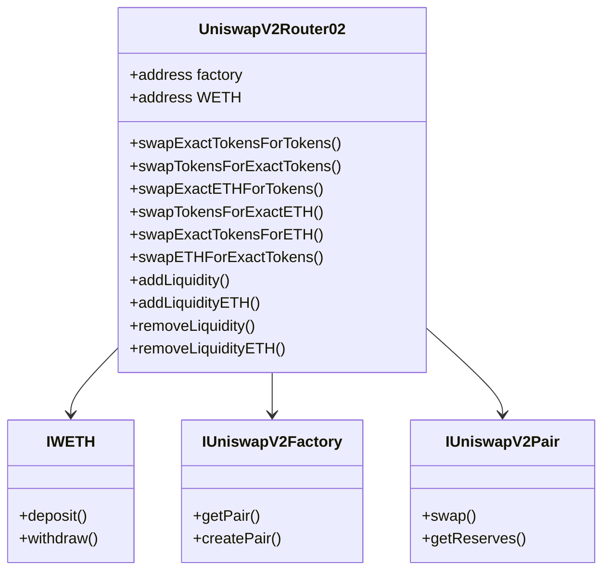
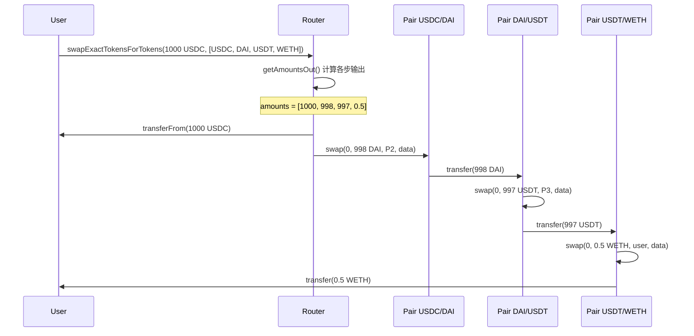
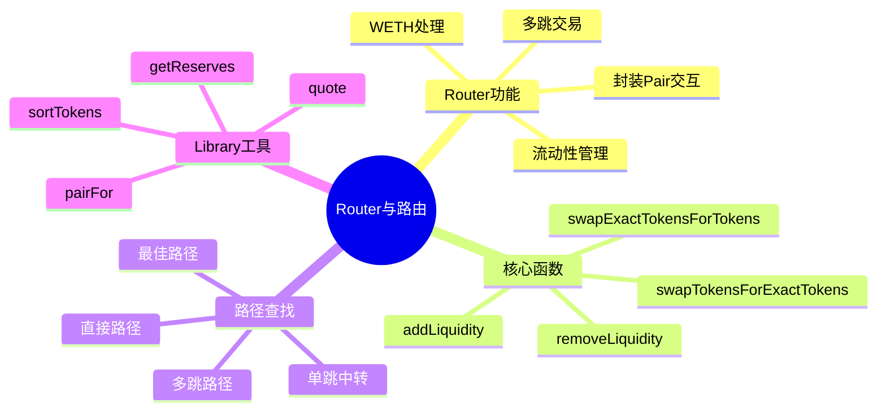

# 死磕Uniswap V2（六）：Router与路由

> 本文是「死磕Uniswap V2」系列的第六篇，深入剖析V2的Router合约与路由机制。

## 系列导航

| 序号 | 标题 | 核心内容 |
|:----:|------|----------|
| 01 | V2概述与核心原理 | 恒定乘积AMM、核心公式 |
| 02 | Factory与Pair合约 | 合约结构、创建流程 |
| 03 | 流动性与LP代币 | mint/burn、份额计算 |
| 04 | 交换机制深度解析 | swap函数、滑点、Flash Swap |
| 05 | 价格预言机 | TWAP、价格计算 |
| **06** | **Router与路由** | **最佳路径、多跳交易** |
| 07 | 安全实践与最佳实践 | 漏洞防护、开发建议 |

---

## 1. Router合约概览

### 1.1 Router的职责

```mermaid
graph TB
    subgraph Router[\"Router合约职责\"]
        R1[\"封装Pair交互\"]
        R2[\"多跳路由\"]
        R3[\"流动性管理\"]
        R4[\"滑点保护\"]
    end

    subgraph Benefits[\"用户收益\"]
        B1[\"简化交易\"]
        B2[\"最佳路径\"]
        B3[\"原子化执行\"]
    end

    Router --> Benefits

    style Benefits fill:#c8e6c9
```

### 1.2 Router vs 直接调用Pair

| 特性 | 直接调用Pair | 通过Router |
|------|-------------|-----------|
| **代码复杂度** | 高 | 低 |
| **多跳支持** | 需手动实现 | 内置支持 |
| **流动性添加** | 复杂 | 简化API |
| **滑点保护** | 需自己实现 | 内置支持 |
| **WETH处理** | 需手动包装/解包 | 自动处理 |

### 1.3 Router合约架构



---

## 2. Router核心功能

### 2.1 Router合约变量

```solidity
contract UniswapV2Router02 is IUniswapV2Router02 {
    /// @notice Factory合约地址
    address public immutable factory;

    /// @notice WETH地址
    address public immutable WETH;

    constructor(address _factory, address _WETH) {
        factory = _factory;
        WETH = _WETH;
    }
}
```

### 2.2 swapExactTokensForTokens

```solidity
function swapExactTokensForTokens(
    uint256 amountIn,           // 精确输入数量
    uint256 amountOutMin,       // 最小输出数量（滑点保护）
    address[] calldata path,     // 交易路径
    address to,                 // 接收地址
    uint256 deadline            // 截止时间
) external returns (uint256[] memory amounts) {
    // 1. 检查截止时间
    require(deadline >= block.timestamp, "UniswapV2Router: EXPIRED");

    // 2. 验证路径
    require(path.length >= 2, "Invalid path");

    // 3. 计算各步输出
    amounts = getAmountsOut(amountIn, path);

    // 4. 验证最小输出
    require(
        amounts[amounts.length - 1] >= amountOutMin,
        "UniswapV2Router: INSUFFICIENT_OUTPUT_AMOUNT"
    );

    // 5. 执行交易
    _safeSwap(
        amounts,
        path,
        to
    );
}
```

### 2.3 swapTokensForExactTokens

```solidity
function swapTokensForExactTokens(
    uint256 amountOut,          // 精确输出数量
    uint256 amountInMax,        // 最大输入数量
    address[] calldata path,
    address to,
    uint256 deadline
) external returns (uint256[] memory amounts) {
    require(deadline >= block.timestamp, "UniswapV2Router: EXPIRED");

    // 从输出反推输入
    amounts = getAmountsIn(amountOut, path);

    // 验证输入不超过最大值
    require(
        amounts[0] <= amountInMax,
        "UniswapV2Router: EXCESSIVE_INPUT_AMOUNT"
    );

    _safeSwap(amounts, path, to);
}
```

### 2.4 ETH相关交换函数

```solidity
// ETH -> Tokens
function swapExactETHForTokens(
    uint256 amountOutMin,
    address[] calldata path,
    address to,
    uint256 deadline
) external payable returns (uint256[] memory amounts) {
    require(deadline >= block.timestamp, "UniswapV2Router: EXPIRED");
    require(path[0] == WETH, "UniswapV2Router: INVALID_PATH");

    amounts = getAmountsOut(msg.value, path);
    require(
        amounts[amounts.length - 1] >= amountOutMin,
        "UniswapV2Router: INSUFFICIENT_OUTPUT_AMOUNT"
    );

    // 将ETH包装为WETH
    IWETH(WETH).deposit{value: amounts[0]}();
    assert(IWETH(WETH).transfer(UniswapV2Library.pairFor(factory, path[0], path[1]), amounts[0]));

    _swap(amounts, path, to);
}

// Tokens -> ETH
function swapExactTokensForETH(
    uint256 amountIn,
    uint256 amountOutMin,
    address[] calldata path,
    address to,
    uint256 deadline
) external returns (uint256[] memory amounts) {
    require(deadline >= block.timestamp, "UniswapV2Router: EXPIRED");
    require(path[path.length - 1] == WETH, "UniswapV2Router: INVALID_PATH");

    amounts = getAmountsOut(amountIn, path);
    require(
        amounts[amounts.length - 1] >= amountOutMin,
        "UniswapV2Router: INSUFFICIENT_OUTPUT_AMOUNT"
    );

    _safeSwap(amounts, path, address(this));

    // 将WETH解包为ETH
    IWETH(WETH).withdraw(amounts[amounts.length - 1]);
    TransferHelper.safeTransferETH(to, amounts[amounts.length - 1]);
}
```

---

## 3. 多跳交易机制

### 3.1 多跳交易流程



### 3.2 _swap内部函数

```solidity
function _swap(
    uint256[] memory amounts,
    address[] memory path,
    address _to
) internal virtual {
    for (uint256 i; i < path.length - 1; i++) {
        (address input, address output) = (path[i], path[i + 1]);

        // 确定token0和token1顺序
        (address token0, ) = UniswapV2Library.sortTokens(input, output);
        uint256 amountOut = amounts[i + 1];

        // 确定输出地址：最后一跳输出给用户，中间跳输出给下一个Pair
        (uint256 amount0Out, uint256 amount1Out) = input == token0
            ? (uint256(0), amountOut)
            : (amountOut, uint256(0));

        // 确定接收地址
        address to = i < path.length - 2
            ? UniswapV2Library.pairFor(factory, output, path[i + 2])
            : _to;

        // 获取Pair地址并执行swap
        IUniswapV2Pair(UniswapV2Library.pairFor(factory, input, output)).swap(
            amount0Out,
            amount1Out,
            to,
            new bytes(0)
        );
    }
}

function _safeSwap(
    uint256[] memory amounts,
    address[] memory path,
    address _to
) internal virtual {
    // 先转入代币到第一个Pair
    IERC20(path[0]).safeTransferFrom(
        msg.sender,
        UniswapV2Library.pairFor(factory, path[0], path[1]),
        amounts[0]
    );

    _swap(amounts, path, _to);
}
```

### 3.3 getAmountsOut函数

```solidity
function getAmountsOut(
    uint256 amountIn,
    address[] memory path
) public view returns (uint256[] memory amounts) {
    require(path.length >= 2, "UniswapV2Library: INVALID_PATH");

    amounts = new uint256[](path.length);
    amounts[0] = amountIn;

    for (uint256 i; i < path.length - 1; i++) {
        // 获取Pair储备量
        (uint256 reserveIn, uint256 reserveOut) = UniswapV2Library.getReserves(
            factory,
            path[i],
            path[i + 1]
        );

        // 计算输出
        amounts[i + 1] = getAmountOut(amounts[i], reserveIn, reserveOut);
    }
}
```

### 3.4 getAmountsIn函数

```solidity
function getAmountsIn(
    uint256 amountOut,
    address[] memory path
) public view returns (uint256[] memory amounts) {
    require(path.length >= 2, "UniswapV2Library: INVALID_PATH");

    amounts = new uint256[](path.length);
    amounts[amounts.length - 1] = amountOut;

    for (uint256 i = path.length - 1; i > 0; i--) {
        (uint256 reserveIn, uint256 reserveOut) = UniswapV2Library.getReserves(
            factory,
            path[i - 1],
            path[i]
        );

        amounts[i - 1] = getAmountIn(amounts[i], reserveIn, reserveOut);
    }
}
```

---

## 4. 路径查找算法

### 4.1 路径搜索问题

```mermaid
graph TB
    subgraph Graph[\"交易路径图\"]
        USDC[USDC]
        DAI[DAI]
        USDT[USDT]
        WETH[WETH]
        WBTC[WBTC]

        USDC --> DAI
        USDC --> USDT
        USDC --> WETH
        DAI --> USDT
        DAI --> WETH
        USDT --> WETH
        WETH --> WBTC
    end

    subgraph Paths[\"USDC → WBTC 可能路径\"]
        P1[\"USDC → WETH → WBTC<br/>2跳\"]
        P2[\"USDC → DAI → WETH → WBTC<br/>3跳\"]
        P3[\"USDC → USDT → WETH → WBTC<br/>3跳\"]
    end

    Graph --> Paths

    style P1 fill:#c8e6c9
```

### 4.2 简单路径查找

```solidity
contract PathFinder {
    address public immutable factory;

    struct Route {
        address[] path;
        uint256 amountOut;
    }

    constructor(address _factory) {
        factory = _factory;
    }

    /// @notice 查找最佳路径（简化版）
    function findBestPath(
        address tokenIn,
        address tokenOut,
        uint256 amountIn
    ) external view returns (address[] memory bestPath, uint256 bestAmount) {
        // 1. 尝试直接交易对
        address directPair = IUniswapV2Factory(factory).getPair(tokenIn, tokenOut);
        if (directPair != address(0)) {
            (uint256 reserveIn, uint256 reserveOut, ) = IUniswapV2Pair(directPair).getReserves();
            if (reserveIn > 0 && reserveOut > 0) {
                bestPath = new address[](2);
                bestPath[0] = tokenIn;
                bestPath[1] = tokenOut;
                bestAmount = getAmountOut(amountIn, reserveIn, reserveOut);
            }
        }

        // 2. 尝试通过WETH中转
        address weth = 0xC02aaA39b223FE8D0A0e5C4F27eAD9083C756Cc2; // Mainnet WETH

        if (tokenIn != weth && tokenOut != weth) {
            uint256 amountViaWeth = getAmountViaWeth(tokenIn, tokenOut, amountIn);

            if (amountViaWeth > bestAmount) {
                bestPath = new address[](3);
                bestPath[0] = tokenIn;
                bestPath[1] = weth;
                bestPath[2] = tokenOut;
                bestAmount = amountViaWeth;
            }
        }

        return (bestPath, bestAmount);
    }

    /// @notice 通过WETH中转计算输出
    function getAmountViaWeth(
        address tokenIn,
        address tokenOut,
        uint256 amountIn
    ) internal view returns (uint256 amountOut) {
        address weth = 0xC02aaA39b223FE8D0A0e5C4F27eAD9083C756Cc2;

        // 第一步: tokenIn -> WETH
        address pair1 = IUniswapV2Factory(factory).getPair(tokenIn, weth);
        if (pair1 == address(0)) return 0;

        (uint256 reserveIn1, uint256 reserveOut1, ) = IUniswapV2Pair(pair1).getReserves();
        // 确定储备顺序
        if (IERC20(tokenIn) > IERC20(weth)) {
            (reserveIn1, reserveOut1) = (reserveOut1, reserveIn1);
        }
        uint256 amountWeth = getAmountOut(amountIn, reserveIn1, reserveOut1);

        // 第二步: WETH -> tokenOut
        address pair2 = IUniswapV2Factory(factory).getPair(weth, tokenOut);
        if (pair2 == address(0)) return 0;

        (uint256 reserveIn2, uint256 reserveOut2, ) = IUniswapV2Pair(pair2).getReserves();
        if (IERC20(weth) > IERC20(tokenOut)) {
            (reserveIn2, reserveOut2) = (reserveOut2, reserveIn2);
        }
        amountOut = getAmountOut(amountWeth, reserveIn2, reserveOut2);
    }

    function getAmountOut(
        uint256 amountIn,
        uint256 reserveIn,
        uint256 reserveOut
    ) internal pure returns (uint256) {
        uint256 amountInWithFee = amountIn * 997;
        uint256 numerator = amountInWithFee * reserveOut;
        uint256 denominator = reserveIn * 1000 + amountInWithFee;
        return numerator / denominator;
    }
}
```

### 4.3 广度优先搜索

```solidity
contract BFSPathFinder {
    address public immutable factory;
    address public immutable weth;

    uint256 public constant MAX_HOPS = 3;

    constructor(address _factory, address _weth) {
        factory = _factory;
        weth = _weth;
    }

    /// @notice BFS查找最佳路径
    function findBestPathBFS(
        address tokenIn,
        address tokenOut,
        uint256 amountIn,
        address[] memory baseTokens
    ) external view returns (address[] memory bestPath, uint256 bestAmount) {
        bestAmount = 0;

        // 尝试直接路径
        (bestPath, bestAmount) = _tryDirectPath(tokenIn, tokenOut, amountIn);

        // 尝试通过baseToken中转
        for (uint256 i = 0; i < baseTokens.length; i++) {
            address base = baseTokens[i];

            // 避免无效路径
            if (base == tokenIn || base == tokenOut) continue;

            (address[] memory path, uint256 amount) = _tryTwoHopPath(
                tokenIn,
                base,
                tokenOut,
                amountIn
            );

            if (amount > bestAmount) {
                bestPath = path;
                bestAmount = amount;
            }
        }

        return (bestPath, bestAmount);
    }

    function _tryDirectPath(
        address tokenIn,
        address tokenOut,
        uint256 amountIn
    ) internal view returns (address[] memory path, uint256 amount) {
        address pair = IUniswapV2Factory(factory).getPair(tokenIn, tokenOut);
        if (pair == address(0)) return (new address[](0), 0);

        (uint112 reserve0, uint112 reserve1, ) = IUniswapV2Pair(pair).getReserves();
        if (reserve0 == 0 || reserve1 == 0) return (new address[](0), 0);

        path = new address[](2);
        path[0] = tokenIn;
        path[1] = tokenOut;

        (uint256 reserveIn, uint256 reserveOut) = tokenIn < tokenOut
            ? (reserve0, reserve1)
            : (reserve1, reserve0);

        amount = _getAmountOut(amountIn, reserveIn, reserveOut);
    }

    function _tryTwoHopPath(
        address tokenIn,
        address midToken,
        address tokenOut,
        uint256 amountIn
    ) internal view returns (address[] memory path, uint256 amount) {
        // 第一段: tokenIn -> midToken
        address pair1 = IUniswapV2Factory(factory).getPair(tokenIn, midToken);
        if (pair1 == address(0)) return (new address[](0), 0);

        (uint112 reserve0a, uint112 reserve1a, ) = IUniswapV2Pair(pair1).getReserves();
        if (reserve0a == 0 || reserve1a == 0) return (new address[](0), 0);

        (uint256 reserveIn1, uint256 reserveOut1) = tokenIn < midToken
            ? (reserve0a, reserve1a)
            : (reserve1a, reserve0a);

        uint256 midAmount = _getAmountOut(amountIn, reserveIn1, reserveOut1);
        if (midAmount == 0) return (new address[](0), 0);

        // 第二段: midToken -> tokenOut
        address pair2 = IUniswapV2Factory(factory).getPair(midToken, tokenOut);
        if (pair2 == address(0)) return (new address[](0), 0);

        (uint112 reserve0b, uint112 reserve1b, ) = IUniswapV2Pair(pair2).getReserves();
        if (reserve0b == 0 || reserve1b == 0) return (new address[](0), 0);

        (uint256 reserveIn2, uint256 reserveOut2) = midToken < tokenOut
            ? (reserve0b, reserve1b)
            : (reserve1b, reserve0b);

        amount = _getAmountOut(midAmount, reserveIn2, reserveOut2);

        path = new address[](3);
        path[0] = tokenIn;
        path[1] = midToken;
        path[2] = tokenOut;
    }

    function _getAmountOut(
        uint256 amountIn,
        uint256 reserveIn,
        uint256 reserveOut
    ) internal pure returns (uint256) {
        uint256 amountInWithFee = amountIn * 997;
        uint256 numerator = amountInWithFee * reserveOut;
        uint256 denominator = reserveIn * 1000 + amountInWithFee;
        return numerator / denominator;
    }
}
```

---

## 5. 流动性管理功能

### 5.1 addLiquidity

```solidity
function addLiquidity(
    address tokenA,
    address tokenB,
    uint256 amountADesired,
    uint256 amountBDesired,
    uint256 amountAMin,
    uint256 amountBMin,
    address to,
    uint256 deadline
) external returns (uint256 amountA, uint256 amountB, uint256 liquidity) {
    require(deadline >= block.timestamp, "UniswapV2Router: EXPIRED");

    // 1. 确保token顺序
    (tokenA, tokenB) = UniswapV2Library.sortTokens(tokenA, tokenB);

    // 2. 获取Pair储备量
    (uint256 reserveA, uint256 reserveB) = UniswapV2Library.getReserves(
        factory,
        tokenA,
        tokenB
    );

    // 3. 如果Pair不存在，创建
    if (IUniswapV2Factory(factory).getPair(tokenA, tokenB) == address(0)) {
        IUniswapV2Factory(factory).createPair(tokenA, tokenB);
    }

    // 4. 计算最优添加数量（按比例）
    uint256 amountAOptimal = UniswapV2Library.quote(
        amountADesired,
        reserveA,
        reserveB
    );

    if (amountAOptimal <= amountADesired) {
        require(
            amountAOptimal >= amountAMin,
            "UniswapV2Router: INSUFFICIENT_A_AMOUNT"
        );
        (amountA, amountB) = (amountAOptimal, amountBDesired);
    } else {
        uint256 amountBOptimal = UniswapV2Library.quote(
            amountBDesired,
            reserveB,
            reserveA
        );
        require(
            amountBOptimal >= amountBMin,
            "UniswapV2Router: INSUFFICIENT_B_AMOUNT"
        );
        (amountA, amountB) = (amountADesired, amountBOptimal);
    }

    // 5. 转入代币
    TransferHelper.safeTransferFrom(tokenA, msg.sender, pair, amountA);
    TransferHelper.safeTransferFrom(tokenB, msg.sender, pair, amountB);

    // 6. 调用Pair的mint
    liquidity = IUniswapV2Pair(pair).mint(to);
}
```

### 5.2 addLiquidityETH

```solidity
function addLiquidityETH(
    address token,
    uint256 amountTokenDesired,
    uint256 amountTokenMin,
    uint256 amountETHMin,
    address to,
    uint256 deadline
) external payable returns (uint256 amountToken, uint256 amountETH, uint256 liquidity) {
    require(deadline >= block.timestamp, "UniswapV2Router: EXPIRED");

    // 1. 包装ETH为WETH
    IWETH(WETH).deposit{value: msg.value}();
    assert(IWETH(WETH).transfer(UniswapV2Library.pairFor(factory, token, WETH), msg.value));

    // 2. 获取储备量
    (uint256 reserveToken, uint256 reserveETH) = UniswapV2Library.getReserves(
        factory,
        token,
        WETH
    );

    // 3. 计算最优token数量
    uint256 amountTokenOptimal = UniswapV2Library.quote(
        msg.value,
        reserveETH,
        reserveToken
    );

    if (amountTokenOptimal <= amountTokenDesired) {
        require(
            amountTokenOptimal >= amountTokenMin,
            "UniswapV2Router: INSUFFICIENT_TOKEN_AMOUNT"
        );
        (amountToken, amountETH) = (amountTokenOptimal, msg.value);
    } else {
        uint256 amountETHOptimal = UniswapV2Library.quote(
            amountTokenDesired,
            reserveToken,
            reserveETH
        );
        require(
            amountETHOptimal >= amountETHMin,
            "UniswapV2Router: INSUFFICIENT_ETH_AMOUNT"
        );
        (amountToken, amountETH) = (amountTokenDesired, amountETHOptimal);

        // 退还多余ETH
        IWETH(WETH).withdraw(msg.value - amountETHOptimal);
        TransferHelper.safeTransferETH(msg.sender, msg.value - amountETHOptimal);
    }

    // 4. 转入token
    TransferHelper.safeTransferFrom(
        token,
        msg.sender,
        UniswapV2Library.pairFor(factory, token, WETH),
        amountToken
    );

    // 5. Mint LP代币
    liquidity = IUniswapV2Pair(UniswapV2Library.pairFor(factory, token, WETH)).mint(to);

    // 退还剩余WETH（如果有）
    if (msg.value > amountETH) {
        IWETH(WETH).withdraw(msg.value - amountETH);
        TransferHelper.safeTransferETH(msg.sender, msg.value - amountETH);
    }
}
```

### 5.3 removeLiquidity

```solidity
function removeLiquidity(
    address tokenA,
    address tokenB,
    uint256 liquidity,
    uint256 amountAMin,
    uint256 amountBMin,
    address to,
    uint256 deadline
) public returns (uint256 amountA, uint256 amountB) {
    require(deadline >= block.timestamp, "UniswapV2Router: EXPIRED");

    // 1. 获取Pair地址
    address pair = UniswapV2Library.pairFor(factory, tokenA, tokenB);

    // 2. 授权Router
    IUniswapV2Pair(pair).approve(address(this), liquidity);

    // 3. 转入LP代币
    TransferHelper.safeTransferFrom(
        msg.sender,
        pair,
        pair, // 转入Pair合约
        liquidity
    );

    // 4. 调用Pair的burn
    (uint256 amount0, uint256 amount1) = IUniswapV2Pair(pair).burn(to);

    // 5. 确定tokenA和tokenB对应的amount
    (amountA, amountB) = tokenA < tokenB
        ? (amount0, amount1)
        : (amount1, amount0);

    // 6. 验证最小输出
    require(amountA >= amountAMin, "UniswapV2Router: INSUFFICIENT_A_AMOUNT");
    require(amountB >= amountBMin, "UniswapV2Router: INSUFFICIENT_B_AMOUNT");
}
```

---

## 6. UniswapV2Library工具函数

### 6.1 sortTokens

```solidity
library UniswapV2Library {
    /// @notice 排序两个token地址
    function sortTokens(address tokenA, address tokenB)
        internal
        pure
        returns (address token0, address token1)
    {
        require(tokenA != tokenB, "UniswapV2Library: IDENTICAL_ADDRESSES");
        (token0, token1) = tokenA < tokenB ? (tokenA, tokenB) : (tokenB, tokenA);
        require(token0 != address(0), "UniswapV2Library: ZERO_ADDRESS");
    }
}
```

### 6.2 pairFor

```solidity
/// @notice 计算Pair地址（确定性计算）
function pairFor(
    address factory,
    address tokenA,
    address tokenB
) internal pure returns (address pair) {
    (address token0, address token1) = sortTokens(tokenA, tokenB);
    pair = address(
        uint160(
            uint256(
                keccak256(
                    abi.encodePacked(
                        hex"ff",
                        factory,
                        keccak256(abi.encodePacked(token0, token1)),
                        hex"96e8ac4277198ff8b6f785478aa9a39f403cb768dd02cbee326c3e7da348845f" // init code hash
                    )
                )
            )
        )
    );
}
```

### 6.3 getReserves

```solidity
/// @notice 获取Pair储备量
function getReserves(
    address factory,
    address tokenA,
    address tokenB
) internal view returns (uint256 reserveA, uint256 reserveB) {
    (address token0, ) = sortTokens(tokenA, tokenB);
    (uint112 reserve0, uint112 reserve1, ) = IUniswapV2Pair(pairFor(factory, tokenA, tokenB)).getReserves();
    (reserveA, reserveB) = tokenA == token0 ? (reserve0, reserve1) : (reserve1, reserve0);
}
```

### 6.4 quote

```solidity
/// @notice 按比例计算数量
function quote(
    uint256 amountA,
    uint256 reserveA,
    uint256 reserveB
) internal pure returns (uint256 amountB) {
    require(amountA > 0, "UniswapV2Library: INSUFFICIENT_AMOUNT");
    require(reserveA > 0 && reserveB > 0, "UniswapV2Library: INSUFFICIENT_LIQUIDITY");
    amountB = (amountA * reserveB) / reserveA;
}
```

---

## 7. Router使用示例

### 7.1 完整交易合约

```solidity
// SPDX-License-Identifier: MIT
pragma solidity ^0.8.0;

import "@uniswap/v2-periphery/contracts/interfaces/IUniswapV2Router02.sol";
import "@openzeppelin/contracts/token/ERC20/IERC20.sol";

contract UniswapTrader {
    IUniswapV2Router02 public immutable router;
    address public immutable weth;

    event Swapped(
        address indexed tokenIn,
        address indexed tokenOut,
        uint256 amountIn,
        uint256 amountOut,
        address indexed recipient
    );

    constructor(address _router) {
        router = IUniswapV2Router02(_router);
        weth = router.WETH();
    }

    /// @notice 精确输入交易
    function swapExactTokensForTokens(
        uint256 amountIn,
        uint256 amountOutMin,
        address[] calldata path,
        address recipient
    ) external returns (uint256 amountOut) {
        // 授权Router
        IERC20(path[0]).approve(address(router), amountIn);

        // 转入代币
        IERC20(path[0]).transferFrom(msg.sender, address(this), amountIn);

        // 执行交易
        uint256[] memory amounts = router.swapExactTokensForTokens(
            amountIn,
            amountOutMin,
            path,
            recipient,
            block.timestamp
        );

        amountOut = amounts[amounts.length - 1];

        emit Swapped(path[0], path[path.length - 1], amountIn, amountOut, recipient);
    }

    /// @notice ETH交易
    function swapExactETHForTokens(
        uint256 amountOutMin,
        address[] calldata path,
        address recipient
    ) external payable returns (uint256 amountOut) {
        require(path[0] == weth, "Invalid path");

        uint256[] memory amounts = router.swapExactETHForTokens{value: msg.value}(
            amountOutMin,
            path,
            recipient,
            block.timestamp
        );

        amountOut = amounts[amounts.length - 1];
        emit Swapped(weth, path[path.length - 1], msg.value, amountOut, recipient);
    }

    /// @notice 代币换ETH
    function swapExactTokensForETH(
        uint256 amountIn,
        uint256 amountOutMin,
        address[] calldata path,
        address recipient
    ) external returns (uint256 amountOut) {
        require(path[path.length - 1] == weth, "Invalid path");

        IERC20(path[0]).approve(address(router), amountIn);
        IERC20(path[0]).transferFrom(msg.sender, address(this), amountIn);

        uint256[] memory amounts = router.swapExactTokensForETH(
            amountIn,
            amountOutMin,
            path,
            recipient,
            block.timestamp
        );

        amountOut = amounts[amounts.length - 1];
        emit Swapped(path[0], weth, amountIn, amountOut, recipient);
    }

    /// @notice 查询输出数量
    function getAmountsOut(
        uint256 amountIn,
        address[] calldata path
    ) external view returns (uint256[] memory) {
        return router.getAmountsOut(amountIn, path);
    }

    // 接收ETH
    receive() external payable {}
}
```

### 7.2 最佳路径查找器

```solidity
contract BestPathFinder {
    IUniswapV2Router02 public immutable router;
    address public immutable factory;

    address[] public baseTokens;

    event BestPathFound(
        address indexed tokenIn,
        address indexed tokenOut,
        address[] path,
        uint256 amountOut
    );

    constructor(address _router, address[] memory _baseTokens) {
        router = IUniswapV2Router02(_router);
        factory = router.factory();
        baseTokens = _baseTokens;
    }

    /// @notice 查找最佳路径并执行交易
    function findBestPathAndSwap(
        uint256 amountIn,
        uint256 amountOutMin,
        address tokenIn,
        address tokenOut,
        address recipient
    ) external returns (uint256 amountOut) {
        (address[] memory bestPath, uint256 bestAmount) = _findBestPath(
            tokenIn,
            tokenOut,
            amountIn
        );

        require(bestPath.length > 0, "No valid path found");
        require(bestAmount >= amountOutMin, "Insufficient output amount");

        // 授权并转入代币
        IERC20(tokenIn).approve(address(router), amountIn);
        IERC20(tokenIn).transferFrom(msg.sender, address(this), amountIn);

        // 执行交易
        uint256[] memory amounts = router.swapExactTokensForTokens(
            amountIn,
            amountOutMin,
            bestPath,
            recipient,
            block.timestamp
        );

        amountOut = amounts[amounts.length - 1];

        emit BestPathFound(tokenIn, tokenOut, bestPath, amountOut);
    }

    /// @notice 查找最佳路径
    function _findBestPath(
        address tokenIn,
        address tokenOut,
        uint256 amountIn
    ) internal view returns (address[] memory bestPath, uint256 bestAmount) {
        // 尝试直接路径
        address directPair = IUniswapV2Factory(factory).getPair(tokenIn, tokenOut);
        if (directPair != address(0)) {
            bestPath = new address[](2);
            bestPath[0] = tokenIn;
            bestPath[1] = tokenOut;

            uint256[] memory amounts = router.getAmountsOut(amountIn, bestPath);
            bestAmount = amounts[1];
        }

        // 尝试通过baseToken中转
        for (uint256 i = 0; i < baseTokens.length; i++) {
            address base = baseTokens[i];
            if (base == tokenIn || base == tokenOut) continue;

            address[] memory path = new address[](3);
            path[0] = tokenIn;
            path[1] = base;
            path[2] = tokenOut;

            // 检查两个Pair是否都存在
            if (IUniswapV2Factory(factory).getPair(tokenIn, base) == address(0)) continue;
            if (IUniswapV2Factory(factory).getPair(base, tokenOut) == address(0)) continue;

            uint256[] memory amounts = router.getAmountsOut(amountIn, path);

            if (amounts[2] > bestAmount) {
                bestPath = path;
                bestAmount = amounts[2];
            }
        }
    }
}
```

---

## 8. 本章小结

### 8.1 Router总结



### 8.2 关键函数回顾

| 函数 | 功能 | 特点 |
|------|------|------|
| `swapExactTokensForTokens()` | 精确输入 | 指定输入、最小输出 |
| `swapTokensForExactTokens()` | 精确输出 | 指定输出、最大输入 |
| `getAmountsOut()` | 查询输出 | 计算路径输出 |
| `addLiquidity()` | 添加流动性 | 按比例添加 |
| `removeLiquidity()` | 移除流动性 | 销毁LP赎回 |

---

## 下一篇预告

在下一篇文章中，我们将深入探讨**安全实践与最佳实践**，包括：
- 常见安全漏洞
- 滑点保护策略
- MEV防护
- 审计检查清单

---

## 参考资料

- [Uniswap V2 Periphery - UniswapV2Router02.sol](https://github.com/Uniswap/v2-periphery/blob/main/contracts/UniswapV2Router02.sol)
- [Uniswap V2 Periphery - UniswapV2Library.sol](https://github.com/Uniswap/v2-periphery/blob/main/contracts/libraries/UniswapV2Library.sol)
- [Router Integration Guide](https://uniswap.org/docs/v2/smart-contracts/integration/interacting-with-uniswap/)
