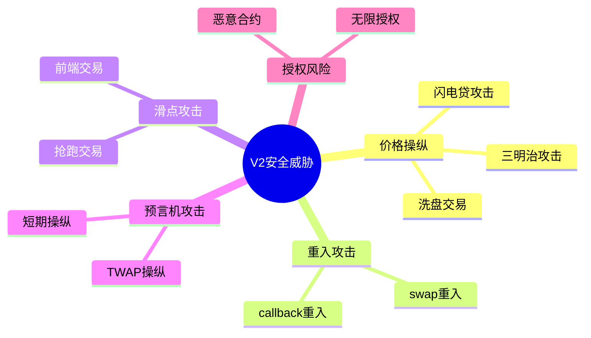
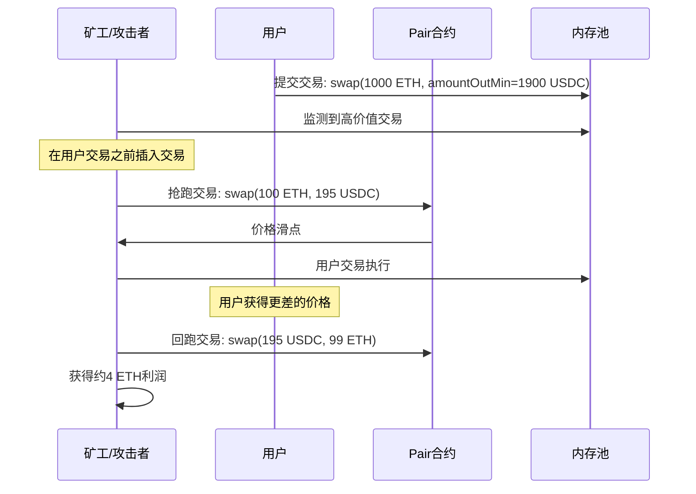
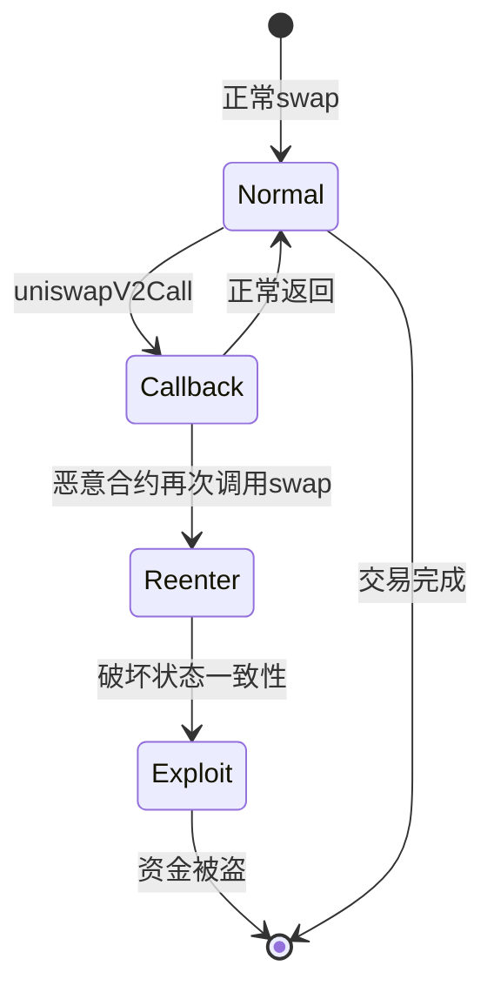
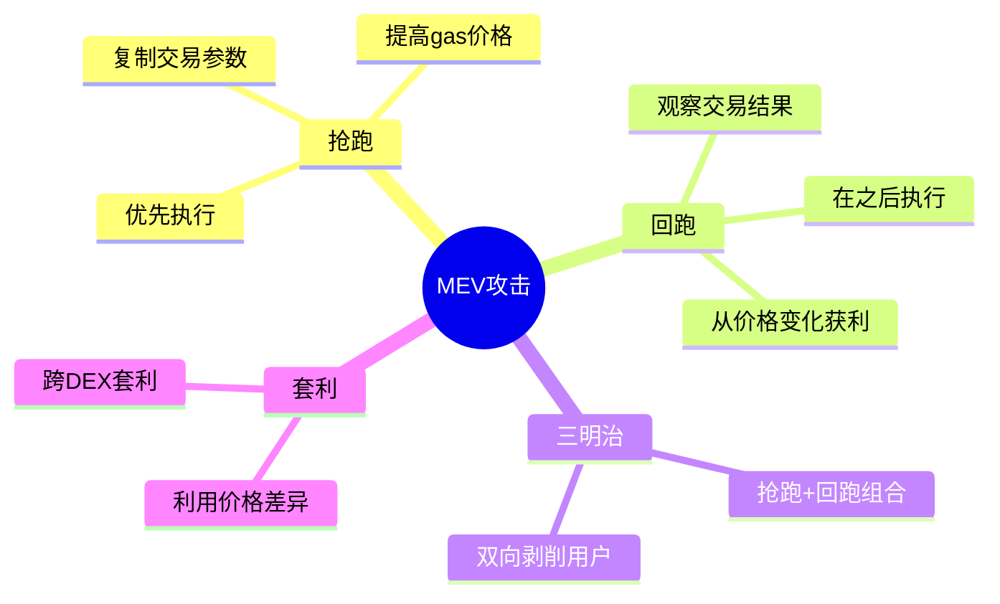
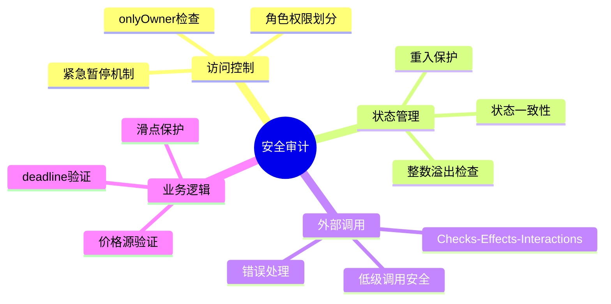
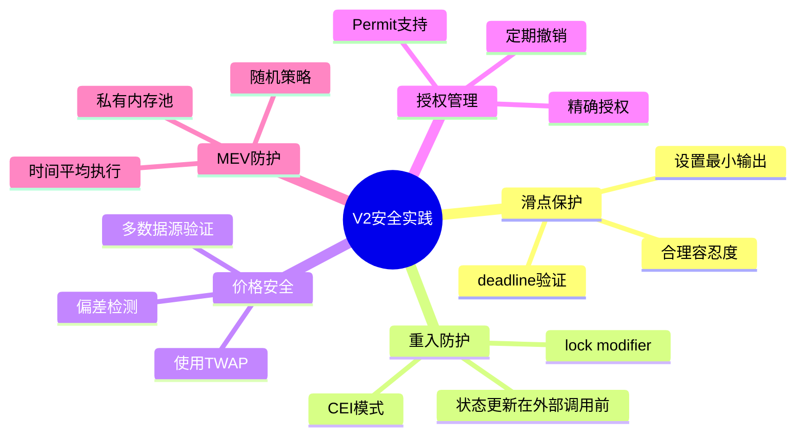

# 死磕Uniswap V2（七）：安全实践与最佳实践

> 本文是「死磕Uniswap V2」系列的第七篇，全面总结V2开发中的安全实践与最佳实践。

## 系列导航

| 序号 | 标题 | 核心内容 |
|:----:|------|----------|
| 01 | V2概述与核心原理 | 恒定乘积AMM、核心公式 |
| 02 | Factory与Pair合约 | 合约结构、创建流程 |
| 03 | 流动性与LP代币 | mint/burn、份额计算 |
| 04 | 交换机制深度解析 | swap函数、滑点、Flash Swap |
| 05 | 价格预言机 | TWAP、价格计算 |
| 06 | Router与路由 | 最佳路径、多跳交易 |
| **07** | **安全实践与最佳实践** | **漏洞防护、开发建议** |

---

## 1. 安全威胁概览

### 1.1 常见攻击类型



### 1.2 攻击影响

```mermaid
graph TB
    subgraph Attacks[\"攻击类型\"]
        A1[\"价格操纵\"]
        A2[\"MEV攻击\"]
        A3[\"重入攻击\"]
        A4[\"授权盗用\"]
    end

    subgraph Impact[\"潜在影响\"]
        I1[\"资金损失\"]
        I2[\"价格偏离\"]
        I3[\"套利流失\"]
        I4[\"用户信任下降\"]
    end

    Attacks --> Impact

    style I1 fill:#ffcdd2
    style I4 fill:#ffcdd2
```

---

## 2. 滑点保护

### 2.1 滑点攻击原理



### 2.2 滑点保护实现

```solidity
// SPDX-License-Identifier: MIT
pragma solidity ^0.8.0;

import "@uniswap/v2-periphery/contracts/interfaces/IUniswapV2Router02.sol";

contract SlippageProtectedTrader {
    IUniswapV2Router02 public immutable router;

    struct SwapParams {
        uint256 amountIn;
        uint256 slippageTolerance; // 基点，如 300 = 3%
        address[] path;
        address recipient;
    }

    event SwapExecuted(
        address indexed tokenIn,
        address indexed tokenOut,
        uint256 amountIn,
        uint256 amountOut,
        uint256 slippage
    );

    constructor(address _router) {
        router = IUniswapV2Router02(_router);
    }

    /// @notice 带滑点保护的交换
    function swapWithProtection(SwapParams calldata params)
        external
        returns (uint256 amountOut)
    {
        // 1. 查询预期输出
        uint256[] memory expectedAmounts = router.getAmountsOut(
            params.amountIn,
            params.path
        );

        uint256 expectedAmountOut = expectedAmounts[expectedAmounts.length - 1];

        // 2. 计算最小输出
        uint256 amountOutMin = (expectedAmountOut * (10000 - params.slippageTolerance)) / 10000;

        // 3. 验证滑点设置合理
        require(
            params.slippageTolerance <= 1000, // 最多10%
            "Slippage too high"
        );

        require(
            params.slippageTolerance >= 10, // 最少0.1%
            "Slippage too low"
        );

        // 4. 授权Router
        IERC20(params.path[0]).approve(address(router), params.amountIn);

        // 5. 执行交易
        uint256[] memory amounts = router.swapExactTokensForTokens(
            params.amountIn,
            amountOutMin,
            params.path,
            params.recipient,
            block.timestamp
        );

        amountOut = amounts[amounts.length - 1];

        // 6. 计算实际滑点
        uint256 actualSlippage = expectedAmountOut > amountOut
            ? ((expectedAmountOut - amountOut) * 10000) / expectedAmountOut
            : 0;

        emit SwapExecuted(
            params.path[0],
            params.path[params.path.length - 1],
            params.amountIn,
            amountOut,
            actualSlippage
        );
    }

    /// @notice 批量交易带滑点保护
    function batchSwapWithProtection(
        SwapParams[] calldata paramsList
    ) external returns (uint256[] memory amountsOut) {
        amountsOut = new uint256[](paramsList.length);

        for (uint256 i = 0; i < paramsList.length; i++) {
            amountsOut[i] = this.swapWithProtection(paramsList[i]);
        }
    }

    /// @notice 动态滑点计算（根据波动率）
    function calculateDynamicSlippage(
        address tokenIn,
        address tokenOut,
        uint256 amountIn
    ) external view returns (uint256 recommendedSlippage) {
        // 获取储备量
        address pair = _getPairAddress(tokenIn, tokenOut);
        (uint112 reserve0, uint112 reserve1, ) = IUniswapV2Pair(pair).getReserves();

        // 计算交易规模占储备的比例
        (uint256 reserveIn, uint256 reserveOut) = tokenIn < tokenOut
            ? (reserve0, reserve1)
            : (reserve1, reserve0);

        uint256 tradeRatio = (amountIn * 10000) / reserveIn;

        // 根据交易规模动态调整滑点容忍度
        if (tradeRatio < 10) { // 小于0.1%
            recommendedSlippage = 30; // 0.3%
        } else if (tradeRatio < 100) { // 0.1% - 1%
            recommendedSlippage = 100; // 1%
        } else if (tradeRatio < 500) { // 1% - 5%
            recommendedSlippage = 300; // 3%
        } else { // 大于5%
            recommendedSlippage = 500; // 5%
        }
    }

    function _getPairAddress(address tokenA, address tokenB)
        internal
        view
        returns (address)
    {
        return IUniswapV2Factory(router.factory()).getPair(tokenA, tokenB);
    }
}
```

### 2.3 交易 deadline 保护

```solidity
contract DeadlineProtectedTrader {
    uint256 public constant MAX_DEADLINE_BUFFER = 1 hours;

    /// @notice 带deadline的交换
    function swapWithDeadline(
        uint256 amountIn,
        uint256 amountOutMin,
        address[] calldata path,
        address recipient,
        uint256 deadline
    ) external returns (uint256[] memory amounts) {
        // 1. 验证deadline
        require(
            deadline > block.timestamp,
            "Deadline must be in future"
        );

        require(
            deadline <= block.timestamp + MAX_DEADLINE_BUFFER,
            "Deadline too far"
        );

        // 2. 执行交易
        // ...
    }

    /// @notice 自动计算合理的deadline
    function getReasonableDeadline(uint256 extraTime)
        external
        view
        returns (uint256)
    {
        require(
            extraTime <= MAX_DEADLINE_BUFFER,
            "Extra time too large"
        );

        return block.timestamp + extraTime;
    }
}
```

---

## 3. 重入攻击防护

### 3.1 重入攻击原理



### 3.2 Checks-Effects-Interactions 模式

```solidity
contract SecureSwapContract {
    using SafeERC20 for IERC20;

    uint256 private locked = 1;

    modifier lock() {
        require(locked == 1, "Reentrancy detected");
        locked = 0;
        _;
        locked = 1;
    }

    mapping(address => uint256) public userBalances;

    /// @notice 正确的交换模式
    function swapAndDeposit(
        uint256 amountIn,
        address[] calldata path,
        address recipient
    ) external lock {
        // 1. CHECKS: 验证输入
        require(path.length >= 2, "Invalid path");
        require(amountIn > 0, "Invalid amount");

        // 2. EFFECTS: 更新状态
        uint256 oldBalance = userBalances[recipient];

        // 3. INTERACTIONS: 外部调用
        IERC20(path[0]).safeTransferFrom(msg.sender, address(this), amountIn);
        IERC20(path[0]).safeApprove(address(router), amountIn);

        uint256[] memory amounts = router.swapExactTokensForTokens(
            amountIn,
            0,
            path,
            address(this),
            block.timestamp
        );

        // 4. 再次更新状态（在所有外部调用之后）
        userBalances[recipient] = oldBalance + amounts[amounts.length - 1];

        // 5. 最后转账给用户
        IERC20(path[path.length - 1]).safeTransfer(
            recipient,
            amounts[amounts.length - 1]
        );
    }
}
```

### 3.3 Reentrancy Guard

```solidity
contract ReentrancyGuard {
    uint256 private locked = 1;

    modifier noReentrancy() {
        require(locked == 1, "Reentrancy detected");
        locked = 0;
        _;
        locked = 1;
    }

    // 使用示例
    function vulnerableFunction() external noReentrancy {
        // 安全的代码
    }
}
```

---

## 4. 价格操纵防护

### 4.1 TWAP 安全使用

```solidity
contract PriceManipulationResistant {
    AdvancedTWAPOracle public oracle;

    uint256 public constant MIN_TWAP_PERIOD = 1 hours;
    uint256 public constant MAX_PRICE_DEVIATION = 300; // 3%

    struct PriceCheck {
        uint256 twapPrice;
        uint256 spotPrice;
        uint256 timestamp;
        bool valid;
    }

    mapping(address => PriceCheck) public priceChecks;

    /// @notice 安全的价格查询
    function getSafePrice(
        address tokenIn,
        address tokenOut
    ) external returns (uint256 price) {
        // 1. 获取TWAP价格
        (uint256 twapPrice, ) = oracle.consult(
            _getPair(tokenIn, tokenOut),
            MIN_TWAP_PERIOD
        );

        // 2. 获取即时价格
        (uint256 spotPrice, ) = oracle.spotPrice(
            _getPair(tokenIn, tokenOut)
        );

        // 3. 计算偏差
        uint256 deviation = _calculateDeviation(spotPrice, twapPrice);

        // 4. 如果偏差过大，使用TWAP价格
        if (deviation > MAX_PRICE_DEVIATION) {
            emit PriceAnomaly Detected(tokenIn, tokenOut, twapPrice, spotPrice, deviation);
            price = twapPrice;
        } else {
            // 可以使用两者的加权平均
            price = (twapPrice * 7 + spotPrice * 3) / 10;
        }

        // 5. 记录价格检查
        priceChecks[tokenIn] = PriceCheck({
            twapPrice: twapPrice,
            spotPrice: spotPrice,
            timestamp: block.timestamp,
            valid: true
        });

        return price;
    }

    function _calculateDeviation(
        uint256 value1,
        uint256 value2
    ) internal pure returns (uint256 deviationBps) {
        if (value1 > value2) {
            deviationBps = ((value1 - value2) * 10000) / value2;
        } else {
            deviationBps = ((value2 - value1) * 10000) / value2;
        }
    }

    function _getPair(address tokenA, address tokenB)
        internal
        view
        returns (address)
    {
        return IUniswapV2Factory(factory).getPair(tokenA, tokenB);
    }

    event PriceAnomalyDetected(
        address indexed tokenIn,
        address indexed tokenOut,
        uint256 twapPrice,
        uint256 spotPrice,
        uint256 deviation
    );
}
```

### 4.2 多数据源验证

```solidity
contract MultiSourceOracle {
    struct PriceSource {
        address pair;
        uint256 weight; // 权重
        bool enabled;
    }

    mapping(address => PriceSource[]) public priceSources;

    /// @notice 添加价格源
    function addPriceSource(
        address token,
        address pair,
        uint256 weight
    ) external onlyOwner {
        require(weight <= 100, "Weight too high");
        priceSources[token].push(PriceSource({
            pair: pair,
            weight: weight,
            enabled: true
        }));
    }

    /// @notice 获取加权平均价格
    function getWeightedPrice(address token)
        external
        view
        returns (uint256 weightedPrice)
    {
        uint256 totalWeight;
        uint256 weightedSum;

        PriceSource[] memory sources = priceSources[token];

        for (uint256 i = 0; i < sources.length; i++) {
            if (!sources[i].enabled) continue;

            (uint112 reserve0, uint112 reserve1, ) = IUniswapV2Pair(sources[i].pair).getReserves();

            uint256 price;
            if (token < IUniswapV2Pair(sources[i].pair).token1()) {
                price = (uint256(reserve1) * 1e18) / reserve0;
            } else {
                price = (uint256(reserve0) * 1e18) / reserve1;
            }

            weightedSum += price * sources[i].weight;
            totalWeight += sources[i].weight;
        }

        require(totalWeight > 0, "No enabled sources");
        weightedPrice = weightedSum / totalWeight;
    }
}
```

---

## 5. 授权安全

### 5.1 授权最佳实践

```mermaid
graph TB
    subgraph Approvals[\"授权策略\"]
        A1[\"精确授权<br/>推荐\"]
        A2[\"无限授权<br/>仅可信DApp\"]
        A3[\"取消授权<br/>不再使用时\"]
    end

    subgraph Risks[\"风险等级\"]
        R1[\"精确授权: 低\"]
        R2[\"无限授权: 高\"]
    end

    Approvals --> Risks

    style A1 fill:#c8e6c9
    style A2 fill:#ffcdd2
```

### 5.2 安全授权管理器

```solidity
contract SafeApprovalManager {
    mapping(address => mapping(address => uint256)) public approvals;

    event ApprovalSet(
        address indexed owner,
        address indexed spender,
        uint256 amount
    );

    /// @notice 设置精确授权
    function setApproval(
        address token,
        address spender,
        uint256 amount
    ) external {
        IERC20(token).approve(spender, 0); // 先清除
        IERC20(token).approve(spender, amount);

        approvals[msg.sender][spender] = amount;

        emit ApprovalSet(msg.sender, spender, amount);
    }

    /// @notice 增量授权
    function increaseApproval(
        address token,
        address spender,
        uint256 addedValue
    ) external {
        uint256 currentApproval = IERC20(token).allowance(msg.sender, spender);

        IERC20(token).approve(spender, currentApproval + addedValue);
        approvals[msg.sender][spender] = currentApproval + addedValue;

        emit ApprovalSet(msg.sender, spender, currentApproval + addedValue);
    }

    /// @notice 减量授权
    function decreaseApproval(
        address token,
        address spender,
        uint256 subtractedValue
    ) external {
        uint256 currentApproval = IERC20(token).allowance(msg.sender, spender);

        uint256 newApproval = currentApproval > subtractedValue
            ? currentApproval - subtractedValue
            : 0;

        IERC20(token).approve(spender, newApproval);
        approvals[msg.sender][spender] = newApproval;

        emit ApprovalSet(msg.sender, spender, newApproval);
    }

    /// @notice 撤销所有授权
    function revokeAllApprovals(address token, address spender) external {
        IERC20(token).approve(spender, 0);
        approvals[msg.sender][spender] = 0;

        emit ApprovalSet(msg.sender, spender, 0);
    }

    /// @notice 批量撤销授权
    function revokeBatchApprovals(
        address[] calldata tokens,
        address[] calldata spenders
    ) external {
        require(tokens.length == spenders.length, "Length mismatch");

        for (uint256 i = 0; i < tokens.length; i++) {
            IERC20(tokens[i]).approve(spenders[i], 0);
            approvals[msg.sender][spenders[i]] = 0;

            emit ApprovalSet(msg.sender, spenders[i], 0);
        }
    }
}
```

### 5.3 Permit (EIP-2612) 支持

```solidity
contract PermitTrader {
    /// @notice 使用Permit进行无授权交易
    function swapWithPermit(
        address token,
        uint256 amount,
        uint256 deadline,
        uint8 v,
        bytes32 r,
        bytes32 s,
        address[] calldata path,
        address recipient
    ) external returns (uint256[] memory amounts) {
        // 1. 执行Permit签名验证并授权
        IERC20Permit(token).permit(
            msg.sender,
            address(this),
            amount,
            deadline,
            v,
            r,
            s
        );

        // 2. 转入代币
        IERC20(token).transferFrom(msg.sender, address(this), amount);

        // 3. 执行交易
        IERC20(token).approve(address(router), amount);

        amounts = router.swapExactTokensForTokens(
            amount,
            0,
            path,
            recipient,
            block.timestamp
        );
    }
}
```

---

## 6. MEV 防护策略

### 6.1 MEV 攻击类型



### 6.2 私有内存池方案

```solidity
concept[\"私有内存池方案\"] {
    // 注意：这是概念性代码，实际需要与私有内存池服务集成

    contract PrivateMempoolTrader {
        address public trustedRelayer;

        constructor(address _trustedRelayer) {
            trustedRelayer = _trustedRelayer;
        }

        modifier onlyTrusted() {
            require(msg.sender == trustedRelayer, "Not trusted relayer");
            _;
        }

        // 通过可信中继器提交交易
        function submitPrivateSwap(
            uint256 amountIn,
            address[] calldata path,
            bytes calldata encodedCall
        ) external onlyTrusted {
            // 直接执行，不经过公共内存池
            (bool success, ) = address(router).call(encodedCall);
            require(success, "Swap failed");
        }
    }
}
```

### 6.3 时间平均执行

```solidity
contract TimeAveragedTrader {
    struct TradePlan {
        uint256 totalAmount;
        uint256 numTranches;
        uint256 interval;
        uint256 executedTranches;
        uint256 lastExecutionTime;
        address[] path;
        address recipient;
    }

    mapping(bytes32 => TradePlan) public tradePlans;

    event TradePlanCreated(bytes32 indexed planId, uint256 totalAmount, uint256 numTranches);
    event TradeExecuted(bytes32 indexed planId, uint256 trancheAmount);

    /// @notice 创建时间平均交易计划
    function createTradePlan(
        uint256 totalAmount,
        uint256 numTranches,
        uint256 interval,
        address[] calldata path,
        address recipient
    ) external returns (bytes32) {
        require(numTranches > 0, "Invalid tranches");
        require(interval >= 1 hours, "Interval too short");

        bytes32 planId = keccak256(abi.encodePacked(
            msg.sender,
            block.timestamp,
            totalAmount
        ));

        tradePlans[planId] = TradePlan({
            totalAmount: totalAmount,
            numTranches: numTranches,
            interval: interval,
            executedTranches: 0,
            lastExecutionTime: 0,
            path: path,
            recipient: recipient
        });

        emit TradePlanCreated(planId, totalAmount, numTranches);

        return planId;
    }

    /// @notice 执行计划的下一笔交易
    function executeNextTranche(bytes32 planId) external {
        TradePlan storage plan = tradePlans[planId];

        require(plan.executedTranches < plan.numTranches, "Plan completed");
        require(
            block.timestamp >= plan.lastExecutionTime + plan.interval,
            "Too early"
        );

        // 计算本笔交易数量
        uint256 trancheAmount = plan.totalAmount / plan.numTranches;
        uint256 remainingAmount = plan.totalAmount - (plan.totalAmount / plan.numTranches) * plan.executedTranches;

        // 最后一笔使用剩余全部
        if (plan.executedTranches == plan.numTranches - 1) {
            trancheAmount = remainingAmount;
        }

        // 执行交易
        IERC20(plan.path[0]).transferFrom(msg.sender, address(this), trancheAmount);
        IERC20(plan.path[0]).approve(address(router), trancheAmount);

        router.swapExactTokensForTokens(
            trancheAmount,
            0,
            plan.path,
            plan.recipient,
            block.timestamp
        );

        plan.executedTranches++;
        plan.lastExecutionTime = block.timestamp;

        emit TradeExecuted(planId, trancheAmount);
    }
}
```

---

## 7. 安全审计检查清单

### 7.1 合约级别检查



### 7.2 审计检查清单

```solidity
contract SecurityAuditChecklist {
    // ============================================
    // 1. 访问控制检查
    // ============================================

    address public owner;
    mapping(address => bool) public admins;

    modifier onlyOwner() {
        require(msg.sender == owner, "Not owner");
        _;
    }

    modifier onlyAdmin() {
        require(admins[msg.sender], "Not admin");
        _;
    }

    // ✅ CHECK: 所有敏感函数都有访问控制
    function sensitiveFunction() external onlyOwner {
        // 敏感操作
    }

    // ============================================
    // 2. 重入保护检查
    // ============================================

    uint256 private locked = 1;

    modifier noReentrancy() {
        require(locked == 1, "Reentrancy detected");
        locked = 0;
        _;
        locked = 1;
    }

    // ✅ CHECK: 状态变更函数有重入保护
    function stateChangingFunction() external noReentrancy {
        // 状态变更操作
    }

    // ============================================
    // 3. 滑点保护检查
    // ============================================

    // ✅ CHECK: 所有交换函数都有滑点保护
    function swapWithSlippageProtection(
        uint256 amountIn,
        uint256 minAmountOut
    ) external {
        require(minAmountOut > 0, "Invalid min output");
        require(minAmountOut <= amountIn, "Invalid slippage");

        // 执行交换...
    }

    // ============================================
    // 4. Deadline检查
    // ============================================

    // ✅ CHECK: 所有交换函数都有deadline
    function swapWithDeadline(
        uint256 deadline
    ) external {
        require(deadline >= block.timestamp, "Deadline expired");
        require(deadline <= block.timestamp + 1 hours, "Deadline too far");

        // 执行交换...
    }

    // ============================================
    // 5. 安全的数学运算
    // ============================================

    // ✅ CHECK: 使用Solidity 0.8+的内置溢出检查
    // 或者使用SafeMath库

    function safeMath(uint256 a, uint256 b) external pure returns (uint256) {
        return a + b; // Solidity 0.8+ 自动检查溢出
    }

    // ============================================
    // 6. 安全的外部调用
    // ============================================

    // ✅ CHECK: 使用Checks-Effects-Interactions模式
    function safeExternalCall(address target, bytes memory data)
        external
        noReentrancy
    {
        // 1. Checks
        require(target != address(0), "Invalid target");

        // 2. Effects (更新状态)
        // ...

        // 3. Interactions (外部调用)
        (bool success, bytes memory result) = target.call(data);
        require(success, "External call failed");
    }

    // ============================================
    // 7. 紧急暂停机制
    // ============================================

    bool public paused;

    modifier whenNotPaused() {
        require(!paused, "Contract is paused");
        _;
    }

    function pause() external onlyOwner {
        paused = true;
    }

    function unpause() external onlyOwner {
        paused = false;
    }

    // ✅ CHECK: 关键函数有暂停保护
    function criticalFunction() external whenNotPaused {
        // 关键操作
    }

    // ============================================
    // 8. 事件日志
    // ============================================

    // ✅ CHECK: 所有敏感操作都有事件日志
    event SensitiveAction(
        address indexed user,
        uint256 value,
        uint256 timestamp
    );

    function sensitiveAction(uint256 value) external {
        // 执行操作
        emit SensitiveAction(msg.sender, value, block.timestamp);
    }
}
```

---

## 8. 开发最佳实践

### 8.1 项目结构

```
uniswap-v2-integration/
├── contracts/
│   ├── interfaces/
│   │   ├── IUniswapV2Factory.sol
│   │   ├── IUniswapV2Pair.sol
│   │   ├── IUniswapV2Router02.sol
│   │   └── IERC20Permit.sol
│   ├── libraries/
│   │   ├── UniswapV2Library.sol
│   │   └── SafeERC20.sol
│   ├── routers/
│   │   └── OptimalRouter.sol
│   └── oracles/
│       └── SafeOracle.sol
├── test/
│   ├── unit/
│   ├── integration/
│   └── security/
├── scripts/
│   └── deploy/
└── README.md
```

### 8.2 测试策略

```solidity
// SPDX-License-Identifier: MIT
pragma solidity ^0.8.0;

import "forge-std/Test.sol";

contract UniswapV2SecurityTest is Test {
    IUniswapV2Router02 router;
    IUniswapV2Factory factory;
    IUniswapV2Pair pair;

    address tokenA;
    address tokenB;
    address attacker;

    function setUp() public {
        // 设置测试环境
        router = IUniswapV2Router02(0x7a250d5630B4cF539739dF2C5dAcb4c659F2488D);
        factory = IUniswapV2Factory(router.factory());

        tokenA = address(new TestToken("TokenA", "TA", 18));
        tokenB = address(new TestToken("TokenB", "TB", 18));

        attacker = address(0x1337);
    }

    // ============================================
    // 安全测试用例
    // ============================================

    function testReentrancyProtection() public {
        // 测试重入保护
    }

    function testSlippageProtection() public {
        // 测试滑点保护
    }

    function testFlashLoanAttack() public {
        // 测试闪电贷攻击防护
    }

    function testPriceManipulation() public {
        // 测试价格操纵防护
    }

    function testMaxApprovalRisk() public {
        // 测试无限授权风险
    }
}
```

### 8.3 部署验证

```solidity
// deployment verification script

function verifyDeployment(address routerAddress) external view returns (bool) {
    IUniswapV2Router02 router = IUniswapV2Router02(routerAddress);

    // 1. 验证Factory地址
    require(router.factory() != address(0), "Invalid factory");

    // 2. 验证WETH地址
    require(router.WETH() != address(0), "Invalid WETH");

    // 3. 验证Router接口
    try router.factory() {
        // Factory调用成功
    } catch {
        revert("Router interface invalid");
    }

    return true;
}
```

---

## 9. 本章小结

### 9.1 安全实践总结



### 9.2 安全建议清单

| 类别 | 建议 | 优先级 |
|------|------|--------|
| **滑点** | 始终设置amountOutMin | 🔴 高 |
| **Deadline** | 设置合理的deadline | 🔴 高 |
| **授权** | 避免无限授权 | 🟡 中 |
| **测试** | 编写完整测试用例 | 🔴 高 |
| **审计** | 第三方安全审计 | 🔴 高 |
| **重入** | 使用ReentrancyGuard | 🔴 高 |
| **预言机** | 使用TWAP而非即时价格 | 🟡 中 |

---

## 系列总结

恭喜你完成了「死磕Uniswap V2」系列的全部学习！

### 核心知识回顾

1. **V2概述与核心原理** - 恒定乘积AMM (x × y = k)
2. **Factory与Pair合约** - 合约结构与创建流程
3. **流动性与LP代币** - mint/burn与份额计算
4. **交换机制深度解析** - swap函数、滑点、Flash Swap
5. **价格预言机** - TWAP机制与防操纵
6. **Router与路由** - 多跳交易与路径优化
7. **安全实践与最佳实践** - 漏洞防护与开发建议

### 下一步学习建议

- 深入学习 Uniswap V3 的集中流动性机制
- 了解 Uniswap V4 的 Hooks 可编程性
- 研究其他 AMM 变种 (Curve, Balancer)
- 实践 DeFi 协议集成开发

---

## 参考资料

- [Uniswap V2 Core Contracts](https://github.com/Uniswap/v2-core)
- [Uniswap V2 Periphery Contracts](https://github.com/Uniswap/v2-periphery)
- [Uniswap V2 Whitepaper](https://uniswap.org/whitepaper.pdf)
- [Smart Contract Best Practices](https://consensys.github.io/smart-contract-best-practices/)
- [OpenZeppelin Security Audit Checklist](https://docs.openzeppelin.com/contracts/security/)
