# 死磕Uniswap V3（一）：概述与集中流动性

> 本文是「死磕Uniswap V3」系列的第一篇，将深入探讨V3的革命性创新——集中流动性机制。

## 系列导航

| 序号 | 标题 | 核心内容 |
|------|------|----------|
| **01** | **概述与集中流动性** | AMM演进、集中流动性原理 |
| 02 | Tick机制与价格数学 | Tick设计、价格转换算法 |
| 03 | 架构与合约设计 | Factory、Pool合约结构 |
| 04 | 交换机制深度解析 | swap函数、价格发现 |
| 05 | 流动性管理与头寸 | Position、mint/burn |
| 06 | 费用系统与预言机 | 费用分配、TWAP |
| 07 | MEV与套利策略 | JIT、三明治攻击 |

---

## 1. AMM的技术演进

### 1.1 从V1到V3的革命之路

Uniswap的发展历程代表了DeFi领域自动化做市商（AMM）技术的演进史：

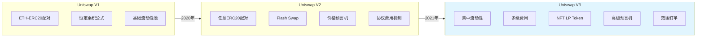

### 1.2 第一代AMM的局限性

传统AMM基于恒定乘积公式 `x × y = k`，存在根本性缺陷：

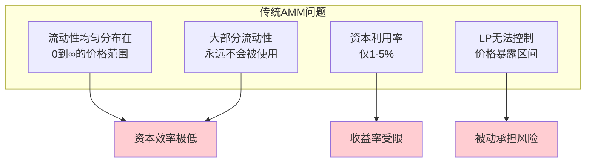

**资本利用率问题示例**：

假设ETH/USDC交易对，当前价格为2000 USDC/ETH：
- 在传统AMM中，流动性分布在价格区间 [0, ∞]
- 但90%的交易发生在 [1800, 2200] 价格区间
- 这意味着**大约10%的流动性在处理90%的交易量**

---

## 2. 集中流动性：V3的核心创新

### 2.1 什么是集中流动性？

集中流动性允许流动性提供者（LP）将资金集中在**自定义的价格区间**内，而不是分散在整个价格曲线上。

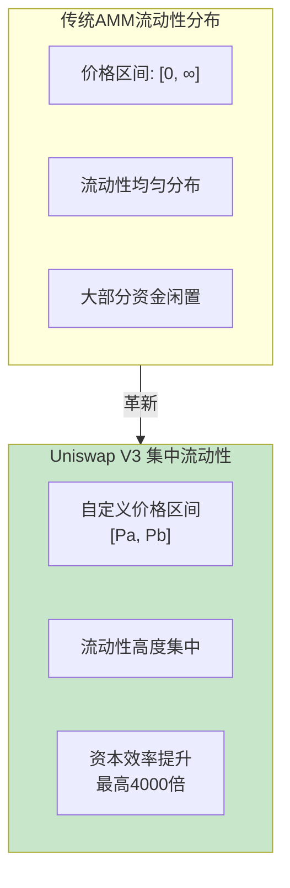

### 2.2 集中流动性的数学基础

#### 传统公式 vs 集中流动性公式

**传统恒定乘积公式**：
```
x × y = k
```

**集中流动性公式**（在价格区间 [Pa, Pb] 内）：
```
(x + L/√Pb) × (y + L×√Pa) = L²
```

其中：
- `L`: 流动性常数（Liquidity）
- `Pa`: 价格区间下界
- `Pb`: 价格区间上界
- `x`, `y`: 代币的虚拟储备量

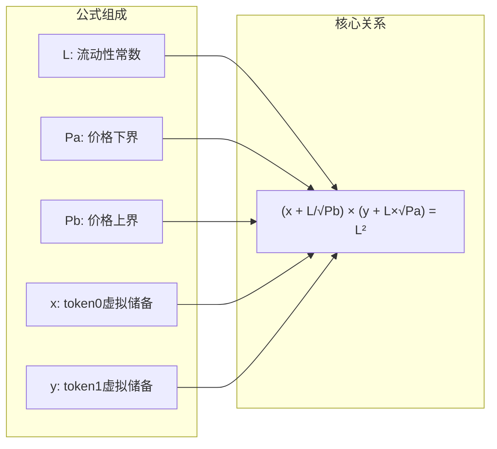

### 2.3 虚拟储备的概念

集中流动性引入了"虚拟储备"概念，这是理解V3的关键：

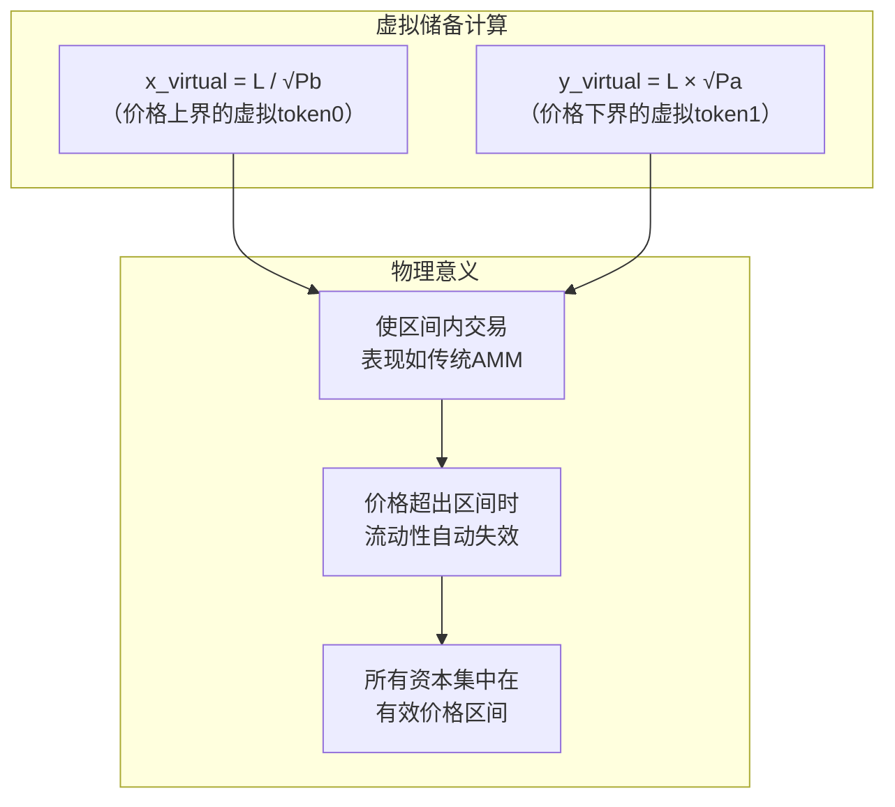

### 2.4 三种价格位置的资产状态

根据当前价格相对于LP设定区间的位置，资产状态会有所不同：

```mermaid
stateDiagram-v2
    [*] --> BelowRange: P < Pa
    [*] --> InRange: Pa ≤ P ≤ Pb
    [*] --> AboveRange: P > Pb

    BelowRange --> OnlyToken0: 100% token0
    InRange --> MixedHolding: token0 + token1
    AboveRange --> OnlyToken1: 100% token1

    note right of InRange
        流动性活跃
        可赚取交易费用
    end note

    note right of BelowRange
        流动性未激活
        等待价格上涨
    end note

    note right of AboveRange
        流动性未激活
        等待价格下跌
    end note

    state BelowRange as "价格在区间下方"
    state InRange as "价格在区间内"
    state AboveRange as "价格在区间上方"
    state OnlyToken0 as "只持有Token0"
    state MixedHolding as "混合持有"
    state OnlyToken1 as "只持有Token1"
```

**代码实现**：

```solidity
function getVirtualReserves(
    uint160 sqrtPriceX96,
    uint128 liquidity,
    uint160 sqrtPriceAX96,  // 下界
    uint160 sqrtPriceBX96   // 上界
) internal pure returns (uint256 amount0, uint256 amount1) {
    if (sqrtPriceX96 <= sqrtPriceAX96) {
        // 价格在区间下方：只有token0
        amount0 = SqrtPriceMath.getAmount0Delta(
            sqrtPriceAX96, sqrtPriceBX96, liquidity, false
        );
        amount1 = 0;
    } else if (sqrtPriceX96 < sqrtPriceBX96) {
        // 价格在区间内：两种token都有
        amount0 = SqrtPriceMath.getAmount0Delta(
            sqrtPriceX96, sqrtPriceBX96, liquidity, false
        );
        amount1 = SqrtPriceMath.getAmount1Delta(
            sqrtPriceAX96, sqrtPriceX96, liquidity, false
        );
    } else {
        // 价格在区间上方：只有token1
        amount0 = 0;
        amount1 = SqrtPriceMath.getAmount1Delta(
            sqrtPriceAX96, sqrtPriceBX96, liquidity, false
        );
    }
}
```

---

## 3. 资本效率的革命性提升

### 3.1 效率提升的量化分析

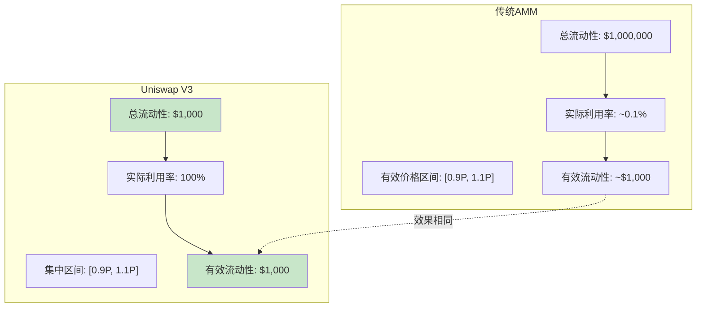

**效率提升计算**：

| 指标 | 传统AMM | Uniswap V3 | 提升倍数 |
|------|---------|------------|----------|
| 所需资金 | $1,000,000 | $1,000 | **1000x** |
| 价格区间 | [0, ∞] | [0.9P, 1.1P] | 精确控制 |
| 有效流动性 | ~$1,000 | $1,000 | 相同效果 |
| 费用收益率 | 0.1% | 100% | **1000x** |

### 3.2 不同场景的最优区间选择

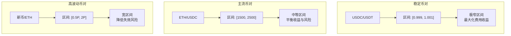

---

## 4. 多级费用结构

### 4.1 费用等级设计

V3引入了多级费用结构，适应不同风险级别的交易对：

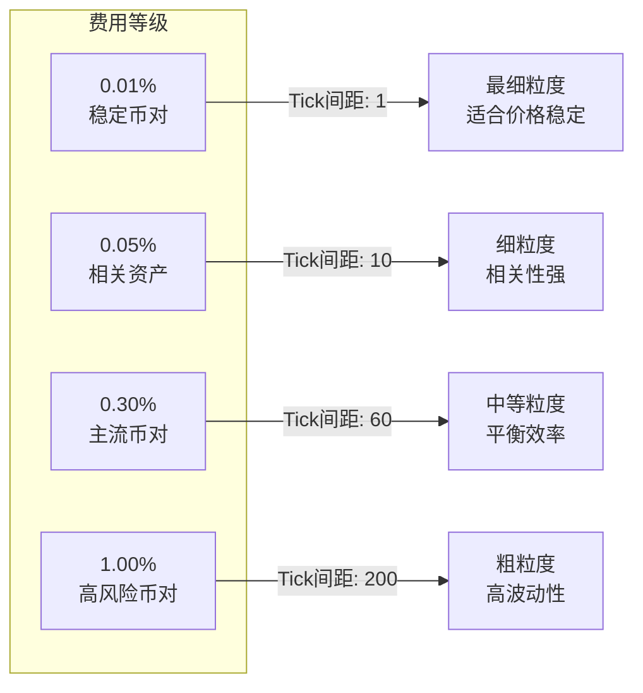

### 4.2 费用与Tick间距的绑定

| 费率 | 费率值(bps) | Tick间距 | 最小价格变化 | 适用场景 |
|------|-------------|----------|--------------|----------|
| 0.01% | 100 | 1 | 0.01% | 稳定币对 |
| 0.05% | 500 | 10 | 0.10% | 相关资产 |
| 0.30% | 3000 | 60 | 0.60% | 主流币对 |
| 1.00% | 10000 | 200 | 2.00% | 高风险币对 |

**设计原理**：
- 低费率池需要更细的价格粒度以精确定价
- 高费率池使用粗粒度降低gas成本
- Tick间距直接影响LP能设置的价格范围精度

---

## 5. NFT化的流动性代币

### 5.1 从同质化到非同质化

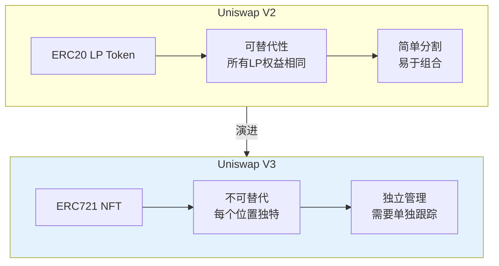

### 5.2 NFT包含的信息

每个V3流动性NFT包含以下独特信息：

```solidity
struct Position {
    // 流动性数量
    uint128 liquidity;

    // 价格区间边界（Tick值）
    int24 tickLower;
    int24 tickUpper;

    // 费用增长追踪
    uint256 feeGrowthInside0LastX128;
    uint256 feeGrowthInside1LastX128;

    // 待领取的费用
    uint128 tokensOwed0;
    uint128 tokensOwed1;
}
```

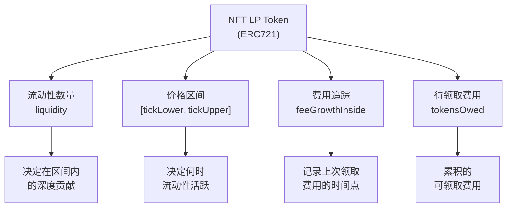

---

## 6. 本章小结

### 6.1 V3的核心创新总结

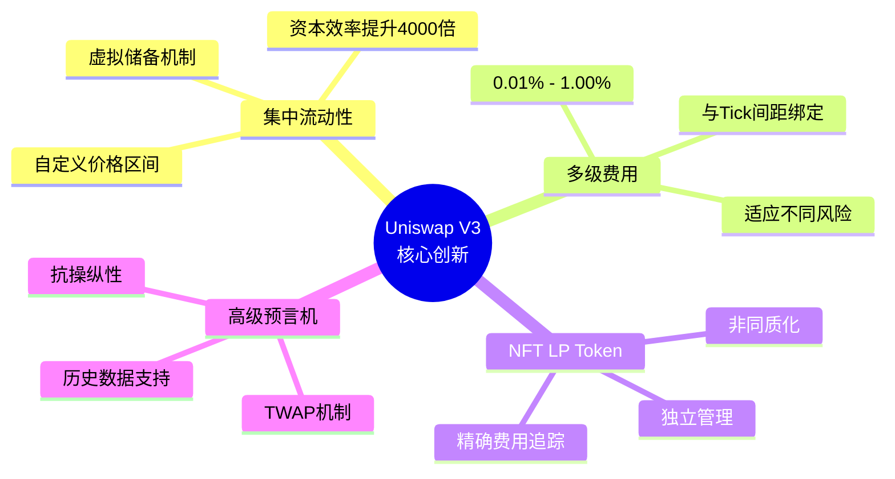

### 6.2 关键概念回顾

| 概念 | 定义 | 重要性 |
|------|------|--------|
| 集中流动性 | LP在自定义价格区间提供流动性 | V3的核心创新 |
| 虚拟储备 | 使区间内行为等同传统AMM的数学构造 | 理解公式的关键 |
| 资本效率 | 单位资金的有效利用率 | 最高提升4000倍 |
| Tick间距 | 最小价格变动单位 | 与费率等级绑定 |
| NFT LP | 代表独特流动性位置的非同质化代币 | 精确管理每个位置 |

---

## 下一篇预告

在下一篇文章中，我们将深入探讨**Tick机制与价格数学**，包括：
- Tick的数学定义与设计原理
- 价格与Tick的双向转换算法
- Q64.96定点数格式详解
- TickMath库的核心实现

---

## 参考资料

- [Uniswap V3 白皮书](https://uniswap.org/whitepaper-v3.pdf)
- [Uniswap V3 Core 源码](https://github.com/Uniswap/v3-core)
- [Uniswap V3 开发文档](https://docs.uniswap.org/)
