# 死磕Uniswap V3（二）：Tick机制与价格数学

> 本文是「死磕Uniswap V3」系列的第二篇，深入探讨Tick机制的设计原理和价格数学的核心算法。

## 系列导航

| 序号 | 标题 | 核心内容 |
|------|------|----------|
| 01 | 概述与集中流动性 | AMM演进、集中流动性原理 |
| **02** | **Tick机制与价格数学** | **Tick设计、价格转换算法** |
| 03 | 架构与合约设计 | Factory、Pool合约结构 |
| 04 | 交换机制深度解析 | swap函数、价格发现 |
| 05 | 流动性管理与头寸 | Position、mint/burn |
| 06 | 费用系统与预言机 | 费用分配、TWAP |
| 07 | MEV与套利策略 | JIT、三明治攻击 |

---

## 1. Tick机制概述

### 1.1 为什么需要Tick？

在传统AMM中，价格是连续的实数。但在区块链上，我们需要：
- **高效存储**：连续价格需要无限存储
- **快速计算**：整数运算远快于浮点运算
- **精确定位**：方便LP设定价格区间边界

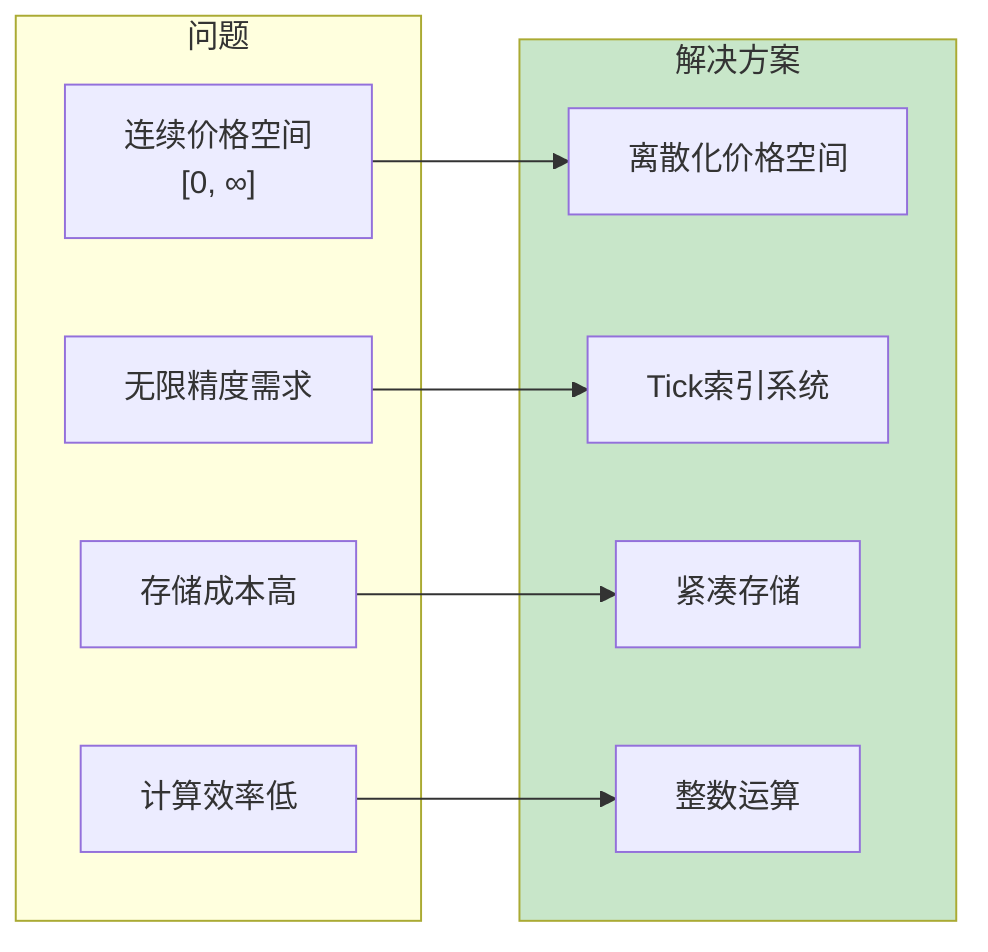

### 1.2 Tick的数学定义

**核心公式**：
```
price = 1.0001^tick
```

这意味着：
- 每个Tick代表**0.01%**的价格变化
- 相邻Tick的价格比为 **1.0001**（即100.01%）

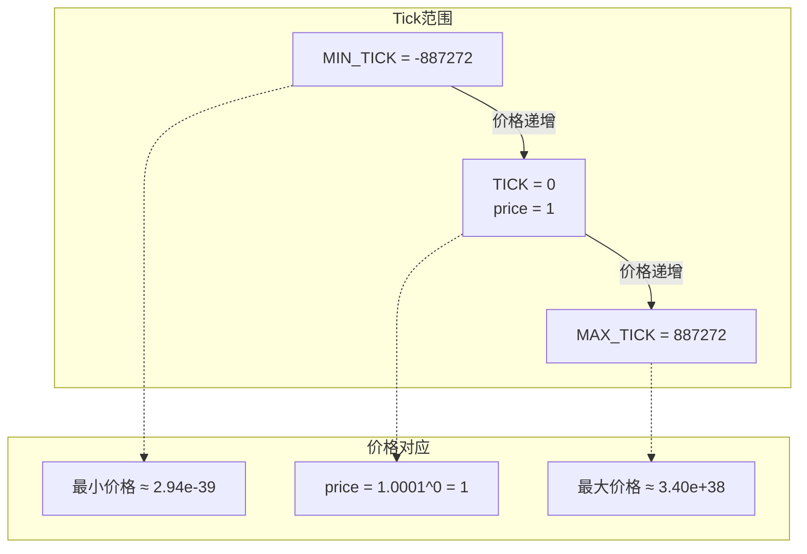

### 1.3 为什么选择1.0001作为基数？

| 考量因素 | 1.0001的优势 |
|----------|--------------|
| 精度需求 | 0.01%变化足够精细，满足大多数交易场景 |
| 范围覆盖 | ±887272个Tick可覆盖天文数字级别的价格范围 |
| 计算效率 | 可通过二进制分解高效计算幂运算 |
| 存储优化 | int24类型（3字节）即可存储所有Tick值 |

---

## 2. 价格的平方根表示

### 2.1 为什么使用√price？

V3不直接存储价格，而是存储**价格的平方根**（sqrtPrice）：

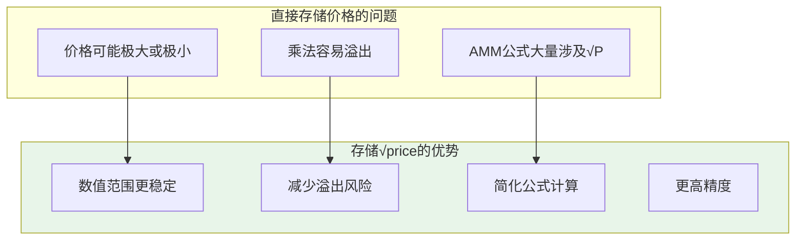

**AMM公式中的应用**：

在集中流动性公式中，代币数量的计算大量涉及√P：
```
Δx = L × (1/√Pa - 1/√Pb)  // token0变化量
Δy = L × (√Pb - √Pa)      // token1变化量
```

### 2.2 Q64.96定点数格式

V3使用**Q64.96定点数**格式存储√price：

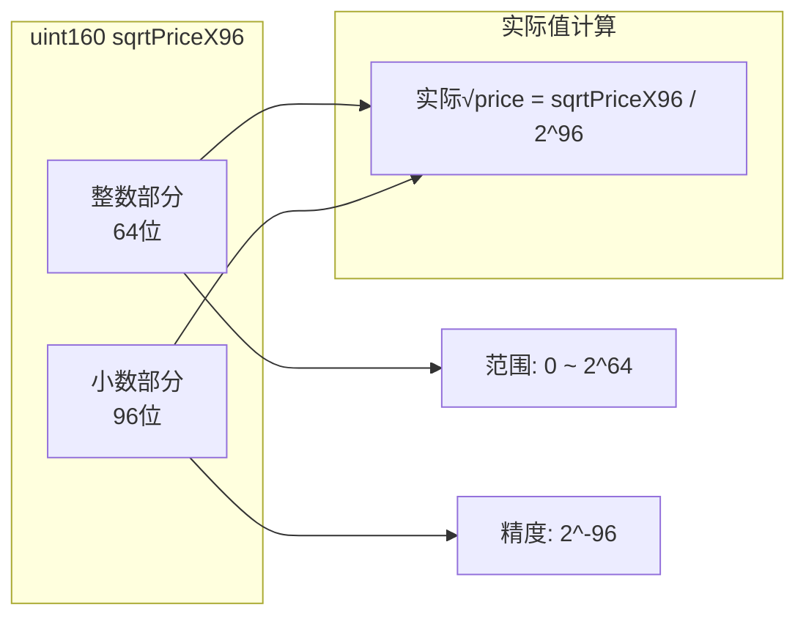

**格式详解**：

| 属性 | 值 |
|------|-----|
| 总位数 | 160位（正好适配uint160） |
| 整数部分 | 64位，范围 [0, 2^64) |
| 小数部分 | 96位，精度 2^(-96) ≈ 1.26×10^(-29) |
| 表示范围 | 覆盖所有可能的价格 |

**示例代码**：
```solidity
// √1 在Q64.96格式下的值
uint160 sqrtPriceX96 = 79228162514264337593543950336; // 2^96

// 从sqrtPriceX96计算实际价格
function getPrice(uint160 sqrtPriceX96) public pure returns (uint256) {
    // price = (sqrtPriceX96 / 2^96)^2 = sqrtPriceX96^2 / 2^192
    return FullMath.mulDiv(sqrtPriceX96, sqrtPriceX96, FixedPoint96.Q96);
}
```

---

## 3. Tick与价格的双向转换

### 3.1 转换关系总览

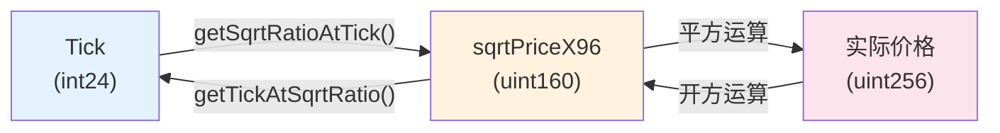

### 3.2 正向转换：Tick → √Price

**核心算法**：使用**二进制分解**实现高效幂运算

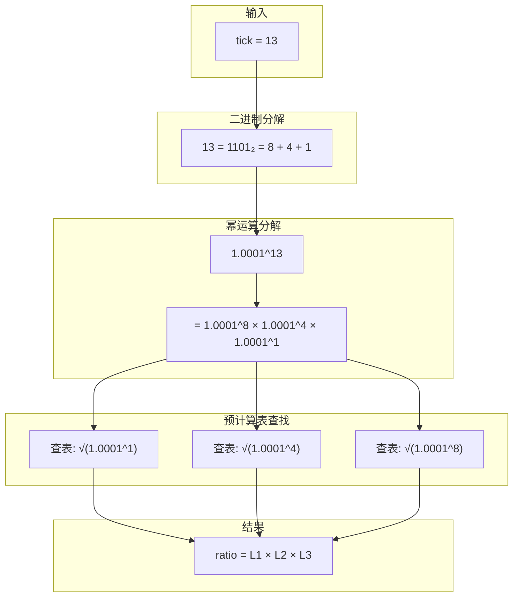

**预计算常数表**（部分）：

| 二进制位 | 对应幂次 | 预计算值（×2^128） |
|----------|---------|-------------------|
| 0x1 | √(1.0001^1) | 0xfffcb933bd6fad37aa2d162d1a594001 |
| 0x2 | √(1.0001^2) | 0xfff97272373d413259a46990580e213a |
| 0x4 | √(1.0001^4) | 0xfff2e50f5f656932ef12357cf3c7fdcc |
| 0x8 | √(1.0001^8) | 0xffe5caca7e10e4e61c3624eaa0941cd0 |
| ... | ... | ... |

**核心代码实现**：

```solidity
function getSqrtRatioAtTick(int24 tick) internal pure returns (uint160 sqrtPriceX96) {
    uint256 absTick = tick < 0 ? uint256(-int256(tick)) : uint256(int256(tick));
    require(absTick <= uint256(MAX_TICK), 'T');

    // 二进制分解 + 预计算表查找
    uint256 ratio = absTick & 0x1 != 0
        ? 0xfffcb933bd6fad37aa2d162d1a594001
        : 0x100000000000000000000000000000000;

    // 检查每一位并累乘对应的预计算值
    if (absTick & 0x2 != 0)
        ratio = (ratio * 0xfff97272373d413259a46990580e213a) >> 128;
    if (absTick & 0x4 != 0)
        ratio = (ratio * 0xfff2e50f5f656932ef12357cf3c7fdcc) >> 128;
    if (absTick & 0x8 != 0)
        ratio = (ratio * 0xffe5caca7e10e4e61c3624eaa0941cd0) >> 128;
    // ... 继续检查到第20位

    // 处理负tick：取倒数
    if (tick > 0) ratio = type(uint256).max / ratio;

    // 从Q128转为Q96格式，向上舍入
    sqrtPriceX96 = uint160((ratio >> 32) + (ratio % (1 << 32) == 0 ? 0 : 1));
}
```

**算法复杂度**：O(log(tick))，最多20次乘法运算

### 3.3 反向转换：√Price → Tick

反向转换使用**对数运算**：

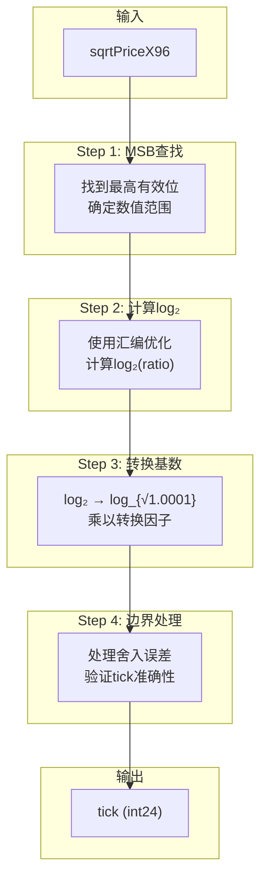

**核心数学原理**：

```
price = 1.0001^tick
log(price) = tick × log(1.0001)
tick = log(price) / log(1.0001)
tick = log₂(price) / log₂(1.0001)
tick = log₂(sqrtPrice²) / log₂(√1.0001)
tick = 2 × log₂(sqrtPrice) / log₂(1.0001)
```

**边界处理的必要性**：

由于浮点计算存在精度误差，需要额外验证：

```solidity
// 计算可能的tick范围
int24 tickLow = int24((log_sqrt10001 - 3402992956809132418596140100660247210) >> 128);
int24 tickHi = int24((log_sqrt10001 + 291339464771989622907027621153398088495) >> 128);

// 验证并选择正确的tick
tick = tickLow == tickHi
    ? tickLow
    : getSqrtRatioAtTick(tickHi) <= sqrtPriceX96 ? tickHi : tickLow;
```

---

## 4. TickBitmap：高效的Tick查找

### 4.1 设计目标

在交换过程中，需要快速找到**下一个已初始化的Tick**（即有流动性的价格边界）。

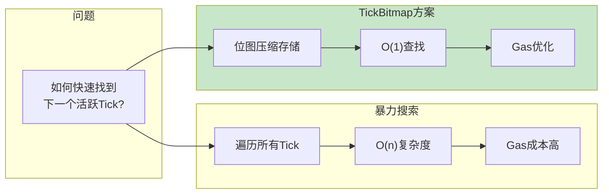

### 4.2 位图结构

每个uint256存储256个Tick的初始化状态：

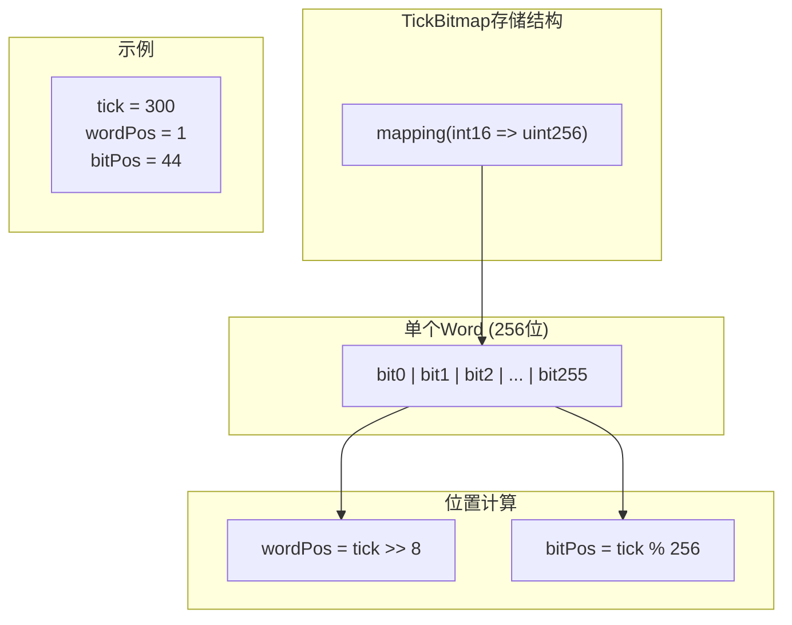

**存储效率**：
- 每个Tick仅占用**1 bit**
- 256个相邻Tick共享一个存储槽
- 极大节省存储成本

### 4.3 核心操作

#### 翻转Tick状态

```solidity
function flipTick(
    mapping(int16 => uint256) storage self,
    int24 tick,
    int24 tickSpacing
) internal {
    require(tick % tickSpacing == 0); // 确保tick对齐
    (int16 wordPos, uint8 bitPos) = position(tick / tickSpacing);
    uint256 mask = 1 << bitPos;
    self[wordPos] ^= mask; // XOR操作翻转状态
}
```

#### 查找下一个初始化的Tick

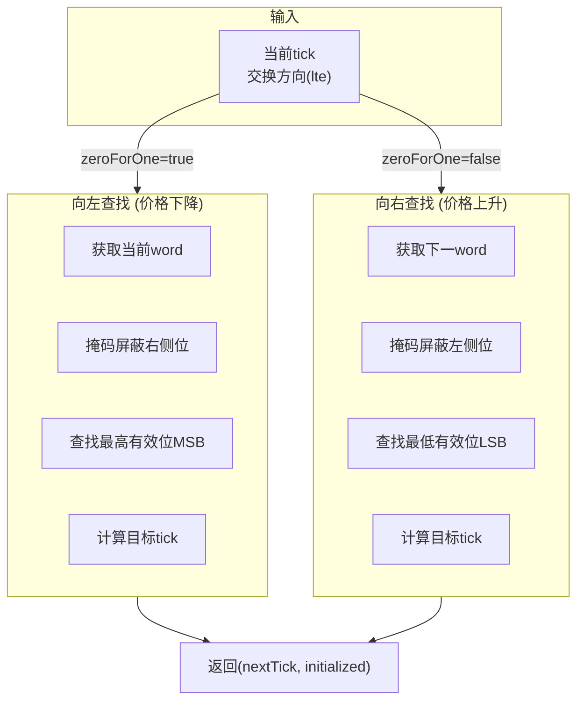

**代码实现**：

```solidity
function nextInitializedTickWithinOneWord(
    mapping(int16 => uint256) storage self,
    int24 tick,
    int24 tickSpacing,
    bool lte  // less than or equal，表示向左查找
) internal view returns (int24 next, bool initialized) {
    int24 compressed = tick / tickSpacing;
    if (tick < 0 && tick % tickSpacing != 0) compressed--;

    if (lte) {
        // 向左查找（价格下降方向）
        (int16 wordPos, uint8 bitPos) = position(compressed);
        // 创建掩码，保留当前位及左侧所有位
        uint256 mask = (1 << bitPos) - 1 + (1 << bitPos);
        uint256 masked = self[wordPos] & mask;

        initialized = masked != 0;
        next = initialized
            ? (compressed - int24(bitPos - BitMath.mostSignificantBit(masked))) * tickSpacing
            : (compressed - int24(bitPos)) * tickSpacing;
    } else {
        // 向右查找（价格上升方向）
        (int16 wordPos, uint8 bitPos) = position(compressed + 1);
        // 创建掩码，保留当前位及右侧所有位
        uint256 mask = ~((1 << bitPos) - 1);
        uint256 masked = self[wordPos] & mask;

        initialized = masked != 0;
        next = initialized
            ? (compressed + 1 + int24(BitMath.leastSignificantBit(masked) - bitPos)) * tickSpacing
            : (compressed + 1 + int24(type(uint8).max - bitPos)) * tickSpacing;
    }
}
```

---

## 5. BitMath库：高级位运算

### 5.1 最高有效位(MSB)查找

使用**二分查找**思想，时间复杂度O(log n)：

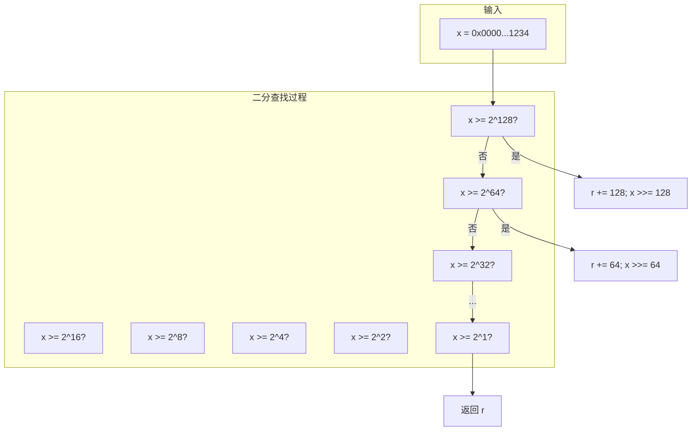

**代码实现**：

```solidity
function mostSignificantBit(uint256 x) internal pure returns (uint8 r) {
    require(x > 0);

    // 二分查找
    if (x >= 0x100000000000000000000000000000000) { x >>= 128; r += 128; }
    if (x >= 0x10000000000000000) { x >>= 64; r += 64; }
    if (x >= 0x100000000) { x >>= 32; r += 32; }
    if (x >= 0x10000) { x >>= 16; r += 16; }
    if (x >= 0x100) { x >>= 8; r += 8; }
    if (x >= 0x10) { x >>= 4; r += 4; }
    if (x >= 0x4) { x >>= 2; r += 2; }
    if (x >= 0x2) r += 1;
}
```

### 5.2 最低有效位(LSB)查找

```solidity
function leastSignificantBit(uint256 x) internal pure returns (uint8 r) {
    require(x > 0);

    r = 255;
    if (x & type(uint128).max > 0) { r -= 128; } else { x >>= 128; }
    if (x & type(uint64).max > 0) { r -= 64; } else { x >>= 64; }
    if (x & type(uint32).max > 0) { r -= 32; } else { x >>= 32; }
    if (x & type(uint16).max > 0) { r -= 16; } else { x >>= 16; }
    if (x & type(uint8).max > 0) { r -= 8; } else { x >>= 8; }
    if (x & 0xf > 0) { r -= 4; } else { x >>= 4; }
    if (x & 0x3 > 0) { r -= 2; } else { x >>= 2; }
    if (x & 0x1 > 0) r -= 1;
}
```

---

## 6. Tick间距与费率的绑定

### 6.1 设计原理

不同费率的池子使用不同的Tick间距：

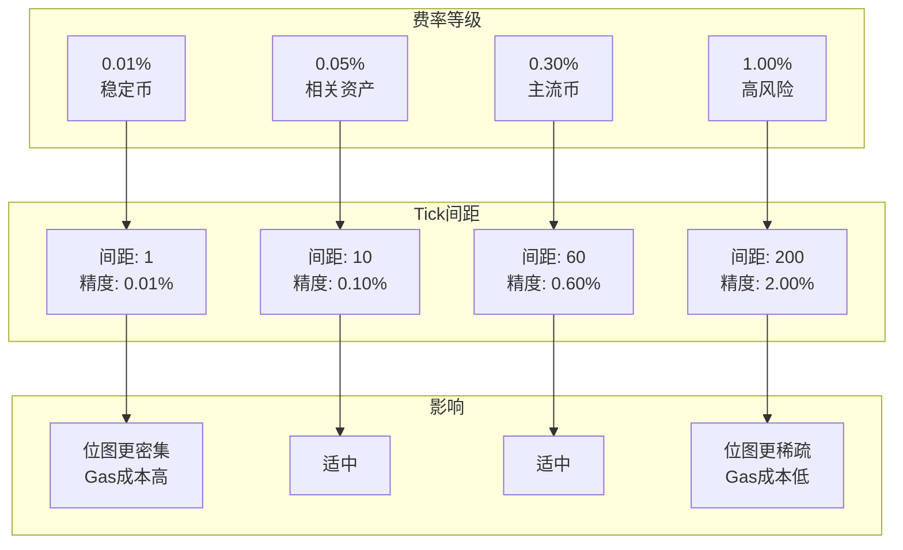

### 6.2 间距限制的数学原因

```solidity
function enableFeeAmount(uint24 fee, int24 tickSpacing) public override {
    require(msg.sender == owner);
    require(fee < 1000000); // 最大100%费率

    // tick间距限制: (0, 16384)
    require(tickSpacing > 0 && tickSpacing < 16384);
    require(feeAmountTickSpacing[fee] == 0);

    feeAmountTickSpacing[fee] = tickSpacing;
    emit FeeAmountEnabled(fee, tickSpacing);
}
```

**为什么限制在16384以内？**

```
16384 tick对应的价格变化:
1.0001^16384 ≈ 5.12

即单个word(256个tick × 60间距)覆盖的价格变化约为:
1.0001^(256 × 60) ≈ 4.7倍
```

这确保了在一个word内可以完成大部分正常交易的tick查找。

---

## 7. 实际计算示例

### 7.1 ETH/USDC价格转换

假设ETH价格为2000 USDC：

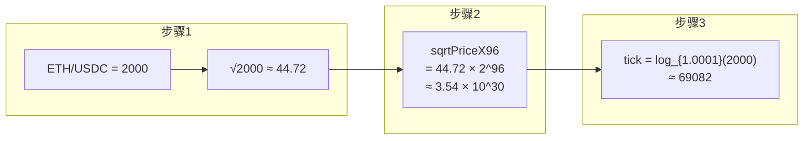

### 7.2 代码验证

```solidity
// 价格2000对应的tick
int24 tick = 69082;

// 验证
uint160 sqrtPriceX96 = TickMath.getSqrtRatioAtTick(tick);
// sqrtPriceX96 ≈ 3543191142285914188532578

// 计算实际价格
uint256 price = FullMath.mulDiv(sqrtPriceX96, sqrtPriceX96, FixedPoint96.Q96);
// price ≈ 2000 (以token1/token0表示)
```

---

## 8. 本章小结

### 8.1 核心概念回顾

```mermaid
mindmap
  root((Tick机制))
    价格离散化
      price = 1.0001^tick
      0.01%精度
      int24存储
    √price存储
      Q64.96格式
      uint160类型
      数值稳定
    双向转换
      二进制分解
      预计算表
      对数运算
    TickBitmap
      位图存储
      O(1)查找
      Gas优化
```

### 8.2 关键公式总结

| 公式 | 说明 | 用途 |
|------|------|------|
| `price = 1.0001^tick` | Tick与价格的关系 | 价格计算 |
| `sqrtPriceX96 = √price × 2^96` | 平方根价格的定点数表示 | 合约存储 |
| `wordPos = tick >> 8` | Tick在位图中的word位置 | 位图查找 |
| `bitPos = tick % 256` | Tick在word中的bit位置 | 位图查找 |

### 8.3 Gas优化技巧

1. **预计算表**：避免运行时计算复杂幂运算
2. **位运算**：使用位操作替代条件判断
3. **位图压缩**：256个状态共享一个存储槽
4. **整数运算**：避免浮点数带来的精度和效率问题

---

## 下一篇预告

在下一篇文章中，我们将深入探讨**架构与合约设计**，包括：
- Factory合约的单例模式
- Pool合约的状态管理
- Library模式的深度应用
- 核心数据结构设计

---

## 参考资料

- [Uniswap V3 Core - TickMath.sol](https://github.com/Uniswap/v3-core/blob/main/contracts/libraries/TickMath.sol)
- [Uniswap V3 Core - TickBitmap.sol](https://github.com/Uniswap/v3-core/blob/main/contracts/libraries/TickBitmap.sol)
- [定点数数学基础](https://en.wikipedia.org/wiki/Fixed-point_arithmetic)
