# 死磕Uniswap V3（三）：架构与合约设计

> 本文是「死磕Uniswap V3」系列的第三篇，深入剖析V3的合约架构和核心数据结构设计。

## 系列导航

| 序号 | 标题 | 核心内容 |
|------|------|----------|
| 01 | 概述与集中流动性 | AMM演进、集中流动性原理 |
| 02 | Tick机制与价格数学 | Tick设计、价格转换算法 |
| **03** | **架构与合约设计** | **Factory、Pool合约结构** |
| 04 | 交换机制深度解析 | swap函数、价格发现 |
| 05 | 流动性管理与头寸 | Position、mint/burn |
| 06 | 费用系统与预言机 | 费用分配、TWAP |
| 07 | MEV与套利策略 | JIT、三明治攻击 |

---

## 1. 整体架构概览

### 1.1 合约层次结构

Uniswap V3采用了模块化的架构设计，将功能划分为多个层次：

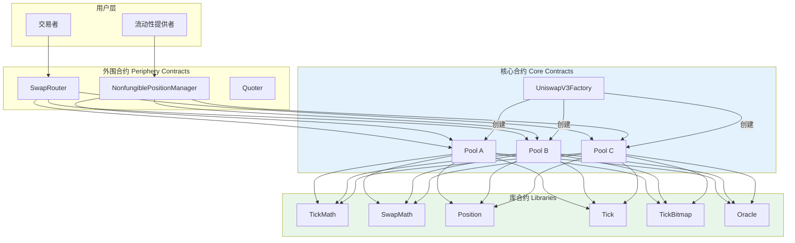

### 1.2 核心设计原则

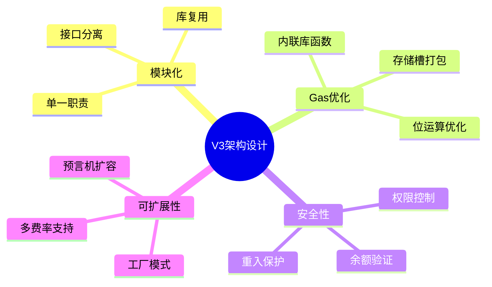

---

## 2. Factory合约：单例工厂模式

### 2.1 工厂合约的职责

Factory合约是整个协议的入口点，负责池子的创建和参数管理：

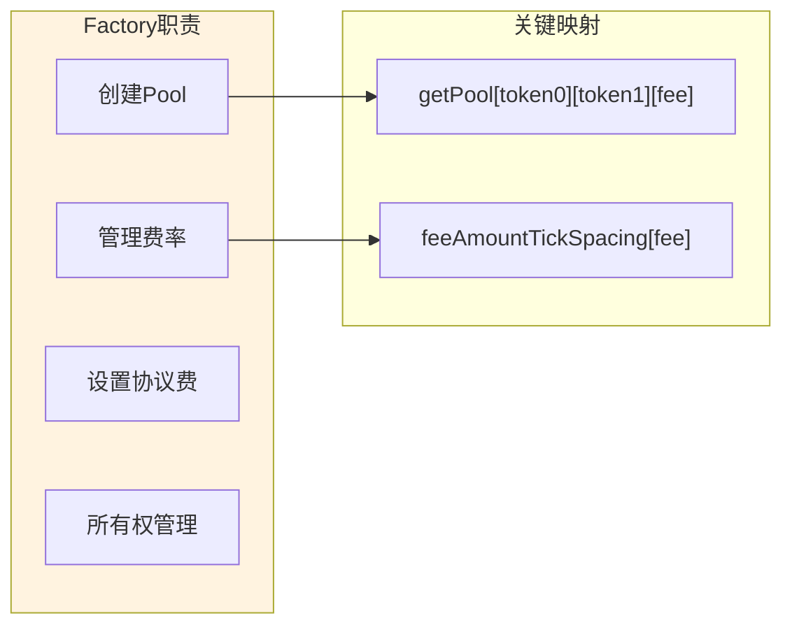

### 2.2 核心数据结构

```solidity
contract UniswapV3Factory is IUniswapV3Factory, UniswapV3PoolDeployer, NoDelegateCall {
    address public override owner;

    // 三层嵌套映射：确保每个代币对+费率只有一个池子
    mapping(address => mapping(address => mapping(uint24 => address))) public override getPool;

    // 费率与Tick间距的绑定关系
    mapping(uint24 => int24) public override feeAmountTickSpacing;

    constructor() {
        owner = msg.sender;
        emit OwnerChanged(address(0), msg.sender);

        // 预设标准费率等级
        feeAmountTickSpacing[500] = 10;    // 0.05% fee
        feeAmountTickSpacing[3000] = 60;   // 0.30% fee
        feeAmountTickSpacing[10000] = 200; // 1.00% fee
    }
}
```

### 2.3 地址排序机制

代币地址排序是确保池子唯一性的关键设计：

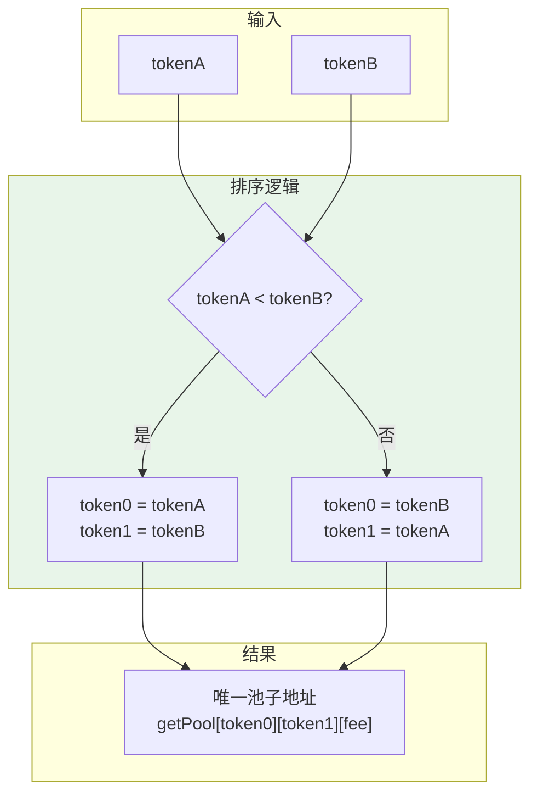

**地址排序的实现**：

```solidity
function createPool(
    address tokenA,
    address tokenB,
    uint24 fee
) external override noDelegateCall returns (address pool) {
    require(tokenA != tokenB);

    // 关键：地址排序确保唯一性
    (address token0, address token1) = tokenA < tokenB
        ? (tokenA, tokenB)
        : (tokenB, tokenA);

    require(token0 != address(0));

    int24 tickSpacing = feeAmountTickSpacing[fee];
    require(tickSpacing != 0);
    require(getPool[token0][token1][fee] == address(0));

    pool = deploy(address(this), token0, token1, fee, tickSpacing);

    // 双向映射优化查询
    getPool[token0][token1][fee] = pool;
    getPool[token1][token0][fee] = pool;

    emit PoolCreated(token0, token1, fee, tickSpacing, pool);
}
```

**设计优势**：

| 特性 | 说明 |
|------|------|
| 唯一性保证 | 相同代币对在特定费率下只能有一个池子 |
| 查询优化 | 无论查询顺序如何都能找到正确池子 |
| 存储效率 | 避免重复存储相同的池子 |
| 前端友好 | 简化前端的池子查找逻辑 |

---

## 3. Pool合约：状态管理精髓

### 3.1 接口的模块化组合

V3将Pool接口拆分为多个子接口，体现了接口隔离原则：

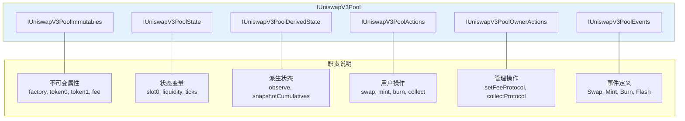

```solidity
// 接口的模块化组合
interface IUniswapV3Pool is
    IUniswapV3PoolImmutables,    // 不可变属性
    IUniswapV3PoolState,         // 状态变量
    IUniswapV3PoolDerivedState,  // 派生状态
    IUniswapV3PoolActions,       // 用户操作
    IUniswapV3PoolOwnerActions,  // 管理员操作
    IUniswapV3PoolEvents         // 事件定义
{
    // 空接口，纯组合
}
```

### 3.2 Slot0：极致的存储优化

Slot0是V3最精妙的存储优化设计，将多个状态变量打包到单个存储槽中：

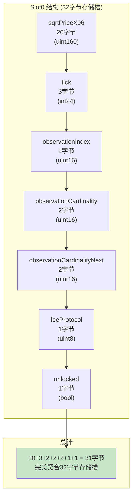

```solidity
struct Slot0 {
    // 当前价格√P (Q64.96格式)
    uint160 sqrtPriceX96;              // 20字节

    // 当前tick
    int24 tick;                        // 3字节

    // 预言机观察者数组当前索引
    uint16 observationIndex;           // 2字节

    // 预言机数组当前容量
    uint16 observationCardinality;     // 2字节

    // 预言机数组目标容量
    uint16 observationCardinalityNext; // 2字节

    // 协议费率 (4位token0 + 4位token1)
    uint8 feeProtocol;                 // 1字节

    // 重入保护锁
    bool unlocked;                     // 1字节
}
// 总计：31字节，完美契合32字节存储槽
```

**Gas优化效果**：

| 操作 | 传统设计 | Slot0设计 | 节省 |
|------|---------|----------|------|
| 读取价格+tick | 4200 gas | 2100 gas | 50% |
| 更新价格+tick | 10000+ gas | 5000 gas | 50%+ |
| swap单次读取 | 多次SLOAD | 单次SLOAD | 显著 |

### 3.3 Pool合约完整状态

```solidity
contract UniswapV3Pool {
    // 核心状态变量
    Slot0 public override slot0;

    // 全局费用增长累积器
    uint256 public override feeGrowthGlobal0X128;
    uint256 public override feeGrowthGlobal1X128;

    // 协议费用累积
    struct ProtocolFees {
        uint128 token0;
        uint128 token1;
    }
    ProtocolFees public override protocolFees;

    // 当前有效流动性
    uint128 public override liquidity;

    // 核心数据结构映射
    mapping(int24 => Tick.Info) public override ticks;
    mapping(int16 => uint256) public override tickBitmap;
    mapping(bytes32 => Position.Info) public override positions;

    // 预言机观察者数组（固定大小）
    Oracle.Observation[65535] public override observations;
}
```

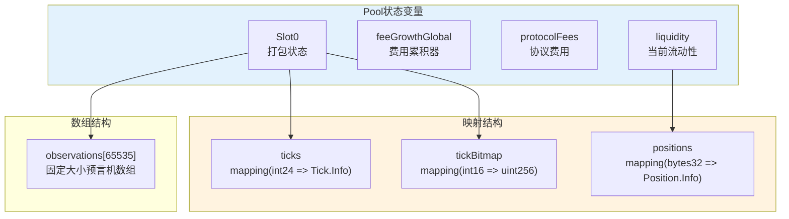

---

## 4. Library模式：代码复用与Gas优化

### 4.1 核心库概览

V3大量使用library实现代码复用和gas优化：

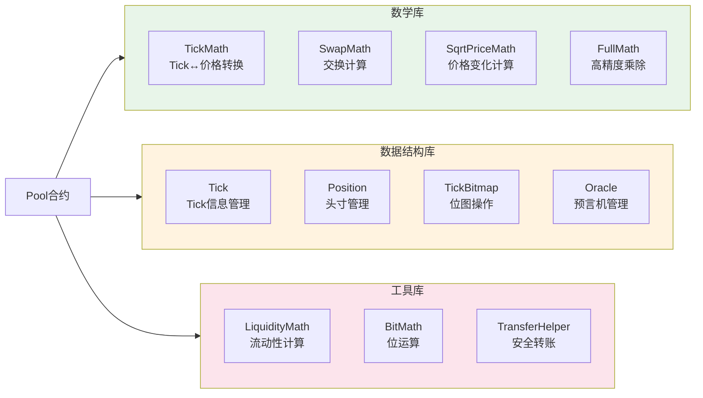

### 4.2 TickMath库

```solidity
library TickMath {
    int24 internal constant MIN_TICK = -887272;
    int24 internal constant MAX_TICK = -MIN_TICK;

    uint160 internal constant MIN_SQRT_RATIO = 4295128739;
    uint160 internal constant MAX_SQRT_RATIO =
        1461446703485210103287273052203988822378723970342;

    // Tick → √Price 转换
    function getSqrtRatioAtTick(int24 tick)
        internal pure returns (uint160 sqrtPriceX96);

    // √Price → Tick 转换
    function getTickAtSqrtRatio(uint160 sqrtPriceX96)
        internal pure returns (int24 tick);
}
```

### 4.3 SwapMath库

SwapMath处理交换过程中的核心数学计算：

```solidity
library SwapMath {
    /// @notice 计算单步交换的结果
    function computeSwapStep(
        uint160 sqrtRatioCurrentX96,    // 当前价格
        uint160 sqrtRatioTargetX96,     // 目标价格
        uint128 liquidity,              // 当前流动性
        int256 amountRemaining,         // 剩余数量
        uint24 feePips                  // 费率
    ) internal pure returns (
        uint160 sqrtRatioNextX96,       // 新价格
        uint256 amountIn,               // 输入数量
        uint256 amountOut,              // 输出数量
        uint256 feeAmount               // 费用
    );
}
```

### 4.4 Position库

```solidity
library Position {
    struct Info {
        // 流动性数量
        uint128 liquidity;

        // 上次更新时的内部费用增长率
        uint256 feeGrowthInside0LastX128;
        uint256 feeGrowthInside1LastX128;

        // 待领取的费用
        uint128 tokensOwed0;
        uint128 tokensOwed1;
    }

    /// @notice 获取头寸
    function get(
        mapping(bytes32 => Info) storage self,
        address owner,
        int24 tickLower,
        int24 tickUpper
    ) internal view returns (Position.Info storage position) {
        position = self[keccak256(abi.encodePacked(owner, tickLower, tickUpper))];
    }

    /// @notice 更新头寸
    function update(
        Info storage self,
        int128 liquidityDelta,
        uint256 feeGrowthInside0X128,
        uint256 feeGrowthInside1X128
    ) internal;
}
```

**Library设计优势**：

| 优势 | 说明 |
|------|------|
| 代码复用 | 同样的数学逻辑被多个合约使用 |
| Gas优化 | 库函数在编译时内联，避免外部调用开销 |
| 安全性 | 核心数学逻辑集中维护，降低错误风险 |
| 模块化 | 功能分离便于测试和审计 |
| 升级性 | 可通过代理模式实现逻辑升级 |

---

## 5. 核心数据结构设计

### 5.1 Tick数据结构

Tick.Info存储了每个初始化tick的完整信息：

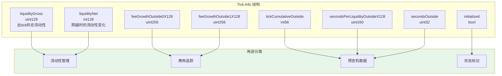

```solidity
library Tick {
    struct Info {
        // 此tick的总流动性（用于限制单tick最大流动性）
        uint128 liquidityGross;

        // 从左向右跨越此tick时的流动性变化
        // 正值：增加流动性；负值：减少流动性
        int128 liquidityNet;

        // tick外部的费用增长（用于计算区间内费用）
        uint256 feeGrowthOutside0X128;
        uint256 feeGrowthOutside1X128;

        // tick外部的累积tick值（预言机用）
        int56 tickCumulativeOutside;

        // tick外部的每流动性秒数（预言机用）
        uint160 secondsPerLiquidityOutsideX128;

        // tick外部的累积秒数
        uint32 secondsOutside;

        // 是否已初始化
        bool initialized;
    }
}
```

### 5.2 liquidityNet的精妙设计

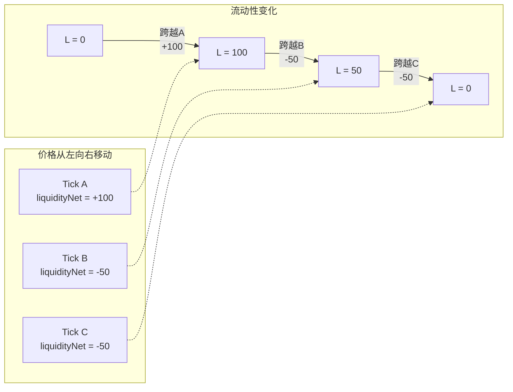

**liquidityNet符号约定**：
- **正值**：从左向右跨越时**增加**流动性（进入某个LP的区间下界）
- **负值**：从左向右跨越时**减少**流动性（离开某个LP的区间上界）

### 5.3 Tick跨越的"翻转"技巧

```solidity
function cross(
    mapping(int24 => Tick.Info) storage self,
    int24 tick,
    uint256 feeGrowthGlobal0X128,
    uint256 feeGrowthGlobal1X128,
    uint160 secondsPerLiquidityCumulativeX128,
    int56 tickCumulative,
    uint32 time
) internal returns (int128 liquidityNet) {
    Tick.Info storage info = self[tick];

    // "翻转"技巧：将outside值变为新的outside值
    info.feeGrowthOutside0X128 = feeGrowthGlobal0X128 - info.feeGrowthOutside0X128;
    info.feeGrowthOutside1X128 = feeGrowthGlobal1X128 - info.feeGrowthOutside1X128;
    info.secondsPerLiquidityOutsideX128 =
        secondsPerLiquidityCumulativeX128 - info.secondsPerLiquidityOutsideX128;
    info.tickCumulativeOutside = tickCumulative - info.tickCumulativeOutside;
    info.secondsOutside = time - info.secondsOutside;

    liquidityNet = info.liquidityNet;
}
```

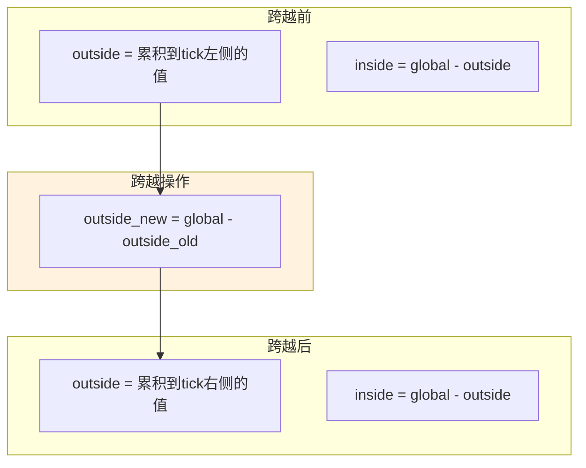

**数学原理**：当价格跨越tick时，"外部"和"内部"的概念发生翻转。通过简单的减法操作，原来的outside值就变成了新的outside值。

### 5.4 Position数据结构

```solidity
struct Position.Info {
    // 此位置的流动性数量
    uint128 liquidity;

    // 上次更新时的内部费用增长率
    uint256 feeGrowthInside0LastX128;
    uint256 feeGrowthInside1LastX128;

    // 累积的未领取费用
    uint128 tokensOwed0;
    uint128 tokensOwed1;
}
```

### 5.5 费用计算机制

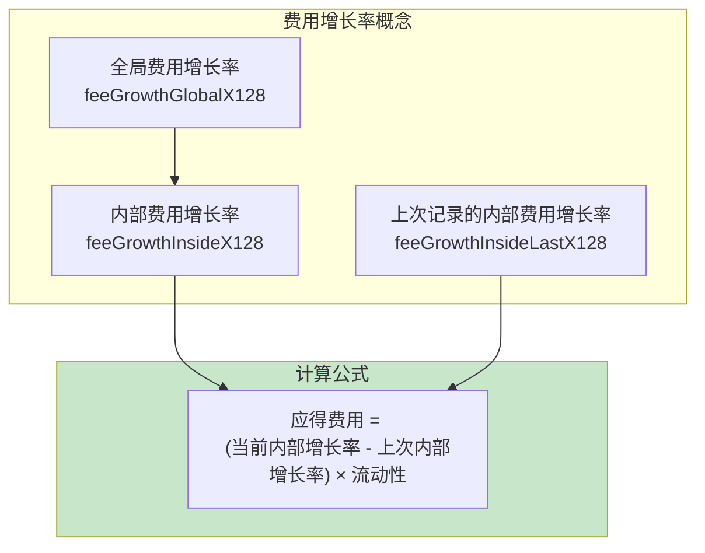

```solidity
function update(
    Info storage self,
    int128 liquidityDelta,
    uint256 feeGrowthInside0X128,
    uint256 feeGrowthInside1X128
) internal {
    Info memory _self = self;

    // 计算自上次更新以来的费用增长
    uint128 tokensOwed0 = uint128(
        FullMath.mulDiv(
            feeGrowthInside0X128 - _self.feeGrowthInside0LastX128,
            _self.liquidity,
            FixedPoint128.Q128
        )
    );

    uint128 tokensOwed1 = uint128(
        FullMath.mulDiv(
            feeGrowthInside1X128 - _self.feeGrowthInside1LastX128,
            _self.liquidity,
            FixedPoint128.Q128
        )
    );

    // 更新流动性
    if (liquidityDelta != 0) {
        self.liquidity = LiquidityMath.addDelta(_self.liquidity, liquidityDelta);
    }

    // 更新费用增长记录点
    self.feeGrowthInside0LastX128 = feeGrowthInside0X128;
    self.feeGrowthInside1LastX128 = feeGrowthInside1X128;

    // 累积欠付费用
    if (tokensOwed0 > 0 || tokensOwed1 > 0) {
        self.tokensOwed0 += tokensOwed0;
        self.tokensOwed1 += tokensOwed1;
    }
}
```

**费用计算设计优势**：

| 特性 | 说明 |
|------|------|
| O(1)复杂度 | 无论时间间隔多长，计算复杂度都是常数 |
| 精确累积 | 避免复合计算中的精度损失 |
| 存储高效 | 只存储差值而非绝对值 |
| 自动更新 | 每次流动性变化时自动更新费用 |

---

## 6. 安全机制设计

### 6.1 重入保护

```solidity
modifier lock() {
    require(slot0.unlocked, 'LOK');
    slot0.unlocked = false;
    _;
    slot0.unlocked = true;
}
```

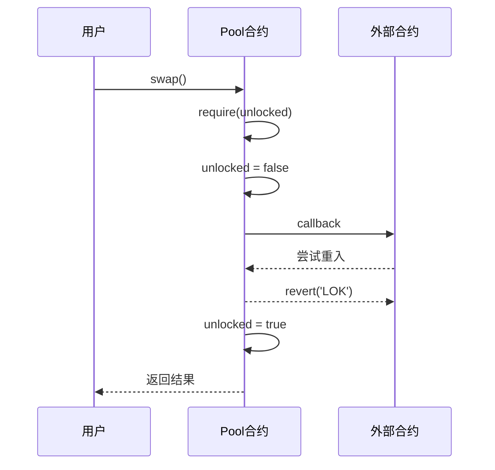

### 6.2 NoDelegateCall保护

```solidity
abstract contract NoDelegateCall {
    address private immutable original;

    constructor() {
        original = address(this);
    }

    modifier noDelegateCall() {
        require(address(this) == original);
        _;
    }
}
```

### 6.3 回调验证机制

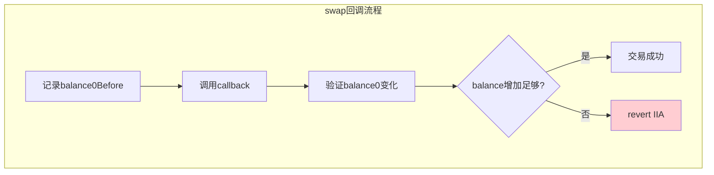

```solidity
// 在swap函数中
uint256 balance0Before = balance0();
IUniswapV3SwapCallback(msg.sender).uniswapV3SwapCallback(amount0, amount1, data);
require(balance0Before.add(uint256(amount0)) <= balance0(), 'IIA');
```

---

## 7. 本章小结

### 7.1 架构设计要点

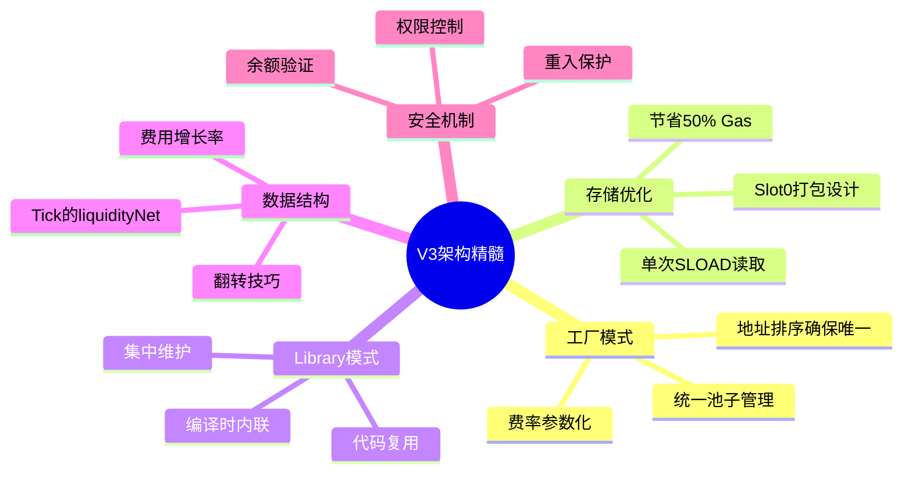

### 7.2 关键设计模式总结

| 模式 | 应用场景 | 效果 |
|------|---------|------|
| 单例工厂 | Pool创建 | 统一管理，确保唯一性 |
| 接口隔离 | IUniswapV3Pool | 职责分离，易于维护 |
| 存储槽打包 | Slot0 | 50%+ Gas节省 |
| 库内联 | 所有Library | 消除外部调用开销 |
| 增量累积 | 费用计算 | O(1)时间复杂度 |

---

## 下一篇预告

在下一篇文章中，我们将深入探讨**交换机制深度解析**，包括：
- swap函数的完整执行流程
- 跨Tick交换的实现细节
- 价格发现机制
- 滑点控制与保护

---

## 参考资料

- [Uniswap V3 Core - UniswapV3Factory.sol](https://github.com/Uniswap/v3-core/blob/main/contracts/UniswapV3Factory.sol)
- [Uniswap V3 Core - UniswapV3Pool.sol](https://github.com/Uniswap/v3-core/blob/main/contracts/UniswapV3Pool.sol)
- [Uniswap V3 Core - Libraries](https://github.com/Uniswap/v3-core/tree/main/contracts/libraries)
