# 死磕Uniswap V3（四）：交换机制深度解析

> 本文是「死磕Uniswap V3」系列的第四篇，深入剖析V3的核心交换函数swap()的完整执行流程。

## 系列导航

| 序号 | 标题 | 核心内容 |
|------|------|----------|
| 01 | 概述与集中流动性 | AMM演进、集中流动性原理 |
| 02 | Tick机制与价格数学 | Tick设计、价格转换算法 |
| 03 | 架构与合约设计 | Factory、Pool合约结构 |
| **04** | **交换机制深度解析** | **swap函数、价格发现** |
| 05 | 流动性管理与头寸 | Position、mint/burn |
| 06 | 费用系统与预言机 | 费用分配、TWAP |
| 07 | MEV与套利策略 | JIT、三明治攻击 |

---

## 1. 交换函数概览

### 1.1 swap函数的核心职责

swap函数是Uniswap V3中最复杂也最核心的函数，负责处理所有代币交换逻辑：

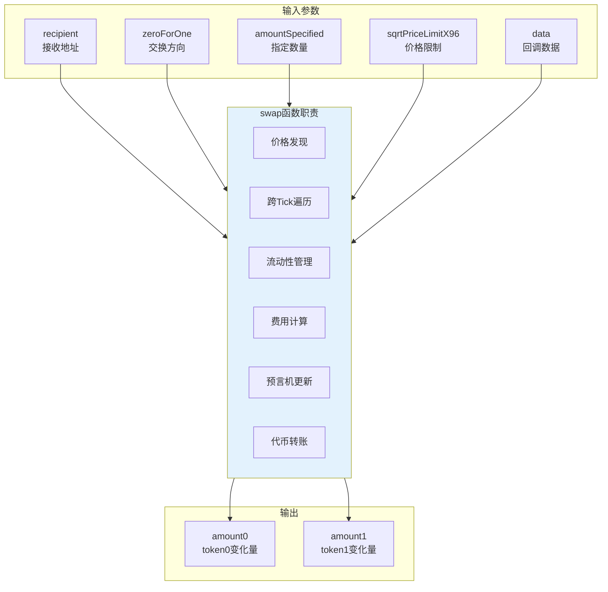

### 1.2 函数签名详解

```solidity
function swap(
    address recipient,          // 输出代币接收地址
    bool zeroForOne,           // true: token0→token1, false: token1→token0
    int256 amountSpecified,    // 正数=精确输入, 负数=精确输出
    uint160 sqrtPriceLimitX96, // 价格滑点保护限制
    bytes calldata data        // 回调函数的附加数据
) external override noDelegateCall returns (
    int256 amount0,            // token0的净变化量
    int256 amount1             // token1的净变化量
);
```

**参数含义详解**：

| 参数 | 类型 | 说明 |
|------|------|------|
| recipient | address | 接收输出代币的地址 |
| zeroForOne | bool | 交换方向标志 |
| amountSpecified | int256 | 正数=exactInput，负数=exactOutput |
| sqrtPriceLimitX96 | uint160 | 最大允许的价格变动 |
| data | bytes | 传递给回调函数的数据 |

### 1.3 交换方向与价格关系

```mermaid
flowchart LR
    subgraph "zeroForOne = true"
        direction TB
        A1[卖出token0]
        A2[买入token1]
        A3[价格下降]
        A4[tick减小]
        A1 --> A2 --> A3 --> A4
    end

    subgraph "zeroForOne = false"
        direction TB
        B1[卖出token1]
        B2[买入token0]
        B3[价格上升]
        B4[tick增大]
        B1 --> B2 --> B3 --> B4
    end

    style "zeroForOne = true" fill:#ffcdd2
    style "zeroForOne = false" fill:#c8e6c9
```

---

## 2. 核心数据结构

### 2.1 SwapState：交换状态追踪

SwapState结构体在整个交换循环中追踪状态变化：

```solidity
struct SwapState {
    // 剩余待交换的数量
    int256 amountSpecifiedRemaining;

    // 已计算的对应数量
    int256 amountCalculated;

    // 当前价格
    uint160 sqrtPriceX96;

    // 当前tick
    int24 tick;

    // 输入代币的全局费用增长率
    uint256 feeGrowthGlobalX128;

    // 协议费用累积
    uint128 protocolFee;

    // 当前有效流动性
    uint128 liquidity;
}
```

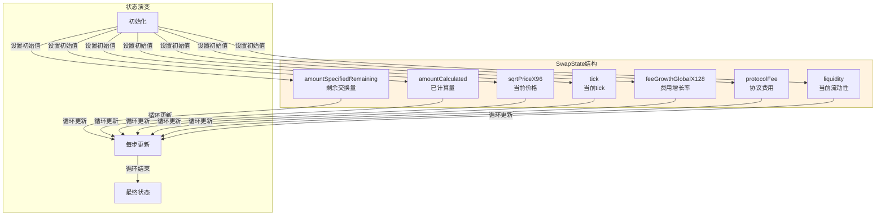

### 2.2 SwapCache：交换缓存

SwapCache存储交换过程中不变或很少变化的数据：

```solidity
struct SwapCache {
    // 交换开始时的流动性
    uint128 liquidityStart;

    // 区块时间戳
    uint32 blockTimestamp;

    // 协议费率（针对输入代币）
    uint8 feeProtocol;

    // 每流动性秒数累积值
    uint160 secondsPerLiquidityCumulativeX128;

    // tick累积值
    int56 tickCumulative;

    // 是否已计算最新观察值
    bool computedLatestObservation;
}
```

### 2.3 StepComputations：单步计算结果

每次循环迭代的计算结果：

```solidity
struct StepComputations {
    // 本步开始时的价格
    uint160 sqrtPriceStartX96;

    // 下一个目标tick
    int24 tickNext;

    // 下一个tick是否已初始化
    bool initialized;

    // 目标价格
    uint160 sqrtPriceNextX96;

    // 本步输入数量
    uint256 amountIn;

    // 本步输出数量
    uint256 amountOut;

    // 本步费用
    uint256 feeAmount;
}
```

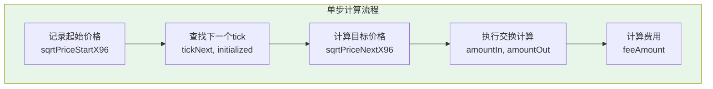

---

## 3. 交换执行流程

### 3.1 完整流程图

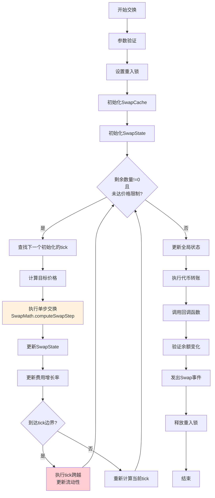

### 3.2 初始化阶段

```solidity
function swap(...) external override noDelegateCall returns (...) {
    // 1. 参数验证
    require(amountSpecified != 0, 'AS');

    Slot0 memory slot0Start = slot0;
    require(slot0Start.unlocked, 'LOK');

    // 2. 价格限制验证
    require(
        zeroForOne
            ? sqrtPriceLimitX96 < slot0Start.sqrtPriceX96 &&
              sqrtPriceLimitX96 > TickMath.MIN_SQRT_RATIO
            : sqrtPriceLimitX96 > slot0Start.sqrtPriceX96 &&
              sqrtPriceLimitX96 < TickMath.MAX_SQRT_RATIO,
        'SPL'
    );

    // 3. 设置重入锁
    slot0.unlocked = false;

    // 4. 初始化缓存
    SwapCache memory cache = SwapCache({
        liquidityStart: liquidity,
        blockTimestamp: _blockTimestamp(),
        feeProtocol: zeroForOne
            ? (slot0Start.feeProtocol % 16)
            : (slot0Start.feeProtocol >> 4),
        secondsPerLiquidityCumulativeX128: 0,
        tickCumulative: 0,
        computedLatestObservation: false
    });

    // 5. 初始化状态
    bool exactInput = amountSpecified > 0;
    SwapState memory state = SwapState({
        amountSpecifiedRemaining: amountSpecified,
        amountCalculated: 0,
        sqrtPriceX96: slot0Start.sqrtPriceX96,
        tick: slot0Start.tick,
        feeGrowthGlobalX128: zeroForOne
            ? feeGrowthGlobal0X128
            : feeGrowthGlobal1X128,
        protocolFee: 0,
        liquidity: cache.liquidityStart
    });

    // ... 主循环
}
```

**价格限制验证的逻辑**：

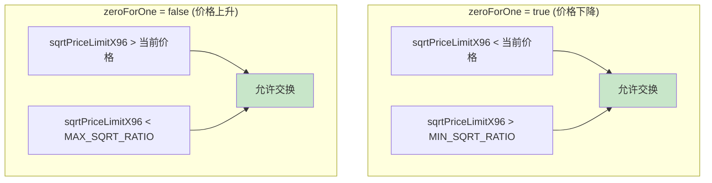

### 3.3 主循环：跨Tick交换

```solidity
// 主交换循环
while (state.amountSpecifiedRemaining != 0 &&
       state.sqrtPriceX96 != sqrtPriceLimitX96) {

    StepComputations memory step;
    step.sqrtPriceStartX96 = state.sqrtPriceX96;

    // 1. 查找下一个初始化的tick
    (step.tickNext, step.initialized) = tickBitmap
        .nextInitializedTickWithinOneWord(
            state.tick,
            tickSpacing,
            zeroForOne
        );

    // 2. tick边界检查
    if (step.tickNext < TickMath.MIN_TICK) {
        step.tickNext = TickMath.MIN_TICK;
    } else if (step.tickNext > TickMath.MAX_TICK) {
        step.tickNext = TickMath.MAX_TICK;
    }

    // 3. 计算目标价格
    step.sqrtPriceNextX96 = TickMath.getSqrtRatioAtTick(step.tickNext);

    // 4. 执行单步交换
    (state.sqrtPriceX96, step.amountIn, step.amountOut, step.feeAmount) =
        SwapMath.computeSwapStep(
            state.sqrtPriceX96,
            // 取价格限制和目标价格中更接近当前价格的值
            (zeroForOne
                ? step.sqrtPriceNextX96 < sqrtPriceLimitX96
                : step.sqrtPriceNextX96 > sqrtPriceLimitX96)
                ? sqrtPriceLimitX96
                : step.sqrtPriceNextX96,
            state.liquidity,
            state.amountSpecifiedRemaining,
            fee
        );

    // 5. 更新状态
    // ... (后续详解)
}
```

```mermaid
sequenceDiagram
    participant Loop as 主循环
    participant Bitmap as TickBitmap
    participant Math as SwapMath
    participant State as SwapState

    Loop->>Bitmap: 查找下一个tick
    Bitmap-->>Loop: tickNext, initialized
    Loop->>Math: getSqrtRatioAtTick(tickNext)
    Math-->>Loop: sqrtPriceNextX96
    Loop->>Math: computeSwapStep(...)
    Math-->>Loop: newPrice, amountIn, amountOut, fee
    Loop->>State: 更新状态
    State-->>Loop: 继续或退出循环
```

---

## 4. SwapMath：核心计算引擎

### 4.1 computeSwapStep函数解析

这是整个交换过程中最核心的数学计算函数：

```solidity
function computeSwapStep(
    uint160 sqrtRatioCurrentX96,    // 当前价格
    uint160 sqrtRatioTargetX96,     // 目标价格（tick边界或价格限制）
    uint128 liquidity,              // 当前流动性
    int256 amountRemaining,         // 剩余交换数量
    uint24 feePips                  // 费率（以百万分之一为单位）
) internal pure returns (
    uint160 sqrtRatioNextX96,       // 交换后的新价格
    uint256 amountIn,               // 输入数量
    uint256 amountOut,              // 输出数量
    uint256 feeAmount               // 费用
) {
    bool zeroForOne = sqrtRatioCurrentX96 >= sqrtRatioTargetX96;
    bool exactIn = amountRemaining >= 0;

    // ... 详细计算逻辑
}
```

### 4.2 精确输入模式（exactIn = true）

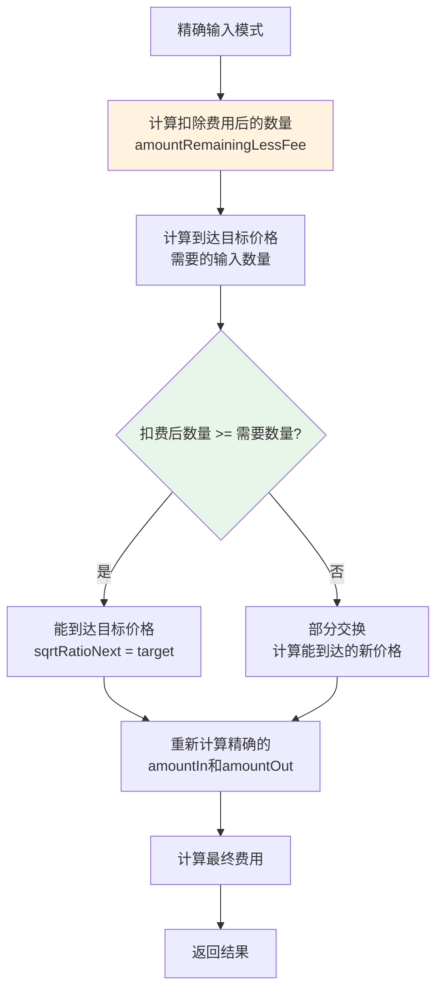

```solidity
if (exactIn) {
    // 扣除费用后的可用数量
    uint256 amountRemainingLessFee = FullMath.mulDiv(
        uint256(amountRemaining),
        1e6 - feePips,
        1e6
    );

    // 计算到达目标价格需要的输入数量
    amountIn = zeroForOne
        ? SqrtPriceMath.getAmount0Delta(
            sqrtRatioTargetX96, sqrtRatioCurrentX96, liquidity, true)
        : SqrtPriceMath.getAmount1Delta(
            sqrtRatioCurrentX96, sqrtRatioTargetX96, liquidity, true);

    // 判断能否到达目标价格
    if (amountRemainingLessFee >= amountIn) {
        sqrtRatioNextX96 = sqrtRatioTargetX96;
    } else {
        // 计算在给定输入下能到达的新价格
        sqrtRatioNextX96 = SqrtPriceMath.getNextSqrtPriceFromInput(
            sqrtRatioCurrentX96,
            liquidity,
            amountRemainingLessFee,
            zeroForOne
        );
    }
}
```

### 4.3 精确输出模式（exactIn = false）

```solidity
else {
    // 计算到达目标价格能获得的输出数量
    amountOut = zeroForOne
        ? SqrtPriceMath.getAmount1Delta(
            sqrtRatioTargetX96, sqrtRatioCurrentX96, liquidity, false)
        : SqrtPriceMath.getAmount0Delta(
            sqrtRatioCurrentX96, sqrtRatioTargetX96, liquidity, false);

    // 判断能否满足输出需求
    if (uint256(-amountRemaining) >= amountOut) {
        sqrtRatioNextX96 = sqrtRatioTargetX96;
    } else {
        // 计算产生指定输出所需的新价格
        sqrtRatioNextX96 = SqrtPriceMath.getNextSqrtPriceFromOutput(
            sqrtRatioCurrentX96,
            liquidity,
            uint256(-amountRemaining),
            zeroForOne
        );
    }
}
```

### 4.4 费用计算策略

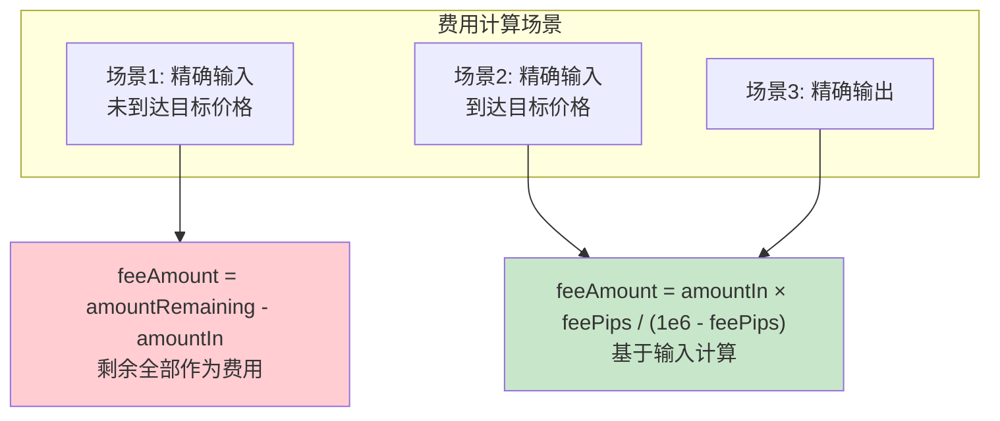

```solidity
// 计算费用
if (exactIn && sqrtRatioNextX96 != sqrtRatioTargetX96) {
    // 未到达目标价格，剩余输入全部作为费用
    feeAmount = uint256(amountRemaining) - amountIn;
} else {
    // 基于实际输入计算费用
    feeAmount = FullMath.mulDivRoundingUp(
        amountIn,
        feePips,
        1e6 - feePips
    );
}
```

---

## 5. 跨Tick处理机制

### 5.1 Tick跨越的触发条件

```mermaid
flowchart TD
    AFTER_SWAP[单步交换后] --> CHECK{新价格 == 目标价格?}

    CHECK -->|是| INIT_CHECK{目标tick已初始化?}
    CHECK -->|否| RECALC[重新计算当前tick<br/>getTickAtSqrtRatio]

    INIT_CHECK -->|是| CROSS[执行tick跨越]
    INIT_CHECK -->|否| UPDATE_TICK[仅更新tick索引]

    CROSS --> UPDATE_ORACLE[更新预言机<br/>（如果需要）]
    UPDATE_ORACLE --> CROSS_TICK[调用ticks.cross()]
    CROSS_TICK --> UPDATE_LIQ[更新活跃流动性]
    UPDATE_LIQ --> NEXT_TICK[设置下一个tick]

    UPDATE_TICK --> NEXT_TICK
    RECALC --> CONTINUE[继续循环]
    NEXT_TICK --> CONTINUE

    style CROSS fill:#fff3e0
    style UPDATE_LIQ fill:#e8f5e9
```

### 5.2 Tick跨越代码实现

```solidity
// 处理tick跨越
if (state.sqrtPriceX96 == step.sqrtPriceNextX96) {
    // 到达了tick边界
    if (step.initialized) {
        // 首次跨越时计算预言机数据
        if (!cache.computedLatestObservation) {
            (cache.tickCumulative, cache.secondsPerLiquidityCumulativeX128) =
                observations.observeSingle(
                    cache.blockTimestamp,
                    0,
                    slot0Start.tick,
                    slot0Start.observationIndex,
                    cache.liquidityStart,
                    slot0Start.observationCardinality
                );
            cache.computedLatestObservation = true;
        }

        // 执行tick跨越，获取流动性变化
        int128 liquidityNet = ticks.cross(
            step.tickNext,
            (zeroForOne ? state.feeGrowthGlobalX128 : feeGrowthGlobal0X128),
            (zeroForOne ? feeGrowthGlobal1X128 : state.feeGrowthGlobalX128),
            cache.secondsPerLiquidityCumulativeX128,
            cache.tickCumulative,
            cache.blockTimestamp
        );

        // 根据方向调整流动性变化的符号
        if (zeroForOne) liquidityNet = -liquidityNet;

        // 更新活跃流动性
        state.liquidity = LiquidityMath.addDelta(
            state.liquidity,
            liquidityNet
        );
    }

    // 更新当前tick
    state.tick = zeroForOne ? step.tickNext - 1 : step.tickNext;
} else if (state.sqrtPriceX96 != step.sqrtPriceStartX96) {
    // 价格变化但未到达tick边界，重新计算tick
    state.tick = TickMath.getTickAtSqrtRatio(state.sqrtPriceX96);
}
```

### 5.3 流动性变化的方向处理

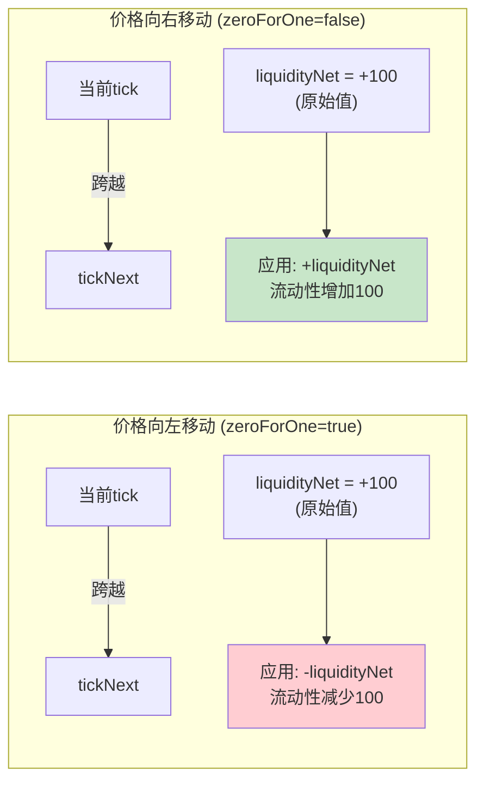

**关键理解**：liquidityNet的符号是基于"从左向右"跨越定义的，所以当价格向左移动时需要取反。

---

## 6. 状态更新与结算

### 6.1 循环内状态更新

```solidity
// 更新剩余数量和已计算数量
if (exactInput) {
    state.amountSpecifiedRemaining -=
        (step.amountIn + step.feeAmount).toInt256();
    state.amountCalculated = state.amountCalculated.sub(
        step.amountOut.toInt256()
    );
} else {
    state.amountSpecifiedRemaining += step.amountOut.toInt256();
    state.amountCalculated = state.amountCalculated.add(
        (step.amountIn + step.feeAmount).toInt256()
    );
}

// 协议费用计算
if (cache.feeProtocol > 0) {
    uint256 delta = step.feeAmount / cache.feeProtocol;
    step.feeAmount -= delta;
    state.protocolFee += uint128(delta);
}

// 更新全局费用增长率
if (state.liquidity > 0) {
    state.feeGrowthGlobalX128 += FullMath.mulDiv(
        step.feeAmount,
        FixedPoint128.Q128,
        state.liquidity
    );
}
```

### 6.2 循环后全局状态更新

```solidity
// 更新slot0
if (state.tick != slot0Start.tick) {
    (uint16 observationIndex, uint16 observationCardinality) =
        observations.write(
            slot0Start.observationIndex,
            cache.blockTimestamp,
            slot0Start.tick,
            cache.liquidityStart,
            slot0Start.observationCardinality,
            slot0Start.observationCardinalityNext
        );

    (slot0.sqrtPriceX96, slot0.tick,
     slot0.observationIndex, slot0.observationCardinality) = (
        state.sqrtPriceX96,
        state.tick,
        observationIndex,
        observationCardinality
    );
} else {
    slot0.sqrtPriceX96 = state.sqrtPriceX96;
}

// 更新流动性
if (cache.liquidityStart != state.liquidity) {
    liquidity = state.liquidity;
}

// 更新费用增长率和协议费用
if (zeroForOne) {
    feeGrowthGlobal0X128 = state.feeGrowthGlobalX128;
    if (state.protocolFee > 0) {
        protocolFees.token0 += state.protocolFee;
    }
} else {
    feeGrowthGlobal1X128 = state.feeGrowthGlobalX128;
    if (state.protocolFee > 0) {
        protocolFees.token1 += state.protocolFee;
    }
}
```

### 6.3 代币转账与回调

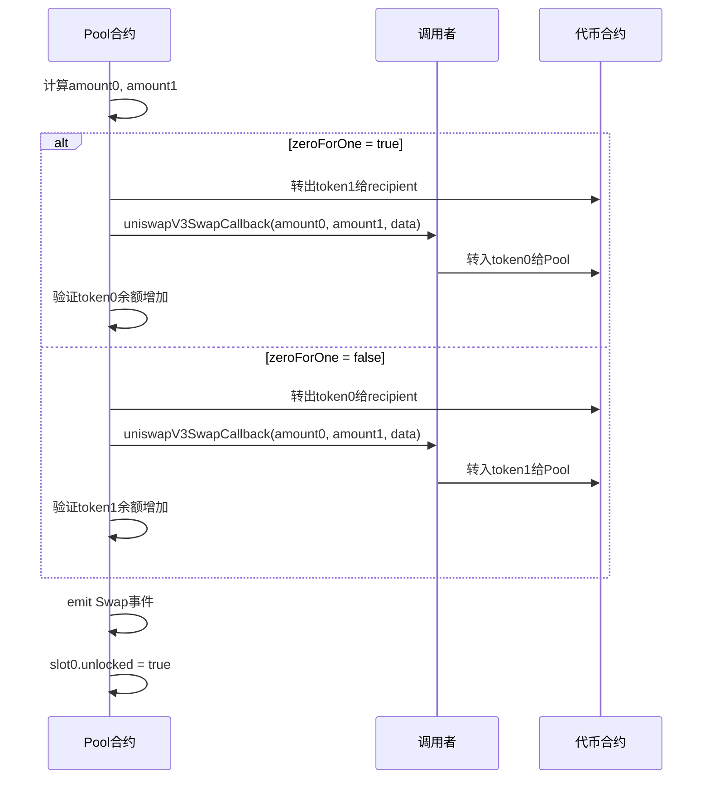

```solidity
// 计算最终数量
(amount0, amount1) = zeroForOne == exactInput
    ? (amountSpecified - state.amountSpecifiedRemaining,
       state.amountCalculated)
    : (state.amountCalculated,
       amountSpecified - state.amountSpecifiedRemaining);

// 执行转账和回调
if (zeroForOne) {
    if (amount1 < 0) {
        TransferHelper.safeTransfer(token1, recipient, uint256(-amount1));
    }

    uint256 balance0Before = balance0();
    IUniswapV3SwapCallback(msg.sender).uniswapV3SwapCallback(
        amount0, amount1, data
    );
    require(balance0Before.add(uint256(amount0)) <= balance0(), 'IIA');
} else {
    if (amount0 < 0) {
        TransferHelper.safeTransfer(token0, recipient, uint256(-amount0));
    }

    uint256 balance1Before = balance1();
    IUniswapV3SwapCallback(msg.sender).uniswapV3SwapCallback(
        amount0, amount1, data
    );
    require(balance1Before.add(uint256(amount1)) <= balance1(), 'IIA');
}

emit Swap(msg.sender, recipient, amount0, amount1,
          state.sqrtPriceX96, state.liquidity, state.tick);

slot0.unlocked = true;
```

---

## 7. 滑点保护机制

### 7.1 价格限制的作用

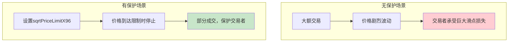

### 7.2 Router层的滑点保护

```solidity
// SwapRouter中的滑点保护
function exactInputSingle(
    ExactInputSingleParams calldata params
) external payable override checkDeadline(params.deadline)
  returns (uint256 amountOut) {

    amountOut = exactInputInternal(
        params.amountIn,
        params.recipient,
        params.sqrtPriceLimitX96,
        SwapCallbackData({
            path: abi.encodePacked(
                params.tokenIn, params.fee, params.tokenOut
            ),
            payer: msg.sender
        })
    );

    // 验证输出数量满足最小要求
    require(amountOut >= params.amountOutMinimum,
            'Too little received');
}
```

### 7.3 不同层次的保护机制

| 保护层 | 机制 | 作用 |
|--------|------|------|
| Pool层 | sqrtPriceLimitX96 | 限制最大价格变动 |
| Router层 | amountOutMinimum | 限制最小输出数量 |
| Router层 | deadline | 限制交易有效期 |
| 前端 | 滑点设置 | 用户可配置的容忍度 |

---

## 8. 价格发现机制

### 8.1 动态价格发现过程

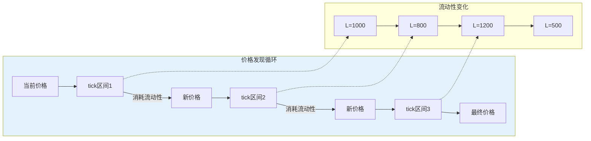

### 8.2 价格发现的特点

**分段线性**：
- 在每个tick区间内，价格变化是连续的
- 遵循恒定乘积公式的变体

**流动性跳跃**：
- 跨越tick时流动性可能突变
- 流动性变化影响后续的价格影响

**实时更新**：
- 每笔交易都即时更新价格
- 没有延迟或批处理

### 8.3 价格影响计算

```solidity
// 价格影响 = (新价格 - 旧价格) / 旧价格
function calculatePriceImpact(
    uint160 sqrtPriceBefore,
    uint160 sqrtPriceAfter
) internal pure returns (uint256 priceImpact) {
    if (sqrtPriceAfter > sqrtPriceBefore) {
        priceImpact = FullMath.mulDiv(
            sqrtPriceAfter - sqrtPriceBefore,
            FixedPoint96.Q96,
            sqrtPriceBefore
        );
    } else {
        priceImpact = FullMath.mulDiv(
            sqrtPriceBefore - sqrtPriceAfter,
            FixedPoint96.Q96,
            sqrtPriceBefore
        );
    }
}
```

---

## 9. 实际交换示例

### 9.1 场景设置

假设ETH/USDC池子，当前状态：
- 价格：2000 USDC/ETH
- 当前tick：69082
- 活跃流动性：1,000,000
- 费率：0.3% (3000)

用户想用1000 USDC换取ETH。

### 9.2 执行过程模拟

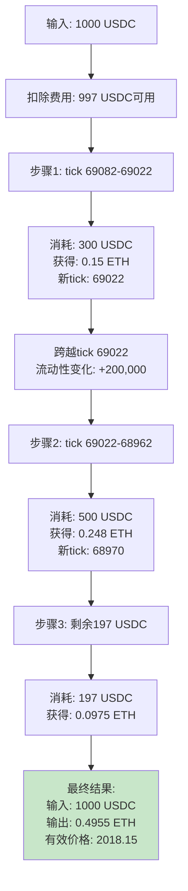

### 9.3 Gas消耗分析

| 操作 | 估计Gas |
|------|---------|
| 参数验证和初始化 | ~5,000 |
| 每次tick查找 | ~2,100 |
| 每次computeSwapStep | ~3,000 |
| 每次tick跨越 | ~15,000 |
| 状态更新 | ~5,000 |
| 代币转账 | ~50,000 |
| 回调执行 | ~30,000 |
| **总计（跨2个tick）** | **~125,000** |

---

## 10. 本章小结

### 10.1 核心概念回顾

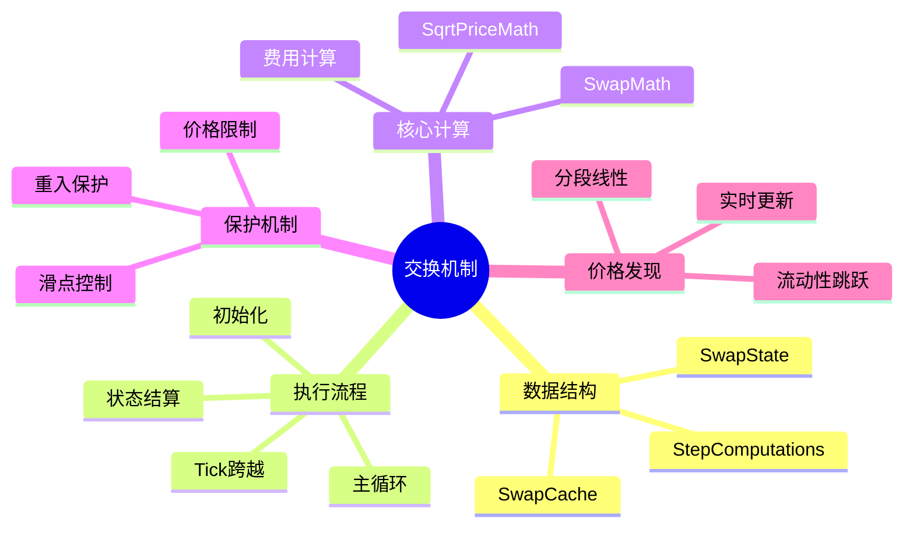

### 10.2 关键设计总结

| 设计要点 | 实现方式 | 效果 |
|----------|----------|------|
| 分步计算 | while循环 + StepComputations | 精确处理跨tick交换 |
| 状态追踪 | SwapState结构 | 完整记录交换过程 |
| 费用处理 | 费用增长率累积 | O(1)费用分配 |
| 滑点保护 | sqrtPriceLimitX96 | 防止价格过度滑动 |
| 安全机制 | 重入锁 + 余额验证 | 防止攻击 |

### 10.3 性能优化技巧

1. **单次SLOAD读取Slot0**：减少存储访问
2. **memory变量缓存**：避免重复读取storage
3. **批量状态更新**：循环结束后一次性更新
4. **位图快速查找**：O(1)找到下一个tick

---

## 下一篇预告

在下一篇文章中，我们将深入探讨**流动性管理与头寸**，包括：
- mint和burn函数的完整实现
- Position的创建和管理
- 流动性数量与代币数量的计算
- NFT流动性代币的铸造机制

---

## 参考资料

- [Uniswap V3 Core - UniswapV3Pool.sol](https://github.com/Uniswap/v3-core/blob/main/contracts/UniswapV3Pool.sol)
- [Uniswap V3 Core - SwapMath.sol](https://github.com/Uniswap/v3-core/blob/main/contracts/libraries/SwapMath.sol)
- [Uniswap V3 Core - SqrtPriceMath.sol](https://github.com/Uniswap/v3-core/blob/main/contracts/libraries/SqrtPriceMath.sol)
