# 死磕Uniswap V3（五）：流动性管理与头寸

> 本文是「死磕Uniswap V3」系列的第五篇，深入剖析V3的流动性管理机制、Position数据结构以及mint/burn操作的完整实现。

## 系列导航

| 序号 | 标题 | 核心内容 |
|------|------|----------|
| 01 | 概述与集中流动性 | AMM演进、集中流动性原理 |
| 02 | Tick机制与价格数学 | Tick设计、价格转换算法 |
| 03 | 架构与合约设计 | Factory、Pool合约结构 |
| 04 | 交换机制深度解析 | swap函数、价格发现 |
| **05** | **流动性管理与头寸** | **Position、mint/burn** |
| 06 | 费用系统与预言机 | 费用分配、TWAP |
| 07 | MEV与套利策略 | JIT、三明治攻击 |

---

## 1. 流动性管理概述

### 1.1 V3流动性的独特性

与V2不同，V3的流动性是**非同质化**的。每个流动性头寸都是独特的：

```mermaid
flowchart TB
    subgraph "V2 流动性 (ERC20)"
        V2LP[LP Token]
        V2A[LP A: 100 LP]
        V2B[LP B: 100 LP]
        V2C[LP C: 100 LP]
        V2LP --> V2A & V2B & V2C
        V2NOTE[所有LP权益相同<br/>可相互替代]
    end

    subgraph "V3 流动性 (ERC721)"
        V3NFT[NFT Position]
        V3A["LP A: [1800,2200]<br/>L=1000"]
        V3B["LP B: [1900,2100]<br/>L=500"]
        V3C["LP C: [2000,2500]<br/>L=2000"]
        V3NFT --> V3A & V3B & V3C
        V3NOTE[每个头寸独特<br/>不可替代]
    end

    style V2 流动性 fill:#ffcdd2
    style V3 流动性 fill:#c8e6c9
```

### 1.2 核心操作流程


---

## 2. Position数据结构

### 2.1 Position.Info详解

每个流动性头寸由唯一的三元组标识：`(owner, tickLower, tickUpper)`

```solidity
library Position {
    struct Info {
        // 此头寸的流动性数量
        uint128 liquidity;

        // 上次更新时的内部费用增长率
        // 用于计算自上次操作以来累积的费用
        uint256 feeGrowthInside0LastX128;
        uint256 feeGrowthInside1LastX128;

        // 待领取的费用（已结算但未提取）
        uint128 tokensOwed0;
        uint128 tokensOwed1;
    }
}
```

```mermaid
graph TB
    subgraph "Position.Info 结构"
        L[liquidity<br/>uint128<br/>流动性数量]
        FG0[feeGrowthInside0LastX128<br/>uint256<br/>token0费用增长快照]
        FG1[feeGrowthInside1LastX128<br/>uint256<br/>token1费用增长快照]
        TO0[tokensOwed0<br/>uint128<br/>待领取token0]
        TO1[tokensOwed1<br/>uint128<br/>待领取token1]
    end

    subgraph 功能分类
        流动性管理[流动性管理]
        费用追踪[费用追踪]
        待领取[待领取费用]
    end

    L --> 流动性管理
    FG0 & FG1 --> 费用追踪
    TO0 & TO1 --> 待领取

    style Position.Info 结构 fill:#e8f5e9
```

### 2.2 Position的唯一标识

```solidity
/// @notice 获取头寸信息
function get(
    mapping(bytes32 => Info) storage self,
    address owner,
    int24 tickLower,
    int24 tickUpper
) internal view returns (Position.Info storage position) {
    // 使用keccak256哈希三元组作为键
    position = self[keccak256(abi.encodePacked(owner, tickLower, tickUpper))];
}
```


### 2.3 费用快照机制

```mermaid
sequenceDiagram
    participant LP as 流动性提供者
    participant Pool as 池子合约
    participant Position as Position结构

    LP->>Pool: mint(tickLower, tickUpper, amount)
    Pool->>Position: 记录当前feeGrowthInside
    Note over Position: feeGrowthInside0LastX128 = 当前值

    Note over Pool: ... 交易发生，费用累积 ...

    LP->>Pool: burn(tickLower, tickUpper, 0)
    Pool->>Position: 计算费用差值
    Note over Position: 应得费用 = <br/>(当前feeGrowthInside - Last) × liquidity
    Pool->>Position: 更新tokensOwed
    Pool-->>LP: 返回可领取金额
```



---

## 3. mint函数：添加流动性

### 3.1 函数签名与参数

```solidity
function mint(
    address recipient,       // 头寸所有者
    int24 tickLower,        // 价格区间下界
    int24 tickUpper,        // 价格区间上界
    uint128 amount,         // 流动性数量
    bytes calldata data     // 回调数据
) external override lock returns (
    uint256 amount0,        // 需要的token0数量
    uint256 amount1         // 需要的token1数量
);
```

### 3.2 完整执行流程


### 3.3 核心代码实现

```solidity
function mint(
    address recipient,
    int24 tickLower,
    int24 tickUpper,
    uint128 amount,
    bytes calldata data
) external override lock returns (uint256 amount0, uint256 amount1) {
    require(amount > 0);

    // 修改头寸并获取所需代币数量
    (, int256 amount0Int, int256 amount1Int) = _modifyPosition(
        ModifyPositionParams({
            owner: recipient,
            tickLower: tickLower,
            tickUpper: tickUpper,
            liquidityDelta: int256(amount).toInt128()
        })
    );

    amount0 = uint256(amount0Int);
    amount1 = uint256(amount1Int);

    uint256 balance0Before;
    uint256 balance1Before;

    // 记录余额快照
    if (amount0 > 0) balance0Before = balance0();
    if (amount1 > 0) balance1Before = balance1();

    // 调用回调函数，由调用者转入代币
    IUniswapV3MintCallback(msg.sender).uniswapV3MintCallback(
        amount0, amount1, data
    );

    // 验证代币已转入
    if (amount0 > 0) require(balance0Before.add(amount0) <= balance0(), 'M0');
    if (amount1 > 0) require(balance1Before.add(amount1) <= balance1(), 'M1');

    emit Mint(msg.sender, recipient, tickLower, tickUpper, amount, amount0, amount1);
}
```

---

## 4. _modifyPosition：核心位置修改

### 4.1 功能概述

`_modifyPosition`是流动性管理的核心函数，负责：


### 4.2 参数结构

```solidity
struct ModifyPositionParams {
    // 头寸所有者
    address owner;
    // 价格区间下界tick
    int24 tickLower;
    // 价格区间上界tick
    int24 tickUpper;
    // 流动性变化量（正=添加，负=移除）
    int128 liquidityDelta;
}
```

### 4.3 完整代码实现

```solidity
function _modifyPosition(ModifyPositionParams memory params)
    private
    noDelegateCall
    returns (
        Position.Info storage position,
        int256 amount0,
        int256 amount1
    )
{
    // 1. 验证tick参数
    checkTicks(params.tickLower, params.tickUpper);

    Slot0 memory _slot0 = slot0;

    // 2. 更新头寸
    position = _updatePosition(
        params.owner,
        params.tickLower,
        params.tickUpper,
        params.liquidityDelta,
        _slot0.tick
    );

    // 3. 计算所需代币数量
    if (params.liquidityDelta != 0) {
        if (_slot0.tick < params.tickLower) {
            // 当前价格在区间下方：只需要token0
            amount0 = SqrtPriceMath.getAmount0Delta(
                TickMath.getSqrtRatioAtTick(params.tickLower),
                TickMath.getSqrtRatioAtTick(params.tickUpper),
                params.liquidityDelta
            );
        } else if (_slot0.tick < params.tickUpper) {
            // 当前价格在区间内：需要两种代币
            amount0 = SqrtPriceMath.getAmount0Delta(
                _slot0.sqrtPriceX96,
                TickMath.getSqrtRatioAtTick(params.tickUpper),
                params.liquidityDelta
            );
            amount1 = SqrtPriceMath.getAmount1Delta(
                TickMath.getSqrtRatioAtTick(params.tickLower),
                _slot0.sqrtPriceX96,
                params.liquidityDelta
            );

            // 更新全局活跃流动性
            liquidity = LiquidityMath.addDelta(liquidity, params.liquidityDelta);
        } else {
            // 当前价格在区间上方：只需要token1
            amount1 = SqrtPriceMath.getAmount1Delta(
                TickMath.getSqrtRatioAtTick(params.tickLower),
                TickMath.getSqrtRatioAtTick(params.tickUpper),
                params.liquidityDelta
            );
        }
    }
}
```

### 4.4 三种价格位置的代币需求

```mermaid
flowchart LR
    subgraph "价格 < tickLower"
        A1[只需token0]
        A2["amount0 = L × (1/√Pa - 1/√Pb)"]
        A3["amount1 = 0"]
        A1 --> A2 --> A3
    end

    subgraph "tickLower ≤ 价格 < tickUpper"
        B1[需要两种token]
        B2["amount0 = L × (1/√P - 1/√Pb)"]
        B3["amount1 = L × (√P - √Pa)"]
        B1 --> B2 --> B3
    end

    subgraph "价格 ≥ tickUpper"
        C1[只需token1]
        C2["amount0 = 0"]
        C3["amount1 = L × (√Pb - √Pa)"]
        C1 --> C2 --> C3
    end

    style "价格 < tickLower" fill:#e3f2fd
    style "tickLower ≤ 价格 < tickUpper" fill:#fff3e0
    style "价格 ≥ tickUpper" fill:#fce4ec
```

---

## 5. _updatePosition：头寸更新机制

### 5.1 更新流程


### 5.2 完整代码实现

```solidity
function _updatePosition(
    address owner,
    int24 tickLower,
    int24 tickUpper,
    int128 liquidityDelta,
    int24 tick
) private returns (Position.Info storage position) {
    // 获取头寸引用
    position = positions.get(owner, tickLower, tickUpper);

    // 缓存全局费用增长率
    uint256 _feeGrowthGlobal0X128 = feeGrowthGlobal0X128;
    uint256 _feeGrowthGlobal1X128 = feeGrowthGlobal1X128;

    bool flippedLower;
    bool flippedUpper;

    if (liquidityDelta != 0) {
        uint32 time = _blockTimestamp();

        // 获取预言机累积值
        (int56 tickCumulative, uint160 secondsPerLiquidityCumulativeX128) =
            observations.observeSingle(
                time,
                0,
                slot0.tick,
                slot0.observationIndex,
                liquidity,
                slot0.observationCardinality
            );

        // 更新下界tick
        flippedLower = ticks.update(
            tickLower,
            tick,
            liquidityDelta,
            _feeGrowthGlobal0X128,
            _feeGrowthGlobal1X128,
            secondsPerLiquidityCumulativeX128,
            tickCumulative,
            time,
            false,  // 下界
            maxLiquidityPerTick
        );

        // 更新上界tick
        flippedUpper = ticks.update(
            tickUpper,
            tick,
            liquidityDelta,
            _feeGrowthGlobal0X128,
            _feeGrowthGlobal1X128,
            secondsPerLiquidityCumulativeX128,
            tickCumulative,
            time,
            true,   // 上界
            maxLiquidityPerTick
        );

        // 更新位图
        if (flippedLower) {
            tickBitmap.flipTick(tickLower, tickSpacing);
        }
        if (flippedUpper) {
            tickBitmap.flipTick(tickUpper, tickSpacing);
        }
    }

    // 计算区间内的费用增长率
    (uint256 feeGrowthInside0X128, uint256 feeGrowthInside1X128) =
        ticks.getFeeGrowthInside(
            tickLower,
            tickUpper,
            tick,
            _feeGrowthGlobal0X128,
            _feeGrowthGlobal1X128
        );

    // 更新头寸信息
    position.update(liquidityDelta, feeGrowthInside0X128, feeGrowthInside1X128);

    // 清理不再需要的tick数据
    if (liquidityDelta < 0) {
        if (flippedLower) {
            ticks.clear(tickLower);
        }
        if (flippedUpper) {
            ticks.clear(tickUpper);
        }
    }
}
```

---

## 6. Tick更新机制

### 6.1 Tick.update函数

```solidity
function update(
    mapping(int24 => Tick.Info) storage self,
    int24 tick,
    int24 tickCurrent,
    int128 liquidityDelta,
    uint256 feeGrowthGlobal0X128,
    uint256 feeGrowthGlobal1X128,
    uint160 secondsPerLiquidityCumulativeX128,
    int56 tickCumulative,
    uint32 time,
    bool upper,                    // true=上界，false=下界
    uint128 maxLiquidity
) internal returns (bool flipped) {
    Tick.Info storage info = self[tick];

    uint128 liquidityGrossBefore = info.liquidityGross;
    uint128 liquidityGrossAfter = LiquidityMath.addDelta(
        liquidityGrossBefore,
        liquidityDelta
    );

    require(liquidityGrossAfter <= maxLiquidity, 'LO');

    // 判断是否翻转（从0变为非0，或从非0变为0）
    flipped = (liquidityGrossAfter == 0) != (liquidityGrossBefore == 0);

    if (liquidityGrossBefore == 0) {
        // 首次初始化该tick
        if (tick <= tickCurrent) {
            // 初始化outside值
            info.feeGrowthOutside0X128 = feeGrowthGlobal0X128;
            info.feeGrowthOutside1X128 = feeGrowthGlobal1X128;
            info.secondsPerLiquidityOutsideX128 = secondsPerLiquidityCumulativeX128;
            info.tickCumulativeOutside = tickCumulative;
            info.secondsOutside = time;
        }
        info.initialized = true;
    }

    info.liquidityGross = liquidityGrossAfter;

    // 更新liquidityNet
    // 下界：正向添加（从左向右跨越时增加流动性）
    // 上界：反向添加（从左向右跨越时减少流动性）
    info.liquidityNet = upper
        ? int256(info.liquidityNet).sub(liquidityDelta).toInt128()
        : int256(info.liquidityNet).add(liquidityDelta).toInt128();
}
```

### 6.2 liquidityNet的符号约定

```mermaid
flowchart TB
    subgraph 添加流动性示例
        direction LR
        ADD[添加区间[100, 200]<br/>流动性L=1000]
    end

    subgraph tick更新
        T100["tick 100 (下界)<br/>liquidityNet += 1000"]
        T200["tick 200 (上界)<br/>liquidityNet -= 1000"]
    end

    subgraph 价格从左向右移动
        CROSS100[跨越tick 100<br/>活跃流动性 += 1000]
        CROSS200[跨越tick 200<br/>活跃流动性 -= 1000]
    end

    ADD --> T100 & T200
    T100 -.-> CROSS100
    T200 -.-> CROSS200

    style 添加流动性示例 fill:#e3f2fd
    style 价格从左向右移动 fill:#c8e6c9
```

### 6.3 Tick翻转与位图管理


---

## 7. Position.update：费用结算

### 7.1 费用计算原理


### 7.2 完整实现

```solidity
function update(
    Info storage self,
    int128 liquidityDelta,
    uint256 feeGrowthInside0X128,
    uint256 feeGrowthInside1X128
) internal {
    Info memory _self = self;

    uint128 liquidityNext;
    if (liquidityDelta == 0) {
        // 仅收取费用，需要有流动性
        require(_self.liquidity > 0, 'NP');
        liquidityNext = _self.liquidity;
    } else {
        liquidityNext = LiquidityMath.addDelta(_self.liquidity, liquidityDelta);
    }

    // 计算应得费用
    // 使用unchecked因为溢出是期望行为（环绕算术）
    uint128 tokensOwed0 = uint128(
        FullMath.mulDiv(
            feeGrowthInside0X128 - _self.feeGrowthInside0LastX128,
            _self.liquidity,
            FixedPoint128.Q128
        )
    );
    uint128 tokensOwed1 = uint128(
        FullMath.mulDiv(
            feeGrowthInside1X128 - _self.feeGrowthInside1LastX128,
            _self.liquidity,
            FixedPoint128.Q128
        )
    );

    // 更新流动性
    if (liquidityDelta != 0) self.liquidity = liquidityNext;

    // 更新费用增长快照
    self.feeGrowthInside0LastX128 = feeGrowthInside0X128;
    self.feeGrowthInside1LastX128 = feeGrowthInside1X128;

    // 累积待领取费用
    if (tokensOwed0 > 0 || tokensOwed1 > 0) {
        self.tokensOwed0 += tokensOwed0;
        self.tokensOwed1 += tokensOwed1;
    }
}
```

### 7.3 费用计算示例


---

## 8. burn函数：移除流动性

### 8.1 函数签名

```solidity
function burn(
    int24 tickLower,
    int24 tickUpper,
    uint128 amount
) external override lock returns (
    uint256 amount0,
    uint256 amount1
);
```

### 8.2 执行流程


### 8.3 代码实现

```solidity
function burn(
    int24 tickLower,
    int24 tickUpper,
    uint128 amount
) external override lock returns (uint256 amount0, uint256 amount1) {
    // 以负的liquidityDelta调用_modifyPosition
    (Position.Info storage position, int256 amount0Int, int256 amount1Int) =
        _modifyPosition(
            ModifyPositionParams({
                owner: msg.sender,
                tickLower: tickLower,
                tickUpper: tickUpper,
                liquidityDelta: -int256(amount).toInt128()
            })
        );

    // 转换为正数（burn返回的是应得的代币）
    amount0 = uint256(-amount0Int);
    amount1 = uint256(-amount1Int);

    // 累加到待领取（position.update已经处理了费用）
    if (amount0 > 0 || amount1 > 0) {
        (position.tokensOwed0, position.tokensOwed1) = (
            position.tokensOwed0 + uint128(amount0),
            position.tokensOwed1 + uint128(amount1)
        );
    }

    emit Burn(msg.sender, tickLower, tickUpper, amount, amount0, amount1);
}
```

---

## 9. collect函数：领取代币

### 9.1 函数签名

```solidity
function collect(
    address recipient,
    int24 tickLower,
    int24 tickUpper,
    uint128 amount0Requested,
    uint128 amount1Requested
) external override lock returns (
    uint128 amount0,
    uint128 amount1
);
```

### 9.2 执行流程


### 9.3 代码实现

```solidity
function collect(
    address recipient,
    int24 tickLower,
    int24 tickUpper,
    uint128 amount0Requested,
    uint128 amount1Requested
) external override lock returns (uint128 amount0, uint128 amount1) {
    Position.Info storage position = positions.get(msg.sender, tickLower, tickUpper);

    // 计算实际可领取数量（取请求和可用的最小值）
    amount0 = amount0Requested > position.tokensOwed0
        ? position.tokensOwed0
        : amount0Requested;
    amount1 = amount1Requested > position.tokensOwed1
        ? position.tokensOwed1
        : amount1Requested;

    // 更新待领取余额
    if (amount0 > 0) {
        position.tokensOwed0 -= amount0;
        TransferHelper.safeTransfer(token0, recipient, amount0);
    }
    if (amount1 > 0) {
        position.tokensOwed1 -= amount1;
        TransferHelper.safeTransfer(token1, recipient, amount1);
    }

    emit Collect(msg.sender, recipient, tickLower, tickUpper, amount0, amount1);
}
```

---

## 10. NonfungiblePositionManager：NFT封装

### 10.1 架构关系


### 10.2 Position结构（NFT）

```solidity
struct Position {
    // 用于计算费用的临时变量
    uint96 nonce;

    // 允许操作此头寸的地址
    address operator;

    // 池子标识
    address token0;
    address token1;
    uint24 fee;

    // 价格区间
    int24 tickLower;
    int24 tickUpper;

    // 流动性数量
    uint128 liquidity;

    // 费用增长快照
    uint256 feeGrowthInside0LastX128;
    uint256 feeGrowthInside1LastX128;

    // 待领取费用
    uint128 tokensOwed0;
    uint128 tokensOwed1;
}
```

### 10.3 NFT铸造流程


### 10.4 关键函数

```solidity
// 铸造新头寸
function mint(MintParams calldata params)
    external
    payable
    override
    checkDeadline(params.deadline)
    returns (
        uint256 tokenId,
        uint128 liquidity,
        uint256 amount0,
        uint256 amount1
    );

// 增加流动性
function increaseLiquidity(IncreaseLiquidityParams calldata params)
    external
    payable
    override
    checkDeadline(params.deadline)
    returns (
        uint128 liquidity,
        uint256 amount0,
        uint256 amount1
    );

// 减少流动性
function decreaseLiquidity(DecreaseLiquidityParams calldata params)
    external
    payable
    override
    isAuthorizedForToken(params.tokenId)
    checkDeadline(params.deadline)
    returns (uint256 amount0, uint256 amount1);

// 收取费用
function collect(CollectParams calldata params)
    external
    payable
    override
    isAuthorizedForToken(params.tokenId)
    returns (uint256 amount0, uint256 amount1);
```

---

## 11. 流动性数学计算

### 11.1 流动性与代币数量的关系


### 11.2 SqrtPriceMath实现

```solidity
/// @notice 计算价格变化所需的token0数量
function getAmount0Delta(
    uint160 sqrtRatioAX96,
    uint160 sqrtRatioBX96,
    uint128 liquidity,
    bool roundUp
) internal pure returns (uint256 amount0) {
    // 确保 sqrtRatioA < sqrtRatioB
    if (sqrtRatioAX96 > sqrtRatioBX96)
        (sqrtRatioAX96, sqrtRatioBX96) = (sqrtRatioBX96, sqrtRatioAX96);

    // amount0 = L × (√Pb - √Pa) / (√Pa × √Pb)
    // = L × (sqrtRatioB - sqrtRatioA) / (sqrtRatioA × sqrtRatioB / 2^96)
    uint256 numerator1 = uint256(liquidity) << FixedPoint96.RESOLUTION;
    uint256 numerator2 = sqrtRatioBX96 - sqrtRatioAX96;

    require(sqrtRatioAX96 > 0);

    return roundUp
        ? UnsafeMath.divRoundingUp(
            FullMath.mulDivRoundingUp(numerator1, numerator2, sqrtRatioBX96),
            sqrtRatioAX96
        )
        : FullMath.mulDiv(numerator1, numerator2, sqrtRatioBX96) / sqrtRatioAX96;
}

/// @notice 计算价格变化所需的token1数量
function getAmount1Delta(
    uint160 sqrtRatioAX96,
    uint160 sqrtRatioBX96,
    uint128 liquidity,
    bool roundUp
) internal pure returns (uint256 amount1) {
    // 确保 sqrtRatioA < sqrtRatioB
    if (sqrtRatioAX96 > sqrtRatioBX96)
        (sqrtRatioAX96, sqrtRatioBX96) = (sqrtRatioBX96, sqrtRatioAX96);

    // amount1 = L × (√Pb - √Pa)
    return roundUp
        ? FullMath.mulDivRoundingUp(
            liquidity,
            sqrtRatioBX96 - sqrtRatioAX96,
            FixedPoint96.Q96
        )
        : FullMath.mulDiv(
            liquidity,
            sqrtRatioBX96 - sqrtRatioAX96,
            FixedPoint96.Q96
        );
}
```

---

## 12. 本章小结

### 12.1 核心概念回顾


### 12.2 关键设计要点

| 设计要点 | 实现方式 | 效果 |
|----------|----------|------|
| 非同质化 | Position三元组 | 每个头寸独特可追踪 |
| 费用跟踪 | 增长率快照 | O(1)费用计算 |
| 安全转账 | 回调+余额验证 | 防止代币丢失 |
| NFT封装 | PositionManager | 用户友好的接口 |
| Tick管理 | 位图+翻转检测 | 高效状态管理 |

### 12.3 操作流程对比


---

## 下一篇预告

在下一篇文章中，我们将深入探讨**费用系统与预言机**，包括：
- 费用增长率的完整计算机制
- 协议费用的分配与提取
- TWAP预言机的实现原理
- 观察者数组的管理与扩容

---

## 参考资料

- [Uniswap V3 Core - UniswapV3Pool.sol](https://github.com/Uniswap/v3-core/blob/main/contracts/UniswapV3Pool.sol)
- [Uniswap V3 Core - Position.sol](https://github.com/Uniswap/v3-core/blob/main/contracts/libraries/Position.sol)
- [Uniswap V3 Periphery - NonfungiblePositionManager.sol](https://github.com/Uniswap/v3-periphery/blob/main/contracts/NonfungiblePositionManager.sol)
