# 死磕Uniswap V3（六）：费用系统与预言机

> 本文是「死磕Uniswap V3」系列的第六篇，深入剖析V3的费用分配机制和TWAP预言机系统的完整实现。

## 系列导航

| 序号 | 标题 | 核心内容 |
|------|------|----------|
| 01 | 概述与集中流动性 | AMM演进、集中流动性原理 |
| 02 | Tick机制与价格数学 | Tick设计、价格转换算法 |
| 03 | 架构与合约设计 | Factory、Pool合约结构 |
| 04 | 交换机制深度解析 | swap函数、价格发现 |
| 05 | 流动性管理与头寸 | Position、mint/burn |
| **06** | **费用系统与预言机** | **费用分配、TWAP** |
| 07 | MEV与套利策略 | JIT、三明治攻击 |

---

## 1. 费用系统概述

### 1.1 V3费用架构

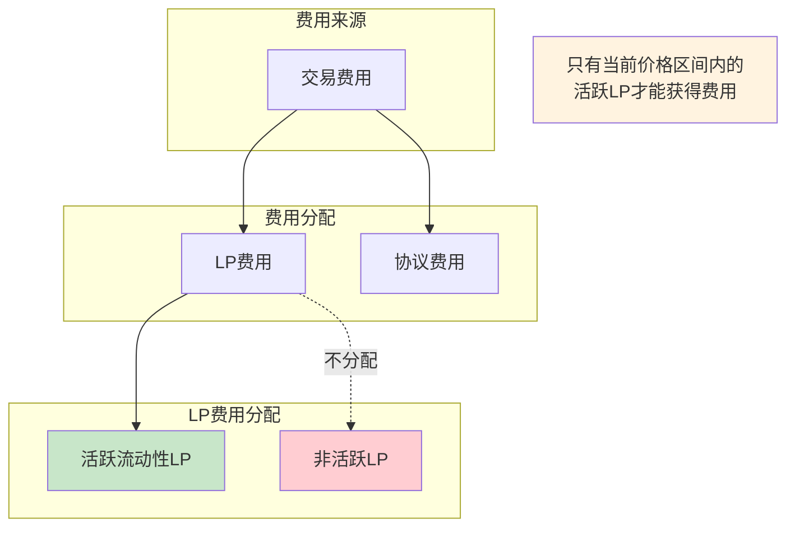

### 1.2 费率等级

V3支持多个费率等级，每个等级绑定特定的tick间距：

| 费率 | 百万分比 | Tick间距 | 适用场景 |
|------|---------|----------|----------|
| 0.01% | 100 | 1 | 稳定币对 |
| 0.05% | 500 | 10 | 相关资产 |
| 0.30% | 3000 | 60 | 主流币对 |
| 1.00% | 10000 | 200 | 高风险币对 |

### 1.3 费用计算的核心挑战

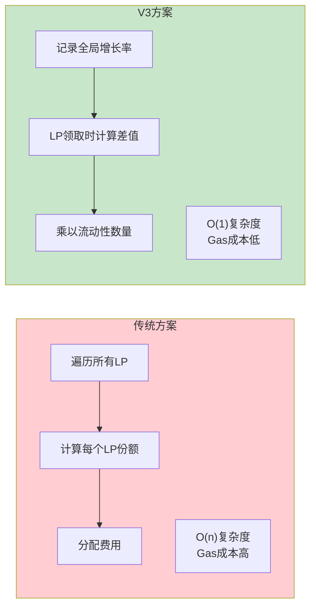

---

## 2. 费用增长率机制

### 2.1 全局费用增长率

池子维护两个全局费用增长累积器：

```solidity
// 每单位流动性累积的token0费用
uint256 public override feeGrowthGlobal0X128;

// 每单位流动性累积的token1费用
uint256 public override feeGrowthGlobal1X128;
```

**数学定义**：
```
feeGrowthGlobalX128 = Σ(fee_i / L_i) × 2^128

其中：
- fee_i: 第i笔交易产生的费用
- L_i: 第i笔交易时的活跃流动性
```

### 2.2 更新机制

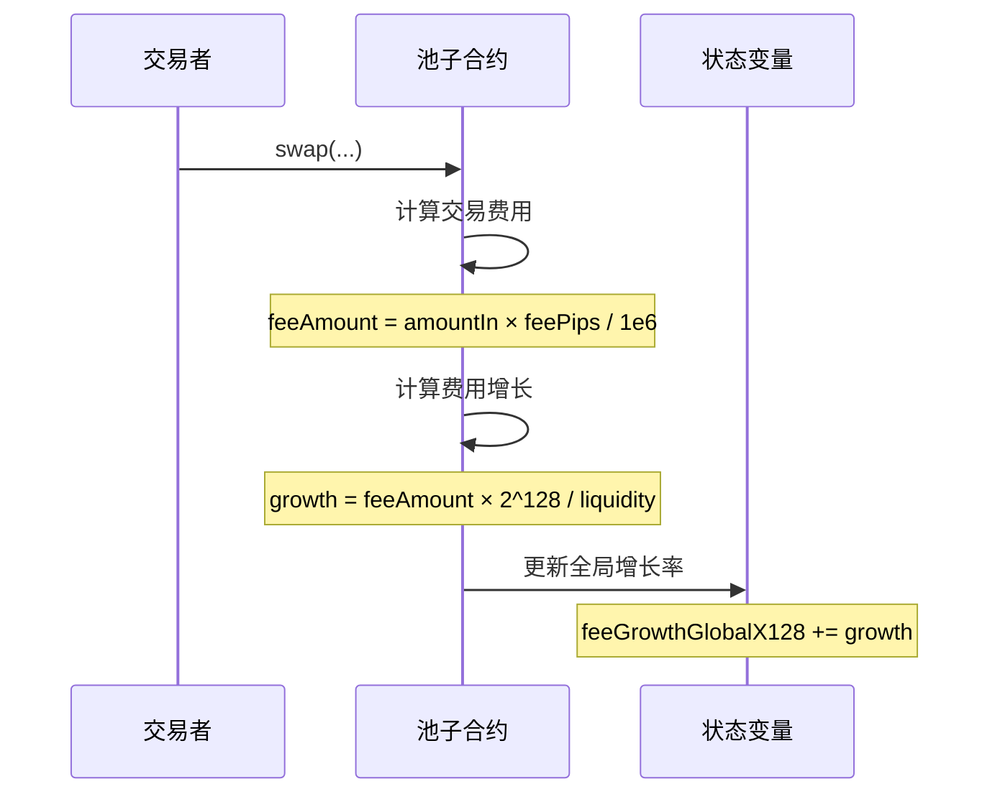

### 2.3 代码实现

```solidity
// 在swap循环中更新费用增长率
if (state.liquidity > 0) {
    state.feeGrowthGlobalX128 += FullMath.mulDiv(
        step.feeAmount,           // 本步产生的费用
        FixedPoint128.Q128,       // 2^128 归一化因子
        state.liquidity           // 当前活跃流动性
    );
}
```

---

## 3. 区间费用计算

### 3.1 "Outside"概念

每个tick维护"outside"费用增长率，表示tick另一侧累积的费用：

```mermaid
flowchart LR
    subgraph "价格在tick右侧时"
        direction TB
        L1["feeGrowthOutside = tick左侧累积费用"]
        R1["tick右侧费用 = global - outside"]
    end

    subgraph "价格在tick左侧时"
        direction TB
        L2["feeGrowthOutside = tick右侧累积费用"]
        R2["tick左侧费用 = global - outside"]
    end

    style "价格在tick右侧时" fill:#e3f2fd
    style "价格在tick左侧时" fill:#fff3e0
```

### 3.2 inside费用计算

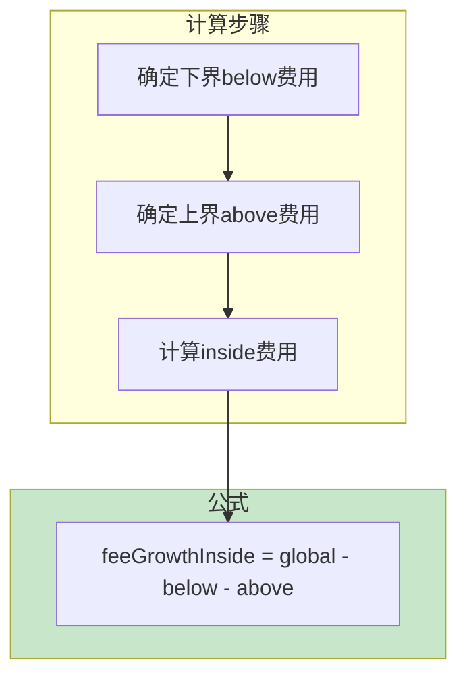

### 3.3 完整实现

```solidity
function getFeeGrowthInside(
    mapping(int24 => Tick.Info) storage self,
    int24 tickLower,
    int24 tickUpper,
    int24 tickCurrent,
    uint256 feeGrowthGlobal0X128,
    uint256 feeGrowthGlobal1X128
) internal view returns (
    uint256 feeGrowthInside0X128,
    uint256 feeGrowthInside1X128
) {
    Info storage lower = self[tickLower];
    Info storage upper = self[tickUpper];

    // 计算下界以下的费用增长
    uint256 feeGrowthBelow0X128;
    uint256 feeGrowthBelow1X128;
    if (tickCurrent >= tickLower) {
        // 价格在下界之上，outside就是below
        feeGrowthBelow0X128 = lower.feeGrowthOutside0X128;
        feeGrowthBelow1X128 = lower.feeGrowthOutside1X128;
    } else {
        // 价格在下界之下，需要翻转
        feeGrowthBelow0X128 = feeGrowthGlobal0X128 - lower.feeGrowthOutside0X128;
        feeGrowthBelow1X128 = feeGrowthGlobal1X128 - lower.feeGrowthOutside1X128;
    }

    // 计算上界以上的费用增长
    uint256 feeGrowthAbove0X128;
    uint256 feeGrowthAbove1X128;
    if (tickCurrent < tickUpper) {
        // 价格在上界之下，outside就是above
        feeGrowthAbove0X128 = upper.feeGrowthOutside0X128;
        feeGrowthAbove1X128 = upper.feeGrowthOutside1X128;
    } else {
        // 价格在上界之上，需要翻转
        feeGrowthAbove0X128 = feeGrowthGlobal0X128 - upper.feeGrowthOutside0X128;
        feeGrowthAbove1X128 = feeGrowthGlobal1X128 - upper.feeGrowthOutside1X128;
    }

    // 计算区间内的费用增长
    feeGrowthInside0X128 = feeGrowthGlobal0X128 - feeGrowthBelow0X128 - feeGrowthAbove0X128;
    feeGrowthInside1X128 = feeGrowthGlobal1X128 - feeGrowthBelow1X128 - feeGrowthAbove1X128;
}
```

### 3.4 计算示例

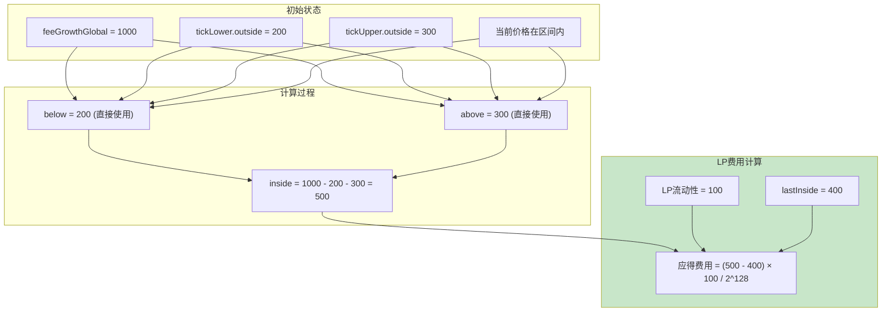

---

## 4. Tick跨越时的费用处理

### 4.1 "翻转"技巧

当价格跨越tick时，需要更新outside值：

```solidity
function cross(
    mapping(int24 => Tick.Info) storage self,
    int24 tick,
    uint256 feeGrowthGlobal0X128,
    uint256 feeGrowthGlobal1X128,
    uint160 secondsPerLiquidityCumulativeX128,
    int56 tickCumulative,
    uint32 time
) internal returns (int128 liquidityNet) {
    Tick.Info storage info = self[tick];

    // 翻转outside值
    // 新的outside = global - 旧的outside
    info.feeGrowthOutside0X128 = feeGrowthGlobal0X128 - info.feeGrowthOutside0X128;
    info.feeGrowthOutside1X128 = feeGrowthGlobal1X128 - info.feeGrowthOutside1X128;

    // 同样处理预言机相关的outside值
    info.secondsPerLiquidityOutsideX128 =
        secondsPerLiquidityCumulativeX128 - info.secondsPerLiquidityOutsideX128;
    info.tickCumulativeOutside = tickCumulative - info.tickCumulativeOutside;
    info.secondsOutside = time - info.secondsOutside;

    liquidityNet = info.liquidityNet;
}
```

### 4.2 翻转原理图解

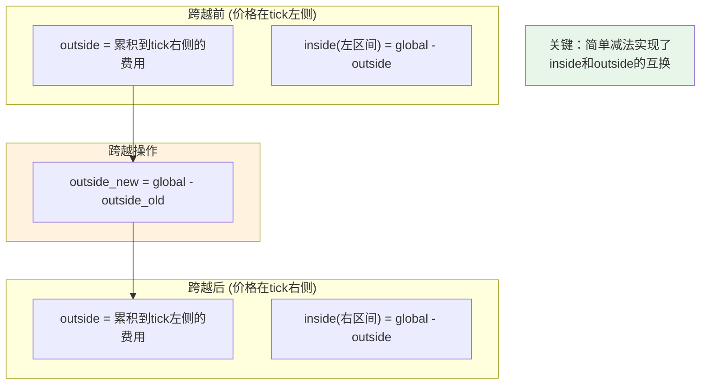

---

## 5. 协议费用

### 5.1 协议费用结构

```solidity
// Slot0中的feeProtocol字段
// 低4位：token0的协议费率
// 高4位：token1的协议费率
uint8 feeProtocol;

// 协议费用累积
struct ProtocolFees {
    uint128 token0;
    uint128 token1;
}
ProtocolFees public override protocolFees;
```

### 5.2 协议费用计算

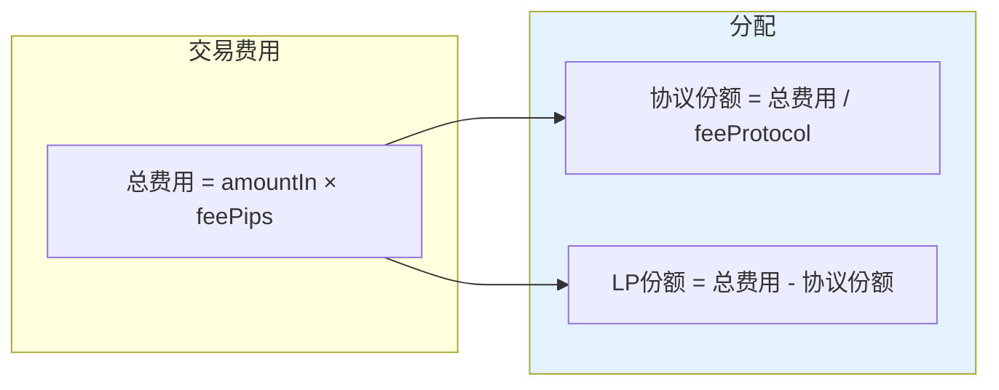

### 5.3 代码实现

```solidity
// 在swap循环中计算协议费用
if (cache.feeProtocol > 0) {
    // 协议费用 = 交易费用 / 协议费率
    uint256 delta = step.feeAmount / cache.feeProtocol;
    step.feeAmount -= delta;           // 从LP费用中扣除
    state.protocolFee += uint128(delta); // 累积到协议费用
}

// 循环结束后更新协议费用
if (zeroForOne) {
    if (state.protocolFee > 0) {
        protocolFees.token0 += state.protocolFee;
    }
} else {
    if (state.protocolFee > 0) {
        protocolFees.token1 += state.protocolFee;
    }
}
```

### 5.4 协议费用提取

```solidity
function collectProtocol(
    address recipient,
    uint128 amount0Requested,
    uint128 amount1Requested
) external override lock onlyFactoryOwner returns (
    uint128 amount0,
    uint128 amount1
) {
    // 计算实际可提取数量
    amount0 = amount0Requested > protocolFees.token0
        ? protocolFees.token0
        : amount0Requested;
    amount1 = amount1Requested > protocolFees.token1
        ? protocolFees.token1
        : amount1Requested;

    // 更新状态
    if (amount0 > 0) {
        if (amount0 == protocolFees.token0) amount0--;
        protocolFees.token0 -= amount0;
        TransferHelper.safeTransfer(token0, recipient, amount0);
    }
    if (amount1 > 0) {
        if (amount1 == protocolFees.token1) amount1--;
        protocolFees.token1 -= amount1;
        TransferHelper.safeTransfer(token1, recipient, amount1);
    }

    emit CollectProtocol(msg.sender, recipient, amount0, amount1);
}
```

---

## 6. 预言机系统概述

### 6.1 TWAP预言机

V3内置时间加权平均价格（TWAP）预言机：

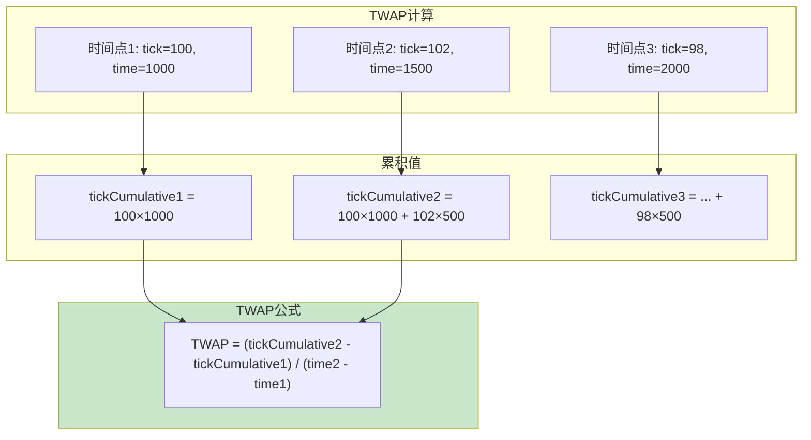

### 6.2 预言机的优势

| 特性 | 说明 |
|------|------|
| 抗操纵性 | 攻击者需要持续维持异常价格才能影响TWAP |
| 历史数据 | 可查询任意历史时间点的价格 |
| Gas效率 | O(1)查询复杂度 |
| 灵活性 | 可配置观察窗口大小 |

---

## 7. Observation数据结构

### 7.1 观察者结构

```solidity
struct Observation {
    // 记录时的区块时间戳
    uint32 blockTimestamp;

    // tick的累积值（用于计算TWAP）
    int56 tickCumulative;

    // 每流动性秒数的累积值
    uint160 secondsPerLiquidityCumulativeX128;

    // 是否已初始化
    bool initialized;
}

// 固定大小的环形数组
Oracle.Observation[65535] public override observations;
```

### 7.2 存储布局

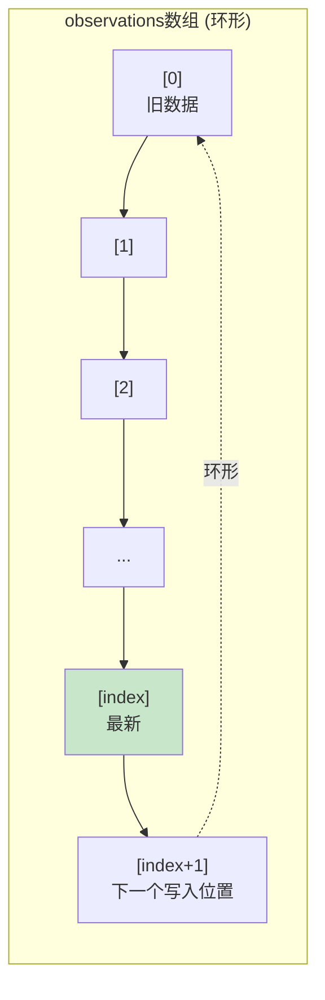

### 7.3 关键状态变量

```solidity
// 在Slot0中
struct Slot0 {
    // ... 其他字段
    uint16 observationIndex;           // 当前观察者索引
    uint16 observationCardinality;     // 当前容量
    uint16 observationCardinalityNext; // 目标容量
    // ...
}
```

---

## 8. 预言机写入机制

### 8.1 写入时机

预言机在以下情况更新：
- **swap**：当价格发生变化时
- **mint/burn**：当流动性变化且是区块内首次操作时

### 8.2 写入函数

```solidity
function write(
    Observation[65535] storage self,
    uint16 index,
    uint32 blockTimestamp,
    int24 tick,
    uint128 liquidity,
    uint16 cardinality,
    uint16 cardinalityNext
) internal returns (uint16 indexUpdated, uint16 cardinalityUpdated) {
    Observation memory last = self[index];

    // 同一区块内不重复写入
    if (last.blockTimestamp == blockTimestamp) return (index, cardinality);

    // 检查是否需要扩容
    if (cardinalityNext > cardinality && index == (cardinality - 1)) {
        cardinalityUpdated = cardinalityNext;
    } else {
        cardinalityUpdated = cardinality;
    }

    // 计算下一个索引（环形）
    indexUpdated = (index + 1) % cardinalityUpdated;

    // 写入新观察值
    self[indexUpdated] = transform(last, blockTimestamp, tick, liquidity);
}
```

### 8.3 Transform函数

```solidity
function transform(
    Observation memory last,
    uint32 blockTimestamp,
    int24 tick,
    uint128 liquidity
) private pure returns (Observation memory) {
    // 计算时间差
    uint32 delta = blockTimestamp - last.blockTimestamp;

    return Observation({
        blockTimestamp: blockTimestamp,
        // 累积tick值
        tickCumulative: last.tickCumulative +
            int56(tick) * int56(uint56(delta)),
        // 累积每流动性秒数
        secondsPerLiquidityCumulativeX128: last.secondsPerLiquidityCumulativeX128 +
            ((uint160(delta) << 128) / (liquidity > 0 ? liquidity : 1)),
        initialized: true
    });
}
```

### 8.4 累积值计算图解

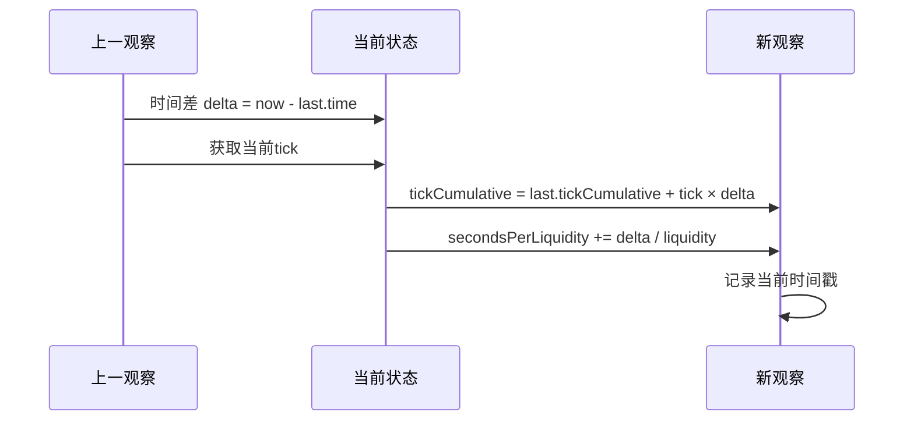

---

## 9. 预言机查询机制

### 9.1 查询接口

```solidity
function observe(uint32[] calldata secondsAgos)
    external
    view
    override
    noDelegateCall
    returns (
        int56[] memory tickCumulatives,
        uint160[] memory secondsPerLiquidityCumulativeX128s
    );
```

### 9.2 单点查询实现

```solidity
function observeSingle(
    Observation[65535] storage self,
    uint32 time,
    uint32 secondsAgo,
    int24 tick,
    uint16 index,
    uint128 liquidity,
    uint16 cardinality
) internal view returns (
    int56 tickCumulative,
    uint160 secondsPerLiquidityCumulativeX128
) {
    if (secondsAgo == 0) {
        // 查询当前时刻
        Observation memory last = self[index];
        if (last.blockTimestamp != time) {
            // 需要补充当前区块的累积
            return transform(last, time, tick, liquidity);
        }
        return (last.tickCumulative, last.secondsPerLiquidityCumulativeX128);
    }

    // 查询历史时刻
    uint32 target = time - secondsAgo;

    // 找到目标时间点前后的观察值
    (Observation memory beforeOrAt, Observation memory atOrAfter) =
        getSurroundingObservations(
            self, time, target, tick, index, liquidity, cardinality
        );

    if (target == beforeOrAt.blockTimestamp) {
        // 精确命中
        return (beforeOrAt.tickCumulative, beforeOrAt.secondsPerLiquidityCumulativeX128);
    } else if (target == atOrAfter.blockTimestamp) {
        return (atOrAfter.tickCumulative, atOrAfter.secondsPerLiquidityCumulativeX128);
    } else {
        // 需要线性插值
        uint32 observationTimeDelta = atOrAfter.blockTimestamp - beforeOrAt.blockTimestamp;
        uint32 targetDelta = target - beforeOrAt.blockTimestamp;

        return (
            beforeOrAt.tickCumulative +
                ((atOrAfter.tickCumulative - beforeOrAt.tickCumulative) /
                int56(uint56(observationTimeDelta))) *
                int56(uint56(targetDelta)),
            beforeOrAt.secondsPerLiquidityCumulativeX128 +
                uint160(
                    (uint256(
                        atOrAfter.secondsPerLiquidityCumulativeX128 -
                            beforeOrAt.secondsPerLiquidityCumulativeX128
                    ) * targetDelta) / observationTimeDelta
                )
        );
    }
}
```

### 9.3 二分查找

```solidity
function binarySearch(
    Observation[65535] storage self,
    uint32 time,
    uint32 target,
    uint16 index,
    uint16 cardinality
) private view returns (
    Observation memory beforeOrAt,
    Observation memory atOrAfter
) {
    // 确定搜索范围
    uint256 l = (index + 1) % cardinality;  // 最老的观察
    uint256 r = l + cardinality - 1;         // 最新的观察
    uint256 i;

    while (true) {
        i = (l + r) / 2;

        beforeOrAt = self[i % cardinality];

        if (!beforeOrAt.initialized) {
            l = i + 1;
            continue;
        }

        atOrAfter = self[(i + 1) % cardinality];

        bool targetAtOrAfter = lte(time, beforeOrAt.blockTimestamp, target);

        if (targetAtOrAfter && lte(time, target, atOrAfter.blockTimestamp)) {
            break;  // 找到了
        }

        if (!targetAtOrAfter) {
            r = i - 1;
        } else {
            l = i + 1;
        }
    }
}
```

### 9.4 查询流程图

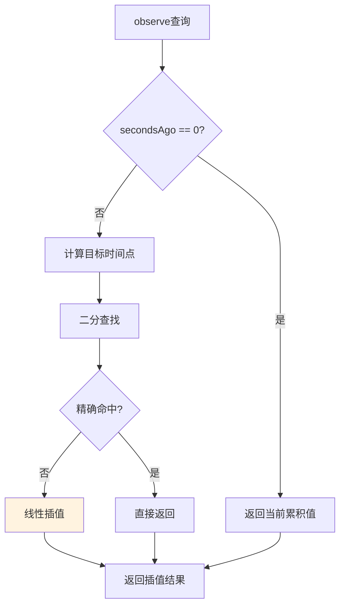

---

## 10. 预言机扩容机制

### 10.1 扩容接口

```solidity
function increaseObservationCardinalityNext(uint16 observationCardinalityNext)
    external
    override
    lock
    noDelegateCall
{
    uint16 observationCardinalityNextOld = slot0.observationCardinalityNext;
    uint16 observationCardinalityNextNew = observations.grow(
        observationCardinalityNextOld,
        observationCardinalityNext
    );
    slot0.observationCardinalityNext = observationCardinalityNextNew;

    if (observationCardinalityNextOld != observationCardinalityNextNew) {
        emit IncreaseObservationCardinalityNext(
            observationCardinalityNextOld,
            observationCardinalityNextNew
        );
    }
}
```

### 10.2 Grow函数

```solidity
function grow(
    Observation[65535] storage self,
    uint16 current,
    uint16 next
) internal returns (uint16) {
    require(current > 0, 'I');

    // 无需扩容
    if (next <= current) return current;

    // 预初始化新槽位以节省后续写入的gas
    for (uint16 i = current; i < next; i++) {
        self[i].blockTimestamp = 1;
    }

    return next;
}
```

### 10.3 扩容时机

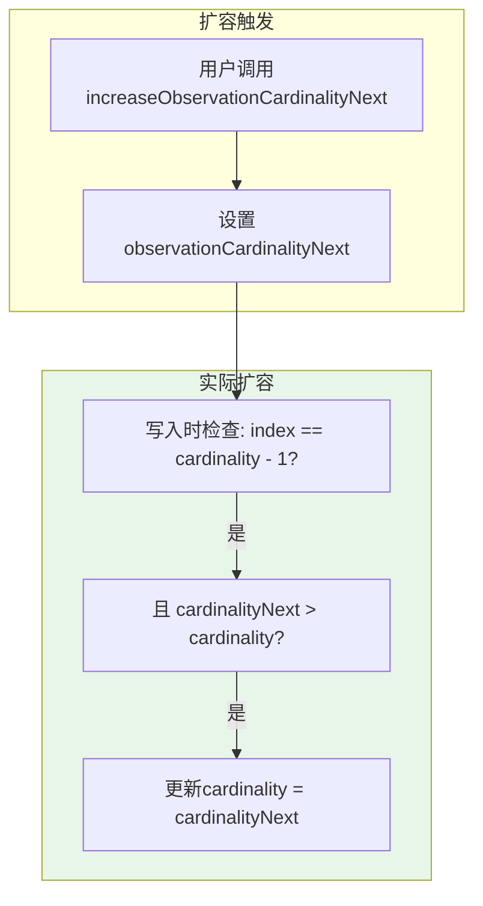

---

## 11. TWAP计算示例

### 11.1 计算30分钟TWAP

```solidity
// 查询30分钟和当前的累积值
uint32[] memory secondsAgos = new uint32[](2);
secondsAgos[0] = 1800;  // 30分钟前
secondsAgos[1] = 0;     // 当前

(int56[] memory tickCumulatives,) = pool.observe(secondsAgos);

// 计算TWAP tick
int56 tickCumulativesDelta = tickCumulatives[1] - tickCumulatives[0];
int24 arithmeticMeanTick = int24(tickCumulativesDelta / 1800);

// 转换为价格
uint160 sqrtPriceX96 = TickMath.getSqrtRatioAtTick(arithmeticMeanTick);
```

### 11.2 TWAP vs 即时价格

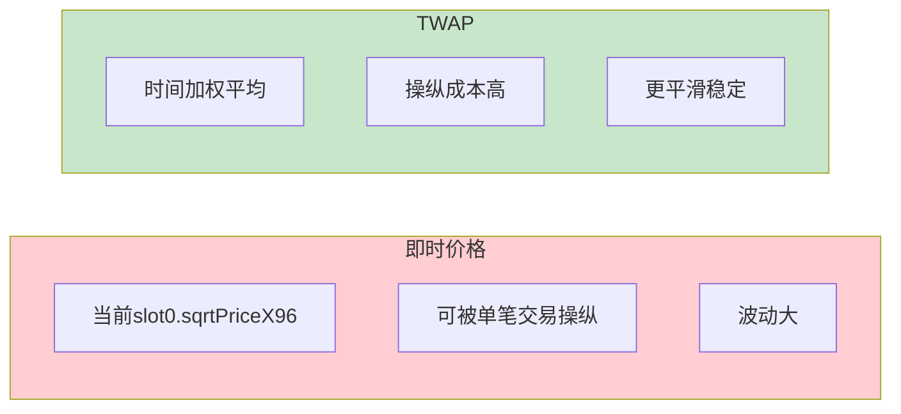

### 11.3 抗操纵分析

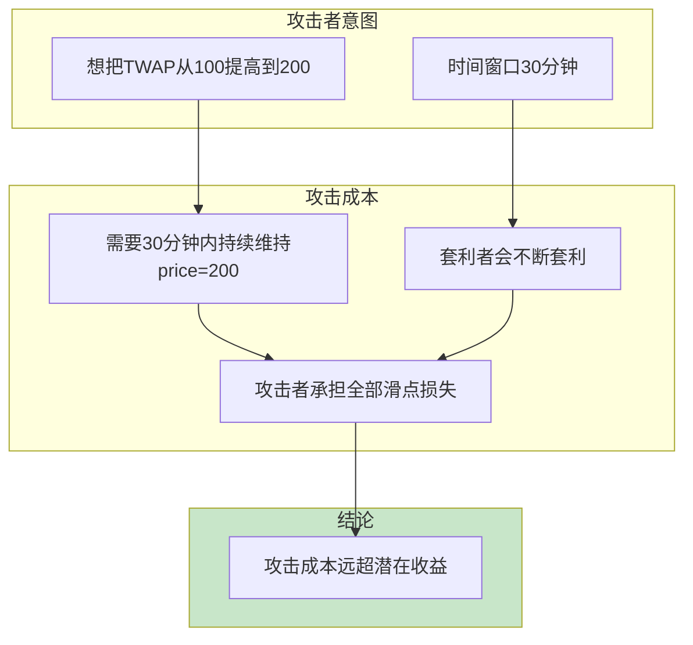

---

## 12. 本章小结

### 12.1 核心概念回顾

```mermaid
mindmap
  root((费用与预言机))
    费用系统
      全局增长率
      区间费用计算
      outside翻转技巧
      协议费用分配
    预言机系统
      Observation结构
      累积值机制
      二分查找
      线性插值
    TWAP
      时间加权平均
      抗操纵性
      历史查询
    优化设计
      O(1)费用计算
      环形数组存储
      按需扩容
```

### 12.2 关键设计总结

| 设计要点 | 实现方式 | 效果 |
|----------|----------|------|
| 费用计算 | 增长率差值 | O(1)复杂度 |
| 区间定位 | outside翻转 | 优雅的边界处理 |
| 历史存储 | 环形数组 | 固定存储开销 |
| 时间查询 | 二分+插值 | O(log n)查询 |
| 抗操纵 | 时间加权 | 提高攻击成本 |

### 12.3 使用建议

```mermaid
flowchart LR
    subgraph 费用收取
        F1[定期调用burn(0)结算费用]
        F2[使用collect提取]
    end

    subgraph 预言机使用
        O1[根据需要设置cardinality]
        O2[选择合适的时间窗口]
        O3[结合其他预言机验证]
    end

    style 费用收取 fill:#e3f2fd
    style 预言机使用 fill:#fff3e0
```

---

## 下一篇预告

在下一篇文章中，我们将深入探讨**MEV与套利策略**，包括：
- JIT（Just-in-Time）流动性攻击
- 三明治攻击的原理与防护
- 跨池套利策略
- Tick边界套利
- Flashbots与私有交易池

---

## 参考资料

- [Uniswap V3 Core - Oracle.sol](https://github.com/Uniswap/v3-core/blob/main/contracts/libraries/Oracle.sol)
- [Uniswap V3 Core - Tick.sol](https://github.com/Uniswap/v3-core/blob/main/contracts/libraries/Tick.sol)
- [Uniswap V3 白皮书 - Oracle部分](https://uniswap.org/whitepaper-v3.pdf)
