# 死磕Uniswap V3（七）：MEV与套利策略

> 本文是「死磕Uniswap V3」系列的第七篇（完结篇），深入剖析V3生态中的MEV问题和各种套利策略。

## 系列导航

| 序号 | 标题 | 核心内容 |
|------|------|----------|
| 01 | 概述与集中流动性 | AMM演进、集中流动性原理 |
| 02 | Tick机制与价格数学 | Tick设计、价格转换算法 |
| 03 | 架构与合约设计 | Factory、Pool合约结构 |
| 04 | 交换机制深度解析 | swap函数、价格发现 |
| 05 | 流动性管理与头寸 | Position、mint/burn |
| 06 | 费用系统与预言机 | 费用分配、TWAP |
| **07** | **MEV与套利策略** | **JIT、三明治攻击** |

---

## 1. MEV概述

### 1.1 什么是MEV？

MEV（Maximal Extractable Value，最大可提取价值）是指矿工/验证者通过重排、插入或审查交易能够获取的额外利润。

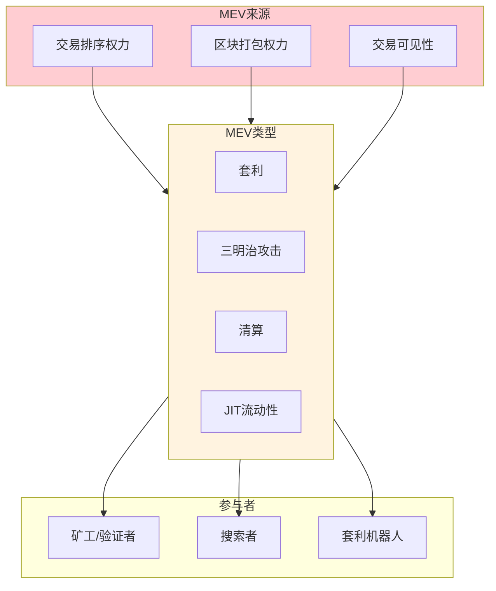

### 1.2 V3中的MEV特点

V3的集中流动性设计带来了独特的MEV机会：

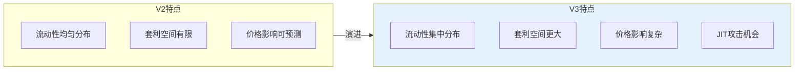

### 1.3 MEV对生态的影响

| 影响维度 | 正面 | 负面 |
|----------|------|------|
| 市场效率 | 快速价格发现、套利修正价差 | 交易成本增加 |
| 用户体验 | - | 滑点增大、交易失败 |
| 网络健康 | - | Gas战争、网络拥堵 |
| 去中心化 | - | 专业化集中、准入门槛 |

---

## 2. 三明治攻击

### 2.1 攻击原理

三明治攻击是最常见的MEV形式，攻击者在目标交易前后插入交易获利：

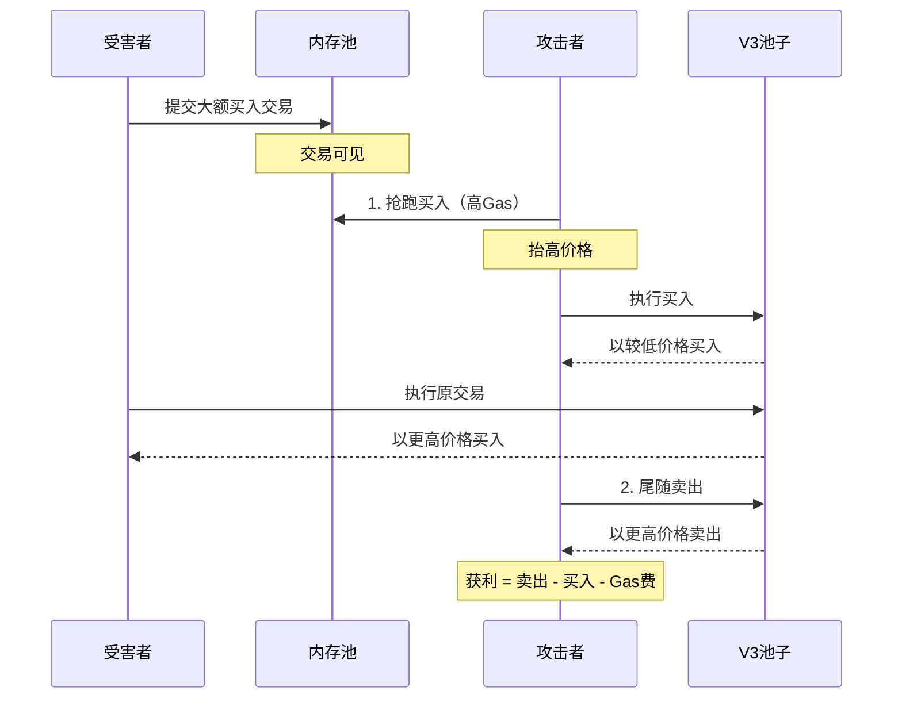

### 2.2 攻击条件分析

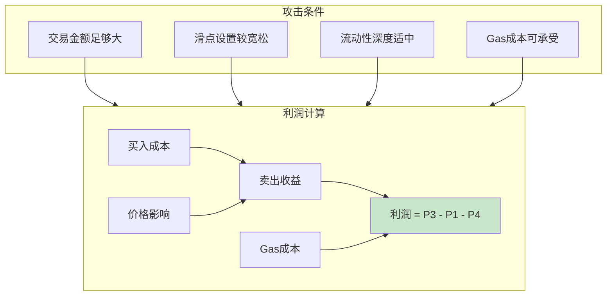

### 2.3 V3中的三明治攻击特点

```solidity
// V3三明治攻击的特殊考虑

// 1. 集中流动性使价格影响更剧烈
// 如果目标交易会跨越多个tick，攻击利润更大
function estimateSandwichProfit(
    uint256 victimAmount,
    uint128 currentLiquidity,
    int24 currentTick,
    int24 tickSpacing
) internal view returns (uint256 profit) {
    // 计算受害者交易的价格影响
    uint256 priceImpact = calculatePriceImpact(
        victimAmount,
        currentLiquidity
    );

    // 计算攻击者的最优买入量
    uint256 optimalFrontrun = calculateOptimalFrontrun(
        victimAmount,
        priceImpact,
        currentLiquidity
    );

    // 计算利润（考虑多tick跨越）
    profit = estimateProfit(
        optimalFrontrun,
        victimAmount,
        currentTick,
        tickSpacing
    );
}

// 2. Tick跨越带来的机会
// 当价格跨越tick时，流动性会突变
// 攻击者可以利用这一点
```

### 2.4 防御策略

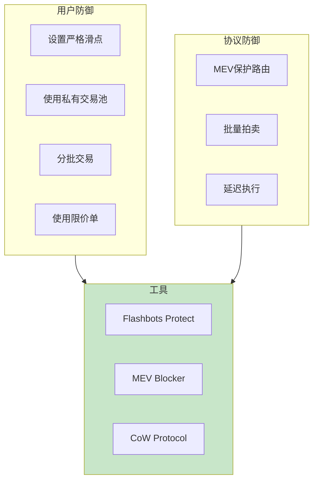

**滑点设置建议**：

```solidity
// 计算安全的滑点设置
function calculateSafeSlippage(
    uint256 amountIn,
    uint128 poolLiquidity,
    uint24 fee
) public pure returns (uint256 minAmountOut) {
    // 估算正常价格影响
    uint256 expectedImpact = estimateNormalImpact(amountIn, poolLiquidity);

    // 添加安全边际（通常0.5%-1%）
    uint256 safetyMargin = 50; // 0.5%

    // 计算最小输出
    // minAmountOut = expectedOut * (1 - impact - margin)
    minAmountOut = calculateMinOutput(
        amountIn,
        expectedImpact,
        safetyMargin,
        fee
    );
}
```

---

## 3. JIT流动性攻击

### 3.1 攻击原理

JIT（Just-in-Time）流动性攻击是V3特有的MEV形式：

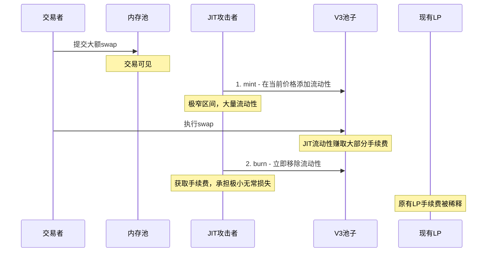

### 3.2 JIT攻击的数学分析

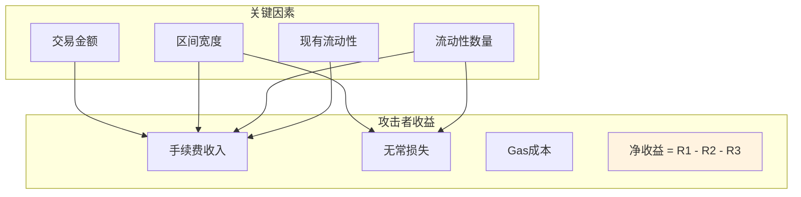

**收益计算**：

```solidity
// JIT攻击收益分析
struct JITAnalysis {
    uint256 tradeAmount;      // 目标交易金额
    uint128 jitLiquidity;     // JIT流动性数量
    uint128 existingLiquidity; // 现有流动性
    int24 tickLower;          // JIT区间下界
    int24 tickUpper;          // JIT区间上界
    uint24 fee;               // 费率
}

function analyzeJITProfit(JITAnalysis memory params)
    internal pure returns (int256 profit)
{
    // 1. 计算手续费收入
    uint256 totalFee = params.tradeAmount * params.fee / 1e6;

    // 2. 计算JIT流动性占比
    uint256 jitShare = params.jitLiquidity * 1e18 /
        (params.jitLiquidity + params.existingLiquidity);

    // 3. JIT获得的手续费
    uint256 jitFeeIncome = totalFee * jitShare / 1e18;

    // 4. 计算无常损失
    // 由于区间极窄且持有时间极短，无常损失很小
    uint256 impermanentLoss = calculateIL(
        params.tickLower,
        params.tickUpper,
        params.tradeAmount
    );

    // 5. Gas成本（mint + burn）
    uint256 gasCost = estimateGasCost();

    profit = int256(jitFeeIncome) - int256(impermanentLoss) - int256(gasCost);
}
```

### 3.3 JIT攻击的条件

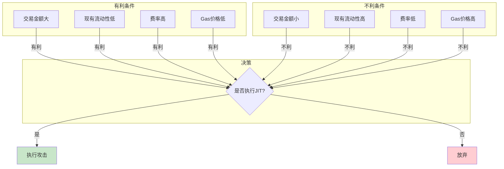

### 3.4 JIT对LP的影响

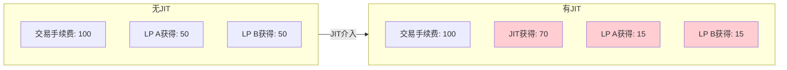

### 3.5 防御和缓解

| 策略 | 说明 | 效果 |
|------|------|------|
| 时间锁 | 要求流动性锁定最短时间 | 增加攻击成本 |
| 动态费率 | 根据持有时间调整费率 | 降低短期LP收益 |
| 批量执行 | 聚合交易后统一执行 | 减少可见性 |
| 私有池 | 限制谁可以提供流动性 | 完全防止 |

---

## 4. 跨池套利

### 4.1 套利机会来源

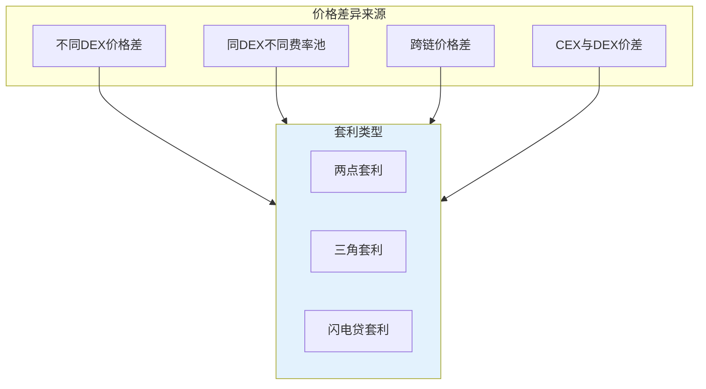

### 4.2 两点套利

最简单的套利形式：在价格低的地方买入，在价格高的地方卖出。

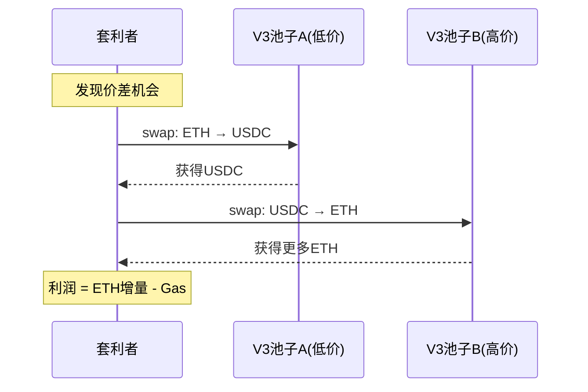

**代码实现**：

```solidity
// 两点套利合约
contract TwoPoolArbitrage {
    ISwapRouter public immutable router;

    struct ArbParams {
        address tokenA;
        address tokenB;
        uint24 feePoolLow;    // 低价池费率
        uint24 feePoolHigh;   // 高价池费率
        uint256 amountIn;
        uint256 minProfit;
    }

    function executeArbitrage(ArbParams calldata params)
        external
        returns (uint256 profit)
    {
        // 1. 在低价池买入tokenB
        uint256 amountB = router.exactInputSingle(
            ISwapRouter.ExactInputSingleParams({
                tokenIn: params.tokenA,
                tokenOut: params.tokenB,
                fee: params.feePoolLow,
                recipient: address(this),
                deadline: block.timestamp,
                amountIn: params.amountIn,
                amountOutMinimum: 0,
                sqrtPriceLimitX96: 0
            })
        );

        // 2. 在高价池卖出tokenB
        uint256 amountAOut = router.exactInputSingle(
            ISwapRouter.ExactInputSingleParams({
                tokenIn: params.tokenB,
                tokenOut: params.tokenA,
                fee: params.feePoolHigh,
                recipient: address(this),
                deadline: block.timestamp,
                amountIn: amountB,
                amountOutMinimum: params.amountIn + params.minProfit,
                sqrtPriceLimitX96: 0
            })
        );

        profit = amountAOut - params.amountIn;
        require(profit >= params.minProfit, "Insufficient profit");
    }
}
```

### 4.3 三角套利

利用三个或更多代币对之间的价格不一致：

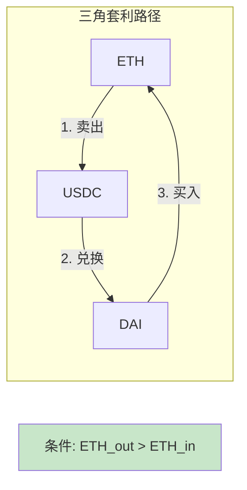

```solidity
// 三角套利实现
contract TriangularArbitrage {
    ISwapRouter public immutable router;

    struct TriArbParams {
        address tokenA;     // 起始代币
        address tokenB;     // 中间代币
        address tokenC;     // 第三代币
        uint24 feeAB;
        uint24 feeBC;
        uint24 feeCA;
        uint256 amountIn;
        uint256 minProfit;
    }

    function executeTriArb(TriArbParams calldata params)
        external
        returns (uint256 profit)
    {
        // A → B
        uint256 amountB = swap(
            params.tokenA,
            params.tokenB,
            params.feeAB,
            params.amountIn
        );

        // B → C
        uint256 amountC = swap(
            params.tokenB,
            params.tokenC,
            params.feeBC,
            amountB
        );

        // C → A
        uint256 amountAOut = swap(
            params.tokenC,
            params.tokenA,
            params.feeCA,
            amountC
        );

        profit = amountAOut - params.amountIn;
        require(profit >= params.minProfit, "Insufficient profit");
    }

    function swap(
        address tokenIn,
        address tokenOut,
        uint24 fee,
        uint256 amountIn
    ) internal returns (uint256 amountOut) {
        amountOut = router.exactInputSingle(
            ISwapRouter.ExactInputSingleParams({
                tokenIn: tokenIn,
                tokenOut: tokenOut,
                fee: fee,
                recipient: address(this),
                deadline: block.timestamp,
                amountIn: amountIn,
                amountOutMinimum: 0,
                sqrtPriceLimitX96: 0
            })
        );
    }
}
```

### 4.4 闪电贷套利

利用闪电贷实现零资金套利：

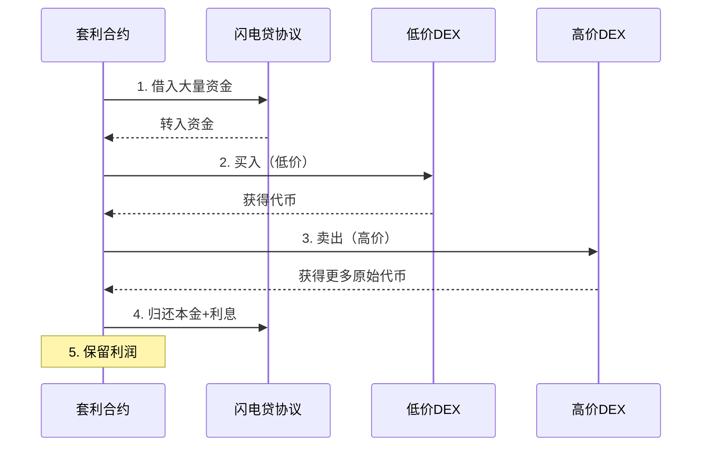

```solidity
// 闪电贷套利（使用Aave V3）
contract FlashLoanArbitrage is IFlashLoanSimpleReceiver {
    IPoolAddressesProvider public immutable ADDRESSES_PROVIDER;
    IPool public immutable POOL;
    ISwapRouter public immutable swapRouter;

    struct ArbData {
        address tokenBuy;
        uint24 feeLow;
        uint24 feeHigh;
    }

    function executeFlashLoanArb(
        address asset,
        uint256 amount,
        ArbData calldata arbData
    ) external {
        bytes memory params = abi.encode(arbData);

        POOL.flashLoanSimple(
            address(this),
            asset,
            amount,
            params,
            0 // referralCode
        );
    }

    function executeOperation(
        address asset,
        uint256 amount,
        uint256 premium,
        address initiator,
        bytes calldata params
    ) external override returns (bool) {
        require(msg.sender == address(POOL), "Invalid caller");

        ArbData memory arbData = abi.decode(params, (ArbData));

        // 执行套利
        // 1. 在低费率池买入
        uint256 bought = swapRouter.exactInputSingle(
            ISwapRouter.ExactInputSingleParams({
                tokenIn: asset,
                tokenOut: arbData.tokenBuy,
                fee: arbData.feeLow,
                recipient: address(this),
                deadline: block.timestamp,
                amountIn: amount,
                amountOutMinimum: 0,
                sqrtPriceLimitX96: 0
            })
        );

        // 2. 在高费率池卖出
        uint256 received = swapRouter.exactInputSingle(
            ISwapRouter.ExactInputSingleParams({
                tokenIn: arbData.tokenBuy,
                tokenOut: asset,
                fee: arbData.feeHigh,
                recipient: address(this),
                deadline: block.timestamp,
                amountIn: bought,
                amountOutMinimum: amount + premium,
                sqrtPriceLimitX96: 0
            })
        );

        // 3. 偿还闪电贷
        uint256 amountOwed = amount + premium;
        IERC20(asset).approve(address(POOL), amountOwed);

        // 利润留在合约中
        return true;
    }
}
```

---

## 5. Tick边界套利

### 5.1 原理说明

V3的Tick边界是套利的重要机会点：

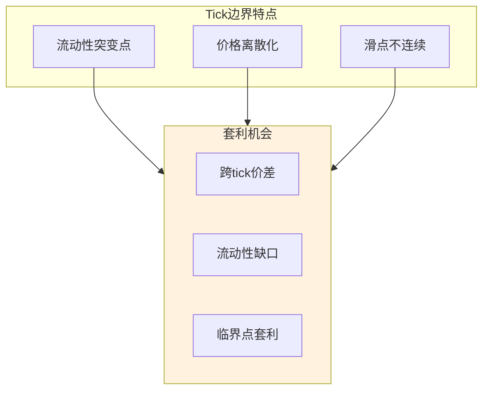

### 5.2 流动性缺口套利

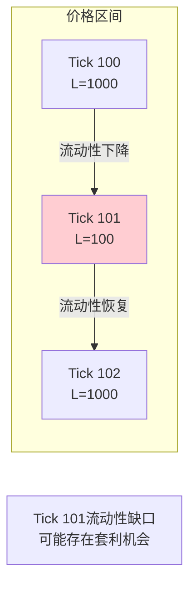

```solidity
// 检测流动性缺口
function findLiquidityGaps(
    IUniswapV3Pool pool,
    int24 tickLower,
    int24 tickUpper
) external view returns (int24[] memory gapTicks) {
    int24 tickSpacing = pool.tickSpacing();
    uint128 avgLiquidity;
    uint256 count;

    // 计算平均流动性
    for (int24 tick = tickLower; tick <= tickUpper; tick += tickSpacing) {
        (uint128 liquidityGross,,,,,,,) = pool.ticks(tick);
        avgLiquidity += liquidityGross;
        count++;
    }
    avgLiquidity = avgLiquidity / uint128(count);

    // 找出流动性显著低于平均值的tick
    uint256 gapCount;
    int24[] memory tempGaps = new int24[](count);

    for (int24 tick = tickLower; tick <= tickUpper; tick += tickSpacing) {
        (uint128 liquidityGross,,,,,,,) = pool.ticks(tick);
        // 流动性低于平均值的20%视为缺口
        if (liquidityGross < avgLiquidity / 5) {
            tempGaps[gapCount++] = tick;
        }
    }

    // 返回结果
    gapTicks = new int24[](gapCount);
    for (uint256 i = 0; i < gapCount; i++) {
        gapTicks[i] = tempGaps[i];
    }
}
```

### 5.3 Tick跨越时机

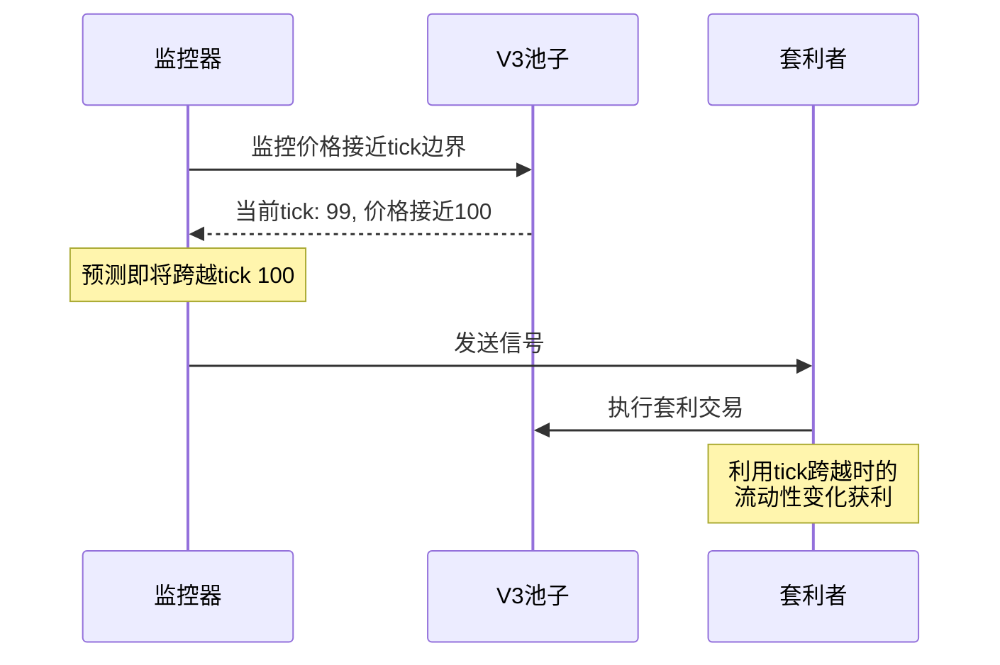

---

## 6. Flashbots与私有交易

### 6.1 Flashbots架构

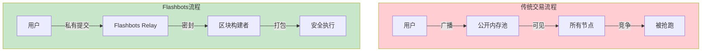

### 6.2 Bundle提交

```solidity
// Flashbots Bundle结构
interface IFlashbotsRelay {
    struct Bundle {
        bytes[] signedTransactions;  // 签名的交易列表
        uint256 blockNumber;          // 目标区块
        uint256 minTimestamp;         // 最早执行时间
        uint256 maxTimestamp;         // 最晚执行时间
    }
}

// 使用ethers.js提交Bundle
/*
const flashbotsProvider = await FlashbotsBundleProvider.create(
    provider,
    authSigner,
    'https://relay.flashbots.net'
);

const signedBundle = await flashbotsProvider.signBundle([
    {
        signer: wallet,
        transaction: {
            to: targetContract,
            data: arbCalldata,
            gasLimit: 500000,
            maxFeePerGas: gwei(50),
            maxPriorityFeePerGas: gwei(3),
        }
    }
]);

const bundleSubmission = await flashbotsProvider.sendBundle(
    signedBundle,
    targetBlockNumber
);
*/
```

### 6.3 MEV-Share

MEV-Share允许用户从MEV中获取一部分收益：

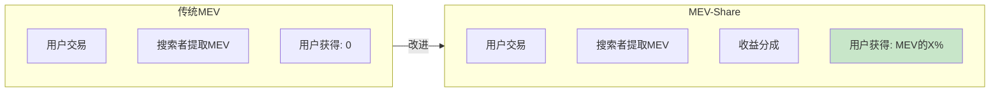

### 6.4 私有交易池对比

| 方案 | 提供方 | 特点 |
|------|--------|------|
| Flashbots Protect | Flashbots | 免费、广泛支持 |
| MEV Blocker | CoW Protocol | 退款机制 |
| SecureRPC | Manifold | 多链支持 |
| Eden Network | Eden | 优先排序 |

---

## 7. 套利机器人开发

### 7.1 架构设计

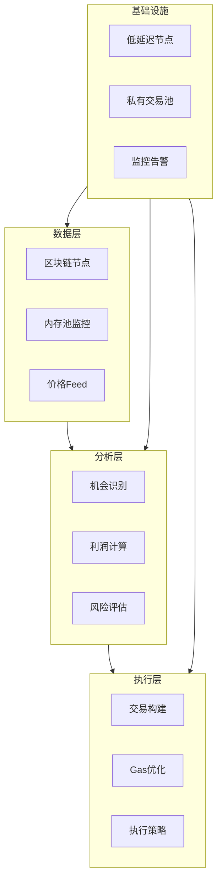

### 7.2 机会监控

```solidity
// 套利机会监控
contract ArbitrageMonitor {
    struct PoolInfo {
        address pool;
        address token0;
        address token1;
        uint24 fee;
    }

    struct Opportunity {
        address poolLow;
        address poolHigh;
        uint256 priceDiff;
        uint256 estimatedProfit;
    }

    // 获取多个池子的价格
    function getPrices(PoolInfo[] calldata pools)
        external view
        returns (uint160[] memory sqrtPrices)
    {
        sqrtPrices = new uint160[](pools.length);
        for (uint256 i = 0; i < pools.length; i++) {
            (sqrtPrices[i],,,,,,) = IUniswapV3Pool(pools[i].pool).slot0();
        }
    }

    // 检测套利机会
    function findOpportunities(
        PoolInfo[] calldata pools,
        uint256 minProfitBps  // 最小利润（基点）
    ) external view returns (Opportunity[] memory) {
        uint160[] memory prices = this.getPrices(pools);

        // 比较相同代币对的不同池子
        // 返回利润超过阈值的机会
        // ...
    }
}
```

### 7.3 利润计算

```solidity
// 精确利润计算
library ProfitCalculator {
    using FullMath for uint256;

    struct SwapEstimate {
        uint256 amountIn;
        uint256 amountOut;
        uint256 priceImpact;
        uint256 fee;
    }

    // 估算swap输出
    function estimateSwapOutput(
        address pool,
        bool zeroForOne,
        uint256 amountIn
    ) internal view returns (SwapEstimate memory estimate) {
        IUniswapV3Pool poolContract = IUniswapV3Pool(pool);

        (uint160 sqrtPriceX96, int24 tick,,,,,) = poolContract.slot0();
        uint128 liquidity = poolContract.liquidity();
        uint24 fee = poolContract.fee();

        // 使用Quoter或本地计算
        estimate.amountIn = amountIn;
        estimate.fee = amountIn * fee / 1e6;

        // 简化计算（实际应考虑跨tick）
        uint256 amountInLessFee = amountIn - estimate.fee;

        if (zeroForOne) {
            // token0 → token1
            estimate.amountOut = calculateAmount1Delta(
                sqrtPriceX96,
                amountInLessFee,
                liquidity
            );
        } else {
            // token1 → token0
            estimate.amountOut = calculateAmount0Delta(
                sqrtPriceX96,
                amountInLessFee,
                liquidity
            );
        }

        // 计算价格影响
        estimate.priceImpact = calculatePriceImpact(
            amountIn,
            estimate.amountOut,
            sqrtPriceX96
        );
    }

    // 计算净利润
    function calculateNetProfit(
        SwapEstimate memory buy,
        SwapEstimate memory sell,
        uint256 gasCost
    ) internal pure returns (int256 profit) {
        profit = int256(sell.amountOut) - int256(buy.amountIn) - int256(gasCost);
    }
}
```

### 7.4 Gas优化策略

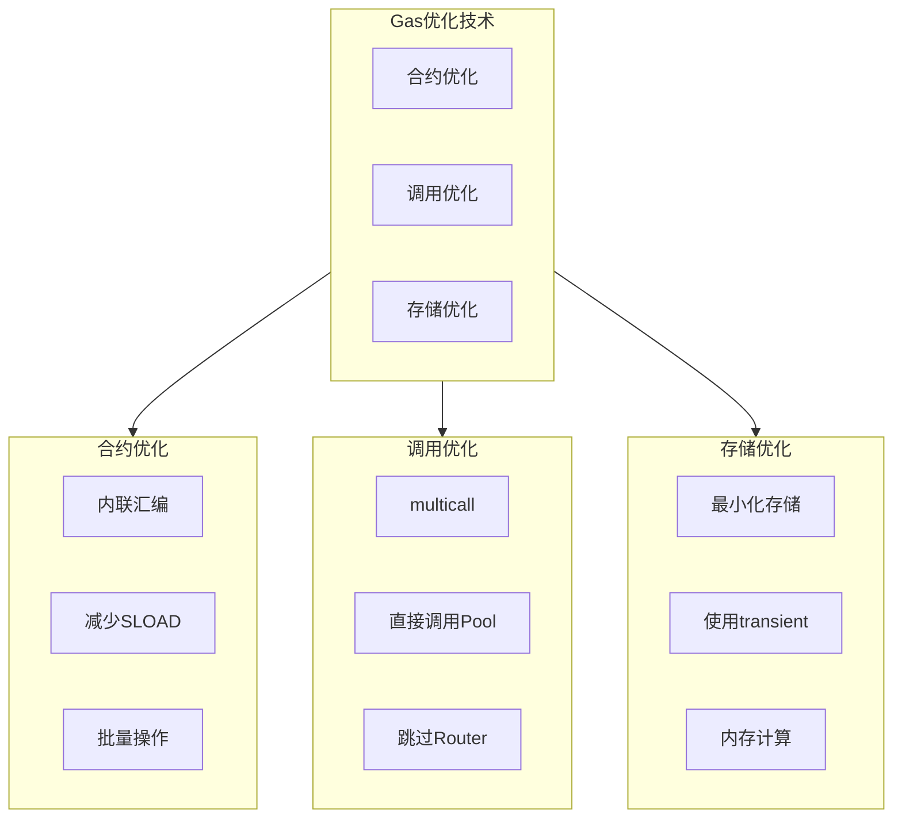

```solidity
// Gas优化的套利合约
contract OptimizedArbitrage {
    // 使用immutable减少SLOAD
    address private immutable WETH;
    address private immutable ROUTER;

    // 直接调用Pool而非通过Router
    function directPoolSwap(
        address pool,
        bool zeroForOne,
        int256 amountSpecified
    ) internal returns (int256 amount0, int256 amount1) {
        (amount0, amount1) = IUniswapV3Pool(pool).swap(
            address(this),
            zeroForOne,
            amountSpecified,
            zeroForOne ? TickMath.MIN_SQRT_RATIO + 1 : TickMath.MAX_SQRT_RATIO - 1,
            bytes("")
        );
    }

    // 批量执行多个swap
    function batchSwap(
        address[] calldata pools,
        bool[] calldata directions,
        int256[] calldata amounts
    ) external {
        uint256 length = pools.length;
        for (uint256 i; i < length;) {
            directPoolSwap(pools[i], directions[i], amounts[i]);
            unchecked { ++i; }
        }
    }

    // swap回调
    function uniswapV3SwapCallback(
        int256 amount0Delta,
        int256 amount1Delta,
        bytes calldata
    ) external {
        // 最小化回调逻辑
        if (amount0Delta > 0) {
            IERC20(IUniswapV3Pool(msg.sender).token0())
                .transfer(msg.sender, uint256(amount0Delta));
        }
        if (amount1Delta > 0) {
            IERC20(IUniswapV3Pool(msg.sender).token1())
                .transfer(msg.sender, uint256(amount1Delta));
        }
    }
}
```

---

## 8. 风险管理

### 8.1 常见风险

```mermaid
flowchart TB
    subgraph 技术风险
        T1[合约漏洞]
        T2[重入攻击]
        T3[预言机操纵]
    end

    subgraph 市场风险
        M1[价格剧烈波动]
        M2[流动性枯竭]
        M3[竞争失败]
    end

    subgraph 执行风险
        E1[交易失败]
        E2[Gas估算错误]
        E3[滑点超限]
    end

    subgraph 运营风险
        O1[私钥泄露]
        O2[节点故障]
        O3[网络拥堵]
    end

    技术风险 & 市场风险 & 执行风险 & 运营风险 --> 损失

    style 损失 fill:#ffcdd2
```

### 8.2 风险控制措施

| 风险类型 | 控制措施 |
|----------|----------|
| 合约漏洞 | 审计、测试、限额 |
| 重入攻击 | nonReentrant、CEI模式 |
| 价格波动 | 滑点保护、止损 |
| 竞争失败 | 快速节点、Flashbots |
| 交易失败 | 模拟执行、回滚保护 |
| 私钥安全 | 硬件钱包、多签 |

### 8.3 安全检查清单

```solidity
// 安全套利合约示例
contract SecureArbitrage is ReentrancyGuard, Ownable {
    using SafeERC20 for IERC20;

    // 最大单笔交易限额
    uint256 public maxTradeAmount;

    // 最小利润要求
    uint256 public minProfitBps;

    // 白名单池子
    mapping(address => bool) public allowedPools;

    // 紧急暂停
    bool public paused;

    modifier notPaused() {
        require(!paused, "Paused");
        _;
    }

    modifier onlyAllowedPool(address pool) {
        require(allowedPools[pool], "Pool not allowed");
        _;
    }

    modifier withinLimits(uint256 amount) {
        require(amount <= maxTradeAmount, "Exceeds max");
        _;
    }

    function executeArbitrage(
        address poolA,
        address poolB,
        uint256 amount,
        uint256 minProfit
    ) external
        nonReentrant
        notPaused
        onlyAllowedPool(poolA)
        onlyAllowedPool(poolB)
        withinLimits(amount)
    {
        require(minProfit >= minProfitBps, "Profit too low");

        // 执行前模拟
        uint256 expectedProfit = simulateArbitrage(poolA, poolB, amount);
        require(expectedProfit >= minProfit, "Simulation failed");

        // 执行套利
        uint256 actualProfit = _executeArbitrage(poolA, poolB, amount);

        // 验证结果
        require(actualProfit >= minProfit, "Insufficient profit");

        emit ArbitrageExecuted(poolA, poolB, amount, actualProfit);
    }

    // 紧急提取
    function emergencyWithdraw(address token) external onlyOwner {
        uint256 balance = IERC20(token).balanceOf(address(this));
        IERC20(token).safeTransfer(owner(), balance);
    }

    // 暂停/恢复
    function setPaused(bool _paused) external onlyOwner {
        paused = _paused;
    }
}
```

---

## 9. 实战案例分析

### 9.1 成功套利案例

```mermaid
flowchart TB
    subgraph 案例背景
        B1[ETH/USDC价格差异]
        B2[Pool A: 2000 USDC/ETH]
        B3[Pool B: 2010 USDC/ETH]
        B4[价差: 0.5%]
    end

    subgraph 执行过程
        E1[借入100 ETH闪电贷]
        E2[Pool A买入200,000 USDC]
        E3[Pool B卖出获得100.35 ETH]
        E4[归还100 ETH + 利息]
    end

    subgraph 结果
        R1[毛利润: 0.35 ETH]
        R2[闪电贷费用: 0.09 ETH]
        R3[Gas费用: 0.01 ETH]
        R4[净利润: 0.25 ETH ≈ $500]
    end

    案例背景 --> 执行过程 --> 结果

    style R4 fill:#c8e6c9
```

### 9.2 失败案例教训

```mermaid
flowchart TB
    subgraph 失败原因
        F1[Gas估算不足]
        F2[被抢跑]
        F3[滑点超限]
        F4[价格快速变化]
    end

    subgraph 教训
        L1[始终留有Gas余量]
        L2[使用Flashbots]
        L3[设置合理滑点]
        L4[快速执行or放弃]
    end

    F1 --> L1
    F2 --> L2
    F3 --> L3
    F4 --> L4

    style 教训 fill:#fff3e0
```

---

## 10. 本章小结

### 10.1 核心概念回顾

```mermaid
mindmap
  root((MEV与套利))
    MEV基础
      交易排序
      价值提取
      参与者生态
    攻击类型
      三明治攻击
      JIT流动性
      清算
    套利策略
      两点套利
      三角套利
      闪电贷套利
      Tick边界套利
    防护措施
      Flashbots
      私有交易池
      滑点保护
    机器人开发
      架构设计
      利润计算
      Gas优化
      风险管理
```

### 10.2 关键要点总结

| 主题 | 要点 |
|------|------|
| MEV本质 | 交易排序权力带来的价值提取 |
| 三明治攻击 | 抢跑+尾随，利用价格影响获利 |
| JIT攻击 | V3特有，利用集中流动性稀释LP收益 |
| 套利 | 价格差异修正，提高市场效率 |
| 防护 | 私有交易、滑点保护、分批执行 |
| 开发 | 低延迟、Gas优化、风险控制 |

### 10.3 生态展望

```mermaid
flowchart LR
    subgraph 当前状态
        C1[搜索者竞争激烈]
        C2[MEV集中化]
        C3[用户体验受损]
    end

    subgraph 未来发展
        F1[MEV民主化]
        F2[协议级防护]
        F3[公平排序服务]
        F4[用户收益分成]
    end

    当前状态 -->|演进| 未来发展

    style 未来发展 fill:#c8e6c9
```

---

## 系列总结

至此，「死磕Uniswap V3」系列七篇文章全部完成。让我们回顾一下整个系列：

| 篇章 | 核心收获 |
|------|----------|
| 第一篇 | 理解集中流动性的革命性创新 |
| 第二篇 | 掌握Tick机制和价格数学基础 |
| 第三篇 | 了解合约架构和存储优化技巧 |
| 第四篇 | 深入swap函数的执行细节 |
| 第五篇 | 掌握流动性管理的完整流程 |
| 第六篇 | 理解费用分配和预言机机制 |
| 第七篇 | 认识MEV生态和套利策略 |

**学习建议**：

1. **理论到实践**：在测试网部署合约，亲自体验各种操作
2. **源码阅读**：对照文章阅读官方合约代码
3. **工具使用**：学习使用Tenderly、Dune等分析工具
4. **持续关注**：跟踪Uniswap的最新发展（V4等）

---

## 参考资料

- [Flashbots Documentation](https://docs.flashbots.net/)
- [MEV Wiki](https://www.mev.wiki/)
- [Uniswap V3 Development Book](https://uniswapv3book.com/)
- [Ethereum MEV Research](https://ethereum.org/en/developers/docs/mev/)
- [MEV-Share Documentation](https://docs.flashbots.net/flashbots-mev-share/overview)
