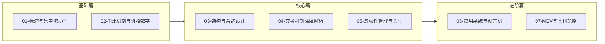

# 死磕Uniswap V3 系列文章

> 深入剖析Uniswap V3的核心机制与实现原理

## 系列概述

本系列共7篇文章，从基础概念到高级主题，全面解析Uniswap V3的设计与实现。



## 文章目录

| 序号 | 标题 | 核心内容 | 难度 |
|:----:|------|----------|:----:|
| 01 | [概述与集中流动性](./01-概述与集中流动性.md) | AMM演进、集中流动性原理 | ⭐⭐ |
| 02 | [Tick机制与价格数学](./02-Tick机制与价格数学.md) | Tick设计、价格转换算法 | ⭐⭐⭐ |
| 03 | [架构与合约设计](./03-架构与合约设计.md) | Factory、Pool合约结构 | ⭐⭐⭐ |
| 04 | [交换机制深度解析](./04-交换机制深度解析.md) | swap函数、价格发现 | ⭐⭐⭐⭐ |
| 05 | [流动性管理与头寸](./05-流动性管理与头寸.md) | Position、mint/burn | ⭐⭐⭐⭐ |
| 06 | [费用系统与预言机](./06-费用系统与预言机.md) | 费用分配、TWAP | ⭐⭐⭐⭐ |
| 07 | [MEV与套利策略](./07-MEV与套利策略.md) | JIT、三明治攻击 | ⭐⭐⭐⭐⭐ |

## 学习路径

### 入门读者

如果你是DeFi新手，建议按顺序阅读：

1. **第一篇**：了解AMM的基本概念和V3的核心创新
2. **第二篇**：理解Tick机制如何实现集中流动性
3. **第三篇**：认识V3的合约架构

### 中级读者

如果你已有DeFi开发经验：

1. 重点阅读**第四、五篇**，深入理解swap和流动性管理
2. 结合官方源码进行学习

### 高级读者

如果你想深入研究：

1. 深入**第六篇**的费用机制和预言机设计
2. 研究**第七篇**的MEV策略，考虑实际应用

## 核心概念速查

### 数学公式

```
价格定义：      price = 1.0001^tick
集中流动性：    (x + L/√Pb) × (y + L×√Pa) = L²
代币数量：      Δx = L × (1/√Pa - 1/√Pb)
                Δy = L × (√Pb - √Pa)
```

### 关键数据结构

| 结构 | 用途 | 位置 |
|------|------|------|
| Slot0 | 打包存储池子核心状态 | Pool合约 |
| Position.Info | 流动性头寸信息 | Position库 |
| Tick.Info | Tick级别的流动性和费用数据 | Tick库 |
| Observation | 预言机历史数据点 | Oracle库 |

### 核心函数

| 函数 | 功能 | 合约 |
|------|------|------|
| swap() | 代币交换 | UniswapV3Pool |
| mint() | 添加流动性 | UniswapV3Pool |
| burn() | 移除流动性 | UniswapV3Pool |
| collect() | 收取费用 | UniswapV3Pool |
| observe() | 查询预言机 | UniswapV3Pool |

## 配套资源

### 官方资源

- [Uniswap V3 Core](https://github.com/Uniswap/v3-core)
- [Uniswap V3 Periphery](https://github.com/Uniswap/v3-periphery)
- [Uniswap V3 白皮书](https://uniswap.org/whitepaper-v3.pdf)
- [Uniswap V3 官方文档](https://docs.uniswap.org/)

### 学习工具

- [Uniswap V3 Development Book](https://uniswapv3book.com/)
- [Tenderly](https://tenderly.co/) - 交易模拟和调试
- [Dune Analytics](https://dune.com/) - 链上数据分析

### 测试网络

- Goerli测试网
- Sepolia测试网
- 本地Foundry/Hardhat环境

## 阅读建议

1. **动手实践**：每篇文章的代码示例都可以在测试网验证
2. **对照源码**：建议同时阅读官方合约源码
3. **画图理解**：复杂概念建议自己画图梳理
4. **循序渐进**：不要跳过基础篇直接看进阶内容

## 更新日志

- 2024-01：系列文章完成

## 反馈与交流

如有问题或建议，欢迎通过Issue讨论。

---

**Happy Learning! 🚀**
