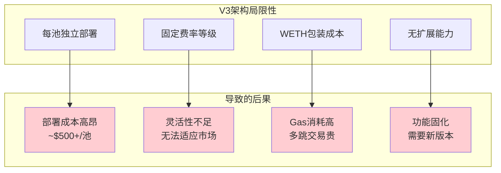
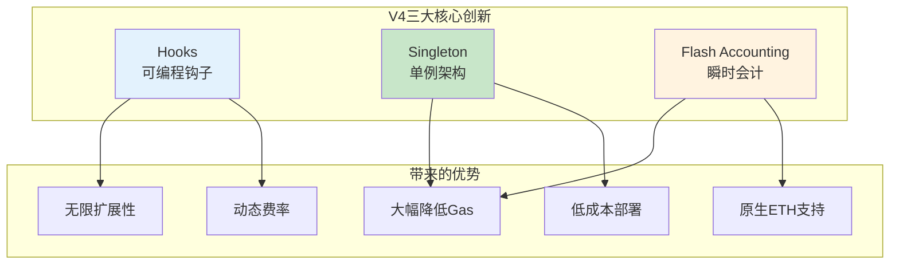
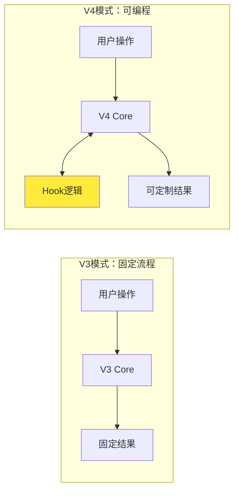
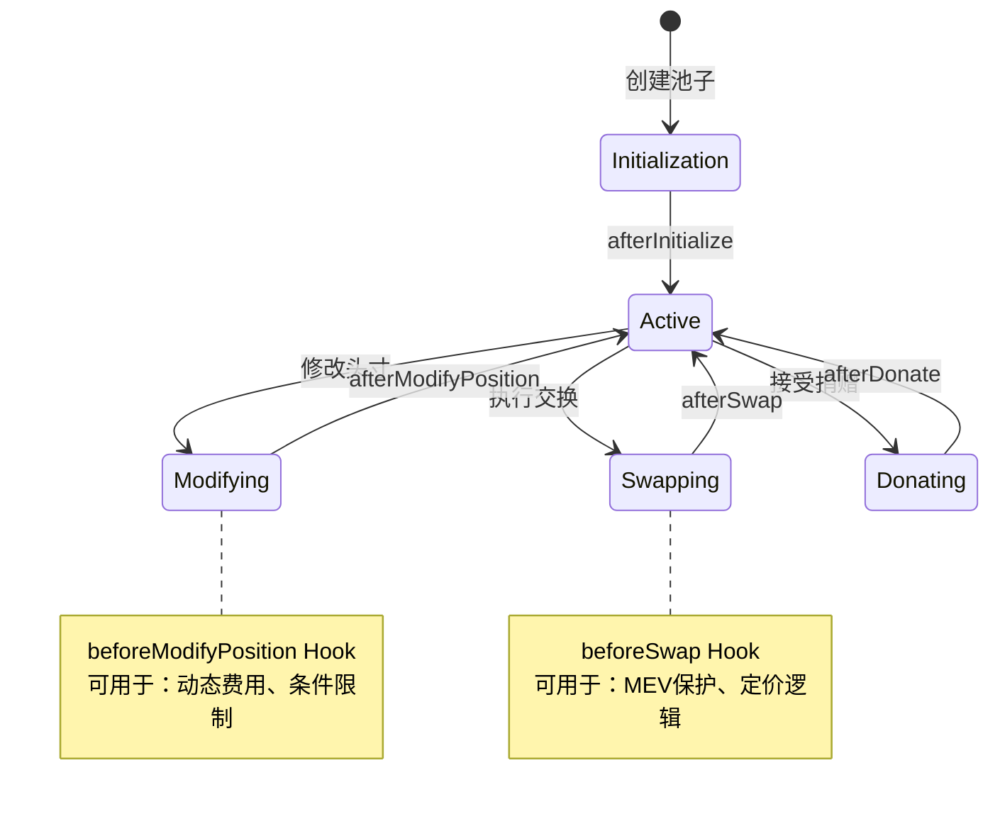
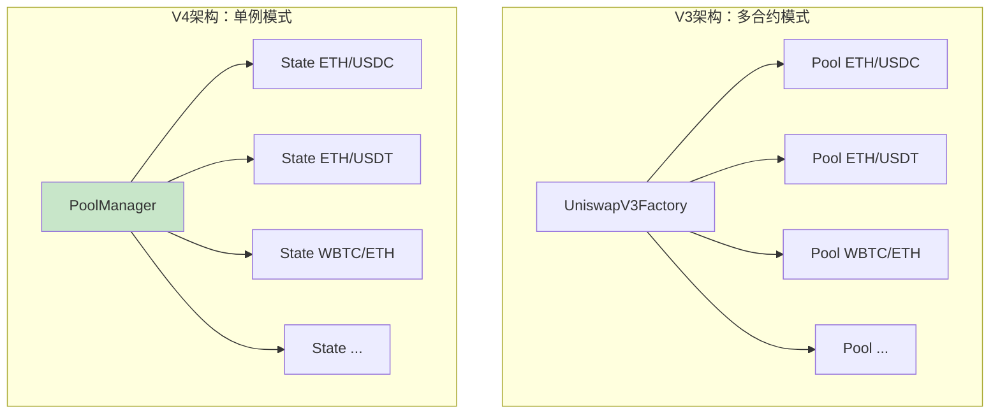
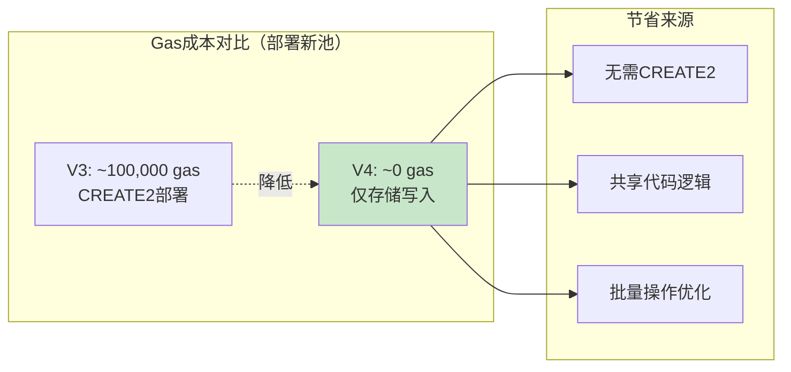
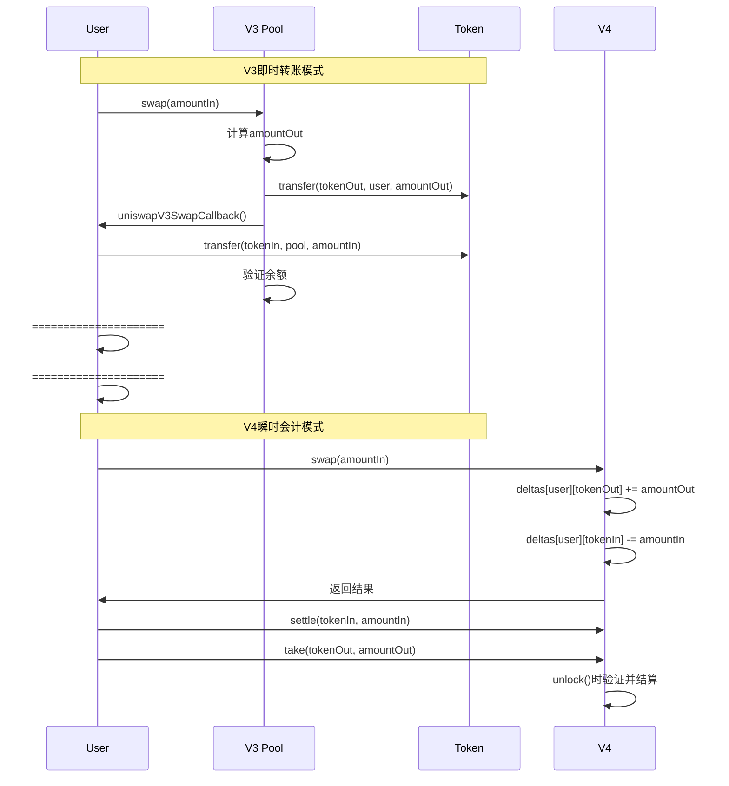
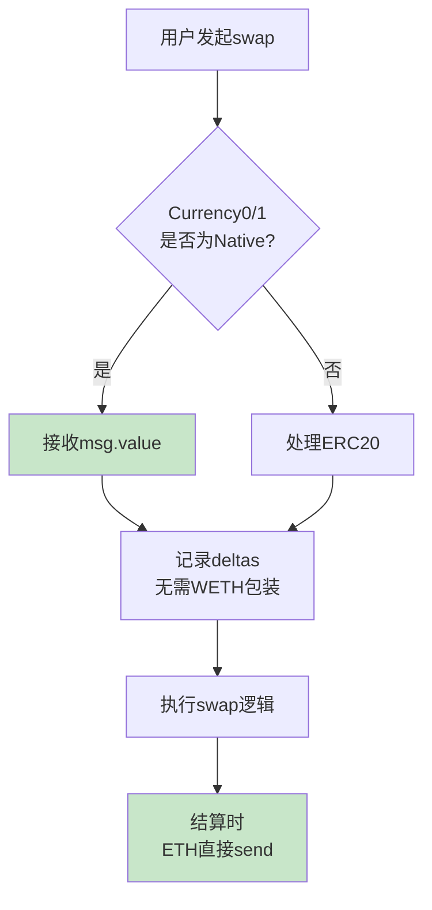
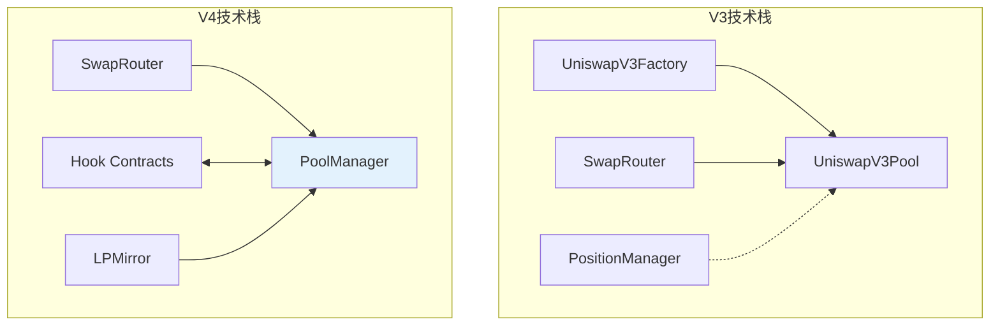
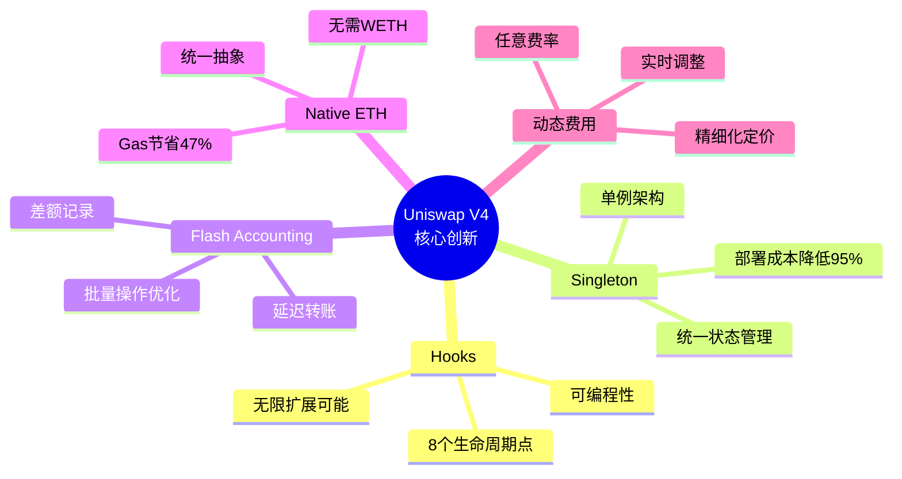

# 死磕Uniswap V4（一）：概述与架构革命

> 本文是「死磕Uniswap V4」系列的第一篇，将深入探讨V4相比V3的革命性架构创新。

## 系列导航

| 序号 | 标题 | 核心内容 |
|:----:|------|----------|
| **01** | **V4概述与架构革命** | Singleton、Hooks、Flash Accounting |
| 02 | Hooks机制深度解析 | Hook接口、生命周期、实现模式 |
| 03 | 单例架构与瞬时会计 | PoolManager、Currency、Accounting |
| 04 | 交换流程与Hook执行时序 | swap函数、Hook调用链、Gas分析 |
| 05 | 费用系统与动态费率 | 自定义费率、动态调整、费用分配 |
| 06 | 账户抽象与原生ETH | Currency类型、settle/take、批量操作 |
| 07 | 安全分析与最佳实践 | Hook安全、MEV防护、审计要点 |

---

## 1. 从V3到V4：一次架构革命

Uniswap V4于2023年6月发布，标志着AMM协议从"固定功能"向"可编程金融基础设施"的重大转变。这次升级不是简单的功能增加，而是从根本上重新设计了AMM的核心架构。

### 1.1 V3的局限性分析

在深入V4之前，让我们先理解V3面临的根本性限制：



**具体问题分析：**

| 局限性 | V3现状 | 实际影响 |
|--------|--------|----------|
| **部署成本** | 每池需CREATE2部署 | 长尾资产无法承担启动成本 |
| **费率僵化** | 仅4个固定档位 | 稳定币和高波动资产被迫使用相同费率 |
| **ETH包装** | 必须使用WETH | 每笔交易额外2次转账 |
| **功能封闭** | 无法自定义逻辑 | 新需求需要等待V5 |

### 1.2 V4的三大核心创新

V4通过三项核心创新彻底改变了AMM的设计范式：



---

## 2. Hooks：AMM的可编程革命

### 2.1 什么是Hooks？

Hooks是V4最核心的创新，它允许开发者在池子生命周期的关键点插入自定义逻辑。这种设计使得Uniswap从一个"产品"转变为一个"平台"。



### 2.2 Hook生命周期

一个完整的池子生命周期中有8个Hook触发点：



### 2.3 Hook接口定义

```solidity
interface IHooks {
    // 初始化Hooks
    function beforeInitialize(address sender, PoolKey calldata key, uint160 sqrtPriceX96, bytes calldata hookData)
        external returns (bytes4);
    function afterInitialize(address sender, PoolKey calldata key, uint160 sqrtPriceX96, bytes calldata hookData)
        external returns (bytes4);

    // 头寸修改Hooks
    function beforeModifyPosition(
        address sender,
        PoolKey calldata key,
        IPoolManager.ModifyPositionParams calldata params,
        bytes calldata hookData
    ) external returns (bytes4, int256 delta0, int256 delta1);
    function afterModifyPosition(
        address sender,
        PoolKey calldata key,
        IPoolManager.ModifyPositionParams calldata params,
        BalanceDelta callerDelta,
        bytes calldata hookData
    ) external returns (bytes4);

    // 交换Hooks
    function beforeSwap(
        address sender,
        PoolKey calldata key,
        IPoolManager.SwapParams calldata params,
        bytes calldata hookData
    ) external returns (bytes4, int256 delta0, int256 delta1);
    function afterSwap(
        address sender,
        PoolKey calldata key,
        IPoolManager.SwapParams calldata params,
        BalanceDelta callerDelta,
        bytes calldata hookData
    ) external returns (bytes4);

    // 捐赠Hooks
    function beforeDonate(
        address sender,
        PoolKey calldata key,
        uint256 amount0,
        uint256 amount1,
        bytes calldata hookData
    ) external returns (bytes4);
    function afterDonate(
        address sender,
        PoolKey calldata key,
        uint256 amount0,
        uint256 amount1,
        bytes calldata hookData
    ) external returns (bytes4);
}
```

### 2.4 Hook应用场景

Hooks可以实现的创新用例：

| Hook类型 | 应用场景 | 实现效果 |
|----------|----------|----------|
| **动态费率Hook** | 根据波动率调整费率 | 高波动时高费率，低波动时低费率 |
| **限价单Hook** | 在特定价格自动执行 | 无需订单簿的限价交易 |
| **彩票Hook** | 随机奖励流动性提供者 | 增加LP趣味性和收益 |
| **时间加权Hook** | 根据持有时间奖励 | 鼓励长期流动性 |
| **预言机Hook** | 自定义价格来源 | 支持特殊定价逻辑 |

**动态费率Hook示例：**

```solidity
contract DynamicFeeHook is IHooks {
    // 根据最近波动率计算动态费率
    function beforeSwap(
        address sender,
        PoolKey calldata key,
        IPoolManager.SwapParams calldata params,
        bytes calldata hookData
    ) external returns (bytes4, int256, int256) {
        // 计算最近1小时的波动率
        uint256 volatility = _calculateVolatility(key);

        // 动态调整费率（基准1000 + 波动率调整）
        uint16 dynamicFee = 1000 + uint16(volatility / 1e14);

        // 更新池子的Hook费率
        IPoolManager(poolManager).setHookFee(key.poolId, dynamicFee);

        return (IHooks.beforeSwap.selector, 0, 0);
    }

    function _calculateVolatility(PoolKey calldata key) private view returns (uint256) {
        // 实现波动率计算逻辑
        // ...
    }
}
```

---

## 3. Singleton：从多合约到单例

### 3.1 架构转变

V3中，每个交易对都是一个独立部署的合约。V4通过Singleton模式将所有池子集中到一个合约中。



### 3.2 PoolManager核心数据结构

```solidity
contract PoolManager is IPoolManager, IHooks, ERC1155Holder {
    // ========== 核心存储 ==========

    // 池子状态（使用poolId索引）
    mapping(bytes32 poolId => Pool.State) public pools;

    // 池子的Slot0数据（tick、价格等）
    mapping(bytes32 poolId => Pool.Slot0) public slot0s;

    // Tick间距配置
    mapping(bytes32 poolId => int24) public tickSpacings;

    // 费用配置
    mapping(bytes32 poolId => Pool.Fees) public fees;

    // 协议费用
    mapping(bytes32 poolId => ProtocolFees) public protocolFees;

    // Hook地址
    mapping(bytes32 poolId => IHooks) public hooks;

    // ========== 瞬时会计系统 ==========

    // 账户差额记录
    mapping(address account => mapping(Currency currency => int256)) public deltas;

    // 锁定状态
    uint256 private locked = 1;

    // ========== 货币系统 ==========

    // Currency => 地址映射（原生ETH为address(0)）
    mapping(Currency => address) public currencyAddresses;
}

// Pool状态结构
library Pool {
    // 池子状态
    struct State {
        uint128 liquidity;          // 当前活跃流动性
        uint128 liquidityNext;      // 下一个tick的流动性
        Slot0 slot0;
        Fees fees;
    }

    // Slot0结构
    struct Slot0 {
        uint160 sqrtPriceX96;       // 当前价格（平方根）
        int24 tick;                 // 当前tick
        uint24 observationIndex;    // 预言机索引
        uint24 protocolFee;         // 协议费率
        uint8 unlocked;             // 锁定状态
    }

    // 费用结构
    struct Fees {
        uint16 fee;                 // 基础费率
        uint16 hookFee;             // Hook控制的费率
    }
}
```

### 3.3 Pool标识符设计

V4使用`PoolKey`作为池子的唯一标识：

```solidity
// PoolKey结构
struct PoolKey {
    Currency currency0;         // Token0（或ETH）
    Currency currency1;         // Token1（或ETH）
    uint24 fee;                 // 基础费率
    int24 tickSpacing;          // Tick间距
    IHooks hooks;               // Hook合约地址
}

// PoolId计算（唯一标识符）
bytes32 poolId = keccak256(abi.encode(key));
```

**为什么不再使用合约地址？**

| 方面 | V3（合约地址） | V4（PoolId） |
|------|---------------|--------------|
| 标识方式 | 合约地址 | keccak256(PoolKey) |
| 部署成本 | CREATE2 (~100k gas) | 纯计算，无gas |
| 查询效率 | 需要外部调用 | mapping直接访问 |
| 存储位置 | 独立合约 | 单合约mapping |

### 3.4 Gas节省分析



**量化分析：**

| 操作 | V3 Gas | V4 Gas | 节省 |
|------|--------|--------|------|
| 创建新池 | ~100,000 | ~5,000 | **95%** |
| 跨池交换 | 按跳数累加 | 单次调用 | **30-40%** |
| ETH交易 | 额外包装成本 | 原生支持 | **~10k** |
| 状态读取 | 外部调用 | 本地mapping | **2,600** |

---

## 4. Flash Accounting：延迟转账的艺术

### 4.1 传统会计 vs 瞬时会计



### 4.2 瞬时会计核心概念

**核心思想：** 在交易过程中只记录"应该发生的金额变化"，而不实际执行转账，在交易结束时统一结算。

```solidity
// 账户差额记录
mapping(address account => mapping(Currency currency => int256)) public deltas;

// 正数 = 应该收取的金额
// 负数 = 应该支付的金额
```

### 4.3 settle() 和 take() 函数

```solidity
// 用户支付金额
function settle(Currency currency, uint256 amount) external {
    require(locked, "Not locked");

    // 记录用户需要支付的金额（负数）
    deltas[msg.sender][currency] -= int256(amount);

    if (currency.isNative()) {
        // 对于ETH，直接检查msg.value
        require(msg.value >= amount, "Insufficient ETH");
    }
    // 对于ERC20，在unlock时统一transferFrom
}

// 用户收取金额
function take(Currency currency, address recipient, uint256 amount) external {
    require(locked, "Not locked");

    // 记录用户应该收到的金额（正数）
    deltas[recipient][currency] += int256(amount);
}

// 结算所有差额
function _accountingBalance() internal {
    for (uint256 i = 0; i < currencies.length; i++) {
        Currency currency = currencies[i];
        int256 delta = deltas[msg.sender][currency];

        if (delta > 0) {
            // 用户应该收款
            if (currency.isNative()) {
                payable(msg.sender).transfer(uint256(delta));
            } else {
                ERC20(currency.address()).transfer(msg.sender, uint256(delta));
            }
        } else if (delta < 0) {
            // 用户应该付款
            uint256 amount = uint256(-delta);
            if (!currency.isNative()) {
                ERC20(currency.address()).transferFrom(msg.sender, address(this), amount);
            }
            // ETH在settle时已经验证msg.value
        }

        // 清零差额
        deltas[msg.sender][currency] = 0;
    }
}
```

### 4.4 安全性保障

**问题：** 如果用户记录了差额但不结算怎么办？

**解决方案：**

1. **Nonce机制**
```solidity
mapping(address => uint256) public nonces;

function _checkNonce() internal {
    uint256 expectedNonce = nonces[msg.sender] + 1;
    require(nonce == expectedNonce, "Invalid nonce");
    nonces[msg.sender] = expectedNonce;
}
```

2. **锁定验证**
```solidity
modifier lock() {
    require(locked == 0, "Already locked");
    locked = 1;
    _;
    locked = 0;

    // unlock时验证所有差额已结算
    _verifyDeltasSettled();
}
```

3. **资金惩罚**
```solidacy
// 如果unlock时差额未结算，扣除保证金或惩罚
```

---

## 5. Native ETH：告别WETH

### 5.1 Currency类型设计

V4引入`Currency`类型统一处理ETH和ERC20：

```solidity
type Currency is address;

library CurrencyLibrary {
    Currency internal constant NATIVE = Currency.wrap(address(0));

    function isNative(Currency currency) internal pure returns (bool) {
        return Currency.unwrap(currency) == address(0);
    }

    function toId(Currency currency) internal pure returns (uint256) {
        return uint256(Currency.unwrap(currency));
    }

    function fromId(uint256 id) internal pure returns (Currency) {
        return Currency.wrap(address(id));
    }
}
```

### 5.2 ETH处理流程



### 5.3 Gas节省对比

| 操作 | V3 (WETH) | V4 (Native) | 节省 |
|------|-----------|-------------|------|
| ETH包装 | ~40,000 | 0 | **100%** |
| ETH解包 | ~40,000 | 0 | **100%** |
| 授权检查 | ~5,000 | 0 | **100%** |
| **单笔交易** | **~85,000** | **~45,000** | **~47%** |

---

## 6. 其他重要特性

### 6.1 自定义费用曲线

V4通过Hooks可以实现任意费用模型：

```solidity
// 示例：基于交易量的阶梯费率
contract VolumeBasedFeeHook {
    function beforeSwap(...) external returns (bytes4, int256, int256) {
        uint256 volume = getRecentVolume(poolId);

        uint16 fee;
        if (volume < 100000e6) {
            fee = 500;      // 0.05%
        } else if (volume < 1000000e6) {
            fee = 3000;     // 0.3%
        } else {
            fee = 10000;    // 1%
        }

        poolManager.setHookFee(poolId, fee - baseFee);
        return (IHooks.beforeSwap.selector, 0, 0);
    }
}
```

### 6.2 EIP-1155 LP代币（可选）

V4支持使用EIP-1155标准的LP代币：

```solidity
// 1155标准允许同质化和非同质化代币共存
// 每个头寸可以是一个独立的token ID
contract LPMirror is ERC1155 {
    function mint(uint256 id, uint256 amount) external {
        // id = keccak256(abi.encode(poolKey, tickLower, tickUpper))
        _mint(msg.sender, id, amount, "");
    }
}
```

### 6.3 更低的创建成本

| 成本项目 | V3 | V4 | 说明 |
|----------|----|----|------|
| Pool部署 | $100-$500 | $1-$5 | 无需独立合约 |
| Hook部署 | - | $20-$50 | 一次性成本 |
| 初始流动性 | 同V3 | 同V3 | 无变化 |
| **总启动成本** | **$500+** | **~$50** | **降低90%** |

---

## 7. V3 vs V4 完整对比

### 7.1 架构对比



### 7.2 功能对比表

| 特性 | V3 | V4 | 改进 |
|------|----|----|------|
| **架构** | 每池一合约 | 单例模式 | 部署成本↓95% |
| **扩展性** | 固定功能 | Hooks可编程 | 无限可能 |
| **费率** | 4个固定档位 | 任意动态费率 | 精细化定价 |
| **ETH支持** | 需要WETH | 原生支持 | Gas↓47% |
| **转账** | 即时转账 | 瞬时会计 | 批量操作优化 |
| **LP代币** | ERC721 NFT | ERC1155可选 | 更灵活 |
| **Gas效率** | 基准 | 降低30-40% | 成本显著降低 |
| **创建池** | Factory CREATE2 | 纯存储写入 | 接近零成本 |

### 7.3 适用场景

**V3更适合：**
- 简单的流动性提供
- 标准交易对
- 不需要特殊逻辑

**V4更适合：**
- 需要自定义费用模型
- 复杂的交易逻辑
- 成本敏感的长尾资产
- 需要原生ETH支持
- 创新金融产品

---

## 8. 本章小结

### 8.1 V4核心创新总结



### 8.2 关键概念回顾

| 概念 | 定义 | 重要性 |
|------|------|--------|
| Hooks | 池子生命周期的可编程插入点 | V4的核心创新 |
| Singleton | 所有池子共享一个合约 | 降低部署成本 |
| PoolKey | 池子的唯一标识符 | 替代合约地址 |
| Currency | ETH/ERC20的统一抽象 | 原生ETH支持 |
| settle/take | 瞬时会计的结算函数 | 延迟转账机制 |
| deltas | 账户差额记录 | 会计系统核心 |

### 8.3 设计哲学

V4体现了几个重要的设计哲学：

1. **可组合性优先** - Hooks使得任何人都可以扩展功能
2. **Gas效率** - Singleton和Flash Accounting大幅降低成本
3. **开发者友好** - 统一的Currency抽象，简化开发
4. **渐进式升级** - Hooks允许无需V5即可创新

---

## 下一篇预告

在下一篇文章中，我们将深入探讨**Hooks机制**，包括：
- 每个Hook函数的详细参数和返回值
- Hook执行顺序和时序
- 常见Hook实现模式
- Hook开发最佳实践
- 安全考虑和常见陷阱

---

## 参考资料

- [Uniswap V4 白皮书](https://uniswap.org/whitepaper-v4.pdf)
- [Uniswap V4 Core 源码](https://github.com/Uniswap/v4-core)
- [Uniswap V4 Hooks 文档](https://github.com/Uniswap/v4-periphery)
- [EIP-1155: Multi Token Standard](https://eips.ethereum.org/EIPS/eip-1155)
