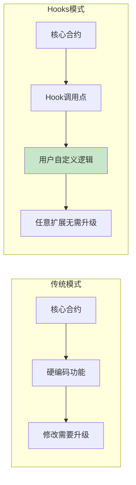
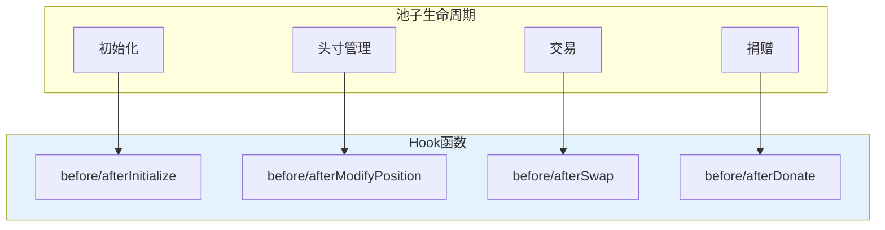
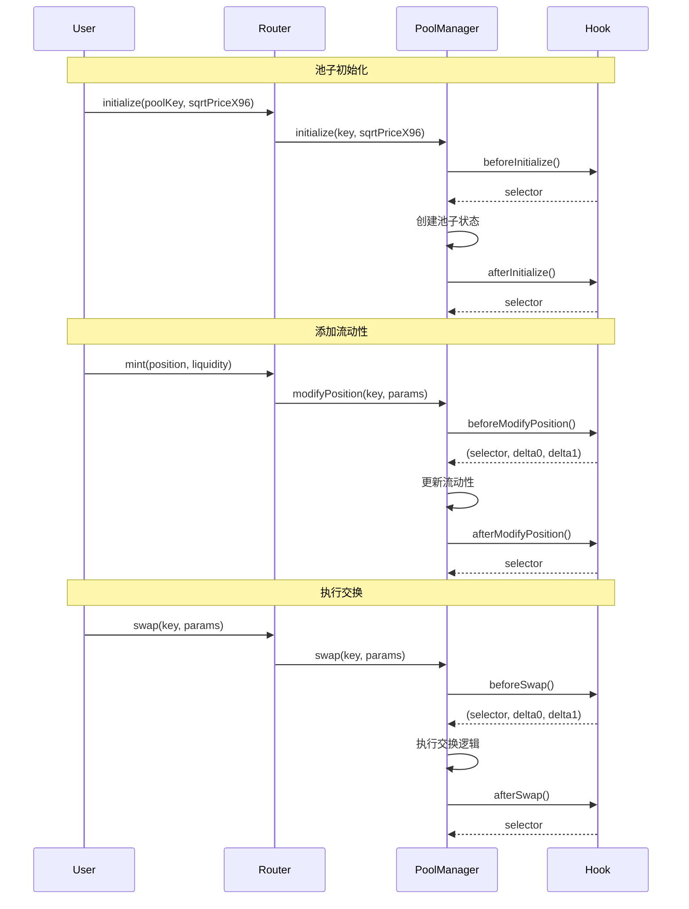
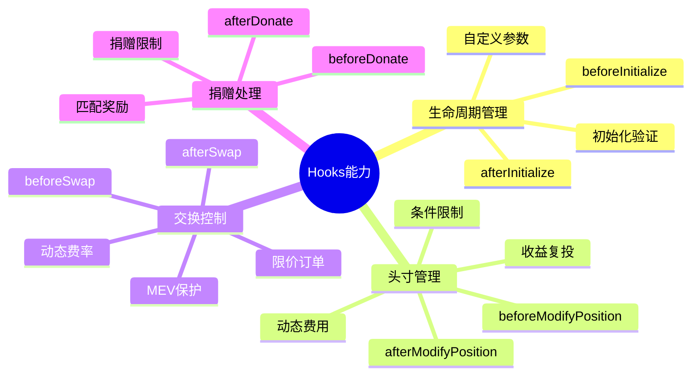

# 死磕Uniswap V4（二）：Hooks机制深度解析

> 本文是「死磕Uniswap V4」系列的第二篇，深入剖析V4最核心的创新——Hooks（钩子）机制。

## 系列导航

| 序号 | 标题 | 核心内容 |
|:----:|------|----------|
| 01 | V4概述与架构革命 | Singleton、Hooks、Flash Accounting |
| **02** | **Hooks机制深度解析** | **Hook接口、生命周期、实现模式** |
| 03 | 单例架构与瞬时会计 | PoolManager、Currency、Accounting |
| 04 | 交换流程与Hook执行时序 | swap函数、Hook调用链、Gas分析 |
| 05 | 费用系统与动态费率 | 自定义费率、动态调整、费用分配 |
| 06 | 账户抽象与原生ETH | Currency类型、settle/take、批量操作 |
| 07 | 安全分析与最佳实践 | Hook安全、MEV防护、审计要点 |

---

## 1. Hooks设计理念

### 1.1 为什么需要Hooks？

在传统的智能合约设计中，如果要扩展功能，通常需要：
1. 升级合约（复杂且危险）
2. 部署新版本（导致流动性碎片化）
3. 使用代理模式（增加复杂度和Gas）

Hooks提供了一种**非侵入式**的扩展机制：



### 1.2 Hooks的设计原则

Uniswap V4的Hooks设计遵循以下原则：

| 原则 | 说明 | 实现方式 |
|------|------|----------|
| **非侵入性** | 核心逻辑不依赖Hook | Hook失败不影响核心流程 |
| **可选性** | 每个Hook都是可选的 | 返回0x0表示未实现 |
| **权限控制** | 只有授权地址可以调用Hook | 验证msg.sender |
| **Gas效率** | Hook调用成本最小化 | 静态调用，无额外delegatecall |
| **可组合性** | Hook可以调用其他合约 | 支持复杂逻辑 |

### 1.3 Hook与核心合约的关系

```solidity
// PoolManager中的Hook调用
contract PoolManager {
    IHooks public immutable hooks;

    function _callBeforeSwap(
        PoolKey calldata key,
        SwapParams calldata params
    ) internal returns (int256 delta0, int256 delta1) {
        if (address(key.hooks) == address(0)) return (0, 0);

        // 检查Hook是否实现了beforeSwap
        if (!_isHookImplemented(key.hooks, beforeSwapSelector)) {
            return (0, 0);
        }

        // 静态调用Hook
        (bytes4 selector, int256 hookDelta0, int256 hookDelta1) =
            key.hooks.beforeSwap(msg.sender, key, params, params.hookData);

        // 验证返回的selector
        require(selector == IHooks.beforeSwap.selector, "Invalid hook return");

        return (hookDelta0, hookDelta1);
    }
}
```

---

## 2. Hook接口详解

### 2.1 Hook函数概览

V4定义了8个Hook函数，覆盖池子的完整生命周期：



### 2.2 初始化Hooks

#### beforeInitialize

在池子初始化之前调用，可用于：
- 验证初始化参数
- 自定义初始价格
- 设置Hook内部状态

```solidity
function beforeInitialize(
    address sender,
    PoolKey calldata key,
    uint160 sqrtPriceX96,
    bytes calldata hookData
) external returns (bytes4) {
    // 验证参数
    require(sqrtPriceX96 >= TickMath.MIN_SQRT_RATIO, "Price too low");
    require(sqrtPriceX96 <= TickMath.MAX_SQRT_RATIO, "Price too high");

    // 自定义初始价格（可选）
    // uint160 customPrice = _calculateCustomPrice(key, hookData);

    // 设置Hook内部状态
    _initializePoolState(key);

    return (IHooks.beforeInitialize.selector);
}
```

#### afterInitialize

在池子初始化之后调用，可用于：
- 记录初始化事件
- 触发后续操作
- 与其他协议交互

```solidity
function afterInitialize(
    address sender,
    PoolKey calldata key,
    uint160 sqrtPriceX96,
    bytes calldata hookData
) external returns (bytes4) {
    // 记录初始化事件
    emit PoolInitialized(key.poolId, sqrtPriceX96, block.timestamp);

    // 启动定时任务（如定期再平衡）
    _scheduleRebalance(key);

    return (IHooks.afterInitialize.selector);
}
```

### 2.3 头寸管理Hooks

#### beforeModifyPosition

在修改流动性头寸之前调用，这是最强大的Hook之一：

```solidmaid
function beforeModifyPosition(
    address sender,
    PoolKey calldata key,
    IPoolManager.ModifyPositionParams calldata params,
    bytes calldata hookData
) external returns (bytes4, int256 delta0, int256 delta1) {
    // params包含:
    // - int24 tickLower: 下界tick
    // - int24 tickUpper: 上界tick
    // - int128 liquidityDelta: 流动性变化量

    // 应用场景1: 动态费用
    // 根据头寸位置动态调整费率
    if (params.liquidityDelta > 0) {
        // 增加流动性时收取一次性费用
        uint256 fee = _calculateEntryFee(key, params);
        if (fee > 0) {
            (uint128 amount0, uint128 amount1) = _getFeeAmounts(key, fee);
            delta0 = int256(amount0);
            delta1 = int256(amount1);
        }
    }

    // 应用场景2: 条件限制
    // 限制只能在特定价格区间内添加流动性
    (uint160 currentPrice, , ,) = poolManager.slot0s(key.poolId);
    if (!_isAllowedRange(currentPrice, params.tickLower, params.tickUpper)) {
        revert("Range not allowed");
    }

    // 应用场景3: 收益复投
    // 自动将已赚取的费用复投到新流动性中
    if (_shouldCompound(sender)) {
        _compoundFees(sender, key);
    }

    return (IHooks.beforeModifyPosition.selector, delta0, delta1);
}
```

**返回值说明：**
- `delta0/delta1`: Hook可以从用户收取额外费用（正数=用户付给Hook）

#### afterModifyPosition

在修改头寸之后调用：

```solidity
function afterModifyPosition(
    address sender,
    PoolKey calldata key,
    IPoolManager.ModifyPositionParams calldata params,
    BalanceDelta callerDelta,
    bytes calldata hookData
) external returns (bytes4) {
    // callerDelta: 实际发生的代币变化

    // 应用场景1: 费用分配
    if (params.liquidityDelta > 0) {
        _distributeProtocolFee(key, callerDelta);
    }

    // 应用场景2: 奖励计算
    // 记录流动性贡献，用于后续奖励分配
    _trackLiquidityContribution(sender, key, params);

    // 应用场景3: 动态NFT属性
    // 根据头寸大小更新NFT元数据
    _updatePositionMetadata(sender, key, params);

    return (IHooks.afterModifyPosition.selector);
}
```

### 2.4 交换Hooks

#### beforeSwap

在执行交换之前调用，这是最常用的Hook：

```solidity
function beforeSwap(
    address sender,
    PoolKey calldata key,
    IPoolManager.SwapParams calldata params,
    bytes calldata hookData
) external returns (bytes4, int256 delta0, int256 delta1) {
    // params包含:
    // - bool zeroForOne: 交换方向
    // - int256 amountSpecified: 指定数量（正=输入，负=输出）
    // - uint160 sqrtPriceLimitX96: 价格限制

    // ========== 应用场景 ==========

    // 场景1: 动态费率
    uint256 volatility = _calculateVolatility(key);
    uint16 dynamicFee = _getDynamicFee(volatility);
    poolManager.setHookFee(key.poolId, dynamicFee);

    // 场景2: MEV保护
    if (_isSuspiciousTransaction(sender, params)) {
        // 限制交易规模或增加费率
        _applyMevProtection(key, params);
    }

    // 场景3: 限价订单
    if (_isLimitOrder(hookData)) {
        _handleLimitOrder(sender, key, params, hookData);
    }

    // 场景4: 自定义定价
    // Hook可以自定义swap的计算逻辑
    (int256 customDelta0, int256 customDelta1) =
        _calculateCustomSwap(key, params);

    return (IHooks.beforeSwap.selector, customDelta0, customDelta1);
}
```

**关键点：**
- `delta0/delta1` 可以自定义交换的实际数量
- 返回 `(0, 0)` 表示使用默认计算
- 返回非零值会覆盖默认计算结果

#### afterSwap

在交换完成后调用：

```solidity
function afterSwap(
    address sender,
    PoolKey calldata key,
    IPoolManager.SwapParams calldata params,
    BalanceDelta callerDelta,
    bytes calldata hookData
) external returns (bytes4) {
    // callerDelta: 实际发生的代币变化

    // 应用场景1: 费用分配
    uint256 hookFee = _calculateHookFee(key, callerDelta);
    if (hookFee > 0) {
        _collectHookFee(sender, key, hookFee);
    }

    // 应用场景2: 交易追踪
    _updateTradingVolume(sender, key, callerDelta);

    // 应用场景3: 奖励分配
    // 向流动性提供者分配交易费用
    if (params.amountSpecified > 0) {
        _distributeTradingFees(key, callerDelta);
    }

    // 应用场景4: 彩票/空投
    // 随机选择交易者进行奖励
    _maybeRunLottery(sender, key);

    return (IHooks.afterSwap.selector);
}
```

### 2.5 捐赠Hooks

#### beforeDonate / afterDonate

```solidity
function beforeDonate(
    address sender,
    PoolKey calldata key,
    uint256 amount0,
    uint256 amount1,
    bytes calldata hookData
) external returns (bytes4) {
    // 应用场景1: 捐赠限制
    // 限制只能捐赠一定比例
    uint256 totalLiquidity = poolManager.pools(key.poolId).liquidity;
    require(amount0 < totalLiquidity / 10, "Donate too much");

    // 应用场景2: 捐赠匹配
    // 按比例匹配捐赠给流动性提供者
    if (amount0 > 0) {
        _matchDonation(sender, key, amount0);
    }

    return (IHooks.beforeDonate.selector);
}
```

---

## 3. Hook执行时序

### 3.1 完整的Hook调用链



### 3.2 Hook返回值处理

```solidity
// PoolManager中的Hook调用模式
function _callHookAndReturnValue(
    IHooks hooks,
    bytes4 selector,
    bytes memory data
) internal returns (bytes4 returnedSelector, int256 delta0, int256 delta1) {
    (bool success, bytes memory result) = address(hooks).staticcall(data);

    if (!success) {
        // Hook未实现或调用失败
        if (result.length == 0) {
            // 未实现，返回默认值
            return (bytes4(0), 0, 0);
        }
        // 调用失败，revert
        revert("Hook call failed");
    }

    // 解析返回值
    returnedSelector = bytes4(result[:4]);
    delta0 = int256(bytes32(result[4:36]));
    delta1 = int256(bytes32(result[36:68]));

    // 验证selector
    require(returnedSelector == selector, "Invalid hook return");
}
```

### 3.3 Hook调用Gas成本

| 操作 | 基础Gas | Hook调用 | 总计 |
|------|---------|----------|------|
| initialize | ~50,000 | ~5,000 | ~55,000 |
| modifyPosition | ~80,000 | ~10,000 | ~90,000 |
| swap | ~60,000 | ~15,000 | ~75,000 |

**优化技巧：**
- 使用`view`函数检查Hook是否实现
- 避免在Hook中进行存储操作
- 批量处理逻辑

---

## 4. Hook实现模式

### 4.1 NoOpHook（空Hook）

最简单的Hook，什么都不做：

```solidity
contract NoOpHook is IHooks {
    function beforeInitialize(
        address sender,
        PoolKey calldata key,
        uint160 sqrtPriceX96,
        bytes calldata hookData
    ) external returns (bytes4) {
        return (IHooks.beforeInitialize.selector);
    }

    // 其他Hook函数都返回selector但不做任何事
    // 或者直接不实现，让PoolManager检查到未实现
}
```

### 4.2 DynamicFeeHook（动态费率）

根据市场条件动态调整费率：

```solidmaid
contract DynamicFeeHook is IHooks {
    IPoolManager public immutable poolManager;
    uint256 public baseFee = 3000; // 0.3%

    // 费率范围
    uint256 public constant MIN_FEE = 100;   // 0.01%
    uint256 public constant MAX_FEE = 10000; // 1%

    // 波动率窗口
    uint256 public constant VOLATILITY_WINDOW = 1 hours;

    struct PoolState {
        uint256 lastTimestamp;
        uint256 lastPrice;
        uint256 cumulativeVolatility;
    }

    mapping(bytes32 => PoolState) public poolStates;

    constructor(IPoolManager _poolManager) {
        poolManager = _poolManager;
    }

    function beforeSwap(
        address sender,
        PoolKey calldata key,
        IPoolManager.SwapParams calldata params,
        bytes calldata hookData
    ) external returns (bytes4, int256, int256) {
        // 获取当前价格
        (uint160 currentPriceX96, , ,) = poolManager.slot0s(key.poolId);
        uint256 currentPrice = currentPriceX96;

        // 更新波动率
        PoolState storage state = poolStates[key.poolId];
        uint256 volatility = _updateVolatility(
            key.poolId,
            currentPrice,
            state.lastTimestamp,
            block.timestamp
        );

        state.lastPrice = currentPrice;
        state.lastTimestamp = block.timestamp;

        // 计算动态费率
        uint256 dynamicFee = _calculateDynamicFee(volatility);

        // 更新Hook费率
        poolManager.setHookFee(key.poolId, uint16(dynamicFee - baseFee));

        return (IHooks.beforeSwap.selector, 0, 0);
    }

    function _updateVolatility(
        bytes32 poolId,
        uint256 currentPrice,
        uint256 lastTimestamp,
        uint256 currentTimestamp
    ) private returns (uint256) {
        if (lastTimestamp == 0) return 0;

        uint256 priceChange = currentPrice > poolStates[poolId].lastPrice
            ? currentPrice - poolStates[poolId].lastPrice
            : poolStates[poolId].lastPrice - currentPrice;

        uint256 timeDelta = currentTimestamp - lastTimestamp;
        uint256 volatility = (priceChange * 1e18) / poolStates[poolId].lastPrice;

        // 指数移动平均
        uint256 alpha = timeDelta * 1e18 / VOLATILITY_WINDOW;
        poolStates[poolId].cumulativeVolatility =
            (volatility * alpha + poolStates[poolId].cumulativeVolatility * (1e18 - alpha)) / 1e18;

        return poolStates[poolId].cumulativeVolatility;
    }

    function _calculateDynamicFee(uint256 volatility) private view returns (uint256) {
        // 波动率越高，费率越高
        uint256 feeAdjustment = (volatility * 7000) / 1e18; // 最高增加0.7%
        uint256 dynamicFee = baseFee + feeAdjustment;

        // 限制在范围内
        return _min(MAX_FEE, _max(MIN_FEE, dynamicFee));
    }

    function _min(uint256 a, uint256 b) private pure returns (uint256) {
        return a < b ? a : b;
    }

    function _max(uint256 a, uint256 b) private pure returns (uint256) {
        return a > b ? a : b;
    }
}
```

### 4.3 LimitOrderHook（限价订单）

实现类似订单簿的限价单功能：

```solidity
contract LimitOrderHook is IHooks {
    IPoolManager public immutable poolManager;

    struct LimitOrder {
        address owner;
        int24 tick;
        uint128 amount;
        bool zeroForOne;
        bool filled;
    }

    mapping(uint256 => LimitOrder) public orders;
    uint256 public nextOrderId = 1;

    // 创建限价单
    function createLimitOrder(
        PoolKey calldata key,
        int24 tick,
        uint128 amount,
        bool zeroForOne
    ) external returns (uint256) {
        uint256 orderId = nextOrderId++;

        orders[orderId] = LimitOrder({
            owner: msg.sender,
            tick: tick,
            amount: amount,
            zeroForOne: zeroForOne,
            filled: false
        });

        emit LimitOrderCreated(orderId, msg.sender, key.poolId, tick, amount);

        return orderId;
    }

    function beforeSwap(
        address sender,
        PoolKey calldata key,
        IPoolManager.SwapParams calldata params,
        bytes calldata hookData
    ) external returns (bytes4, int256, int256) {
        (uint160 currentPriceX96, int24 currentTick, , ) = poolManager.slot0s(key.poolId);

        // 检查是否有匹配的限价单
        for (uint256 i = 1; i < nextOrderId; i++) {
            LimitOrder storage order = orders[i];

            if (order.filled) continue;
            if (order.zeroForOne == params.zeroForOne) continue;

            // 检查是否到达目标价格
            bool orderReached = order.zeroForOne
                ? currentTick <= order.tick
                : currentTick >= order.tick;

            if (orderReached) {
                // 执行限价单
                _fillOrder(order, key, params);

                // 更新swap参数
                params.amountSpecified += int256(order.amount);
            }
        }

        return (IHooks.beforeSwap.selector, 0, 0);
    }

    function _fillOrder(
        LimitOrder storage order,
        PoolKey calldata key,
        IPoolManager.SwapParams calldata params
    ) private {
        order.filled = true;

        // 执行交换给订单创建者
        // ... 实际的交换逻辑

        emit LimitOrderFilled(
            nextOrderId - 1,
            order.owner,
            key.poolId,
            order.amount
        );
    }

    // 取消限价单
    function cancelLimitOrder(uint256 orderId) external {
        require(orders[orderId].owner == msg.sender, "Not owner");
        orders[orderId].filled = true;
        emit LimitOrderCancelled(orderId);
    }

    event LimitOrderCreated(uint256 indexed orderId, address indexed owner, bytes32 poolId, int24 tick, uint128 amount);
    event LimitOrderFilled(uint256 indexed orderId, address indexed owner, bytes32 poolId, uint128 amount);
    event LimitOrderCancelled(uint256 indexed orderId);
}
```

### 4.4 LotteryHook（彩票机制）

随机奖励交易者：

```solidity
contract LotteryHook is IHooks {
    IPoolManager public immutable poolManager;

    uint256 public prizePool;
    uint256 public lastLotteryTime;
    uint256 public lotteryInterval = 1 days;

    struct Ticket {
        address participant;
        uint256 weight;
    }

    Ticket[] public tickets;

    function beforeSwap(
        address sender,
        PoolKey calldata key,
        IPoolManager.SwapParams calldata params,
        bytes calldata hookData
    ) external returns (bytes4, int256, int256) {
        // 每笔交易收取小额费用进入奖池
        uint256 lotteryFee = abs(params.amountSpecified) / 1000; // 0.1%
        prizePool += lotteryFee;

        // 记录彩票
        tickets.push(Ticket({
            participant: sender,
            weight: abs(params.amountSpecified)
        }));

        // 检查是否应该开奖
        if (block.timestamp >= lastLotteryTime + lotteryInterval) {
            _runLottery(key);
        }

        return (IHooks.beforeSwap.selector, 0, 0);
    }

    function _runLottery(PoolKey calldata key) private {
        // 计算总权重
        uint256 totalWeight = 0;
        for (uint256 i = 0; i < tickets.length; i++) {
            totalWeight += tickets[i].weight;
        }

        // 随机选择获胜者
        uint256 random = uint256(keccak256(abi.encodePacked(
            block.timestamp,
            block.prevrandao,
            tickets.length
        )));

        uint256 winningWeight = random % totalWeight;
        uint256 cumulativeWeight = 0;
        address winner;

        for (uint256 i = 0; i < tickets.length; i++) {
            cumulativeWeight += tickets[i].weight;
            if (winningWeight < cumulativeWeight) {
                winner = tickets[i].participant;
                break;
            }
        }

        // 发放奖励
        if (winner != address(0)) {
            // 将奖池中的代币转给获胜者
            _transferPrize(winner, key, prizePool);
            emit LotteryWon(winner, prizePool);
        }

        // 重置
        prizePool = 0;
        delete tickets;
        lastLotteryTime = block.timestamp;
    }

    function _transferPrize(
        address winner,
        PoolKey calldata key,
        uint256 amount
    ) private {
        // 实际的奖励转账逻辑
        // ...
    }

    function abs(int256 x) private pure returns (uint256) {
        return x >= 0 ? uint256(x) : uint256(-x);
    }

    event LotteryWon(address indexed winner, uint256 amount);
}
```

### 4.5 VolatilityHook（波动率调整）

根据波动率调整流动性分布：

```solidity
contract VolatilityHook is IHooks {
    IPoolManager public immutable poolManager;

    mapping(bytes32 => uint256) public volatilityScores;

    function beforeSwap(
        address sender,
        PoolKey calldata key,
        IPoolManager.SwapParams calldata params,
        bytes calldata hookData
    ) external returns (bytes4, int256, int256) {
        // 计算瞬时波动率
        uint256 volatility = _calculateInstantVolatility(key, params);
        volatilityScores[key.poolId] = volatility;

        return (IHooks.beforeSwap.selector, 0, 0);
    }

    function afterModifyPosition(
        address sender,
        PoolKey calldata key,
        IPoolManager.ModifyPositionParams calldata params,
        BalanceDelta callerDelta,
        bytes calldata hookData
    ) external returns (bytes4) {
        // 根据当前波动率建议流动性分布
        uint256 volatility = volatilityScores[key.poolId];

        if (volatility > 1e17) { // 高波动
            // 建议更宽的价格区间
            emit SuggestedRange(key.poolId, params.tickLower - 1000, params.tickUpper + 1000);
        } else if (volatility < 1e15) { // 低波动
            // 建议更窄的价格区间
            emit SuggestedRange(key.poolId, params.tickLower + 100, params.tickUpper - 100);
        }

        return (IHooks.afterModifyPosition.selector);
    }

    function _calculateInstantVolatility(
        PoolKey calldata key,
        IPoolManager.SwapParams calldata params
    ) private view returns (uint256) {
        (uint160 priceX96, , ,) = poolManager.slot0s(key.poolId);
        uint256 priceImpact = abs(params.amountSpecified) * 1e18 / uint256(priceX96);
        return priceImpact;
    }

    function abs(int256 x) private pure returns (uint256) {
        return x >= 0 ? uint256(x) : uint256(-x);
    }

    event SuggestedRange(bytes32 indexed poolId, int24 suggestedLower, int24 suggestedUpper);
}
```

---

## 5. Hook开发最佳实践

### 5.1 安全考虑

```solidity
contract SecureHook is IHooks {
    IPoolManager public immutable poolManager;

    // 1. 验证调用者
    modifier onlyPoolManager() {
        require(msg.sender == address(poolManager), "Not PoolManager");
        _;
    }

    // 2. 检查重入
    modifier nonReentrant() {
        require(locked == 0, "Reentrant");
        locked = 1;
        _;
        locked = 0;
    }
    uint256 private locked;

    // 3. 防止整数溢出
    using SafeMath for uint256;

    // 4. 事件记录
    event HookCalled(bytes4 indexed selector, address indexed caller);

    // 5. 实现所有Hook函数
    function beforeSwap(
        address sender,
        PoolKey calldata key,
        IPoolManager.SwapParams calldata params,
        bytes calldata hookData
    ) external onlyPoolManager nonReentrant returns (bytes4, int256, int256) {
        emit HookCalled(IHooks.beforeSwap.selector, sender);

        // Hook逻辑
        // ...

        return (IHooks.beforeSwap.selector, 0, 0);
    }

    // ... 其他Hook函数
}
```

### 5.2 Gas优化技巧

```solidity
contract GasOptimizedHook is IHooks {
    // 1. 使用immutable
    IPoolManager public immutable poolManager;

    // 2. 打包存储变量
    struct PackedData {
        uint128 value1;  // 128位
        uint64 value2;   // 64位
        bool flag1;      // 1位
        bool flag2;      // 1位
        // 总计: 194位，可以放在一个slot中
    }
    mapping(bytes32 => PackedData) public packedData;

    // 3. 使用calldata而不是memory
    function beforeSwap(
        address sender,
        PoolKey calldata key,
        IPoolManager.SwapParams calldata params,
        bytes calldata hookData
    ) external returns (bytes4, int256, int256) {
        // 4. 短路求值
        if (params.amountSpecified == 0) {
            return (IHooks.beforeSwap.selector, 0, 0);
        }

        // 5. 避免循环中的存储操作
        PackedData memory data = packedData[key.poolId];
        // 批量处理
        data.value1 += 1;
        data.value2 += 2;
        packedData[key.poolId] = data;

        return (IHooks.beforeSwap.selector, 0, 0);
    }

    // 6. 缓存存储变量
    function expensiveOperation() external {
        uint256 cachedValue = someStorageVariable;
        for (uint256 i = 0; i < 100; i++) {
            // 使用cachedValue
        }
        someStorageVariable = cachedValue;
    }
}
```

### 5.3 常见陷阱

| 陷阱 | 说明 | 解决方案 |
|------|------|----------|
| **Hook失败导致核心失败** | Hook revert会阻止整个交易 | 使用try-catch或严格测试 |
| **状态不一致** | Hook修改状态但核心操作失败 | 在after* Hook中验证 |
| **重入攻击** | Hook调用外部合约 | 使用nonReentrant修饰符 |
| **Gas griefing** | Hook消耗过多gas | 设置gas限制 |
| **权限绕过** | 未验证msg.sender | 添加onlyPoolManager修饰符 |

### 5.4 测试策略

```solidity
// Hook测试模板
contract HookTest is Test {
    Hook target;
    PoolManager poolManager;
    PoolKey poolKey;

    function setUp() public {
        // 部署依赖合约
        poolManager = new PoolManager();
        target = new Hook(poolManager);

        // 设置测试池子
        poolKey = PoolKey({
            currency0: CurrencyLibrary.NATIVE,
            currency1: Currency.wrap(address(usdc)),
            fee: 3000,
            tickSpacing: 60,
            hooks: target
        });
    }

    function testBeforeSwap_ReturnsCorrectSelector() public {
        (bytes4 selector,,) = target.beforeSwap(
            address(this),
            poolKey,
            SwapParams({
                zeroForOne: true,
                amountSpecified: 1e18,
                sqrtPriceLimitX96: TickMath.MIN_SQRT_RATIO + 1,
                hookData: ""
            }),
            ""
        );

        assertEq(selector, IHooks.beforeSwap.selector);
    }

    function testBeforeSwap_RevertsWithInvalidParams() public {
        vm.expectRevert();
        target.beforeSwap(
            address(0), // 无效地址
            poolKey,
            SwapParams({
                zeroForOne: true,
                amountSpecified: -1, // 无效数量
                sqrtPriceLimitX96: 0,
                hookData: ""
            }),
            ""
        );
    }

    function testFuzz_BeforeSwap(int256 amount) public {
        vm.assume(amount > 0);
        vm.assume(amount < 1e30);

        (bytes4 selector,,) = target.beforeSwap(
            address(this),
            poolKey,
            SwapParams({
                zeroForOne: true,
                amountSpecified: amount,
                sqrtPriceLimitX96: TickMath.MIN_SQRT_RATIO + 1,
                hookData: ""
            }),
            ""
        );

        assertEq(selector, IHooks.beforeSwap.selector);
    }
}
```

---

## 6. 本章小结

### 6.1 Hooks能力总结



### 6.2 Hook函数快速参考

| Hook函数 | 触发时机 | 返回值 | 主要用途 |
|----------|----------|--------|----------|
| `beforeInitialize` | 创建池子前 | selector | 参数验证、初始价格设置 |
| `afterInitialize` | 创建池子后 | selector | 事件记录、后续操作触发 |
| `beforeModifyPosition` | 修改头寸前 | selector, delta0, delta1 | 动态费用、条件限制 |
| `afterModifyPosition` | 修改头寸后 | selector | 费用分配、奖励计算 |
| `beforeSwap` | 执行交换前 | selector, delta0, delta1 | 动态费率、自定义定价 |
| `afterSwap` | 执行交换后 | selector | 费用分配、交易追踪 |
| `beforeDonate` | 捐赠前 | selector | 捐赠限制、匹配 |
| `afterDonate` | 捐赠后 | selector | 奖励分配 |

### 6.3 关键要点

1. **Hooks是可选的** - 未实现的Hook不会影响核心功能
2. **返回值重要** - selector用于验证实现，delta用于自定义计算
3. **Gas敏感** - Hook代码需要优化以避免过高的gas成本
4. **安全第一** - Hook有权限访问核心状态，需要严格审计
5. **可组合性强** - Hook可以调用其他合约，实现复杂逻辑

---

## 下一篇预告

在下一篇文章中，我们将深入探讨**单例架构与瞬时会计**，包括：
- PoolManager合约结构详解
- PoolKey和PoolId设计
- 瞬时会计系统的实现
- settle()和take()函数原理
- Currency类型与原生ETH支持

---

## 参考资料

- [Uniswap V4 Core - IHooks.sol](https://github.com/Uniswap/v4-core/blob/main/src/interfaces/IHooks.sol)
- [Uniswap V4 Periphery - Hook Examples](https://github.com/Uniswap/v4-periphery)
- [EIP-3372: Precompile for Ed25519](https://eips.ethereum.org/EIPS/eip-3372)
