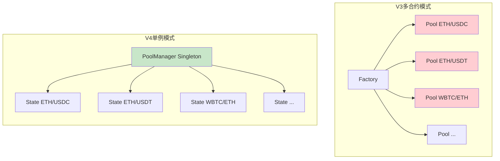
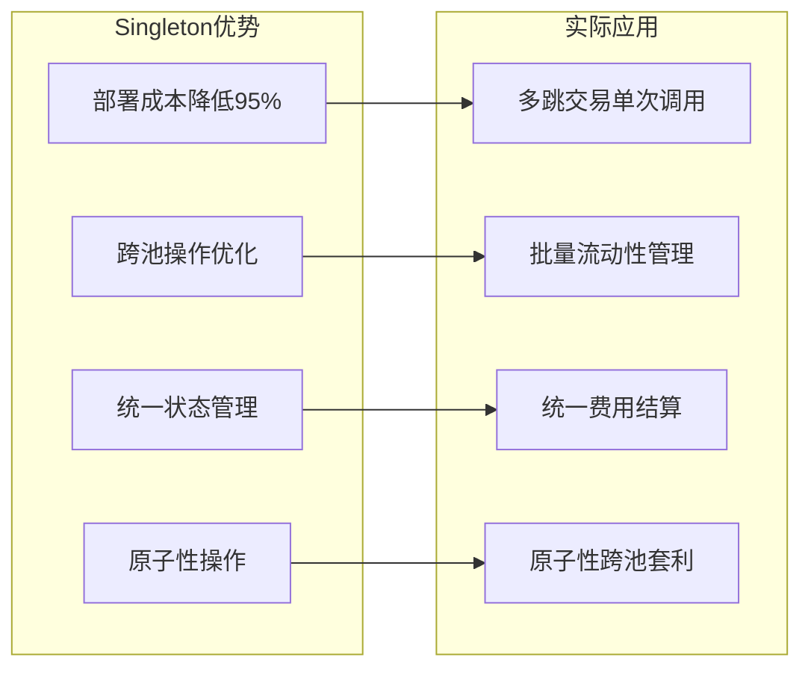
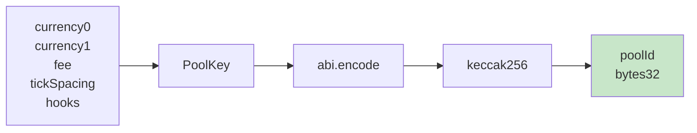
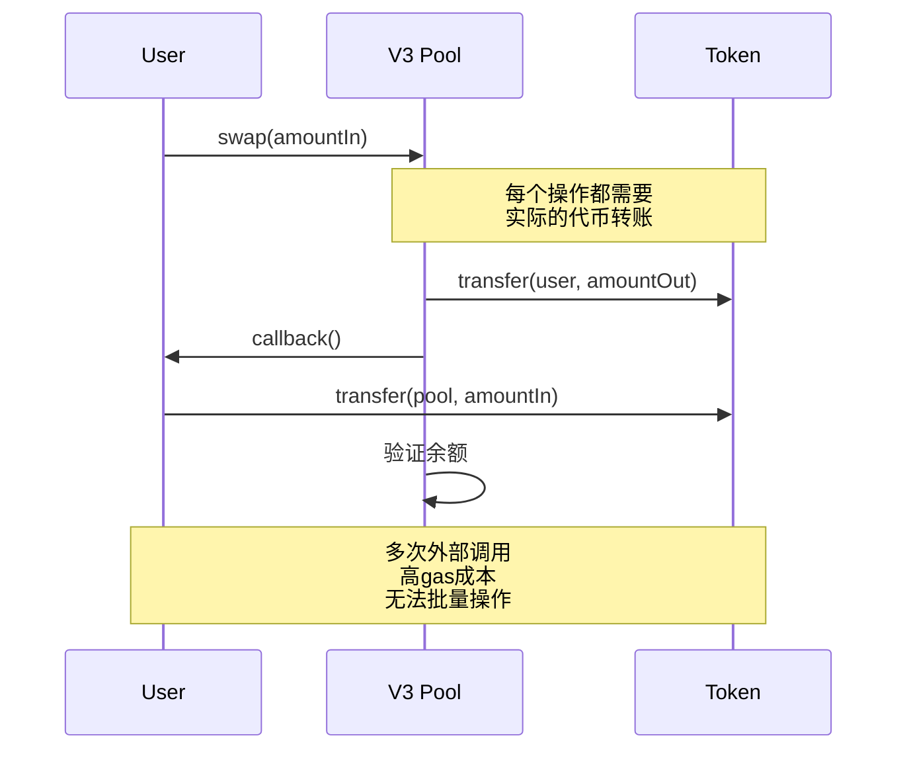
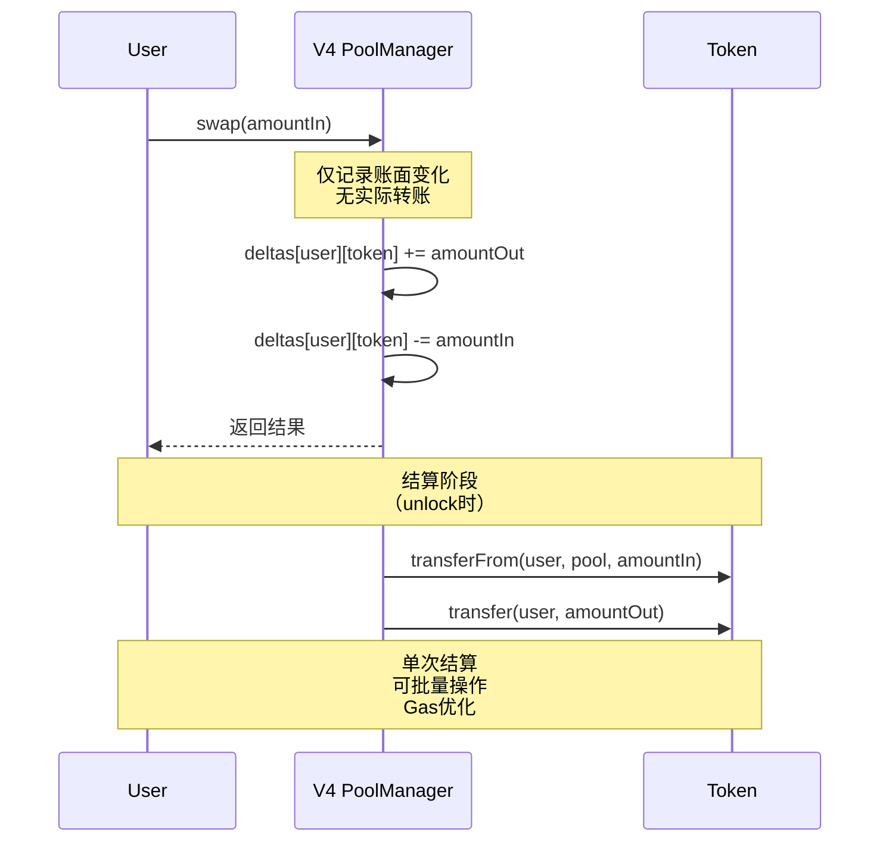
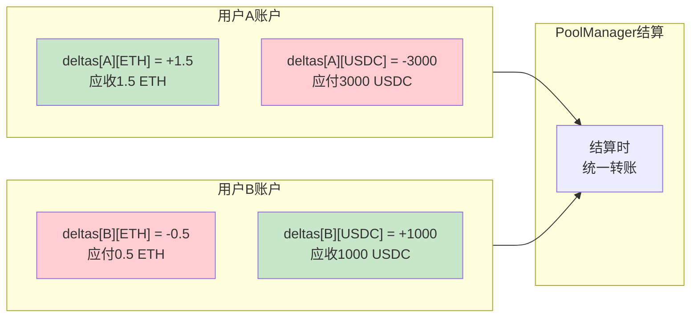
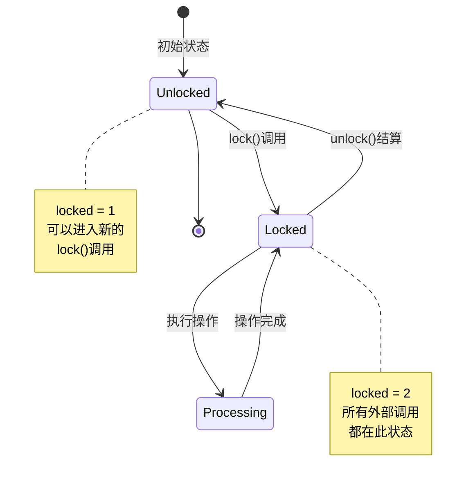
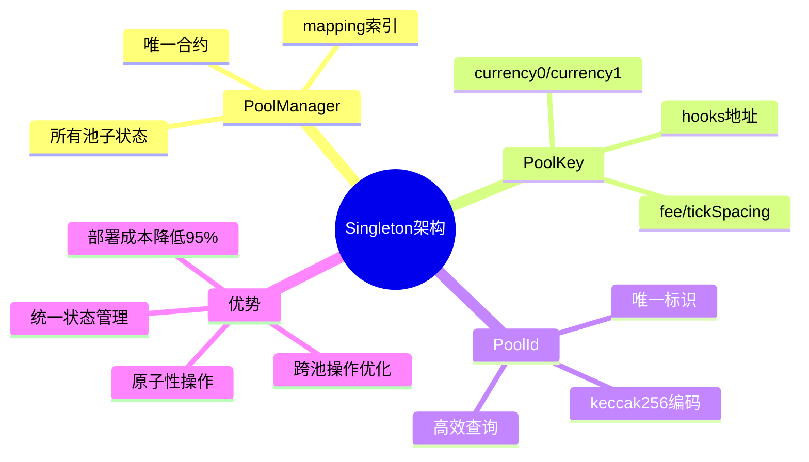
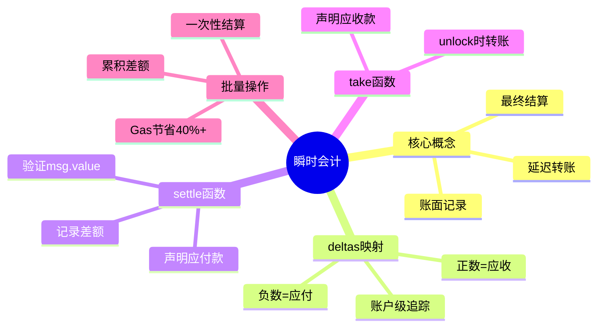

# 死磕Uniswap V4（三）：单例架构与瞬时会计

> 本文是「死磕Uniswap V4」系列的第三篇，深入剖析V4的单例架构设计和瞬时会计系统。

## 系列导航

| 序号 | 标题 | 核心内容 |
|:----:|------|----------|
| 01 | V4概述与架构革命 | Singleton、Hooks、Flash Accounting |
| 02 | Hooks机制深度解析 | Hook接口、生命周期、实现模式 |
| **03** | **单例架构与瞬时会计** | **PoolManager、Currency、Accounting** |
| 04 | 交换流程与Hook执行时序 | swap函数、Hook调用链、Gas分析 |
| 05 | 费用系统与动态费率 | 自定义费率、动态调整、费用分配 |
| 06 | 账户抽象与原生ETH | Currency类型、settle/take、批量操作 |
| 07 | 安全分析与最佳实践 | Hook安全、MEV防护、审计要点 |

---

## 1. Singleton架构深度解析

### 1.1 从多合约到单例

Uniswap V3采用"每池一合约"的架构，而V4通过Singleton模式将所有池子集中在一个合约中。



### 1.2 为什么选择Singleton？

**V3多合约的问题：**

| 问题 | 影响 | Gas成本 |
|------|------|---------|
| CREATE2部署 | 每池独立部署 | ~100,000 gas |
| 跨池调用 | 需要多次外部调用 | +2,600 gas/次 |
| 状态同步 | 难以批量操作 | 无法优化 |
| 资源共享 | 无法共享数据 | 冗余存储 |

**V4单例的优势：**



---

## 2. PoolManager合约详解

### 2.1 核心数据结构

```solidity
contract PoolManager is IPoolManager, IHooks, ERC1155Holder {
    // ============================================================
    // 核心存储结构
    // ============================================================

    /// @notice 池子状态（使用poolId索引）
    mapping(bytes32 poolId => Pool.State) public pools;

    /// @notice 池子的Slot0数据
    mapping(bytes32 poolId => Pool.Slot0) public slot0s;

    /// @notice Tick间距配置
    mapping(bytes32 poolId => int24) public tickSpacings;

    /// @notice 费用配置
    mapping(bytes32 poolId => Pool.Fees) public fees;

    /// @notice 协议费用配置
    mapping(bytes32 poolId => ProtocolFees) public protocolFees;

    /// @notice Hook合约地址
    mapping(bytes32 poolId => IHooks) public hooks;

    /// @notice Tick位图（用于高效查找）
    mapping(bytes32 poolId => mapping(int16 => uint256)) public tickBitmaps;

    /// @notice Tick数据
    mapping(bytes32 poolId => mapping(int24 => Tick.Info)) public ticks;

    // ============================================================
    // 瞬时会计系统
    // ============================================================

    /// @notice 账户差额记录
    /// @dev 正数 = 应收款，负数 = 应付款
    mapping(address account => mapping(Currency currency => int256)) public deltas;

    /// @notice 锁定状态（防止重入）
    uint256 private locked = 1;

    // ============================================================
    // Currency系统
    // ============================================================

    /// @notice Currency地址映射
    mapping(Currency => address) public currencyAddresses;

    // ============================================================
    // 协议配置
    // ============================================================

    /// @notice 全局协议费用
    uint256 public protocolFees0;
    uint256 public protocolFees1;

    /// @notice PoolManager部署者（具有特殊权限）
    address public immutable deployer;
}
```

### 2.2 Pool.State结构详解

```solidity
library Pool {
    /// @notice 池子完整状态
    struct State {
        // 流动性相关
        uint128 liquidity;          // 当前活跃流动性
        uint128 liquidityNext;      // 下一个tick的流动性净值

        // Slot0数据（单独存储以优化gas）
        Slot0 slot0;

        // 费用数据
        Fees fees;

        // 预言机数据
        uint16 observationIndex;    // 当前观察索引
        uint16 observationCardinality; // 观察基数
    }

    /// @notice Slot0数据（最常访问）
    struct Slot0 {
        // 价格和tick
        uint160 sqrtPriceX96;       // 当前价格的平方根
        int24 tick;                 // 当前tick索引

        // 预言机相关
        uint16 observationIndex;    // 当前观察索引

        // 协议费用
        uint24 protocolFee;         // 协议费率（左8位: token0, 右8位: token1）

        // 锁定状态
        bool unlocked;              // 重入锁（true = 未锁定）
    }

    /// @notice 费用结构
    struct Fees {
        uint16 fee;                 // 基础费率（1e-6单位）
        uint16 hookFee;             // Hook控制的动态费率部分
    }

    /// @notice Tick信息
    struct TickInfo {
        uint128 liquidityGross;     // 该tick的总流动性
        int128 liquidityNet;        // 跨越该tick时的流动性变化
        uint256 feeGrowthOutside0X128;  // token0费用增长（外部）
        uint256 feeGrowthOutside1X128;  // token1费用增长（外部）
        int56 tickCumulativeOutside;    // tick累积（外部）
        uint160 secondsPerLiquidityOutsideX128; // 每流动性秒数（外部）
        uint32 secondsOutside;      // 该tick外部经过的秒数
        bool initialized;           // 是否已初始化
    }
}
```

### 2.3 PoolKey和PoolId

```solidity
/// @notice 池子标识符
struct PoolKey {
    Currency currency0;         // Token0（或原生ETH）
    Currency currency1;         // Token1（或原生ETH）
    uint24 fee;                 // 基础费率（1e-6单位）
    int24 tickSpacing;          // Tick间距
    IHooks hooks;               // Hook合约地址
}

/// @notice 计算PoolId
/// @dev poolId是池子的唯一标识符
function getPoolId(PoolKey calldata key) pure returns (bytes32) {
    return keccak256(abi.encode(key));
}
```

**PoolId设计原理：**



**为什么使用PoolId而不是合约地址？**

| 对比项 | V3（合约地址） | V4（PoolId） |
|--------|---------------|--------------|
| 存储位置 | 独立合约 | mapping索引 |
| 部署成本 | CREATE2 (~100k gas) | 纯计算 (0 gas) |
| 查询成本 | EXTERNALCALL (2,600 gas) | SLOAD (2,100 gas) |
| 批量操作 | 需要多笔交易 | 单笔交易完成 |
| 状态同步 | 需要跨合约调用 | 直接访问mapping |

### 2.4 初始化流程

```solidmaid
function initialize(PoolKey calldata key, uint160 sqrtPriceX96) external {
    bytes32 poolId = key.poolId;

    // 1. 验证池子不存在
    require(slot0s[poolId].sqrtPriceX96 == 0, "Already initialized");

    // 2. 验证参数
    require(sqrtPriceX96 >= TickMath.MIN_SQRT_RATIO, "Price too low");
    require(sqrtPriceX96 <= TickMath.MAX_SQRT_RATIO, "Price too high");

    // 3. 调用beforeSwap Hook
    if (address(key.hooks) != address(0)) {
        (bool success, bytes memory data) = address(key.hooks).staticcall(
            abi.encodeCall(
                IHooks.beforeInitialize,
                (msg.sender, key, sqrtPriceX96, "")
            )
        );
        if (success) {
            // Hook可能返回自定义价格
            (bytes4 selector, uint160 customPrice) = abi.decode(data, (bytes4, uint160));
            if (selector == IHooks.beforeInitialize.selector && customPrice != 0) {
                sqrtPriceX96 = customPrice;
            }
        }
    }

    // 4. 设置初始状态
    slot0s[poolId] = Pool.Slot0({
        sqrtPriceX96: sqrtPriceX96,
        tick: TickMath.getTickAtSqrtRatio(sqrtPriceX96),
        observationIndex: 0,
        protocolFee: 0,
        unlocked: true
    });

    // 5. 初始化Tick间距
    tickSpacings[poolId] = key.tickSpacing;

    // 6. 初始化费用
    fees[poolId] = Pool.Fees({
        fee: key.fee,
        hookFee: 0
    });

    // 7. 保存Hook地址
    hooks[poolId] = key.hooks;

    // 8. 调用afterInitialize Hook
    if (address(key.hooks) != address(0)) {
        address(key.hooks).staticcall(
            abi.encodeCall(
                IHooks.afterInitialize,
                (msg.sender, key, sqrtPriceX96, "")
            )
        );
    }

    emit Initialize(poolId, key.currency0, key.currency1, sqrtPriceX96, key.tickSpacing);
}
```

---

## 3. 瞬时会计系统

### 3.1 设计理念

**传统模式（V3）的问题：**



**瞬时会计模式（V4）的优势：**



### 3.2 数据结构详解

```solidity
/// @notice 账户差额记录
/// @dev int256类型：
///      正数 = 用户应收款（Pool欠用户）
///      负数 = 用户应付款（用户欠Pool）
mapping(address account => mapping(Currency currency => int256)) public deltas;

/// @notice 差额变化
/// @dev 表示两种代币的变化
struct BalanceDelta {
    int256 delta0;  // token0的差额
    int256 delta1;  // token1的差额
}
```

**差额记录示意图：**



### 3.3 settle() 函数

用户通过`settle()`声明将支付一定数量的代币：

```solidity
/// @notice 用户声明将支付代币
/// @param currency 要支付的代币
/// @param amount 支付数量
function settle(Currency currency, uint256 amount) external {
    // 1. 验证锁定状态
    require(locked != 0, "Not locked");

    // 2. 记录用户需要支付的金额（负数 = 应付）
    deltas[msg.sender][currency] -= int256(amount);

    // 3. 对于原生ETH，立即验证msg.value
    if (CurrencyLibrary.isNative(currency)) {
        uint256 currentDelta = -deltas[msg.sender][currency];
        require(msg.value >= currentDelta, "Insufficient ETH");
    }

    // 4. 对于ERC20，延迟到unlock时统一transferFrom
    emit Settle(msg.sender, currency, amount);
}

/// @notice 获取用户应付的ETH数量
function settleableBalance(Currency currency) external view returns (uint256) {
    if (!CurrencyLibrary.isNative(currency)) return 0;

    int256 delta = deltas[msg.sender][currency];
    if (delta >= 0) return 0;

    uint256 payableAmount = uint256(-delta);
    require(msg.value >= payableAmount, "Insufficient ETH");

    return payableAmount;
}
```

### 3.4 take() 函数

用户通过`take()`声明将接收一定数量的代币：

```solidity
/// @notice 用户声明将接收代币
/// @param currency 要接收的代币
/// @param recipient 接收地址
/// @param amount 接收数量
function take(Currency currency, address recipient, uint256 amount) external {
    // 1. 验证锁定状态
    require(locked != 0, "Not locked");

    // 2. 记录用户应收的金额（正数 = 应收）
    deltas[recipient][currency] += int256(amount);

    emit Take(msg.sender, recipient, currency, amount);
}
```

### 3.5 结算机制

在`unlock()`时进行最终结算：

```solidity
/// @notice 解锁并结算所有差额
function unlock() external {
    // 1. 验证锁定状态
    require(locked == 1, "Not locked");

    // 2. 结算所有账户的差额
    _accountingBalance();

    // 3. 解除锁定
    locked = 0;

    emit Unlock();
}

/// @notice 内部结算函数
function _accountingBalance() internal {
    // 遍历所有有差额的账户
    for (uint256 i = 0; i < accounts.length; i++) {
        address account = accounts[i];

        // 遍历所有有差额的代币
        for (uint256 j = 0; j < currencies.length; j++) {
            Currency currency = currencies[j];
            int256 delta = deltas[account][currency];

            if (delta == 0) continue;

            if (delta > 0) {
                // 用户应收：Pool转给用户
                uint256 amount = uint256(delta);

                if (CurrencyLibrary.isNative(currency)) {
                    // 原生ETH直接发送
                    payable(account).transfer(amount);
                } else {
                    // ERC20转账
                    ERC20(Currency.unwrap(currency)).transfer(account, amount);
                }
            } else {
                // 用户应付：从用户转入
                uint256 amount = uint256(-delta);

                if (!CurrencyLibrary.isNative(currency)) {
                    // ERC20: transferFrom
                    ERC20(Currency.unwrap(currency)).transferFrom(
                        account,
                        address(this),
                        amount
                    );
                }
                // ETH在settle时已经验证msg.value

                // 清零差额
                deltas[account][currency] = 0;
            }
        }
    }

    // 清空账户和代币列表
    delete accounts;
    delete currencies;
}
```

### 3.6 批量操作优化

瞬时会计最大的优势是支持批量操作：

```solidity
/// @notice 批量交换多个池子
function batchSwap(
    PoolKey[] calldata keys,
    SwapParams[] calldata params
) external returns (BalanceDelta) {
    // 锁定
    lock();

    BalanceDelta totalDelta;

    // 执行多次swap，所有差额累积
    for (uint256 i = 0; i < keys.length; i++) {
        BalanceDelta delta = swap(keys[i], params[i]);
        totalDelta.delta0 += delta.delta0;
        totalDelta.delta1 += delta.delta1;
    }

    // 一次性结算
    _settleAndTake(totalDelta);

    // 解锁
    unlock();

    return totalDelta;
}

/// @notice 内部结算函数
function _settleAndTake(BalanceDelta calldata delta) internal {
    if (delta.delta0 < 0) {
        settle(poolKey.currency0, uint256(-delta.delta0));
    } else if (delta.delta0 > 0) {
        take(poolKey.currency0, msg.sender, uint256(delta.delta0));
    }

    if (delta.delta1 < 0) {
        settle(poolKey.currency1, uint256(-delta.delta1));
    } else if (delta.delta1 > 0) {
        take(poolKey.currency1, msg.sender, uint256(delta.delta1));
    }
}
```

**批量操作Gas对比：**

| 操作 | V3（多次调用） | V4（批量） | 节省 |
|------|---------------|-----------|------|
| 3跳交易 | ~300,000 gas | ~180,000 gas | **40%** |
| 5跳交易 | ~500,000 gas | ~250,000 gas | **50%** |

---

## 4. Currency类型系统

### 4.1 统一代币表示

V4引入`Currency`类型统一处理ETH和ERC20：

```solidity
/// @notice Currency类型
/// @dev 本质上是address，但提供类型安全
type Currency is address;

/// @notice Currency库
library CurrencyLibrary {
    /// @notice 原生ETH的Currency表示
    Currency internal constant NATIVE = Currency.wrap(address(0));

    /// @notice 判断是否为原生ETH
    function isNative(Currency currency) internal pure returns (bool) {
        return Currency.unwrap(currency) == address(0);
    }

    /// @notice 从地址创建Currency
    function wrap(address addr) internal pure returns (Currency) {
        return Currency.wrap(addr);
    }

    /// @notice 获取底层地址
    function unwrap(Currency currency) internal pure returns (address) {
        return Currency.unwrap(currency);
    }

    /// @notice 获取转账编码
    function transferEncoding(Currency currency) internal pure returns (bytes memory) {
        if (isNative(currency)) {
            return abi.encodePacked(); // ETH不需要编码
        } else {
            // ERC20的transfer编码
            return abi.encodeWithSignature(
                "transfer(address,uint256)",
                address(0),
                uint256(0)
            );
        }
    }
}
```

### 4.2 Currency操作

```solidity
/// @notice 安全转账
function _transfer(
    Currency currency,
    address recipient,
    uint256 amount
) internal {
    if (CurrencyLibrary.isNative(currency)) {
        // 原生ETH
        payable(recipient).transfer(amount);
    } else {
        // ERC20
        ERC20(Currency.unwrap(currency)).transfer(recipient, amount);
    }
}

/// @notice 安全转账从
function _transferFrom(
    Currency currency,
    address from,
    address to,
    uint256 amount
) internal {
    if (CurrencyLibrary.isNative(currency)) {
        // ETH需要msg.value
        require(msg.value >= amount, "Insufficient ETH");
    } else {
        // ERC20 transferFrom
        ERC20(Currency.unwrap(currency)).transferFrom(from, to, amount);
    }
}

/// @notice 获取余额
function _balanceOf(
    Currency currency,
    address account
) internal view returns (uint256) {
    if (CurrencyLibrary.isNative(currency)) {
        return account.balance;
    } else {
        return ERC20(Currency.unwrap(currency)).balanceOf(account);
    }
}
```

### 4.3 Native ETH支持

```mermaid
flowchart TD
    A[用户操作] --> B{Currency类型}
    B -->|address(0)| C[原生ETH]
    B -->|address(token)| D[ERC20代币]

    C --> E[直接使用msg.value]
    C --> F[transfer直接发送]
    C --> G[无需授权]

    D --> H[需要transferFrom]
    D --> I[需要allowance]
    D --> J[需要包装如WETH]

    style C fill:#c8e6c9
    style E fill:#c8e6c9
    style F fill:#c8e6c9
    style G fill:#c8e6c9
```

**Gas节省对比（ETH相关交易）：**

| 操作 | V3 (WETH) | V4 (Native) | 节省 |
|------|-----------|-------------|------|
| WETH包装 | ~40,000 | 0 | 100% |
| WETH解包 | ~40,000 | 0 | 100% |
| 授权检查 | ~5,000 | 0 | 100% |
| **单笔交易** | **~85,000** | **~45,000** | **~47%** |

---

## 5. 安全性保障

### 5.1 锁定机制

```solidity
/// @notice 全局锁定状态
uint256 private locked = 1;  // 初始为1（未锁定）

/// @notice 锁定修饰符
modifier lock() {
    require(locked == 1, "Already locked");
    locked = 2;  // 设置为锁定状态

    _;

    // unlock时进行结算
    _accountingBalance();
    locked = 1;  // 恢复未锁定
}

/// @notice 解锁函数
function unlock() external {
    require(locked == 2, "Not locked");
    _accountingBalance();
    locked = 1;
}
```

### 5.2 重入保护



### 5.3 差额验证

```solidity
/// @notice 验证所有差额已结算
function _verifyDeltasSettled() internal view {
    for (uint256 i = 0; i < accounts.length; i++) {
        address account = accounts[i];

        for (uint256 j = 0; j < currencies.length; j++) {
            Currency currency = currencies[j];
            int256 delta = deltas[account][currency];

            // 差额应该为0（已结算）
            // 或者是用户应收（会在unlock时转账）
            // 用户应付（负数）必须已经settle
            require(delta >= 0 || _hasSettled(account, currency), "Delta not settled");
        }
    }
}

/// @notice 检查用户是否已结算
function _hasSettled(
    address account,
    Currency currency
) private view returns (bool) {
    if (CurrencyLibrary.isNative(currency)) {
        // ETH: 检查msg.value是否足够
        int256 delta = deltas[account][currency];
        if (delta < 0) {
            return msg.value >= uint256(-delta);
        }
    }
    // ERC20: 在unlock时transferFrom验证
    return true;
}
```

### 5.4 防止资金锁定

```solidity
/// @notice 紧急提取函数
/// @dev 只有在特殊情况下才能调用
function emergencyWithdraw(
    Currency currency,
    uint256 amount
) external {
    // 1. 验证未锁定
    require(locked == 1, "Locked");

    // 2. 验证权限（通常是DAO或治理）
    require(msg.sender == governance, "Not governance");

    // 3. 执行提取
    if (CurrencyLibrary.isNative(currency)) {
        payable(msg.sender).transfer(amount);
    } else {
        ERC20(Currency.unwrap(currency)).transfer(msg.sender, amount);
    }

    emit EmergencyWithdraw(msg.sender, currency, amount);
}
```

---

## 6. 本章小结

### 6.1 Singleton架构总结



### 6.2 瞬时会计总结



### 6.3 Currency系统总结

| 类型 | 表示 | 转账 | 授权 |
|------|------|------|------|
| Native ETH | `Currency.wrap(address(0))` | `transfer()` | 不需要 |
| ERC20 | `Currency.wrap(tokenAddr)` | `transfer()` | 需要`approve()` |

### 6.4 关键数据结构

| 结构 | 用途 | 类型 |
|------|------|------|
| `pools[poolId]` | 池子状态 | `Pool.State` |
| `slot0s[poolId]` | 价格等高频数据 | `Pool.Slot0` |
| `deltas[account][currency]` | 账户差额 | `int256` |
| `tickBitmaps[poolId][wordPos]` | Tick位图 | `uint256` |
| `ticks[poolId][tick]` | Tick信息 | `Tick.Info` |

---

## 下一篇预告

在下一篇文章中，我们将深入探讨**交换流程与Hook执行时序**，包括：
- swap函数完整执行流程
- Hook调用链详解
- 跨Tick交换机制
- Gas成本分析
- 与V3的对比

---

## 参考资料

- [Uniswap V4 Core - PoolManager.sol](https://github.com/Uniswap/v4-core/blob/main/src/PoolManager.sol)
- [Uniswap V4 Core - Pool.sol](https://github.com/Uniswap/v4-core/blob/main/src/types/Pool.sol)
- [EIP-1155: Multi Token Standard](https://eips.ethereum.org/EIPS/eip-1155)
- [EIP-20: ERC-20 Token Standard](https://eips.ethereum.org/EIPS/eip-20)
