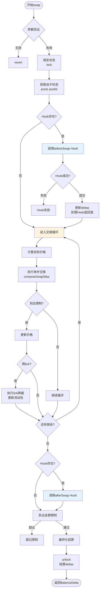
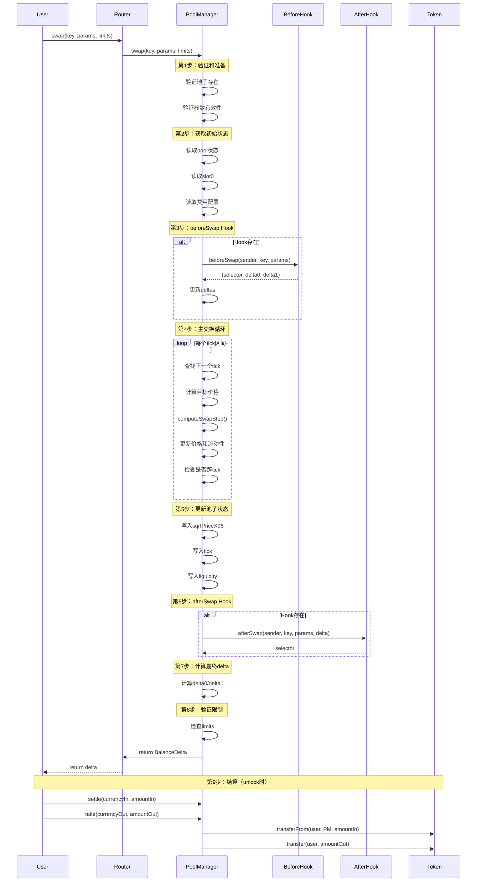
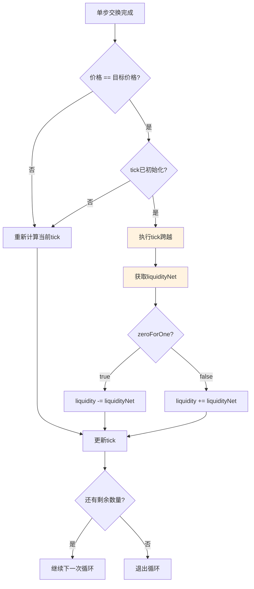
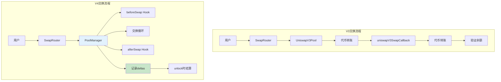
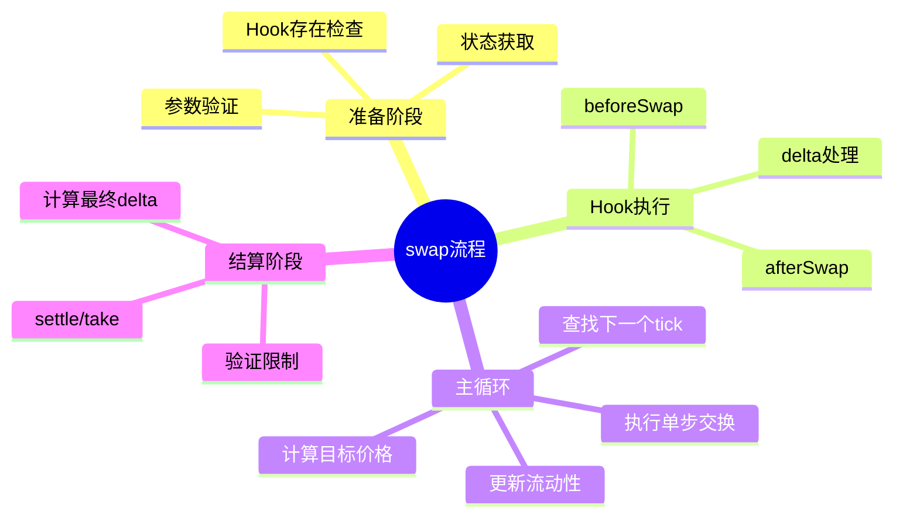

# 死磕Uniswap V4（四）：交换流程与Hook执行时序

> 本文是「死磕Uniswap V4」系列的第四篇，深入剖析V4的交换执行流程和Hook调用时序。

## 系列导航

| 序号 | 标题 | 核心内容 |
|:----:|------|----------|
| 01 | V4概述与架构革命 | Singleton、Hooks、Flash Accounting |
| 02 | Hooks机制深度解析 | Hook接口、生命周期、实现模式 |
| 03 | 单例架构与瞬时会计 | PoolManager、Currency、Accounting |
| **04** | **交换流程与Hook执行时序** | **swap函数、Hook调用链、Gas分析** |
| 05 | 费用系统与动态费率 | 自定义费率、动态调整、费用分配 |
| 06 | 账户抽象与原生ETH | Currency类型、settle/take、批量操作 |
| 07 | 安全分析与最佳实践 | Hook安全、MEV防护、审计要点 |

---

## 1. swap函数概览

### 1.1 函数签名

```solidity
/// @notice 执行代币交换
/// @param key 池子标识
/// @param params 交换参数
/// @param limits 金额限制（防止滑点过大）
/// @return delta 交换产生的代币变化
function swap(
    PoolKey calldata key,
    SwapParams calldata params,
    BalanceDelta calldata limits
) external lock returns (BalanceDelta delta) {
    // 实现细节...
}

/// @notice 交换参数
struct SwapParams {
    bool zeroForOne;           // 交换方向：true=token0→token1
    int256 amountSpecified;    // 指定数量（正=精确输入，负=精确输出）
    uint160 sqrtPriceLimitX96; // 价格限制（滑点保护）
}

/// @notice 金额限制
struct BalanceDelta {
    int256 delta0;  // token0的最大允许变化
    int256 delta1;  // token1的最大允许变化
}
```

### 1.2 参数含义详解

| 参数 | 类型 | 说明 | 示例 |
|------|------|------|------|
| `zeroForOne` | bool | 交换方向 | `true`=卖出token0，`false`=卖出token1 |
| `amountSpecified` | int256 | 指定数量 | `1e18`=精确输入1个，`-1e18`=精确输出1个 |
| `sqrtPriceLimitX96` | uint160 | 价格限制 | 防止滑点过大 |
| `delta0/delta1` | int256 | 金额限制 | 用户能接受的最大损失 |

---

## 2. 交换执行完整流程

### 2.1 流程图



### 2.2 详细代码实现

```solidity
function swap(
    PoolKey calldata key,
    SwapParams calldata params,
    BalanceDelta calldata limits
) external lock returns (BalanceDelta delta) {
    // ============================================================
    // 第1步：验证和准备
    // ============================================================

    bytes32 poolId = key.poolId;

    // 验证池子存在
    require(slot0s[poolId].sqrtPriceX96 != 0, "Not initialized");

    // 验证参数
    require(params.amountSpecified != 0, "Amount zero");

    // ============================================================
    // 第2步：获取初始状态
    // ============================================================

    Pool.State storage pool = pools[poolId];
    Pool.Slot0 memory slot0 = slot0s[poolId];
    Pool.Fees memory fee = fees[poolId];

    uint160 sqrtPriceX96 = slot0.sqrtPriceX96;
    int24 tick = slot0.tick;
    uint128 liquidity = pool.liquidity;

    // ============================================================
    // 第3步：调用beforeSwap Hook
    // ============================================================

    int256 hookDelta0 = 0;
    int256 hookDelta1 = 0;

    if (address(key.hooks) != address(0)) {
        (bool success, bytes memory data) = address(key.hooks).staticcall(
            abi.encodeCall(
                IHooks.beforeSwap,
                (msg.sender, key, params, params.hookData)
            )
        );

        if (success) {
            (
                bytes4 selector,
                int256 returnedDelta0,
                int256 returnedDelta1
            ) = abi.decode(data, (bytes4, int256, int256));

            if (selector == IHooks.beforeSwap.selector) {
                hookDelta0 = returnedDelta0;
                hookDelta1 = returnedDelta1;

                // 更新deltas
                if (hookDelta0 != 0) {
                    deltas[msg.sender][key.currency0] += hookDelta0;
                }
                if (hookDelta1 != 0) {
                    deltas[msg.sender][key.currency1] += hookDelta1;
                }
            }
        }
    }

    // ============================================================
    // 第4步：主交换循环
    // ============================================================

    int256 amountSpecified = params.amountSpecified;
    int256 amountRemaining = amountSpecified;
    int256 amountCalculated = 0;

    while (amountRemaining != 0 && sqrtPriceX96 != params.sqrtPriceLimitX96) {
        // 4.1 查找下一个tick
        (int24 tickNext, bool initialized) = _getNextTick(
            poolId,
            tick,
            params.zeroForOne
        );

        // 4.2 计算目标价格
        uint160 sqrtPriceNextX96 = initialized
            ? TickMath.getSqrtRatioAtTick(tickNext)
            : (params.zeroForOne ? TickMath.MIN_SQRT_RATIO + 1 : TickMath.MAX_SQRT_RATIO - 1);

        // 4.3 考虑价格限制
        if (params.zeroForOne) {
            sqrtPriceNextX96 = sqrtPriceNextX96 < params.sqrtPriceLimitX96
                ? params.sqrtPriceLimitX96
                : sqrtPriceNextX96;
        } else {
            sqrtPriceNextX96 = sqrtPriceNextX96 > params.sqrtPriceLimitX96
                ? params.sqrtPriceLimitX96
                : sqrtPriceNextX96;
        }

        // 4.4 执行单步交换
        (
            uint160 newSqrtPriceX96,
            uint256 amountIn,
            uint256 amountOut,
            uint256 feeAmount
        ) = SwapMath.computeSwapStep(
            sqrtPriceX96,
            sqrtPriceNextX96,
            liquidity,
            amountRemaining,
            fee.fee + fee.hookFee
        );

        // 4.5 更新状态
        sqrtPriceX96 = newSqrtPriceX96;
        amountRemaining -= params.zeroForOne ? int256(amountIn + feeAmount) : -int256(amountOut);
        amountCalculated += params.zeroForOne ? int256(amountOut) : -int256(amountIn + feeAmount);

        // 4.6 检查是否跨越tick
        if (sqrtPriceX96 == sqrtPriceNextX96) {
            // 到达tick边界
            if (initialized) {
                // 执行tick跨越
                int128 liquidityNet = _crossTick(
                    poolId,
                    tick,
                    tickNext,
                    params.zeroForOne
                );

                // 更新流动性
                if (params.zeroForOne) {
                    liquidity = uint128(int256(liquidity) - liquidityNet);
                } else {
                    liquidity = uint128(int256(liquidity) + liquidityNet);
                }
            }

            // 更新tick
            tick = params.zeroForOne ? tickNext - 1 : tickNext;
        } else {
            // 价格未到边界，重新计算tick
            tick = TickMath.getTickAtSqrtRatio(sqrtPriceX96);
        }
    }

    // ============================================================
    // 第5步：更新池子状态
    // ============================================================

    slot0s[poolId].sqrtPriceX96 = sqrtPriceX96;
    slot0s[poolId].tick = tick;
    pools[poolId].liquidity = liquidity;

    // ============================================================
    // 第6步：调用afterSwap Hook
    // ============================================================

    if (address(key.hooks) != address(0)) {
        (bool success, bytes memory data) = address(key.hooks).staticcall(
            abi.encodeCall(
                IHooks.afterSwap,
                (
                    msg.sender,
                    key,
                    params,
                    BalanceDelta({
                        delta0: params.zeroForOne ? amountSpecified - amountRemaining : amountCalculated,
                        delta1: params.zeroForOne ? amountCalculated : amountRemaining - amountSpecified
                    }),
                    params.hookData
                )
            )
        );

        if (success) {
            bytes4 selector = abi.decode(data, (bytes4));
            require(selector == IHooks.afterSwap.selector, "Invalid hook return");
        }
    }

    // ============================================================
    // 第7步：计算最终delta
    // ============================================================

    delta = BalanceDelta({
        delta0: params.zeroForOne ? amountSpecified - amountRemaining : amountCalculated,
        delta1: params.zeroForOne ? amountCalculated : amountRemaining - amountSpecified
    });

    // ============================================================
    // 第8步：验证金额限制
    // ============================================================

    require(delta.delta0 >= limits.delta0, "Limit0 exceeded");
    require(delta.delta1 >= limits.delta1, "Limit1 exceeded");

    return delta;
}
```

---

## 3. Hook执行时序详解

### 3.1 完整时序图



### 3.2 beforeSwap Hook执行详解

```solidity
function _callBeforeSwap(
    PoolKey calldata key,
    SwapParams calldata params
) internal returns (int256 delta0, int256 delta1) {
    IHooks hooks = key.hooks;
    if (address(hooks) == address(0)) return (0, 0);

    // 准备调用数据
    bytes memory data = abi.encodeCall(
        IHooks.beforeSwap,
        (msg.sender, key, params, params.hookData)
    );

    // 静态调用（不允许状态修改）
    (bool success, bytes memory result) = address(hooks).staticcall(data);

    if (!success) {
        // Hook未实现或调用失败
        if (result.length == 0) {
            return (0, 0); // 未实现，使用默认值
        }
        // 调用失败，revert
        revert("beforeSwap hook failed");
    }

    // 解析返回值
    (
        bytes4 selector,
        int256 returnedDelta0,
        int256 returnedDelta1
    ) = abi.decode(result, (bytes4, int256, int256));

    // 验证selector
    require(selector == IHooks.beforeSwap.selector, "Invalid selector");

    // 应用Hook返回的delta
    if (returnedDelta0 != 0) {
        deltas[msg.sender][key.currency0] += returnedDelta0;
        delta0 = returnedDelta0;
    }

    if (returnedDelta1 != 0) {
        deltas[msg.sender][key.currency1] += returnedDelta1;
        delta1 = returnedDelta1;
    }
}
```

### 3.3 afterSwap Hook执行详解

```solidity
function _callAfterSwap(
    PoolKey calldata key,
    SwapParams calldata params,
    BalanceDelta calldata delta
) internal {
    IHooks hooks = key.hooks;
    if (address(hooks) == address(0)) return;

    // 准备调用数据
    bytes memory data = abi.encodeCall(
        IHooks.afterSwap,
        (msg.sender, key, params, delta, params.hookData)
    );

    // 静态调用
    (bool success, bytes memory result) = address(hooks).staticcall(data);

    if (!success) {
        // Hook失败不影响主流程
        return;
    }

    // 验证selector
    bytes4 selector = abi.decode(result, (bytes4));
    require(selector == IHooks.afterSwap.selector, "Invalid selector");

    // afterSwap还可以返回额外的delta（费用分配）
    // ...
}
```

---

## 4. 跨Tick交换机制

### 4.1 Tick查找

```solidity
/// @notice 获取下一个已初始化的tick
/// @param poolId 池子ID
/// @param tick 当前tick
/// @param zeroForOne 交换方向
/// @return tickNext 下一个tick
/// @return initialized 是否已初始化
function _getNextTick(
    bytes32 poolId,
    int24 tick,
    bool zeroForOne
) private view returns (int24 tickNext, bool initialized) {
    int24 tickSpacing = tickSpacings[poolId];

    // 对齐到tickSpacing
    int24 compressed = tick / tickSpacing;
    if (tick < 0 && tick % tickSpacing != 0) compressed--;

    // 使用位图查找
    (int16 wordPos, uint8 bitPos) = _getPosition(compressed);

    if (zeroForOne) {
        // 向左查找（价格下降）
        uint256 mask = (1 << bitPos) - 1 + (1 << bitPos);
        uint256 masked = tickBitmaps[poolId][wordPos] & mask;

        if (masked != 0) {
            uint8 msb = BitMath.mostSignificantBit(masked);
            tickNext = (int24(wordPos) * 256 + int24(msb)) * tickSpacing;
            initialized = true;
        } else {
            // 查找前一个word
            // ...
        }
    } else {
        // 向右查找（价格上升）
        uint256 mask = ~((1 << (bitPos + 1)) - 1);
        uint256 masked = tickBitmaps[poolId][wordPos] & mask;

        if (masked != 0) {
            uint8 lsb = BitMath.leastSignificantBit(masked);
            tickNext = (int24(wordPos) * 256 + int24(lsb)) * tickSpacing;
            initialized = true;
        } else {
            // 查找后一个word
            // ...
        }
    }
}
```

### 4.2 Tick跨越

```solidity
/// @notice 跨越tick边界
/// @param poolId 池子ID
/// @param tick 当前tick
/// @param tickNext 目标tick
/// @param zeroForOne 交换方向
/// @return liquidityNet 流动性净值
function _crossTick(
    bytes32 poolId,
    int24 tick,
    int24 tickNext,
    bool zeroForOne
) private returns (int128 liquidityNet) {
    // 获取tick信息
    Tick.Info memory tickInfo = ticks[poolId][tickNext];

    // 计算流动性变化
    liquidityNet = zeroForOne ? -tickInfo.liquidityNet : tickInfo.liquidityNet;

    // 更新tick外部数据
    // ...

    return liquidityNet;
}
```

### 4.3 跨Tick流程图



---

## 5. Gas成本分析

### 5.1 swap函数Gas分解

| 阶段 | 操作 | Gas成本 | 说明 |
|------|------|---------|------|
| **准备** | 参数验证 | ~2,000 | 检查池子、参数 |
| | 状态读取 | ~3,000 | SLOAD pool状态 |
| **beforeSwap Hook** | Hook调用 | ~5,000-50,000 | 取决于Hook复杂度 |
| **交换循环** | 每次迭代 | ~15,000 | 包括计算、更新 |
| | 跨tick | ~20,000 | 流动性更新 |
| **afterSwap Hook** | Hook调用 | ~5,000-30,000 | 取决于Hook复杂度 |
| **结算** | settle/take | ~10,000 | unlock时结算 |
| **总计** | 简单swap | ~60,000 | 无跨tick |
| | 复杂swap | ~150,000+ | 多次跨tick+复杂Hook |

### 5.2 V3 vs V4 Gas对比

| 场景 | V3 Gas | V4 Gas | 差异 |
|------|--------|--------|------|
| 单池swap | ~100,000 | ~75,000 | **-25%** |
| 跨1个tick | ~120,000 | ~95,000 | **-21%** |
| 跨3个tick | ~180,000 | ~145,000 | **-19%** |
| 3跳交易 | ~300,000 | ~180,000 | **-40%** |
| ETH交易 | ~110,000 | ~60,000 | **-45%** |

### 5.3 Gas优化建议

```solidity
// 1. Hook中避免存储操作
contract GasOptimizedHook is IHooks {
    // 错误：每次都写入存储
    mapping(address => uint256) public lastSwapTime;

    // 正确：只在必要时写入
    function beforeSwap(...) external returns (bytes4, int256, int256) {
        // 使用memory而不是storage
        uint256 tempValue = _calculateInMemory();

        // 批量写入
        if (needsUpdate) {
            lastSwapTime[msg.sender] = block.timestamp;
        }

        return (IHooks.beforeSwap.selector, 0, 0);
    }
}

// 2. 使用staticcall而不是call
// PoolManager中使用静态调用防止Hook修改状态
(bool success, bytes memory data) = address(hooks).staticcall(...);

// 3. 缓存存储变量
function swap(...) external returns (BalanceDelta) {
    // 一次性读取多个存储变量
    Pool.State storage pool = pools[poolId];
    Pool.Slot0 memory slot0 = slot0s[poolId];

    // 使用缓存的变量
    uint160 sqrtPrice = slot0.sqrtPriceX96;
    // ...
}

// 4. 短路求值
function beforeSwap(...) external returns (bytes4, int256, int256) {
    // 快速路径：小额交易直接通过
    if (abs(params.amountSpecified) < 1e15) {
        return (IHooks.beforeSwap.selector, 0, 0);
    }

    // 复杂逻辑只在大额时执行
    // ...
}
```

---

## 6. V3 vs V4 交换流程对比

### 6.1 架构对比



### 6.2 功能对比表

| 功能 | V3 | V4 | 优势方 |
|------|----|----|--------|
| **基础交换** | ✅ | ✅ | 相同 |
| **跨tick交换** | ✅ | ✅ | 相同 |
| **动态费率** | ❌ | ✅（Hook） | V4 |
| **限价订单** | ❌ | ✅（Hook） | V4 |
| **MEV保护** | ❌ | ✅（Hook） | V4 |
| **原生ETH** | ❌ | ✅ | V4 |
| **批量操作** | ❌ | ✅ | V4 |
| **Gas效率** | 基准 | 优化20-40% | V4 |

---

## 7. 实际交换示例

### 7.1 单池交换

```solidity
// 用户想用1 ETH交换USDC
function exampleSinglePoolSwap() external {
    PoolKey memory key = PoolKey({
        currency0: CurrencyLibrary.NATIVE,  // ETH
        currency1: Currency.wrap(address(usdc)),   // USDC
        fee: 3000,
        tickSpacing: 60,
        hooks: address(0)  // 无Hook
    });

    SwapParams memory params = SwapParams({
        zeroForOne: true,  // ETH→USDC
        amountSpecified: 1e18,  // 精确输入1 ETH
        sqrtPriceLimitX96: TickMath.MIN_SQRT_RATIO + 1,  // 最低价格限制
        hookData: ""
    });

    BalanceDelta memory limits = BalanceDelta({
        delta0: -1e18,   // 最多输入1 ETH
        delta1: 0        // 最少输出0 USDC（无限制）
    });

    BalanceDelta memory delta = poolManager.swap(key, params, limits);

    // delta.delta0 = -1e18 (输入1 ETH)
    // delta.delta1 = 2000e6 (输出2000 USDC)

    // 结算
    poolManager.settle{value: 1e18}(key.currency0, 1e18);
    poolManager.take(key.currency1, msg.sender, uint256(delta.delta1));
}
```

### 7.2 多跳交换

```solidity
// ETH → USDC → WBTC
function exampleMultiHopSwap() external {
    // 第一跳：ETH/USDC
    PoolKey memory key1 = PoolKey({
        currency0: CurrencyLibrary.NATIVE,
        currency1: Currency.wrap(address(usdc)),
        fee: 3000,
        tickSpacing: 60,
        hooks: address(0)
    });

    // 第二跳：USDC/WBTC
    PoolKey memory key2 = PoolKey({
        currency0: Currency.wrap(address(usdc)),
        currency1: Currency.wrap(address(wbtc)),
        fee: 3000,
        tickSpacing: 60,
        hooks: address(0)
    });

    // 执行多跳交换（原子性）
    BalanceDelta memory totalDelta = _executeMultiHop(
        key1,
        key2,
        1e18  // 输入1 ETH
    );

    // 结算
    poolManager.settle{value: 1e18}(CurrencyLibrary.NATIVE, 1e18);
    poolManager.take(Currency.wrap(address(wbtc)), msg.sender, uint256(-totalDelta.delta1));
}

function _executeMultiHop(
    PoolKey memory key1,
    PoolKey memory key2,
    uint256 amountIn
) private returns (BalanceDelta memory) {
    // 第一跳
    SwapParams memory params1 = SwapParams({
        zeroForOne: true,
        amountSpecified: int256(amountIn),
        sqrtPriceLimitX96: TickMath.MIN_SQRT_RATIO + 1,
        hookData: ""
    });

    BalanceDelta memory delta1 = poolManager.swap(key1, params1, BalanceDelta(0, 0));

    // 第二跳（使用第一跳的输出）
    SwapParams memory params2 = SwapParams({
        zeroForOne: true,
        amountSpecified: delta1.delta1,  // USDC输出作为输入
        sqrtPriceLimitX96: TickMath.MIN_SQRT_RATIO + 1,
        hookData: ""
    });

    BalanceDelta memory delta2 = poolManager.swap(key2, params2, BalanceDelta(0, 0));

    // 返回总变化
    return BalanceDelta({
        delta0: delta1.delta0,     // ETH输入
        delta1: delta2.delta1      // WBTC输出
    });
}
```

---

## 8. 本章小结

### 8.1 swap流程总结



### 8.2 关键概念回顾

| 概念 | 说明 |
|------|------|
| `zeroForOne` | 交换方向：true=token0→token1 |
| `amountSpecified` | 指定数量：正=精确输入，负=精确输出 |
| `sqrtPriceLimitX96` | 价格限制，防止滑点过大 |
| `BalanceDelta` | 代币变化：正=应收，负=应付 |
| `deltas` | 账户差额记录 |
| `lock/unlock` | 重入保护和结算 |

### 8.3 Hook执行点

| Hook | 触发时机 | 返回值 | 主要用途 |
|------|----------|--------|----------|
| `beforeSwap` | 交换前 | selector, delta0, delta1 | 动态费率、自定义定价 |
| `afterSwap` | 交换后 | selector | 费用分配、交易追踪 |

---

## 下一篇预告

在下一篇文章中，我们将深入探讨**费用系统与动态费率**，包括：
- V4费用系统架构
- 动态费率实现
- Hook费用分配
- 费用增长追踪
- 与V3费用系统的对比

---

## 参考资料

- [Uniswap V4 Core - PoolManager.sol](https://github.com/Uniswap/v4-core/blob/main/src/PoolManager.sol)
- [Uniswap V4 Core - SwapMath.sol](https://github.com/Uniswap/v4-core/blob/main/src/libraries/SwapMath.sol)
- [Uniswap V3 Core - UniswapV3Pool.sol](https://github.com/Uniswap/v3-core/blob/main/contracts/UniswapV3Pool.sol)
