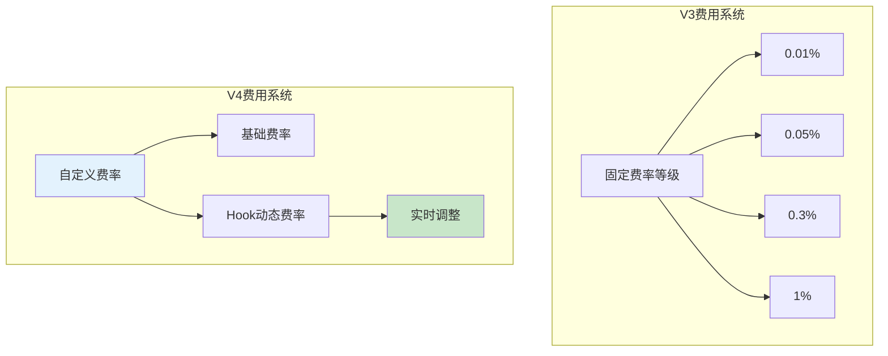
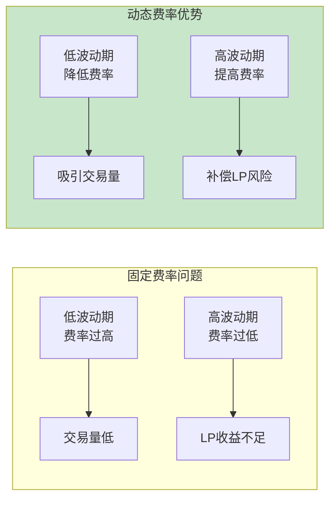
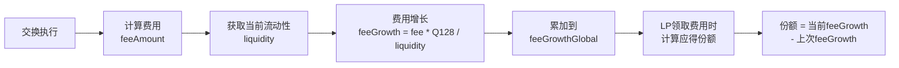
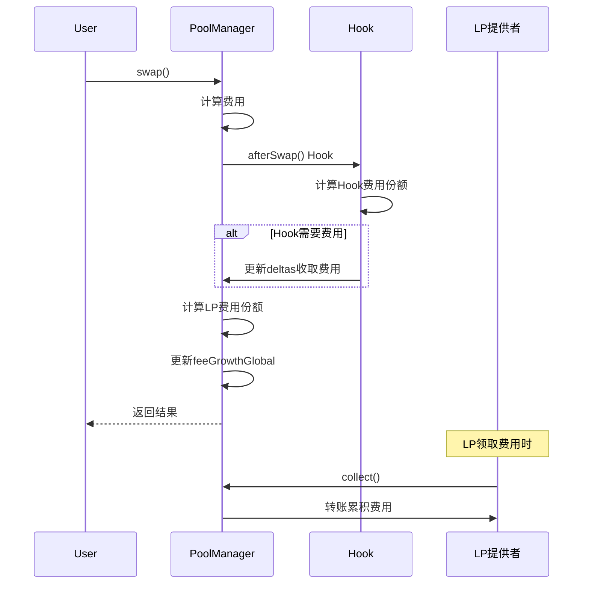
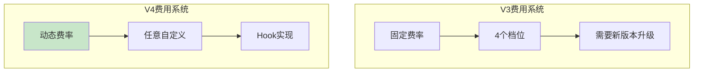
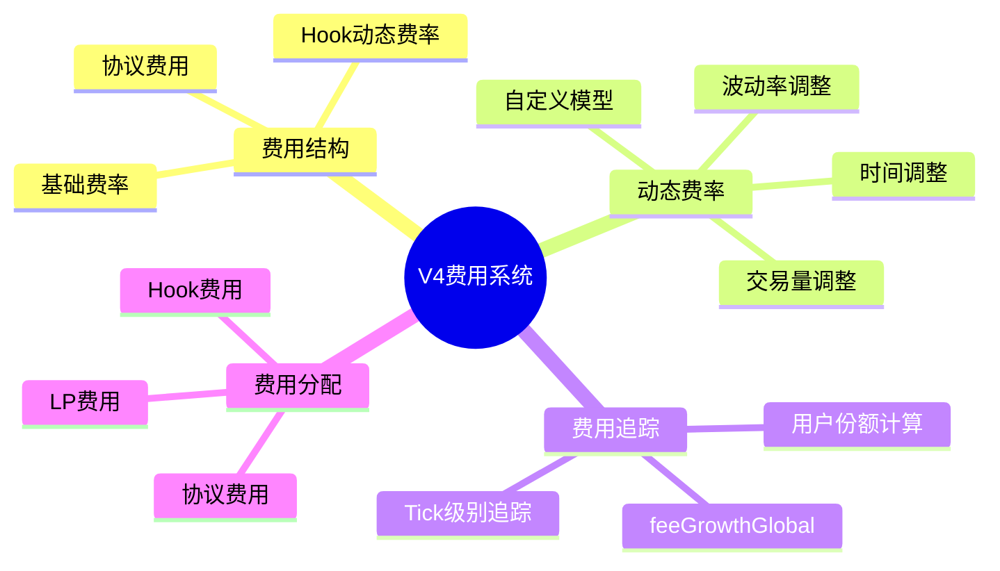

# 死磕Uniswap V4（五）：费用系统与动态费率

> 本文是「死磕Uniswap V4」系列的第五篇，深入剖析V4的费用系统架构和动态费率实现。

## 系列导航

| 序号 | 标题 | 核心内容 |
|:----:|------|----------|
| 01 | V4概述与架构革命 | Singleton、Hooks、Flash Accounting |
| 02 | Hooks机制深度解析 | Hook接口、生命周期、实现模式 |
| 03 | 单例架构与瞬时会计 | PoolManager、Currency、Accounting |
| 04 | 交换流程与Hook执行时序 | swap函数、Hook调用链、Gas分析 |
| **05** | **费用系统与动态费率** | **自定义费率、动态调整、费用分配** |
| 06 | 账户抽象与原生ETH | Currency类型、settle/take、批量操作 |
| 07 | 安全分析与最佳实践 | Hook安全、MEV防护、审计要点 |

---

## 1. V4费用系统架构

### 1.1 从V3到V4的费用变化



### 1.2 费用结构定义

```solidity
/// @notice 费用配置
library Pool {
    struct Fees {
        uint16 fee;     // 基础费率（单位：1e-6，即0.0001%）
        uint16 hookFee; // Hook控制的动态费率部分
    }
}

/// @notice 协议费用
struct ProtocolFees {
    uint16 token0; // token0的协议费率（单位：1e-4，即0.01%）
    uint16 token1; // token1的协议费率（单位：1e-4，即0.01%）
}
```

**费率单位说明：**

| 费用类型 | 单位 | 示例值 | 实际费率 |
|----------|------|--------|----------|
| `fee` | 1e-6 | 3000 | 0.3% |
| `hookFee` | 1e-6 | 500 | 0.05% |
| `协议费` | 1e-4 | 10 | 0.1% |

### 1.3 总费率计算

```solidity
/// @notice 计算实际总费率
/// @return 总费率（单位：1e-6）
function getTotalFee(
    bytes32 poolId,
    Pool.Fees memory fees,
    uint256 protocolFee
) internal pure returns (uint256) {
    // 总费率 = 基础费率 + Hook费率 + 协议费率
    uint256 totalFee = uint256(fees.fee) + uint256(fees.hookFee);

    // 协议费从LP费用中扣除
    // 所以LP实际收到的费用 = totalFee - protocolFee

    return totalFee;
}

/// @notice 计算LP实际收到的费用
/// @return LP费用率（单位：1e-6）
function getLpFee(
    uint256 totalFee,
    uint256 protocolFee
) internal pure returns (uint256) {
    return totalFee - (protocolFee * 10000 / 10000);  // 协议费率单位转换
}
```

---

## 2. 动态费率实现

### 2.1 动态费率设计理念

传统AMM的固定费率无法适应不同市场条件：



### 2.2 基于波动率的动态费率

```solidity
/// @notice 基于波动率的动态费率Hook
contract VolatilityBasedFeeHook is IHooks {
    IPoolManager public immutable poolManager;

    /// @notice 费率参数
    struct FeeParams {
        uint256 baseFee;           // 基础费率
        uint256 minFee;            // 最低费率
        uint256 maxFee;            // 最高费率
        uint256 volatilityWindow;  // 波动率计算窗口
        uint256 volatilityMultiplier; // 波动率乘数
    }

    mapping(bytes32 => FeeParams) public feeParams;

    /// @notice 波动率追踪
    struct VolatilityTracker {
        uint256 lastTimestamp;
        uint256 lastPrice;
        uint256[] priceHistory;
    }

    mapping(bytes32 => VolatilityTracker) public volatilityTrackers;

    constructor(IPoolManager _poolManager) {
        poolManager = _poolManager;
    }

    /// @notice 设置费率参数
    function setFeeParams(
        bytes32 poolId,
        uint256 baseFee,
        uint256 minFee,
        uint256 maxFee,
        uint256 volatilityWindow,
        uint256 volatilityMultiplier
    ) external {
        feeParams[poolId] = FeeParams({
            baseFee: baseFee,
            minFee: minFee,
            maxFee: maxFee,
            volatilityWindow: volatilityWindow,
            volatilityMultiplier: volatilityMultiplier
        });
    }

    /// @notice beforeSwap Hook：动态调整费率
    function beforeSwap(
        address sender,
        PoolKey calldata key,
        IPoolManager.SwapParams calldata params,
        bytes calldata hookData
    ) external returns (bytes4, int256, int256) {
        bytes32 poolId = key.poolId;

        // 获取当前价格
        (uint160 sqrtPriceX96, , , ) = poolManager.slot0s(poolId);
        uint256 currentPrice = uint256(sqrtPriceX96);

        // 更新波动率
        uint256 volatility = _updateVolatility(poolId, currentPrice);

        // 计算动态费率
        FeeParams memory params = feeParams[poolId];
        uint256 dynamicFee = _calculateDynamicFee(
            volatility,
            params.baseFee,
            params.minFee,
            params.maxFee,
            params.volatilityMultiplier
        );

        // 更新Hook费率
        uint16 hookFee = uint16(dynamicFee - params.baseFee);
        poolManager.setHookFee(poolId, hookFee);

        return (IHooks.beforeSwap.selector, 0, 0);
    }

    /// @notice 更新波动率
    function _updateVolatility(
        bytes32 poolId,
        uint256 currentPrice
    ) private returns (uint256) {
        VolatilityTracker storage tracker = volatilityTrackers[poolId];

        if (tracker.lastTimestamp == 0) {
            // 首次调用
            tracker.lastPrice = currentPrice;
            tracker.lastTimestamp = block.timestamp;
            tracker.priceHistory.push(currentPrice);
            return 0;
        }

        // 添加当前价格到历史
        tracker.priceHistory.push(currentPrice);

        // 移除超出窗口的价格
        FeeParams memory params = feeParams[poolId];
        uint256 windowSeconds = params.volatilityWindow;

        while (
            tracker.priceHistory.length > 1 &&
            tracker.lastTimestamp - (block.timestamp - windowSeconds * tracker.priceHistory.length) > windowSeconds
        ) {
            tracker.priceHistory[0] = tracker.priceHistory[tracker.priceHistory.length - 1];
            tracker.priceHistory.pop();
        }

        // 计算波动率（标准差）
        uint256 volatility = _calculateStandardDeviation(tracker.priceHistory);

        tracker.lastPrice = currentPrice;
        tracker.lastTimestamp = block.timestamp;

        return volatility;
    }

    /// @notice 计算标准差
    function _calculateStandardDeviation(uint256[] memory prices) private pure returns (uint256) {
        if (prices.length < 2) return 0;

        // 计算平均价格
        uint256 sum = 0;
        for (uint256 i = 0; i < prices.length; i++) {
            sum += prices[i];
        }
        uint256 mean = sum / prices.length;

        // 计算方差
        uint256 variance = 0;
        for (uint256 i = 0; i < prices.length; i++) {
            uint256 diff = prices[i] > mean ? prices[i] - mean : mean - prices[i];
            variance += (diff * diff) / prices.length;
        }

        // 返回标准差（平方根的近似值）
        return sqrt(variance);
    }

    /// @notice 计算动态费率
    function _calculateDynamicFee(
        uint256 volatility,
        uint256 baseFee,
        uint256 minFee,
        uint256 maxFee,
        uint256 multiplier
    ) private pure returns (uint256) {
        // 费率调整 = 基础费率 + 波动率 * 乘数
        uint256 feeAdjustment = (volatility * multiplier) / 1e18;
        uint256 dynamicFee = baseFee + feeAdjustment;

        // 限制在范围内
        if (dynamicFee < minFee) dynamicFee = minFee;
        if (dynamicFee > maxFee) dynamicFee = maxFee;

        return dynamicFee;
    }

    /// @notice 平方根近似计算
    function sqrt(uint256 x) private pure returns (uint256) {
        if (x == 0) return 0;
        uint256 z = (x + 1) / 2;
        uint256 y = x;
        while (z < y) {
            y = z;
            z = (x / z + z) / 2;
        }
        return y;
    }
}
```

### 2.3 基于交易量的动态费率

```solidity
/// @notice 基于交易量的阶梯费率Hook
contract VolumeBasedFeeHook is IHooks {
    IPoolManager public immutable poolManager;

    /// @notice 交易量区间和对应费率
    struct VolumeTier {
        uint256 minVolume;
        uint256 maxVolume;
        uint256 fee;
    }

    mapping(bytes32 => VolumeTier[]) public volumeTiers;

    /// @notice 累计交易量
    mapping(bytes32 => uint256) public cumulativeVolume;
    mapping(bytes32 => uint256) public lastResetTime;

    /// @notice 设置阶梯费率
    function setVolumeTiers(
        bytes32 poolId,
        VolumeTier[] calldata tiers
    ) external {
        delete volumeTiers[poolId];
        for (uint256 i = 0; i < tiers.length; i++) {
            volumeTiers[poolId].push(tiers[i]);
        }
    }

    function beforeSwap(
        address sender,
        PoolKey calldata key,
        IPoolManager.SwapParams calldata params,
        bytes calldata hookData
    ) external returns (bytes4, int256, int256) {
        bytes32 poolId = key.poolId;
        uint256 amount = abs(params.amountSpecified);

        // 更新累计交易量
        cumulativeVolume[poolId] += amount;

        // 获取当前时间窗口的交易量
        uint256 windowVolume = _getWindowVolume(poolId);

        // 查找对应的费率档位
        uint256 dynamicFee = _getFeeByVolume(poolId, windowVolume);

        // 更新Hook费率
        uint16 hookFee = uint16(dynamicFee - 3000); // 假设基础费率为3000
        poolManager.setHookFee(poolId, hookFee);

        return (IHooks.beforeSwap.selector, 0, 0);
    }

    function _getWindowVolume(bytes32 poolId) private view returns (uint256) {
        // 获取最近1小时的交易量
        uint256 resetTime = lastResetTime[poolId];
        if (block.timestamp - resetTime > 1 hours) {
            return 0;
        }
        return cumulativeVolume[poolId];
    }

    function _getFeeByVolume(
        bytes32 poolId,
        uint256 volume
    ) private view returns (uint256) {
        VolumeTier[] storage tiers = volumeTiers[poolId];

        for (uint256 i = 0; i < tiers.length; i++) {
            if (volume >= tiers[i].minVolume && volume < tiers[i].maxVolume) {
                return tiers[i].fee;
            }
        }

        // 默认费率
        return 3000;
    }

    function abs(int256 x) private pure returns (uint256) {
        return x >= 0 ? uint256(x) : uint256(-x);
    }
}
```

### 2.4 基于时间的动态费率

```solidity
/// @notice 基于时间的动态费率Hook
contract TimeBasedFeeHook is IHooks {
    IPoolManager public immutable poolManager;

    /// @notice 时间段费率配置
    struct TimeFee {
        uint256 startHour;  // 开始小时（0-23）
        uint256 endHour;    // 结束小时（0-23）
        uint256 fee;        // 费率
    }

    TimeFee[] public timeFees;

    constructor(IPoolManager _poolManager, TimeFee[] memory _timeFees) {
        poolManager = _poolManager;
        for (uint256 i = 0; i < _timeFees.length; i++) {
            timeFees.push(_timeFees[i]);
        }
    }

    function beforeSwap(
        address sender,
        PoolKey calldata key,
        IPoolManager.SwapParams calldata params,
        bytes calldata hookData
    ) external returns (bytes4, int256, int256) {
        // 获取当前小时（UTC）
        uint256 currentHour = (block.timestamp / 3600) % 24;

        // 查找对应的费率
        uint256 dynamicFee = _getFeeByTime(currentHour);

        // 更新Hook费率
        uint16 hookFee = uint16(dynamicFee - 3000);
        poolManager.setHookFee(key.poolId, hookFee);

        return (IHooks.beforeSwap.selector, 0, 0);
    }

    function _getFeeByTime(uint256 hour) private view returns (uint256) {
        for (uint256 i = 0; i < timeFees.length; i++) {
            uint256 start = timeFees[i].startHour;
            uint256 end = timeFees[i].endHour;

            if (end > start) {
                // 正常时间段
                if (hour >= start && hour < end) {
                    return timeFees[i].fee;
                }
            } else {
                // 跨天时间段
                if (hour >= start || hour < end) {
                    return timeFees[i].fee;
                }
            }
        }

        // 默认费率
        return 3000;
    }
}
```

---

## 3. 费用增长追踪

### 3.1 feeGrowthGlobal结构

```solidity
/// @notice 费用增长追踪
contract PoolManager {
    /// @notice 每个流动性单位的费用累积
    mapping(bytes32 poolId => uint256) public feeGrowthGlobal0X128;  // token0
    mapping(bytes32 poolId => uint256) public feeGrowthGlobal1X128;  // token1

    /// @notice 更新费用增长
    function _updateFeeGrowth(
        bytes32 poolId,
        uint256 feeAmount0,
        uint256 feeAmount1,
        uint128 liquidity
    ) internal {
        if (liquidity > 0) {
            // 费用增长 = 费用金额 / 流动性 * Q128
            feeGrowthGlobal0X128[poolId] += FullMath.mulDiv(
                feeAmount0,
                FixedPoint128.Q128,
                liquidity
            );

            feeGrowthGlobal1X128[poolId] += FullMath.mulDiv(
                feeAmount1,
                FixedPoint128.Q128,
                liquidity
            );
        }
    }
}
```

### 3.2 费用增长计算图



### 3.3 Tick级别的费用追踪

```solidity
/// @notice Tick信息
library Tick {
    struct Info {
        uint128 liquidityGross;              // 总流动性
        int128 liquidityNet;                 // 净流动性
        uint256 feeGrowthOutside0X128;       // 外部费用增长（token0）
        uint256 feeGrowthOutside1X128;       // 外部费用增长（token1）
        int56 tickCumulativeOutside;        // 外部tick累积
        uint160 secondsPerLiquidityOutsideX128; // 外部每流动性秒数
        uint32 secondsOutside;               // 外部秒数
        bool initialized;                    // 是否已初始化
    }
}

/// @notice 更新Tick的外部费用
function _updateTickFees(
    bytes32 poolId,
    int24 tick,
    bool zeroForOne,
    uint256 feeGrowthGlobal0,
    uint256 feeGrowthGlobal1
) internal {
    Tick.Info storage tickInfo = ticks[poolId][tick];

    if (zeroForOne) {
        // 向左移动，当前tick的外部 = 当前全局
        tickInfo.feeGrowthOutside0X128 = feeGrowthGlobal0;
        tickInfo.feeGrowthOutside1X128 = feeGrowthGlobal1;
    } else {
        // 向右移动，交换处理
        tickInfo.feeGrowthOutside0X128 = feeGrowthGlobal0;
        tickInfo.feeGrowthOutside1X128 = feeGrowthGlobal1;
    }
}
```

---

## 4. Hook费用分配

### 4.1 费用分配流程



### 4.2 Hook费用收取

```solidity
/// @notice 在beforeSwap中收取额外费用
function beforeSwap(
    address sender,
    PoolKey calldata key,
    IPoolManager.SwapParams calldata params,
    bytes calldata hookData
) external returns (bytes4, int256, int256) {
    bytes32 poolId = key.poolId;

    // 计算Hook费用（例如：基于交易量的百分比）
    uint256 hookFeeAmount = abs(params.amountSpecified) / 1000; // 0.1%

    int256 delta0 = 0;
    int256 delta1 = 0;

    if (params.zeroForOne) {
        // 卖出token0，收取token0作为Hook费用
        delta0 = int256(hookFeeAmount);
    } else {
        // 卖出token1，收取token1作为Hook费用
        delta1 = int256(hookFeeAmount);
    }

    // 记录费用收入
    _recordHookFee(poolId, params.zeroForOne ? key.currency0 : key.currency1, hookFeeAmount);

    return (IHooks.beforeSwap.selector, delta0, delta1);
}

/// @notice 记录Hook费用
mapping(bytes32 => mapping(Currency => uint256)) public hookFees;

function _recordHookFee(
    bytes32 poolId,
    Currency currency,
    uint256 amount
) private {
    hookFees[poolId][currency] += amount;
    emit HookFeeCollected(poolId, currency, amount);
}

/// @notice 提取Hook费用
function withdrawHookFees(
    bytes32 poolId,
    Currency currency,
    address recipient,
    uint256 amount
) external {
    require(hookFees[poolId][currency] >= amount, "Insufficient fees");
    hookFees[poolId][currency] -= amount;

    if (CurrencyLibrary.isNative(currency)) {
        payable(recipient).transfer(amount);
    } else {
        ERC20(Currency.unwrap(currency)).transfer(recipient, amount);
    }

    emit HookFeeWithdrawn(poolId, currency, recipient, amount);
}
```

### 4.3 LP费用分配

```solidity
/// @notice LP领取费用
function collect(
    PoolKey calldata key,
    int24 tickLower,
    int24 tickUpper,
    uint128 amount0,
    uint128 amount1
) external returns (uint256 collected0, uint256 collected1) {
    bytes32 poolId = key.poolId;

    // 获取当前的费用增长
    uint256 feeGrowthGlobal0 = feeGrowthGlobal0X128[poolId];
    uint256 feeGrowthGlobal1 = feeGrowthGlobal1X128[poolId];

    // 获取用户上次领取的费用增长
    (uint256 userFeeGrowth0, uint256 userFeeGrowth1) = _getUserFeeGrowth(
        msg.sender,
        poolId,
        tickLower,
        tickUpper
    );

    // 计算新产生的费用
    uint256 feeGrowth0 = feeGrowthGlobal0 - userFeeGrowth0;
    uint256 feeGrowth1 = feeGrowthGlobal1 - userFeeGrowth1;

    // 获取用户的流动性
    uint128 liquidity = _getUserLiquidity(msg.sender, poolId, tickLower, tickUpper);

    // 计算可领取的费用
    uint256 collectable0 = FullMath.mulDiv(liquidity, feeGrowth0, FixedPoint128.Q128);
    uint256 collectable1 = FullMath.mulDiv(liquidity, feeGrowth1, FixedPoint128.Q128);

    // 限制领取金额
    if (amount0 > 0 && collectable0 > amount0) collectable0 = amount0;
    if (amount1 > 0 && collectable1 > amount1) collectable1 = amount1;

    // 更新用户的费用增长记录
    _setUserFeeGrowth(
        msg.sender,
        poolId,
        tickLower,
        tickUpper,
        feeGrowthGlobal0,
        feeGrowthGlobal1
    );

    // 转账费用
    if (collectable0 > 0) {
        deltas[msg.sender][key.currency0] += int256(collectable0);
    }
    if (collectable1 > 0) {
        deltas[msg.sender][key.currency1] += int256(collectable1);
    }

    emit Collect(msg.sender, poolId, tickLower, tickUpper, collectable0, collectable1);

    return (collectable0, collectable1);
}
```

---

## 5. 协议费用

### 5.1 协议费用结构

```solidity
/// @notice 协议费用配置
struct ProtocolFees {
    uint16 token0; // token0协议费率（单位：1e-4，即0.01%）
    uint16 token1; // token1协议费率（单位：1e-4，即0.01%）
}

/// @notice 协议费用累积
uint256 public protocolFees0; // 累积的token0协议费
uint256 public protocolFees1; // 累积的token1协议费
```

### 5.2 协议费用计算

```solidity
/// @notice 计算协议费用
function _calculateProtocolFees(
    bytes32 poolId,
    uint256 feeAmount0,
    uint256 feeAmount1
) internal view returns (uint256 protocolFee0, uint256 protocolFee1) {
    ProtocolFees memory protocolFees = protocolFees[poolId];

    // 协议费 = 总费用 * 协议费率 / 10000
    if (protocolFees.token0 > 0) {
        protocolFee0 = feeAmount0 * protocolFees.token0 / 10000;
    }
    if (protocolFees.token1 > 0) {
        protocolFee1 = feeAmount1 * protocolFees.token1 / 10000;
    }
}

/// @notice 提取协议费用
function collectProtocolFees(
    Currency currency,
    address recipient,
    uint256 amount
) external {
    require(msg.sender == owner, "Not owner");

    if (CurrencyLibrary.isNative(currency)) {
        require(protocolFees0 >= amount, "Insufficient fees");
        protocolFees0 -= amount;
        payable(recipient).transfer(amount);
    } else {
        uint256 fees = currency == poolKey.currency0 ? protocolFees0 : protocolFees1;
        require(fees >= amount, "Insufficient fees");
        if (currency == poolKey.currency0) {
            protocolFees0 -= amount;
        } else {
            protocolFees1 -= amount;
        }
        ERC20(Currency.unwrap(currency)).transfer(recipient, amount);
    }

    emit ProtocolFeesCollected(currency, recipient, amount);
}
```

---

## 6. 费用系统对比

### 6.1 V3 vs V4 费用对比



### 6.2 费用对比表

| 特性 | V3 | V4 |
|------|----|----|
| **费率设置** | 固定4档 | 任意自定义 |
| **动态调整** | ❌ | ✅（Hook） |
| **调整频率** | 从不 | 实时 |
| **自定义模型** | ❌ | ✅ |
| **费用分配** | 手动 | 自动（Hook） |
| **协议费用** | 固定开关 | 动态配置 |

---

## 7. 实际应用案例

### 7.1 稳定币最优费率

```solidity
/// @notice 稳定币最优费率Hook
/// @dev 稳定币对价格波动小，可以使用极低费率
contract StablecoinOptimalFeeHook is IHooks {
    IPoolManager public immutable poolManager;

    function beforeSwap(
        address sender,
        PoolKey calldata key,
        IPoolManager.SwapParams calldata params,
        bytes calldata hookData
    ) external returns (bytes4, int256, int256) {
        // 稳定币对使用极低费率（0.01%）
        uint256 stablecoinFee = 100; // 0.01%

        // 检查价格偏差
        (uint160 sqrtPriceX96, , , ) = poolManager.slot0s(key.poolId);
        uint256 currentPrice = uint256(sqrtPriceX96);
        uint256 targetPrice = 1 << 96; // 理想价格 = 1

        // 价格偏差越大，费率越高
        uint256 priceDeviation = currentPrice > targetPrice
            ? currentPrice - targetPrice
            : targetPrice - currentPrice;

        uint256 dynamicFee = stablecoinFee + (priceDeviation / 1e20);

        // 限制在0.01%-0.05%范围内
        if (dynamicFee < 100) dynamicFee = 100;
        if (dynamicFee > 500) dynamicFee = 500;

        uint16 hookFee = uint16(dynamicFee - 100);
        poolManager.setHookFee(key.poolId, hookFee);

        return (IHooks.beforeSwap.selector, 0, 0);
    }
}
```

### 7.2 高波动资产保护

```solidity
/// @notice 高波动资产保护Hook
/// @dev 对高波动资产收取更高费用以补偿LP风险
contract HighVolatilityProtectionHook is IHooks {
    IPoolManager public immutable poolManager;

    function beforeSwap(
        address sender,
        PoolKey calldata key,
        IPoolManager.SwapParams calldata params,
        bytes calldata hookData
    ) external returns (bytes4, int256, int256) {
        bytes32 poolId = key.poolId;

        // 计算最近24小时的价格变化
        uint256 priceChange = _get24HourPriceChange(poolId);

        // 价格变化越大，费率越高
        uint256 baseFee = 3000; // 0.3%
        uint256 volatilityFee = priceChange * 2; // 双倍价格变化作为额外费率

        uint256 dynamicFee = baseFee + volatilityFee;

        // 限制在1%以内
        if (dynamicFee > 10000) dynamicFee = 10000;

        uint16 hookFee = uint16(dynamicFee - baseFee);
        poolManager.setHookFee(poolId, hookFee);

        return (IHooks.beforeSwap.selector, 0, 0);
    }

    function _get24HourPriceChange(bytes32 poolId) private view returns (uint256) {
        // 实现价格变化计算
        // ...
        return 0;
    }
}
```

---

## 8. 本章小结

### 8.1 费用系统总结



### 8.2 关键概念回顾

| 概念 | 说明 | 单位 |
|------|------|------|
| `fee` | 基础费率 | 1e-6 (0.0001%) |
| `hookFee` | Hook控制的费率 | 1e-6 (0.0001%) |
| `feeGrowthGlobal` | 全局费用增长 | Q128 |
| `协议费` | 协议抽取的费用 | 1e-4 (0.01%) |

### 8.3 动态费率策略

| 策略 | 适用场景 | 优点 |
|------|----------|------|
| 波动率调整 | 高波动资产 | 补偿LP风险 |
| 交易量调整 | 活跃交易对 | 优化流动性 |
| 时间调整 | 特定时段需求 | 灵活定价 |
| 价格偏差 | 稳定币对 | 套利激励 |

---

## 下一篇预告

在下一篇文章中，我们将深入探讨**账户抽象与原生ETH**，包括：
- Currency类型详解
- settle()和take()函数原理
- 批量操作实现
- 元交易支持
- Gas优化技巧

---

## 参考资料

- [Uniswap V4 Core - PoolManager.sol](https://github.com/Uniswap/v4-core/blob/main/src/PoolManager.sol)
- [Uniswap V4 Core - Pool.sol](https://github.com/Uniswap/v4-core/blob/main/src/types/Pool.sol)
- [Uniswap V3 Fees](https://docs.uniswap.org/protocol/concepts/V3-overview/fees)
