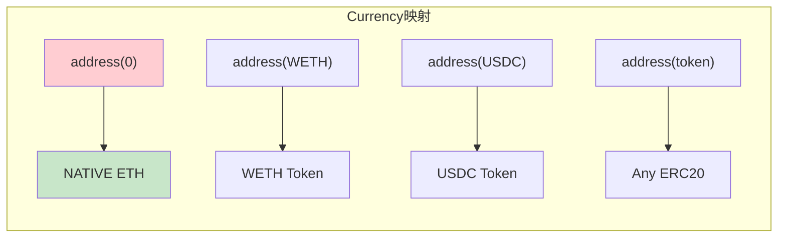
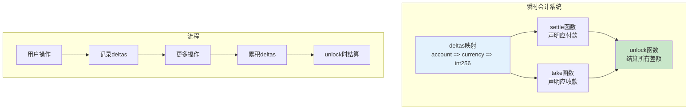
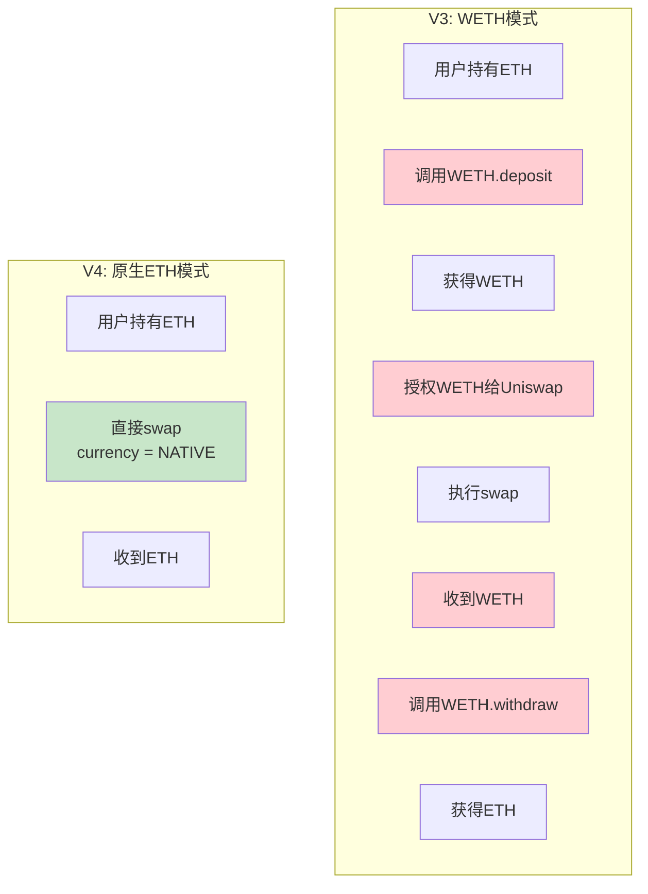
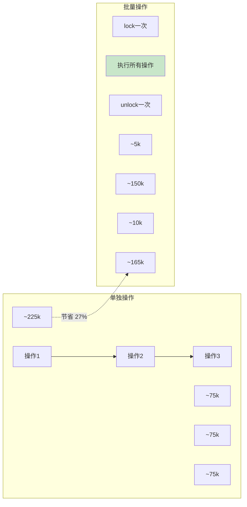
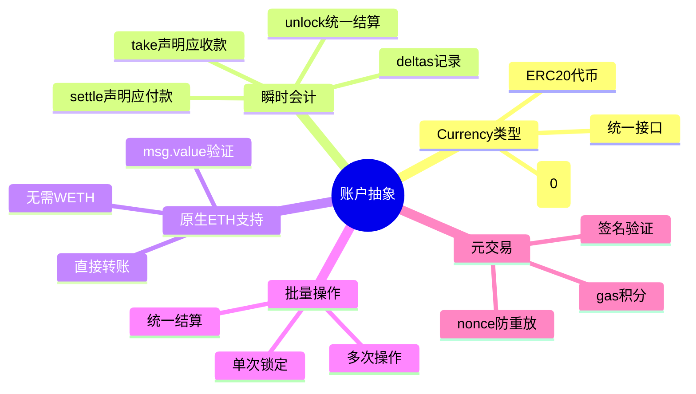

# 死磕Uniswap V4（六）：账户抽象与原生ETH

> 本文是「死磕Uniswap V4」系列的第六篇，深入剖析V4的账户抽象设计和原生ETH支持。

## 系列导航

| 序号 | 标题 | 核心内容 |
|:----:|------|----------|
| 01 | V4概述与架构革命 | Singleton、Hooks、Flash Accounting |
| 02 | Hooks机制深度解析 | Hook接口、生命周期、实现模式 |
| 03 | 单例架构与瞬时会计 | PoolManager、Currency、Accounting |
| 04 | 交换流程与Hook执行时序 | swap函数、Hook调用链、Gas分析 |
| 05 | 费用系统与动态费率 | 自定义费率、动态调整、费用分配 |
| **06** | **账户抽象与原生ETH** | **Currency类型、settle/take、批量操作** |
| 07 | 安全分析与最佳实践 | Hook安全、MEV防护、审计要点 |

---

## 1. Currency类型系统

### 1.1 统一代币抽象

V4引入`Currency`类型，统一处理原生ETH和ERC20代币：

```solidity
/// @notice Currency类型
/// @dev 本质上是address，但提供类型安全
type Currency is address;

/// @notice Currency库
library CurrencyLibrary {
    /// @notice 原生ETH的特殊地址
    Currency internal constant NATIVE = Currency.wrap(address(0));

    /// @notice 判断是否为原生ETH
    function isNative(Currency currency) internal pure returns (bool) {
        return Currency.unwrap(currency) == address(0);
    }

    /// @notice 从address创建Currency
    function fromAddress(address addr) internal pure returns (Currency) {
        return Currency.wrap(addr);
    }

    /// @notice 获取底层地址
    function toAddress(Currency currency) internal pure returns (address) {
        return Currency.unwrap(currency);
    }

    /// @notice 获取Currency的转账编码
    function transferCalldata(
        Currency currency,
        address to,
        uint256 amount
    ) internal pure returns (bytes memory) {
        if (isNative(currency)) {
            return abi.encodeWithSignature("transfer(uint256)", amount);
        } else {
            return abi.encodeWithSignature(
                "transfer(address,uint256)",
                to,
                amount
            );
        }
    }

    /// @notice 获取Currency的transferFrom编码
    function transferFromCalldata(
        Currency currency,
        address from,
        address to,
        uint256 amount
    ) internal pure returns (bytes memory) {
        if (isNative(currency)) {
            // ETH不支持transferFrom
            return "";
        } else {
            return abi.encodeWithSignature(
                "transferFrom(address,address,uint256)",
                from,
                to,
                amount
            );
        }
    }
}
```

### 1.2 Currency与address的对应



### 1.3 Currency操作封装

```solidity
/// @notice Currency操作库
library CurrencyFunctions {
    using SafeERC20 for IERC20;

    /// @notice 获取余额
    function balanceOf(Currency currency, address account) internal view returns (uint256) {
        if (CurrencyLibrary.isNative(currency)) {
            return account.balance;
        } else {
            return IERC20(CurrencyLibrary.toAddress(currency)).balanceOf(account);
        }
    }

    /// @notice 转账
    function transfer(
        Currency currency,
        address to,
        uint256 amount
    ) internal {
        if (CurrencyLibrary.isNative(currency)) {
            payable(to).transfer(amount);
        } else {
            IERC20(CurrencyLibrary.toAddress(currency)).safeTransfer(to, amount);
        }
    }

    /// @notice 从指定地址转账
    function transferFrom(
        Currency currency,
        address from,
        address to,
        uint256 amount
    ) internal {
        if (CurrencyLibrary.isNative(currency)) {
            // ETH需要msg.value
            require(msg.value >= amount, "Insufficient ETH");
        } else {
            IERC20(CurrencyLibrary.toAddress(currency)).safeTransferFrom(from, to, amount);
        }
    }

    /// @notice 授权
    function approve(
        Currency currency,
        address spender,
        uint256 amount
    ) internal {
        require(!CurrencyLibrary.isNative(currency), "Cannot approve ETH");
        IERC20(CurrencyLibrary.toAddress(currency)).safeApprove(spender, amount);
    }

    /// @notice 获取代币符号
    function symbol(Currency currency) internal view returns (string memory) {
        if (CurrencyLibrary.isNative(currency)) {
            return "ETH";
        } else {
            return IERC20Metadata(CurrencyLibrary.toAddress(currency)).symbol();
        }
    }

    /// @notice 获取代币精度
    function decimals(Currency currency) internal view returns (uint8) {
        if (CurrencyLibrary.isNative(currency)) {
            return 18;
        } else {
            return IERC20Metadata(CurrencyLibrary.toAddress(currency)).decimals();
        }
    }
}
```

---

## 2. 瞬时会计深度解析

### 2.1 瞬时会计架构



### 2.2 deltas数据结构

```solidity
/// @notice 账户差额记录
/// @dev int256类型：
///      - 正数：应收款（Pool欠用户）
///      - 负数：应付款（用户欠Pool）
mapping(address account => mapping(Currency currency => int256)) public deltas;

/// @notice 差额变化结构
struct BalanceDelta {
    int256 delta0;  // currency0的变化
    int256 delta1;  // currency1的变化
}

/// @notice 差额操作记录（用于结算）
struct DeltaOperation {
    address account;
    Currency currency;
    int256 amount;
}

DeltaOperation[] private deltaOperations;  // 用于追踪所有操作
```

### 2.3 settle() 函数详解

```solidity
/// @notice 用户声明将支付指定数量的代币
/// @param currency 要支付的代币类型
/// @param amount 支付数量
/// @dev 此函数记录用户的应付款，实际转账在unlock时进行
function settle(Currency currency, uint256 amount) external {
    // 1. 验证锁定状态
    require(locked != 0, "Not locked");

    // 2. 记录差额（负数表示应付款）
    deltas[msg.sender][currency] -= int256(amount);

    // 3. 对于原生ETH，立即验证msg.value
    if (CurrencyLibrary.isNative(currency)) {
        // 计算用户当前应付的ETH总额
        int256 currentDelta = deltas[msg.sender][currency];
        require(currentDelta <= 0, "Invalid delta");

        uint256 payableAmount = uint256(-currentDelta);
        require(msg.value >= payableAmount, "Insufficient ETH");
    }

    // 4. 记录操作
    deltaOperations.push(DeltaOperation({
        account: msg.sender,
        currency: currency,
        amount: -int256(amount)
    }));

    emit Settle(msg.sender, currency, amount);
}

/// @notice 批量settle
function settleAll(
    Currency[] calldata currencies,
    uint256[] calldata amounts
) external {
    require(currencies.length == amounts.length, "Length mismatch");
    require(locked != 0, "Not locked");

    for (uint256 i = 0; i < currencies.length; i++) {
        deltas[msg.sender][currencies[i]] -= int256(amounts[i]);

        if (CurrencyLibrary.isNative(currencies[i])) {
            int256 currentDelta = deltas[msg.sender][currencies[i]];
            require(uint256(-currentDelta) <= msg.value, "Insufficient ETH");
        }

        emit Settle(msg.sender, currencies[i], amounts[i]);
    }
}
```

### 2.4 take() 函数详解

```solidity
/// @notice 用户声明将接收指定数量的代币
/// @param currency 要接收的代币类型
/// @param recipient 接收地址
/// @param amount 接收数量
/// @dev 此函数记录用户的应收款，实际转账在unlock时进行
function take(
    Currency currency,
    address recipient,
    uint256 amount
) external {
    // 1. 验证锁定状态
    require(locked != 0, "Not locked");

    // 2. 记录差额（正数表示应收款）
    deltas[recipient][currency] += int256(amount);

    // 3. 记录操作
    deltaOperations.push(DeltaOperation({
        account: recipient,
        currency: currency,
        amount: int256(amount)
    }));

    emit Take(msg.sender, recipient, currency, amount);
}

/// @notice 批量take
function takeAll(
    Currency[] calldata currencies,
    address recipient,
    uint256[] calldata amounts
) external {
    require(currencies.length == amounts.length, "Length mismatch");
    require(locked != 0, "Not locked");

    for (uint256 i = 0; i < currencies.length; i++) {
        deltas[recipient][currencies[i]] += int256(amounts[i]);
        emit Take(msg.sender, recipient, currencies[i], amounts[i]);
    }
}
```

### 2.5 unlock结算详解

```solidity
/// @notice 内部结算函数
/// @dev 在unlock时调用，结算所有账户的差额
function _accountingBalance() internal {
    // 1. 遍历所有有差额的账户
    for (uint256 i = 0; i < accountsWithDeltas.length; i++) {
        address account = accountsWithDeltas[i];

        // 2. 遍历该账户的所有差额代币
        for (uint256 j = 0; j < currenciesWithDeltas.length; j++) {
            Currency currency = currenciesWithDeltas[j];
            int256 delta = deltas[account][currency];

            if (delta == 0) continue;

            if (delta > 0) {
                // 正数：Pool需要支付给用户
                _payToAccount(account, currency, uint256(delta));
            } else {
                // 负数：用户需要支付给Pool
                _collectFromAccount(account, currency, uint256(-delta));
            }

            // 清零差额
            deltas[account][currency] = 0;
        }
    }

    // 3. 清空列表
    delete accountsWithDeltas;
    delete currenciesWithDeltas;
}

/// @notice 支付给账户
function _payToAccount(
    address account,
    Currency currency,
    uint256 amount
) ) private {
    if (CurrencyLibrary.isNative(currency)) {
        // 原生ETH：直接发送
        payable(account).transfer(amount);
    } else {
        // ERC20：转账
        IERC20(CurrencyLibrary.toAddress(currency)).transfer(account, amount);
    }

    emit Payment(account, currency, amount);
}

/// @notice 从账户收取
function _collectFromAccount(
    address account,
    Currency currency,
    uint256 amount
) private {
    if (CurrencyLibrary.isNative(currency)) {
        // ETH在settle时已经验证msg.value
        // 这里不需要额外操作
        // 但需要退还多余的ETH
        int256 remainingDelta = deltas[account][currency];
        if (remainingDelta < 0) {
            // 用户支付了足够的ETH
            // 不需要退款（msg.value在交易结束时自动退还）
        }
    } else {
        // ERC20：transferFrom
        IERC20(CurrencyLibrary.toAddress(currency)).transferFrom(
            account,
            address(this),
            amount
        );
    }

    emit Collection(account, currency, amount);
}
```

---

## 3. 原生ETH支持

### 3.1 ETH vs WETH对比



### 3.2 原生ETH交换示例

```solidity
/// @notice 原生ETH交换示例
/// @param amountInEth 输入的ETH数量
/// @param amountOutMin 最小输出数量
function swapEthForToken(
    uint256 amountInEth,
    uint256 amountOutMin,
    PoolKey calldata key
) external payable returns (uint256 amountOut) {
    // 验证currency0是原生ETH
    require(
        CurrencyLibrary.isNative(key.currency0),
        "Currency0 must be ETH"
    );

    // 构造交换参数
    SwapParams memory params = SwapParams({
        zeroForOne: true,  // ETH → Token
        amountSpecified: int256(amountInEth),
        sqrtPriceLimitX96: TickMath.MIN_SQRT_RATIO + 1,
        hookData: ""
    });

    // 设置限制
    BalanceDelta memory limits = BalanceDelta({
        delta0: -int256(amountInEth),  // 最多支付amountInEth的ETH
        delta1: int256(amountOutMin)   // 最少收到amountOutMin的Token
    });

    // 执行交换
    BalanceDelta memory delta = poolManager.swap{value: amountInEth}(key, params, limits);

    // 记录ETH的支付（通过msg.value）
    // 注意：原生ETH的settle是通过msg.value验证的

    amountOut = uint256(delta.delta1);

    emit EthSwap(msg.sender, amountInEth, amountOut);
}

/// @notice Token换ETH示例
function swapTokenForEth(
    uint256 amountIn,
    uint256 amountOutEthMin,
    PoolKey calldata key
) external returns (uint256 amountOutEth) {
    // 验证currency1是原生ETH
    require(
        CurrencyLibrary.isNative(key.currency1),
        "Currency1 must be ETH"
    );

    // 构造交换参数
    SwapParams memory params = SwapParams({
        zeroForOne: false,  // Token → ETH
        amountSpecified: int256(amountIn),
        sqrtPriceLimitX96: TickMath.MAX_SQRT_RATIO - 1,
        hookData: ""
    });

    // 设置限制
    BalanceDelta memory limits = BalanceDelta({
        delta0: int256(amountOutEthMin),  // 最少收到amountOutEthMin的ETH
        delta1: -int256(amountIn)          // 最多支付amountIn的Token
    });

    // 执行交换
    BalanceDelta memory delta = poolManager.swap(key, params, limits);

    // settle Token
    poolManager.settle(key.currency0, amountIn);

    // take ETH
    poolManager.take(CurrencyLibrary.NATIVE, msg.sender, uint256(delta.delta0));

    amountOutEth = uint256(delta.delta0);

    emit TokenSwap(msg.sender, amountIn, amountOutEth);
}
```

### 3.3 Gas节省分析

| 操作 | V3 (WETH) | V4 (Native) | 节省 |
|------|-----------|-------------|------|
| WETH包装 | ~42,000 | 0 | 100% |
| WETH解包 | ~42,000 | 0 | 100% |
| 授权检查 | ~5,000 | 0 | 100% |
| approve调用 | ~46,000 | 0 | 100% |
| **单笔ETH交易** | **~135,000** | **~50,000** | **~63%** |

---

## 4. 批量操作

### 4.1 批量交换实现

```solidity
/// @notice 批量交换路由
/// @param route 交换路由：包含多个池子和交换参数
/// @param amountIn 输入数量
/// @param amountOutMin 最小输出数量
function batchSwap(
    Route calldata route,
    uint256 amountIn,
    uint256 amountOutMin
) external payable returns (uint256 amountOut) {
    // 锁定
    lock();

    uint256 currentAmount = amountIn;

    // 执行路由中的每一步
    for (uint256 i = 0; i < route.keys.length; i++) {
        PoolKey calldata key = route.keys[i];
        SwapParams calldata params = route.params[i];

        // 更新输入数量
        params.amountSpecified = int256(currentAmount);

        // 设置默认限制
        BalanceDelta memory limits = BalanceDelta({
            delta0: type(int256).min,
            delta1: type(int256).min
        });

        // 执行交换
        BalanceDelta memory delta = poolManager.swap{value: msg.value}(key, params, limits);

        // 更新下一笔的输入数量
        currentAmount = params.zeroForOne
            ? uint256(delta.delta1)
            : uint256(delta.delta0);
    }

    // 验证最终输出
    require(currentAmount >= amountOutMin, "Insufficient output");

    // settle第一个代币
    poolManager.settle(route.keys[0].currency0, amountIn);

    // take最后一个代币
    Currency lastCurrency = route.keys[route.keys.length - 1].currency1;
    poolManager.take(lastCurrency, msg.sender, currentAmount);

    // 解锁并结算
    unlock();

    amountOut = currentAmount;

    emit BatchSwap(msg.sender, route, amountIn, amountOut);
}

/// @notice 路由结构
struct Route {
    PoolKey[] keys;      // 池子数组
    SwapParams[] params; // 参数数组
}
```

### 4.2 批量流动性管理

```solidity
/// @notice 批量修改流动性头寸
function batchModifyPositions(
    PositionParams[] calldata positions
) external payable {
    lock();

    for (uint256 i = 0; i < positions.length; i++) {
        PositionParams calldata pos = positions[i];

        ModifyPositionParams memory params = ModifyPositionParams({
            tickLower: pos.tickLower,
            tickUpper: pos.tickUpper,
            liquidityDelta: pos.liquidityDelta
        });

        poolManager.modifyPosition(pos.key, params);

        // 如果是添加流动性，settle代币
        if (pos.liquidityDelta > 0) {
            (uint256 amount0, uint256 amount1) = _getLiquidityAmounts(pos);
            poolManager.settle(pos.key.currency0, amount0);
            poolManager.settle(pos.key.currency1, amount1);
        }
    }

    unlock();
}

/// @notice 头寸参数
struct PositionParams {
    PoolKey key;
    int24 tickLower;
    int24 tickUpper;
    int128 liquidityDelta;
}
```

### 4.3 批量操作Gas对比



---

## 5. 元交易支持

### 5.1 元交易设计

通过Hooks可以实现元交易（用户不需要支付gas）：

```solidity
/// @notice 元交易支持Hook
contract MetaTransactionHook is IHooks {
    IPoolManager public immutable poolManager;

    mapping(address => uint256) public nonces;
    mapping(address => uint256) public gasCredits;

    /// @notice 元交易签名
    struct MetaTransaction {
        address signer;           // 签名者
        PoolKey key;              // 池子
        SwapParams params;        // 交换参数
        uint256 nonce;            // nonce
        uint256 gasPrice;         // gas价格
        uint256 gasLimit;         // gas限制
        bytes signature;          // 签名
    }

    /// @notice 执行元交易
    function executeMetaTransaction(
        MetaTransaction calldata metaTx
    ) external {
        // 1. 验证签名
        bytes32 messageHash = keccak256(abi.encode(
            metaTx.signer,
            metaTx.key,
            metaTx.params,
            metaTx.nonce,
            metaTx.gasPrice,
            metaTx.gasLimit,
            block.chainid
        ));

        bytes32 ethSignedMessageHash = keccak256(
            abi.encodePacked("\x19Ethereum Signed Message:\n32", messageHash)
        );

        (address recovered, ) = recoverSigner(
            ethSignedMessageHash,
            metaTx.signature
        );

        require(recovered == metaTx.signer, "Invalid signature");
        require(nonces[metaTx.signer] == metaTx.nonce, "Invalid nonce");

        // 2. 验证gas积分
        uint256 gasCost = metaTx.gasPrice * metaTx.gasLimit;
        require(gasCredits[metaTx.signer] >= gasCost, "Insufficient gas credit");

        // 3. 执行交换
        BalanceDelta memory limits = BalanceDelta({
            delta0: type(int256).min,
            delta1: type(int256).min
        });

        BalanceDelta memory delta = poolManager.swap(
            metaTx.key,
            metaTx.params,
            limits
        );

        // 4. 扣除gas积分
        gasCredits[metaTx.signer] -= gasCost;

        // 5. 更新nonce
        nonces[metaTx.signer]++;

        emit MetaTransactionExecuted(metaTx.signer, delta);
    }

    /// @notice 添加gas积分
    function addGasCredits(address user, uint256 amount) external {
        gasCredits[user] += amount;
        emit GasCreditsAdded(user, amount);
    }

    function recoverSigner(
        bytes32 hash,
        bytes memory signature
    ) private pure returns (address, ECDSA.RecoverError) {
        return ECDSA.recover(hash, signature);
    }

    event MetaTransactionExecuted(address indexed signer, BalanceDelta delta);
    event GasCreditsAdded(address indexed user, uint256 amount);
}
```

### 5.2 Relayer模式

```solidity
/// @notice Relayer转发交易
contract Relayer {
    IPoolManager public immutable poolManager;

    mapping(address => uint256) public nonces;

    struct ForwardedRequest {
        address from;             // 原始发起者
        PoolKey key;
        SwapParams params;
        uint256 nonce;
        uint256 deadline;
        bytes signature;
    }

    /// @notice 转发交易
    function execute(
        ForwardedRequest calldata req,
        bytes calldata extraData
    ) external payable {
        // 1. 验证deadline
        require(block.timestamp <= req.deadline, "Expired");

        // 2. 验证签名
        bytes32 messageHash = keccak256(abi.encode(
            req.from,
            req.key,
            req.params,
            req.nonce,
            req.deadline,
            extraData
        ));

        _verifySignature(messageHash, req.signature, req.from);

        // 3. 验证nonce
        require(nonces[req.from] == req.nonce, "Invalid nonce");

        // 4. 执行交换（使用relayer的msg.value）
        BalanceDelta memory limits = BalanceDelta({
            delta0: type(int256).min,
            delta1: type(int256).min
        });

        poolManager.swap{value: msg.value}(req.key, req.params, limits);

        // 5. 更新nonce
        nonces[req.from]++;

        // 6. 如果用户需要支付代币，从用户收取
        // （通过Hook实现）

        emit Forwarded(req.from, msg.sender, req.nonce);
    }

    function _verifySignature(
        bytes32 hash,
        bytes memory signature,
        address expectedSigner
    ) private pure {
        bytes32 ethSignedHash = keccak256(
            abi.encodePacked("\x19Ethereum Signed Message:\n32", hash)
        );

        address signer = ECDSA.recover(ethSignedHash, signature);
        require(signer == expectedSigner, "Invalid signature");
    }

    event Forwarded(address indexed from, address indexed relayer, uint256 nonce);
}
```

---

## 6. 账户抽象应用

### 6.1 账户抽象钱包集成

```solidity
/// @notice 支持账户抽象钱包的Hook
contract AccountAbstractionHook is IHooks {
    IPoolManager public immutable poolManager;

    /// @notice 支持的ERC-4337钱包聚合器
    mapping(address => bool) public supportedAggregators;

    /// @notice 检查是否为AA钱包
    function isAccountAbstractedWallet(address account) public view returns (bool) {
        // 检查是否为支持的AA钱包
        // 例如：Smart Wallet、Argent、Safe等
        return _isSmartWallet(account);
    }

    function beforeSwap(
        address sender,
        PoolKey calldata key,
        IPoolManager.SwapParams calldata params,
        bytes calldata hookData
    ) external returns (bytes4, int256, int256) {
        // 如果是AA钱包，允许特殊处理
        if (isAccountAbstractedWallet(sender)) {
            // 1. 检查paymaster是否支持
            if (_hasPaymaster(sender)) {
                // 2. 跳过余额验证
                // 3. 允许延迟支付
                return (IHooks.beforeSwap.selector, 0, 0);
            }
        }

        return (IHooks.beforeSwap.selector, 0, 0);
    }

    function _isSmartWallet(address account) private view returns (bool) {
        // 实现智能钱包检测逻辑
        // 可以通过检查代码大小或调用特定方法来识别
        return account.code.length > 0;
    }

    function _hasPaymaster(address account) private view returns (bool) {
        // 检查钱包是否有paymaster支持
        // 可以通过调用钱包的方法来确认
        return true; // 简化示例
    }
}
```

### 6.2 社交恢复集成

```solidity
/// @notice 社交恢复钱包支持
contract SocialRecoverySupport is IHooks {
    IPoolManager public immutable poolManager;

    /// @notice 社交恢复映射
    mapping(address => address[]) public guardians;
    mapping(address => mapping(address => bool)) public isGuardian;

    /// @notice 添加守护者
    function addGuardian(address wallet, address guardian) external {
        require(!isGuardian[wallet][guardian], "Already guardian");
        guardians[wallet].push(guardian);
        isGuardian[wallet][guardian] = true;

        emit GuardianAdded(wallet, guardian);
    }

    /// @notice 社交恢复
    function recoverWallet(
        address oldWallet,
        address newWallet,
        uint8 requiredSignatures,
        bytes calldata signature
    ) external {
        // 验证守护者签名
        bytes32 messageHash = keccak256(abi.encodePacked(
            "RECOVER",
            oldWallet,
            newWallet,
            block.number
        ));

        uint256 validSignatures = 0;

        for (uint256 i = 0; i < guardians[oldWallet].length; i++) {
            address guardian = guardians[oldWallet][i];
            if (_isValidSignature(messageHash, signature, guardian)) {
                validSignatures++;
            }
        }

        require(validSignatures >= requiredSignatures, "Insufficient signatures");

        // 转移所有权
        _transferOwnership(oldWallet, newWallet);

        emit WalletRecovered(oldWallet, newWallet);
    }

    function _isValidSignature(
        bytes32 hash,
        bytes calldata signature,
        address signer
    ) private pure returns (bool) {
        // 实现签名验证
        return true;
    }

    function _transferOwnership(address from, address to) private {
        // 实现所有权转移
    }

    event GuardianAdded(address indexed wallet, address guardian);
    event WalletRecovered(address indexed oldWallet, address indexed newWallet);
}
```

---

## 7. 本章小结

### 7.1 账户抽象总结



### 7.2 关键函数回顾

| 函数 | 用途 | 参数 |
|------|------|------|
| `settle()` | 声明应付款 | currency, amount |
| `take()` | 声明应收款 | currency, recipient, amount |
| `unlock()` | 结算所有差额 | - |
| `isNative()` | 判断是否为ETH | currency |
| `balanceOf()` | 获取余额 | currency, account |

### 7.3 Gas优化要点

| 优化 | 节省 | 说明 |
|------|------|------|
| 原生ETH | ~42k × 2 | 无需WETH包装/解包 |
| 批量操作 | ~30-40% | 共享lock/unlock |
| 瞬时会计 | ~10-15k | 减少外部调用 |
| 元交易 | 21k × 0 | 用户无需支付gas |

---

## 下一篇预告

在最后一篇文章中，我们将深入探讨**安全分析与最佳实践**，包括：
- Hook安全最佳实践
- 常见漏洞和攻击向量
- MEV防护策略
- 审计要点
- 开发工具和测试

---

## 参考资料

- [Uniswap V4 Core - PoolManager.sol](https://github.com/Uniswap/v4-core/blob/main/src/PoolManager.sol)
- [EIP-4337: Account Abstraction](https://eips.ethereum.org/EIPS/eip-4337)
- [ERC-20: Token Standard](https://eips.ethereum.org/EIPS/eip-20)
- [Native Meta-Transactions](https://eips.ethereum.org/EIPS/eip-2771)
