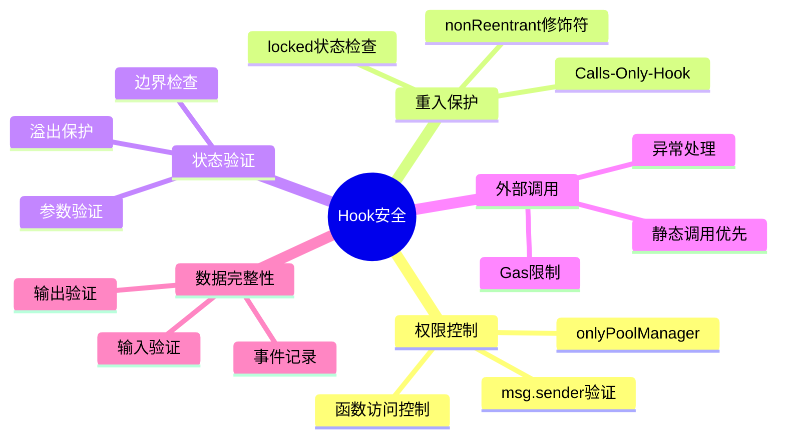
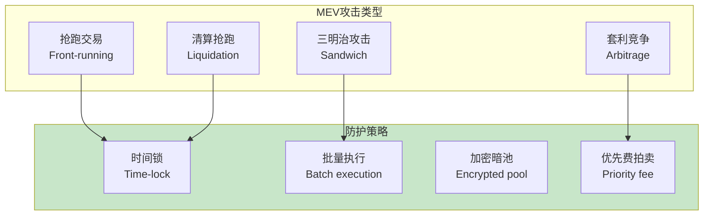
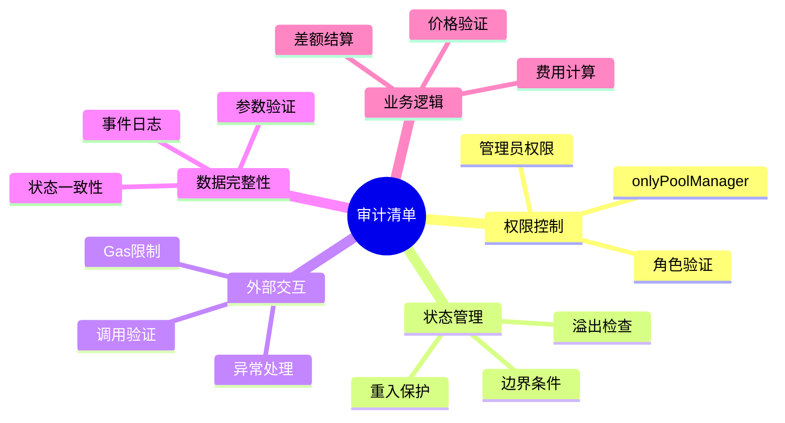
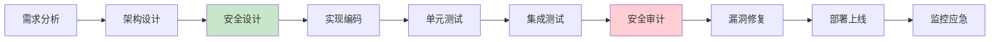
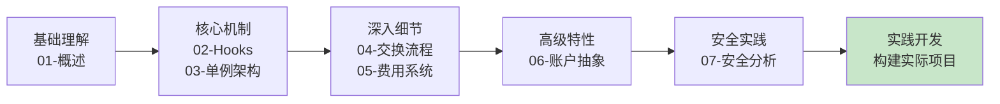

# 死磕Uniswap V4（七）：安全分析与最佳实践

> 本文是「死磕Uniswap V4」系列的最后一篇，全面分析V4的安全考虑和开发最佳实践。

## 系列导航

| 序号 | 标题 | 核心内容 |
|:----:|------|----------|
| 01 | V4概述与架构革命 | Singleton、Hooks、Flash Accounting |
| 02 | Hooks机制深度解析 | Hook接口、生命周期、实现模式 |
| 03 | 单例架构与瞬时会计 | PoolManager、Currency、Accounting |
| 04 | 交换流程与Hook执行时序 | swap函数、Hook调用链、Gas分析 |
| 05 | 费用系统与动态费率 | 自定义费率、动态调整、费用分配 |
| 06 | 账户抽象与原生ETH | Currency类型、settle/take、批量操作 |
| **07** | **安全分析与最佳实践** | **Hook安全、MEV防护、审计要点** |

---

## 1. Hook安全框架

### 1.1 Hook安全考虑



### 1.2 基础安全模板

```solidity
/// @notice 安全Hook基础合约
abstract contract SecureHook is IHooks {
    IPoolManager public immutable poolManager;

    /// @notice 锁定状态（防止重入）
    uint256 private locked = 1;

    /// @notice 修饰符：仅PoolManager可调用
    modifier onlyPoolManager() {
        require(msg.sender == address(poolManager), "Not PoolManager");
        _;
    }

    /// @notice 修饰符：防止重入
    modifier nonReentrant() {
        require(locked == 1, "Reentrant");
        locked = 2;
        _;
        locked = 1;
    }

    /// @notice 修饰符：仅在锁定状态下可调用
    modifier onlyLocked() {
        require(poolManager.locked() != 0, "Not locked");
        _;
    }

    constructor(IPoolManager _poolManager) {
        poolManager = _poolManager;
    }

    /// @notice 安全的事件记录
    event HookCalled(bytes4 indexed selector, address indexed caller);
    event HookFailed(bytes4 indexed selector, bytes reason);

    /// @notice 安全的Hook调用包装
    function _safeHookCall(
        bytes4 selector,
        bytes memory data,
        string memory errorMessage
    ) internal returns (bytes memory) {
        (bool success, bytes memory returnData) = address(this).delegatecall(data);

        if (!success) {
            emit HookFailed(selector, returnData);
            revert(string(abi.encodePacked(errorMessage, ": ", returnData)));
        }

        emit HookCalled(selector, msg.sender);
        return returnData;
    }
}
```

### 1.3 权限控制实现

```solidity
/// @notice 带权限控制的Hook
contract AccessControlledHook is SecureHook {
    /// @notice 角色定义
    bytes32 public constant ADMIN_ROLE = keccak256("ADMIN_ROLE");
    bytes32 public constant OPERATOR_ROLE = keccak256("OPERATOR_ROLE");

    /// @notice 角色映射
    mapping(bytes32 => mapping(address => bool)) public roles;

    /// @notice 管理员地址
    address public admin;

    /// @notice 修饰符：仅管理员
    modifier onlyAdmin() {
        require(msg.sender == admin, "Not admin");
        _;
    }

    /// @notice 修饰符：拥有指定角色
    modifier onlyRole(bytes32 role) {
        require(roles[role][msg.sender], "Missing role");
        _;
    }

    constructor(IPoolManager _poolManager) SecureHook(_poolManager) {
        admin = msg.sender;
        roles[ADMIN_ROLE][msg.sender] = true;
    }

    /// @notice 授予角色
    function grantRole(bytes32 role, address account) external onlyAdmin {
        roles[role][account] = true;
        emit RoleGranted(role, account, msg.sender);
    }

    /// @notice 撤销角色
    function revokeRole(bytes32 role, address account) external onlyAdmin {
        roles[role][account] = false;
        emit RoleRevoked(role, account, msg.sender);
    }

    /// @notice 转让管理员
    function transferAdmin(address newAdmin) external onlyAdmin {
        require(newAdmin != address(0), "Zero address");
        admin = newAdmin;
        emit AdminTransferred(admin, newAdmin);
    }

    event RoleGranted(bytes32 indexed role, address indexed account, address indexed sender);
    event RoleRevoked(bytes32 indexed role, address indexed account, address indexed sender);
    event AdminTransferred(address indexed oldAdmin, address indexed newAdmin);
}
```

---

## 2. 常见漏洞与防护

### 2.1 重入攻击防护

```solidity
/// @notice 重入攻击防护
contract ReentrancyGuard is IHooks {
    IPoolManager public immutable poolManager;

    /// @notice 重入锁状态
    uint256 private locked = 1;

    /// @notice 修饰符：防止重入
    modifier nonReentrant() {
        require(locked == 1, "Reentrant call");
        locked = 2;
        _;
        locked = 1;
    }

    /// @notice 安全的资金转移
    function _safeTransfer(
        address token,
        address to,
        uint256 amount
    ) private nonReentrant {
        if (token == address(0)) {
            // 原生ETH
            payable(to).transfer(amount);
        } else {
            // ERC20
            (bool success, bytes memory data) = token.call(
                abi.encodeWithSignature(
                    "transfer(address,uint256)",
                    to,
                    amount
                )
            );

            require(
                success && (data.length == 0 || abi.decode(data, (bool))),
                "Transfer failed"
            );
        }
    }

    function beforeSwap(
        address sender,
        PoolKey calldata key,
        IPoolManager.SwapParams calldata params,
        bytes calldata hookData
    ) external nonReentrant returns (bytes4, int256, int256) {
        // Hook逻辑
        return (IHooks.beforeSwap.selector, 0, 0);
    }
}
```

### 2.2 整数溢出防护

```solidity
/// @notice 整数溢出防护
pragma solidity ^0.8.0; // Solidity 0.8.x自动检查溢出

/// @notice 带溢出检查的数学库
library SafeMathLib {
    /// @notice 安全加法
    function add(uint256 a, uint256 b) internal pure returns (uint256) {
        uint256 c = a + b;
        require(c >= a, "Overflow");
        return c;
    }

    /// @notice 安全减法
    function sub(uint256 a, uint256 b) internal pure returns (uint256) {
        require(a >= b, "Underflow");
        return a - b;
    }

    /// @notice 安全乘法
    function mul(uint256 a, uint256 b) internal pure returns (uint256) {
        if (a == 0) return 0;
        uint256 c = a * b;
        require(c / a == b, "Overflow");
        return c;
    }

    /// @notice 安全除法
    function div(uint256 a, uint256 b) internal pure returns (uint256) {
        require(b > 0, "Division by zero");
        return a / b;
    }
}

/// @notice 使用SafeMath的Hook
contract OverflowProtectedHook is IHooks {
    using SafeMathLib for uint256;

    IPoolManager public immutable poolManager;

    /// @notice 累积值（防止溢出）
    uint256 public cumulativeValue;

    function beforeSwap(
        address sender,
        PoolKey calldata key,
        IPoolManager.SwapParams calldata params,
        bytes calldata hookData
    ) external returns (bytes4, int256, int256) {
        // 安全的累加
        uint256 amount = uint256(abs(params.amountSpecified));
        cumulativeValue = cumulativeValue.add(amount);

        // 检查上限
        require(cumulativeValue <= type(uint256).max / 2, "Cumulative value too high");

        return (IHooks.beforeSwap.selector, 0, 0);
    }

    function abs(int256 x) private pure returns (uint256) {
        return x >= 0 ? uint256(x) : uint256(-x);
    }
}
```

### 2.3 前端运行防护

```solidity
/// @notice 前端运行防护
contract FrontendRunProtection is IHooks {
    IPoolManager public immutable poolManager;

    /// @notice 最小延迟
    uint256 public constant MIN_DELAY = 1 seconds;

    /// @notice 待处理交易
    mapping(bytes32 => PendingTx) public pendingTxs;

    struct PendingTx {
        address sender;
        uint256 amount;
        uint256 timestamp;
        bool executed;
    }

    /// @notice 提交交易意向
    function commitSwap(
        PoolKey calldata key,
        IPoolManager.SwapParams calldata params
    ) external returns (bytes32) {
        bytes32 txHash = keccak256(abi.encode(
            msg.sender,
            key,
            params,
            block.number
        ));

        pendingTxs[txHash] = PendingTx({
            sender: msg.sender,
            amount: uint256(abs(params.amountSpecified)),
            timestamp: block.timestamp,
            executed: false
        });

        emit SwapCommitted(msg.sender, txHash, params);
        return txHash;
    }

    /// @notice 执行已提交的交易
    function executeSwap(
        bytes32 txId,
        PoolKey calldata key,
        IPoolManager.SwapParams calldata params
    ) external returns (BalanceDelta) {
        PendingTx storage pending = pendingTxs[txId];

        // 验证
        require(pending.sender == msg.sender, "Not committer");
        require(!pending.executed, "Already executed");
        require(
            block.timestamp >= pending.timestamp + MIN_DELAY,
            "Too early"
        );

        // 标记为已执行
        pending.executed = true;

        // 执行交换
        BalanceDelta memory delta = poolManager.swap(key, params, BalanceDelta(0, 0));

        emit SwapExecuted(msg.sender, txId, delta);
        return delta;
    }

    function abs(int256 x) private pure returns (uint256) {
        return x >= 0 ? uint256(x) : uint256(-x);
    }

    event SwapCommitted(address indexed sender, bytes32 txId, IPoolManager.SwapParams params);
    event SwapExecuted(address indexed sender, bytes32 txId, BalanceDelta delta);
}
```

### 2.4 三明治攻击防护

```solidity
/// @notice 三明治攻击防护
contract SandwichProtection is IHooks {
    IPoolManager public immutable poolManager;

    /// @notice 价格影响阈值
    uint256 public priceImpactThreshold = 100; // 1%

    /// @notice 交易时间窗口
    uint256 public timeWindow = 3 seconds;

    /// @notice 用户交易映射
    mapping(address => UserTx) public userTxs;

    struct UserTx {
        uint256 timestamp;
        uint256 amount;
        bool inMempool;
    }

    function beforeSwap(
        address sender,
        PoolKey calldata key,
        IPoolManager.SwapParams calldata params,
        bytes calldata hookData
    ) external returns (bytes4, int256, int256) {
        bytes32 poolId = key.poolId;
        uint256 amount = uint256(abs(params.amountSpecified));

        // 检查三明治攻击模式
        if (_detectSandwich(sender, poolId, amount)) {
            revert("Suspected sandwich attack");
        }

        // 记录用户交易
        userTxs[sender] = UserTx({
            timestamp: block.timestamp,
            amount: amount,
            inMempool: true
        });

        // 检查价格影响
        uint256 priceImpact = _calculatePriceImpact(key, params);
        if (priceImpact > priceImpactThreshold) {
            revert("Price impact too high");
        }

        return (IHooks.beforeSwap.selector, 0, 0);
    }

    function _detectSandwich(
        address sender,
        bytes32 poolId,
        uint256 amount
    ) private view returns (bool) {
        // 检查时间窗口内的大额交易
        if (block.timestamp < userTxs[sender].timestamp + timeWindow) {
            // 如果在时间窗口内再次交易，且金额更大，可能是三明治
            if (amount > userTxs[sender].amount * 2) {
                return true;
            }
        }
        return false;
    }

    function _calculatePriceImpact(
        PoolKey calldata key,
        IPoolManager.SwapParams calldata params
    ) private view returns (uint256) {
        (uint160 sqrtPriceX96, , , ) = poolManager.slot0s(key.poolId);

        // 简化的价格影响计算
        uint256 priceImpact = uint256(abs(params.amountSpecified)) * 1e18 / uint256(sqrtPriceX96);

        return priceImpact / 1e14; // 转换为百分比
    }

    function abs(int256 x) private pure returns (uint256) {
        return x >= 0 ? uint256(x) : uint256(-x);
    }

    // 暴露的setter用于测试
    function setPriceImpactThreshold(uint256 threshold) external {
        priceImpactThreshold = threshold;
    }
}
```

---

## 3. MEV防护策略

### 3.1 MEV类型分析



### 3.2 时间锁实现

```solidity
/// @notice 带时间锁的Hook
contract TimelockHook is IHooks {
    IPoolManager public immutable poolManager;

    /// @notice 时间锁配置
    struct TimelockConfig {
        uint256 delay;      // 延迟时间
        uint256 gracePeriod; // 宽限期
    }

    mapping(bytes32 => TimelockConfig) public timelockConfigs;

    /// @notice 待处理操作
    struct PendingOperation {
        address sender;
        bytes32 dataHash;
        uint256 readyTime;
        uint256 deadline;
        bool executed;
        bool cancelled;
    }

    mapping(bytes32 => PendingOperation) public pendingOps;

    /// @notice 提交操作
    function submitOperation(
        bytes32 poolId,
        bytes calldata data
    ) external returns (bytes32) {
        TimelockConfig memory config = timelockConfigs[poolId];
        require(config.delay > 0, "No timelock configured");

        bytes32 opId = keccak256(abi.encode(
            msg.sender,
            poolId,
            data,
            block.number
        ));

        uint256 readyTime = block.timestamp + config.delay;
        uint256 deadline = readyTime + config.gracePeriod;

        pendingOps[opId] = PendingOperation({
            sender: msg.sender,
            dataHash: keccak256(data),
            readyTime: readyTime,
            deadline: deadline,
            executed: false,
            cancelled: false
        });

        emit OperationSubmitted(msg.sender, opId, readyTime, deadline);
        return opId;
    }

    /// @notice 执行操作
    function executeOperation(
        bytes32 opId,
        bytes32 poolId,
        bytes calldata data
    ) external {
        PendingOp storage op = pendingOps[opId];

        require(op.sender == msg.sender, "Not submitter");
        require(!op.executed && !op.cancelled, "Invalid state");
        require(block.timestamp >= op.readyTime, "Too early");
        require(block.timestamp <= op.deadline, "Expired");
        require(keccak256(data) == op.dataHash, "Data mismatch");

        op.executed = true;

        // 执行操作
        _executeData(poolId, data);

        emit OperationExecuted(msg.sender, opId);
    }

    /// @notice 取消操作
    function cancelOperation(bytes32 opId) external {
        PendingOp storage op = pendingOps[opId];

        require(op.sender == msg.sender, "Not submitter");
        require(!op.executed && !op.cancelled, "Invalid state");
        require(block.timestamp < op.readyTime, "Already ready");

        op.cancelled = true;

        emit OperationCancelled(msg.sender, opId);
    }

    function _executeData(bytes32 poolId, bytes calldata data) private {
        // 实现数据执行逻辑
    }

    event OperationSubmitted(address indexed sender, bytes32 opId, uint256 readyTime, uint256 deadline);
    event OperationExecuted(address indexed sender, bytes32 opId);
    event OperationCancelled(address indexed sender, bytes32 opId);
}
```

### 3.3 批量执行保护

```solidity
/// @notice 批量执行保护Hook
contract BatchExecutionProtection is IHooks {
    IPoolManager public immutable poolManager;

    /// @notice 批量配置
    struct BatchConfig {
        uint256 maxSize;       // 最大批量大小
        uint256 maxDelay;       // 最大延迟
        uint256 minSize;        // 最小批量大小
        bool enabled;           // 是否启用
    }

    mapping(bytes32 => BatchConfig) public batchConfigs;

    /// @notice 批量交易
    struct Batch {
        address[] participants;
        IPoolManager.SwapParams[] params;
        uint256 startTime;
        uint256 currentSize;
    }

    mapping(bytes32 => Batch) public batches;

    /// @notice 创建批量
    function createBatch(
        bytes32 poolId,
        uint256 maxSize
    ) external returns (bytes32) {
        batchConfigs[poolId].enabled = true;
        batchConfigs[poolId].maxSize = maxSize;

        bytes32 batchId = keccak256(abi.encode(poolId, block.timestamp));

        batches[batchId] = Batch({
            participants: new address[](maxSize),
            params: new IPoolManager.SwapParams[](maxSize),
            startTime: block.timestamp,
            currentSize: 0
        });

        emit BatchCreated(poolId, batchId, maxSize);
        return batchId;
    }

    /// @notice 加入批量
    function joinBatch(
        bytes32 batchId,
        IPoolManager.SwapParams calldata params
    ) external {
        Batch storage batch = batches[batchId];

        require(batch.currentSize < batch.participants.length, "Batch full");
        require(
            block.timestamp < batch.startTime + batchConfigs[batchId].maxDelay,
            "Batch expired"
        );

        batch.participants[batch.currentSize] = msg.sender;
        batch.params[batch.currentSize] = params;
        batch.currentSize++;

        emit JoinedBatch(msg.sender, batchId, batch.currentSize);
    }

    /// @notice 执行批量
    function executeBatch(bytes32 batchId, PoolKey calldata key) external {
        Batch storage batch = batches[batchId];

        require(batch.currentSize >= batchConfigs[batchId].minSize, "Batch too small");
        require(
            block.timestamp >= batch.startTime + 1 minutes,
            "Too early to execute"
        );

        // 随机化执行顺序
        uint256[] memory order = _shuffleArray(batch.currentSize);

        for (uint256 i = 0; i < order.length; i++) {
            uint256 idx = order[i];
            address participant = batch.participants[idx];

            // 执行交换
            poolManager.swap(key, batch.params[idx], BalanceDelta(0, 0));

            emit BatchSwapExecuted(participant, batchId, idx);
        }

        delete batches[batchId];
        emit BatchExecuted(batchId);
    }

    function _shuffleArray(uint256 size) private view returns (uint256[] memory) {
        uint256[] memory order = new uint256[](size);
        for (uint256 i = 0; i < size; i++) {
            order[i] = i;
        }

        // Fisher-Yates shuffle
        for (uint256 i = size - 1; i > 0; i--) {
            uint256 j = uint256(keccak256(abi.encode(
                block.prevrandao,
                batchId,
                i
            ))) % (i + 1);

            (order[i], order[j]) = (order[j], order[i]);
        }

        return order;
    }

    event BatchCreated(bytes32 indexed poolId, bytes32 batchId, uint256 maxSize);
    event JoinedBatch(address indexed participant, bytes32 batchId, uint256 position);
    event BatchExecuted(bytes32 batchId);
    event BatchSwapExecuted(address indexed participant, bytes32 batchId, uint256 index);
}
```

---

## 4. 开发最佳实践

### 4.1 Hook开发检查清单

```solidity
/// @notice Hook开发检查清单
contract HookChecklist {
    // ========== 安全检查 ==========

    // ✅ 1. 权限控制
    // - [ ] 添加 onlyPoolManager 修饰符
    // - [ ] 验证 msg.sender
    // - [ ] 实现角色访问控制

    // ✅ 2. 重入保护
    // - [ ] 添加 nonReentrant 修饰符
    // - [ ] 使用 Checks-Effects-Interactions 模式
    // - [ ] 避免在 Hook 中调用外部合约

    // ✅ 3. 状态验证
    // - [ ] 验证所有输入参数
    // - [ ] 检查边界条件
    // - [ ] 防止整数溢出

    // ========== Gas优化 ==========

    // ✅ 4. 存储优化
    // - [ ] 使用 immutable 变量
    // - [ ] 打包存储变量
    // - [ ] 缓存存储读取

    // ✅ 5. 计算优化
    // - [ ] 预计算常量值
    // - [ ] 使用短路求值
    // - [ ] 批量操作

    // ========== 可维护性 ==========

    // ✅ 6. 事件记录
    // - [ ] 记录所有重要操作
    // - [ ] 使用 indexed 参数
    // - [ ] 添加详细说明

    // ✅ 7. 错误处理
    // - [ ] 定义清晰的错误码
    // - [ ] 提供有用的错误信息
    // - [ ] 处理异常情况

    // ✅ 8. 测试覆盖
    // - [ ] 单元测试
    // - [ ] 集成测试
    // - [ ] 边界条件测试
}
```

### 4.2 Hook模板

```solidity
/// @notice 标准Hook模板
/// @dev 包含所有安全最佳实践的Hook基类
abstract contract StandardHook is IHooks {
    /// @notice immutable 变量
    IPoolManager public immutable poolManager;

    /// @notice 错误码
    error NotPoolManager();
    error InvalidParameters();
    error HookFailed();

    /// @notice 事件
    event HookExecuted(bytes4 indexed selector, address indexed caller);

    /// @notice 修饰符
    modifier onlyPoolManager() {
        if (msg.sender != address(poolManager)) revert NotPoolManager();
        _;
    }

    /// @notice 构造函数
    constructor(IPoolManager _poolManager) {
        poolManager = _poolManager;
    }

    /// @notice 默认Hook实现（可覆盖）
    function beforeInitialize(
        address sender,
        PoolKey calldata key,
        uint160 sqrtPriceX96,
        bytes calldata hookData
    ) external onlyPoolManager virtual returns (bytes4) {
        emit HookExecuted(IHooks.beforeInitialize.selector, sender);
        return IHooks.beforeInitialize.selector;
    }

    function afterInitialize(
        address sender,
        PoolKey calldata key,
        uint160 sqrtPriceX96,
        bytes calldata hookData
    ) external onlyPoolManager virtual returns (bytes4) {
        emit HookExecuted(IHooks.afterInitialize.selector, sender);
        return IHooks.afterInitialize.selector;
    }

    function beforeModifyPosition(
        address sender,
        PoolKey calldata key,
        IPoolManager.ModifyPositionParams calldata params,
        bytes calldata hookData
    ) external onlyPoolManager virtual returns (bytes4, int256 delta0, int256 delta1) {
        emit HookExecuted(IHooks.beforeModifyPosition.selector, sender);
        return (IHooks.beforeModifyPosition.selector, 0, 0);
    }

    function afterModifyPosition(
        address sender,
        PoolKey calldata key,
        IPoolManager.ModifyPositionParams calldata params,
        BalanceDelta callerDelta,
        bytes calldata hookData
    ) external onlyPoolManager virtual returns (bytes4) {
        emit HookExecuted(IHooks.afterModifyPosition.selector, sender);
        return IHooks.afterModifyPosition.selector;
    }

    function beforeSwap(
        address sender,
        PoolKey calldata key,
        IPoolManager.SwapParams calldata params,
        bytes calldata hookData
    ) external onlyPoolManager virtual returns (bytes4, int256 delta0, int256 delta1) {
        emit HookExecuted(IHooks.beforeSwap.selector, sender);
        return (IHooks.beforeSwap.selector, 0, 0);
    }

    function afterSwap(
        address sender,
        PoolKey calldata key,
        IPoolManager.SwapParams calldata params,
        BalanceDelta callerDelta,
        bytes calldata hookData
    ) external onlyPoolManager virtual returns (bytes4) {
        emit HookExecuted(IHooks.afterSwap.selector, sender);
        return IHooks.afterSwap.selector;
    }

    function beforeDonate(
        address sender,
        PoolKey calldata key,
        uint256 amount0,
        uint256 amount1,
        bytes calldata hookData
    ) external onlyPoolManager virtual returns (bytes4) {
        emit HookExecuted(IHooks.beforeDonate.selector, sender);
        return IHooks.beforeDonate.selector;
    }

    function afterDonate(
        address sender,
        PoolKey calldata key,
        uint256 amount0,
        uint256 amount1,
        bytes calldata hookData
    ) external onlyPoolManager virtual returns (bytes4) {
        emit HookExecuted(IHooks.afterDonate.selector, sender);
        return IHooks.afterDonate.selector;
    }
}
```

### 4.3 测试模板

```solidity
/// @notice Hook测试模板
contract HookTest is Test {
    Hook target;
    PoolManager poolManager;
    PoolKey poolKey;

    address user = address(0x1);
    address admin = address(0x2);

    function setUp() public {
        // 部署依赖合约
        poolManager = new PoolManager();

        // 部署Hook
        target = new Hook(poolManager);

        // 设置测试池子
        poolKey = PoolKey({
            currency0: CurrencyLibrary.NATIVE,
            currency1: Currency.wrap(address(usdc)),
            fee: 3000,
            tickSpacing: 60,
            hooks: target
        });

        // 初始化池子
        poolManager.initialize(poolKey, uint160(79228162514264337593543950336));
    }

    function testBeforeSwap_ReturnsCorrectSelector() public {
        (bytes4 selector,,) = target.beforeSwap(
            user,
            poolKey,
            SwapParams({
                zeroForOne: true,
                amountSpecified: 1e18,
                sqrtPriceLimitX96: TickMath.MIN_SQRT_RATIO + 1,
                hookData: ""
            }),
            ""
        );

        assertEq(selector, IHooks.beforeSwap.selector);
    }

    function testBeforeSwap_RevertsWithInvalidParams() public {
        vm.expectRevert();
        target.beforeSwap(
            address(0), // 无效地址
            poolKey,
            SwapParams({
                zeroForOne: true,
                amountSpecified: -1, // 无效数量
                sqrtPriceLimitX96: 0,
                hookData: ""
            }),
            ""
        );
    }

    function testFuzz_BeforeSwap(int256 amount) public {
        vm.assume(amount > 0);
        vm.assume(amount < 1e30);

        (bytes4 selector,,) = target.beforeSwap(
            user,
            poolKey,
            SwapParams({
                zeroForOne: true,
                amountSpecified: amount,
                sqrtPriceLimitX96: TickMath.MIN_SQRT_RATIO + 1,
                hookData: ""
            }),
            ""
        );

        assertEq(selector, IHooks.beforeSwap.selector);
    }

    function testAccessControl() public {
        // 验证只有PoolManager可以调用
        vm.prank(user);
        vm.expectRevert(StandardHook.NotPoolManager.selector);
        target.beforeSwap(
            user,
            poolKey,
            SwapParams({
                zeroForOne: true,
                amountSpecified: 1e18,
                sqrtPriceLimitX96: TickMath.MIN_SQRT_RATIO + 1,
                hookData: ""
            }),
            ""
        );
    }
}
```

---

## 5. 审计要点

### 5.1 审计检查清单



### 5.2 关键审计点

| 审计点 | 检查内容 | 风险等级 |
|--------|----------|----------|
| **权限控制** | Hook调用者验证 | 🔴 高 |
| **重入保护** | nonReentrant正确使用 | 🔴 高 |
| **状态一致性** | Hook失败后的状态 | 🔴 高 |
| **整数溢出** | 数学运算边界 | 🟡 中 |
| **外部调用** | 恶意合约风险 | 🟡 中 |
| **Gas限制** | DoS攻击防护 | 🟡 中 |
| **事件日志** | 操作可追溯性 | 🟢 低 |
| **测试覆盖** | 代码测试完整性 | 🟢 低 |

### 5.3 常见漏洞模式

```solidity
/// @notice 常见漏洞示例和修复

// ========================================
// 漏洞1: 缺少权限控制
// ========================================

// ❌ 错误：任何人都可以调用
function beforeSwap(...) external returns (bytes4, int256, int256) {
    // 任何人都可以调用这个Hook
    return (IHooks.beforeSwap.selector, 0, 0);
}

// ✅ 正确：添加权限控制
function beforeSwap(...) external onlyPoolManager returns (bytes4, int256, int256) {
    // 只有PoolManager可以调用
    return (IHooks.beforeSwap.selector, 0, 0);
}

// ========================================
// 漏洞2: 重入漏洞
// ========================================

// ❌ 错误：没有重入保护
function beforeSwap(...) external returns (bytes4, int256, int256) {
    // 调用外部合约
    externalContract.call();
    return (IHooks.beforeSwap.selector, 0, 0);
}

// ✅ 正确：添加重入保护
function beforeSwap(...) external nonReentrant returns (bytes4, int256, int256) {
    // 先更新状态
    _updateState();

    // 最后调用外部合约
    externalContract.call();

    return (IHooks.beforeSwap.selector, 0, 0);
}

// ========================================
// 漏洞3: 未验证返回值
// ========================================

// ❌ 错误：未验证Hook返回值
function callHook(...) external {
    IHooks(hookAddress).beforeSwap(...); // 未检查返回值
}

// ✅ 正确：验证返回值
function callHook(...) external {
    (bool success, bytes memory data) = hookAddress.staticcall(...);
    if (!success) {
        // 处理失败
        revert("Hook call failed");
    }

    bytes4 selector = abi.decode(data, (bytes4));
    require(selector == IHooks.beforeSwap.selector, "Invalid selector");
}

// ========================================
// 漏洞4: 整数溢出
// ========================================

// ❌ 错误：可能的溢出
function calculateFee(uint256 amount, uint256 feeRate) public pure returns (uint256) {
    return amount * feeRate / 1e6; // 可能溢出
}

// ✅ 正确：安全的数学运算
function calculateFee(uint256 amount, uint256 feeRate) public pure returns (uint256) {
    require(amount <= type(uint256).max / feeRate, "Overflow");
    return amount * feeRate / 1e6;
}
```

---

## 6. 安全工具和资源

### 6.1 静态分析工具

| 工具 | 功能 | 链接 |
|------|------|------|
| **Slither** | 静态分析，漏洞检测 | https://github.com/crytic/slither |
| **Mythril** | 符号执行 | https://github.com/ConsenSys/mythril |
| **Echidna** | 模糊测试 | https://github.com/crytic/echidna |
| **Foundry** | 测试框架 | https://github.com/foundry-rs/foundry |

### 6.2 使用Slither审计Hook

```bash
# 安装Slither
pip install slither-analyzer

# 运行Slither
slither . --detect reentrancy-eth,reentrancy-unlimited-gas

# 生成报告
slither . --json output.json

# 常用检测器
slither . --detect all
```

### 6.3 使用Foundry测试

```solidity
// SPDX-License-Identifier: MIT
pragma solidity ^0.8.20;

import "forge-std/Test.sol";
import "../src/MyHook.sol";

contract MyHookTest is Test {
    MyHook target;
    PoolManager poolManager;

    function setUp() public {
        poolManager = new PoolManager();
        target = new MyHook(poolManager);
    }

    function test_Reentrancy() public {
        // 测试重入攻击
        vm.expectRevert();
        // ...测试逻辑
    }

    function test_IntegerOverflow() public {
        // 测试整数溢出
        // ...测试逻辑
    }

    function test_FrontRunning() public {
        // 测试前端运行攻击
        // ...测试逻辑
    }

    function invariant_StateConsistency() public {
        // 状态一致性检查
        // ...测试逻辑
    }
}
```

---

## 7. 安全建议总结

### 7.1 开发流程建议



### 7.2 安全建议清单

**开发阶段：**
- ✅ 使用安全的Hook模板
- ✅ 添加完整的访问控制
- ✅ 实现重入保护
- ✅ 记录详细的事件日志
- ✅ 编写全面的测试

**审计阶段：**
- ✅ 使用静态分析工具
- ✅ 进行模糊测试
- ✅ 邀请专业审计
- ✅ 进行形式化验证
- ✅ 测试边界条件

**部署阶段：**
- ✅ 多签控制升级权限
- ✅ 设置时间锁
- ✅ 准备应急方案
- ✅ 配置监控告警
- ✅ 准备漏洞响应计划

---

## 8. 系列总结

### 8.1 V4核心创新回顾

| 创新 | 描述 | 优势 |
|------|------|------|
| **Hooks** | 生命周期可编程 | 无限扩展性 |
| **Singleton** | 单例架构 | 部署成本↓95% |
| **Flash Accounting** | 瞬时会计 | Gas优化30-40% |
| **Native ETH** | 原生支持 | Gas节省47% |
| **动态费用** | 自定义费率 | 精细化定价 |

### 8.2 学习路径



### 8.3 继续学习资源

**官方资源：**
- [Uniswap V4 白皮书](https://uniswap.org/whitepaper-v4.pdf)
- [Uniswap V4 Core 源码](https://github.com/Uniswap/v4-core)
- [Uniswap V4 Periphery](https://github.com/Uniswap/v4-periphery)

**社区资源：**
- [Uniswap Discord](https://discord.gg/uniswap)
- [Uniswap 论坛](https://gov.uniswap.org)
- [V4 Hooks 示例](https://github.com/Uniswap/v4-periphery/tree/main/src/hooks)

**开发工具：**
- [Foundry Book](https://book.getfoundry.sh/)
- [Slither 文档](https://github.com/crytic/slither)
- [OpenZeppelin 合约](https://docs.openzeppelin.com/)

---

## 感谢阅读

感谢您阅读「死磕Uniswap V4」系列文章。希望这些内容能帮助您深入理解Uniswap V4的技术架构，并在实际开发中应用这些知识。

如果您有任何问题或建议，欢迎通过以下方式联系：
- 提交 Issue
- 发送 Pull Request
- 参与 Discord 讨论

祝您在DeFi开发之旅中一切顺利！

---

## 参考资料

- [Uniswap V4 Core - PoolManager.sol](https://github.com/Uniswap/v4-core/blob/main/src/PoolManager.sol)
- [Uniswap V4 Core - IHooks.sol](https://github.com/Uniswap/v4-core/blob/main/src/interfaces/IHooks.sol)
- [Smart Contract Security Best Practices](https://consensys.github.io/smart-contract-best-practices/)
- [SWC Registry](https://swcregistry.io/)
- [Ethereum Smart Contract Best Practices](https://forum.openzeppelin.com/t/ethereum-smart-contract-best-practices/2334)
