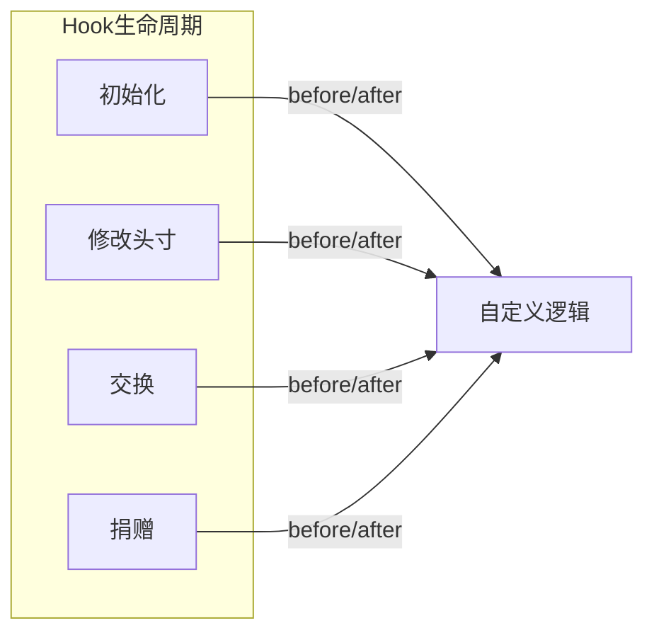
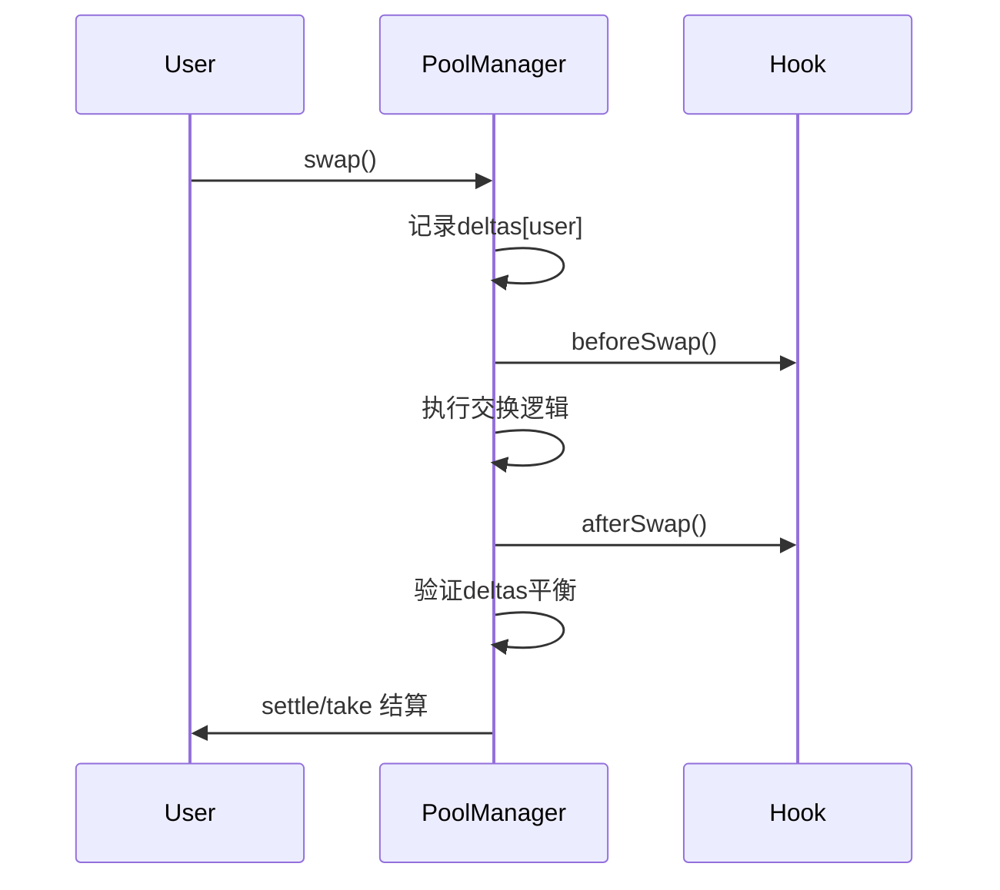

# 死磕Uniswap V4

> 深入解析Uniswap V4的核心技术与架构创新

## 系列概述

本系列文章深入剖析Uniswap V4的技术架构，从核心设计理念到实现细节，全面解析V4相比V3的革命性改进。

## 系列导航

| 序号 | 标题 | 核心内容 | 状态 |
|:----:|------|----------|:----:|
| **01** | **V4概述与架构革命** | Singleton、Hooks、Flash Accounting | 📝 |
| **02** | **Hooks机制深度解析** | Hook接口、生命周期、实现模式 | 📝 |
| **03** | **单例架构与瞬时会计** | PoolManager、Currency、Accounting | 📝 |
| **04** | **交换流程与Hook执行时序** | swap函数、Hook调用链、Gas分析 | 📝 |
| **05** | **费用系统与动态费率** | 自定义费率、动态调整、费用分配 | 📝 |
| **06** | **账户抽象与原生ETH** | Currency类型、settle/take、批量操作 | 📝 |
| **07** | **安全分析与最佳实践** | Hook安全、MEV防护、审计要点 | 📝 |

## V4 vs V3 核心差异

| 特性 | Uniswap V3 | Uniswap V4 |
|------|-----------|-----------|
| **架构** | 每池一合约 | 单例Singleton |
| **扩展性** | 固定功能 | Hooks可编程 |
| **费率** | 固定等级 | 任意动态费率 |
| **转账** | 即时转账 | 瞬时会计 |
| **ETH** | 需要WETH | 原生支持 |
| **创建成本** | 高 (~$500+) | 低 (~$10) |
| **Gas效率** | 基准 | 降低约30-40% |

## 核心创新点

### 1. Hooks（钩子机制）

Hooks是V4的核心创新，允许开发者在池子生命周期的关键点插入自定义逻辑：



**可用Hook函数：**
- `beforeInitialize` / `afterInitialize`
- `beforeModifyPosition` / `afterModifyPosition`
- `beforeSwap` / `afterSwap`
- `beforeDonate` / `afterDonate`

### 2. Singleton（单例架构）

所有池子合并到一个合约中，大幅降低部署和交互成本：

```solidity
contract PoolManager {
    // 所有池子的状态
    mapping(bytes32 poolId => Pool.State) pools;
    mapping(bytes32 poolId => Pool.Slot0) slot0s;
    // ...
}
```

### 3. Flash Accounting（瞬时会计）

延迟转账机制，在交易结束时统一结算差额：



### 4. Native ETH

直接支持ETH，无需WETH包装：

```solidity
type Currency is address;

address(0)    = Native ETH
address(token) = ERC20 Token
```

### 5. 动态费用

通过Hooks实现任意费率模型：

```solidity
// 动态费率Hook示例
function beforeSwap(...) external returns (bytes4, int256, int256) {
    uint256 volatility = calculateVolatility();
    uint16 dynamicFee = baseFee + volatility * multiplier;
    pools[poolId].hookFee = dynamicFee - baseFee;
    return (IHooks.beforeSwap.selector, 0, 0);
}
```

## 学习路径

建议按顺序阅读本系列文章：

1. **入门**: 先阅读「01-V4概述与架构革命」，了解整体架构
2. **核心**: 深入「02-Hooks机制」和「03-单例架构与瞬时会计」
3. **进阶**: 学习「04-交换流程」和「05-费用系统」
4. **实践**: 掌握「06-账户抽象」和「07-安全最佳实践」

## 技术栈

- **Solidity**: ^0.8.20
- **Foundry**: 测试框架
- **OpenZeppelin**: 标准库
- **Vyper**: Hook可选语言

## 参考资料

- [Uniswap V4 Whitepaper](https://uniswap.org/whitepaper-v4.pdf)
- [Uniswap V4 Core Code](https://github.com/Uniswap/v4-core)
- [Uniswap V4 Hooks Doc](https://github.com/Uniswap/v4-periphery)

## 贡献

欢迎提交Issue和Pull Request来完善本系列文档。

## 许可证

MIT License
