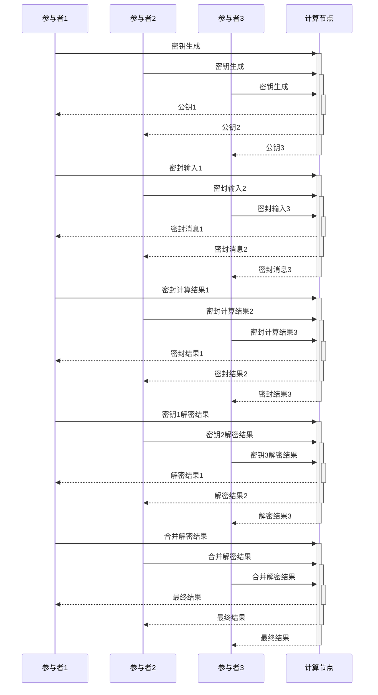

在这个流程图中，包括三个参与者和一个计算节点。其中，参与者1、2、3生成各自的公私钥对，并将公钥发送给计算节点。随后，参与者1、2、3将自己的输入进行密封，并发送给计算节点。计算节点对密封的输入进行计算，并将计算结果进行密封后发送给参与者1、2、3。参与者1、2、3对密封的计算结果进行解密，并将解密结果发送给计算节点。最后，计算节点将三个解密结果合并后输出最终结果。

## 应用

基于密封的安全多方计算协议在隐私保护和安全计算领域有很广泛的应用，以下是一些例子：

1. 选举投票：类似于我们之前实现的加密选举例子，可以使用基于密封的安全多方计算协议来保护选民的隐私，确保选举结果的准确性和公正性。
2. 数据隐私保护：在云计算和大数据分析中，数据隐私保护是一个很重要的问题。基于密封的安全多方计算协议可以让多个参与者在不泄露私密数据的前提下对数据进行计算、分析和共享。
3. 医疗数据共享：医疗数据隐私保护也是一个很重要的问题。基于密封的安全多方计算协议可以让多个医疗机构在不泄露病人隐私的前提下对医疗数据进行计算、分析和共享。
4. 联合学习：联合学习是一种在分布式设备上进行机器学习的方法，它可以用于保护参与者的隐私。基于密封的安全多方计算协议可以用于保护联合学习中的数据隐私和模型隐私。
5. 区块链隐私保护：区块链技术可以保证交易记录的公开和透明，但是交易参与者的隐私往往无法得到保护。基于密封的安全多方计算协议可以用于在区块链上进行隐私保护和安全计算。