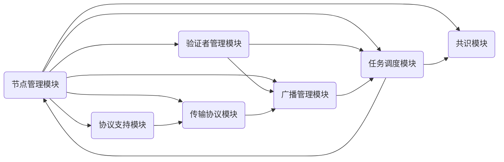

## 节点角色

- 验证节点
- 普通节点

✅

## 网络拓扑

为了让共识消息能够非常迅速的流转，同时保证共识网络的稳定，设计如下：

1. 最多连接50个节点✅
2. validator最多连接30个✅
3. 假如validator不足30个，也可以连接普通节点，同时，假如连接已经50个了，新增的节点如果是validator,同时validator节点不足30个，就替换普通节点✅
4. validator节点要在同一个子网里，普通节点在主网里，但也能保证普通节点可以跟验证者节点连接（这个至少需要两个DHT实例） ❎ 
5. 支持节点启动指定bootstrap ❎

### 节点发现机制

1. 支持客户端模式：少资源受限设备开销

## 连接管理策略

- 使用基于角色的连接策略，让验证者节点之间的连接拥有最高的优先级✅
- 验证节点之间最大连接数30，总连接数为50，当验证节点之间连接不足30，总连接数为50时候，如果连接的是验证节点，则替换普通节点  ✅
- 自定义刷新路由表间隔 go-libp2p默认5分钟  ❎
  - 保持路由表中的节点信息是最新的。在一个动态的P2P网络中，节点可能会不断加入和离开。定期刷新路由表可以确保路由表中的节点信息是最新的。
  - 维持与活跃节点的连接。通过定期刷新路由表，节点可以确保它与活跃节点保持连接，提高网络的稳定性。
  - 提高路由效率。路由表中的过时节点可能会导致路由效率降低，因为查找请求可能需要经过更多的跳数才能到达目标节点。定期刷新路由表有助于消除这些过时节点，从而提高路由效率。

## dcutr协议支持

## noise协议支持

✅

## TLS协议支持

✅

## Nat穿透支持

- 自动NAT✅
- 穿透中继(circuit relay)  ❎

## 传输协议支持

- tcp
- udp
- quic

多种协议的监听地址支持 ✅

## 消息广播策略

### 消息类型

1. 共识消息
   - preprepare消息
   - prepare消息
   - commit消息
2. 同步消息
   - 同步区块体
   - 同步区块头
3. 广播消息
   - 广播区块消息
   - 广播区块头消息
   - 广播交易消息

### 消息广播策略

对于共识消息，采用**gossipsub**来处理，以确保大量验证节点可以及时的收到消息

对于同步消息，采用**多路复用流**来传输，以保证可靠性

对于矿工和交易池的广播消息也是通过gossipsub来处理

### 消息转发策略

- 首先由p2p模块接收到消息，再根据消息类型转发到不同模块（比如共识模块和同步模块和矿工模块）去处理，根据处理结果判断是否断开连接
- 对于这几种消息，需要设置消息优先级，需要考虑是否设置了优先级，则不会执行低优先级的消息
- 为减少网络负载，需要设置消息转发最大次数，此最大次数如何设置是个问题
- 设置消息缓存，当自己已经转发过一条已知消息时，将不再转发
- 使用流量控制策略，如令牌桶算法，确保节点间数据传输的稳定性
- 设计重传机制，保证消息的传输

## 消息发送策略

1. p2p层面会定义一个handler接口，用来处理消息，其他的模块应该实现这个接口
2. p2p层面会定义消息对应的处理器，每个处理器会调用属于自己模块的消息处理逻辑
3. p2p层面需要封装一个统一的消息结构，从而根据消息类型来解码对应的消息

## 设计模式

1. 单例模式创建Host  ✅
1. 通过观察者模式来让各个模块处理自己关心的消息 

--------------

```markdown
# P2P 网络代码架构设计

## 1. 节点模块 (Node Module)
- 使用工厂模式创建节点
- 使用策略模式处理验证节点和普通节点的不同行为

## 2. 网络拓扑模块 (Network Topology Module)
- 使用观察者模式让验证者子网和主网相互通知状态变化
- 使用组合模式构建网络拓扑结构

## 3. 连接管理模块 (Connection Management Module)
- 使用策略模式实现不同连接策略
- 使用状态模式管理连接数和路由表刷新状态

## 4. 通信协议模块 (Communication Protocols Module)
- 使用适配器模式实现不同协议之间的转换
- 使用装饰器模式为协议添加 NAT 穿透功能

## 5. 传输协议模块 (Transport Protocols Module)
- 使用抽象工厂模式创建传输协议实例
- 使用桥接模式将传输协议与节点通信解耦

## 6. 消息广播模块 (Message Broadcast Module)
- 使用模板方法模式定义消息广播流程
- 使用访问者模式处理不同类型的消息

## 7. 消息处理模块 (Message Processing Module)
- 使用责任链模式处理消息优先级和转发限制
- 使用备忘录模式实现消息缓存
- 使用流量控制策略如令牌桶算法，并使用适配器模式与消息处理模块集成
- 使用命令模式实现重传机制
```

在这个代码架构设计中，我们使用了一些常见的设计模式来降低耦合和提高可扩展性：

1. 节点模块使用工厂模式创建节点，策略模式处理验证节点和普通节点的不同行为。
2. 网络拓扑模块使用观察者模式实现验证者子网和主网之间的通知，组合模式构建网络拓扑结构。
3. 连接管理模块使用策略模式实现不同连接策略，状态模式管理连接数和路由表刷新状态。
4. 通信协议模块使用适配器模式实现不同协议之间的转换，装饰器模式为协议添加 NAT 穿透功能。
5. 传输协议模块使用抽象工厂模式创建传输协议实例，桥接模式将传输协议与节点通信解耦。

6. 消息广播模块使用模板方法模式定义消息广播流程，访问者模式处理不同类型的消息。

7. 消息处理模块使用责任链模式处理消息优先级和转发限制，备忘录模式实现消息缓存。流量控制策略如令牌桶算法可使用适配器模式与消息处理模块集成。此外，命令模式可以实现重传机制。

这个代码架构设计将功能分为几个主要模块，以实现低耦合性和高可扩展性。通过使用合适的设计模式，您可以确保每个模块可以独立地进行修改和扩展，同时保持整体架构的稳定性。

以下是一个简要的模块关系概述，以帮助您更好地理解各个模块之间的相互作用：

1. 节点模块负责创建和管理节点实例，包括验证节点和普通节点。
2. 网络拓扑模块维护了验证者子网和主网之间的关系，以及节点之间的连接信息。
3. 连接管理模块负责根据节点角色和连接策略建立和管理连接。
4. 通信协议模块处理不同通信协议之间的兼容性，包括 dcutr 协议、noise 协议和 NAT 穿透支持。
5. 传输协议模块负责实现不同的传输协议，如 TCP、UDP 和 QUIC。
6. 消息广播模块负责处理和广播各种类型的消息，如共识消息、同步消息和广播消息。
7. 消息处理模块对接收到的消息进行处理，包括优先级管理、转发次数限制、消息缓存、流量控制和重传机制等。

根据这个架构设计，您可以在 go-libp2p 库的基础上构建您的 P2P 网络。通过将功能划分为不同的模块并使用设计模式降低耦合，您可以确保代码易于维护和扩展。





# P2P网络详解

## 创建网络

1. 创建host  options
2. 创建节点
   - 单例创建host 对象
3. 订阅网络事件  TODO 网络事件可能有很多，具体的
4. 初始化gossipsub功能  TODO 订阅主题什么时候做
5. 初始化了streamhandler功能，这个里面设计了转发器，会将流消息请求到指定protocolID 的处理器 TODO，没有初始化有哪些协议，没有实现相关的handler
6. 初始化自定义连接管理器   TODO 不确定是否在这个位置写


### 启动网络

1. 启动节点
   - 启动监听 
   - 连接到boot node 
   - 


